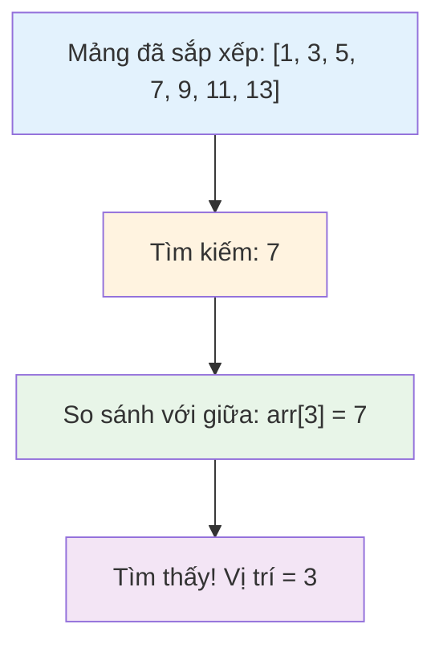

# Bài 12: Searching Algorithms - Thuật toán tìm kiếm

<div className="border-l-4 border-blue-500 bg-blue-50 p-4 mb-6">
<h2 className="text-xl font-bold text-blue-800 mb-2">🎯 Mục tiêu bài học</h2>
<p className="text-blue-700">Hiểu và nắm vững các thuật toán tìm kiếm cơ bản, từ tìm kiếm tuyến tính đến tìm kiếm nhị phân, phân tích độ phức tạp và ứng dụng trong thực tế.</p>
</div>

## 📚 Tổng quan về Searching Algorithms

Thuật toán tìm kiếm là nền tảng của nhiều ứng dụng trong khoa học máy tính. Chúng ta sẽ tìm hiểu các phương pháp tìm kiếm khác nhau và khi nào nên sử dụng từng loại.

```mermaid
graph TD
    A[Searching Algorithms] --> B[Linear Search]
    A --> C[Binary Search]
    A --> D[Advanced Search]
    
    B --> E[Unsorted Data]
    B --> F[O(n) Complexity]
    
    C --> G[Sorted Data Only]
    C --> H[O(log n) Complexity]
    
    D --> I[Interpolation Search]
    D --> J[Jump Search]
    
    style A fill:#e1f5fe
    style B fill:#f3e5f5
    style C fill:#e8f5e8
    style D fill:#fff3e0
```

## 1. Linear Search (Tìm kiếm tuyến tính)

### 📖 Khái niệm cơ bản

Linear Search là thuật toán tìm kiếm đơn giản nhất, duyệt qua từng phần tử của dữ liệu cho đến khi tìm thấy hoặc kết thúc danh sách.

| Thuộc tính | Giá trị |
|------------|---------|
| Time Complexity | O(n) |
| Space Complexity | O(1) |
| Điều kiện dữ liệu | Không yêu cầu sắp xếp |
| Phù hợp với | Dữ liệu nhỏ, chưa sắp xếp |

### 🔧 Cài đặt bằng Rust

```rust
// Linear Search implementation
fn linear_search<T: PartialEq>(arr: &[T], target: &T) -> Option<usize> {
    for (index, element) in arr.iter().enumerate() {
        if element == target {
            return Some(index);
        }
    }
    None
}

// Linear Search với custom comparator
fn linear_search_with<T, F>(arr: &[T], predicate: F) -> Option<usize>
where
    F: Fn(&T) -> bool,
{
    for (index, element) in arr.iter().enumerate() {
        if predicate(element) {
            return Some(index);
        }
    }
    None
}

// Ví dụ sử dụng
fn main() {
    let numbers = vec![64, 34, 25, 12, 22, 11, 90];
    
    // Tìm kiếm giá trị 25
    match linear_search(&numbers, &25) {
        Some(index) => println!("Tìm thấy 25 tại vị trí: {}", index),
        None => println!("Không tìm thấy 25"),
    }
    
    // Tìm số lớn hơn 50
    match linear_search_with(&numbers, |&x| x > 50) {
        Some(index) => println!("Số đầu tiên > 50 tại vị trí: {}", index),
        None => println!("Không tìm thấy số > 50"),
    }
}
```

<div className="bg-yellow-50 border border-yellow-200 rounded-lg p-4 my-4">
<h4 className="font-bold text-yellow-800 mb-2">💡 Ưu điểm của Linear Search:</h4>
<ul className="text-yellow-700 space-y-1">
<li>• Đơn giản, dễ hiểu và cài đặt</li>
<li>• Hoạt động với mọi loại dữ liệu</li>
<li>• Không yêu cầu dữ liệu phải sắp xếp</li>
<li>• Hiệu quả với dữ liệu nhỏ</li>
</ul>
</div>

## 2. Binary Search (Tìm kiếm nhị phân)

### 📖 Khái niệm cơ bản

Binary Search sử dụng chiến lược "chia để trị", liên tục chia đôi không gian tìm kiếm bằng cách so sánh với phần tử ở giữa.



### 📊 So sánh hiệu suất

| Kích thước mảng | Linear Search | Binary Search |
|----------------|---------------|---------------|
| 1,000 | ~500 so sánh | ~10 so sánh |
| 1,000,000 | ~500,000 so sánh | ~20 so sánh |
| 1,000,000,000 | ~500,000,000 so sánh | ~30 so sánh |

### 🔧 Cài đặt Binary Search

```rust
// Binary Search cơ bản
fn binary_search<T: Ord>(arr: &[T], target: &T) -> Result<usize, usize> {
    let mut left = 0;
    let mut right = arr.len();
    
    while left < right {
        let mid = left + (right - left) / 2;
        
        match arr[mid].cmp(target) {
            std::cmp::Ordering::Equal => return Ok(mid),
            std::cmp::Ordering::Less => left = mid + 1,
            std::cmp::Ordering::Greater => right = mid,
        }
    }
    
    Err(left) // Vị trí để chèn nếu không tìm thấy
}

// Binary Search đệ quy
fn binary_search_recursive<T: Ord>(
    arr: &[T], 
    target: &T, 
    left: usize, 
    right: usize
) -> Option<usize> {
    if left >= right {
        return None;
    }
    
    let mid = left + (right - left) / 2;
    
    match arr[mid].cmp(target) {
        std::cmp::Ordering::Equal => Some(mid),
        std::cmp::Ordering::Less => {
            binary_search_recursive(arr, target, mid + 1, right)
        },
        std::cmp::Ordering::Greater => {
            binary_search_recursive(arr, target, left, mid)
        }
    }
}

// Tìm vị trí đầu tiên của phần tử
fn find_first_occurrence<T: Ord>(arr: &[T], target: &T) -> Option<usize> {
    let mut left = 0;
    let mut right = arr.len();
    let mut result = None;
    
    while left < right {
        let mid = left + (right - left) / 2;
        
        match arr[mid].cmp(target) {
            std::cmp::Ordering::Equal => {
                result = Some(mid);
                right = mid; // Tiếp tục tìm bên trái
            },
            std::cmp::Ordering::Less => left = mid + 1,
            std::cmp::Ordering::Greater => right = mid,
        }
    }
    
    result
}

// Tìm vị trí cuối cùng của phần tử
fn find_last_occurrence<T: Ord>(arr: &[T], target: &T) -> Option<usize> {
    let mut left = 0;
    let mut right = arr.len();
    let mut result = None;
    
    while left < right {
        let mid = left + (right - left) / 2;
        
        match arr[mid].cmp(target) {
            std::cmp::Ordering::Equal => {
                result = Some(mid);
                left = mid + 1; // Tiếp tục tìm bên phải
            },
            std::cmp::Ordering::Less => left = mid + 1,
            std::cmp::Ordering::Greater => right = mid,
        }
    }
    
    result
}
```

## 3. Binary Search Variants

### 3.1 Lower Bound và Upper Bound

```rust
// Tìm vị trí đầu tiên >= target (lower_bound)
fn lower_bound<T: Ord>(arr: &[T], target: &T) -> usize {
    let mut left = 0;
    let mut right = arr.len();
    
    while left < right {
        let mid = left + (right - left) / 2;
        
        if arr[mid] < *target {
            left = mid + 1;
        } else {
            right = mid;
        }
    }
    
    left
}

// Tìm vị trí đầu tiên > target (upper_bound)
fn upper_bound<T: Ord>(arr: &[T], target: &T) -> usize {
    let mut left = 0;
    let mut right = arr.len();
    
    while left < right {
        let mid = left + (right - left) / 2;
        
        if arr[mid] <= *target {
            left = mid + 1;
        } else {
            right = mid;
        }
    }
    
    left
}

// Đếm số lần xuất hiện của target
fn count_occurrences<T: Ord>(arr: &[T], target: &T) -> usize {
    let lower = lower_bound(arr, target);
    let upper = upper_bound(arr, target);
    
    if lower < arr.len() && arr[lower] == *target {
        upper - lower
    } else {
        0
    }
}
```

## 4. Interpolation Search

### 📖 Khái niệm

Interpolation Search cải thiện Binary Search bằng cách ước tính vị trí tối ưu dựa trên giá trị cần tìm, đặc biệt hiệu quả với dữ liệu phân bố đều.

<div className="bg-gray-50 border border-gray-200 rounded-lg p-4 my-4">
<h4 className="font-bold text-gray-800 mb-2">📈 Công thức Interpolation:</h4>
<code className="bg-white px-2 py-1 rounded text-sm">
pos = low + [(target - arr[low]) / (arr[high] - arr[low])] × (high - low)
</code>
</div>

```rust
fn interpolation_search(arr: &[i32], target: i32) -> Option<usize> {
    let mut low = 0;
    let mut high = arr.len() - 1;
    
    while low <= high && target >= arr[low] && target <= arr[high] {
        // Nếu chỉ có 1 phần tử
        if low == high {
            return if arr[low] == target { Some(low) } else { None };
        }
        
        // Tính toán vị trí interpolation
        let pos = low + (
            ((target - arr[low]) as f64 / (arr[high] - arr[low]) as f64) 
            * (high - low) as f64
        ) as usize;
        
        if arr[pos] == target {
            return Some(pos);
        }
        
        if arr[pos] < target {
            low = pos + 1;
        } else {
            high = pos - 1;
        }
    }
    
    None
}
```

## 5. Jump Search

Jump Search kết hợp tìm kiếm nhảy với tìm kiếm tuyến tính, có độ phức tạp O(√n).

```rust
fn jump_search<T: Ord>(arr: &[T], target: &T) -> Option<usize> {
    let n = arr.len();
    let step = (n as f64).sqrt() as usize;
    let mut prev = 0;
    
    // Tìm block chứa target
    while prev < n && arr[std::cmp::min(step, n) - 1] < *target {
        prev = step;
        if prev >= n {
            return None;
        }
    }
    
    // Linear search trong block
    let end = std::cmp::min(prev + step, n);
    for i in prev..end {
        if arr[i] == *target {
            return Some(i);
        }
    }
    
    None
}
```

## 6. So sánh các thuật toán tìm kiếm

| Thuật toán | Time Complexity | Space | Điều kiện | Tốt nhất cho |
|------------|----------------|-------|-----------|--------------|
| Linear Search | O(n) | O(1) | Không | Dữ liệu nhỏ, chưa sắp xếp |
| Binary Search | O(log n) | O(1) | Đã sắp xếp | Dữ liệu lớn, đã sắp xếp |
| Interpolation | O(log log n)* | O(1) | Phân bố đều | Dữ liệu số, phân bố đều |
| Jump Search | O(√n) | O(1) | Đã sắp xếp | Trung gian, không gian hạn chế |

*Trong trường hợp tốt nhất

## 7. Ứng dụng thực tế

### 7.1 Binary Search trong optimization

```rust
// Tìm căn bậc hai bằng Binary Search
fn sqrt_binary_search(x: f64, precision: f64) -> f64 {
    let mut left = 0.0;
    let mut right = if x > 1.0 { x } else { 1.0 };
    
    while (right - left) > precision {
        let mid = left + (right - left) / 2.0;
        let square = mid * mid;
        
        if square < x {
            left = mid;
        } else {
            right = mid;
        }
    }
    
    (left + right) / 2.0
}

// Tìm điểm peak trong mảng
fn find_peak_element(arr: &[i32]) -> Option<usize> {
    let mut left = 0;
    let mut right = arr.len() - 1;
    
    while left < right {
        let mid = left + (right - left) / 2;
        
        if arr[mid] > arr[mid + 1] {
            right = mid;
        } else {
            left = mid + 1;
        }
    }
    
    Some(left)
}
```

## 8. Các lỗi thường gặp và cách tránh

<div className="bg-red-50 border border-red-200 rounded-lg p-4 my-4">
<h4 className="font-bold text-red-800 mb-2">⚠️ Lưu ý quan trọng:</h4>
<ul className="text-red-700 space-y-1">
<li>• <strong>Integer Overflow:</strong> Sử dụng <code>left + (right - left) / 2</code> thay vì <code>(left + right) / 2</code></li>
<li>• <strong>Infinite Loop:</strong> Đảm bảo left và right được cập nhật đúng cách</li>
<li>• <strong>Off-by-one:</strong> Cẩn thận với điều kiện dừng và boundaries</li>
<li>• <strong>Empty Array:</strong> Kiểm tra kích thước mảng trước khi tìm kiếm</li>
</ul>
</div>

## 🎯 Tóm tắt

- **Linear Search**: Đơn giản, O(n), không yêu cầu sắp xếp
- **Binary Search**: Hiệu quả, O(log n), yêu cầu dữ liệu đã sắp xếp
- **Variants**: First/Last occurrence, Lower/Upper bound
- **Advanced**: Interpolation Search, Jump Search
- **Applications**: Optimization problems, finding peaks, square root

## 📝 Bài tập LeetCode liên quan

### Cấp độ Easy:
- [704. Binary Search](https://leetcode.com/problems/binary-search/)
- [35. Search Insert Position](https://leetcode.com/problems/search-insert-position/)
- [278. First Bad Version](https://leetcode.com/problems/first-bad-version/)
- [367. Valid Perfect Square](https://leetcode.com/problems/valid-perfect-square/)

### Cấp độ Medium:
- [34. Find First and Last Position of Element in Sorted Array](https://leetcode.com/problems/find-first-and-last-position-of-element-in-sorted-array/)
- [33. Search in Rotated Sorted Array](https://leetcode.com/problems/search-in-rotated-sorted-array/)
- [153. Find Minimum in Rotated Sorted Array](https://leetcode.com/problems/find-minimum-in-rotated-sorted-array/)
- [162. Find Peak Element](https://leetcode.com/problems/find-peak-element/)
- [74. Search a 2D Matrix](https://leetcode.com/problems/search-a-2d-matrix/)

### Cấp độ Hard:
- [4. Median of Two Sorted Arrays](https://leetcode.com/problems/median-of-two-sorted-arrays/)
- [154. Find Minimum in Rotated Sorted Array II](https://leetcode.com/problems/find-minimum-in-rotated-sorted-array-ii/)

<div className="mt-8 p-4 bg-green-50 border border-green-200 rounded-lg">
<h4 className="font-bold text-green-800 mb-2">✅ Checkpoint</h4>
<p className="text-green-700">Bạn đã hoàn thành Bài 12! Hãy thực hành với các bài tập LeetCode để củng cố kiến thức về thuật toán tìm kiếm.</p>
</div>