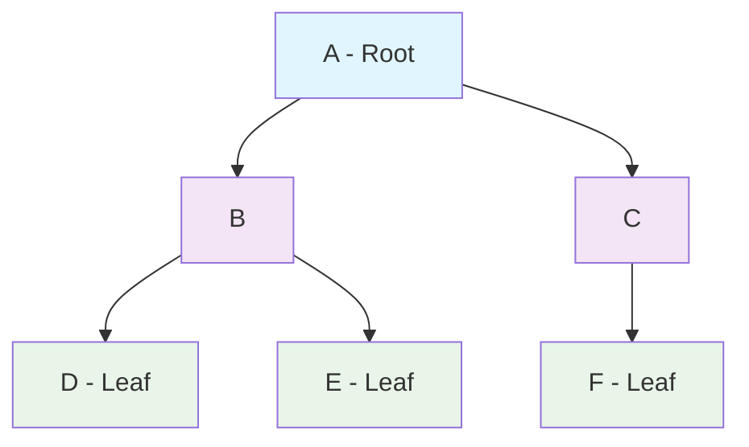
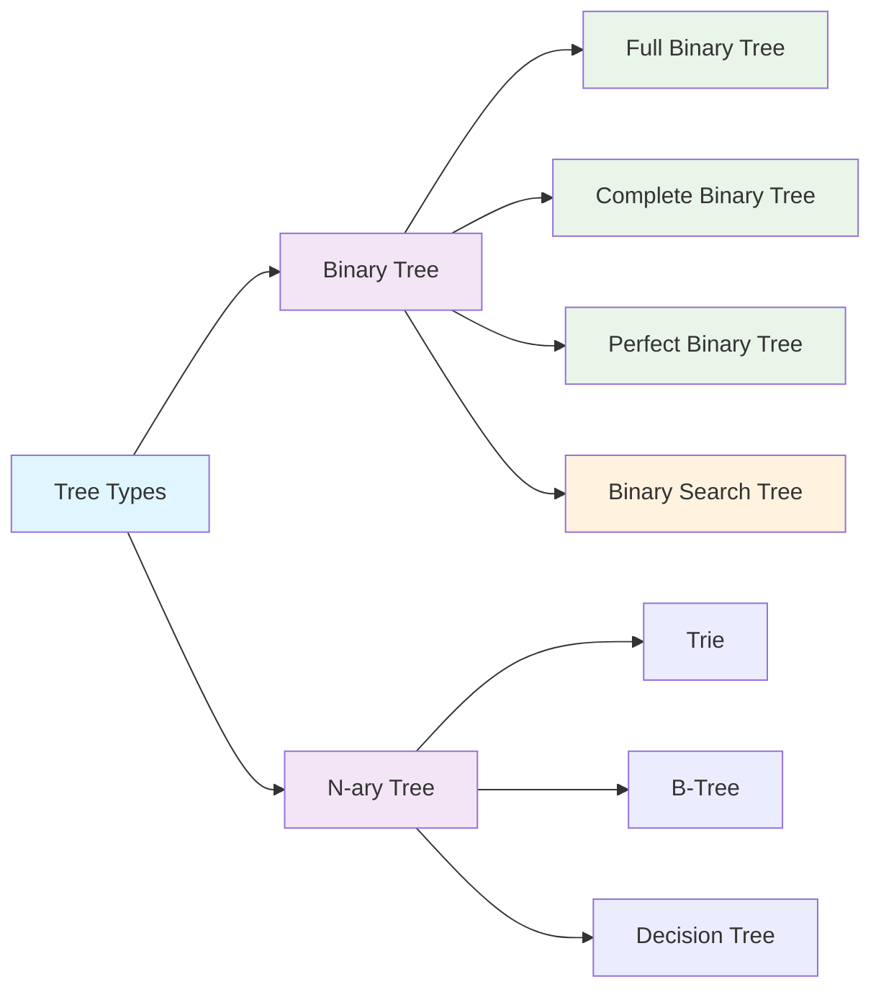

# Bài 13: Tree Data Structures Basics
## Cấu trúc dữ liệu cây cơ bản

---

<div className="bg-gradient-to-r from-blue-50 to-indigo-50 p-6 rounded-lg border border-blue-200 mb-6">
<h3 className="text-xl font-semibold text-blue-800 mb-3">🎯 Mục tiêu học tập</h3>
<div className="text-blue-700">
<p><strong>Sau bài học này, bạn sẽ có thể:</strong></p>
<ul className="list-disc list-inside space-y-1 mt-2">
<li>Hiểu các khái niệm cơ bản về cấu trúc cây</li>
<li>Cài đặt Binary Tree bằng Rust</li>
<li>Thực hiện các thao tác cơ bản trên cây</li>
<li>Phân tích độ phức tạp của các thao tác trên cây</li>
</ul>
</div>
</div>

## 1. Khái niệm cơ bản về Tree

### 1.1 Định nghĩa Tree

**Tree** là một cấu trúc dữ liệu phi tuyến tính bao gồm các **node** được kết nối bởi các **edge**, tạo thành một cấu trúc phân cấp.

### 1.2 Các thuật ngữ quan trọng

| Thuật ngữ | Định nghĩa | Ví dụ |
|-----------|------------|-------|
| **Root** | Node gốc, không có parent | Node A |
| **Parent** | Node cha của node khác | A là parent của B, C |
| **Child** | Node con của node khác | B, C là child của A |
| **Leaf** | Node không có child nào | Node D, E, F |
| **Sibling** | Các node có cùng parent | B và C là sibling |
| **Height** | Độ cao của cây (từ root đến leaf xa nhất) | 2 |
| **Depth** | Độ sâu của node (từ root đến node đó) | Depth của D = 2 |
| **Level** | Mức độ của node (bắt đầu từ 0 hoặc 1) | Root ở level 0 |

### 1.3 Sơ đồ minh họa cấu trúc Tree



## 2. Binary Tree - Cây nhị phân

### 2.1 Định nghĩa Binary Tree

**Binary Tree** là một cây đặc biệt trong đó mỗi node có tối đa **2 node con**, được gọi là **left child** và **right child**.

### 2.2 Các loại Binary Tree

| Loại Tree | Đặc điểm | Hình minh họa |
|-----------|----------|---------------|
| **Full Binary Tree** | Mọi node có 0 hoặc 2 child | Không có node có 1 child |
| **Complete Binary Tree** | Tất cả level đều đầy, trừ level cuối (đầy từ trái sang phải) | Sử dụng trong Heap |
| **Perfect Binary Tree** | Tất cả level đều đầy hoàn toàn | 2^h - 1 nodes |

<div className="bg-yellow-50 border border-yellow-200 rounded-lg p-4 mb-4">
<h4 className="font-semibold text-yellow-800 mb-2">💡 Lưu ý quan trọng</h4>
<p className="text-yellow-700">Perfect Binary Tree có đúng 2^h - 1 nodes, trong đó h là height của cây.</p>
</div>

## 3. Cài đặt Binary Tree bằng Rust

### 3.1 Định nghĩa Node Structure

```rust
use std::rc::Rc;
use std::cell::RefCell;

// Định nghĩa Node cho Binary Tree
#[derive(Debug, Clone)]
pub struct TreeNode<T> {
    pub value: T,
    pub left: Option<Rc<RefCell<TreeNode<T>>>>,
    pub right: Option<Rc<RefCell<TreeNode<T>>>>,
}

impl<T> TreeNode<T> {
    // Tạo một node mới
    pub fn new(value: T) -> Self {
        TreeNode {
            value,
            left: None,
            right: None,
        }
    }
    
    // Tạo node với reference counting
    pub fn new_rc(value: T) -> Rc<RefCell<Self>> {
        Rc::new(RefCell::new(TreeNode::new(value)))
    }
}
```

### 3.2 Cài đặt Binary Tree Class

```rust
pub struct BinaryTree<T> {
    pub root: Option<Rc<RefCell<TreeNode<T>>>>,
}

impl<T: Clone + PartialEq + std::fmt::Debug> BinaryTree<T> {
    // Tạo cây rỗng
    pub fn new() -> Self {
        BinaryTree { root: None }
    }
    
    // Kiểm tra cây có rỗng không
    pub fn is_empty(&self) -> bool {
        self.root.is_none()
    }
    
    // Tính height của cây
    pub fn height(&self) -> usize {
        Self::calculate_height(&self.root)
    }
    
    // Helper function để tính height
    fn calculate_height(node: &Option<Rc<RefCell<TreeNode<T>>>>) -> usize {
        match node {
            None => 0,
            Some(n) => {
                let node_ref = n.borrow();
                let left_height = Self::calculate_height(&node_ref.left);
                let right_height = Self::calculate_height(&node_ref.right);
                1 + left_height.max(right_height)
            }
        }
    }
    
    // Đếm số node trong cây
    pub fn count_nodes(&self) -> usize {
        Self::count_nodes_recursive(&self.root)
    }
    
    fn count_nodes_recursive(node: &Option<Rc<RefCell<TreeNode<T>>>>) -> usize {
        match node {
            None => 0,
            Some(n) => {
                let node_ref = n.borrow();
                1 + Self::count_nodes_recursive(&node_ref.left) 
                  + Self::count_nodes_recursive(&node_ref.right)
            }
        }
    }
}
```

## 4. Các thao tác cơ bản trên Binary Tree

### 4.1 Bảng so sánh độ phức tạp

| Thao tác | Độ phức tạp thời gian | Độ phức tạp không gian | Ghi chú |
|----------|---------------------|----------------------|---------|
| **Tạo cây** | O(1) | O(1) | Chỉ tạo root |
| **Tính height** | O(n) | O(h) | h = height của cây |
| **Đếm nodes** | O(n) | O(h) | Duyệt tất cả nodes |
| **Tìm kiếm** | O(n) | O(h) | Worst case: linear |
| **Chèn node** | O(1) | O(1) | Nếu biết vị trí |

### 4.2 Cài đặt thêm các thao tác

```rust
impl<T: Clone + PartialEq + std::fmt::Debug> BinaryTree<T> {
    // Tìm node có giá trị cụ thể
    pub fn search(&self, target: &T) -> bool {
        Self::search_recursive(&self.root, target)
    }
    
    fn search_recursive(node: &Option<Rc<RefCell<TreeNode<T>>>>, target: &T) -> bool {
        match node {
            None => false,
            Some(n) => {
                let node_ref = n.borrow();
                if node_ref.value == *target {
                    true
                } else {
                    Self::search_recursive(&node_ref.left, target) ||
                    Self::search_recursive(&node_ref.right, target)
                }
            }
        }
    }
    
    // Tìm giá trị lớn nhất
    pub fn find_max(&self) -> Option<T> {
        Self::find_max_recursive(&self.root)
    }
    
    fn find_max_recursive(node: &Option<Rc<RefCell<TreeNode<T>>>>) -> Option<T>
    where T: PartialOrd {
        match node {
            None => None,
            Some(n) => {
                let node_ref = n.borrow();
                let mut max_val = node_ref.value.clone();
                
                if let Some(left_max) = Self::find_max_recursive(&node_ref.left) {
                    if left_max > max_val {
                        max_val = left_max;
                    }
                }
                
                if let Some(right_max) = Self::find_max_recursive(&node_ref.right) {
                    if right_max > max_val {
                        max_val = right_max;
                    }
                }
                
                Some(max_val)
            }
        }
    }
}
```

## 5. Memory Representation

### 5.1 Array vs Linked Structure

<div className="grid grid-cols-1 md:grid-cols-2 gap-4 mb-6">
<div className="bg-green-50 border border-green-200 rounded-lg p-4">
<h4 className="font-semibold text-green-800 mb-2">📊 Array Representation</h4>
<div className="text-green-700 text-sm">
<strong>Ưu điểm:</strong> Tiết kiệm bộ nhớ, truy cập nhanh<br />
<strong>Nhược điểm:</strong> Khó thay đổi kích thước, lãng phí với cây thưa
</div>
</div>
<div className="bg-blue-50 border border-blue-200 rounded-lg p-4">
<h4 className="font-semibold text-blue-800 mb-2">🔗 Linked Structure</h4>
<div className="text-blue-700 text-sm">
<strong>Ưu điểm:</strong> Linh hoạt, dễ mở rộng<br />
<strong>Nhược điểm:</strong> Tốn bộ nhớ cho pointers, cache locality kém
</div>
</div>
</div>

### 5.2 Array Representation Example

| Index | 0 | 1 | 2 | 3 | 4 | 5 | 6 |
|-------|---|---|---|---|---|---|---|
| Value | A | B | C | D | E | F | - |
| Relation | Root | Left(A) | Right(A) | Left(B) | Right(B) | Left(C) | Right(C) |

**Công thức quan trọng:**
- Left child của node i: `2*i + 1`
- Right child của node i: `2*i + 2`
- Parent của node i: `(i-1)/2`

## 6. Ví dụ thực hành

### 6.1 Tạo và sử dụng Binary Tree

```rust
fn main() {
    // Tạo Binary Tree
    let mut tree = BinaryTree::new();
    
    // Tạo root node
    let root = TreeNode::new_rc(1);
    let left_child = TreeNode::new_rc(2);
    let right_child = TreeNode::new_rc(3);
    
    // Kết nối các node
    root.borrow_mut().left = Some(left_child.clone());
    root.borrow_mut().right = Some(right_child.clone());
    
    // Thêm leaf nodes
    left_child.borrow_mut().left = Some(TreeNode::new_rc(4));
    left_child.borrow_mut().right = Some(TreeNode::new_rc(5));
    
    tree.root = Some(root);
    
    // Test các thao tác
    println!("Height: {}", tree.height());        // Output: 3
    println!("Nodes count: {}", tree.count_nodes()); // Output: 5
    println!("Search 4: {}", tree.search(&4));    // Output: true
    println!("Search 10: {}", tree.search(&10));  // Output: false
}
```

## 7. Sơ đồ tổng kết các loại Tree



<div className="bg-red-50 border border-red-200 rounded-lg p-4 mb-6">
<h4 className="font-semibold text-red-800 mb-2">⚠️ Lưu ý quan trọng</h4>
<div className="text-red-700 text-sm">
<div><strong>Rust Memory Safety:</strong> Sử dụng Rc&lt;RefCell&lt;T&gt;&gt; để tránh ownership conflicts khi có multiple references đến cùng một node.</div>
<div><strong>Performance:</strong> Binary Tree thông thường không đảm bảo balanced, có thể degrade thành linked list (O(n) operations).</div>
</div>
</div>

## 8. Bài tập LeetCode liên quan

### 8.1 Bài tập cơ bản
| Bài số | Tên bài | Độ khó | Kỹ năng cần thiết |
|--------|---------|---------|-------------------|
| **104** | Maximum Depth of Binary Tree | Easy | Recursion, Tree height |
| **111** | Minimum Depth of Binary Tree | Easy | BFS/DFS, Edge cases |
| **100** | Same Tree | Easy | Tree comparison |
| **101** | Symmetric Tree | Easy | Recursion, Mirror check |

### 8.2 Bài tập nâng cao
| Bài số | Tên bài | Độ khó | Kỹ năng cần thiết |
|--------|---------|---------|-------------------|
| **110** | Balanced Binary Tree | Easy | Height calculation |
| **222** | Count Complete Tree Nodes | Medium | Binary search, Complete tree |
| **226** | Invert Binary Tree | Easy | Tree manipulation |
| **543** | Diameter of Binary Tree | Easy | Path length calculation |

---

<div className="bg-gradient-to-r from-green-50 to-blue-50 p-6 rounded-lg border border-green-200">
<h3 className="text-xl font-semibold text-green-800 mb-3">🎉 Tổng kết</h3>
<div className="text-green-700">
<p>Bài học này đã giúp bạn:</p>
<ul className="list-disc list-inside space-y-1 mt-2">
<li>Hiểu các khái niệm cơ bản về Tree data structure</li>
<li>Cài đặt Binary Tree bằng Rust một cách an toàn và hiệu quả</li>
<li>Thực hiện các thao tác cơ bản: tính height, đếm nodes, tìm kiếm</li>
<li>Phân biệt các loại Binary Tree khác nhau</li>
<li>Chuẩn bị cho việc học Tree Traversal trong bài tiếp theo</li>
</ul>
</div>
</div>

**Bài tiếp theo:** [Bài 14: Tree Traversal Algorithms]()