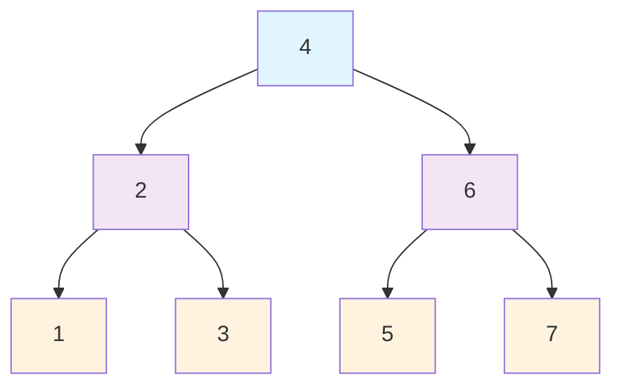
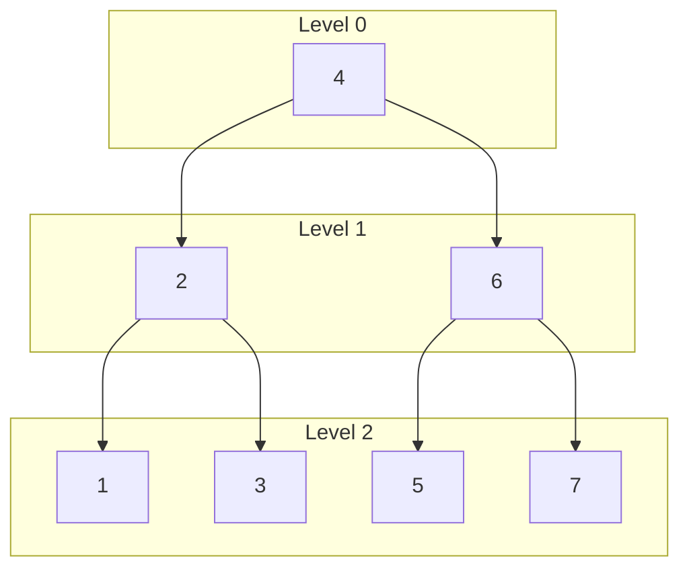

# Bài 14: Tree Traversal Algorithms - Thuật toán duyệt cây

<div className="bg-gradient-to-r from-blue-50 to-indigo-100 p-6 rounded-lg border-l-4 border-blue-500 mb-8">
  <h2 className="text-2xl font-bold text-blue-800 mb-2">🎯 Mục tiêu học tập</h2>
  <p className="text-blue-700">Nắm vững các thuật toán duyệt cây cơ bản và ứng dụng thực tế của chúng trong việc xử lý dữ liệu cây.</p>
</div>

## 📖 Giới thiệu

Duyệt cây (Tree Traversal) là quá trình truy cập và xử lý tất cả các node trong cây theo một thứ tự nhất định. Đây là kỹ thuật cơ bản và quan trọng nhất khi làm việc với cấu trúc dữ liệu cây.

<div className="bg-yellow-50 border-l-4 border-yellow-500 p-4 my-6">
  <h3 className="font-bold text-yellow-800">💡 Tại sao cần duyệt cây?</h3>
  <ul className="text-yellow-700 mt-2">
    <li>Tìm kiếm phần tử trong cây</li>
    <li>Tính toán các giá trị tổng hợp (sum, max, min)</li>
    <li>Sao chép hoặc serialize cây</li>
    <li>Xây dựng biểu thức toán học từ cây</li>
  </ul>
</div>

## 🌳 Các loại thuật toán duyệt cây

Có hai nhóm chính các thuật toán duyệt cây:

| **Nhóm** | **Thuật toán** | **Đặc điểm** | **Độ phức tạp** |
|----------|----------------|--------------|-----------------|
| **Depth-First** | In-order | Trái → Gốc → Phải | O(n) |
| **Depth-First** | Pre-order | Gốc → Trái → Phải | O(n) |
| **Depth-First** | Post-order | Trái → Phải → Gốc | O(n) |
| **Breadth-First** | Level-order | Theo từng mức | O(n) |

## 🔍 1. In-order Traversal (LNR)

**Thứ tự:** Trái → Node → Phải

### Biểu đồ minh họa



**Kết quả:** 1 → 2 → 3 → 4 → 5 → 6 → 7

### Cài đặt bằng Rust

#### Cấu trúc dữ liệu cây

```rust
#[derive(Debug, Clone)]
struct TreeNode {
    val: i32,
    left: Option<Box<TreeNode>>,
    right: Option<Box<TreeNode>>,
}

impl TreeNode {
    fn new(val: i32) -> Self {
        TreeNode {
            val,
            left: None,
            right: None,
        }
    }
}
```

#### In-order Recursive

```rust
fn inorder_recursive(root: &Option<Box<TreeNode>>, result: &mut Vec<i32>) {
    if let Some(node) = root {
        // Duyệt cây con trái
        inorder_recursive(&node.left, result);
        
        // Xử lý node hiện tại
        result.push(node.val);
        
        // Duyệt cây con phải
        inorder_recursive(&node.right, result);
    }
}
```

#### In-order Iterative

```rust
fn inorder_iterative(root: Option<Box<TreeNode>>) -> Vec<i32> {
    let mut result = Vec::new();
    let mut stack = Vec::new();
    let mut current = root;
    
    while current.is_some() || !stack.is_empty() {
        // Đi đến node trái nhất
        while let Some(node) = current {
            stack.push(node.clone());
            current = node.left;
        }
        
        // Xử lý node
        if let Some(node) = stack.pop() {
            result.push(node.val);
            current = node.right;
        }
    }
    
    result
}
```

<div className="bg-green-50 border-l-4 border-green-500 p-4 my-6">
  <h3 className="font-bold text-green-800">✅ Ứng dụng In-order</h3>
  <p className="text-green-700">Trong Binary Search Tree, In-order traversal cho ra dãy số đã được sắp xếp tăng dần!</p>
</div>

## 🔍 2. Pre-order Traversal (NLR)

**Thứ tự:** Node → Trái → Phải

### Cài đặt bằng Rust

#### Pre-order Recursive

```rust
fn preorder_recursive(root: &Option<Box<TreeNode>>, result: &mut Vec<i32>) {
    if let Some(node) = root {
        // Xử lý node hiện tại trước
        result.push(node.val);
        
        // Duyệt cây con trái
        preorder_recursive(&node.left, result);
        
        // Duyệt cây con phải
        preorder_recursive(&node.right, result);
    }
}
```

#### Pre-order Iterative

```rust
fn preorder_iterative(root: Option<Box<TreeNode>>) -> Vec<i32> {
    let mut result = Vec::new();
    let mut stack = Vec::new();
    
    if let Some(root_node) = root {
        stack.push(root_node);
    }
    
    while let Some(node) = stack.pop() {
        // Xử lý node hiện tại
        result.push(node.val);
        
        // Push right first (vì stack là LIFO)
        if let Some(right) = node.right {
            stack.push(right);
        }
        
        // Push left second
        if let Some(left) = node.left {
            stack.push(left);
        }
    }
    
    result
}
```

## 🔍 3. Post-order Traversal (LRN)

**Thứ tự:** Trái → Phải → Node

### Cài đặt bằng Rust

#### Post-order Recursive

```rust
fn postorder_recursive(root: &Option<Box<TreeNode>>, result: &mut Vec<i32>) {
    if let Some(node) = root {
        // Duyệt cây con trái
        postorder_recursive(&node.left, result);
        
        // Duyệt cây con phải
        postorder_recursive(&node.right, result);
        
        // Xử lý node hiện tại cuối cùng
        result.push(node.val);
    }
}
```

#### Post-order Iterative (sử dụng 2 stack)

```rust
fn postorder_iterative(root: Option<Box<TreeNode>>) -> Vec<i32> {
    let mut result = Vec::new();
    let mut stack1 = Vec::new();
    let mut stack2 = Vec::new();
    
    if let Some(root_node) = root {
        stack1.push(root_node);
    }
    
    // Bước 1: Đưa tất cả node vào stack2 theo thứ tự ngược
    while let Some(node) = stack1.pop() {
        stack2.push(node.val);
        
        if let Some(left) = node.left {
            stack1.push(left);
        }
        
        if let Some(right) = node.right {
            stack1.push(right);
        }
    }
    
    // Bước 2: Pop từ stack2 để có thứ tự đúng
    while let Some(val) = stack2.pop() {
        result.push(val);
    }
    
    result
}
```

<div className="bg-purple-50 border-l-4 border-purple-500 p-4 my-6">
  <h3 className="font-bold text-purple-800">🎯 Ứng dụng Post-order</h3>
  <p className="text-purple-700">Thích hợp để tính toán kích thước cây con, xóa cây, hoặc đánh giá biểu thức toán học.</p>
</div>

## 🔍 4. Level-order Traversal (BFS)

**Thứ tự:** Theo từng mức từ trên xuống dưới, trái sang phải

### Biểu đồ minh họa các mức



### Cài đặt bằng Rust

```rust
use std::collections::VecDeque;

fn level_order_traversal(root: Option<Box<TreeNode>>) -> Vec<i32> {
    let mut result = Vec::new();
    let mut queue = VecDeque::new();
    
    if let Some(root_node) = root {
        queue.push_back(root_node);
    }
    
    while let Some(node) = queue.pop_front() {
        // Xử lý node hiện tại
        result.push(node.val);
        
        // Thêm con trái vào queue
        if let Some(left) = node.left {
            queue.push_back(left);
        }
        
        // Thêm con phải vào queue
        if let Some(right) = node.right {
            queue.push_back(right);
        }
    }
    
    result
}
```

### Level-order theo từng mức riêng biệt

```rust
fn level_order_by_levels(root: Option<Box<TreeNode>>) -> Vec<Vec<i32>> {
    let mut result = Vec::new();
    let mut queue = VecDeque::new();
    
    if let Some(root_node) = root {
        queue.push_back(root_node);
    }
    
    while !queue.is_empty() {
        let level_size = queue.len();
        let mut current_level = Vec::new();
        
        for _ in 0..level_size {
            if let Some(node) = queue.pop_front() {
                current_level.push(node.val);
                
                if let Some(left) = node.left {
                    queue.push_back(left);
                }
                
                if let Some(right) = node.right {
                    queue.push_back(right);
                }
            }
        }
        
        result.push(current_level);
    }
    
    result
}
```

## 📊 So sánh các thuật toán duyệt

| **Tiêu chí** | **In-order** | **Pre-order** | **Post-order** | **Level-order** |
|--------------|--------------|---------------|----------------|-----------------|
| **Thứ tự** | L-N-R | N-L-R | L-R-N | Theo mức |
| **Space Complexity** | O(h) | O(h) | O(h) | O(w) |
| **Ứng dụng chính** | BST sorting | Tree copy | Tree delete | BFS, Tree size |
| **Stack/Queue** | Stack | Stack | Stack | Queue |

*Trong đó: h = chiều cao cây, w = chiều rộng tối đa của cây*

## 🔧 Ứng dụng thực tế

### 1. Serialize và Deserialize cây

```rust
fn serialize_preorder(root: &Option<Box<TreeNode>>) -> String {
    let mut result = Vec::new();
    serialize_helper(root, &mut result);
    result.join(",")
}

fn serialize_helper(root: &Option<Box<TreeNode>>, result: &mut Vec<String>) {
    match root {
        Some(node) => {
            result.push(node.val.to_string());
            serialize_helper(&node.left, result);
            serialize_helper(&node.right, result);
        }
        None => {
            result.push("null".to_string());
        }
    }
}
```

### 2. Kiểm tra tính đối xứng của cây

```rust
fn is_symmetric(root: Option<Box<TreeNode>>) -> bool {
    match root {
        Some(node) => is_mirror(&node.left, &node.right),
        None => true,
    }
}

fn is_mirror(left: &Option<Box<TreeNode>>, right: &Option<Box<TreeNode>>) -> bool {
    match (left, right) {
        (None, None) => true,
        (Some(l), Some(r)) => {
            l.val == r.val
                && is_mirror(&l.left, &r.right)
                && is_mirror(&l.right, &r.left)
        }
        _ => false,
    }
}
```

### 3. Tìm đường đi từ root đến node

```rust
fn find_path(root: &Option<Box<TreeNode>>, target: i32) -> Vec<i32> {
    let mut path = Vec::new();
    find_path_helper(root, target, &mut path);
    path
}

fn find_path_helper(root: &Option<Box<TreeNode>>, target: i32, path: &mut Vec<i32>) -> bool {
    if let Some(node) = root {
        path.push(node.val);
        
        if node.val == target {
            return true;
        }
        
        if find_path_helper(&node.left, target, path) 
            || find_path_helper(&node.right, target, path) {
            return true;
        }
        
        path.pop(); // Backtrack
    }
    
    false
}
```

<div className="bg-red-50 border-l-4 border-red-500 p-4 my-6">
  <h3 className="font-bold text-red-800">⚠️ Lưu ý quan trọng</h3>
  <ul className="text-red-700 mt-2">
    <li>Recursive approach có thể gây stack overflow với cây sâu</li>
    <li>Iterative approach sử dụng bộ nhớ hiệu quả hơn cho cây lớn</li>
    <li>Level-order cần nhiều bộ nhớ nhất do sử dụng queue</li>
  </ul>
</div>

## 🎯 Bài tập thực hành trên LeetCode

### 🟢 Dễ
1. **[94. Binary Tree Inorder Traversal](https://leetcode.com/problems/binary-tree-inorder-traversal/)**
2. **[144. Binary Tree Preorder Traversal](https://leetcode.com/problems/binary-tree-preorder-traversal/)**
3. **[145. Binary Tree Postorder Traversal](https://leetcode.com/problems/binary-tree-postorder-traversal/)**
4. **[102. Binary Tree Level Order Traversal](https://leetcode.com/problems/binary-tree-level-order-traversal/)**

### 🟡 Trung bình  
1. **[103. Binary Tree Zigzag Level Order Traversal](https://leetcode.com/problems/binary-tree-zigzag-level-order-traversal/)**
2. **[107. Binary Tree Level Order Traversal II](https://leetcode.com/problems/binary-tree-level-order-traversal-ii/)**
3. **[199. Binary Tree Right Side View](https://leetcode.com/problems/binary-tree-right-side-view/)**
4. **[515. Find Largest Value in Each Tree Row](https://leetcode.com/problems/find-largest-value-in-each-tree-row/)**

### 🔴 Khó
1. **[297. Serialize and Deserialize Binary Tree](https://leetcode.com/problems/serialize-and-deserialize-binary-tree/)**
2. **[987. Vertical Order Traversal of a Binary Tree](https://leetcode.com/problems/vertical-order-traversal-of-a-binary-tree/)**

## 📝 Tổng kết

<div className="bg-blue-50 border-l-4 border-blue-500 p-4 my-6">
  <h3 className="font-bold text-blue-800">🎯 Điểm chính cần nhớ</h3>
  <ul className="text-blue-700 mt-2">
    <li><strong>In-order:</strong> Tạo dãy sắp xếp từ BST</li>
    <li><strong>Pre-order:</strong> Sao chép và serialize cây</li>
    <li><strong>Post-order:</strong> Tính toán từ lá lên gốc</li>
    <li><strong>Level-order:</strong> Xử lý theo độ sâu, BFS</li>
    <li>Mỗi thuật toán đều có độ phức tạp thời gian O(n)</li>
    <li>Lựa chọn recursive vs iterative tùy thuộc vào yêu cầu bộ nhớ</li>
  </ul>
</div>

Trong bài tiếp theo, chúng ta sẽ học về **Binary Search Trees (BST)** - một ứng dụng quan trọng của các thuật toán duyệt cây mà chúng ta vừa học!