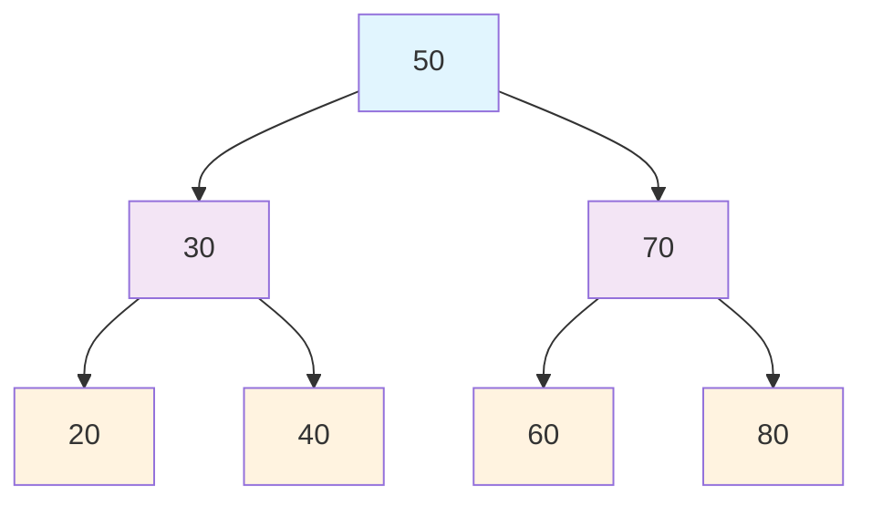
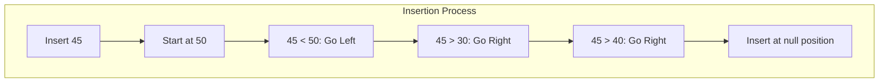
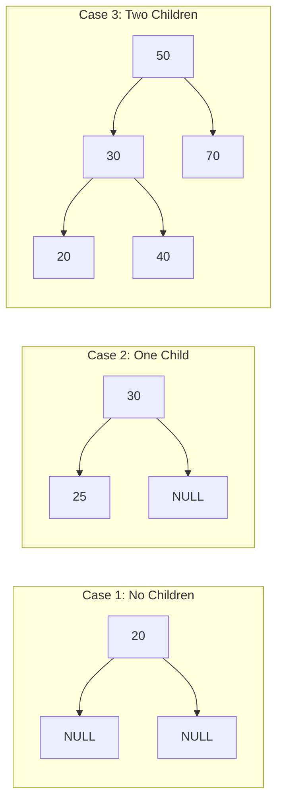
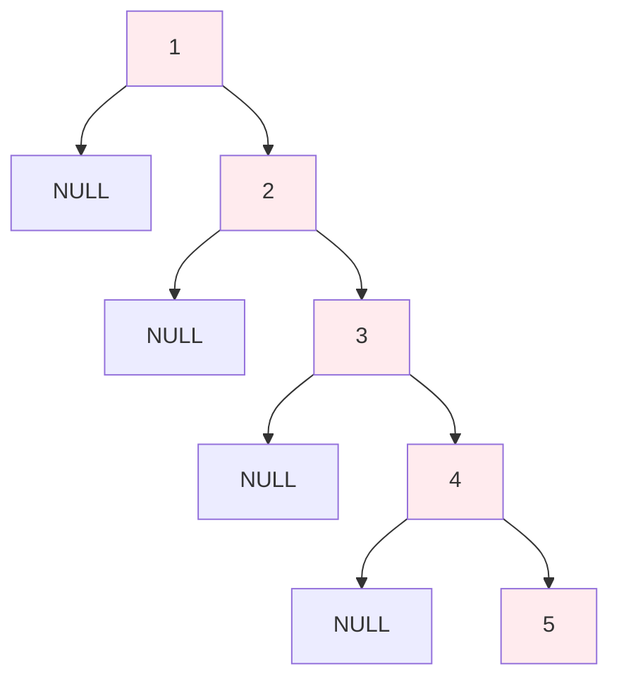

# Bài 15: Binary Search Trees (BST)

## 🎯 Mục tiêu học tập

<div className="bg-blue-50 border-l-4 border-blue-500 p-4 my-4">
  <h3 className="text-lg font-semibold text-blue-800">Sau bài học này, bạn sẽ:</h3>
  <ul className="text-blue-700 mt-2">
    <li>✅ Hiểu được BST property và cách duy trì thứ tự</li>
    <li>✅ Thành thạo các thao tác insertion, search và deletion</li>
    <li>✅ Phân tích độ phức tạp và trường hợp xấu nhất</li>
    <li>✅ Cài đặt BST hoàn chỉnh bằng Rust</li>
  </ul>
</div>

## 📚 1. Khái niệm Binary Search Tree

**Binary Search Tree (BST)** là một cây nhị phân đặc biệt có tính chất:
- Tất cả giá trị ở cây con trái < giá trị node gốc
- Tất cả giá trị ở cây con phải > giá trị node gốc
- Cây con trái và phải cũng là BST

### 🔄 Minh họa BST Property



## 🏗️ 2. Cấu trúc dữ liệu BST

### Định nghĩa Node trong Rust

```rust
#[derive(Debug, Clone)]
pub struct TreeNode {
    pub val: i32,
    pub left: Option<Box<TreeNode>>,
    pub right: Option<Box<TreeNode>>,
}

impl TreeNode {
    pub fn new(val: i32) -> Self {
        TreeNode {
            val,
            left: None,
            right: None,
        }
    }
}

pub struct BST {
    root: Option<Box<TreeNode>>,
}

impl BST {
    pub fn new() -> Self {
        BST { root: None }
    }
}
```

## 🔍 3. Thao tác Search (Tìm kiếm)

### Thuật toán Search

| Bước | Mô tả | Complexity |
|------|-------|------------|
| 1 | So sánh key với node hiện tại | O(1) |
| 2 | Nếu bằng nhau → Tìm thấy | O(1) |
| 3 | Nếu nhỏ hơn → Tìm ở cây con trái | O(log n) |
| 4 | Nếu lớn hơn → Tìm ở cây con phải | O(log n) |

### Cài đặt Search

```rust
impl BST {
    pub fn search(&self, target: i32) -> bool {
        Self::search_recursive(&self.root, target)
    }
    
    fn search_recursive(node: &Option<Box<TreeNode>>, target: i32) -> bool {
        match node {
            None => false,
            Some(n) => {
                if target == n.val {
                    true
                } else if target < n.val {
                    Self::search_recursive(&n.left, target)
                } else {
                    Self::search_recursive(&n.right, target)
                }
            }
        }
    }
}
```

## ➕ 4. Thao tác Insertion (Chèn)

### Quy trình Insertion

<div className="bg-green-50 border border-green-200 rounded-lg p-4 my-4">
  <h4 className="text-green-800 font-semibold">Quy tắc chèn:</h4>
  <ol className="text-green-700 mt-2">
    <li><strong>Bước 1:</strong> Bắt đầu từ root</li>
    <li><strong>Bước 2:</strong> So sánh giá trị cần chèn</li>
    <li><strong>Bước 3:</strong> Đi trái nếu nhỏ hơn, phải nếu lớn hơn</li>
    <li><strong>Bước 4:</strong> Chèn vào vị trí null đầu tiên</li>
  </ol>
</div>



### Cài đặt Insertion

```rust
impl BST {
    pub fn insert(&mut self, val: i32) {
        self.root = Self::insert_recursive(self.root.take(), val);
    }
    
    fn insert_recursive(node: Option<Box<TreeNode>>, val: i32) -> Option<Box<TreeNode>> {
        match node {
            None => Some(Box::new(TreeNode::new(val))),
            Some(mut n) => {
                if val < n.val {
                    n.left = Self::insert_recursive(n.left.take(), val);
                } else if val > n.val {
                    n.right = Self::insert_recursive(n.right.take(), val);
                }
                // Không chèn nếu giá trị đã tồn tại
                Some(n)
            }
        }
    }
}
```

## ❌ 5. Thao tác Deletion (Xóa)

### Ba trường hợp khi xóa node

| Trường hợp | Mô tả | Cách xử lý |
|------------|-------|------------|
| **Case 1** | Node không có con | Xóa trực tiếp |
| **Case 2** | Node có 1 con | Thay thế bằng con duy nhất |
| **Case 3** | Node có 2 con | Thay thế bằng successor hoặc predecessor |

### Minh họa 3 trường hợp deletion



### Cài đặt Deletion

```rust
impl BST {
    pub fn delete(&mut self, val: i32) {
        self.root = Self::delete_recursive(self.root.take(), val);
    }
    
    fn delete_recursive(node: Option<Box<TreeNode>>, val: i32) -> Option<Box<TreeNode>> {
        match node {
            None => None,
            Some(mut n) => {
                if val < n.val {
                    n.left = Self::delete_recursive(n.left.take(), val);
                    Some(n)
                } else if val > n.val {
                    n.right = Self::delete_recursive(n.right.take(), val);
                    Some(n)
                } else {
                    // Node cần xóa được tìm thấy
                    match (n.left.take(), n.right.take()) {
                        // Case 1: Không có con
                        (None, None) => None,
                        // Case 2: Có 1 con
                        (Some(left), None) => Some(left),
                        (None, Some(right)) => Some(right),
                        // Case 3: Có 2 con
                        (Some(left), Some(right)) => {
                            // Tìm successor (giá trị nhỏ nhất ở cây con phải)
                            let min_val = Self::find_min(&right);
                            let mut new_node = TreeNode::new(min_val);
                            new_node.left = Some(left);
                            new_node.right = Self::delete_recursive(Some(right), min_val);
                            Some(Box::new(new_node))
                        }
                    }
                }
            }
        }
    }
    
    fn find_min(node: &Box<TreeNode>) -> i32 {
        match &node.left {
            None => node.val,
            Some(left) => Self::find_min(left),
        }
    }
}
```

## 🚀 6. Các thao tác bổ sung

### Validate BST

```rust
impl BST {
    pub fn is_valid_bst(&self) -> bool {
        Self::validate(&self.root, i32::MIN, i32::MAX)
    }
    
    fn validate(node: &Option<Box<TreeNode>>, min: i32, max: i32) -> bool {
        match node {
            None => true,
            Some(n) => {
                n.val > min && n.val < max
                    && Self::validate(&n.left, min, n.val)
                    && Self::validate(&n.right, n.val, max)
            }
        }
    }
}
```

### Tìm Min/Max

```rust
impl BST {
    pub fn find_min(&self) -> Option<i32> {
        Self::find_min_node(&self.root)
    }
    
    pub fn find_max(&self) -> Option<i32> {
        Self::find_max_node(&self.root)
    }
    
    fn find_min_node(node: &Option<Box<TreeNode>>) -> Option<i32> {
        match node {
            None => None,
            Some(n) => match &n.left {
                None => Some(n.val),
                Some(_) => Self::find_min_node(&n.left),
            }
        }
    }
    
    fn find_max_node(node: &Option<Box<TreeNode>>) -> Option<i32> {
        match node {
            None => None,
            Some(n) => match &n.right {
                None => Some(n.val),
                Some(_) => Self::find_max_node(&n.right),
            }
        }
    }
}
```

## 📊 7. Phân tích độ phức tạp

<div className="overflow-x-auto">
  <table className="min-w-full border border-gray-300">
    <thead className="bg-gray-50">
      <tr>
        <th className="border border-gray-300 px-4 py-2">Thao tác</th>
        <th className="border border-gray-300 px-4 py-2">Best Case</th>
        <th className="border border-gray-300 px-4 py-2">Average Case</th>
        <th className="border border-gray-300 px-4 py-2">Worst Case</th>
        <th className="border border-gray-300 px-4 py-2">Space</th>
      </tr>
    </thead>
    <tbody>
      <tr>
        <td className="border border-gray-300 px-4 py-2 font-semibold">Search</td>
        <td className="border border-gray-300 px-4 py-2">O(log n)</td>
        <td className="border border-gray-300 px-4 py-2">O(log n)</td>
        <td className="border border-gray-300 px-4 py-2 text-red-600">O(n)</td>
        <td className="border border-gray-300 px-4 py-2">O(1)</td>
      </tr>
      <tr className="bg-gray-50">
        <td className="border border-gray-300 px-4 py-2 font-semibold">Insert</td>
        <td className="border border-gray-300 px-4 py-2">O(log n)</td>
        <td className="border border-gray-300 px-4 py-2">O(log n)</td>
        <td className="border border-gray-300 px-4 py-2 text-red-600">O(n)</td>
        <td className="border border-gray-300 px-4 py-2">O(1)</td>
      </tr>
      <tr>
        <td className="border border-gray-300 px-4 py-2 font-semibold">Delete</td>
        <td className="border border-gray-300 px-4 py-2">O(log n)</td>
        <td className="border border-gray-300 px-4 py-2">O(log n)</td>
        <td className="border border-gray-300 px-4 py-2 text-red-600">O(n)</td>
        <td className="border border-gray-300 px-4 py-2">O(1)</td>
      </tr>
    </tbody>
  </table>
</div>

### Trường hợp xấu nhất (Degenerate Tree)



<div className="bg-red-50 border border-red-200 rounded-lg p-4 my-4">
  <p className="text-red-800"><strong>⚠️ Lưu ý:</strong> BST có thể thoái hóa thành danh sách liên kết nếu dữ liệu được chèn theo thứ tự tăng dần hoặc giảm dần, dẫn đến complexity O(n).</p>
</div>

## 🛠️ 8. Ví dụ sử dụng hoàn chỉnh

```rust
fn main() {
    let mut bst = BST::new();
    
    // Chèn dữ liệu
    let values = [50, 30, 70, 20, 40, 60, 80];
    for val in values.iter() {
        bst.insert(*val);
        println!("Inserted: {}", val);
    }
    
    // Tìm kiếm
    println!("Search 40: {}", bst.search(40)); // true
    println!("Search 25: {}", bst.search(25)); // false
    
    // Tìm min/max
    println!("Min: {:?}", bst.find_min()); // Some(20)
    println!("Max: {:?}", bst.find_max()); // Some(80)
    
    // Xóa node
    bst.delete(30);
    println!("After deleting 30:");
    println!("Search 30: {}", bst.search(30)); // false
    
    // Validate BST
    println!("Is valid BST: {}", bst.is_valid_bst()); // true
}
```

## 📝 9. Bài tập thực hành trên LeetCode

### Bài tập cơ bản:
1. **[98. Validate Binary Search Tree](https://leetcode.com/problems/validate-binary-search-tree/)**
2. **[700. Search in a Binary Search Tree](https://leetcode.com/problems/search-in-a-binary-search-tree/)**
3. **[701. Insert into a Binary Search Tree](https://leetcode.com/problems/insert-into-a-binary-search-tree/)**
4. **[450. Delete Node in a BST](https://leetcode.com/problems/delete-node-in-a-bst/)**

### Bài tập nâng cao:
5. **[230. Kth Smallest Element in a BST](https://leetcode.com/problems/kth-smallest-element-in-a-bst/)**
6. **[235. Lowest Common Ancestor of a BST](https://leetcode.com/problems/lowest-common-ancestor-of-a-binary-search-tree/)**
7. **[108. Convert Sorted Array to Binary Search Tree](https://leetcode.com/problems/convert-sorted-array-to-binary-search-tree/)**
8. **[96. Unique Binary Search Trees](https://leetcode.com/problems/unique-binary-search-trees/)**

## 🎯 10. Tóm tắt

<div className="bg-blue-50 border border-blue-200 rounded-lg p-4 my-4">
  <h4 className="text-blue-800 font-semibold mb-2">Điểm quan trọng cần nhớ:</h4>
  <ul className="text-blue-700 space-y-1">
    <li>🔸 BST property: trái nhỏ hơn, phải lớn hơn</li>
    <li>🔸 In-order traversal cho kết quả sorted</li>
    <li>🔸 Average case O(log n), worst case O(n)</li>
    <li>🔸 Deletion có 3 trường hợp cần xử lý</li>
    <li>🔸 Cần cân bằng để tránh degenerate tree</li>
  </ul>
</div>

**Bài tiếp theo:** Chúng ta sẽ học về **AVL Trees** - cách cân bằng BST để đảm bảo hiệu suất O(log n) trong mọi trường hợp!