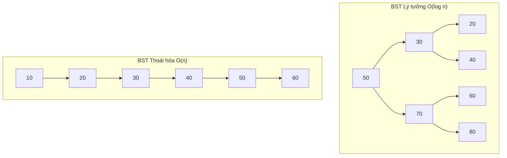
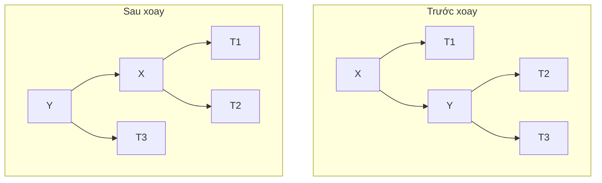
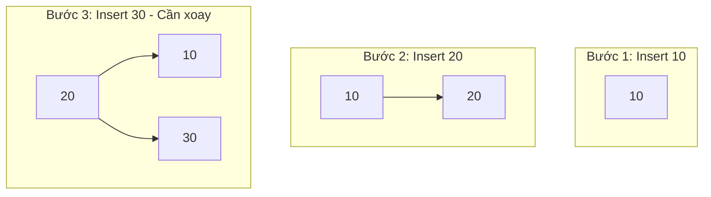

# Bài 16: Balanced Trees - AVL Trees

<div className="bg-gradient-to-r from-blue-50 to-indigo-50 border-l-4 border-blue-500 p-6 mb-8 rounded-r-lg">
  <h2 className="text-2xl font-bold text-blue-800 mb-2">🎯 Mục tiêu học tập</h2>
  <ul className="text-blue-700 space-y-2">
    <li>• Hiểu vấn đề của Binary Search Tree không cân bằng</li>
    <li>• Nắm vững khái niệm AVL Tree và Balance Factor</li>
    <li>• Thực hiện các phép xoay (rotation) để cân bằng cây</li>
    <li>• Cài đặt AVL Tree với các thao tác insert và delete</li>
  </ul>
</div>

## 1. Vấn đề của Binary Search Tree không cân bằng

### 1.1 Tại sao cần cây cân bằng?

Binary Search Tree (BST) thông thường có thể bị thoái hóa thành danh sách liên kết trong trường hợp xấu nhất, dẫn đến hiệu suất O(n) thay vì O(log n).



### 1.2 So sánh hiệu suất

| Thao tác | BST Cân bằng | BST Thoái hóa |
|----------|--------------|---------------|
| Search   | O(log n)     | O(n)          |
| Insert   | O(log n)     | O(n)          |
| Delete   | O(log n)     | O(n)          |

## 2. AVL Tree - Định nghĩa và Tính chất

<div className="bg-green-50 border border-green-200 rounded-lg p-6 mb-6">
  <h3 className="text-xl font-semibold text-green-800 mb-3">📚 Định nghĩa</h3>
  <p className="text-green-700">
    <strong>AVL Tree</strong> là một Binary Search Tree tự cân bằng, trong đó độ chênh lệch chiều cao giữa cây con trái và cây con phải của mỗi node không vượt quá 1.
  </p>
</div>

### 2.1 Balance Factor (Hệ số cân bằng)

**Balance Factor (BF) = Height(Left Subtree) - Height(Right Subtree)**

Trong AVL Tree, Balance Factor của mỗi node phải thuộc tập `{-1, 0, 1}`.

| Balance Factor | Ý nghĩa |
|----------------|---------|
| -1 | Cây con phải cao hơn cây con trái 1 level |
| 0  | Cây con trái và phải có cùng chiều cao |
| 1  | Cây con trái cao hơn cây con phải 1 level |

```rust
#[derive(Debug, Clone)]
struct AVLNode {
    value: i32,
    height: i32,
    left: Option<Box<AVLNode>>,
    right: Option<Box<AVLNode>>,
}

impl AVLNode {
    fn new(value: i32) -> Self {
        AVLNode {
            value,
            height: 1,
            left: None,
            right: None,
        }
    }
    
    fn get_height(node: &Option<Box<AVLNode>>) -> i32 {
        match node {
            Some(n) => n.height,
            None => 0,
        }
    }
    
    fn get_balance_factor(&self) -> i32 {
        Self::get_height(&self.left) - Self::get_height(&self.right)
    }
    
    fn update_height(&mut self) {
        self.height = 1 + std::cmp::max(
            Self::get_height(&self.left),
            Self::get_height(&self.right)
        );
    }
}
```

## 3. Các phép xoay (Rotation Operations)

<div className="bg-yellow-50 border border-yellow-200 rounded-lg p-6 mb-6">
  <h3 className="text-xl font-semibold text-yellow-800 mb-3">⚙️ Bốn loại phép xoay</h3>
  <div className="grid grid-cols-2 gap-4 text-sm">
    <div>
      <strong className="text-yellow-700">Left Rotation (LL)</strong>
      <p className="text-yellow-600">Khi cây con phải nặng về phải</p>
    </div>
    <div>
      <strong className="text-yellow-700">Right Rotation (RR)</strong>
      <p className="text-yellow-600">Khi cây con trái nặng về trái</p>
    </div>
    <div>
      <strong className="text-yellow-700">Left-Right Rotation (LR)</strong>
      <p className="text-yellow-600">Khi cây con trái nặng về phải</p>
    </div>
    <div>
      <strong className="text-yellow-700">Right-Left Rotation (RL)</strong>
      <p className="text-yellow-600">Khi cây con phải nặng về trái</p>
    </div>
  </div>
</div>

### 3.1 Left Rotation (Xoay trái)



```rust
impl AVLNode {
    fn left_rotate(mut x: Box<AVLNode>) -> Box<AVLNode> {
        let mut y = x.right.take().unwrap();
        x.right = y.left.take();
        x.update_height();
        y.left = Some(x);
        y.update_height();
        y
    }
}
```

### 3.2 Right Rotation (Xoay phải)

```rust
impl AVLNode {
    fn right_rotate(mut y: Box<AVLNode>) -> Box<AVLNode> {
        let mut x = y.left.take().unwrap();
        y.left = x.right.take();
        y.update_height();
        x.right = Some(y);
        x.update_height();
        x
    }
}
```

### 3.3 Bảng tổng kết các trường hợp xoay

| Balance Factor | Cây con | Loại xoay cần thiết |
|----------------|---------|-------------------|
| > 1 | Left BF ≥ 0 | Right Rotation |
| > 1 | Left BF < 0 | Left-Right Rotation |
| < -1 | Right BF ≤ 0 | Left Rotation |
| < -1 | Right BF > 0 | Right-Left Rotation |

## 4. Cài đặt AVL Tree

### 4.1 Cấu trúc AVL Tree

```rust
pub struct AVLTree {
    root: Option<Box<AVLNode>>,
}

impl AVLTree {
    pub fn new() -> Self {
        AVLTree { root: None }
    }
    
    pub fn insert(&mut self, value: i32) {
        self.root = Self::insert_node(self.root.take(), value);
    }
    
    pub fn delete(&mut self, value: i32) {
        self.root = Self::delete_node(self.root.take(), value);
    }
    
    pub fn search(&self, value: i32) -> bool {
        Self::search_node(&self.root, value)
    }
}
```

### 4.2 Thao tác Insert với cân bằng

```rust
impl AVLTree {
    fn insert_node(node: Option<Box<AVLNode>>, value: i32) -> Option<Box<AVLNode>> {
        // Bước 1: Thực hiện BST insert bình thường
        let mut node = match node {
            None => return Some(Box::new(AVLNode::new(value))),
            Some(mut n) => {
                if value < n.value {
                    n.left = Self::insert_node(n.left.take(), value);
                } else if value > n.value {
                    n.right = Self::insert_node(n.right.take(), value);
                } else {
                    return Some(n); // Duplicate values not allowed
                }
                n
            }
        };
        
        // Bước 2: Cập nhật height
        node.update_height();
        
        // Bước 3: Tính balance factor
        let balance = node.get_balance_factor();
        
        // Bước 4: Thực hiện rotation nếu cần
        Some(Self::rebalance(node, balance))
    }
    
    fn rebalance(mut node: Box<AVLNode>, balance: i32) -> Box<AVLNode> {
        // Left Heavy
        if balance > 1 {
            let left_balance = node.left.as_ref().unwrap().get_balance_factor();
            if left_balance < 0 {
                // Left-Right case
                node.left = Some(AVLNode::left_rotate(node.left.take().unwrap()));
            }
            // Left-Left case
            return AVLNode::right_rotate(node);
        }
        
        // Right Heavy
        if balance < -1 {
            let right_balance = node.right.as_ref().unwrap().get_balance_factor();
            if right_balance > 0 {
                // Right-Left case
                node.right = Some(AVLNode::right_rotate(node.right.take().unwrap()));
            }
            // Right-Right case
            return AVLNode::left_rotate(node);
        }
        
        node
    }
}
```

### 4.3 Thao tác Delete với cân bằng

```rust
impl AVLTree {
    fn delete_node(node: Option<Box<AVLNode>>, value: i32) -> Option<Box<AVLNode>> {
        let mut node = match node {
            None => return None,
            Some(mut n) => {
                if value < n.value {
                    n.left = Self::delete_node(n.left.take(), value);
                    n
                } else if value > n.value {
                    n.right = Self::delete_node(n.right.take(), value);
                    n
                } else {
                    // Node to be deleted found
                    match (n.left.take(), n.right.take()) {
                        (None, None) => return None,
                        (Some(left), None) => return Some(left),
                        (None, Some(right)) => return Some(right),
                        (Some(left), Some(right)) => {
                            // Find inorder successor
                            let min_val = Self::find_min(&right);
                            n.value = min_val;
                            n.left = Some(left);
                            n.right = Self::delete_node(Some(right), min_val);
                            n
                        }
                    }
                }
            }
        };
        
        node.update_height();
        let balance = node.get_balance_factor();
        Some(Self::rebalance(node, balance))
    }
    
    fn find_min(node: &Box<AVLNode>) -> i32 {
        match &node.left {
            None => node.value,
            Some(left) => Self::find_min(left),
        }
    }
}
```

## 5. Phân tích độ phức tạp

### 5.1 Bảng so sánh hiệu suất

| Thao tác | Time Complexity | Space Complexity |
|----------|----------------|------------------|
| Search   | O(log n)       | O(log n) - recursion |
| Insert   | O(log n)       | O(log n) - recursion |
| Delete   | O(log n)       | O(log n) - recursion |
| Traversal| O(n)           | O(log n) - recursion |

<div className="bg-blue-50 border border-blue-200 rounded-lg p-6 mb-6">
  <h3 className="text-xl font-semibold text-blue-800 mb-3">🔍 Tại sao AVL Tree đảm bảo O(log n)?</h3>
  <p className="text-blue-700 mb-2">
    Vì balance factor luôn trong khoảng [-1, 1], chiều cao của AVL Tree được giới hạn bởi:
  </p>
  <code className="bg-blue-100 px-2 py-1 rounded">h ≤ 1.44 * log₂(n + 2) - 0.33</code>
</div>

## 6. Ví dụ minh họa

### 6.1 Xây dựng AVL Tree từ dãy số [10, 20, 30, 40, 50, 25]



### 6.2 Demo code hoàn chỉnh

```rust
fn main() {
    let mut avl = AVLTree::new();
    
    // Insert sequence
    let values = vec![10, 20, 30, 40, 50, 25];
    for val in values {
        avl.insert(val);
        println!("Inserted {}, Tree height: {}", val, avl.get_height());
    }
    
    // Search operations
    println!("Search 25: {}", avl.search(25)); // true
    println!("Search 35: {}", avl.search(35)); // false
    
    // Delete operation
    avl.delete(30);
    println!("Deleted 30, Tree height: {}", avl.get_height());
}

impl AVLTree {
    pub fn get_height(&self) -> i32 {
        AVLNode::get_height(&self.root)
    }
}
```

## 7. Ưu và nhược điểm

### 7.1 Bảng so sánh với các cấu trúc khác

| Đặc điểm | AVL Tree | BST | Hash Table |
|----------|----------|-----|------------|
| Search | O(log n) | O(n) worst | O(1) average |
| Insert | O(log n) | O(n) worst | O(1) average |
| Delete | O(log n) | O(n) worst | O(1) average |
| Ordered traversal | ✅ | ✅ | ❌ |
| Memory overhead | Cao | Thấp | Trung bình |

### 7.2 Khi nào sử dụng AVL Tree?

<div className="grid grid-cols-1 md:grid-cols-2 gap-4">
  <div className="bg-green-50 border border-green-200 rounded-lg p-4">
    <h4 className="text-lg font-semibold text-green-800 mb-2">✅ Nên sử dụng khi:</h4>
    <ul className="text-green-700 space-y-1 text-sm">
      <li>• Cần search/insert/delete với độ phức tạp ổn định</li>
      <li>• Thực hiện nhiều thao tác search</li>
      <li>• Cần duyệt dữ liệu theo thứ tự</li>
      <li>• Dữ liệu có thể được insert theo thứ tự</li>
    </ul>
  </div>
  
  <div className="bg-red-50 border border-red-200 rounded-lg p-4">
    <h4 className="text-lg font-semibold text-red-800 mb-2">❌ Không nên sử dụng khi:</h4>
    <ul className="text-red-700 space-y-1 text-sm">
      <li>• Thực hiện chủ yếu insert/delete</li>
      <li>• Memory overhead là vấn đề</li>
      <li>• Không cần dữ liệu có thứ tự</li>
      <li>• Chỉ cần average-case performance</li>
    </ul>
  </div>
</div>

## 8. Bài tập thực hành trên LeetCode

### 8.1 Bài tập cơ bản
| Problem | Difficulty | Link |
|---------|------------|------|
| Validate Binary Search Tree | Medium | [LeetCode 98](https://leetcode.com/problems/validate-binary-search-tree/) |
| Convert Sorted Array to Binary Search Tree | Easy | [LeetCode 108](https://leetcode.com/problems/convert-sorted-array-to-binary-search-tree/) |
| Balance a Binary Search Tree | Medium | [LeetCode 1382](https://leetcode.com/problems/balance-a-binary-search-tree/) |

### 8.2 Bài tập nâng cao
| Problem | Difficulty | Link |
|---------|------------|------|
| Delete Node in a BST | Medium | [LeetCode 450](https://leetcode.com/problems/delete-node-in-a-bst/) |
| Construct Binary Tree from Preorder and Inorder | Medium | [LeetCode 105](https://leetcode.com/problems/construct-binary-tree-from-preorder-and-inorder-traversal/) |
| Binary Tree Maximum Path Sum | Hard | [LeetCode 124](https://leetcode.com/problems/binary-tree-maximum-path-sum/) |

<div className="bg-gray-50 border border-gray-200 rounded-lg p-6 mt-8">
  <h3 className="text-xl font-semibold text-gray-800 mb-3">📝 Tóm tắt bài học</h3>
  <div className="text-gray-700 space-y-2">
    <p>• AVL Tree đảm bảo hiệu suất O(log n) cho mọi thao tác cơ bản</p>
    <p>• Balance Factor phải luôn thuộc <code>{'-1, 0, 1'}</code></p>
    <p>• Bốn loại rotation: LL, RR, LR, RL</p>
    <p>• Trade-off giữa performance ổn định và memory overhead</p>
  </div>
</div>

---

**Bài tiếp theo:** Bài 17 - B-Trees và Advanced Tree Structures