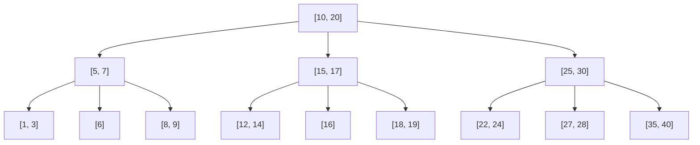
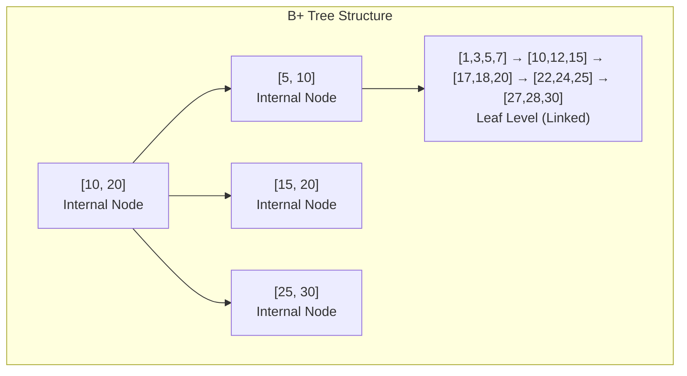
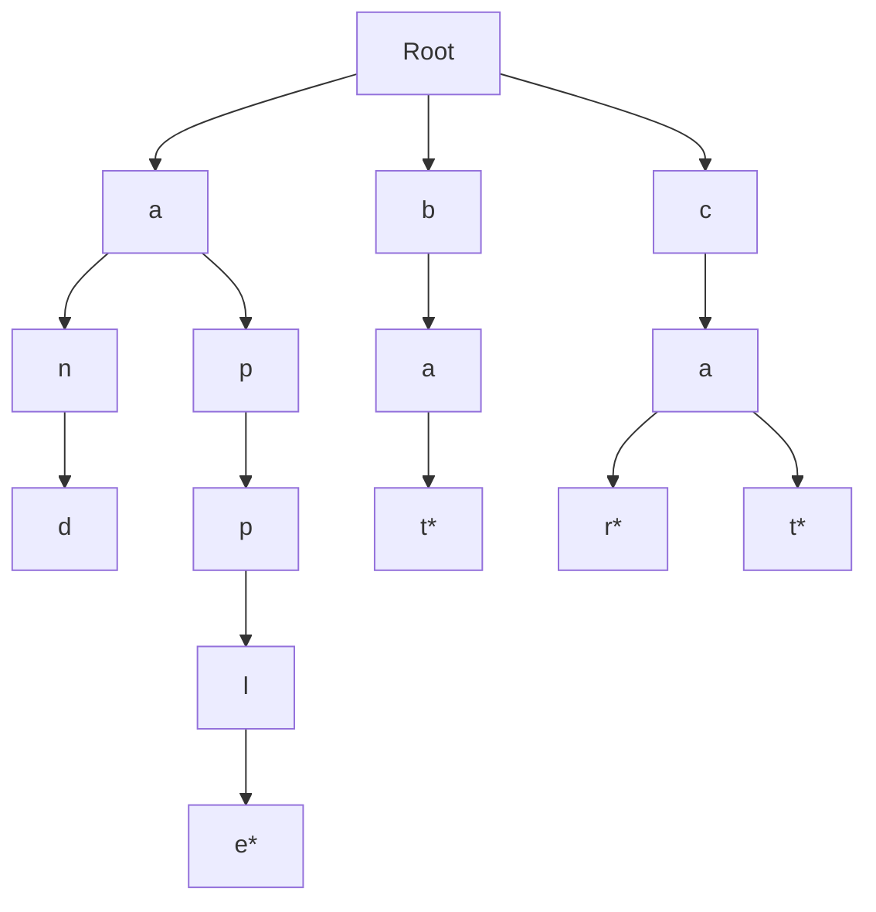
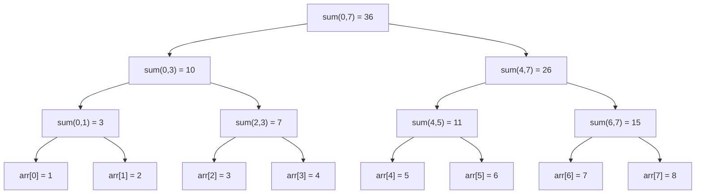

# Bài 17: B-Trees và Advanced Tree Structures

<div className="border-l-4 border-blue-500 bg-blue-50 p-4 mb-6 rounded-r-lg">
  <h2 className="text-xl font-bold text-blue-800 mb-2">🎯 Mục tiêu bài học</h2>
  <p className="text-blue-700">Hiểu và cài đặt các cấu trúc cây nâng cao: B-Tree, B+ Tree, Trie và Segment Tree để xử lý dữ liệu lớn hiệu quả.</p>
</div>

## 1. B-Trees - Cây tìm kiếm cân bằng cho dữ liệu lớn

### 1.1 Khái niệm cơ bản

**B-Tree** là một cây tìm kiếm cân bằng được thiết kế đặc biệt để lưu trữ và truy xuất dữ liệu trên các thiết bị lưu trữ có tốc độ truy cập chậm như ổ cứng.

<div className="bg-yellow-50 border border-yellow-200 rounded-lg p-4 mb-4">
  <h3 className="font-semibold text-yellow-800 mb-2">🔑 Đặc điểm chính của B-Tree</h3>
  <ul className="text-yellow-700 space-y-1">
    <li>• Mỗi node có thể chứa nhiều key (không chỉ 1 như BST)</li>
    <li>• Tất cả leaf nodes ở cùng level (perfectly balanced)</li>
    <li>• Minimizes disk I/O operations</li>
    <li>• Self-balancing structure</li>
  </ul>
</div>

### 1.2 Cấu trúc B-Tree



### 1.3 Properties của B-Tree

| Property | Mô tả | Giá trị |
|----------|-------|---------|
| **Order (m)** | Số con tối đa của một node | Thường là số chẵn |
| **Min keys** | Số key tối thiểu trong internal node | ⌈m/2⌉ - 1 |
| **Max keys** | Số key tối đa trong một node | m - 1 |
| **Min children** | Số con tối thiểu của internal node | ⌈m/2⌉ |
| **Max children** | Số con tối đa của một node | m |

### 1.4 Cài đặt B-Tree trong Rust

```rust
use std::fmt::Debug;

#[derive(Debug, Clone)]
pub struct BTreeNode<T: Ord + Clone + Debug> {
    keys: Vec<T>,
    children: Vec<Box<BTreeNode<T>>>,
    is_leaf: bool,
}

#[derive(Debug)]
pub struct BTree<T: Ord + Clone + Debug> {
    root: Option<Box<BTreeNode<T>>>,
    min_degree: usize, // t trong định nghĩa B-Tree
}

impl<T: Ord + Clone + Debug> BTreeNode<T> {
    fn new(is_leaf: bool) -> Self {
        Self {
            keys: Vec::new(),
            children: Vec::new(),
            is_leaf,
        }
    }
    
    // Tìm kiếm key trong node
    fn search(&self, key: &T) -> bool {
        let mut i = 0;
        
        // Tìm vị trí đầu tiên mà key[i] >= key
        while i < self.keys.len() && key > &self.keys[i] {
            i += 1;
        }
        
        // Nếu tìm thấy key
        if i < self.keys.len() && key == &self.keys[i] {
            return true;
        }
        
        // Nếu là leaf node và không tìm thấy
        if self.is_leaf {
            return false;
        }
        
        // Tìm kiếm trong subtree
        self.children[i].search(key)
    }
    
    // Chèn key khi node chưa full
    fn insert_non_full(&mut self, key: T, min_degree: usize) {
        let mut i = self.keys.len() as i32 - 1;
        
        if self.is_leaf {
            // Chèn vào leaf node
            self.keys.push(key.clone());
            
            // Dịch chuyển các key lớn hơn
            while i >= 0 && self.keys[i as usize] > key {
                self.keys.swap(i as usize, (i + 1) as usize);
                i -= 1;
            }
        } else {
            // Tìm child để chèn
            while i >= 0 && self.keys[i as usize] > key {
                i -= 1;
            }
            i += 1;
            
            // Kiểm tra xem child có full không
            if self.children[i as usize].keys.len() == 2 * min_degree - 1 {
                self.split_child(i as usize, min_degree);
                
                // Sau khi split, xác định child nào để chèn
                if self.keys[i as usize] < key {
                    i += 1;
                }
            }
            
            self.children[i as usize].insert_non_full(key, min_degree);
        }
    }
    
    // Split child node khi full
    fn split_child(&mut self, index: usize, min_degree: usize) {
        let full_child = &mut self.children[index];
        let mut new_child = Box::new(BTreeNode::new(full_child.is_leaf));
        
        // Copy second half của keys
        new_child.keys = full_child.keys.split_off(min_degree);
        
        // Copy second half của children nếu không phải leaf
        if !full_child.is_leaf {
            new_child.children = full_child.children.split_off(min_degree);
        }
        
        // Lấy middle key lên parent
        let middle_key = full_child.keys.pop().unwrap();
        
        // Chèn middle key vào parent
        self.keys.insert(index, middle_key);
        self.children.insert(index + 1, new_child);
    }
}

impl<T: Ord + Clone + Debug> BTree<T> {
    pub fn new(min_degree: usize) -> Self {
        Self {
            root: None,
            min_degree,
        }
    }
    
    pub fn search(&self, key: &T) -> bool {
        match &self.root {
            Some(root) => root.search(key),
            None => false,
        }
    }
    
    pub fn insert(&mut self, key: T) {
        if self.root.is_none() {
            let mut root = BTreeNode::new(true);
            root.keys.push(key);
            self.root = Some(Box::new(root));
            return;
        }
        
        let root = self.root.as_ref().unwrap();
        
        // Nếu root full, cần tạo root mới
        if root.keys.len() == 2 * self.min_degree - 1 {
            let mut new_root = BTreeNode::new(false);
            new_root.children.push(self.root.take().unwrap());
            new_root.split_child(0, self.min_degree);
            
            self.root = Some(Box::new(new_root));
        }
        
        self.root.as_mut().unwrap().insert_non_full(key, self.min_degree);
    }
}
```

### 1.5 Ví dụ về B-Tree Operations

<div className="overflow-x-auto">
  <table className="min-w-full border-collapse border border-gray-300">
    <thead className="bg-gray-100">
      <tr>
        <th className="border border-gray-300 px-4 py-2">Operation</th>
        <th className="border border-gray-300 px-4 py-2">Time Complexity</th>
        <th className="border border-gray-300 px-4 py-2">Description</th>
      </tr>
    </thead>
    <tbody>
      <tr>
        <td className="border border-gray-300 px-4 py-2">Search</td>
        <td className="border border-gray-300 px-4 py-2 font-mono">O(log n)</td>
        <td className="border border-gray-300 px-4 py-2">Tìm kiếm key trong cây</td>
      </tr>
      <tr className="bg-gray-50">
        <td className="border border-gray-300 px-4 py-2">Insert</td>
        <td className="border border-gray-300 px-4 py-2 font-mono">O(log n)</td>
        <td className="border border-gray-300 px-4 py-2">Chèn key mới, có thể cần split nodes</td>
      </tr>
      <tr>
        <td className="border border-gray-300 px-4 py-2">Delete</td>
        <td className="border border-gray-300 px-4 py-2 font-mono">O(log n)</td>
        <td className="border border-gray-300 px-4 py-2">Xóa key, có thể cần merge nodes</td>
      </tr>
      <tr className="bg-gray-50">
        <td className="border border-gray-300 px-4 py-2">Split</td>
        <td className="border border-gray-300 px-4 py-2 font-mono">O(t)</td>
        <td className="border border-gray-300 px-4 py-2">Chia node khi quá đầy</td>
      </tr>
    </tbody>
  </table>
</div>

## 2. B+ Trees - Cải tiến của B-Tree

### 2.1 Sự khác biệt giữa B-Tree và B+ Tree



### 2.2 So sánh B-Tree vs B+ Tree

| Đặc điểm | B-Tree | B+ Tree |
|----------|---------|----------|
| **Data Storage** | Cả internal và leaf nodes | Chỉ leaf nodes |
| **Internal Nodes** | Chứa keys và data | Chỉ chứa keys (index) |
| **Leaf Connections** | Không liên kết | Linked list |
| **Range Queries** | Cần traversal | Sequential scan |
| **Storage Efficiency** | Thấp hơn | Cao hơn |

## 3. Trie (Prefix Tree) - Cây tiền tố

### 3.1 Cấu trúc và ứng dụng

**Trie** là cấu trúc dữ liệu dạng cây được sử dụng để lưu trữ và tìm kiếm strings hiệu quả.



### 3.2 Cài đặt Trie

```rust
use std::collections::HashMap;

#[derive(Debug)]
struct TrieNode {
    children: HashMap<char, Box<TrieNode>>,
    is_end_of_word: bool,
}

impl TrieNode {
    fn new() -> Self {
        Self {
            children: HashMap::new(),
            is_end_of_word: false,
        }
    }
}

#[derive(Debug)]
pub struct Trie {
    root: TrieNode,
}

impl Trie {
    pub fn new() -> Self {
        Self {
            root: TrieNode::new(),
        }
    }
    
    // Chèn word vào Trie
    pub fn insert(&mut self, word: &str) {
        let mut current = &mut self.root;
        
        for ch in word.chars() {
            current = current.children
                .entry(ch)
                .or_insert_with(|| Box::new(TrieNode::new()));
        }
        
        current.is_end_of_word = true;
    }
    
    // Tìm kiếm word trong Trie
    pub fn search(&self, word: &str) -> bool {
        let mut current = &self.root;
        
        for ch in word.chars() {
            match current.children.get(&ch) {
                Some(node) => current = node,
                None => return false,
            }
        }
        
        current.is_end_of_word
    }
    
    // Kiểm tra prefix có tồn tại không
    pub fn starts_with(&self, prefix: &str) -> bool {
        let mut current = &self.root;
        
        for ch in prefix.chars() {
            match current.children.get(&ch) {
                Some(node) => current = node,
                None => return false,
            }
        }
        
        true
    }
    
    // Tìm tất cả words với prefix cho trước
    pub fn find_words_with_prefix(&self, prefix: &str) -> Vec<String> {
        let mut result = Vec::new();
        let mut current = &self.root;
        
        // Navigate to prefix
        for ch in prefix.chars() {
            match current.children.get(&ch) {
                Some(node) => current = node,
                None => return result,
            }
        }
        
        // Collect all words from this point
        self.collect_words(current, prefix.to_string(), &mut result);
        result
    }
    
    fn collect_words(&self, node: &TrieNode, current_word: String, result: &mut Vec<String>) {
        if node.is_end_of_word {
            result.push(current_word.clone());
        }
        
        for (ch, child_node) in &node.children {
            let mut new_word = current_word.clone();
            new_word.push(*ch);
            self.collect_words(child_node, new_word, result);
        }
    }
}
```

## 4. Segment Tree - Cây phân đoạn

### 4.1 Khái niệm và ứng dụng

**Segment Tree** được sử dụng để trả lời các range queries hiệu quả như: tổng đoạn, min/max đoạn, etc.



### 4.2 Cài đặt Segment Tree

```rust
pub struct SegmentTree {
    tree: Vec<i64>,
    n: usize,
}

impl SegmentTree {
    pub fn new(arr: &[i64]) -> Self {
        let n = arr.len();
        let mut tree = vec![0; 4 * n]; // 4*n để đảm bảo đủ space
        
        let mut seg_tree = Self { tree, n };
        seg_tree.build(arr, 0, 0, n - 1);
        seg_tree
    }
    
    // Build segment tree
    fn build(&mut self, arr: &[i64], node: usize, start: usize, end: usize) {
        if start == end {
            // Leaf node
            self.tree[node] = arr[start];
        } else {
            let mid = (start + end) / 2;
            let left_child = 2 * node + 1;
            let right_child = 2 * node + 2;
            
            // Build left và right subtrees
            self.build(arr, left_child, start, mid);
            self.build(arr, right_child, mid + 1, end);
            
            // Internal node value = sum of children
            self.tree[node] = self.tree[left_child] + self.tree[right_child];
        }
    }
    
    // Query range sum
    pub fn query(&self, l: usize, r: usize) -> i64 {
        self.query_helper(0, 0, self.n - 1, l, r)
    }
    
    fn query_helper(&self, node: usize, start: usize, end: usize, l: usize, r: usize) -> i64 {
        // No overlap
        if r < start || end < l {
            return 0;
        }
        
        // Complete overlap
        if l <= start && end <= r {
            return self.tree[node];
        }
        
        // Partial overlap
        let mid = (start + end) / 2;
        let left_sum = self.query_helper(2 * node + 1, start, mid, l, r);
        let right_sum = self.query_helper(2 * node + 2, mid + 1, end, l, r);
        
        left_sum + right_sum
    }
    
    // Update single element
    pub fn update(&mut self, idx: usize, val: i64) {
        self.update_helper(0, 0, self.n - 1, idx, val);
    }
    
    fn update_helper(&mut self, node: usize, start: usize, end: usize, idx: usize, val: i64) {
        if start == end {
            // Leaf node
            self.tree[node] = val;
        } else {
            let mid = (start + end) / 2;
            let left_child = 2 * node + 1;
            let right_child = 2 * node + 2;
            
            if idx <= mid {
                self.update_helper(left_child, start, mid, idx, val);
            } else {
                self.update_helper(right_child, mid + 1, end, idx, val);
            }
            
            // Update internal node
            self.tree[node] = self.tree[left_child] + self.tree[right_child];
        }
    }
}
```

## 5. So sánh các Advanced Tree Structures

<div className="overflow-x-auto">
  <table className="min-w-full border-collapse border border-gray-300">
    <thead className="bg-blue-100">
      <tr>
        <th className="border border-gray-300 px-3 py-2">Structure</th>
        <th className="border border-gray-300 px-3 py-2">Primary Use</th>
        <th className="border border-gray-300 px-3 py-2">Search</th>
        <th className="border border-gray-300 px-3 py-2">Insert/Delete</th>
        <th className="border border-gray-300 px-3 py-2">Space</th>
      </tr>
    </thead>
    <tbody>
      <tr>
        <td className="border border-gray-300 px-3 py-2 font-semibold">B-Tree</td>
        <td className="border border-gray-300 px-3 py-2">Database indexing</td>
        <td className="border border-gray-300 px-3 py-2 font-mono">O(log n)</td>
        <td className="border border-gray-300 px-3 py-2 font-mono">O(log n)</td>
        <td className="border border-gray-300 px-3 py-2 font-mono">O(n)</td>
      </tr>
      <tr className="bg-gray-50">
        <td className="border border-gray-300 px-3 py-2 font-semibold">B+ Tree</td>
        <td className="border border-gray-300 px-3 py-2">File systems, Range queries</td>
        <td className="border border-gray-300 px-3 py-2 font-mono">O(log n)</td>
        <td className="border border-gray-300 px-3 py-2 font-mono">O(log n)</td>
        <td className="border border-gray-300 px-3 py-2 font-mono">O(n)</td>
      </tr>
      <tr>
        <td className="border border-gray-300 px-3 py-2 font-semibold">Trie</td>
        <td className="border border-gray-300 px-3 py-2">String operations, Autocomplete</td>
        <td className="border border-gray-300 px-3 py-2 font-mono">O(m)</td>
        <td className="border border-gray-300 px-3 py-2 font-mono">O(m)</td>
        <td className="border border-gray-300 px-3 py-2 font-mono">O(ALPHABET_SIZE * N * M)</td>
      </tr>
      <tr className="bg-gray-50">
        <td className="border border-gray-300 px-3 py-2 font-semibold">Segment Tree</td>
        <td className="border border-gray-300 px-3 py-2">Range queries, Updates</td>
        <td className="border border-gray-300 px-3 py-2 font-mono">O(log n)</td>
        <td className="border border-gray-300 px-3 py-2 font-mono">O(log n)</td>
        <td className="border border-gray-300 px-3 py-2 font-mono">O(4n)</td>
      </tr>
    </tbody>
  </table>
</div>

<div className="bg-green-50 border border-green-200 rounded-lg p-4 mt-6">
  <h3 className="font-semibold text-green-800 mb-2">💡 Khi nào sử dụng cấu trúc nào?</h3>
  <div className="text-green-700 space-y-2">
    <p><strong>B-Trees:</strong> Database systems, file systems khi cần minimize disk I/O</p>
    <p><strong>B+ Trees:</strong> Khi cần range queries thường xuyên và sequential access</p>
    <p><strong>Trie:</strong> Autocomplete, spell checkers, IP routing tables</p>
    <p><strong>Segment Tree:</strong> Range sum/min/max queries với frequent updates</p>
  </div>
</div>

## 6. Bài tập LeetCode liên quan

### Danh sách bài tập được khuyến nghị:

| Problem | Difficulty | Concept | LeetCode ID |
|---------|-----------|---------|-------------|
| Implement Trie (Prefix Tree) | Medium | Trie Implementation | #208 |
| Word Search II | Hard | Trie + Backtracking | #212 |
| Replace Words | Medium | Trie Applications | #648 |
| Map Sum Pairs | Medium | Trie with Values | #677 |
| Range Sum Query - Mutable | Medium | Segment Tree | #307 |
| Range Sum Query 2D - Mutable | Hard | 2D Segment Tree | #308 |
| Count of Smaller Numbers After Self | Hard | Advanced Segment Tree | #315 |
| Design Add and Search Words Data Structure | Medium | Trie with Wildcards | #211 |

### Bài tập thực hành nâng cao:

1. **Trie với Auto-complete**: Cài đặt system gợi ý từ khóa
2. **B-Tree Visualization**: Tạo tool visualization cho B-Tree operations  
3. **Range Query System**: Xây dựng system trả lời multiple types of range queries
4. **String Matching Engine**: Sử dụng Trie để implement efficient string matching

<div className="border-t-4 border-purple-500 bg-purple-50 p-4 mt-8 rounded-b-lg">
  <h3 className="font-bold text-purple-800 mb-2">📚 Tổng kết</h3>
  <p className="text-purple-700">Advanced Tree Structures là foundation cho nhiều ứng dụng thực tế. B-Trees optimize disk operations, Tries excel at string processing, và Segment Trees handle range queries efficiently. Hiểu rõ trade-offs của từng structure giúp chọn được giải pháp tối ưu cho từng bài toán cụ thể.</p>
</div>