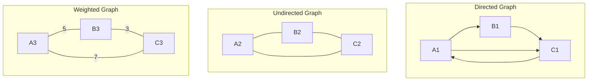
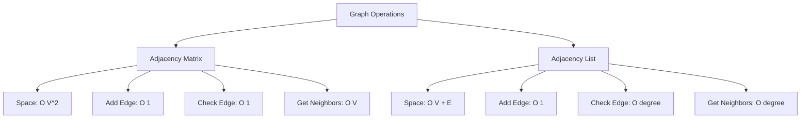

# Bài 18: Graph Data Structures - Cấu trúc dữ liệu đồ thị

<div className="bg-blue-50 p-6 rounded-lg border-l-4 border-blue-500 mb-8">
  <h2 className="text-2xl font-bold text-blue-800 mb-3">🎯 Mục tiêu bài học</h2>
  <ul className="list-disc list-inside text-blue-700 space-y-2">
    <li>Hiểu định nghĩa và khái niệm cơ bản về Graph</li>
    <li>Nắm vững các cách biểu diễn Graph trong bộ nhớ</li>
    <li>So sánh ưu nhược điểm của từng phương pháp biểu diễn</li>
    <li>Cài đặt Graph class với các thao tác cơ bản bằng Rust</li>
  </ul>
</div>

## 📚 1. Định nghĩa Graph

**Graph** là một cấu trúc dữ liệu phi tuyến tính bao gồm:
- **Vertices (Đỉnh)**: Các nút trong đồ thị, ký hiệu là V
- **Edges (Cạnh)**: Các kết nối giữa các đỉnh, ký hiệu là E

**Ký hiệu toán học**: G = (V, E)

### 🔍 Phân loại Graph

| Loại Graph | Mô tả | Ví dụ ứng dụng |
|------------|-------|----------------|
| **Directed Graph (Đồ thị có hướng)** | Các cạnh có hướng từ đỉnh này đến đỉnh khác | Mạng xã hội (follow), Web links |
| **Undirected Graph (Đồ thị vô hướng)** | Các cạnh không có hướng, kết nối hai chiều | Mạng bạn bè, Đường giao thông |
| **Weighted Graph (Đồ thị có trọng số)** | Mỗi cạnh có một giá trị trọng số | Bản đồ với khoảng cách, Chi phí vận chuyển |
| **Unweighted Graph (Đồ thị không trọng số)** | Tất cả cạnh có trọng số bằng nhau | Mê cung, Cấu trúc tổ chức |



## 🏗️ 2. Các thuộc tính quan trọng của Graph

<div className="grid grid-cols-1 md:grid-cols-2 gap-4 mb-6">
  <div className="bg-green-50 p-4 rounded-lg border border-green-200">
    <h3 className="font-bold text-green-800 mb-2">Degree (Bậc)</h3>
    <p className="text-green-700">Số cạnh kết nối với một đỉnh</p>
    <ul className="text-sm text-green-600 mt-2">
      <li>• In-degree: Số cạnh đi vào (directed)</li>
      <li>• Out-degree: Số cạnh đi ra (directed)</li>
    </ul>
  </div>
  
  <div className="bg-purple-50 p-4 rounded-lg border border-purple-200">
    <h3 className="font-bold text-purple-800 mb-2">Path (Đường đi)</h3>
    <p className="text-purple-700">Chuỗi các đỉnh kết nối liên tiếp</p>
    <ul className="text-sm text-purple-600 mt-2">
      <li>• Simple path: Không lặp lại đỉnh</li>
      <li>• Cycle: Đường đi khép kín</li>
    </ul>
  </div>
</div>

### 📊 Bảng tính chất Graph

| Tính chất | Directed Graph | Undirected Graph |
|-----------|----------------|------------------|
| **Số cạnh tối đa** | V × (V-1) | V × (V-1) / 2 |
| **Degree tổng** | 2E | 2E |
| **Connected** | Weakly/Strongly | Simply connected |
| **Cycle detection** | DFS với 3 màu | DFS với parent tracking |

## 💾 3. Các phương pháp biểu diễn Graph

### 3.1 Adjacency Matrix (Ma trận kề)

Ma trận 2D kích thước V×V, trong đó:
- `matrix[i][j] = 1` nếu có cạnh từ đỉnh i đến đỉnh j
- `matrix[i][j] = weight` nếu là weighted graph

```rust
#[derive(Debug, Clone)]
pub struct AdjacencyMatrix {
    matrix: Vec<Vec<i32>>,
    vertices: usize,
    is_directed: bool,
}

impl AdjacencyMatrix {
    pub fn new(vertices: usize, is_directed: bool) -> Self {
        Self {
            matrix: vec![vec![0; vertices]; vertices],
            vertices,
            is_directed,
        }
    }
    
    pub fn add_edge(&mut self, from: usize, to: usize, weight: i32) {
        if from < self.vertices && to < self.vertices {
            self.matrix[from][to] = weight;
            if !self.is_directed {
                self.matrix[to][from] = weight;
            }
        }
    }
    
    pub fn has_edge(&self, from: usize, to: usize) -> bool {
        if from < self.vertices && to < self.vertices {
            return self.matrix[from][to] != 0;
        }
        false
    }
    
    pub fn get_neighbors(&self, vertex: usize) -> Vec<usize> {
        let mut neighbors = Vec::new();
        if vertex < self.vertices {
            for i in 0..self.vertices {
                if self.matrix[vertex][i] != 0 {
                    neighbors.push(i);
                }
            }
        }
        neighbors
    }
}
```

### 3.2 Adjacency List (Danh sách kề)

Mỗi đỉnh có một danh sách chứa các đỉnh kề với nó.

```rust
use std::collections::HashMap;

#[derive(Debug, Clone)]
pub struct AdjacencyList {
    graph: HashMap<usize, Vec<(usize, i32)>>, // (neighbor, weight)
    vertices: usize,
    is_directed: bool,
}

impl AdjacencyList {
    pub fn new(vertices: usize, is_directed: bool) -> Self {
        let mut graph = HashMap::new();
        for i in 0..vertices {
            graph.insert(i, Vec::new());
        }
        
        Self {
            graph,
            vertices,
            is_directed,
        }
    }
    
    pub fn add_edge(&mut self, from: usize, to: usize, weight: i32) {
        if from < self.vertices && to < self.vertices {
            self.graph.get_mut(&from).unwrap().push((to, weight));
            if !self.is_directed {
                self.graph.get_mut(&to).unwrap().push((from, weight));
            }
        }
    }
    
    pub fn remove_edge(&mut self, from: usize, to: usize) {
        if let Some(neighbors) = self.graph.get_mut(&from) {
            neighbors.retain(|(neighbor, _)| *neighbor != to);
        }
        
        if !self.is_directed {
            if let Some(neighbors) = self.graph.get_mut(&to) {
                neighbors.retain(|(neighbor, _)| *neighbor != from);
            }
        }
    }
    
    pub fn get_neighbors(&self, vertex: usize) -> Vec<(usize, i32)> {
        self.graph.get(&vertex).cloned().unwrap_or_default()
    }
    
    pub fn has_edge(&self, from: usize, to: usize) -> bool {
        if let Some(neighbors) = self.graph.get(&from) {
            return neighbors.iter().any(|(neighbor, _)| *neighbor == to);
        }
        false
    }
    
    pub fn get_degree(&self, vertex: usize) -> usize {
        self.graph.get(&vertex).map_or(0, |neighbors| neighbors.len())
    }
}
```

## ⚖️ 4. So sánh Adjacency Matrix vs Adjacency List

| Tiêu chí | Adjacency Matrix | Adjacency List |
|----------|------------------|----------------|
| **Space Complexity** | O(V²) | O(V + E) |
| **Add Edge** | O(1) | O(1) |
| **Check Edge** | O(1) | O(degree) |
| **Get Neighbors** | O(V) | O(degree) |
| **Remove Edge** | O(1) | O(degree) |

<div className="bg-yellow-50 p-4 rounded-lg border-l-4 border-yellow-400 my-6">
  <h3 className="font-bold text-yellow-800">💡 Khi nào sử dụng?</h3>
  <div className="grid grid-cols-1 md:grid-cols-2 gap-4 mt-3">
    <div>
      <h4 className="font-semibold text-yellow-700">Adjacency Matrix</h4>
      <ul className="text-sm text-yellow-600 mt-1">
        <li>• Dense graphs (nhiều cạnh)</li>
        <li>• Cần kiểm tra edge nhanh</li>
        <li>• Graph operations toán học</li>
      </ul>
    </div>
    <div>
      <h4 className="font-semibold text-yellow-700">Adjacency List</h4>
      <ul className="text-sm text-yellow-600 mt-1">
        <li>• Sparse graphs (ít cạnh)</li>
        <li>• Tiết kiệm bộ nhớ</li>
        <li>• Duyệt neighbors thường xuyên</li>
      </ul>
    </div>
  </div>
</div>

## 🔨 5. Cài đặt Graph tổng quát

```rust
use std::fmt::Debug;

#[derive(Debug)]
pub enum GraphRepresentation<T: Clone + Debug> {
    Matrix(AdjacencyMatrix),
    List(AdjacencyList),
}

#[derive(Debug)]
pub struct Graph<T: Clone + Debug> {
    representation: GraphRepresentation<T>,
    vertex_data: Vec<T>,
    is_directed: bool,
}

impl<T: Clone + Debug> Graph<T> {
    pub fn new_with_matrix(vertices: usize, is_directed: bool) -> Self {
        Self {
            representation: GraphRepresentation::Matrix(
                AdjacencyMatrix::new(vertices, is_directed)
            ),
            vertex_data: Vec::with_capacity(vertices),
            is_directed,
        }
    }
    
    pub fn new_with_list(vertices: usize, is_directed: bool) -> Self {
        Self {
            representation: GraphRepresentation::List(
                AdjacencyList::new(vertices, is_directed)
            ),
            vertex_data: Vec::with_capacity(vertices),
            is_directed,
        }
    }
    
    pub fn add_vertex(&mut self, data: T) {
        self.vertex_data.push(data);
    }
    
    pub fn add_edge(&mut self, from: usize, to: usize, weight: i32) {
        match &mut self.representation {
            GraphRepresentation::Matrix(ref mut matrix) => {
                matrix.add_edge(from, to, weight);
            },
            GraphRepresentation::List(ref mut list) => {
                list.add_edge(from, to, weight);
            }
        }
    }
    
    pub fn has_edge(&self, from: usize, to: usize) -> bool {
        match &self.representation {
            GraphRepresentation::Matrix(matrix) => matrix.has_edge(from, to),
            GraphRepresentation::List(list) => list.has_edge(from, to),
        }
    }
    
    pub fn get_vertex_count(&self) -> usize {
        self.vertex_data.len()
    }
    
    pub fn print_graph(&self) {
        println!("Graph ({}directed):", if self.is_directed { "" } else { "un" });
        
        match &self.representation {
            GraphRepresentation::Matrix(matrix) => {
                println!("Adjacency Matrix:");
                for i in 0..matrix.vertices {
                    for j in 0..matrix.vertices {
                        print!("{:3} ", matrix.matrix[i][j]);
                    }
                    println!();
                }
            },
            GraphRepresentation::List(list) => {
                println!("Adjacency List:");
                for i in 0..list.vertices {
                    print!("Vertex {}: ", i);
                    let neighbors = list.get_neighbors(i);
                    for (neighbor, weight) in neighbors {
                        print!("({}, {}) ", neighbor, weight);
                    }
                    println!();
                }
            }
        }
    }
}
```

## 📋 6. Ví dụ sử dụng thực tế

```rust
fn main() {
    // Tạo undirected graph với adjacency list
    let mut graph = Graph::<&str>::new_with_list(5, false);
    
    // Thêm vertices
    let cities = ["Hà Nội", "TP.HCM", "Đà Nẵng", "Hải Phòng", "Cần Thơ"];
    for city in cities.iter() {
        graph.add_vertex(*city);
    }
    
    // Thêm edges (khoảng cách giả định)
    graph.add_edge(0, 1, 1760); // Hà Nội - TP.HCM
    graph.add_edge(0, 2, 760);  // Hà Nội - Đà Nẵng
    graph.add_edge(0, 3, 120);  // Hà Nội - Hải Phòng
    graph.add_edge(1, 4, 160);  // TP.HCM - Cần Thơ
    graph.add_edge(2, 1, 960);  // Đà Nẵng - TP.HCM
    
    graph.print_graph();
    
    // Kiểm tra kết nối
    println!("Có đường từ Hà Nội đến TP.HCM? {}", graph.has_edge(0, 1));
    println!("Có đường từ Hải Phòng đến Cần Thơ? {}", graph.has_edge(3, 4));
}
```

## 🎯 7. Độ phức tạp tính toán



<div className="bg-red-50 p-4 rounded-lg border-l-4 border-red-400 my-6">
  <h3 className="font-bold text-red-800">⚠️ Lưu ý quan trọng</h3>
  <ul className="text-red-700 space-y-1">
    <li>• Chọn representation phù hợp với density của graph</li>
    <li>• Dense graph (E ≈ V²): dùng Adjacency Matrix</li>
    <li>• Sparse graph (E &lt;&lt; V²): dùng Adjacency List</li>
    <li>• Cân nhắc trade-off giữa space và time complexity</li>
  </ul>
</div>

## 📝 8. Bài tập thực hành trên LeetCode

| Bài tập | Độ khó | Link | Kỹ thuật chính |
|---------|--------|------|----------------|
| **Graph Valid Tree** | Medium | [LeetCode 261](https://leetcode.com/problems/graph-valid-tree/) | Union-Find, DFS |
| **Number of Islands** | Medium | [LeetCode 200](https://leetcode.com/problems/number-of-islands/) | DFS/BFS |
| **Clone Graph** | Medium | [LeetCode 133](https://leetcode.com/problems/clone-graph/) | DFS/BFS + HashMap |
| **Course Schedule** | Medium | [LeetCode 207](https://leetcode.com/problems/course-schedule/) | Topological Sort |
| **Network Delay Time** | Medium | [LeetCode 743](https://leetcode.com/problems/network-delay-time/) | Dijkstra's Algorithm |
| **Find if Path Exists** | Easy | [LeetCode 1971](https://leetcode.com/problems/find-if-path-exists-in-graph/) | DFS/BFS/Union-Find |

## 🚀 9. Tổng kết

Graph là cấu trúc dữ liệu mạnh mẽ để mô hình hóa các mối quan hệ phức tạp trong thế giới thực. Việc lựa chọn phương pháp biểu diễn (Matrix vs List) phụ thuộc vào:

1. **Mật độ graph** (dense vs sparse)
2. **Loại operations** thường xuyên sử dụng
3. **Constraints về memory** và performance

Trong bài tiếp theo, chúng ta sẽ học về các thuật toán duyệt Graph (DFS, BFS) để khai thác sức mạnh của cấu trúc dữ liệu này.

---

<div className="text-center text-sm text-gray-500 mt-8">
  <p>📚 <strong>Bài tiếp theo:</strong> Bài 19 - Graph Search Algorithms (DFS & BFS)</p>
</div>