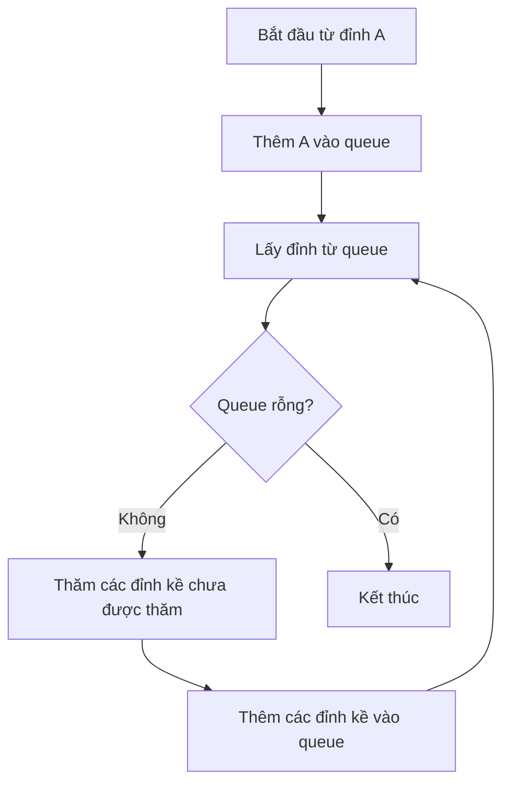
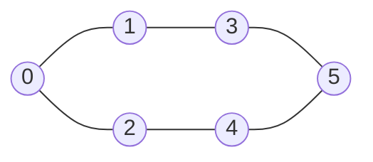
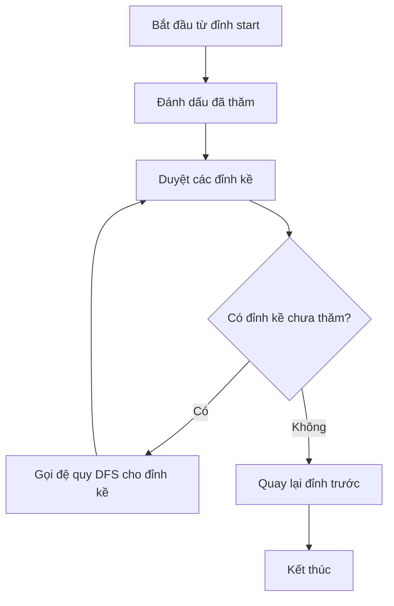

# Bài 19: Graph Search Algorithms - Thuật toán tìm kiếm trên đồ thị

## Mục tiêu học tập

<div className="bg-blue-50 border-l-4 border-blue-400 p-4 mb-6">
<h3 className="text-lg font-semibold text-blue-800">Sau bài học này, bạn sẽ:</h3>
<ul className="list-disc list-inside text-blue-700 mt-2">
<li>Hiểu và cài đặt thuật toán Breadth-First Search (BFS)</li>
<li>Hiểu và cài đặt thuật toán Depth-First Search (DFS)</li>
<li>Phân biệt ứng dụng và độ phức tạp của từng thuật toán</li>
<li>Áp dụng BFS/DFS cho các bài toán thực tế</li>
</ul>
</div>

## 1. Giới thiệu về Graph Search

Graph Search (tìm kiếm trên đồ thị) là quá trình duyệt qua các đỉnh (vertices) của đồ thị theo một thứ tự nhất định. Hai thuật toán cơ bản nhất là:

| Thuật toán | Cấu trúc dữ liệu | Thứ tự duyệt | Độ phức tạp |
|------------|------------------|--------------|-------------|
| **BFS** | Queue (FIFO) | Theo từng tầng | O(V + E) |
| **DFS** | Stack/Recursion (LIFO) | Đi sâu trước | O(V + E) |

*Trong đó: V = số đỉnh, E = số cạnh*

## 2. Breadth-First Search (BFS)

### 2.1 Nguyên lý hoạt động

BFS duyệt đồ thị theo từng tầng, bắt đầu từ đỉnh khởi tạo và lan rộng ra các đỉnh lân cận.



### 2.2 Cài đặt BFS bằng Rust

```rust
use std::collections::{VecDeque, HashSet};

struct Graph {
    adj_list: Vec<Vec<usize>>,
    num_vertices: usize,
}

impl Graph {
    fn new(num_vertices: usize) -> Self {
        Graph {
            adj_list: vec![Vec::new(); num_vertices],
            num_vertices,
        }
    }
    
    fn add_edge(&mut self, src: usize, dest: usize) {
        self.adj_list[src].push(dest);
        // Nếu là đồ thị vô hướng, thêm cạnh ngược lại
        self.adj_list[dest].push(src);
    }
    
    fn bfs(&self, start: usize) -> Vec<usize> {
        let mut visited = vec![false; self.num_vertices];
        let mut queue = VecDeque::new();
        let mut result = Vec::new();
        
        // Bắt đầu từ đỉnh start
        queue.push_back(start);
        visited[start] = true;
        
        while let Some(vertex) = queue.pop_front() {
            result.push(vertex);
            
            // Duyệt tất cả đỉnh kề
            for &neighbor in &self.adj_list[vertex] {
                if !visited[neighbor] {
                    visited[neighbor] = true;
                    queue.push_back(neighbor);
                }
            }
        }
        
        result
    }
    
    // BFS tìm đường đi ngắn nhất (số cạnh ít nhất)
    fn bfs_shortest_path(&self, start: usize, target: usize) -> Option<Vec<usize>> {
        let mut visited = vec![false; self.num_vertices];
        let mut queue = VecDeque::new();
        let mut parent = vec![None; self.num_vertices];
        
        queue.push_back(start);
        visited[start] = true;
        
        while let Some(vertex) = queue.pop_front() {
            if vertex == target {
                // Xây dựng đường đi từ parent array
                let mut path = Vec::new();
                let mut current = Some(target);
                
                while let Some(v) = current {
                    path.push(v);
                    current = parent[v];
                }
                
                path.reverse();
                return Some(path);
            }
            
            for &neighbor in &self.adj_list[vertex] {
                if !visited[neighbor] {
                    visited[neighbor] = true;
                    parent[neighbor] = Some(vertex);
                    queue.push_back(neighbor);
                }
            }
        }
        
        None // Không tìm thấy đường đi
    }
}
```

### 2.3 Ví dụ minh họa BFS



<div className="bg-gray-50 p-4 rounded-lg">
<h4 className="font-semibold mb-2">Thứ tự duyệt BFS từ đỉnh 0:</h4>
<table className="w-full">
<thead>
<tr><th>Bước</th><th>Queue</th><th>Thăm</th><th>Thêm vào Queue</th></tr>
</thead>
<tbody>
<tr><td>1</td><td>[0]</td><td>0</td><td>[1, 2]</td></tr>
<tr><td>2</td><td>[1, 2]</td><td>1</td><td>[3]</td></tr>
<tr><td>3</td><td>[2, 3]</td><td>2</td><td>[4]</td></tr>
<tr><td>4</td><td>[3, 4]</td><td>3</td><td>[5]</td></tr>
<tr><td>5</td><td>[4, 5]</td><td>4</td><td>[]</td></tr>
<tr><td>6</td><td>[5]</td><td>5</td><td>[]</td></tr>
</tbody>
</table>
<p><strong>Kết quả:</strong> [0, 1, 2, 3, 4, 5]</p>
</div>

## 3. Depth-First Search (DFS)

### 3.1 Nguyên lý hoạt động

DFS đi sâu vào một hướng cho đến khi không thể đi tiếp, sau đó quay lại và thử hướng khác.



### 3.2 Cài đặt DFS bằng Rust

```rust
impl Graph {
    // DFS sử dụng đệ quy
    fn dfs(&self, start: usize) -> Vec<usize> {
        let mut visited = vec![false; self.num_vertices];
        let mut result = Vec::new();
        self.dfs_util(start, &mut visited, &mut result);
        result
    }
    
    fn dfs_util(&self, vertex: usize, visited: &mut Vec<bool>, result: &mut Vec<usize>) {
        visited[vertex] = true;
        result.push(vertex);
        
        for &neighbor in &self.adj_list[vertex] {
            if !visited[neighbor] {
                self.dfs_util(neighbor, visited, result);
            }
        }
    }
    
    // DFS sử dụng stack (iterative)
    fn dfs_iterative(&self, start: usize) -> Vec<usize> {
        let mut visited = vec![false; self.num_vertices];
        let mut stack = Vec::new();
        let mut result = Vec::new();
        
        stack.push(start);
        
        while let Some(vertex) = stack.pop() {
            if !visited[vertex] {
                visited[vertex] = true;
                result.push(vertex);
                
                // Thêm các đỉnh kề vào stack (thứ tự ngược)
                for &neighbor in self.adj_list[vertex].iter().rev() {
                    if !visited[neighbor] {
                        stack.push(neighbor);
                    }
                }
            }
        }
        
        result
    }
    
    // Kiểm tra chu trình trong đồ thị có hướng
    fn has_cycle_directed(&self) -> bool {
        let mut visited = vec![false; self.num_vertices];
        let mut rec_stack = vec![false; self.num_vertices];
        
        for i in 0..self.num_vertices {
            if !visited[i] && self.has_cycle_util(i, &mut visited, &mut rec_stack) {
                return true;
            }
        }
        false
    }
    
    fn has_cycle_util(&self, vertex: usize, visited: &mut Vec<bool>, rec_stack: &mut Vec<bool>) -> bool {
        visited[vertex] = true;
        rec_stack[vertex] = true;
        
        for &neighbor in &self.adj_list[vertex] {
            if !visited[neighbor] && self.has_cycle_util(neighbor, visited, rec_stack) {
                return true;
            } else if rec_stack[neighbor] {
                return true;
            }
        }
        
        rec_stack[vertex] = false;
        false
    }
}
```

## 4. So sánh BFS vs DFS

<div className="overflow-x-auto">
<table className="w-full border-collapse border border-gray-300">
<thead>
<tr className="bg-gray-100">
<th className="border border-gray-300 p-3">Tiêu chí</th>
<th className="border border-gray-300 p-3">BFS</th>
<th className="border border-gray-300 p-3">DFS</th>
</tr>
</thead>
<tbody>
<tr>
<td className="border border-gray-300 p-3 font-semibold">Cấu trúc dữ liệu</td>
<td className="border border-gray-300 p-3">Queue (FIFO)</td>
<td className="border border-gray-300 p-3">Stack/Recursion (LIFO)</td>
</tr>
<tr>
<td className="border border-gray-300 p-3 font-semibold">Thứ tự duyệt</td>
<td className="border border-gray-300 p-3">Theo tầng (level-order)</td>
<td className="border border-gray-300 p-3">Đi sâu trước</td>
</tr>
<tr>
<td className="border border-gray-300 p-3 font-semibold">Bộ nhớ</td>
<td className="border border-gray-300 p-3">O(W) - W là độ rộng lớn nhất</td>
<td className="border border-gray-300 p-3">O(H) - H là độ sâu lớn nhất</td>
</tr>
<tr>
<td className="border border-gray-300 p-3 font-semibold">Đường đi ngắn nhất</td>
<td className="border border-gray-300 p-3">✅ Tìm được (unweighted)</td>
<td className="border border-gray-300 p-3">❌ Không đảm bảo</td>
</tr>
<tr>
<td className="border border-gray-300 p-3 font-semibold">Phát hiện chu trình</td>
<td className="border border-gray-300 p-3">✅ Có thể</td>
<td className="border border-gray-300 p-3">✅ Hiệu quả hơn</td>
</tr>
</tbody>
</table>
</div>

## 5. Ứng dụng thực tế

### 5.1 BFS Applications

| Ứng dụng | Mô tả | Ví dụ |
|----------|-------|-------|
| **Shortest Path** | Tìm đường đi ngắn nhất trong unweighted graph | GPS navigation |
| **Level-order Traversal** | Duyệt theo tầng | Web crawling |
| **Connected Components** | Tìm thành phần liên thông | Social network analysis |
| **Bipartite Graph** | Kiểm tra đồ thị 2-phân | Task assignment |

### 5.2 DFS Applications

| Ứng dụng | Mô tả | Ví dụ |
|----------|-------|-------|
| **Cycle Detection** | Phát hiện chu trình | Deadlock detection |
| **Topological Sort** | Sắp xếp topo | Course scheduling |
| **Strongly Connected Components** | Thành phần liên thông mạnh | Compiler optimization |
| **Path Finding** | Tìm đường đi | Maze solving |

## 6. Bài tập thực hành

### Bài tập cơ bản

```rust
fn main() {
    let mut graph = Graph::new(6);
    
    // Xây dựng đồ thị ví dụ
    graph.add_edge(0, 1);
    graph.add_edge(0, 2);
    graph.add_edge(1, 3);
    graph.add_edge(2, 4);
    graph.add_edge(3, 5);
    graph.add_edge(4, 5);
    
    println!("BFS traversal: {:?}", graph.bfs(0));
    println!("DFS traversal: {:?}", graph.dfs(0));
    
    if let Some(path) = graph.bfs_shortest_path(0, 5) {
        println!("Shortest path from 0 to 5: {:?}", path);
    }
}
```

## 7. Complexity Analysis

```mermaid
graph LR
    A[Time Complexity] --> B[O(V + E)]
    A --> C[Space Complexity]
    C --> D[BFS: O(V)]
    C --> E[DFS: O(V)]
    
    F[Where:] --> G[V = số đỉnh]
    F --> H[E = số cạnh]
```

<div className="bg-yellow-50 border-l-4 border-yellow-400 p-4">
<h4 className="font-semibold text-yellow-800">💡 Lưu ý quan trọng:</h4>
<ul className="list-disc list-inside text-yellow-700 mt-2">
<li>BFS đảm bảo tìm đường đi ngắn nhất trong unweighted graph</li>
<li>DFS hiệu quả hơn cho việc phát hiện chu trình</li>
<li>Cả hai thuật toán đều có độ phức tạp thời gian O(V + E)</li>
<li>Lựa chọn thuật toán phụ thuộc vào bài toán cụ thể</li>
</ul>
</div>

## 8. Bài tập LeetCode liên quan

### Easy Level
- [Binary Tree Level Order Traversal](https://leetcode.com/problems/binary-tree-level-order-traversal/) - LC 102
- [Symmetric Tree](https://leetcode.com/problems/symmetric-tree/) - LC 101
- [Same Tree](https://leetcode.com/problems/same-tree/) - LC 100

### Medium Level
- [Number of Islands](https://leetcode.com/problems/number-of-islands/) - LC 200
- [Course Schedule](https://leetcode.com/problems/course-schedule/) - LC 207
- [Clone Graph](https://leetcode.com/problems/clone-graph/) - LC 133
- [Pacific Atlantic Water Flow](https://leetcode.com/problems/pacific-atlantic-water-flow/) - LC 417

### Hard Level
- [Word Ladder](https://leetcode.com/problems/word-ladder/) - LC 127
- [Alien Dictionary](https://leetcode.com/problems/alien-dictionary/) - LC 269
- [Shortest Path in Binary Matrix](https://leetcode.com/problems/shortest-path-in-binary-matrix/) - LC 1091

---

<div className="bg-green-50 border border-green-200 rounded-lg p-4">
<h3 className="text-green-800 font-semibold mb-2">🎯 Tóm tắt bài học</h3>
<ul className="list-disc list-inside text-green-700 space-y-1">
<li>BFS sử dụng Queue, duyệt theo tầng, tìm đường đi ngắn nhất</li>
<li>DFS sử dụng Stack/Recursion, đi sâu trước, hiệu quả cho phát hiện chu trình</li>
<li>Cả hai đều có độ phức tạp O(V + E)</li>
<li>Lựa chọn thuật toán dựa trên yêu cầu bài toán cụ thể</li>
</ul>
</div>