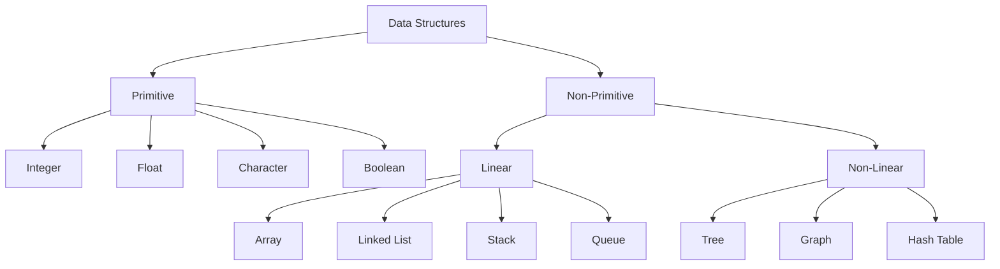
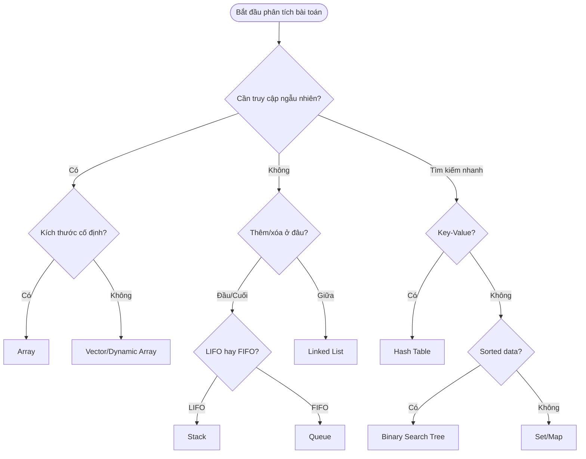
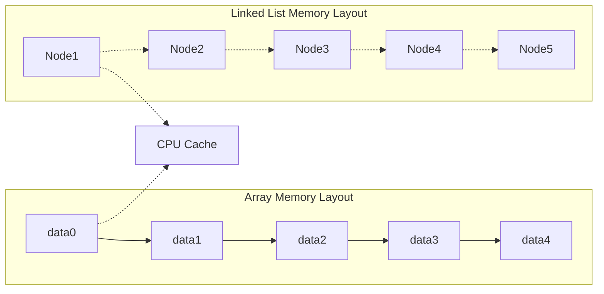

# Bài 2: Introduction to Data Structures
## *Khóa học Data Structures & Algorithms - Giai đoạn Nền tảng*

---

## 🎯 **Mục tiêu bài học**

<div className="p-6 border-l-4 border-blue-500 bg-blue-50 mb-6">
  <h3 className="text-lg font-semibold text-blue-800 mb-3">Sau khi hoàn thành bài học này, bạn sẽ:</h3>
  <ul className="text-blue-700 space-y-2">
    <li>✅ Hiểu rõ khái niệm và vai trò của Data Structures</li>
    <li>✅ Phân biệt được các loại Data Structures cơ bản</li>
    <li>✅ Biết cách chọn Data Structure phù hợp cho từng bài toán</li>
    <li>✅ Hiểu mối quan hệ giữa Data Structure và hiệu suất chương trình</li>
  </ul>
</div>

---

## 📚 **1. Data Structure là gì?**

<div className="bg-gray-50 p-5 rounded-lg border mb-6">
  <p className="text-lg font-medium text-gray-800 mb-3">
    <strong>Data Structure (Cấu trúc dữ liệu)</strong> là cách tổ chức, lưu trữ và quản lý dữ liệu trong máy tính để có thể truy cập và sử dụng hiệu quả.
  </p>
  <p className="text-gray-700">
    Giống như cách bạn sắp xếp sách trong thư viện, Data Structure giúp sắp xếp dữ liệu theo một quy tắc nhất định.
  </p>
</div>

### **Tại sao Data Structure quan trọng?**

| **Lý do** | **Giải thích** | **Ví dụ thực tế** |
|-----------|----------------|-------------------|
| **Hiệu suất** | Giảm thời gian thực thi và bộ nhớ sử dụng | Tìm kiếm trong dictionary thay vì list |
| **Tổ chức** | Dữ liệu được sắp xếp logic, dễ quản lý | File system với folders và subfolders |
| **Tái sử dụng** | Code có thể được sử dụng lại nhiều lần | Library functions cho sorting, searching |
| **Bảo trì** | Code dễ đọc, sửa đổi và mở rộng | Modular programming approach |

---

## 🏗️ **2. Phân loại Data Structures**



### **2.1 Linear Data Structures**

<div className="grid grid-cols-1 md:grid-cols-2 gap-4 mb-6">
  <div className="border rounded-lg p-4">
    <h4 className="font-semibold text-green-700 mb-2">✅ Ưu điểm</h4>
    <ul className="text-sm text-green-600 space-y-1">
      <li>• Dễ hiểu và cài đặt</li>
      <li>• Memory locality tốt</li>
      <li>• Truy cập tuần tự hiệu quả</li>
    </ul>
  </div>
  <div className="border rounded-lg p-4">
    <h4 className="font-semibold text-red-700 mb-2">❌ Nhược điểm</h4>
    <ul className="text-sm text-red-600 space-y-1">
      <li>• Kích thước cố định (một số loại)</li>
      <li>• Insert/Delete có thể chậm</li>
      <li>• Waste memory nếu không full</li>
    </ul>
  </div>
</div>

### **2.2 Non-Linear Data Structures**

<div className="grid grid-cols-1 md:grid-cols-2 gap-4 mb-6">
  <div className="border rounded-lg p-4">
    <h4 className="font-semibold text-green-700 mb-2">✅ Ưu điểm</h4>
    <ul className="text-sm text-green-600 space-y-1">
      <li>• Biểu diễn quan hệ phức tạp</li>
      <li>• Tìm kiếm nhanh (Tree)</li>
      <li>• Flexible structure</li>
    </ul>
  </div>
  <div className="border rounded-lg p-4">
    <h4 className="font-semibold text-red-700 mb-2">❌ Nhược điểm</h4>
    <ul className="text-sm text-red-600 space-y-1">
      <li>• Phức tạp hơn để cài đặt</li>
      <li>• Memory overhead cao</li>
      <li>• Cache performance kém</li>
    </ul>
  </div>
</div>

---

## ⚡ **3. So sánh hiệu suất các Data Structures**

| **Data Structure** | **Access** | **Search** | **Insert** | **Delete** | **Memory** |
|-------------------|------------|------------|------------|------------|------------|
| **Array** | O(1) | O(n) | O(n) | O(n) | Thấp |
| **Linked List** | O(n) | O(n) | O(1) | O(1) | Trung bình |
| **Stack** | O(1) | O(n) | O(1) | O(1) | Thấp |
| **Queue** | O(1) | O(n) | O(1) | O(1) | Thấp |
| **Hash Table** | N/A | O(1) avg | O(1) avg | O(1) avg | Cao |
| **Binary Tree** | O(log n) | O(log n) | O(log n) | O(log n) | Trung bình |

<div className="bg-yellow-50 border-l-4 border-yellow-400 p-4 mb-6">
  <p className="text-yellow-800">
    <strong>Lưu ý:</strong> Các độ phức tạp trên là cho trường hợp trung bình. Worst-case có thể khác biệt đáng kể.
  </p>
</div>

---

## 🎯 **4. Cách chọn Data Structure phù hợp**



### **Bảng hướng dẫn chọn Data Structure**

| **Yêu cầu chính** | **Data Structure khuyến nghị** | **Lý do** |
|-------------------|--------------------------------|-----------|
| Truy cập theo index | Array, Vector | O(1) random access |
| Thêm/xóa đầu cuối | Stack, Queue | O(1) operations |
| Tìm kiếm nhanh | Hash Table, BST | O(1) hoặc O(log n) |
| Thêm/xóa ở giữa | Linked List | O(1) nếu có pointer |
| Dữ liệu có thứ tự | Array, BST | Maintain order |
| Key-Value mapping | Hash Table, Map | Direct key lookup |

---

## 💻 **5. Ví dụ thực tế với C++**

### **5.1 Chọn Array cho truy cập nhanh**

```cpp
#include <iostream>
#include <vector>
#include <chrono>

// Ví dụ: Tính tổng các phần tử
class ArrayExample {
private:
    std::vector<int> data;
    
public:
    ArrayExample(int size) {
        data.resize(size);
        // Initialize with random values
        for(int i = 0; i < size; i++) {
            data[i] = rand() % 1000;
        }
    }
    
    // O(n) - Linear time
    long long calculateSum() {
        long long sum = 0;
        for(int i = 0; i < data.size(); i++) {
            sum += data[i];  // O(1) access time
        }
        return sum;
    }
    
    // O(1) - Constant time access
    int getElement(int index) {
        if(index >= 0 && index < data.size()) {
            return data[index];
        }
        return -1; // Error value
    }
};
```

### **5.2 Performance Measurement**

```cpp
#include <chrono>
#include <iostream>

void measurePerformance() {
    const int SIZE = 1000000;
    ArrayExample arr(SIZE);
    
    auto start = std::chrono::high_resolution_clock::now();
    long long sum = arr.calculateSum();
    auto end = std::chrono::high_resolution_clock::now();
    
    auto duration = std::chrono::duration_cast<std::chrono::microseconds>(end - start);
    
    std::cout << "Sum: " << sum << std::endl;
    std::cout << "Time taken: " << duration.count() << " microseconds" << std::endl;
}
```

---

## 📊 **6. Memory Layout và Cache Performance**



<div className="bg-blue-50 border rounded-lg p-4 mb-6">
  <h4 className="text-blue-800 font-semibold mb-2">💡 Memory Access Patterns</h4>
  <div className="text-blue-700 text-sm">
    <p><strong>Sequential Access (Array):</strong> Tận dụng được CPU cache, performance cao</p>
    <p><strong>Random Access (Linked List):</strong> Cache miss nhiều, performance thấp hơn</p>
  </div>
</div>

---

## 🧪 **7. Bài tập thực hành**

### **Bài tập 1: Phân tích bài toán**

<div className="border rounded-lg p-4 mb-4">
  <h4 className="font-semibold mb-2">🔍 Tình huống:</h4>
  <p className="mb-3">Bạn cần xây dựng một hệ thống quản lý danh sách sinh viên với các yêu cầu:</p>
  <ul className="space-y-1 text-sm">
    <li>• Thêm sinh viên mới (ở cuối danh sách)</li>
    <li>• Tìm sinh viên theo mã số</li>
    <li>• Hiển thị danh sách theo thứ tự alphabet</li>
    <li>• Xóa sinh viên theo mã số</li>
  </ul>
</div>

**Hãy chọn Data Structure phù hợp và giải thích lý do:**

| **Yêu cầu** | **Data Structure gợi ý** | **Lý do** |
|-------------|---------------------------|-----------|
| Thêm cuối | Vector/Array | O(1) amortized |
| Tìm theo mã | Hash Table | O(1) average |
| Sắp xếp | Sorted Vector | Maintain order |
| Xóa theo mã | Hash Table + Vector | Fast lookup + removal |

### **Bài tập 2: Code Implementation**

```cpp
#include <unordered_map>
#include <vector>
#include <algorithm>

struct Student {
    int id;
    std::string name;
    float gpa;
    
    Student(int id, std::string name, float gpa) 
        : id(id), name(name), gpa(gpa) {}
};

class StudentManager {
private:
    std::vector<Student> students;           // For ordered access
    std::unordered_map<int, int> idToIndex;  // For fast lookup
    
public:
    // O(1) amortized
    void addStudent(const Student& student) {
        idToIndex[student.id] = students.size();
        students.push_back(student);
    }
    
    // O(1) average
    Student* findStudent(int id) {
        auto it = idToIndex.find(id);
        if(it != idToIndex.end()) {
            return &students[it->second];
        }
        return nullptr;
    }
    
    // O(n log n)
    void sortByName() {
        std::sort(students.begin(), students.end(), 
                 [](const Student& a, const Student& b) {
                     return a.name < b.name;
                 });
        
        // Update index map
        for(int i = 0; i < students.size(); i++) {
            idToIndex[students[i].id] = i;
        }
    }
};
```

---

## 📋 **Tóm tắt bài học**

<div className="bg-green-50 border-l-4 border-green-400 p-4">
  <h4 className="text-green-800 font-semibold mb-3">🎯 Những điều cần nhớ:</h4>
  <div className="text-green-700 space-y-2 text-sm">
    <p><strong>1.</strong> Data Structure là cách tổ chức dữ liệu để sử dụng hiệu quả</p>
    <p><strong>2.</strong> Mỗi loại có ưu nhược điểm riêng - không có "best" universal</p>
    <p><strong>3.</strong> Chọn DS dựa trên: access pattern, performance requirement, memory constraint</p>
    <p><strong>4.</strong> Linear DS: đơn giản, cache-friendly; Non-linear DS: flexible, complex relationships</p>
    <p><strong>5.</strong> Luôn đo performance thực tế, không chỉ dựa vào Big-O theory</p>
  </div>
</div>

---

## 🔗 **Chuẩn bị cho bài tiếp theo**

**Bài 3: Arrays - Cấu trúc dữ liệu đầu tiên**
- Cài đặt Array operations từ cơ bản
- Memory management và pointer arithmetic  
- Multi-dimensional arrays
- Performance optimization techniques

<div className="text-center p-4 border-t mt-6">
  <p className="text-gray-600 text-sm">
    📚 <strong>Tài liệu tham khảo:</strong> Introduction to Algorithms (CLRS), Data Structures and Algorithms in C++ (Goodrich)
  </p>
</div>