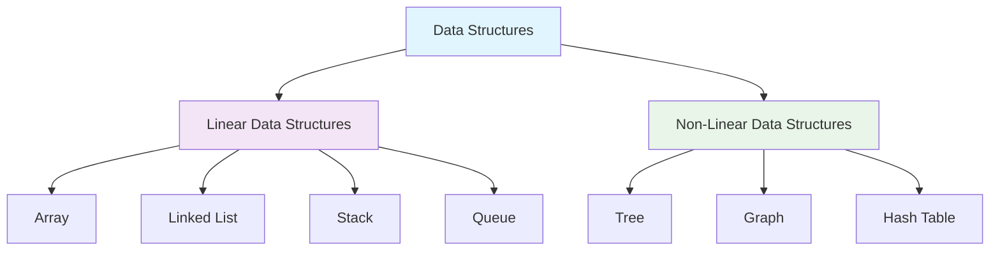
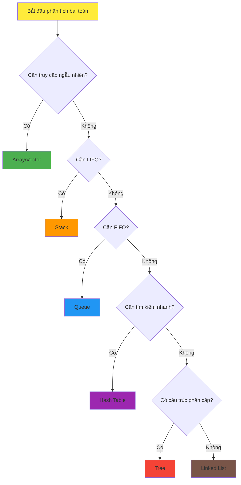

# Bài 2: Introduction to Data Structures
## Giới thiệu về Cấu trúc Dữ liệu

---

<div className="bg-gradient-to-r from-blue-50 to-purple-50 p-6 rounded-lg border-l-4 border-blue-500 mb-6">
  <h3 className="text-xl font-bold text-blue-800 mb-2">🎯 Mục tiêu học tập</h3>
  <ul className="text-gray-700 space-y-1">
    <li>✅ Hiểu định nghĩa và tầm quan trọng của Data Structures</li>
    <li>✅ Phân loại các loại cấu trúc dữ liệu cơ bản</li>
    <li>✅ Phân tích ưu nhược điểm của từng loại</li>
    <li>✅ Lựa chọn cấu trúc dữ liệu phù hợp cho bài toán</li>
  </ul>
</div>

---

## 1. Data Structure là gì?

<div className="bg-yellow-50 p-4 rounded-lg border-l-4 border-yellow-400 mb-4">
  <p className="font-semibold text-yellow-800">📚 Định nghĩa</p>
  <p className="text-gray-700">Data Structure (Cấu trúc dữ liệu) là cách tổ chức, lưu trữ và quản lý dữ liệu trong máy tính để có thể truy cập và sử dụng hiệu quả.</p>
</div>

### Tại sao Data Structures quan trọng?

| Lý do | Mô tả | Ví dụ thực tế |
|-------|-------|---------------|
| **Hiệu suất** | Tối ưu hóa thời gian truy cập và xử lý | Tìm kiếm trong Google (< 0.5 giây) |
| **Tổ chức** | Sắp xếp dữ liệu logic và có cấu trúc | Hệ thống file Windows/Mac |
| **Tái sử dụng** | Code dễ bảo trì và mở rộng | Framework React, Vue.js |
| **Tiết kiệm bộ nhớ** | Sử dụng RAM hiệu quả | Compression algorithms |

---

## 2. Phân loại Data Structures



### 2.1 Linear Data Structures (Cấu trúc tuyến tính)

<div className="grid grid-cols-1 md:grid-cols-2 gap-4 mb-6">
  <div className="bg-blue-50 p-4 rounded-lg border border-blue-200">
    <h4 className="font-bold text-blue-800">✨ Đặc điểm</h4>
    <ul className="text-sm text-gray-700 mt-2">
      <li>• Dữ liệu được sắp xếp tuần tự</li>
      <li>• Mỗi phần tử có tối đa 1 successor và 1 predecessor</li>
      <li>• Duyệt theo thứ tự nhất định</li>
    </ul>
  </div>
  
  <div className="bg-green-50 p-4 rounded-lg border border-green-200">
    <h4 className="font-bold text-green-800">🎯 Ứng dụng</h4>
    <ul className="text-sm text-gray-700 mt-2">
      <li>• Lưu trữ danh sách</li>
      <li>• Xử lý tuần tự</li>
      <li>• Undo/Redo operations</li>
    </ul>
  </div>
</div>

### 2.2 Non-Linear Data Structures (Cấu trúc phi tuyến)

| Loại | Mô tả | Ví dụ ứng dụng |
|------|-------|----------------|
| **Tree** | Cấu trúc phân cấp với root và các node con | File system, DOM HTML |
| **Graph** | Tập hợp các node kết nối bởi edges | Social networks, Maps |
| **Hash Table** | Key-value mapping với hash function | Databases, Caching |

---

## 3. So sánh các Data Structures cơ bản

### Bảng so sánh hiệu suất

| Data Structure | Access | Search | Insert | Delete | Space |
|----------------|--------|--------|--------|--------|-------|
| **Array** | O(1) | O(n) | O(n) | O(n) | O(n) |
| **Linked List** | O(n) | O(n) | O(1) | O(1) | O(n) |
| **Stack** | O(n) | O(n) | O(1) | O(1) | O(n) |
| **Queue** | O(n) | O(n) | O(1) | O(1) | O(n) |
| **Hash Table** | O(1)* | O(1)* | O(1)* | O(1)* | O(n) |
| **Binary Tree** | O(log n) | O(log n) | O(log n) | O(log n) | O(n) |

<div className="text-sm text-gray-600 italic">* Average case, worst case có thể là O(n)</div>

---

## 4. Cách chọn Data Structure phù hợp

### Decision Tree cho việc lựa chọn



### Checklist chọn Data Structure

<div className="bg-gray-50 p-4 rounded-lg">
  <h4 className="font-bold mb-2">🔍 Câu hỏi cần trả lời:</h4>
  <div className="grid grid-cols-1 md:grid-cols-2 gap-2 text-sm">
    <div>
      <input type="checkbox" className="mr-2" /> Dữ liệu có cố định kích thước?
      <input type="checkbox" className="mr-2" /> Cần truy cập theo index?
      <input type="checkbox" className="mr-2" /> Thêm/xóa thường xuyên?
      <input type="checkbox" className="mr-2" /> Cần sắp xếp tự động?
    </div>
    <div>
      <input type="checkbox" className="mr-2" /> Tìm kiếm là operation chính?
      <input type="checkbox" className="mr-2" /> Cần duyệt theo thứ tự?
      <input type="checkbox" className="mr-2" /> Bộ nhớ có giới hạn?
      <input type="checkbox" className="mr-2" /> Cần thread-safe?
    </div>
  </div>
</div>

---

## 5. Ví dụ thực tế với Rust

### Array vs Vector trong Rust

```rust
// Array - kích thước cố định tại compile time
fn array_example() {
    let fixed_array: [i32; 5] = [1, 2, 3, 4, 5];
    
    // Truy cập O(1)
    println!("Element at index 2: {}", fixed_array[2]);
    
    // Không thể thay đổi kích thước
    // fixed_array.push(6); // ❌ Error!
}

// Vector - kích thước động
fn vector_example() {
    let mut dynamic_vec: Vec<i32> = vec![1, 2, 3, 4, 5];
    
    // Insert O(1) amortized
    dynamic_vec.push(6);
    
    // Insert tại vị trí bất kỳ O(n)
    dynamic_vec.insert(2, 10);
    
    println!("Vector: {:?}", dynamic_vec);
}
```

### HashMap cho key-value storage

```rust
use std::collections::HashMap;

fn hashmap_example() {
    let mut scores = HashMap::new();
    
    // Insert O(1) average
    scores.insert("Alice", 95);
    scores.insert("Bob", 87);
    scores.insert("Charlie", 92);
    
    // Search O(1) average
    match scores.get("Alice") {
        Some(score) => println!("Alice's score: {}", score),
        None => println!("Alice not found"),
    }
    
    // Iterate through all entries
    for (name, score) in &scores {
        println!("{}: {}", name, score);
    }
}
```

---

## 6. Trade-offs Analysis

### Memory vs Speed Trade-offs

<div className="overflow-x-auto">
<table className="w-full border-collapse border border-gray-300">
  <thead className="bg-gray-100">
    <tr>
      <th className="border border-gray-300 p-2">Scenario</th>
      <th className="border border-gray-300 p-2">Priority</th>
      <th className="border border-gray-300 p-2">Recommended Structure</th>
      <th className="border border-gray-300 p-2">Reason</th>
    </tr>
  </thead>
  <tbody>
    <tr>
      <td className="border border-gray-300 p-2">Gaming leaderboard</td>
      <td className="border border-gray-300 p-2">Fast lookup</td>
      <td className="border border-gray-300 p-2">HashMap</td>
      <td className="border border-gray-300 p-2">O(1) search by player ID</td>
    </tr>
    <tr className="bg-gray-50">
      <td className="border border-gray-300 p-2">Undo/Redo text editor</td>
      <td className="border border-gray-300 p-2">LIFO operations</td>
      <td className="border border-gray-300 p-2">Stack</td>
      <td className="border border-gray-300 p-2">Natural fit for reversal</td>
    </tr>
    <tr>
      <td className="border border-gray-300 p-2">Print queue</td>
      <td className="border border-gray-300 p-2">FIFO fairness</td>
      <td className="border border-gray-300 p-2">Queue</td>
      <td className="border border-gray-300 p-2">First come, first served</td>
    </tr>
    <tr className="bg-gray-50">
      <td className="border border-gray-300 p-2">File system</td>
      <td className="border border-gray-300 p-2">Hierarchy</td>
      <td className="border border-gray-300 p-2">Tree</td>
      <td className="border border-gray-300 p-2">Natural parent-child relationship</td>
    </tr>
  </tbody>
</table>
</div>

---

## 7. Các lỗi thường gặp khi chọn Data Structure

<div className="bg-red-50 p-4 rounded-lg border-l-4 border-red-400 mb-4">
  <h4 className="font-bold text-red-800">⚠️ Pitfalls phổ biến:</h4>
  <ul className="text-red-700 mt-2 space-y-1">
    <li>• <strong>Premature optimization</strong>: Chọn structure phức tạp cho bài toán đơn giản</li>
    <li>• <strong>Không consider scale</strong>: Array cho 10 elements vs 10 million elements</li>
    <li>• <strong>Ignore access patterns</strong>: Dùng LinkedList khi cần random access nhiều</li>
    <li>• <strong>Memory overhead</strong>: Dùng Tree cho data nhỏ, overhead pointers > data</li>
  </ul>
</div>

---

## 8. Practice Problems

### Bài tập phân tích và lựa chọn

1. **Bài toán**: Lưu trữ 1000 sinh viên, thường xuyên tìm kiếm theo ID
   - **Phân tích**: Cần fast lookup, kích thước biết trước
   - **Lựa chọn**: HashMap hoặc Array nếu ID liên tục

2. **Bài toán**: Implement browser back/forward buttons  
   - **Phân tích**: Cần track history, navigate qua lại
   - **Lựa chọn**: Two Stacks hoặc Doubly Linked List

3. **Bài toán**: Merge multiple sorted arrays
   - **Phân tích**: Cần compare minimums efficiently
   - **Lựa chọn**: Priority Queue (Min Heap)

---

## 9. LeetCode Problems liên quan

<div className="bg-blue-50 p-4 rounded-lg">
  <h4 className="font-bold text-blue-800 mb-2">🎯 Recommended LeetCode Problems:</h4>
  <div className="grid grid-cols-1 md:grid-cols-2 gap-2 text-sm">
    <div>
      <strong>Easy Level:</strong>
      <ul className="mt-1 space-y-1">
        <li>• <a href="#" className="text-blue-600">1. Two Sum</a> - HashMap usage</li>
        <li>• <a href="#" className="text-blue-600">20. Valid Parentheses</a> - Stack</li>
        <li>• <a href="#" className="text-blue-600">232. Implement Queue using Stacks</a></li>
      </ul>
    </div>
    <div>
      <strong>Medium Level:</strong>
      <ul className="mt-1 space-y-1">
        <li>• <a href="#" className="text-blue-600">146. LRU Cache</a> - HashMap + LinkedList</li>
        <li>• <a href="#" className="text-blue-600">215. Kth Largest Element</a> - Heap</li>
        <li>• <a href="#" className="text-blue-600">359. Logger Rate Limiter</a> - HashMap</li>
      </ul>
    </div>
  </div>
</div>

---

## 10. Tóm tắt và Next Steps

<div className="bg-green-50 p-4 rounded-lg border-l-4 border-green-400">
  <h4 className="font-bold text-green-800">📝 Key Takeaways:</h4>
  <ul className="text-green-700 mt-2 space-y-1">
    <li>✅ <strong>Data Structure</strong> = cách tổ chức dữ liệu hiệu quả</li>
    <li>✅ <strong>Linear vs Non-linear</strong>: tuần tự vs phân cấp</li>
    <li>✅ <strong>Trade-offs</strong>: Time vs Space vs Simplicity</li>
    <li>✅ <strong>Context matters</strong>: Không có "best" structure, chỉ có "suitable"</li>
  </ul>
</div>

<div className="text-center mt-6 p-4 bg-purple-50 rounded-lg">
  <h4 className="font-bold text-purple-800">🚀 Bài tiếp theo: Arrays - Cấu trúc dữ liệu đầu tiên</h4>
  <p className="text-purple-600 text-sm mt-1">Chúng ta sẽ dive deep vào Array - foundation của hầu hết data structures khác!</p>
</div>