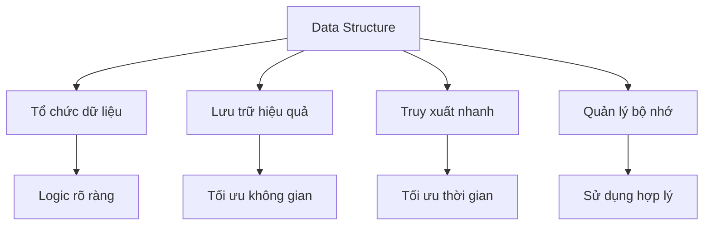
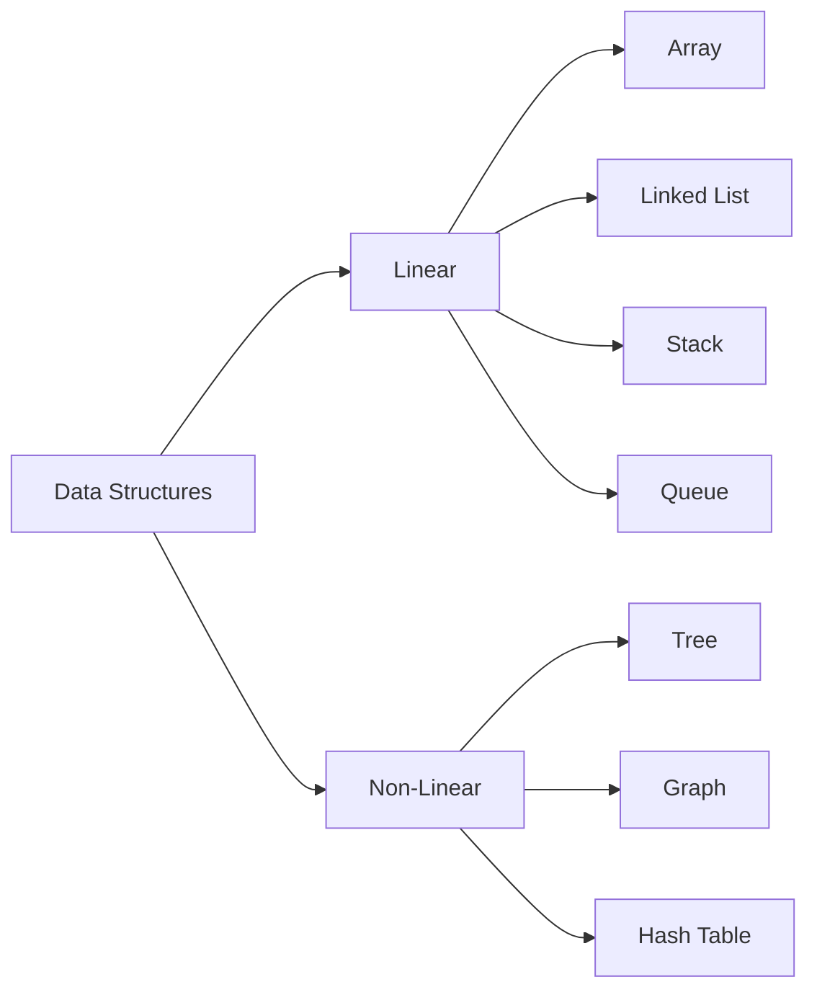
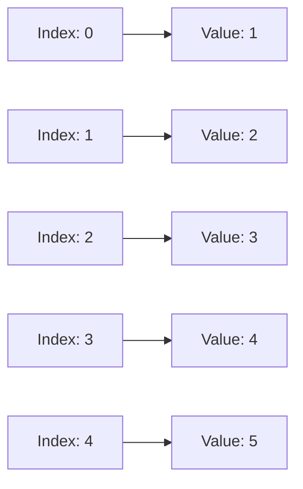
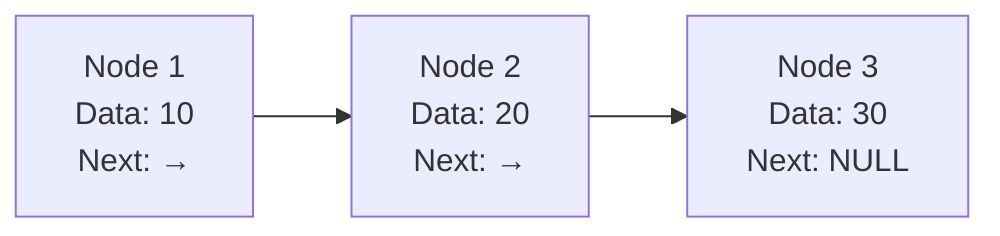
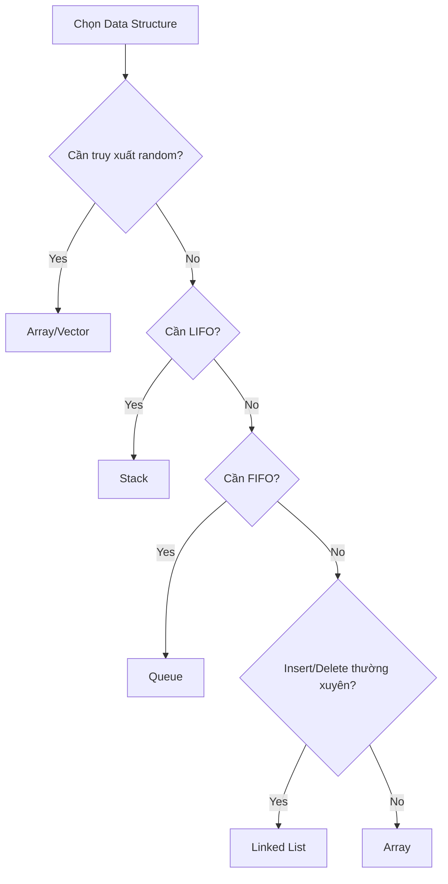
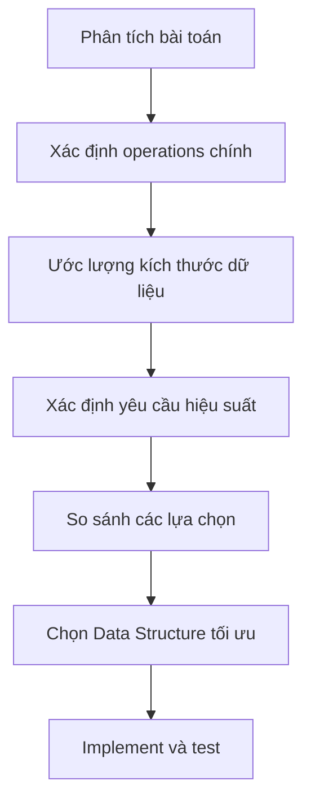

# Bài 2: Introduction to Data Structures
*Khóa học Data Structures & Algorithms - Giai đoạn 1: Nền tảng*

---

<div className="bg-gradient-to-r from-blue-50 to-indigo-50 p-6 rounded-lg border-l-4 border-blue-500 mb-6">
  <h2 className="text-2xl font-bold text-blue-800 mb-2">🎯 Mục tiêu bài học</h2>
  <ul className="text-blue-700 space-y-1">
    <li>• Hiểu định nghĩa và tầm quan trọng của Data Structures</li>
    <li>• Phân loại các loại Data Structure cơ bản</li>
    <li>• So sánh ưu nhược điểm của từng loại</li>
    <li>• Phân tích mối quan hệ với hiệu suất chương trình</li>
    <li>• Học cách chọn Data Structure phù hợp cho bài toán</li>
  </ul>
</div>

## 1. Data Structure là gì?

**Data Structure (Cấu trúc dữ liệu)** là cách tổ chức, lưu trữ và quản lý dữ liệu trong bộ nhớ máy tính để có thể truy xuất và sử dụng hiệu quả.



<div className="bg-yellow-50 p-4 rounded-lg border border-yellow-200 my-4">
  <h3 className="text-lg font-semibold text-yellow-800">💡 Tại sao Data Structures quan trọng?</h3>
  <p className="text-yellow-700 mt-2">
    Giống như việc sắp xếp sách trong thư viện - cách bạn tổ chức sách quyết định việc tìm kiếm một cuốn sách cụ thể sẽ nhanh hay chậm!
  </p>
</div>

## 2. Phân loại Data Structures

### 2.1 Theo cấu trúc tổ chức

| **Loại** | **Đặc điểm** | **Ví dụ** |
|----------|-------------|-----------|
| **Linear** | Các phần tử được sắp xếp tuần tự | Array, Linked List, Stack, Queue |
| **Non-Linear** | Các phần tử không tuần tự, có mối quan hệ phân cấp | Tree, Graph, Hash Table |



### 2.2 Theo cách triển khai

| **Primitive** | **Non-Primitive** |
|---------------|-------------------|
| int, float, char, boolean | Array, Structure, Union, Pointer |

### 2.3 Theo khả năng thay đổi

<div className="grid grid-cols-1 md:grid-cols-2 gap-4 my-6">
  <div className="bg-green-50 p-4 rounded-lg border border-green-200">
    <h4 className="font-semibold text-green-800">Static Data Structures</h4>
    <p className="text-green-700 text-sm mt-1">Kích thước cố định khi compile</p>
    <p className="text-green-600 text-sm">Ví dụ: Array</p>
  </div>
  <div className="bg-blue-50 p-4 rounded-lg border border-blue-200">
    <h4 className="font-semibold text-blue-800">Dynamic Data Structures</h4>
    <p className="text-blue-700 text-sm mt-1">Kích thước thay đổi runtime</p>
    <p className="text-blue-600 text-sm">Ví dụ: Linked List</p>
  </div>
</div>

## 3. Các Data Structure cơ bản

### 3.1 Array (Mảng)

```cpp
// Ví dụ Array trong C++
int numbers[5] = {1, 2, 3, 4, 5}; // Static array
vector<int> dynamicNumbers = {1, 2, 3, 4, 5}; // Dynamic array
```



| **Ưu điểm** | **Nhược điểm** |
|-------------|----------------|
| Truy xuất nhanh O(1) | Kích thước cố định (static) |
| Sử dụng bộ nhớ liên tục | Insert/Delete chậm O(n) |
| Cache-friendly | Phần tử phải cùng kiểu |

### 3.2 Linked List (Danh sách liên kết)

```cpp
struct Node {
    int data;
    Node* next;
    
    Node(int value) : data(value), next(nullptr) {}
};
```



### 3.3 Stack (Ngăn xếp)

<div className="bg-gray-50 p-4 rounded-lg my-4">
  <h4 className="font-semibold text-gray-800">Nguyên tắc: LIFO (Last In, First Out)</h4>
  <p className="text-gray-600 text-sm">Giống như chồng đĩa - đĩa cuối cùng đặt vào sẽ được lấy ra đầu tiên</p>
</div>

```cpp
stack<int> myStack;
myStack.push(10);  // Thêm phần tử
myStack.push(20);
int top = myStack.top();  // Lấy phần tử đỉnh
myStack.pop();     // Xóa phần tử đỉnh
```

### 3.4 Queue (Hàng đợi)

<div className="bg-gray-50 p-4 rounded-lg my-4">
  <h4 className="font-semibold text-gray-800">Nguyên tắc: FIFO (First In, First Out)</h4>
  <p className="text-gray-600 text-sm">Giống như hàng đợi mua vé - người đến trước được phục vụ trước</p>
</div>

```cpp
queue<int> myQueue;
myQueue.push(10);   // Thêm vào cuối
myQueue.push(20);
int front = myQueue.front();  // Lấy phần tử đầu
myQueue.pop();      // Xóa phần tử đầu
```

## 4. So sánh hiệu suất các Data Structure

| **Operation** | **Array** | **Linked List** | **Stack** | **Queue** |
|---------------|-----------|-----------------|-----------|-----------|
| **Access** | O(1) | O(n) | O(1) top only | O(1) front/rear only |
| **Search** | O(n) | O(n) | O(n) | O(n) |
| **Insert** | O(n) | O(1) at head | O(1) | O(1) |
| **Delete** | O(n) | O(1) at head | O(1) | O(1) |
| **Memory** | Ít overhead | Nhiều overhead | Ít overhead | Ít overhead |



## 5. Mối quan hệ giữa Data Structure và hiệu suất

### 5.1 Time Complexity

<div className="bg-red-50 p-4 rounded-lg border border-red-200 my-4">
  <h4 className="font-semibold text-red-800">⚠️ Quy tắc vàng</h4>
  <p className="text-red-700">Không có Data Structure nào hoàn hảo cho mọi tình huống. Việc chọn đúng structure cho đúng bài toán là chìa khóa của hiệu suất!</p>
</div>

### 5.2 Space Complexity

| **Data Structure** | **Space Complexity** | **Ghi chú** |
|-------------------|---------------------|-------------|
| Array | O(n) | Không gian liên tục |
| Linked List | O(n) | Thêm overhead cho pointer |
| Stack | O(n) | Tùy thuộc implementation |
| Queue | O(n) | Tùy thuộc implementation |

## 6. Thực hành: Phân tích bài toán

### Ví dụ 1: Quản lý lịch sử trình duyệt web

```cpp
class BrowserHistory {
private:
    stack<string> history;
    
public:
    void visitPage(string url) {
        history.push(url);
        cout << "Visiting: " << url << endl;
    }
    
    void goBack() {
        if (!history.empty()) {
            cout << "Going back from: " << history.top() << endl;
            history.pop();
        }
    }
};
```

**Tại sao chọn Stack?** Vì cần truy cập theo thứ tự LIFO - trang web cuối cùng truy cập sẽ được quay lại đầu tiên.

### Ví dụ 2: Hệ thống xử lý đơn hàng

```cpp
class OrderSystem {
private:
    queue<int> orderQueue;
    
public:
    void addOrder(int orderId) {
        orderQueue.push(orderId);
        cout << "Order " << orderId << " added to queue" << endl;
    }
    
    void processOrder() {
        if (!orderQueue.empty()) {
            cout << "Processing order: " << orderQueue.front() << endl;
            orderQueue.pop();
        }
    }
};
```

**Tại sao chọn Queue?** Vì cần xử lý theo thứ tự FIFO - đơn hàng đến trước sẽ được xử lý trước.

## 7. Guidelines chọn Data Structure



<div className="bg-indigo-50 p-6 rounded-lg border-l-4 border-indigo-500 my-6">
  <h3 className="text-xl font-bold text-indigo-800 mb-3">📝 Bài tập thực hành</h3>
  <div className="text-indigo-700 space-y-2">
    <p><strong>1.</strong> Xác định Data Structure phù hợp cho:</p>
    <ul className="ml-4 space-y-1 text-sm">
      <li>• Undo/Redo functionality trong text editor</li>
      <li>• Quản lý tài khoản ngân hàng (tìm kiếm theo số TK)</li>
      <li>• Hệ thống in ấn (print queue)</li>
      <li>• Lưu trữ danh sách sinh viên để tính điểm trung bình</li>
    </ul>
    <p><strong>2.</strong> Implement một simple calculator sử dụng Stack</p>
    <p><strong>3.</strong> Tạo một simulation của elevator system sử dụng Queue</p>
  </div>
</div>

## 8. Tóm tắt

| **Key Points** | **Mô tả** |
|----------------|-----------|
| **Definition** | Data Structure = cách tổ chức và lưu trữ dữ liệu |
| **Classification** | Linear vs Non-linear, Static vs Dynamic |
| **Trade-offs** | Time vs Space, Flexibility vs Performance |
| **Selection** | Dựa trên operations, data size, performance requirements |

---

<div className="bg-green-50 p-4 rounded-lg border border-green-200 mt-6">
  <h4 className="font-semibold text-green-800">🎯 Chuẩn bị cho bài tiếp theo</h4>
  <p className="text-green-700 text-sm">
    <strong>Bài 3: Arrays</strong> - Chúng ta sẽ deep dive vào cấu trúc dữ liệu đầu tiên và quan trọng nhất: Array. Hãy ôn lại khái niệm về memory allocation và pointer arithmetic.
  </p>
</div>