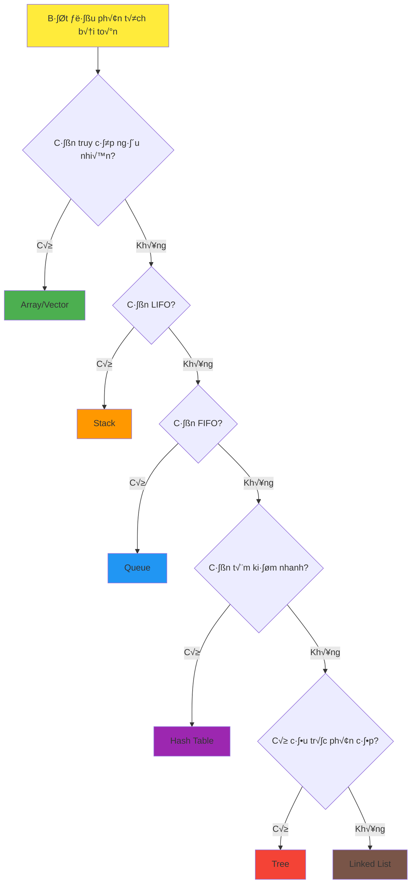

# Bài 2: Introduction to Data Structures
## Giới thiệu về Cấu trúc Dữ liệu

<div className="bg-blue-50 border-l-4 border-blue-400 p-4 mb-6">
  <h3 className="text-lg font-semibold text-blue-800 mb-2">🎯 Mục tiêu bài học</h3>
  <ul className="text-blue-700">
    <li>✅ Hiểu định nghĩa và tầm quan trọng của Data Structure</li>
    <li>✅ Phân loại các loại Data Structure cơ bản</li>
    <li>✅ So sánh ưu nhược điểm của từng loại</li>
    <li>✅ Hiểu mối quan hệ giữa Data Structure và hiệu suất</li>
    <li>✅ Thực hành phân tích bài toán để chọn cấu trúc phù hợp</li>
  </ul>
</div>

## 1. Data Structure là gì?

**Data Structure (Cấu trúc Dữ liệu)** là cách tổ chức và lưu trữ dữ liệu trong máy tính sao cho có thể sử dụng hiệu quả. Nó định nghĩa mối quan hệ giữa các dữ liệu và các operations có thể thực hiện trên chúng.

<div className="bg-green-50 border border-green-200 rounded-lg p-4 mb-4">
  <h4 className="text-green-800 font-semibold mb-2">💡 Tại sao Data Structure quan trọng?</h4>
  <div className="text-green-700">
    <p><strong>1. Tối ưu hóa hiệu suất:</strong> Chọn đúng cấu trúc dữ liệu có thể giảm thời gian xử lý từ O(n²) xuống O(log n)</p>
    <p><strong>2. Quản lý bộ nhớ:</strong> Sử dụng bộ nhớ hiệu quả hơn</p>
    <p><strong>3. Giải quyết bài toán:</strong> Mỗi cấu trúc phù hợp với từng loại bài toán cụ thể</p>
  </div>
</div>

## 2. Phân loại Data Structures


### 2.1 Primitive Data Types

| Loại | Kích thước | Phạm vi giá trị | Rust Example |
|------|------------|-----------------|-------------|
| `bool` | 1 byte | true, false | `let flag: bool = true;` |
| `i32` | 4 bytes | -2³¹ to 2³¹-1 | `let num: i32 = 42;` |
| `f64` | 8 bytes | IEEE 754 double | `let pi: f64 = 3.14159;` |
| `char` | 4 bytes | Unicode scalar | `let letter: char = 'A';` |

### 2.2 Linear Data Structures

<div className="overflow-x-auto mb-6">

| Structure | Ưu điểm | Nhược điểm | Complexity | Use Cases |
|-----------|---------|------------|------------|-----------|
| **Array** | Random access O(1)<br/>Memory efficient | Fixed size<br/>Insert/Delete expensive | Access: O(1)<br/>Insert: O(n) | Database records<br/>Mathematical operations |
| **Linked List** | Dynamic size<br/>Easy insert/delete | Sequential access<br/>Extra memory overhead | Access: O(n)<br/>Insert: O(1) | Implementation of stacks<br/>Undo functionality |
| **Stack** | LIFO operations<br/>Simple implementation | Limited access pattern<br/>Only top element | Push/Pop: O(1)<br/>Search: O(n) | Function calls<br/>Expression parsing |
| **Queue** | FIFO operations<br/>Fair scheduling | Limited access pattern<br/>Only front/rear | Enqueue/Dequeue: O(1)<br/>Search: O(n) | Task scheduling<br/>BFS algorithm |

</div>

### 2.3 Non-Linear Data Structures


| Structure | Đặc điểm | Complexity | Applications |
|-----------|----------|------------|--------------|
| **Tree** | Hierarchical structure<br/>No cycles | Search: O(log n) - O(n)<br/>Insert: O(log n) - O(n) | File systems<br/>Decision trees<br/>Database indexing |
| **Graph** | Network of nodes<br/>Can have cycles | Varies by algorithm<br/>DFS/BFS: O(V + E) | Social networks<br/>Route planning<br/>Web crawling |

## 3. Cách chọn Data Structure phù hợp

### 3.1 Decision Tree cho việc chọn Data Structure



### 3.2 Performance Comparison

<div className="overflow-x-auto mb-6">

| Operation | Array | Linked List | Stack | Queue | Hash Table | BST |
|-----------|-------|-------------|-------|-------|------------|-----|
| **Access** | O(1) | O(n) | O(1)* | O(1)* | O(1) avg | O(log n) |
| **Search** | O(n) | O(n) | O(n) | O(n) | O(1) avg | O(log n) |
| **Insert** | O(n) | O(1)** | O(1) | O(1) | O(1) avg | O(log n) |
| **Delete** | O(n) | O(1)** | O(1) | O(1) | O(1) avg | O(log n) |

</div>

<div className="text-sm text-gray-600 mb-4">
<em>* Chỉ access phần tử top/front<br/>
** Khi có reference đến node</em>
</div>

## 4. Ví dụ thực tế với Rust

### 4.1 So sánh hiệu suất Array vs LinkedList

```rust
use std::time::Instant;
use std::collections::LinkedList;

fn main() {
    const SIZE: usize = 100_000;
    
    // Array (Vec) performance
    let start = Instant::now();
    let mut vec = Vec::with_capacity(SIZE);
    for i in 0..SIZE {
        vec.push(i);
    }
    let vec_time = start.elapsed();
    
    // LinkedList performance
    let start = Instant::now();
    let mut list = LinkedList::new();
    for i in 0..SIZE {
        list.push_back(i);
    }
    let list_time = start.elapsed();
    
    println!("Vec creation: {:?}", vec_time);
    println!("LinkedList creation: {:?}", list_time);
    
    // Random access test
    let start = Instant::now();
    let _val = vec[SIZE/2];  // O(1)
    let vec_access = start.elapsed();
    
    let start = Instant::now();
    let _val = list.iter().nth(SIZE/2);  // O(n)
    let list_access = start.elapsed();
    
    println!("Vec access: {:?}", vec_access);
    println!("LinkedList access: {:?}", list_access);
}
```

### 4.2 Ví dụ chọn cấu trúc phù hợp

```rust
// Ví dụ 1: Lịch sử trình duyệt - Stack
struct BrowserHistory {
    history: Vec<String>,
    current: i32,
}

impl BrowserHistory {
    fn new() -> Self {
        BrowserHistory {
            history: Vec::new(),
            current: -1,
        }
    }
    
    fn visit(&mut self, url: String) {
        // Remove forward history
        self.history.truncate((self.current + 1) as usize);
        self.history.push(url);
        self.current += 1;
    }
    
    fn back(&mut self) -> Option<&String> {
        if self.current > 0 {
            self.current -= 1;
            Some(&self.history[self.current as usize])
        } else {
            None
        }
    }
}

// Ví dụ 2: Task Queue - Queue
use std::collections::VecDeque;

struct TaskScheduler {
    tasks: VecDeque<String>,
}

impl TaskScheduler {
    fn new() -> Self {
        TaskScheduler {
            tasks: VecDeque::new(),
        }
    }
    
    fn add_task(&mut self, task: String) {
        self.tasks.push_back(task);  // O(1)
    }
    
    fn process_next(&mut self) -> Option<String> {
        self.tasks.pop_front()  // O(1)
    }
}
```

## 5. Bài tập thực hành

### 5.1 Phân tích và lựa chọn

<div className="bg-yellow-50 border-l-4 border-yellow-400 p-4 mb-4">
<h4 className="font-semibold text-yellow-800 mb-2">📝 Bài tập 1: Phân tích bài toán</h4>
<p className="text-yellow-700">Cho các tình huống sau, hãy chọn Data Structure phù hợp nhất và giải thích lý do:</p>

<ol className="text-yellow-700 mt-2">
<li><strong>a)</strong> Lưu trữ danh sách sinh viên trong lớp, thường xuyên tìm kiếm theo MSSV</li>
<li><strong>b)</strong> Implement chức năng Undo/Redo trong text editor</li>
<li><strong>c)</strong> Quản lý hàng đợi in ấn trong máy tính</li>
<li><strong>d)</strong> Biểu diễn cấu trúc thư mục trong hệ điều hành</li>
<li><strong>e)</strong> Lưu trữ network của người bạn trên mạng xã hội</li>
</ol>
</div>

### 5.2 Coding Exercise với Rust

```rust
// Bài tập 2: Implement Simple Data Structure Manager
use std::collections::{HashMap, VecDeque};

struct DataManager {
    // Stack cho recent searches (LIFO)
    recent_searches: Vec<String>,      
    // Queue cho pending tasks (FIFO)  
    pending_tasks: VecDeque<String>,   
    // HashMap cho user scores (fast lookup)
    user_scores: HashMap<String, i32>, 
}

impl DataManager {
    fn new() -> Self {
        DataManager {
            recent_searches: Vec::new(),
            pending_tasks: VecDeque::new(),
            user_scores: HashMap::new(),
        }
    }
    
    // Stack operations cho search history
    fn add_search(&mut self, query: String) {
        // Giới hạn 10 searches gần nhất
        if self.recent_searches.len() >= 10 {
            self.recent_searches.remove(0); // Remove oldest
        }
        self.recent_searches.push(query); // Add to top
    }
    
    fn get_last_search(&mut self) -> Option<String> {
        self.recent_searches.pop() // LIFO - Last In, First Out
    }
    
    // Queue operations cho task management
    fn add_task(&mut self, task: String) {
        self.pending_tasks.push_back(task); // Enqueue
    }
    
    fn process_next_task(&mut self) -> Option<String> {
        self.pending_tasks.pop_front() // Dequeue - FIFO
    }
    
    // HashMap operations cho user scores
    fn update_score(&mut self, user: String, score: i32) {
        self.user_scores.insert(user, score); // O(1) average
    }
    
    fn get_score(&self, user: &str) -> Option<&i32> {
        self.user_scores.get(user) // O(1) average lookup
    }
    
    // Utility functions
    fn search_count(&self) -> usize {
        self.recent_searches.len()
    }
    
    fn pending_task_count(&self) -> usize {
        self.pending_tasks.len()
    }
}

// Test function để verify implementation
#[cfg(test)]
mod tests {
    use super::*;
    
    #[test]
    fn test_data_manager() {
        let mut dm = DataManager::new();
        
        // Test search history (Stack behavior)
        dm.add_search("rust programming".to_string());
        dm.add_search("data structures".to_string());
        
        assert_eq!(dm.get_last_search(), Some("data structures".to_string()));
        assert_eq!(dm.get_last_search(), Some("rust programming".to_string()));
        
        // Test task queue (Queue behavior)  
        dm.add_task("task1".to_string());
        dm.add_task("task2".to_string());
        
        assert_eq!(dm.process_next_task(), Some("task1".to_string()));
        assert_eq!(dm.process_next_task(), Some("task2".to_string()));
        
        // Test user scores (HashMap)
        dm.update_score("alice".to_string(), 95);
        dm.update_score("bob".to_string(), 87);
        
        assert_eq!(dm.get_score("alice"), Some(&95));
        assert_eq!(dm.get_score("charlie"), None);
    }
}
```

## 6. LeetCode Problems liên quan

<div className="bg-gray-50 border border-gray-200 rounded-lg p-4">
<h4 className="font-semibold text-gray-800 mb-3">🏆 Bài tập LeetCode liên quan đến Data Structures</h4>

### 🟢 Easy Level:
| Problem | Difficulty | Concept | Link |
|---------|------------|---------|------|
| Two Sum | Easy | Hash Table | [Problem 1](https://leetcode.com/problems/two-sum/) |
| Valid Parentheses | Easy | Stack | [Problem 20](https://leetcode.com/problems/valid-parentheses/) |
| Implement Queue using Stacks | Easy | Stack & Queue | [Problem 232](https://leetcode.com/problems/implement-queue-using-stacks/) |
| Remove Duplicates from Sorted Array | Easy | Array | [Problem 26](https://leetcode.com/problems/remove-duplicates-from-sorted-array/) |

### 🟡 Medium Level:
| Problem | Difficulty | Concept | Link |
|---------|------------|---------|------|
| LRU Cache | Medium | Hash + LinkedList | [Problem 146](https://leetcode.com/problems/lru-cache/) |
| Implement Stack using Queues | Medium | Queue & Stack | [Problem 225](https://leetcode.com/problems/implement-stack-using-queues/) |
| Design Circular Queue | Medium | Array-based Queue | [Problem 622](https://leetcode.com/problems/design-circular-queue/) |
| Top K Frequent Elements | Medium | Hash + Heap | [Problem 347](https://leetcode.com/problems/top-k-frequent-elements/) |

### 🔍 Pattern Recognition cho Data Structures:
- **Array problems:** Linear scan, two pointers, sliding window
- **Stack problems:** Matching patterns, monotonic stack, expression evaluation  
- **Queue problems:** Level-order processing, BFS traversal
- **Hash problems:** Frequency counting, fast lookups, caching
- **Linked List:** Two pointers, cycle detection, merging
</div>

## 7. Tóm tắt và Điểm cần nhớ

<div className="bg-indigo-50 border border-indigo-200 rounded-lg p-4 mt-6">
<h4 className="text-indigo-800 font-semibold mb-3">🎯 Key Takeaways</h4>

<div className="text-indigo-700 space-y-2">
<p><strong>1. Không có cấu trúc dữ liệu "tốt nhất":</strong> Mỗi cấu trúc có ưu nhược điểm riêng</p>
<p><strong>2. Phân tích bài toán trước:</strong> Hiểu requirements về access pattern, frequency of operations</p>
<p><strong>3. Trade-offs:</strong> Time vs Space, Simplicity vs Performance</p>
<p><strong>4. Big-O Analysis:</strong> Luôn cân nhắc complexity của các operations chính</p>
<p><strong>5. Real-world context:</strong> Consider memory constraints, concurrent access, data size</p>
</div>
</div>

---

<div className="text-center mt-8 p-4 bg-blue-100 rounded-lg">
<p className="text-blue-800 font-medium">🚀 <strong>Bài tiếp theo:</strong> Arrays - Cấu trúc dữ liệu đầu tiên</p>
<p className="text-blue-600 text-sm mt-1">Chúng ta sẽ đi sâu vào implementation và optimization của Arrays</p>
</div>