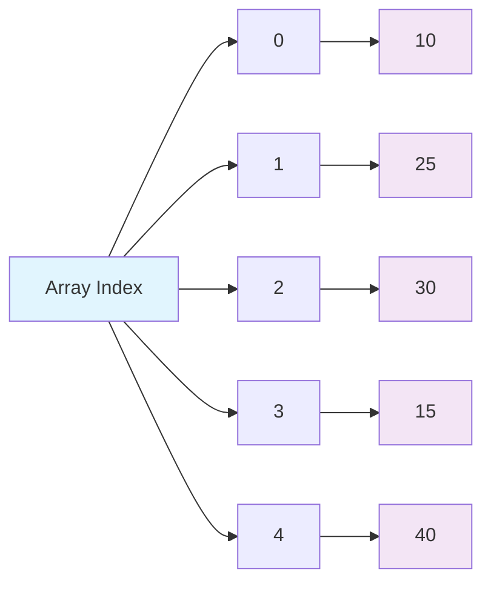
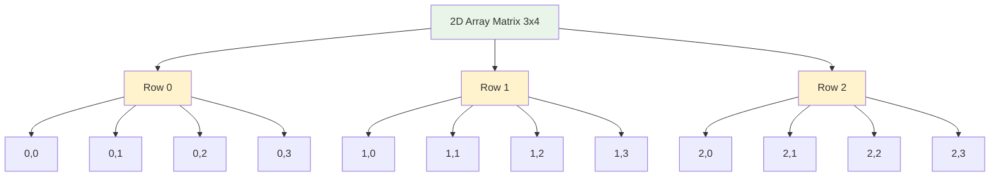
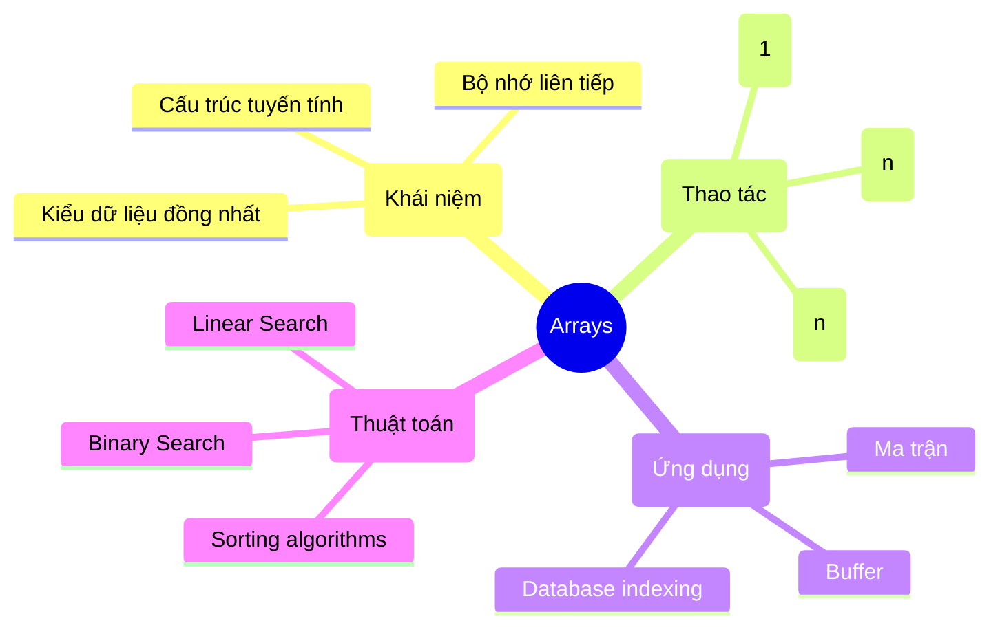

# Bài 3: Arrays - Cấu trúc dữ liệu đầu tiên

## 🎯 Mục tiêu học tập

<div className="bg-blue-50 border-l-4 border-blue-500 p-4 mb-6">
<h3 className="text-lg font-semibold text-blue-800 mb-2">Sau khi hoàn thành bài học này, bạn sẽ có thể:</h3>
<ul className="text-blue-700 space-y-1">
<li>✅ Hiểu khái niệm Array và cách lưu trữ trong bộ nhớ</li>
<li>✅ Thực hiện các thao tác cơ bản trên Array</li>
<li>✅ Phân tích độ phức tạp của các thuật toán Array</li>
<li>✅ Cài đặt các thuật toán cơ bản bằng C++</li>
</ul>
</div>

## 📚 1. Khái niệm cơ bản về Array

### 1.1 Định nghĩa

**Array** (mảng) là một cấu trúc dữ liệu tuyến tính lưu trữ các phần tử cùng kiểu dữ liệu trong các vị trí bộ nhớ liên tiếp.



### 1.2 Đặc điểm quan trọng

| Đặc điểm                   | Mô tả                                       | Ví dụ                        |
| -------------------------- | ------------------------------------------- | ---------------------------- |
| **Kích thước cố định**     | Số lượng phần tử được xác định khi khởi tạo | `int arr[5]`                 |
| **Kiểu dữ liệu đồng nhất** | Tất cả phần tử cùng kiểu                    | `int`, `double`, `char`      |
| **Truy cập ngẫu nhiên**    | Truy cập phần tử qua chỉ số O(1)            | `arr[3]`                     |
| **Bộ nhớ liên tiếp**       | Các phần tử được lưu kề nhau                | Địa chỉ: 1000, 1004, 1008... |

## 💾 2. Cách lưu trữ Array trong bộ nhớ

<div className="bg-gray-50 p-4 rounded-lg mb-4">
<h3 className="font-semibold mb-2">Sơ đồ bộ nhớ:</h3>

```mermaid
flowchart TD
    A[Memory Layout] --> B[Base Address: 1000]
    B --> C[arr[0]: 10]
    C --> D[arr[1]: 25]
    D --> E[arr[2]: 30]
    E --> F[arr[3]: 15]
    F --> G[arr[4]: 40]

    H[Address Calculation] --> I[arr[i] = base_address + i × sizeof(datatype)]

    style A fill:#fff3e0
    style H fill:#fff3e0
```

</div>

### Công thức tính địa chỉ:

**Address of arr[i] = Base Address + i × sizeof(data_type)**

## 🔧 3. Các thao tác cơ bản trên Array

### 3.1 Khai báo và Khởi tạo

```cpp
#include <iostream>
using namespace std;

int main() {
    // Khai báo
    int arr[5];                    // Mảng 5 phần tử
    int nums[] = {10, 25, 30, 15, 40};  // Khởi tạo với giá trị
    int matrix[3][4];              // Mảng 2 chiều

    // Khởi tạo với giá trị 0
    int zeros[10] = {0};

    return 0;
}
```

### 3.2 Bảng tóm tắt các thao tác

| Thao tác   | Độ phức tạp | Mô tả                         | Code mẫu            |
| ---------- | ----------- | ----------------------------- | ------------------- |
| **Access** | O(1)        | Truy cập phần tử tại vị trí i | `arr[i]`            |
| **Search** | O(n)        | Tìm kiếm phần tử              | Linear search       |
| **Insert** | O(n)        | Chèn phần tử                  | Dịch chuyển phần tử |
| **Delete** | O(n)        | Xóa phần tử                   | Dịch chuyển phần tử |
| **Update** | O(1)        | Cập nhật giá trị              | `arr[i] = value`    |

### 3.3 Cài đặt các thao tác cơ bản

```cpp
#include <iostream>
#include <vector>
using namespace std;

class DynamicArray {
private:
    vector<int> arr;
    int size;

public:
    DynamicArray(int capacity = 10) {
        arr.resize(capacity);
        size = 0;
    }

    // Truy cập phần tử - O(1)
    int get(int index) {
        if (index < 0 || index >= size) {
            throw out_of_range("Index out of bounds");
        }
        return arr[index];
    }

    // Cập nhật phần tử - O(1)
    void set(int index, int value) {
        if (index < 0 || index >= size) {
            throw out_of_range("Index out of bounds");
        }
        arr[index] = value;
    }

    // Chèn phần tử - O(n)
    void insert(int index, int value) {
        if (index < 0 || index > size) {
            throw out_of_range("Index out of bounds");
        }

        // Dịch chuyển các phần tử về phía sau
        for (int i = size; i > index; i--) {
            arr[i] = arr[i-1];
        }

        arr[index] = value;
        size++;
    }

    // Xóa phần tử - O(n)
    void deleteAt(int index) {
        if (index < 0 || index >= size) {
            throw out_of_range("Index out of bounds");
        }

        // Dịch chuyển các phần tử về phía trước
        for (int i = index; i < size - 1; i++) {
            arr[i] = arr[i+1];
        }

        size--;
    }

    // Tìm kiếm tuyến tính - O(n)
    int linearSearch(int target) {
        for (int i = 0; i < size; i++) {
            if (arr[i] == target) {
                return i;
            }
        }
        return -1; // Không tìm thấy
    }

    // Hiển thị mảng
    void display() {
        cout << "Array: [";
        for (int i = 0; i < size; i++) {
            cout << arr[i];
            if (i < size - 1) cout << ", ";
        }
        cout << "]" << endl;
    }

    int getSize() { return size; }
};
```

## 🎨 4. Mảng đa chiều

### 4.1 Mảng 2 chiều



### 4.2 Cài đặt ma trận

```cpp
#include <iostream>
#include <vector>
using namespace std;

class Matrix {
private:
    vector<vector<int>> data;
    int rows, cols;

public:
    Matrix(int r, int c) : rows(r), cols(c) {
        data.resize(rows, vector<int>(cols, 0));
    }

    // Thiết lập giá trị
    void setValue(int row, int col, int value) {
        if (row >= 0 && row < rows && col >= 0 && col < cols) {
            data[row][col] = value;
        }
    }

    // Lấy giá trị
    int getValue(int row, int col) {
        if (row >= 0 && row < rows && col >= 0 && col < cols) {
            return data[row][col];
        }
        return -1; // Invalid
    }

    // Hiển thị ma trận
    void display() {
        for (int i = 0; i < rows; i++) {
            for (int j = 0; j < cols; j++) {
                cout << data[i][j] << "\t";
            }
            cout << endl;
        }
    }

    // Cộng hai ma trận
    Matrix add(const Matrix& other) {
        if (rows != other.rows || cols != other.cols) {
            throw invalid_argument("Matrix dimensions must match");
        }

        Matrix result(rows, cols);
        for (int i = 0; i < rows; i++) {
            for (int j = 0; j < cols; j++) {
                result.data[i][j] = data[i][j] + other.data[i][j];
            }
        }
        return result;
    }
};
```

## 📊 5. Phân tích độ phức tạp

<div className="bg-yellow-50 border border-yellow-200 rounded-lg p-4 mb-4">
<h3 className="font-semibold text-yellow-800 mb-3">Bảng so sánh độ phức tạp</h3>

| Thao tác              | Time Complexity | Space Complexity | Ghi chú                 |
| --------------------- | --------------- | ---------------- | ----------------------- |
| **Truy cập**          | O(1)            | O(1)             | Random access           |
| **Tìm kiếm**          | O(n)            | O(1)             | Linear search           |
| **Tìm kiếm (sorted)** | O(log n)        | O(1)             | Binary search           |
| **Chèn đầu**          | O(n)            | O(1)             | Dịch chuyển n phần tử   |
| **Chèn cuối**         | O(1)            | O(1)             | Nếu còn chỗ trống       |
| **Chèn giữa**         | O(n)            | O(1)             | Dịch chuyển k phần tử   |
| **Xóa đầu**           | O(n)            | O(1)             | Dịch chuyển n-1 phần tử |
| **Xóa cuối**          | O(1)            | O(1)             | Không cần dịch chuyển   |
| **Xóa giữa**          | O(n)            | O(1)             | Dịch chuyển k phần tử   |

</div>

## 🚀 6. Thuật toán cơ bản trên Array

### 6.1 Tìm phần tử lớn nhất

```cpp
int findMax(vector<int>& arr) {
    if (arr.empty()) return -1;

    int maxVal = arr[0];
    for (int i = 1; i < arr.size(); i++) {
        if (arr[i] > maxVal) {
            maxVal = arr[i];
        }
    }
    return maxVal;
}
```

### 6.2 Đảo ngược mảng

```cpp
void reverseArray(vector<int>& arr) {
    int left = 0, right = arr.size() - 1;

    while (left < right) {
        swap(arr[left], arr[right]);
        left++;
        right--;
    }
}
```

### 6.3 Xoay mảng

```cpp
void rotateRight(vector<int>& arr, int k) {
    int n = arr.size();
    k = k % n; // Xử lý trường hợp k > n

    // Đảo ngược toàn bộ mảng
    reverse(arr.begin(), arr.end());

    // Đảo ngược k phần tử đầu
    reverse(arr.begin(), arr.begin() + k);

    // Đảo ngược n-k phần tử cuối
    reverse(arr.begin() + k, arr.end());
}
```

## 💡 7. Ứng dụng thực tế

<div className="grid grid-cols-1 md:grid-cols-2 gap-4 mb-4">
<div className="border border-gray-200 rounded-lg p-4">
<h3 className="font-semibold text-green-700 mb-2">Ưu điểm</h3>
<ul className="text-sm text-green-600 space-y-1">
<li>• Truy cập nhanh O(1)</li>
<li>• Sử dụng bộ nhớ hiệu quả</li>
<li>• Đơn giản, dễ hiểu</li>
<li>• Cache-friendly</li>
</ul>
</div>

<div className="border border-gray-200 rounded-lg p-4">
<h3 className="font-semibold text-red-700 mb-2">Nhược điểm</h3>
<ul className="text-sm text-red-600 space-y-1">
<li>• Kích thước cố định</li>
<li>• Insert/Delete chậm O(n)</li>
<li>• Lãng phí bộ nhớ nếu không đầy</li>
<li>• Không thể mở rộng động</li>
</ul>
</div>
</div>

## 🏆 8. Bài tập thực hành

### Danh sách bài tập LeetCode liên quan:

| STT | Tên bài                         | Độ khó | Link                                                                           | Kỹ thuật chính     |
| --- | ------------------------------- | ------ | ------------------------------------------------------------------------------ | ------------------ |
| 1   | Two Sum                         | Easy   | [LeetCode 1](https://leetcode.com/problems/two-sum/)                           | Hash Map           |
| 2   | Best Time to Buy and Sell Stock | Easy   | [LeetCode 121](https://leetcode.com/problems/best-time-to-buy-and-sell-stock/) | One Pass           |
| 3   | Contains Duplicate              | Easy   | [LeetCode 217](https://leetcode.com/problems/contains-duplicate/)              | Hash Set           |
| 4   | Maximum Subarray                | Medium | [LeetCode 53](https://leetcode.com/problems/maximum-subarray/)                 | Kadane's Algorithm |
| 5   | Rotate Array                    | Medium | [LeetCode 189](https://leetcode.com/problems/rotate-array/)                    | Reverse Technique  |
| 6   | 3Sum                            | Medium | [LeetCode 15](https://leetcode.com/problems/3sum/)                             | Two Pointers       |
| 7   | Container With Most Water       | Medium | [LeetCode 11](https://leetcode.com/problems/container-with-most-water/)        | Two Pointers       |
| 8   | Product of Array Except Self    | Medium | [LeetCode 238](https://leetcode.com/problems/product-of-array-except-self/)    | Prefix/Suffix      |

### Bài tập tự luyện:

<div className="bg-blue-50 border border-blue-200 rounded-lg p-4">
<h3 className="font-semibold text-blue-800 mb-2">Thực hành ngay:</h3>
<ol className="text-blue-700 space-y-2 list-decimal list-inside">
<li>Viết hàm tìm phần tử xuất hiện nhiều nhất trong mảng</li>
<li>Cài đặt thuật toán merge hai mảng đã sắp xếp</li>
<li>Tìm cặp số có tổng bằng target cho trước</li>
<li>Xóa các phần tử trùng lặp trong mảng đã sắp xếp</li>
<li>Tìm intersection của hai mảng</li>
</ol>
</div>

## 📝 9. Tóm tắt



<div className="bg-green-50 border-l-4 border-green-500 p-4 mt-6">
<h3 className="text-green-800 font-semibold mb-2">🎯 Key Takeaways</h3>
<ul className="text-green-700 space-y-1">
<li>• Array là nền tảng của nhiều cấu trúc dữ liệu khác</li>
<li>• Hiểu rõ trade-offs giữa space và time complexity</li>
<li>• Luyện tập nhiều với các thuật toán trên array</li>
<li>• Áp dụng vào các bài toán thực tế</li>
</ul>
</div>

---

**Bài tiếp theo:** Bài 4 - Linked Lists (Danh sách liên kết)
