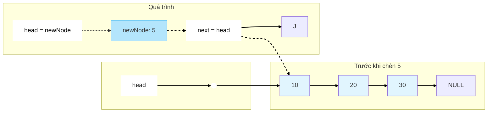
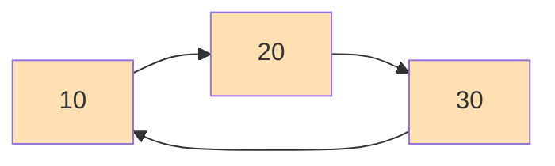

# Bài 4: Linked Lists - Danh sách liên kết

## 📚 Mục tiêu học tập

<div className="border-l-4 border-blue-400 p-4 mb-6">
  <div className="flex">
    <div className="ml-3">
      <p className="text-blue-700 font-medium">Sau khi hoàn thành bài học này, bạn sẽ:</p>
      <ul className="mt-2 text-blue-600">
        <li>✅ Hiểu khái niệm Node và con trỏ trong Linked List</li>
        <li>✅ Cài đặt và sử dụng Singly Linked List</li>
        <li>✅ Thực hiện các thao tác chèn, xóa trên Linked List</li>
        <li>✅ Phân biệt Singly, Doubly và Circular Linked List</li>
        <li>✅ So sánh hiệu suất Array vs Linked List</li>
      </ul>
    </div>
  </div>
</div>

## 1. Khái niệm cơ bản

### 1.1 Linked List là gì?

**Linked List** là một cấu trúc dữ liệu tuyến tính trong đó các phần tử không được lưu trữ ở các vị trí bộ nhớ liền kề. Thay vào đó, mỗi phần tử chứa dữ liệu và một con trỏ (pointer) đến phần tử tiếp theo.

### 1.2 Cấu trúc Node

```mermaid
graph LR
    A[Data | Next] --> B[Data | Next]
    B --> C[Data | NULL]

    style A fill:#e1f5fe
    style B fill:#e1f5fe
    style C fill:#e1f5fe
```

```cpp
// Định nghĩa Node cơ bản
struct ListNode {
    int data;           // Dữ liệu
    ListNode* next;     // Con trỏ đến node tiếp theo

    // Constructor
    ListNode(int val) : data(val), next(nullptr) {}
};
```

## 2. So sánh Array vs Linked List

| Đặc điểm       | Array                   | Linked List                     |
| -------------- | ----------------------- | ------------------------------- |
| **Truy cập**   | O(1) - Random access    | O(n) - Sequential access        |
| **Chèn đầu**   | O(n) - Cần dịch chuyển  | O(1) - Chỉ thay đổi con trỏ     |
| **Chèn cuối**  | O(1) - Nếu có chỗ trống | O(n) - Cần duyệt đến cuối       |
| **Xóa đầu**    | O(n) - Cần dịch chuyển  | O(1) - Chỉ thay đổi con trỏ     |
| **Bộ nhớ**     | Liền kề, cache-friendly | Không liền kề, overhead pointer |
| **Kích thước** | Cố định                 | Động                            |

<div className="border-l-4 border-yellow-400 p-4 my-4">
  <div className="flex">
    <div className="ml-3">
      <p className="text-yellow-700 font-medium">💡 Lưu ý:</p>
      <p className="text-yellow-600 mt-1">Linked List phù hợp khi cần thêm/xóa thường xuyên ở đầu danh sách. Array phù hợp khi cần truy cập ngẫu nhiên thường xuyên.</p>
    </div>
  </div>
</div>

## 3. Singly Linked List

### 3.1 Cài đặt cơ bản

```cpp
class SinglyLinkedList {
private:
    ListNode* head;
    int size;

public:
    SinglyLinkedList() : head(nullptr), size(0) {}

    // Destructor để giải phóng bộ nhớ
    ~SinglyLinkedList() {
        clear();
    }

    // Kiểm tra danh sách rỗng
    bool isEmpty() const {
        return head == nullptr;
    }

    // Lấy kích thước
    int getSize() const {
        return size;
    }
};
```

### 3.2 Các thao tác cơ bản

#### Chèn tại đầu (Insert at Head)



```cpp
void insertAtHead(int data) {
    ListNode* newNode = new ListNode(data);
    newNode->next = head;
    head = newNode;
    size++;
}
```

#### Chèn tại cuối (Insert at Tail)

```cpp
void insertAtTail(int data) {
    ListNode* newNode = new ListNode(data);

    if (isEmpty()) {
        head = newNode;
    } else {
        ListNode* current = head;
        while (current->next != nullptr) {
            current = current->next;
        }
        current->next = newNode;
    }
    size++;
}
```

#### Chèn tại vị trí bất kỳ

```cpp
void insertAtPosition(int data, int position) {
    if (position < 0 || position > size) {
        throw std::out_of_range("Invalid position");
    }

    if (position == 0) {
        insertAtHead(data);
        return;
    }

    ListNode* newNode = new ListNode(data);
    ListNode* current = head;

    for (int i = 0; i < position - 1; i++) {
        current = current->next;
    }

    newNode->next = current->next;
    current->next = newNode;
    size++;
}
```

### 3.3 Thao tác xóa

#### Xóa tại đầu

```cpp
void deleteAtHead() {
    if (isEmpty()) {
        throw std::runtime_error("Cannot delete from empty list");
    }

    ListNode* temp = head;
    head = head->next;
    delete temp;
    size--;
}
```

#### Xóa theo giá trị

```cpp
bool deleteByValue(int data) {
    if (isEmpty()) return false;

    if (head->data == data) {
        deleteAtHead();
        return true;
    }

    ListNode* current = head;
    while (current->next != nullptr && current->next->data != data) {
        current = current->next;
    }

    if (current->next != nullptr) {
        ListNode* temp = current->next;
        current->next = temp->next;
        delete temp;
        size--;
        return true;
    }

    return false; // Không tìm thấy
}
```

### 3.4 Các thao tác khác

```cpp
// Tìm kiếm
bool search(int data) const {
    ListNode* current = head;
    while (current != nullptr) {
        if (current->data == data) {
            return true;
        }
        current = current->next;
    }
    return false;
}

// In danh sách
void display() const {
    ListNode* current = head;
    while (current != nullptr) {
        std::cout << current->data;
        if (current->next != nullptr) {
            std::cout << " -> ";
        }
        current = current->next;
    }
    std::cout << " -> NULL" << std::endl;
}

// Xóa toàn bộ danh sách
void clear() {
    while (!isEmpty()) {
        deleteAtHead();
    }
}
```

## 4. Doubly Linked List

<div className="border border-green-200 rounded-lg p-4 mb-6">
  <h3 className="text-green-800 font-semibold mb-2">🔗 Doubly Linked List</h3>
  <p className="text-green-700">Mỗi node có hai con trỏ: một trỏ đến node trước và một trỏ đến node sau.</p>
</div>

```mermaid
graph LR
    A[NULL | 10 | next] <--> B[prev | 20 | next] <--> C[prev | 30 | NULL]

    style A fill:#f3e5f5
    style B fill:#f3e5f5
    style C fill:#f3e5f5
```

### 4.1 Cấu trúc Node

```cpp
struct DoublyListNode {
    int data;
    DoublyListNode* next;
    DoublyListNode* prev;

    DoublyListNode(int val) : data(val), next(nullptr), prev(nullptr) {}
};

class DoublyLinkedList {
private:
    DoublyListNode* head;
    DoublyListNode* tail;
    int size;

public:
    DoublyLinkedList() : head(nullptr), tail(nullptr), size(0) {}
};
```

### 4.2 Ưu điểm của Doubly Linked List

| Thao tác              | Singly              | Doubly                 |
| --------------------- | ------------------- | ---------------------- |
| **Duyệt ngược**       | Không thể           | O(n) từ tail           |
| **Xóa node hiện tại** | O(n) - cần tìm prev | O(1) - có prev         |
| **Chèn trước node**   | O(n)                | O(1)                   |
| **Bộ nhớ**            | Ít hơn              | Nhiều hơn (2 pointers) |

### 4.3 Chèn vào Doubly Linked List

```cpp
void insertAtHead(int data) {
    DoublyListNode* newNode = new DoublyListNode(data);

    if (isEmpty()) {
        head = tail = newNode;
    } else {
        newNode->next = head;
        head->prev = newNode;
        head = newNode;
    }
    size++;
}

void insertAtTail(int data) {
    DoublyListNode* newNode = new DoublyListNode(data);

    if (isEmpty()) {
        head = tail = newNode;
    } else {
        tail->next = newNode;
        newNode->prev = tail;
        tail = newNode;
    }
    size++;
}
```

## 5. Circular Linked List



<div className="border border-orange-200 rounded-lg p-4 mb-6">
  <h3 className="text-orange-800 font-semibold mb-2">🔄 Circular Linked List</h3>
  <p className="text-orange-700">Node cuối cùng trỏ về node đầu tiên, tạo thành vòng tròn.</p>
</div>

### 5.1 Ứng dụng thực tế

- **Round-robin scheduling** trong hệ điều hành
- **Music playlist** lặp lại
- **Game turn management**

## 6. Phân tích độ phức tạp

### 6.1 Time Complexity

| Thao tác          | Singly LL | Doubly LL | Array  |
| ----------------- | --------- | --------- | ------ |
| **Access**        | O(n)      | O(n)      | O(1)   |
| **Search**        | O(n)      | O(n)      | O(n)   |
| **Insert Head**   | O(1)      | O(1)      | O(n)   |
| **Insert Tail**   | O(n)\*    | O(1)      | O(1)\* |
| **Insert Middle** | O(n)      | O(n)      | O(n)   |
| **Delete Head**   | O(1)      | O(1)      | O(n)   |
| **Delete Tail**   | O(n)      | O(1)      | O(1)   |

_\* Giả sử biết tail pointer cho LL và có chỗ trống cho Array_

### 6.2 Space Complexity

```cpp
// Singly Linked List: O(1) extra space per node
struct ListNode {
    int data;        // 4 bytes
    ListNode* next;  // 8 bytes (64-bit)
};  // Total: 12-16 bytes per node

// Doubly Linked List: O(1) extra space per node
struct DoublyListNode {
    int data;               // 4 bytes
    DoublyListNode* next;   // 8 bytes
    DoublyListNode* prev;   // 8 bytes
};  // Total: 20-24 bytes per node
```

## 7. Các kỹ thuật quan trọng

### 7.1 Two Pointers Technique

```cpp
// Tìm node giữa danh sách
ListNode* findMiddle(ListNode* head) {
    if (!head) return nullptr;

    ListNode* slow = head;
    ListNode* fast = head;

    while (fast && fast->next) {
        slow = slow->next;
        fast = fast->next->next;
    }

    return slow;
}

// Phát hiện cycle trong linked list
bool hasCycle(ListNode* head) {
    if (!head || !head->next) return false;

    ListNode* slow = head;
    ListNode* fast = head;

    while (fast && fast->next) {
        slow = slow->next;
        fast = fast->next->next;

        if (slow == fast) {
            return true;
        }
    }

    return false;
}
```

### 7.2 Reverse Linked List

```cpp
ListNode* reverse(ListNode* head) {
    ListNode* prev = nullptr;
    ListNode* current = head;

    while (current != nullptr) {
        ListNode* nextTemp = current->next;
        current->next = prev;
        prev = current;
        current = nextTemp;
    }

    return prev; // prev trở thành head mới
}
```

## 8. Bài tập LeetCode liên quan

<div className="border border-indigo-200 rounded-lg p-4">
  <h3 className="text-indigo-800 font-semibold mb-3">📝 Danh sách bài tập thực hành</h3>
  
  <div className="grid grid-cols-1 md:grid-cols-2 gap-4">
    <div>
      <h4 className="font-semibold text-indigo-700 mb-2">🟢 Easy Level</h4>
      <ul className="text-indigo-600 space-y-1">
        <li>• <strong>21</strong> - Merge Two Sorted Lists</li>
        <li>• <strong>83</strong> - Remove Duplicates from Sorted List</li>
        <li>• <strong>141</strong> - Linked List Cycle</li>
        <li>• <strong>160</strong> - Intersection of Two Linked Lists</li>
        <li>• <strong>203</strong> - Remove Linked List Elements</li>
        <li>• <strong>206</strong> - Reverse Linked List</li>
        <li>• <strong>234</strong> - Palindrome Linked List</li>
      </ul>
    </div>
    
    <div>
      <h4 className="font-semibold text-indigo-700 mb-2">🟡 Medium Level</h4>
      <ul className="text-indigo-600 space-y-1">
        <li>• <strong>2</strong> - Add Two Numbers</li>
        <li>• <strong>19</strong> - Remove Nth Node From End</li>
        <li>• <strong>24</strong> - Swap Nodes in Pairs</li>
        <li>• <strong>61</strong> - Rotate List</li>
        <li>• <strong>82</strong> - Remove Duplicates from Sorted List II</li>
        <li>• <strong>92</strong> - Reverse Linked List II</li>
        <li>• <strong>142</strong> - Linked List Cycle II</li>
        <li>• <strong>143</strong> - Reorder List</li>
      </ul>
    </div>
  </div>
</div>

## 9. Tóm tắt

### 9.1 Khi nào sử dụng Linked List?

✅ **Sử dụng khi:**

- Cần chèn/xóa thường xuyên ở đầu danh sách
- Không biết trước kích thước dữ liệu
- Cần cấu trúc động
- Ít cần truy cập ngẫu nhiên

❌ **Không nên sử dụng khi:**

- Cần truy cập ngẫu nhiên thường xuyên
- Bộ nhớ hạn chế (overhead của pointer)
- Cần cache locality cao
- Làm việc với dữ liệu số học phức tạp

### 9.2 Key Takeaways

<div className="border border-gray-200 rounded-lg p-4">
  <ul className="space-y-2 text-gray-700">
    <li><strong>🎯 Node Structure:</strong> Data + Pointer(s)</li>
    <li><strong>🎯 Dynamic Size:</strong> Thêm/xóa linh hoạt</li>
    <li><strong>🎯 Sequential Access:</strong> Chỉ có thể duyệt tuần tự</li>
    <li><strong>🎯 Memory Overhead:</strong> Cần thêm bộ nhớ cho pointer</li>
    <li><strong>🎯 Cache Performance:</strong> Kém hơn Array do không liền kề</li>
  </ul>
</div>

---

<div className="text-center mt-8 p-4 border-t border-gray-200">
  <p className="text-gray-600 italic">
    💡 "Linked Lists are fundamental building blocks for many advanced data structures like Trees and Graphs"
  </p>
</div>
