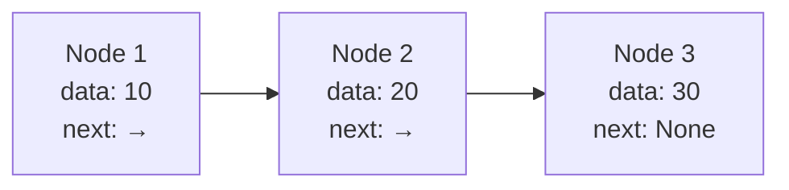
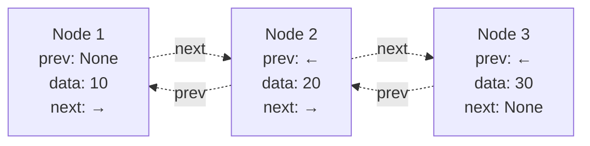
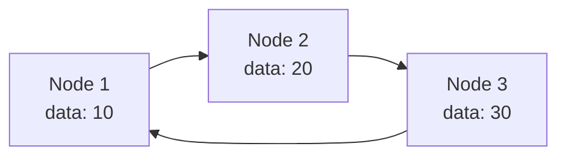
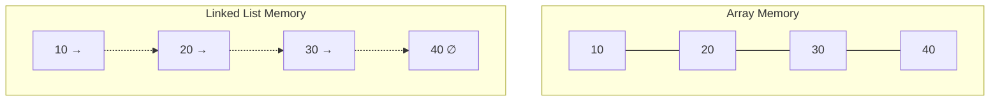

# Bài 4: Linked Lists - Danh sách liên kết

## Mục tiêu học tập

Sau khi hoàn thành bài học này, bạn sẽ có khả năng:
- Hiểu cấu trúc Node và cách sử dụng pointer/reference
- Cài đặt các loại Linked List cơ bản
- Phân tích ưu nhược điểm so với Array
- Thực hiện các thao tác CRUD trên Linked List

---

## 1. Giới thiệu về Linked List

### Khái niệm cơ bản

<div className="bg-blue-50 border-l-4 border-blue-500 p-4 my-4">
  <h4 className="text-lg font-semibold text-blue-800">Định nghĩa</h4>
  <p className="text-blue-700">Linked List là cấu trúc dữ liệu tuyến tính trong đó các phần tử (node) được lưu trữ trong các vị trí bộ nhớ không liền kề và được liên kết với nhau thông qua các con trỏ (pointer) hoặc tham chiếu (reference).</p>
</div>

### So sánh Linked List với Array

| Tiêu chí | Array | Linked List |
|----------|--------|-------------|
| **Lưu trữ bộ nhớ** | Liền kề | Không liền kề |
| **Truy cập ngẫu nhiên** | O(1) | O(n) |
| **Chèn/xóa đầu** | O(n) | O(1) |
| **Chèn/xóa cuối** | O(1) | O(n) cho SLL, O(1) cho DLL |
| **Memory overhead** | Thấp | Cao (do pointer) |
| **Cache performance** | Tốt | Kém |

---

## 2. Cấu trúc Node

### Node cơ bản

```rust
#[derive(Debug, Clone)]
struct Node<T> {
    data: T,
    next: Option<Box<Node<T>>>,
}

impl<T> Node<T> {
    fn new(data: T) -> Self {
        Node {
            data,
            next: None,
        }
    }
}
```

### Minh họa cấu trúc Node



---

## 3. Singly Linked List

### Cài đặt SLL

```rust
#[derive(Debug)]
pub struct SinglyLinkedList<T> {
    head: Option<Box<Node<T>>>,
    size: usize,
}

impl<T: Clone> SinglyLinkedList<T> {
    pub fn new() -> Self {
        SinglyLinkedList {
            head: None,
            size: 0,
        }
    }

    // Chèn vào đầu danh sách - O(1)
    pub fn push_front(&mut self, data: T) {
        let new_node = Box::new(Node {
            data,
            next: self.head.take(),
        });
        self.head = Some(new_node);
        self.size += 1;
    }

    // Xóa phần tử đầu - O(1)
    pub fn pop_front(&mut self) -> Option<T> {
        self.head.take().map(|node| {
            self.head = node.next;
            self.size -= 1;
            node.data
        })
    }

    // Tìm kiếm - O(n)
    pub fn find(&self, target: &T) -> bool 
    where T: PartialEq {
        let mut current = &self.head;
        while let Some(node) = current {
            if node.data == *target {
                return true;
            }
            current = &node.next;
        }
        false
    }

    // Chèn tại vị trí index - O(n)
    pub fn insert_at(&mut self, index: usize, data: T) -> Result<(), &'static str> {
        if index > self.size {
            return Err("Index out of bounds");
        }

        if index == 0 {
            self.push_front(data);
            return Ok(());
        }

        let mut current = &mut self.head;
        for _ in 0..index-1 {
            if let Some(node) = current {
                current = &mut node.next;
            }
        }

        if let Some(node) = current {
            let new_node = Box::new(Node {
                data,
                next: node.next.take(),
            });
            node.next = Some(new_node);
            self.size += 1;
        }

        Ok(())
    }

    pub fn len(&self) -> usize {
        self.size
    }

    pub fn is_empty(&self) -> bool {
        self.head.is_none()
    }
}
```

### Thao tác trên SLL

<div className="overflow-x-auto">

| Thao tác | Time Complexity | Space Complexity | Mô tả |
|----------|-----------------|------------------|--------|
| **Insert Head** | O(1) | O(1) | Chèn vào đầu danh sách |
| **Insert Tail** | O(n) | O(1) | Chèn vào cuối danh sách |
| **Insert Middle** | O(n) | O(1) | Chèn tại vị trí bất kỳ |
| **Delete Head** | O(1) | O(1) | Xóa phần tử đầu |
| **Delete Tail** | O(n) | O(1) | Xóa phần tử cuối |
| **Search** | O(n) | O(1) | Tìm kiếm phần tử |
| **Access** | O(n) | O(1) | Truy cập theo index |

</div>

---

## 4. Doubly Linked List

### Cấu trúc Node cho DLL

```rust
#[derive(Debug)]
struct DoublyNode<T> {
    data: T,
    next: Option<Box<DoublyNode<T>>>,
    prev: Option<*mut DoublyNode<T>>, // Raw pointer for prev to avoid cycle
}

#[derive(Debug)]
pub struct DoublyLinkedList<T> {
    head: Option<Box<DoublyNode<T>>>,
    tail: Option<*mut DoublyNode<T>>,
    size: usize,
}
```

### Minh họa DLL



### Ưu điểm của DLL

<div className="grid grid-cols-1 md:grid-cols-2 gap-4 my-4">
  <div className="bg-green-50 border border-green-200 rounded-lg p-4">
    <h4 className="font-semibold text-green-800 mb-2">✅ Ưu điểm</h4>
    <ul className="text-green-700 text-sm space-y-1">
      <li>• Duyệt hai chiều (forward & backward)</li>
      <li>• Xóa node hiện tại O(1)</li>
      <li>• Insert/Delete tail O(1)</li>
      <li>• Thuận tiện cho undo operations</li>
    </ul>
  </div>
  <div className="bg-red-50 border border-red-200 rounded-lg p-4">
    <h4 className="font-semibold text-red-800 mb-2">❌ Nhược điểm</h4>
    <ul className="text-red-700 text-sm space-y-1">
      <li>• Memory overhead cao hơn</li>
      <li>• Cài đặt phức tạp hơn</li>
      <li>• Cache performance kém hơn</li>
    </ul>
  </div>
</div>

---

## 5. Circular Linked List

### Đặc điểm

<div className="bg-yellow-50 border-l-4 border-yellow-500 p-4 my-4">
  <p className="text-yellow-800">Trong Circular Linked List, node cuối cùng trỏ về node đầu tiên, tạo thành một vòng tròn. Điều này có ích cho các ứng dụng cần lặp liên tục như round-robin scheduling.</p>
</div>

### Minh họa CLL



### Cài đặt CLL cơ bản

```rust
impl<T: Clone> CircularLinkedList<T> {
    pub fn insert_after_current(&mut self, data: T) {
        if let Some(current) = &mut self.current {
            let new_node = Box::new(Node {
                data,
                next: current.next.take(),
            });
            current.next = Some(new_node);
            self.size += 1;
        }
    }

    pub fn move_next(&mut self) {
        if let Some(current) = self.current.take() {
            self.current = current.next;
        }
    }
}
```

---

## 6. Phân tích Performance

### Memory Layout Comparison



### Time Complexity Summary

<div className="overflow-x-auto">

| Operation | Array | Singly LL | Doubly LL | Circular LL |
|-----------|--------|-----------|-----------|-------------|
| **Access by index** | O(1) | O(n) | O(n) | O(n) |
| **Search** | O(n) | O(n) | O(n) | O(n) |
| **Insert head** | O(n) | O(1) | O(1) | O(1) |
| **Insert tail** | O(1) | O(n) | O(1) | O(1) |
| **Delete head** | O(n) | O(1) | O(1) | O(1) |
| **Delete tail** | O(1) | O(n) | O(1) | O(1) |
| **Delete middle** | O(n) | O(n) | O(1)* | O(n) |

</div>

*Với điều kiện biết trước node cần xóa

---

## 7. Ứng dụng thực tế

### Use Cases Map

| Ứng dụng | Loại LL phù hợp | Lý do |
|----------|------------------|--------|
| **Browser History** | Doubly LL | Cần back/forward |
| **Music Playlist** | Circular LL | Lặp liên tục |
| **Undo Operations** | Doubly LL | Undo/Redo |
| **Memory Management** | Singly LL | Đơn giản, hiệu quả |
| **Process Scheduling** | Circular LL | Round-robin |
| **Stack Implementation** | Singly LL | Chỉ cần LIFO |

---

## 8. Code Example: Complete Implementation

```rust
fn main() {
    let mut list = SinglyLinkedList::new();
    
    // Test insertions
    list.push_front(30);
    list.push_front(20);
    list.push_front(10);
    
    println!("List size: {}", list.len()); // 3
    
    // Test search
    println!("Find 20: {}", list.find(&20)); // true
    println!("Find 40: {}", list.find(&40)); // false
    
    // Test insertion at index
    list.insert_at(1, 15).unwrap();
    println!("After insert at index 1, size: {}", list.len()); // 4
    
    // Test deletion
    if let Some(value) = list.pop_front() {
        println!("Popped: {}", value); // 10
    }
}
```

---

## 9. Best Practices và Tips

<div className="grid grid-cols-1 md:grid-cols-2 gap-4 my-6">
  <div className="bg-blue-50 border border-blue-200 rounded-lg p-4">
    <h4 className="font-semibold text-blue-800 mb-2">💡 Best Practices</h4>
    <ul className="text-blue-700 text-sm space-y-1">
      <li>• Luôn kiểm tra null pointer</li>
      <li>• Sử dụng smart pointer (Box, Rc, Arc)</li>
      <li>• Cập nhật size counter</li>
      <li>• Handle edge cases (empty list)</li>
    </ul>
  </div>
  <div className="bg-purple-50 border border-purple-200 rounded-lg p-4">
    <h4 className="font-semibold text-purple-800 mb-2">⚠️ Common Pitfalls</h4>
    <ul className="text-purple-700 text-sm space-y-1">
      <li>• Memory leaks với raw pointer</li>
      <li>• Infinite loops trong CLL</li>
      <li>• Không cập nhật tail pointer</li>
      <li>• Race conditions trong multi-thread</li>
    </ul>
  </div>
</div>

---

## 10. Bài tập LeetCode liên quan

### Danh sách bài tập từ dễ đến khó

| STT | Bài tập | Độ khó | Kỹ năng |
|-----|---------|---------|---------|
| 1 | [206. Reverse Linked List](https://leetcode.com/problems/reverse-linked-list/) | Easy | Đảo ngược LL |
| 2 | [21. Merge Two Sorted Lists](https://leetcode.com/problems/merge-two-sorted-lists/) | Easy | Merge LL |
| 3 | [141. Linked List Cycle](https://leetcode.com/problems/linked-list-cycle/) | Easy | Cycle detection |
| 4 | [876. Middle of the Linked List](https://leetcode.com/problems/middle-of-the-linked-list/) | Easy | Two pointers |
| 5 | [19. Remove Nth Node From End](https://leetcode.com/problems/remove-nth-node-from-end-of-list/) | Medium | Two pointers |
| 6 | [2. Add Two Numbers](https://leetcode.com/problems/add-two-numbers/) | Medium | Math + LL |
| 7 | [142. Linked List Cycle II](https://leetcode.com/problems/linked-list-cycle-ii/) | Medium | Floyd's algorithm |
| 8 | [25. Reverse Nodes in k-Group](https://leetcode.com/problems/reverse-nodes-in-k-group/) | Hard | Advanced reverse |

### Gợi ý approach:
- **Two Pointer Technique**: Rất hữu ích cho cycle detection, middle node
- **Dummy Head**: Đơn giản hóa edge cases
- **Iterative vs Recursive**: Cân nhắc stack overflow
- **Fast/Slow Pointers**: Floyd's Tortoise and Hare algorithm

---

## Tóm tắt

Linked List là cấu trúc dữ liệu linh hoạt với ưu điểm về dynamic memory allocation và insertion/deletion hiệu quả. Mặc dù có nhược điểm về random access và cache performance, chúng vẫn rất hữu ích trong nhiều scenario như implementing stacks, queues, và các cấu trúc dữ liệu phức tạp khác.

<div className="bg-gray-50 border border-gray-200 rounded-lg p-4 my-4">
  <h4 className="font-semibold text-gray-800 mb-2">📝 Key Takeaways</h4>
  <ul className="text-gray-700 text-sm space-y-1">
    <li>• Linked List phù hợp khi cần insertion/deletion thường xuyên</li>
    <li>• Array tốt hơn khi cần random access</li>
    <li>• Doubly LL trade memory cho flexibility</li>
    <li>• Circular LL hữu ích cho cyclic operations</li>
  </ul>
</div>