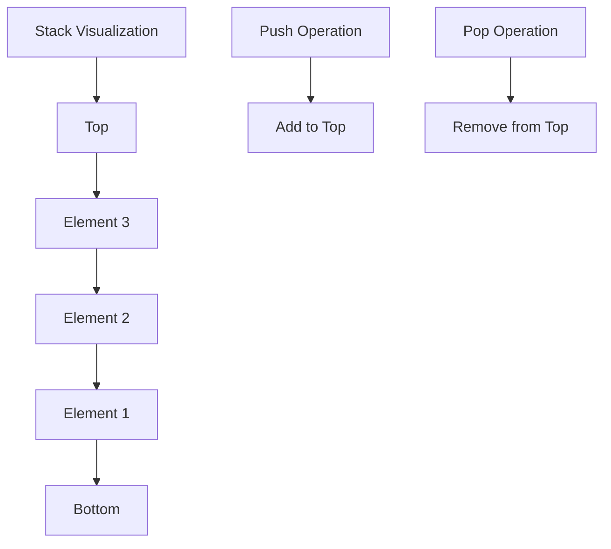
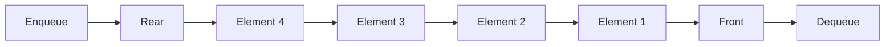
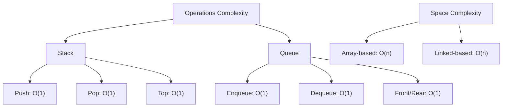

# Bài 5: Stacks & Queues - Ngăn xếp và Hàng đợi

<div className="bg-blue-50 border-l-4 border-blue-500 p-6 mb-6">
  <h2 className="text-2xl font-bold text-blue-800 mb-2">🎯 Mục tiêu bài học</h2>
  <ul className="text-blue-700 space-y-2">
    <li>✅ Hiểu khái niệm và nguyên lý hoạt động của Stack và Queue</li>
    <li>✅ Cài đặt Stack và Queue với Array và Linked List</li>
    <li>✅ Thành thạo các thao tác cơ bản và phân tích độ phức tạp</li>
    <li>✅ Ứng dụng Stack và Queue trong các bài toán thực tế</li>
  </ul>
</div>

## 📚 1. Stack (Ngăn xếp)

### 1.1 Định nghĩa và Khái niệm

<div className="bg-gray-100 p-4 rounded-lg mb-4">
  <p className="text-lg"><strong>Stack</strong> là cấu trúc dữ liệu tuyến tính hoạt động theo nguyên lý <span className="text-red-600 font-bold">LIFO (Last In, First Out)</span> - phần tử được thêm vào cuối cùng sẽ được lấy ra đầu tiên.</p>
</div>



### 1.2 Các Thao tác Cơ bản

| Thao tác           | Mô tả                             | Độ phức tạp |
| ------------------ | --------------------------------- | ----------- |
| `push(x)`          | Thêm phần tử x vào đỉnh stack     | O(1)        |
| `pop()`            | Loại bỏ và trả về phần tử ở đỉnh  | O(1)        |
| `top()` / `peek()` | Trả về phần tử ở đỉnh (không xóa) | O(1)        |
| `isEmpty()`        | Kiểm tra stack có rỗng không      | O(1)        |
| `size()`           | Trả về số phần tử trong stack     | O(1)        |

### 1.3 Cài đặt Stack với Array

```cpp
#include <iostream>
#include <vector>
#include <stdexcept>

class ArrayStack {
private:
    std::vector<int> data;
    int topIndex;
    int capacity;

public:
    // Constructor
    ArrayStack(int cap = 100) : capacity(cap), topIndex(-1) {
        data.resize(capacity);
    }

    // Push operation
    void push(int value) {
        if (topIndex >= capacity - 1) {
            throw std::overflow_error("Stack overflow!");
        }
        data[++topIndex] = value;
    }

    // Pop operation
    int pop() {
        if (isEmpty()) {
            throw std::underflow_error("Stack underflow!");
        }
        return data[topIndex--];
    }

    // Peek operation
    int top() const {
        if (isEmpty()) {
            throw std::underflow_error("Stack is empty!");
        }
        return data[topIndex];
    }

    // Check if empty
    bool isEmpty() const {
        return topIndex == -1;
    }

    // Get size
    int size() const {
        return topIndex + 1;
    }

    // Display stack
    void display() const {
        std::cout << "Stack: ";
        for (int i = 0; i <= topIndex; i++) {
            std::cout << data[i] << " ";
        }
        std::cout << "(top: " << (isEmpty() ? "empty" : std::to_string(data[topIndex])) << ")\n";
    }
};
```

### 1.4 Cài đặt Stack với Linked List

```cpp
#include <iostream>

struct Node {
    int data;
    Node* next;

    Node(int val) : data(val), next(nullptr) {}
};

class LinkedStack {
private:
    Node* topNode;
    int stackSize;

public:
    // Constructor
    LinkedStack() : topNode(nullptr), stackSize(0) {}

    // Destructor
    ~LinkedStack() {
        while (!isEmpty()) {
            pop();
        }
    }

    // Push operation
    void push(int value) {
        Node* newNode = new Node(value);
        newNode->next = topNode;
        topNode = newNode;
        stackSize++;
    }

    // Pop operation
    int pop() {
        if (isEmpty()) {
            throw std::underflow_error("Stack underflow!");
        }

        Node* temp = topNode;
        int value = topNode->data;
        topNode = topNode->next;
        delete temp;
        stackSize--;
        return value;
    }

    // Peek operation
    int top() const {
        if (isEmpty()) {
            throw std::underflow_error("Stack is empty!");
        }
        return topNode->data;
    }

    // Check if empty
    bool isEmpty() const {
        return topNode == nullptr;
    }

    // Get size
    int size() const {
        return stackSize;
    }
};
```

## 📚 2. Queue (Hàng đợi)

### 2.1 Định nghĩa và Khái niệm

<div className="bg-green-100 p-4 rounded-lg mb-4">
  <p className="text-lg"><strong>Queue</strong> là cấu trúc dữ liệu tuyến tính hoạt động theo nguyên lý <span className="text-green-600 font-bold">FIFO (First In, First Out)</span> - phần tử được thêm vào trước sẽ được lấy ra trước.</p>
</div>



### 2.2 Các Thao tác Cơ bản

| Thao tác            | Mô tả                            | Độ phức tạp |
| ------------------- | -------------------------------- | ----------- |
| `enqueue(x)`        | Thêm phần tử x vào cuối queue    | O(1)        |
| `dequeue()`         | Loại bỏ và trả về phần tử ở đầu  | O(1)        |
| `front()`           | Trả về phần tử ở đầu (không xóa) | O(1)        |
| `rear()` / `back()` | Trả về phần tử ở cuối            | O(1)        |
| `isEmpty()`         | Kiểm tra queue có rỗng không     | O(1)        |
| `size()`            | Trả về số phần tử trong queue    | O(1)        |

### 2.3 Cài đặt Queue với Circular Array

```cpp
#include <iostream>
#include <vector>

class CircularQueue {
private:
    std::vector<int> data;
    int frontIndex;
    int rearIndex;
    int capacity;
    int queueSize;

public:
    // Constructor
    CircularQueue(int cap = 100) : capacity(cap + 1), frontIndex(0), rearIndex(0), queueSize(0) {
        data.resize(capacity);
    }

    // Enqueue operation
    void enqueue(int value) {
        if (isFull()) {
            throw std::overflow_error("Queue overflow!");
        }

        data[rearIndex] = value;
        rearIndex = (rearIndex + 1) % capacity;
        queueSize++;
    }

    // Dequeue operation
    int dequeue() {
        if (isEmpty()) {
            throw std::underflow_error("Queue underflow!");
        }

        int value = data[frontIndex];
        frontIndex = (frontIndex + 1) % capacity;
        queueSize--;
        return value;
    }

    // Front operation
    int front() const {
        if (isEmpty()) {
            throw std::underflow_error("Queue is empty!");
        }
        return data[frontIndex];
    }

    // Rear operation
    int rear() const {
        if (isEmpty()) {
            throw std::underflow_error("Queue is empty!");
        }
        return data[(rearIndex - 1 + capacity) % capacity];
    }

    // Check if empty
    bool isEmpty() const {
        return queueSize == 0;
    }

    // Check if full
    bool isFull() const {
        return queueSize == capacity - 1;
    }

    // Get size
    int size() const {
        return queueSize;
    }

    // Display queue
    void display() const {
        if (isEmpty()) {
            std::cout << "Queue is empty\n";
            return;
        }

        std::cout << "Queue: ";
        int i = frontIndex;
        for (int count = 0; count < queueSize; count++) {
            std::cout << data[i] << " ";
            i = (i + 1) % capacity;
        }
        std::cout << "(front: " << front() << ", rear: " << rear() << ")\n";
    }
};
```

### 2.4 Cài đặt Queue với Linked List

```cpp
#include <iostream>

struct QueueNode {
    int data;
    QueueNode* next;

    QueueNode(int val) : data(val), next(nullptr) {}
};

class LinkedQueue {
private:
    QueueNode* frontNode;
    QueueNode* rearNode;
    int queueSize;

public:
    // Constructor
    LinkedQueue() : frontNode(nullptr), rearNode(nullptr), queueSize(0) {}

    // Destructor
    ~LinkedQueue() {
        while (!isEmpty()) {
            dequeue();
        }
    }

    // Enqueue operation
    void enqueue(int value) {
        QueueNode* newNode = new QueueNode(value);

        if (isEmpty()) {
            frontNode = rearNode = newNode;
        } else {
            rearNode->next = newNode;
            rearNode = newNode;
        }
        queueSize++;
    }

    // Dequeue operation
    int dequeue() {
        if (isEmpty()) {
            throw std::underflow_error("Queue underflow!");
        }

        QueueNode* temp = frontNode;
        int value = frontNode->data;
        frontNode = frontNode->next;

        if (frontNode == nullptr) {
            rearNode = nullptr;
        }

        delete temp;
        queueSize--;
        return value;
    }

    // Front operation
    int front() const {
        if (isEmpty()) {
            throw std::underflow_error("Queue is empty!");
        }
        return frontNode->data;
    }

    // Rear operation
    int rear() const {
        if (isEmpty()) {
            throw std::underflow_error("Queue is empty!");
        }
        return rearNode->data;
    }

    // Check if empty
    bool isEmpty() const {
        return frontNode == nullptr;
    }

    // Get size
    int size() const {
        return queueSize;
    }
};
```

## 🔄 3. So sánh Stack và Queue

<div className="overflow-x-auto">

| Đặc điểm             | Stack                           | Queue                           |
| -------------------- | ------------------------------- | ------------------------------- |
| **Nguyên lý**        | LIFO (Last In, First Out)       | FIFO (First In, First Out)      |
| **Điểm truy cập**    | Chỉ ở đỉnh (top)                | Hai đầu (front và rear)         |
| **Thao tác chính**   | push(), pop(), top()            | enqueue(), dequeue(), front()   |
| **Ứng dụng chính**   | Function calls, Undo operations | Task scheduling, BFS            |
| **Cài đặt đơn giản** | Array hoặc Linked List          | Circular Array hoặc Linked List |

</div>

## 🚀 4. Ứng dụng Thực tế

### 4.1 Ứng dụng của Stack

<div className="grid grid-cols-1 md:grid-cols-2 gap-4 mb-6">
  <div className="bg-blue-50 p-4 rounded-lg">
    <h4 className="font-bold text-blue-800 mb-2">🔧 Expression Evaluation</h4>
    <p className="text-sm">Tính toán biểu thức trung tố, hậu tố</p>
  </div>
  <div className="bg-purple-50 p-4 rounded-lg">
    <h4 className="font-bold text-purple-800 mb-2">📞 Function Calls</h4>
    <p className="text-sm">Quản lý call stack trong chương trình</p>
  </div>
  <div className="bg-green-50 p-4 rounded-lg">
    <h4 className="font-bold text-green-800 mb-2">↩️ Undo Operations</h4>
    <p className="text-sm">Tính năng Undo trong text editors</p>
  </div>
  <div className="bg-orange-50 p-4 rounded-lg">
    <h4 className="font-bold text-orange-800 mb-2">🌐 Browser History</h4>
    <p className="text-sm">Lịch sử back/forward trong trình duyệt</p>
  </div>
</div>

### 4.2 Ứng dụng của Queue

<div className="grid grid-cols-1 md:grid-cols-2 gap-4 mb-6">
  <div className="bg-red-50 p-4 rounded-lg">
    <h4 className="font-bold text-red-800 mb-2">⚙️ Task Scheduling</h4>
    <p className="text-sm">Lập lịch CPU, process management</p>
  </div>
  <div className="bg-teal-50 p-4 rounded-lg">
    <h4 className="font-bold text-teal-800 mb-2">🔍 BFS Algorithm</h4>
    <p className="text-sm">Breadth-First Search trong graphs</p>
  </div>
  <div className="bg-yellow-50 p-4 rounded-lg">
    <h4 className="font-bold text-yellow-800 mb-2">🖨️ Print Queue</h4>
    <p className="text-sm">Hàng đợi in ấn, buffer management</p>
  </div>
  <div className="bg-indigo-50 p-4 rounded-lg">
    <h4 className="font-bold text-indigo-800 mb-2">🌊 Stream Processing</h4>
    <p className="text-sm">Xử lý dữ liệu streaming, IO buffer</p>
  </div>
</div>

### 4.3 Ví dụ: Kiểm tra dấu ngoặc hợp lệ

```cpp
#include <iostream>
#include <stack>
#include <string>

bool isValidParentheses(const std::string& s) {
    std::stack<char> stack;

    for (char c : s) {
        if (c == '(' || c == '[' || c == '{') {
            stack.push(c);
        } else if (c == ')' || c == ']' || c == '}') {
            if (stack.empty()) return false;

            char top = stack.top();
            stack.pop();

            if ((c == ')' && top != '(') ||
                (c == ']' && top != '[') ||
                (c == '}' && top != '{')) {
                return false;
            }
        }
    }

    return stack.empty();
}

// Test function
void testParentheses() {
    std::vector<std::string> testCases = {
        "()", "()[]{}", "((()))", "({[]})",
        "(", "())", "([)]", "}{"
    };

    for (const std::string& test : testCases) {
        std::cout << "\"" << test << "\": "
                  << (isValidParentheses(test) ? "Valid" : "Invalid") << "\n";
    }
}
```

## 📊 5. Phân tích Độ phức tạp



### 5.1 Bảng So sánh Implementation

| Implementation   | Space | Access | Search | Insertion | Deletion |
| ---------------- | ----- | ------ | ------ | --------- | -------- |
| **Array Stack**  | O(n)  | O(1)   | O(n)   | O(1)      | O(1)     |
| **Linked Stack** | O(n)  | O(1)   | O(n)   | O(1)      | O(1)     |
| **Array Queue**  | O(n)  | O(1)   | O(n)   | O(1)      | O(1)     |
| **Linked Queue** | O(n)  | O(1)   | O(n)   | O(1)      | O(1)     |

## 🎯 6. Bài tập LeetCode liên quan

### Bài tập Stack:

1. **[20. Valid Parentheses](https://leetcode.com/problems/valid-parentheses/)** - Easy
2. **[155. Min Stack](https://leetcode.com/problems/min-stack/)** - Medium
3. **[232. Implement Queue using Stacks](https://leetcode.com/problems/implement-queue-using-stacks/)** - Easy
4. **[150. Evaluate Reverse Polish Notation](https://leetcode.com/problems/evaluate-reverse-polish-notation/)** - Medium
5. **[84. Largest Rectangle in Histogram](https://leetcode.com/problems/largest-rectangle-in-histogram/)** - Hard

### Bài tập Queue:

1. **[225. Implement Stack using Queues](https://leetcode.com/problems/implement-stack-using-queues/)** - Easy
2. **[933. Number of Recent Calls](https://leetcode.com/problems/number-of-recent-calls/)** - Easy
3. **[622. Design Circular Queue](https://leetcode.com/problems/design-circular-queue/)** - Medium
4. **[346. Moving Average from Data Stream](https://leetcode.com/problems/moving-average-from-data-stream/)** - Easy (Premium)
5. **[239. Sliding Window Maximum](https://leetcode.com/problems/sliding-window-maximum/)** - Hard

<div className="bg-amber-50 border-l-4 border-amber-500 p-4 mb-4">
  <h4 className="font-bold text-amber-800 mb-2">💡 Lời khuyên học tập</h4>
  <ul className="text-amber-700 space-y-1 text-sm">
    <li>• Thực hành cài đặt cả Array và Linked List version</li>
    <li>• Tập trung vào việc hiểu khi nào dùng Stack, khi nào dùng Queue</li>
    <li>• Làm nhiều bài tập thực hành để nắm vững pattern</li>
    <li>• Chú ý edge cases: empty stack/queue, overflow/underflow</li>
  </ul>
</div>

## 📝 Tổng kết

Stack và Queue là hai cấu trúc dữ liệu cơ bản nhưng vô cùng quan trọng trong lập trình. Việc nắm vững cách cài đặt và ứng dụng chúng sẽ giúp bạn giải quyết nhiều bài toán phức tạp một cách hiệu quả. Hãy thực hành nhiều với các bài tập trên LeetCode để củng cố kiến thức!
