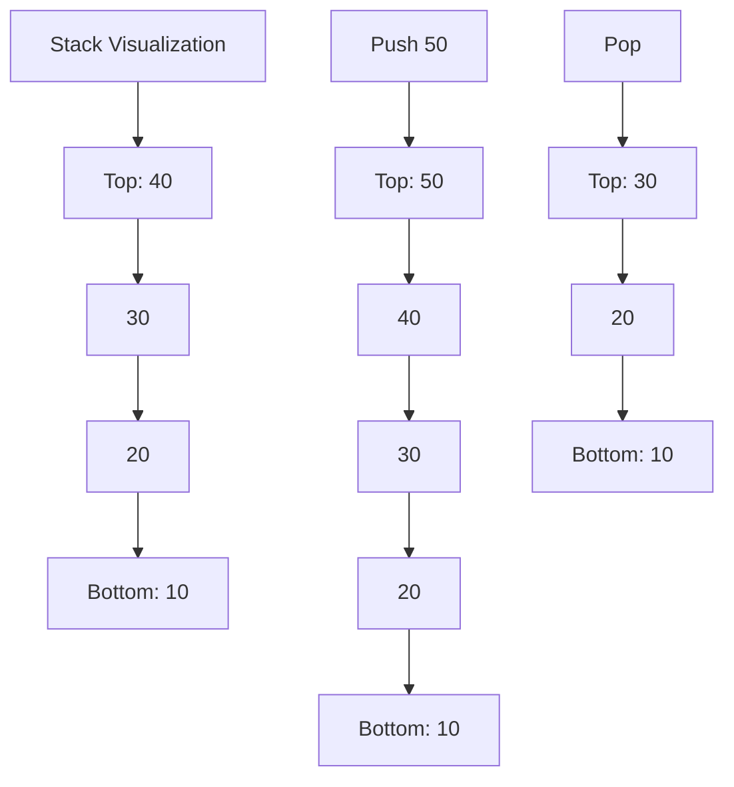
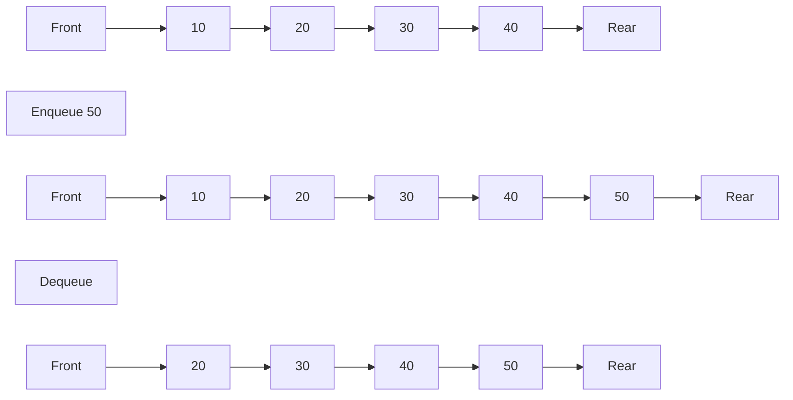
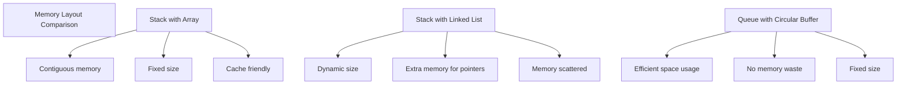

# Bài 5: Stacks & Queues - Ngăn xếp và Hàng đợi

<div className="bg-blue-50 border-l-4 border-blue-500 p-4 my-6">
<h2 className="text-xl font-bold text-blue-800 mb-2">🎯 Mục tiêu học tập</h2>
<p className="text-blue-700">Nắm vững hai cấu trúc dữ liệu tuyến tính quan trọng: Stack (LIFO) và Queue (FIFO), cùng với các ứng dụng thực tế của chúng.</p>
</div>

## 📋 Nội dung chính

### 1. Stack (Ngăn xếp) - LIFO (Last In, First Out)

Stack là cấu trúc dữ liệu tuyến tính hoạt động theo nguyên tắc **LIFO** - phần tử được thêm vào cuối cùng sẽ được lấy ra đầu tiên.

<div className="bg-gray-50 p-4 rounded-lg my-4">
<h4 className="font-bold text-gray-800 mb-2">🔄 Các thao tác cơ bản của Stack:</h4>
<ul className="list-disc list-inside text-gray-700">
<li><strong>push(item)</strong>: Thêm phần tử vào đỉnh stack</li>
<li><strong>pop()</strong>: Loại bỏ và trả về phần tử ở đỉnh stack</li>
<li><strong>top/peek()</strong>: Xem phần tử ở đỉnh stack mà không loại bỏ</li>
<li><strong>is_empty()</strong>: Kiểm tra stack có rỗng không</li>
<li><strong>size()</strong>: Trả về số lượng phần tử trong stack</li>
</ul>
</div>



#### Cài đặt Stack với Array trong Rust

```rust
pub struct ArrayStack<T> {
    data: Vec<T>,
    capacity: usize,
}

impl<T> ArrayStack<T> {
    pub fn new(capacity: usize) -> Self {
        ArrayStack {
            data: Vec::with_capacity(capacity),
            capacity,
        }
    }
    
    pub fn push(&mut self, item: T) -> Result<(), &'static str> {
        if self.data.len() >= self.capacity {
            return Err("Stack overflow");
        }
        self.data.push(item);
        Ok(())
    }
    
    pub fn pop(&mut self) -> Option<T> {
        self.data.pop()
    }
    
    pub fn peek(&self) -> Option<&T> {
        self.data.last()
    }
    
    pub fn is_empty(&self) -> bool {
        self.data.is_empty()
    }
    
    pub fn size(&self) -> usize {
        self.data.len()
    }
}
```

#### Cài đặt Stack với Linked List trong Rust

```rust
type Link<T> = Option<Box<Node<T>>>;

struct Node<T> {
    data: T,
    next: Link<T>,
}

pub struct LinkedStack<T> {
    head: Link<T>,
    size: usize,
}

impl<T> LinkedStack<T> {
    pub fn new() -> Self {
        LinkedStack { head: None, size: 0 }
    }
    
    pub fn push(&mut self, item: T) {
        let new_node = Box::new(Node {
            data: item,
            next: self.head.take(),
        });
        self.head = Some(new_node);
        self.size += 1;
    }
    
    pub fn pop(&mut self) -> Option<T> {
        self.head.take().map(|node| {
            self.head = node.next;
            self.size -= 1;
            node.data
        })
    }
    
    pub fn peek(&self) -> Option<&T> {
        self.head.as_ref().map(|node| &node.data)
    }
    
    pub fn is_empty(&self) -> bool {
        self.head.is_none()
    }
    
    pub fn size(&self) -> usize {
        self.size
    }
}
```

### 2. Queue (Hàng đợi) - FIFO (First In, First Out)

Queue là cấu trúc dữ liệu tuyến tính hoạt động theo nguyên tắc **FIFO** - phần tử được thêm vào đầu tiên sẽ được lấy ra đầu tiên.

<div className="bg-green-50 p-4 rounded-lg my-4">
<h4 className="font-bold text-green-800 mb-2">🔄 Các thao tác cơ bản của Queue:</h4>
<ul className="list-disc list-inside text-green-700">
<li><strong>enqueue(item)</strong>: Thêm phần tử vào cuối queue</li>
<li><strong>dequeue()</strong>: Loại bỏ và trả về phần tử ở đầu queue</li>
<li><strong>front()</strong>: Xem phần tử ở đầu queue mà không loại bỏ</li>
<li><strong>rear()</strong>: Xem phần tử ở cuối queue</li>
<li><strong>is_empty()</strong>: Kiểm tra queue có rỗng không</li>
<li><strong>size()</strong>: Trả về số lượng phần tử trong queue</li>
</ul>
</div>



#### Cài đặt Queue với Circular Buffer trong Rust

```rust
pub struct CircularQueue<T> {
    data: Vec<Option<T>>,
    front: usize,
    rear: usize,
    size: usize,
    capacity: usize,
}

impl<T> CircularQueue<T> {
    pub fn new(capacity: usize) -> Self {
        CircularQueue {
            data: vec![None; capacity + 1],
            front: 0,
            rear: 0,
            size: 0,
            capacity: capacity + 1,
        }
    }
    
    pub fn enqueue(&mut self, item: T) -> Result<(), &'static str> {
        if self.is_full() {
            return Err("Queue is full");
        }
        
        self.data[self.rear] = Some(item);
        self.rear = (self.rear + 1) % self.capacity;
        self.size += 1;
        Ok(())
    }
    
    pub fn dequeue(&mut self) -> Option<T> {
        if self.is_empty() {
            return None;
        }
        
        let item = self.data[self.front].take();
        self.front = (self.front + 1) % self.capacity;
        self.size -= 1;
        item
    }
    
    pub fn front(&self) -> Option<&T> {
        if self.is_empty() {
            None
        } else {
            self.data[self.front].as_ref()
        }
    }
    
    pub fn is_empty(&self) -> bool {
        self.size == 0
    }
    
    pub fn is_full(&self) -> bool {
        self.size == self.capacity - 1
    }
    
    pub fn size(&self) -> usize {
        self.size
    }
}
```

### 3. So sánh Stack và Queue

| Tiêu chí | Stack (LIFO) | Queue (FIFO) |
|----------|--------------|--------------|
| **Nguyên tắc** | Last In, First Out | First In, First Out |
| **Thao tác thêm** | push() - ở top | enqueue() - ở rear |
| **Thao tác lấy** | pop() - ở top | dequeue() - ở front |
| **Ứng dụng** | Function calls, Undo operations | Task scheduling, BFS |
| **Complexity** | O(1) cho tất cả operations | O(1) cho tất cả operations |

### 4. Ứng dụng thực tế

<div className="grid grid-cols-1 md:grid-cols-2 gap-4 my-6">
<div className="bg-purple-50 p-4 rounded-lg">
<h4 className="font-bold text-purple-800 mb-2">🥞 Ứng dụng của Stack:</h4>
<ul className="list-disc list-inside text-purple-700 space-y-1">
<li>Function call stack</li>
<li>Expression evaluation</li>
<li>Undo operations trong editors</li>
<li>Browser history</li>
<li>Syntax parsing</li>
<li>Backtracking algorithms</li>
</ul>
</div>

<div className="bg-orange-50 p-4 rounded-lg">
<h4 className="font-bold text-orange-800 mb-2">🚶‍♀️ Ứng dụng của Queue:</h4>
<ul className="list-disc list-inside text-orange-700 space-y-1">
<li>CPU task scheduling</li>
<li>Print queue management</li>
<li>Breadth-First Search (BFS)</li>
<li>Buffer cho I/O operations</li>
<li>Traffic light systems</li>
<li>Call center systems</li>
</ul>
</div>
</div>

### 5. Ví dụ thực tế: Expression Evaluation

```rust
fn evaluate_postfix(expression: &str) -> Result<i32, &'static str> {
    let mut stack = ArrayStack::new(100);
    
    for token in expression.split_whitespace() {
        match token {
            "+" | "-" | "*" | "/" => {
                let b = stack.pop().ok_or("Invalid expression")?;
                let a = stack.pop().ok_or("Invalid expression")?;
                
                let result = match token {
                    "+" => a + b,
                    "-" => a - b,
                    "*" => a * b,
                    "/" => {
                        if b == 0 { return Err("Division by zero"); }
                        a / b
                    }
                    _ => unreachable!(),
                };
                
                stack.push(result)?;
            }
            _ => {
                let num = token.parse::<i32>()
                    .map_err(|_| "Invalid number")?;
                stack.push(num)?;
            }
        }
    }
    
    if stack.size() == 1 {
        stack.pop().ok_or("Empty stack")
    } else {
        Err("Invalid expression")
    }
}

// Sử dụng: evaluate_postfix("3 4 + 2 *") → 14
```

### 6. Độ phức tạp thời gian và không gian

| Thao tác | Stack | Queue |
|----------|-------|-------|
| **Push/Enqueue** | O(1) | O(1) |
| **Pop/Dequeue** | O(1) | O(1) |
| **Peek/Front** | O(1) | O(1) |
| **Size** | O(1) | O(1) |
| **Space** | O(n) | O(n) |



## 🎯 Tổng kết

**Stack và Queue** là hai cấu trúc dữ liệu cơ bản nhưng vô cùng quan trọng trong lập trình. Stack với nguyên tắc LIFO phù hợp cho việc quản lý trạng thái tạm thời, còn Queue với FIFO lý tưởng cho việc xử lý tuần tự các tác vụ.

<div className="bg-yellow-50 border border-yellow-200 p-4 rounded-lg my-4">
<h4 className="font-bold text-yellow-800 mb-2">💡 Lời khuyên:</h4>
<p className="text-yellow-700">Hãy thực hành cài đặt cả hai cấu trúc bằng array và linked list để hiểu rõ trade-offs giữa performance và memory usage.</p>
</div>

## 📝 Bài tập LeetCode liên quan

1. **[Valid Parentheses (Easy)](https://leetcode.com/problems/valid-parentheses/)** - Stack
2. **[Implement Queue using Stacks (Easy)](https://leetcode.com/problems/implement-queue-using-stacks/)** 
3. **[Implement Stack using Queues (Easy)](https://leetcode.com/problems/implement-stack-using-queues/)**
4. **[Min Stack (Easy)](https://leetcode.com/problems/min-stack/)** 
5. **[Daily Temperatures (Medium)](https://leetcode.com/problems/daily-temperatures/)** - Monotonic Stack
6. **[Sliding Window Maximum (Hard)](https://leetcode.com/problems/sliding-window-maximum/)** - Deque
7. **[Evaluate Reverse Polish Notation (Medium)](https://leetcode.com/problems/evaluate-reverse-polish-notation/)**

---

**Bài tiếp theo:** [Bài 6: Hash Tables - Bảng băm]()