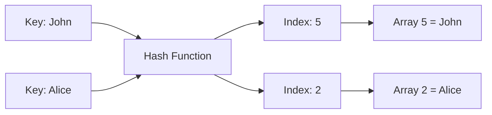
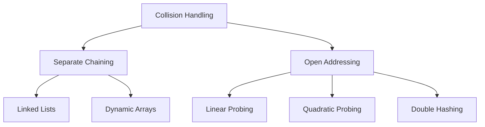
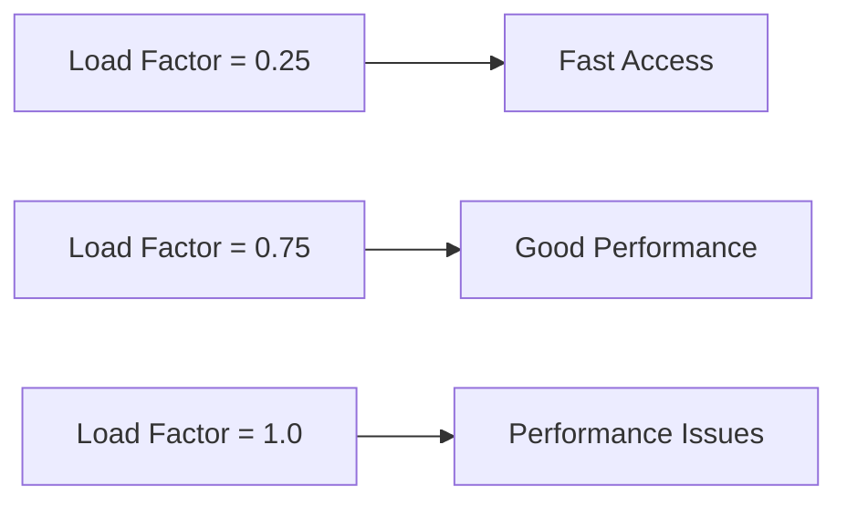
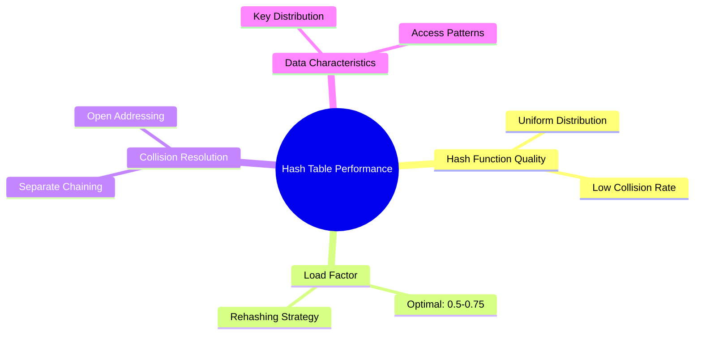

# Bài 6: Hash Tables - Bảng băm

<div className="bg-gradient-to-r from-blue-50 to-purple-50 p-6 rounded-lg border-l-4 border-blue-500 mb-8">
  <h2 className="text-2xl font-bold text-blue-800 mb-2">🎯 Mục tiêu học tập</h2>
  <ul className="text-gray-700 space-y-2">
    <li>• Hiểu khái niệm Hash Function và Collision Handling</li>
    <li>• Cài đặt Hash Table với Separate Chaining và Open Addressing</li>
    <li>• Phân tích Load Factor và Rehashing</li>
    <li>• Thực hành các thao tác cơ bản: Insert, Search, Delete</li>
  </ul>
</div>

## 1. Giới thiệu Hash Tables

**Hash Table** (Bảng băm) là một cấu trúc dữ liệu cho phép lưu trữ và truy xuất dữ liệu với thời gian trung bình **O(1)**. Nó sử dụng một **hash function** để ánh xạ keys thành các chỉ số trong mảng.

### 1.1 Khái niệm cốt lõi



### 1.2 So sánh với các cấu trúc khác

| Thao tác | Array | Linked List | Hash Table |
| -------- | ----- | ----------- | ---------- |
| Search   | O(n)  | O(n)        | O(1) avg   |
| Insert   | O(1)  | O(1)        | O(1) avg   |
| Delete   | O(n)  | O(n)        | O(1) avg   |

<div className="bg-yellow-50 p-4 rounded-lg border border-yellow-200 my-6">
  <h3 className="text-lg font-semibold text-yellow-800 mb-2">⚡ Ưu điểm chính</h3>
  <p className="text-yellow-700">Hash Tables cung cấp thời gian truy xuất gần như tức thì, làm chúng trở thành lựa chọn lý tưởng cho dictionaries, caches, và database indexing.</p>
</div>

## 2. Hash Function - Hàm băm

Hash function chuyển đổi key thành một chỉ số hợp lệ trong mảng. Một hash function tốt phải:

### 2.1 Đặc tính quan trọng

| Đặc tính                 | Mô tả                           | Tầm quan trọng |
| ------------------------ | ------------------------------- | -------------- |
| **Deterministic**        | Cùng input luôn cho cùng output | ⭐⭐⭐⭐⭐     |
| **Uniform Distribution** | Phân bố đều các keys            | ⭐⭐⭐⭐       |
| **Fast Computation**     | Tính toán nhanh                 | ⭐⭐⭐⭐       |

### 2.2 Các phương pháp Hash phổ biến

```cpp
class HashFunction {
public:
    // Division Method
    int divisionMethod(int key, int tableSize) {
        return key % tableSize;
    }

    // Multiplication Method
    int multiplicationMethod(int key, int tableSize) {
        const double A = 0.6180339887; // (√5 - 1) / 2
        double temp = key * A;
        temp = temp - floor(temp); // Lấy phần thập phân
        return floor(tableSize * temp);
    }

    // String Hashing
    int stringHash(string key, int tableSize) {
        int hash = 0;
        for (char c : key) {
            hash = (hash * 31 + c) % tableSize;
        }
        return hash;
    }
};
```

## 3. Collision Handling - Xử lý xung đột

Khi hai keys khác nhau có cùng hash value, ta gọi đó là **collision**. Có hai phương pháp chính để xử lý:



### 3.1 Separate Chaining

Mỗi slot trong array chứa một danh sách các elements có cùng hash value.

```cpp
#include <vector>
#include <list>
using namespace std;

template<typename K, typename V>
class HashTableChaining {
private:
    struct Node {
        K key;
        V value;
        Node(K k, V v) : key(k), value(v) {}
    };

    vector<list<Node>> table;
    int capacity;
    int size;

    int hash(K key) {
        return key % capacity;
    }

public:
    HashTableChaining(int cap = 10) : capacity(cap), size(0) {
        table.resize(capacity);
    }

    void insert(K key, V value) {
        int index = hash(key);

        // Kiểm tra key đã tồn tại
        for (auto& node : table[index]) {
            if (node.key == key) {
                node.value = value; // Update
                return;
            }
        }

        // Thêm node mới
        table[index].emplace_back(key, value);
        size++;
    }

    V* search(K key) {
        int index = hash(key);
        for (auto& node : table[index]) {
            if (node.key == key) {
                return &node.value;
            }
        }
        return nullptr;
    }

    bool remove(K key) {
        int index = hash(key);
        auto& chain = table[index];

        for (auto it = chain.begin(); it != chain.end(); ++it) {
            if (it->key == key) {
                chain.erase(it);
                size--;
                return true;
            }
        }
        return false;
    }

    double loadFactor() {
        return (double)size / capacity;
    }
};
```

### 3.2 Open Addressing

Tất cả elements được lưu trực tiếp trong array. Khi xảy ra collision, tìm slot trống tiếp theo.

```cpp
template<typename K, typename V>
class HashTableOpenAddressing {
private:
    struct Entry {
        K key;
        V value;
        bool deleted; // Lazy deletion
        bool empty;

        Entry() : deleted(false), empty(true) {}
        Entry(K k, V v) : key(k), value(v), deleted(false), empty(false) {}
    };

    vector<Entry> table;
    int capacity;
    int size;

    int hash(K key) {
        return key % capacity;
    }

    int probe(K key, int attempt) {
        // Linear Probing
        return (hash(key) + attempt) % capacity;
    }

public:
    HashTableOpenAddressing(int cap = 10) : capacity(cap), size(0) {
        table.resize(capacity);
    }

    void insert(K key, V value) {
        if (size >= capacity * 0.7) { // Load factor threshold
            rehash();
        }

        for (int attempt = 0; attempt < capacity; attempt++) {
            int index = probe(key, attempt);

            if (table[index].empty || table[index].deleted) {
                table[index] = Entry(key, value);
                size++;
                return;
            }

            if (table[index].key == key) {
                table[index].value = value; // Update
                return;
            }
        }
    }

    V* search(K key) {
        for (int attempt = 0; attempt < capacity; attempt++) {
            int index = probe(key, attempt);

            if (table[index].empty) {
                return nullptr; // Not found
            }

            if (!table[index].deleted && table[index].key == key) {
                return &table[index].value;
            }
        }
        return nullptr;
    }

    bool remove(K key) {
        for (int attempt = 0; attempt < capacity; attempt++) {
            int index = probe(key, attempt);

            if (table[index].empty) {
                return false; // Not found
            }

            if (!table[index].deleted && table[index].key == key) {
                table[index].deleted = true;
                size--;
                return true;
            }
        }
        return false;
    }

private:
    void rehash() {
        vector<Entry> oldTable = table;
        capacity *= 2;
        size = 0;
        table.clear();
        table.resize(capacity);

        for (const auto& entry : oldTable) {
            if (!entry.empty && !entry.deleted) {
                insert(entry.key, entry.value);
            }
        }
    }
};
```

## 4. Load Factor và Performance

**Load Factor (α)** = Number of elements / Table size

### 4.1 Ảnh hưởng của Load Factor

| Load Factor    | Separate Chaining | Open Addressing |
| -------------- | ----------------- | --------------- |
| α ≤ 0.5        | Excellent O(1)    | Excellent O(1)  |
| 0.5 < α ≤ 0.75 | Good O(1)         | Good O(1)       |
| α > 0.75       | Degraded          | Poor clustering |



<div className="bg-red-50 p-4 rounded-lg border border-red-200 my-6">
  <h3 className="text-lg font-semibold text-red-800 mb-2">⚠️ Lưu ý quan trọng</h3>
  <p className="text-red-700">Khi Load Factor > 0.7, nên thực hiện <strong>Rehashing</strong> để duy trì hiệu suất O(1).</p>
</div>

### 4.2 Rehashing Process

```cpp
void rehash() {
    vector<Entry> oldTable = table;
    capacity *= 2;          // Tăng gấp đôi kích thước
    size = 0;
    table.clear();
    table.resize(capacity);

    // Chèn lại tất cả elements
    for (const auto& entry : oldTable) {
        if (!entry.empty && !entry.deleted) {
            insert(entry.key, entry.value);
        }
    }
}
```

## 5. Ứng dụng thực tế

### 5.1 So sánh Implementation Methods

| Phương pháp           | Ưu điểm                                  | Nhược điểm                   | Use Case            |
| --------------------- | ---------------------------------------- | ---------------------------- | ------------------- |
| **Separate Chaining** | Không bị clustering, dễ implement delete | Memory overhead              | High collision rate |
| **Open Addressing**   | Memory efficient, cache friendly         | Complex deletion, clustering | Low collision rate  |

### 5.2 Code ví dụ hoàn chỉnh

```cpp
#include <iostream>
#include <string>
using namespace std;

// Hash Table với string keys
class StringHashTable {
private:
    struct Entry {
        string key;
        int value;
        bool deleted;
        bool empty;

        Entry() : deleted(false), empty(true) {}
        Entry(string k, int v) : key(k), value(v), deleted(false), empty(false) {}
    };

    vector<Entry> table;
    int capacity;
    int size;

    int hash(const string& key) {
        int h = 0;
        for (char c : key) {
            h = (h * 31 + c) % capacity;
        }
        return abs(h);
    }

public:
    StringHashTable(int cap = 10) : capacity(cap), size(0) {
        table.resize(capacity);
    }

    void display() {
        cout << "\nHash Table Contents:\n";
        cout << "Index | Key       | Value | Status\n";
        cout << "------|-----------|-------|--------\n";

        for (int i = 0; i < capacity; i++) {
            cout << setw(5) << i << " | ";
            if (table[i].empty) {
                cout << setw(9) << "EMPTY" << " | " << setw(5) << "-" << " | EMPTY\n";
            } else if (table[i].deleted) {
                cout << setw(9) << "DELETED" << " | " << setw(5) << "-" << " | DELETED\n";
            } else {
                cout << setw(9) << table[i].key << " | " << setw(5) << table[i].value << " | ACTIVE\n";
            }
        }
        cout << "\nLoad Factor: " << (double)size / capacity << "\n\n";
    }
};
```

## 6. Phân tích độ phức tạp

### 6.1 Time Complexity Summary

| Operation | Average Case | Worst Case | Space |
| --------- | ------------ | ---------- | ----- |
| Search    | O(1)         | O(n)       | O(n)  |
| Insert    | O(1)         | O(n)       | O(n)  |
| Delete    | O(1)         | O(n)       | O(n)  |

### 6.2 Factors ảnh hưởng đến performance



## 7. Bài tập thực hành

### 7.1 Bài tập LeetCode liên quan:

<div className="bg-green-50 p-4 rounded-lg border border-green-200 my-6">
  <h3 className="text-lg font-semibold text-green-800 mb-3">🎯 Danh sách bài tập LeetCode</h3>
  <div className="grid grid-cols-1 md:grid-cols-2 gap-4">
    <div>
      <h4 className="font-semibold text-green-700">Easy Level:</h4>
      <ul className="text-green-600 space-y-1">
        <li>• #1 - Two Sum</li>
        <li>• #217 - Contains Duplicate</li>
        <li>• #242 - Valid Anagram</li>
        <li>• #383 - Ransom Note</li>
      </ul>
    </div>
    <div>
      <h4 className="font-semibold text-green-700">Medium Level:</h4>
      <ul className="text-green-600 space-y-1">
        <li>• #49 - Group Anagrams</li>
        <li>• #347 - Top K Frequent Elements</li>
        <li>• #560 - Subarray Sum Equals K</li>
        <li>• #706 - Design HashMap</li>
      </ul>
    </div>
  </div>
</div>

### 7.2 Bài tập tự luyện:

1. **Implement Hash Set**: Xây dựng HashSet không cho phép duplicate values
2. **Word Frequency Counter**: Đếm tần suất xuất hiện của từ trong văn bản
3. **LRU Cache**: Implement LRU Cache sử dụng HashMap + Doubly Linked List
4. **Phone Directory**: Xây dựng danh bạ điện thoại với tìm kiếm nhanh

## 8. Tổng kết

<div className="bg-blue-50 p-6 rounded-lg border-l-4 border-blue-500">
  <h3 className="text-xl font-bold text-blue-800 mb-3">📝 Điểm nhấn quan trọng</h3>
  <div className="text-blue-700 space-y-2">
    <p><strong>Hash Tables</strong> là công cụ mạnh mẽ cho việc lưu trữ và truy xuất dữ liệu với thời gian O(1) trung bình.</p>
    <p><strong>Hash Function</strong> tốt là chìa khóa cho performance cao - phải đảm bảo phân bố đều và ít collision.</p>
    <p><strong>Load Factor</strong> cần được kiểm soát (≤ 0.75) để duy trì hiệu suất tối ưu.</p>
    <p><strong>Collision Handling</strong>: Chaining vs Open Addressing - mỗi phương pháp có ưu nhược điểm riêng.</p>
  </div>
</div>

---

<div className="text-center text-gray-500 text-sm mt-8">
  <p>📚 <strong>Bài tiếp theo:</strong> Bài 7 - Algorithmic Complexity Analysis</p>
  <p>Chuẩn bị tìm hiểu về Time & Space Complexity để phân tích hiệu suất thuật toán!</p>
</div>
