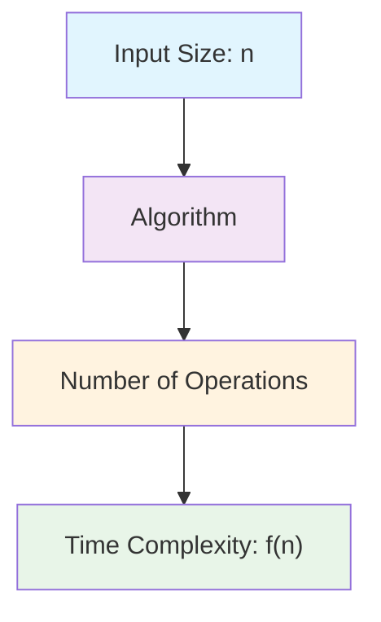
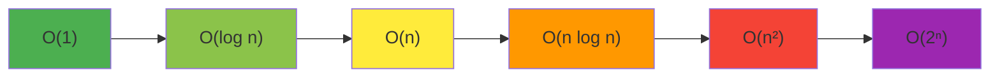
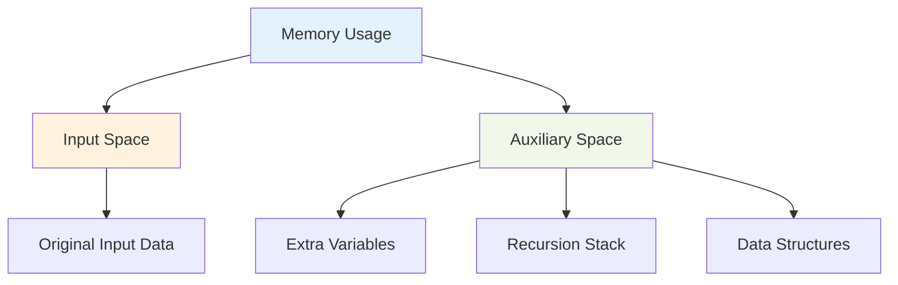
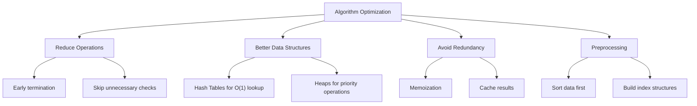

# Bài 7: Phân Tích Độ Phức Tạp Thuật Toán

## **Data Structures & Algorithms - Khóa học cho người mới bắt đầu**

---

## 🎯 **Mục tiêu bài học**

<div className="bg-blue-50 border-l-4 border-blue-400 p-4 mb-6">
  <h3 className="text-lg font-semibold text-blue-800 mb-2">Sau bài học này, bạn sẽ:</h3>
  <ul className="text-blue-700 space-y-1">
    <li>✓ Hiểu rõ khái niệm Time Complexity và Space Complexity</li>
    <li>✓ Nắm vững cách tính toán và phân tích độ phức tạp thuật toán</li>
    <li>✓ Thành thạo các runtime phổ biến: O(1), O(log n), O(n), O(n²), O(2ⁿ)</li>
    <li>✓ Có khả năng so sánh và đánh giá hiệu suất các thuật toán</li>
  </ul>
</div>

---

## 📚 **1. Khái niệm cơ bản**

### 1.1 Độ phức tạp thuật toán là gì?

<div className="bg-gray-50 p-4 rounded-lg mb-4">
  <p className="text-gray-800 leading-relaxed">
    <strong>Độ phức tạp thuật toán</strong> là thước đo hiệu suất của một thuật toán, bao gồm:
  </p>
  <ul className="mt-2 text-gray-700">
    <li>• <strong>Time Complexity:</strong> Thời gian thực thi thuật toán</li>
    <li>• <strong>Space Complexity:</strong> Bộ nhớ sử dụng của thuật toán</li>
  </ul>
</div>

### 1.2 Tại sao cần phân tích độ phức tạp?

| **Lý do**       | **Mô tả**                                   | **Ví dụ**                                |
| --------------- | ------------------------------------------- | ---------------------------------------- |
| **Hiệu suất**   | Dự đoán thời gian chạy với dữ liệu lớn      | Thuật toán O(n²) vs O(n log n) với n=10⁶ |
| **Tối ưu hóa**  | Chọn thuật toán phù hợp cho bài toán        | Binary Search thay vì Linear Search      |
| **Scalability** | Đảm bảo hệ thống hoạt động với dữ liệu tăng | Website xử lý 1M user thay vì 1K user    |
| **So sánh**     | Đánh giá các giải pháp khác nhau            | Merge Sort vs Quick Sort vs Heap Sort    |

---

## ⏰ **2. Time Complexity (Độ phức tạp thời gian)**

### 2.1 Định nghĩa



### 2.2 Các mức độ phức tạp thông dụng

| **Notation**   | **Tên gọi**  | **Ví dụ thuật toán**          | **n=10** | **n=100** | **n=1000** |
| -------------- | ------------ | ----------------------------- | -------- | --------- | ---------- |
| **O(1)**       | Constant     | Array access, Hash lookup     | 1        | 1         | 1          |
| **O(log n)**   | Logarithmic  | Binary Search                 | 3        | 7         | 10         |
| **O(n)**       | Linear       | Linear Search, Array traverse | 10       | 100       | 1,000      |
| **O(n log n)** | Linearithmic | Merge Sort, Heap Sort         | 30       | 700       | 10,000     |
| **O(n²)**      | Quadratic    | Bubble Sort, Nested loops     | 100      | 10,000    | 1,000,000  |
| **O(2ⁿ)**      | Exponential  | Fibonacci recursive           | 1,024    | 2¹⁰⁰      | 2¹⁰⁰⁰      |

### 2.3 Biểu đồ so sánh hiệu suất



<div className="bg-green-50 border border-green-200 p-4 rounded-lg mt-4">
  <h4 className="text-green-800 font-semibold mb-2">💡 Quy tắc vàng:</h4>
  <p className="text-green-700">Luôn ưu tiên thuật toán có độ phức tạp thấp hơn khi xử lý dữ liệu lớn!</p>
</div>

---

## 🧮 **3. Phân tích Time Complexity**

### 3.1 Quy tắc cơ bản

| **Quy tắc**                   | **Mô tả**               | **Ví dụ**              |
| ----------------------------- | ----------------------- | ---------------------- |
| **Drop constants**            | Bỏ qua hằng số          | 3n + 5 → O(n)          |
| **Drop low-order terms**      | Bỏ qua số hạng bậc thấp | n² + n + 1 → O(n²)     |
| **Multiplicative constants**  | Bỏ qua hệ số nhân       | 5n² → O(n²)            |
| **Addition for sequences**    | Cộng cho chuỗi tuần tự  | O(a) + O(b) = O(a + b) |
| **Multiplication for nested** | Nhân cho vòng lặp lồng  | O(a) × O(b) = O(a × b) |

### 3.2 Ví dụ phân tích cụ thể

#### **Ví dụ 1: Tìm phần tử lớn nhất**

```cpp
int findMax(int arr[], int n) {
    int max = arr[0];           // O(1)
    for (int i = 1; i < n; i++) { // O(n)
        if (arr[i] > max) {     // O(1)
            max = arr[i];       // O(1)
        }
    }
    return max;                 // O(1)
}
```

**Phân tích:** O(1) + O(n) × O(1) = **O(n)**

#### **Ví dụ 2: Bubble Sort**

```cpp
void bubbleSort(int arr[], int n) {
    for (int i = 0; i < n-1; i++) {         // O(n)
        for (int j = 0; j < n-i-1; j++) {   // O(n)
            if (arr[j] > arr[j+1]) {        // O(1)
                swap(arr[j], arr[j+1]);     // O(1)
            }
        }
    }
}
```

**Phân tích:** O(n) × O(n) × O(1) = **O(n²)**

#### **Ví dụ 3: Binary Search**

```cpp
int binarySearch(int arr[], int n, int target) {
    int left = 0, right = n - 1;

    while (left <= right) {              // O(log n) iterations
        int mid = left + (right - left) / 2;  // O(1)

        if (arr[mid] == target) {        // O(1)
            return mid;
        }
        else if (arr[mid] < target) {    // O(1)
            left = mid + 1;
        }
        else {                           // O(1)
            right = mid - 1;
        }
    }
    return -1;
}
```

**Phân tích:** O(log n) × O(1) = **O(log n)**

---

## 💾 **4. Space Complexity (Độ phức tạp không gian)**

### 4.1 Phân loại bộ nhớ



### 4.2 Ví dụ phân tích Space Complexity

#### **Ví dụ 1: Iterative vs Recursive**

**Iterative Factorial:**

```cpp
int factorial(int n) {
    int result = 1;     // O(1) space
    for (int i = 1; i <= n; i++) {
        result *= i;
    }
    return result;
}
```

**Space Complexity:** O(1)

**Recursive Factorial:**

```cpp
int factorial(int n) {
    if (n <= 1) return 1;           // Base case
    return n * factorial(n - 1);    // O(n) stack calls
}
```

**Space Complexity:** O(n) - do recursion stack

### 4.3 Bảng so sánh Space Complexity

| **Thuật toán**    | **Time Complexity** | **Space Complexity** | **Ghi chú**          |
| ----------------- | ------------------- | -------------------- | -------------------- |
| **Linear Search** | O(n)                | O(1)                 | In-place search      |
| **Binary Search** | O(log n)            | O(1)                 | Iterative version    |
| **Merge Sort**    | O(n log n)          | O(n)                 | Requires extra array |
| **Quick Sort**    | O(n log n)          | O(log n)             | Recursion stack      |
| **Bubble Sort**   | O(n²)               | O(1)                 | In-place sorting     |

---

## 🔬 **5. Thực hành phân tích**

### 5.1 Bài tập phân tích

<div className="bg-yellow-50 border border-yellow-200 p-4 rounded-lg">
  <h4 className="text-yellow-800 font-semibold mb-3">🏋️ Thử thách:</h4>
  <p className="text-yellow-700 mb-2">Phân tích Time và Space Complexity của đoạn code sau:</p>
</div>

```cpp
void printPairs(int arr[], int n) {
    for (int i = 0; i < n; i++) {
        for (int j = i + 1; j < n; j++) {
            cout << "(" << arr[i] << ", " << arr[j] << ")" << endl;
        }
    }
}
```

**Đáp án:**

- **Time Complexity:** O(n²) - vòng lặp nested
- **Space Complexity:** O(1) - chỉ dùng biến i, j

### 5.2 So sánh thực tế

| **Input Size** | **O(n)** | **O(n log n)** | **O(n²)** | **O(2ⁿ)** |
| -------------- | -------- | -------------- | --------- | --------- |
| **10**         | 0.01ms   | 0.03ms         | 0.1ms     | 1ms       |
| **100**        | 0.1ms    | 0.7ms          | 10ms      | ∞         |
| **1,000**      | 1ms      | 10ms           | 1s        | ∞         |
| **10,000**     | 10ms     | 130ms          | 100s      | ∞         |
| **100,000**    | 100ms    | 1.7s           | 3 hours   | ∞         |

---

## 🎯 **6. Các kỹ thuật tối ưu hóa**

### 6.1 Optimization Strategies



### 6.2 Trade-offs giữa Time và Space

<div className="bg-blue-50 p-4 rounded-lg">
  <h4 className="text-blue-800 font-semibold mb-2">⚖️ Time-Space Trade-off:</h4>
  <ul className="text-blue-700 space-y-1">
    <li>• <strong>More Space → Less Time:</strong> Hash tables, lookup tables</li>
    <li>• <strong>Less Space → More Time:</strong> In-place algorithms</li>
    <li>• <strong>Balanced:</strong> Optimal solutions cho practical use</li>
  </ul>
</div>

---

## 📝 **7. Bài tập LeetCode liên quan**

### 7.1 Danh sách bài tập theo mức độ

| **Level**  | **Problem**                 | **Link**                                                                 | **Focus**              |
| ---------- | --------------------------- | ------------------------------------------------------------------------ | ---------------------- |
| **Easy**   | Two Sum                     | [LeetCode 1](https://leetcode.com/problems/two-sum/)                     | Hash Table O(n)        |
| **Easy**   | Valid Parentheses           | [LeetCode 20](https://leetcode.com/problems/valid-parentheses/)          | Stack O(n)             |
| **Medium** | 3Sum                        | [LeetCode 15](https://leetcode.com/problems/3sum/)                       | Two Pointers O(n²)     |
| **Medium** | Merge Intervals             | [LeetCode 56](https://leetcode.com/problems/merge-intervals/)            | Sorting O(n log n)     |
| **Hard**   | Median of Two Sorted Arrays | [LeetCode 4](https://leetcode.com/problems/median-of-two-sorted-arrays/) | Binary Search O(log n) |

### 7.2 Bài tập phân tích complexity

1. **[LeetCode 121 - Best Time to Buy and Sell Stock](https://leetcode.com/problems/best-time-to-buy-and-sell-stock/)**
   - **Brute Force:** O(n²) time, O(1) space
   - **Optimal:** O(n) time, O(1) space

2. **[LeetCode 53 - Maximum Subarray](https://leetcode.com/problems/maximum-subarray/)**
   - **Kadane's Algorithm:** O(n) time, O(1) space

3. **[LeetCode 104 - Maximum Depth of Binary Tree](https://leetcode.com/problems/maximum-depth-of-binary-tree/)**
   - **Recursive:** O(n) time, O(h) space
   - **Iterative:** O(n) time, O(w) space

---

## 🎉 **Tổng kết**

<div className="bg-green-50 border-l-4 border-green-400 p-4">
  <h3 className="text-green-800 font-semibold mb-2">✅ Kiến thức đã học:</h3>
  <ul className="text-green-700 space-y-1">
    <li>1. Hiểu rõ Time Complexity và Space Complexity</li>
    <li>2. Nắm vững các runtime: O(1), O(log n), O(n), O(n²), O(2ⁿ)</li>
    <li>3. Phân tích complexity cho thuật toán thực tế</li>
    <li>4. So sánh và lựa chọn thuật toán tối ưu</li>
    <li>5. Áp dụng kiến thức vào bài tập LeetCode</li>
  </ul>
</div>

<div className="bg-orange-50 border border-orange-200 p-4 rounded-lg mt-4">
  <h4 className="text-orange-800 font-semibold mb-2">📚 Bài học tiếp theo:</h4>
  <p className="text-orange-700"><strong>Bài 8: Big-O, Big-θ, Big-Ω Notation</strong> - Tìm hiểu sâu hơn về Asymptotic Analysis</p>
</div>

---

<div className="text-center mt-8">
  <p className="text-gray-600 italic">
    "Premature optimization is the root of all evil" - Donald Knuth<br/>
    Nhưng hiểu complexity analysis là nền tảng của mọi optimization!
  </p>
</div>
