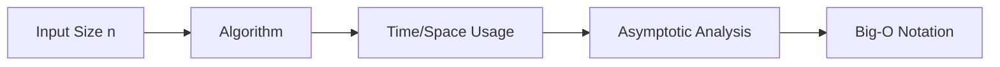
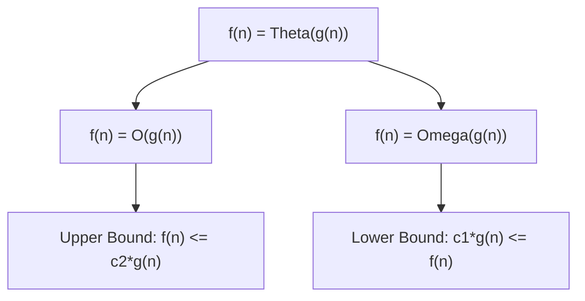
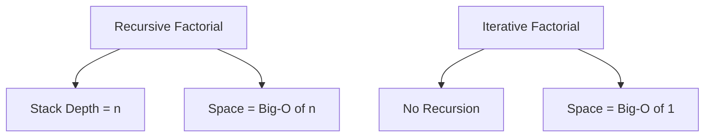

# Bài 8: Big-O, Big-θ, Big-Ω Notation - Ký hiệu tiệm cận

<div className="border-l-4 border-blue-400 p-4 mb-6">
<h2 className="text-xl font-bold text-blue-800 mb-2">🎯 Mục tiêu học tập</h2>
<ul className="text-blue-700">
<li>Hiểu sâu về các ký hiệu tiệm cận Big-O, Big-θ, Big-Ω</li>
<li>Phân biệt worst-case, average-case, best-case</li>
<li>Thực hành viết mathematical proof cho Big-O</li>
<li>Phân tích space complexity của các data structure</li>
</ul>
</div>

## 1. Tổng quan về Asymptotic Notation

### 1.1 Khái niệm cơ bản

**Asymptotic Notation** là hệ thống ký hiệu toán học dùng để mô tả hành vi của một hàm khi đầu vào tiến đến vô cùng. Trong Computer Science, chúng ta sử dụng để phân tích hiệu suất thuật toán.



### 1.2 Tại sao cần Asymptotic Analysis?

<div className="border border-yellow-200 p-4 rounded mb-4">
<p className="font-semibold text-yellow-800">💡 Lý do quan trọng:</p>
<ul className="text-yellow-700 mt-2">
<li>Độc lập với phần cứng và ngôn ngữ lập trình</li>
<li>Tập trung vào growth rate của thuật toán</li>
<li>Giúp so sánh thuật toán một cách khách quan</li>
<li>Dự đoán hiệu suất với input lớn</li>
</ul>
</div>

## 2. Ba loại Asymptotic Notation

### 2.1 Big-O Notation (Ο) - Upper Bound

**Định nghĩa toán học:**
f(n) = O(g(n)) nếu tồn tại các hằng số dương c và n₀ sao cho:
**0 ≤ f(n) ≤ c·g(n)** với mọi n ≥ n₀

| Ý nghĩa           | Mô tả                                     |
| ----------------- | ----------------------------------------- |
| **Upper Bound**   | Giới hạn trên của growth rate             |
| **Worst Case**    | Thường dùng để mô tả trường hợp xấu nhất  |
| **Practical Use** | Đảm bảo thuật toán không chậm hơn mức này |

### 2.2 Big-Ω Notation (Ω) - Lower Bound

**Định nghĩa toán học:**
f(n) = Ω(g(n)) nếu tồn tại các hằng số dương c và n₀ sao cho:
**0 ≤ c·g(n) ≤ f(n)** với mọi n ≥ n₀

| Ý nghĩa             | Mô tả                                             |
| ------------------- | ------------------------------------------------- |
| **Lower Bound**     | Giới hạn dưới của growth rate                     |
| **Best Case**       | Thường dùng để mô tả trường hợp tốt nhất          |
| **Theoretical Use** | Chứng minh thuật toán không thể nhanh hơn mức này |

### 2.3 Big-θ Notation (Θ) - Tight Bound

**Định nghĩa toán học:**
f(n) = Θ(g(n)) nếu tồn tại các hằng số dương c₁, c₂ và n₀ sao cho:
**0 ≤ c₁·g(n) ≤ f(n) ≤ c₂·g(n)** với mọi n ≥ n₀

| Ý nghĩa              | Mô tả                                  |
| -------------------- | -------------------------------------- |
| **Tight Bound**      | Giới hạn chặt chẽ của growth rate      |
| **Average Case**     | f(n) = O(g(n)) VÀ f(n) = Ω(g(n))       |
| **Precise Analysis** | Mô tả chính xác hành vi của thuật toán |



## 3. So sánh các Case Analysis

### 3.1 Bảng so sánh Best, Average, Worst Case

| Algorithm         | Best Case  | Average Case | Worst Case |
| ----------------- | ---------- | ------------ | ---------- |
| **Linear Search** | Ω(1)       | Θ(n)         | O(n)       |
| **Binary Search** | Ω(1)       | Θ(log n)     | O(log n)   |
| **Bubble Sort**   | Ω(n)       | Θ(n²)        | O(n²)      |
| **Quick Sort**    | Ω(n log n) | Θ(n log n)   | O(n²)      |
| **Merge Sort**    | Θ(n log n) | Θ(n log n)   | Θ(n log n) |

### 3.2 Ví dụ thực tế: Linear Search

```cpp
// Linear Search Analysis
int linearSearch(int arr[], int n, int target) {
    for (int i = 0; i < n; i++) {
        if (arr[i] == target) {
            return i;  // Found at position i
        }
    }
    return -1;  // Not found
}
```

<div className="border border-green-200 p-4 rounded">
<h4 className="font-bold text-green-800">📊 Case Analysis:</h4>
<ul className="text-green-700 mt-2">
<li><strong>Best Case (Ω(1)):</strong> Element ở vị trí đầu tiên</li>
<li><strong>Average Case (Θ(n)):</strong> Element ở giữa mảng</li>
<li><strong>Worst Case (O(n)):</strong> Element ở cuối hoặc không có</li>
</ul>
</div>

## 4. Mathematical Proof Techniques

### 4.1 Chứng minh Big-O

**Ví dụ:** Chứng minh 3n² + 5n + 2 = O(n²)

**Bước 1:** Tìm hằng số c và n₀
**Bước 2:** Chứng minh 3n² + 5n + 2 ≤ c·n² với n ≥ n₀

```cpp
// Proof process:
// 3n² + 5n + 2 ≤ c·n²
// Với n ≥ 1: 5n ≤ 5n², 2 ≤ 2n²
// Do đó: 3n² + 5n + 2 ≤ 3n² + 5n² + 2n² = 10n²
// Chọn c = 10, n₀ = 1
```

### 4.2 Bảng các bước chứng minh chuẩn

| Bước            | Mô tả                     | Ví dụ                     |
| --------------- | ------------------------- | ------------------------- |
| **1. Identify** | Xác định f(n) và g(n)     | f(n)=3n²+5n+2, g(n)=n²    |
| **2. Bound**    | Ước lượng từng thành phần | 5n ≤ 5n², 2 ≤ 2n² với n≥1 |
| **3. Combine**  | Kết hợp để có c·g(n)      | 3n²+5n+2 ≤ 10n²           |
| **4. Choose**   | Chọn c và n₀              | c=10, n₀=1                |
| **5. Verify**   | Kiểm tra với vài giá trị  | n=2: 24 ≤ 40 ✓            |

## 5. Space Complexity Analysis

### 5.1 So sánh Space Complexity của Data Structures

| Data Structure  | Average Space | Worst Space | Ghi chú                |
| --------------- | ------------- | ----------- | ---------------------- |
| **Array**       | Θ(n)          | Θ(n)        | Fixed size             |
| **Linked List** | Θ(n)          | Θ(n)        | Extra pointer storage  |
| **Stack**       | Θ(n)          | Θ(n)        | Linear với số elements |
| **Queue**       | Θ(n)          | Θ(n)        | Linear với số elements |
| **Hash Table**  | Θ(n)          | O(n)        | Depends on load factor |
| **BST**         | Θ(n)          | Θ(n)        | Tree nodes             |

### 5.2 Ví dụ phân tích Space Complexity

```cpp
// Recursive Factorial - Space Analysis
int factorial(int n) {
    if (n <= 1) return 1;      // Base case: O(1) space
    return n * factorial(n-1); // Recursive call: O(n) stack space
}

// Iterative Factorial - Space Analysis
int factorialIter(int n) {
    int result = 1;            // O(1) space
    for (int i = 1; i <= n; i++) {
        result *= i;           // O(1) space
    }
    return result;             // Total: O(1) space
}
```



## 6. Practical Examples

### 6.1 Matrix Multiplication Analysis

```cpp
// Standard Matrix Multiplication
void matrixMultiply(int A[][100], int B[][100], int C[][100], int n) {
    for (int i = 0; i < n; i++) {           // O(n) iterations
        for (int j = 0; j < n; j++) {       // O(n) iterations
            C[i][j] = 0;
            for (int k = 0; k < n; k++) {   // O(n) iterations
                C[i][j] += A[i][k] * B[k][j];
            }
        }
    }
}
// Time Complexity: Θ(n³)
// Space Complexity: Θ(1) - không tính input arrays
```

### 6.2 Comparison Table của thuật toán thực tế

| Algorithm          | Time Best  | Time Average | Time Worst | Space    |
| ------------------ | ---------- | ------------ | ---------- | -------- |
| **Bubble Sort**    | Ω(n)       | Θ(n²)        | O(n²)      | O(1)     |
| **Insertion Sort** | Ω(n)       | Θ(n²)        | O(n²)      | O(1)     |
| **Merge Sort**     | Θ(n log n) | Θ(n log n)   | Θ(n log n) | O(n)     |
| **Quick Sort**     | Ω(n log n) | Θ(n log n)   | O(n²)      | O(log n) |
| **Heap Sort**      | Θ(n log n) | Θ(n log n)   | Θ(n log n) | O(1)     |

## 7. Advanced Topics

### 7.1 Little-o và little-ω notation

<div className="border border-purple-200 p-4 rounded">
<h4 className="font-bold text-purple-800">🔬 Advanced Notations:</h4>
<ul className="text-purple-700 mt-2">
<li><strong>o(g(n)):</strong> Strictly smaller than - lim[n→∞] f(n)/g(n) = 0</li>
<li><strong>ω(g(n)):</strong> Strictly larger than - lim[n→∞] f(n)/g(n) = ∞</li>
</ul>
</div>

### 7.2 Amortized Analysis

```cpp
// Dynamic Array - Amortized O(1) insertion
class DynamicArray {
private:
    int* data;
    int size;
    int capacity;

public:
    void push_back(int value) {
        if (size == capacity) {
            // Resize: O(n) time, but rare
            capacity *= 2;
            int* newData = new int[capacity];
            for (int i = 0; i < size; i++) {
                newData[i] = data[i];
            }
            delete[] data;
            data = newData;
        }
        data[size++] = value;  // O(1) time, most cases
    }
};
// Amortized Time: O(1) per insertion
```

## 8. Bài tập thực hành

### 8.1 Bài tập phân tích Complexity

<div className="border border-gray-200 p-4 rounded">
<h4 className="font-bold text-gray-800">📝 Thực hành:</h4>
<ol className="text-gray-700 mt-2">
<li>Phân tích complexity của Binary Search Tree insertion</li>
<li>Chứng minh 5n³ + 3n² + 2n + 1 = O(n³)</li>
<li>So sánh space complexity của DFS vs BFS</li>
<li>Tính amortized time của Hash Table resize</li>
</ol>
</div>

### 8.2 LeetCode Problems liên quan

| Problem                                                                                                 | Difficulty | Concept                 |
| ------------------------------------------------------------------------------------------------------- | ---------- | ----------------------- |
| [Time Based Key-Value Store](https://leetcode.com/problems/time-based-key-value-store/)                 | Medium     | Binary Search Analysis  |
| [Design HashSet](https://leetcode.com/problems/design-hashset/)                                         | Easy       | Hash Table Complexity   |
| [Implement Queue using Stacks](https://leetcode.com/problems/implement-queue-using-stacks/)             | Easy       | Amortized Analysis      |
| [Design Dynamic Array](https://leetcode.com/problems/design-dynamic-array/)                             | Medium     | Amortized Time Analysis |
| [Analyze User Website Visit Pattern](https://leetcode.com/problems/analyze-user-website-visit-pattern/) | Medium     | Complex Time Analysis   |

## 9. Tóm tắt và Checklist

<div className="border-l-4 border-indigo-400 p-4">
<h4 className="font-bold text-indigo-800">✅ Key Takeaways:</h4>
<ul className="text-indigo-700 mt-2">
<li>Big-O (O): Upper bound - worst case scenario</li>
<li>Big-Ω (Ω): Lower bound - best case scenario</li>
<li>Big-θ (Θ): Tight bound - average case, chính xác nhất</li>
<li>Space complexity cũng quan trọng như time complexity</li>
<li>Amortized analysis cho các thao tác có cost không đồng đều</li>
<li>Mathematical proof giúp chứng minh tính đúng đắn</li>
</ul>
</div>

---

## Chuẩn bị cho bài tiếp theo

**Bài 9: Simple Sorting Algorithms** sẽ tập trung vào:

- Cài đặt và phân tích Bubble Sort
- Selection Sort với optimizations
- Insertion Sort cho small arrays
- So sánh hiệu suất các thuật toán
- Visualization của sorting process
