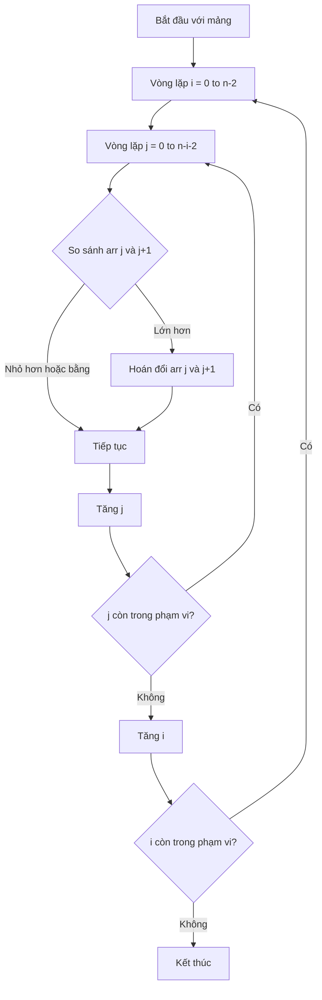
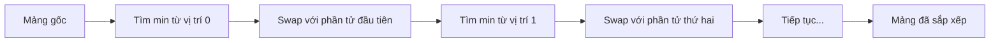
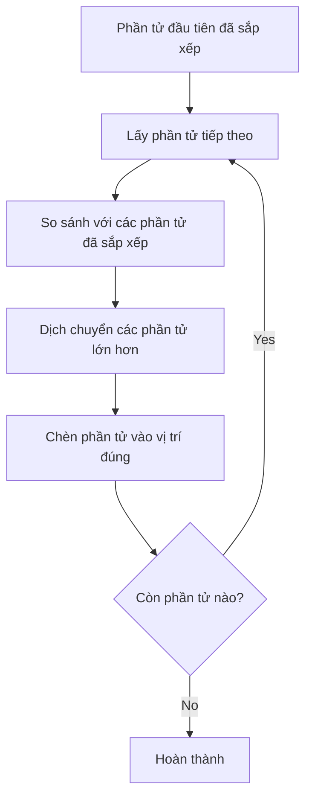

# Bài 9: Simple Sorting Algorithms

## Thuật toán sắp xếp cơ bản

---

<div className="bg-blue-50 border-l-4 border-blue-400 p-4 mb-6">
  <h3 className="text-blue-800 font-semibold mb-2">🎯 Mục tiêu học tập</h3>
  <p className="text-blue-700">
    Nắm vững 3 thuật toán sắp xếp cơ bản (Bubble Sort, Selection Sort, Insertion Sort), 
    hiểu độ phức tạp thời gian và không gian, biết cách phân tích và so sánh hiệu suất.
  </p>
</div>

## 1. Giới thiệu về Sorting Algorithms

**Sắp xếp (Sorting)** là quá trình sắp xếp các phần tử trong một tập hợp theo thứ tự tăng dần hoặc giảm dần dựa trên một tiêu chí nhất định.

### Phân loại thuật toán sắp xếp

| Tiêu chí           | Loại 1       | Loại 2              |
| ------------------ | ------------ | ------------------- |
| **Tính ổn định**   | Stable       | Unstable            |
| **Vị trí sắp xếp** | In-place     | Out-of-place        |
| **Phương pháp**    | So sánh      | Không so sánh       |
| **Độ phức tạp**    | Simple O(n²) | Advanced O(n log n) |

---

## 2. Bubble Sort - Thuật toán nổi bọt

<div className="bg-green-50 border border-green-200 rounded-lg p-4 mb-4">
  <h4 className="text-green-800 font-semibold mb-2">💡 Ý tưởng chính</h4>
  <p className="text-green-700">
    So sánh từng cặp phần tử liền kề và hoán đổi nếu chúng sai thứ tự. 
    Phần tử lớn nhất sẽ "nổi" lên vị trí cuối sau mỗi lần duyệt.
  </p>
</div>

### Minh họa thuật toán



### Cài đặt Bubble Sort

```cpp
#include <iostream>
#include <vector>
using namespace std;

void bubbleSort(vector<int>& arr) {
    int n = arr.size();
    bool swapped;

    for (int i = 0; i < n - 1; i++) {
        swapped = false;

        // Duyệt từ 0 đến n-i-2
        for (int j = 0; j < n - i - 1; j++) {
            if (arr[j] > arr[j + 1]) {
                swap(arr[j], arr[j + 1]);
                swapped = true;
            }
        }

        // Nếu không có swap nào => mảng đã sắp xếp
        if (!swapped) {
            break;
        }
    }
}

void printArray(const vector<int>& arr) {
    for (int x : arr) {
        cout << x << " ";
    }
    cout << endl;
}

int main() {
    vector<int> arr = {64, 34, 25, 12, 22, 11, 90};
    cout << "Mảng gốc: ";
    printArray(arr);

    bubbleSort(arr);

    cout << "Mảng đã sắp xếp: ";
    printArray(arr);

    return 0;
}
```

### Phân tích Bubble Sort

| Trường hợp           | Time Complexity | Mô tả               |
| -------------------- | --------------- | ------------------- |
| **Best Case**        | O(n)            | Mảng đã sắp xếp sẵn |
| **Average Case**     | O(n²)           | Mảng ngẫu nhiên     |
| **Worst Case**       | O(n²)           | Mảng sắp xếp ngược  |
| **Space Complexity** | O(1)            | In-place sorting    |

---

## 3. Selection Sort - Thuật toán chọn

<div className="bg-yellow-50 border border-yellow-200 rounded-lg p-4 mb-4">
  <h4 className="text-yellow-800 font-semibold mb-2">💡 Ý tưởng chính</h4>
  <p className="text-yellow-700">
    Tìm phần tử nhỏ nhất trong phần chưa sắp xếp và đặt vào vị trí đúng của nó. 
    Lặp lại cho đến khi toàn bộ mảng được sắp xếp.
  </p>
</div>

### Minh họa quá trình



### Cài đặt Selection Sort

```cpp
void selectionSort(vector<int>& arr) {
    int n = arr.size();

    for (int i = 0; i < n - 1; i++) {
        int minIndex = i;

        // Tìm phần tử nhỏ nhất trong phần còn lại
        for (int j = i + 1; j < n; j++) {
            if (arr[j] < arr[minIndex]) {
                minIndex = j;
            }
        }

        // Hoán đổi nếu cần
        if (minIndex != i) {
            swap(arr[i], arr[minIndex]);
        }
    }
}
```

### So sánh với Bubble Sort

| Thuộc tính          | Bubble Sort             | Selection Sort |
| ------------------- | ----------------------- | -------------- |
| **Số lần so sánh**  | O(n²)                   | O(n²)          |
| **Số lần hoán đổi** | O(n²) worst case        | O(n) always    |
| **Stable**          | Yes                     | No             |
| **Adaptive**        | Yes (with optimization) | No             |

---

## 4. Insertion Sort - Thuật toán chèn

<div className="bg-purple-50 border border-purple-200 rounded-lg p-4 mb-4">
  <h4 className="text-purple-800 font-semibold mb-2">💡 Ý tưởng chính</h4>
  <p className="text-purple-700">
    Xây dựng dãy sắp xếp từng phần tử một, giống như cách sắp xếp bài trong tay. 
    Mỗi phần tử được chèn vào vị trí đúng trong phần đã sắp xếp.
  </p>
</div>

### Visualization



### Cài đặt Insertion Sort

```cpp
void insertionSort(vector<int>& arr) {
    int n = arr.size();

    for (int i = 1; i < n; i++) {
        int key = arr[i];
        int j = i - 1;

        // Di chuyển các phần tử lớn hơn key về phía sau
        while (j >= 0 && arr[j] > key) {
            arr[j + 1] = arr[j];
            j--;
        }

        // Chèn key vào vị trí đúng
        arr[j + 1] = key;
    }
}
```

### Insertion Sort với Binary Search

```cpp
// Tối ưu hóa với binary search để tìm vị trí chèn
int binarySearch(vector<int>& arr, int val, int start, int end) {
    if (start == end) {
        return (arr[start] > val) ? start : start + 1;
    }

    if (start > end) {
        return start;
    }

    int mid = (start + end) / 2;

    if (arr[mid] < val) {
        return binarySearch(arr, val, mid + 1, end);
    } else if (arr[mid] > val) {
        return binarySearch(arr, val, start, mid - 1);
    } else {
        return mid;
    }
}

void binaryInsertionSort(vector<int>& arr) {
    int n = arr.size();

    for (int i = 1; i < n; i++) {
        int key = arr[i];
        int pos = binarySearch(arr, key, 0, i - 1);

        // Dịch chuyển các phần tử
        for (int j = i - 1; j >= pos; j--) {
            arr[j + 1] = arr[j];
        }

        arr[pos] = key;
    }
}
```

---

## 5. Bảng so sánh tổng quát

### Time & Space Complexity

| Algorithm          | Best Case | Average Case | Worst Case | Space | Stable |
| ------------------ | --------- | ------------ | ---------- | ----- | ------ |
| **Bubble Sort**    | O(n)      | O(n²)        | O(n²)      | O(1)  | ✅     |
| **Selection Sort** | O(n²)     | O(n²)        | O(n²)      | O(1)  | ❌     |
| **Insertion Sort** | O(n)      | O(n²)        | O(n²)      | O(1)  | ✅     |

### Đặc điểm nổi bật

<div className="grid grid-cols-1 md:grid-cols-3 gap-4 mb-6">
  <div className="border border-gray-200 rounded-lg p-4">
    <h4 className="font-semibold text-blue-600 mb-2">Bubble Sort</h4>
    <ul className="text-sm text-gray-700">
      <li>• Dễ hiểu và cài đặt</li>
      <li>• Có thể tối ưu với early termination</li>
      <li>• Stable sorting</li>
      <li>• Hiệu suất kém với dữ liệu lớn</li>
    </ul>
  </div>
  <div className="border border-gray-200 rounded-lg p-4">
    <h4 className="font-semibold text-yellow-600 mb-2">Selection Sort</h4>
    <ul className="text-sm text-gray-700">
      <li>• Số lần swap tối thiểu O(n)</li>
      <li>• Performance ổn định</li>
      <li>• Không stable</li>
      <li>• Tốt cho dữ liệu swap cost cao</li>
    </ul>
  </div>
  <div className="border border-gray-200 rounded-lg p-4">
    <h4 className="font-semibold text-purple-600 mb-2">Insertion Sort</h4>
    <ul className="text-sm text-gray-700">
      <li>• Hiệu quả với mảng nhỏ</li>
      <li>• Adaptive - tốt cho dữ liệu gần sắp xếp</li>
      <li>• Stable sorting</li>
      <li>• Online algorithm</li>
    </ul>
  </div>
</div>

---

## 6. Benchmark và Performance Testing

### Test với các trường hợp khác nhau

```cpp
#include <chrono>
#include <random>
#include <algorithm>

class SortingBenchmark {
private:
    vector<int> generateRandomArray(int size, int maxVal = 1000) {
        vector<int> arr(size);
        random_device rd;
        mt19937 gen(rd());
        uniform_int_distribution<> dis(1, maxVal);

        for (int& x : arr) {
            x = dis(gen);
        }
        return arr;
    }

    vector<int> generateSortedArray(int size) {
        vector<int> arr(size);
        for (int i = 0; i < size; i++) {
            arr[i] = i + 1;
        }
        return arr;
    }

    vector<int> generateReverseSortedArray(int size) {
        vector<int> arr(size);
        for (int i = 0; i < size; i++) {
            arr[i] = size - i;
        }
        return arr;
    }

public:
    void benchmark() {
        vector<int> sizes = {100, 500, 1000, 2000};

        for (int size : sizes) {
            cout << "\n=== Array Size: " << size << " ===\n";

            // Test với mảng ngẫu nhiên
            auto randomArr = generateRandomArray(size);
            testAlgorithms(randomArr, "Random Array");

            // Test với mảng đã sắp xếp
            auto sortedArr = generateSortedArray(size);
            testAlgorithms(sortedArr, "Sorted Array");

            // Test với mảng sắp xếp ngược
            auto reverseArr = generateReverseSortedArray(size);
            testAlgorithms(reverseArr, "Reverse Sorted Array");
        }
    }

private:
    void testAlgorithms(vector<int> arr, const string& testCase) {
        cout << "\n" << testCase << ":\n";

        // Test Bubble Sort
        auto arr1 = arr;
        auto start = chrono::high_resolution_clock::now();
        bubbleSort(arr1);
        auto end = chrono::high_resolution_clock::now();
        auto duration = chrono::duration_cast<chrono::microseconds>(end - start);
        cout << "Bubble Sort: " << duration.count() << " μs\n";

        // Test Selection Sort
        auto arr2 = arr;
        start = chrono::high_resolution_clock::now();
        selectionSort(arr2);
        end = chrono::high_resolution_clock::now();
        duration = chrono::duration_cast<chrono::microseconds>(end - start);
        cout << "Selection Sort: " << duration.count() << " μs\n";

        // Test Insertion Sort
        auto arr3 = arr;
        start = chrono::high_resolution_clock::now();
        insertionSort(arr3);
        end = chrono::high_resolution_clock::now();
        duration = chrono::duration_cast<chrono::microseconds>(end - start);
        cout << "Insertion Sort: " << duration.count() << " μs\n";
    }
};
```

---

## 7. Khi nào sử dụng thuật toán nào?

### Gợi ý lựa chọn

| Tình huống                  | Thuật toán đề xuất    | Lý do                              |
| --------------------------- | --------------------- | ---------------------------------- |
| **Mảng nhỏ (< 50 phần tử)** | Insertion Sort        | Đơn giản, hiệu quả với dữ liệu nhỏ |
| **Dữ liệu gần sắp xếp**     | Insertion Sort        | Adaptive, O(n) best case           |
| **Cần stable sorting**      | Bubble/Insertion Sort | Giữ thứ tự tương đối               |
| **Swap cost cao**           | Selection Sort        | Số lần swap tối thiểu              |
| **Học thuật toán**          | Bubble Sort           | Dễ hiểu, trực quan                 |

---

## 8. Bài tập thực hành

### Bài tập cơ bản

1. **Implement và test**: Cài đặt cả 3 thuật toán và test với các test case khác nhau
2. **Counting operations**: Đếm số lần so sánh và swap cho từng thuật toán
3. **Visualization**: Tạo output hiển thị từng bước của quá trình sắp xếp

### Bài tập nâng cao

4. **Hybrid sorting**: Kết hợp insertion sort với bubble sort
5. **Recursive implementation**: Viết bubble sort và selection sort dạng đệ quy
6. **Generic template**: Viết template có thể sắp xếp mọi kiểu dữ liệu

---

## 9. LeetCode Problems

### Recommended Problems

| Problem                                                                                          | Level  | Description                      |
| ------------------------------------------------------------------------------------------------ | ------ | -------------------------------- |
| **[912. Sort an Array](https://leetcode.com/problems/sort-an-array/)**                           | Medium | Implement sorting algorithm      |
| **[148. Sort List](https://leetcode.com/problems/sort-list/)**                                   | Medium | Sort linked list với O(n log n)  |
| **[75. Sort Colors](https://leetcode.com/problems/sort-colors/)**                                | Medium | Dutch flag problem               |
| **[242. Valid Anagram](https://leetcode.com/problems/valid-anagram/)**                           | Easy   | Sử dụng sorting để check anagram |
| **[147. Insertion Sort List](https://leetcode.com/problems/insertion-sort-list/)**               | Medium | Insertion sort cho linked list   |
| **[349. Intersection of Two Arrays](https://leetcode.com/problems/intersection-of-two-arrays/)** | Easy   | Sort + two pointers              |

---

<div className="bg-gray-50 border border-gray-200 rounded-lg p-4 mt-6">
  <h4 className="text-gray-800 font-semibold mb-2">🎯 Tổng kết</h4>
  <p className="text-gray-700 mb-2">
    Ba thuật toán sắp xếp cơ bản này là nền tảng quan trọng để hiểu về sorting. 
    Mặc dù không hiệu quả cho dữ liệu lớn, chúng giúp bạn:
  </p>
  <ul className="text-gray-700 text-sm list-disc list-inside">
    <li>Hiểu bản chất của thuật toán sắp xếp</li>
    <li>Phân tích complexity và trade-offs</li>
    <li>Chuẩn bị cho các thuật toán advanced hơn</li>
    <li>Áp dụng trong các bài toán thực tế với dữ liệu nhỏ</li>
  </ul>
</div>
