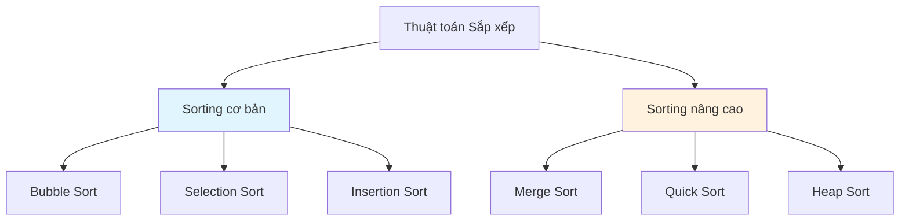
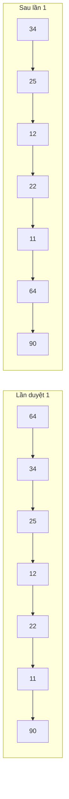
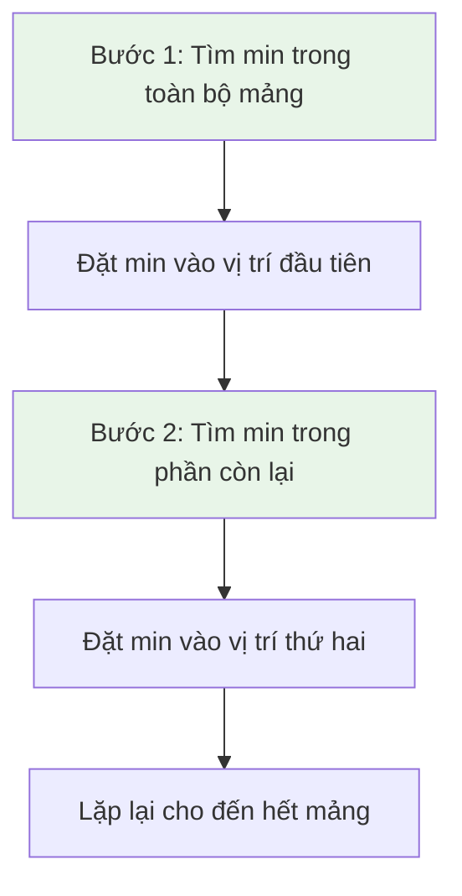
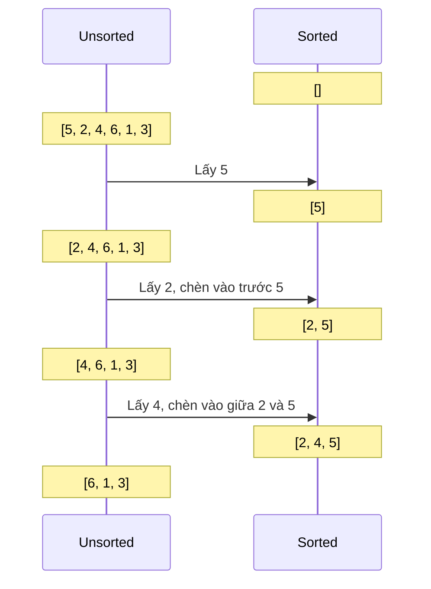
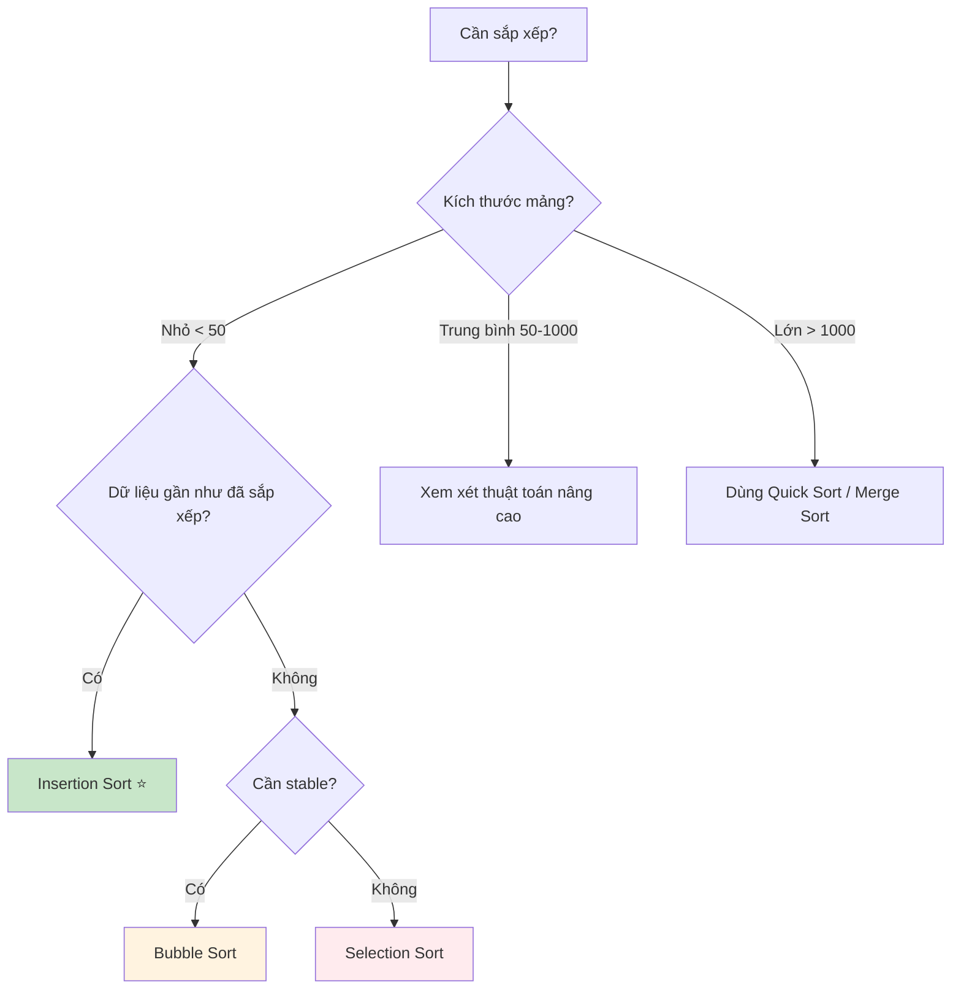

# Bài 9: Simple Sorting Algorithms - Thuật Toán Sắp Xếp Cơ Bản

<div className="bg-gradient-to-r from-blue-50 to-indigo-100 p-6 rounded-lg border-l-4 border-indigo-500 mb-6">
  <h2 className="text-2xl font-bold text-indigo-800 mb-2">🎯 Mục tiêu bài học</h2>
  <p className="text-indigo-700">
    Nắm vững 3 thuật toán sắp xếp cơ bản: Bubble Sort, Selection Sort, và Insertion Sort. 
    Hiểu rõ cách hoạt động, độ phức tạp và ứng dụng của từng thuật toán.
  </p>
</div>

## 📚 Tổng quan về Sorting (Sắp xếp)

**Sắp xếp** là quá trình sắp xếp lại các phần tử trong một tập hợp theo một thứ tự nhất định (tăng dần hoặc giảm dần). Đây là một trong những vấn đề cơ bản và quan trọng nhất trong khoa học máy tính.

### Tại sao Sorting quan trọng?

| Lý do | Mô tả |
|-------|--------|
| **Tìm kiếm nhanh hơn** | Dữ liệu đã sắp xếp giúp tìm kiếm nhanh hơn (Binary Search) |
| **Tối ưu hóa** | Nhiều thuật toán hoạt động hiệu quả hơn trên dữ liệu đã sắp xếp |
| **Trực quan hóa** | Dữ liệu sắp xếp dễ đọc và phân tích hơn |
| **Chuẩn bị dữ liệu** | Bước tiền xử lý cho nhiều thuật toán khác |

### Phân loại thuật toán sắp xếp



---

## 🫧 1. Bubble Sort (Sắp xếp nổi bọt)

<div className="bg-yellow-50 border border-yellow-200 rounded-lg p-4 mb-4">
  <h3 className="text-yellow-800 font-semibold mb-2">💡 Ý tưởng cốt lõi</h3>
  <p className="text-yellow-700">
    So sánh hai phần tử liền kề và hoán đổi nếu chúng không đúng thứ tự. 
    Phần tử lớn nhất sẽ "nổi lên" cuối mảng như bong bóng nước.
  </p>
</div>

### Cách hoạt động



### Triển khai bằng Rust

```rust
fn bubble_sort(arr: &mut Vec<i32>) {
    let n = arr.len();
    
    // Duyệt qua tất cả các phần tử
    for i in 0..n {
        let mut swapped = false;
        
        // Duyệt từ đầu đến phần tử chưa được sắp xếp
        for j in 0..(n - i - 1) {
            // So sánh phần tử liền kề
            if arr[j] > arr[j + 1] {
                // Hoán đổi nếu không đúng thứ tự
                arr.swap(j, j + 1);
                swapped = true;
            }
        }
        
        // Nếu không có hoán đổi nào, mảng đã được sắp xếp
        if !swapped {
            break;
        }
    }
}

// Ví dụ sử dụng
fn main() {
    let mut arr = vec![64, 34, 25, 12, 22, 11, 90];
    println!("Mảng ban đầu: {:?}", arr);
    
    bubble_sort(&mut arr);
    
    println!("Mảng sau khi sắp xếp: {:?}", arr);
    // Kết quả: [11, 12, 22, 25, 34, 64, 90]
}
```

### Phân tích độ phức tạp

| Trường hợp | Time Complexity | Mô tả |
|------------|-----------------|--------|
| **Best Case** | O(n) | Mảng đã được sắp xếp |
| **Average Case** | O(n²) | Mảng ngẫu nhiên |
| **Worst Case** | O(n²) | Mảng sắp xếp ngược |
| **Space Complexity** | O(1) | Sắp xếp tại chỗ |

---

## 🎯 2. Selection Sort (Sắp xếp chọn)

<div className="bg-green-50 border border-green-200 rounded-lg p-4 mb-4">
  <h3 className="text-green-800 font-semibold mb-2">💡 Ý tưởng cốt lõi</h3>
  <p className="text-green-700">
    Tìm phần tử nhỏ nhất trong phần chưa sắp xếp và đặt nó vào đúng vị trí. 
    Lặp lại cho đến khi toàn bộ mảng được sắp xếp.
  </p>
</div>

### Cách hoạt động



### Triển khai bằng Rust

```rust
fn selection_sort(arr: &mut Vec<i32>) {
    let n = arr.len();
    
    // Duyệt qua từng vị trí trong mảng
    for i in 0..n {
        let mut min_index = i;
        
        // Tìm phần tử nhỏ nhất trong phần còn lại
        for j in (i + 1)..n {
            if arr[j] < arr[min_index] {
                min_index = j;
            }
        }
        
        // Hoán đổi phần tử nhỏ nhất với phần tử tại vị trí i
        if min_index != i {
            arr.swap(i, min_index);
        }
        
        // In ra trạng thái mảng sau mỗi bước (để debug)
        println!("Sau bước {}: {:?}", i + 1, arr);
    }
}

// Ví dụ sử dụng
fn main() {
    let mut arr = vec![64, 25, 12, 22, 11];
    println!("Mảng ban đầu: {:?}", arr);
    
    selection_sort(&mut arr);
    
    println!("Mảng đã sắp xếp: {:?}", arr);
}
```

### So sánh với Bubble Sort

| Tiêu chí | Selection Sort | Bubble Sort |
|----------|----------------|-------------|
| **Số lần so sánh** | O(n²) | O(n²) |
| **Số lần hoán đổi** | O(n) | O(n²) |
| **Stable** | ❌ Không | ✅ Có |
| **In-place** | ✅ Có | ✅ Có |

---

## 📥 3. Insertion Sort (Sắp xếp chèn)

<div className="bg-purple-50 border border-purple-200 rounded-lg p-4 mb-4">
  <h3 className="text-purple-800 font-semibold mb-2">💡 Ý tưởng cốt lõi</h3>
  <p className="text-purple-700">
    Xây dựng mảng đã sắp xếp từng phần tử một, bằng cách chèn mỗi phần tử mới 
    vào đúng vị trí trong phần đã sắp xếp.
  </p>
</div>

### Cách hoạt động - Tương tự như sắp xếp bài trong tay



### Triển khai bằng Rust

```rust
fn insertion_sort(arr: &mut Vec<i32>) {
    let n = arr.len();
    
    // Bắt đầu từ phần tử thứ hai (index 1)
    for i in 1..n {
        let key = arr[i];  // Phần tử cần chèn
        let mut j = i as i32 - 1;  // Vị trí để so sánh
        
        // Dịch chuyển các phần tử lớn hơn key về phía sau
        while j >= 0 && arr[j as usize] > key {
            arr[(j + 1) as usize] = arr[j as usize];
            j -= 1;
        }
        
        // Chèn key vào vị trí đúng
        arr[(j + 1) as usize] = key;
        
        // Debug: in trạng thái mảng
        println!("Bước {}: {:?}", i, arr);
    }
}

// Phiên bản tối ưu hơn
fn insertion_sort_optimized(arr: &mut Vec<i32>) {
    for i in 1..arr.len() {
        let key = arr[i];
        
        // Tìm vị trí chèn bằng binary search (tùy chọn)
        let mut left = 0;
        let mut right = i;
        
        // Binary search để tìm vị trí chèn
        while left < right {
            let mid = (left + right) / 2;
            if arr[mid] <= key {
                left = mid + 1;
            } else {
                right = mid;
            }
        }
        
        // Dịch chuyển và chèn
        for j in (left..i).rev() {
            arr[j + 1] = arr[j];
        }
        arr[left] = key;
    }
}

fn main() {
    let mut arr = vec![5, 2, 4, 6, 1, 3];
    println!("Mảng ban đầu: {:?}", arr);
    
    insertion_sort(&mut arr);
    
    println!("Kết quả: {:?}", arr);
}
```

---

## 📊 Bảng so sánh tổng quát

<div className="overflow-x-auto">
  <table className="min-w-full bg-white border border-gray-300">
    <thead className="bg-gray-50">
      <tr>
        <th className="px-6 py-3 text-left text-xs font-medium text-gray-500 uppercase tracking-wider border-b">
          Thuật toán
        </th>
        <th className="px-6 py-3 text-left text-xs font-medium text-gray-500 uppercase tracking-wider border-b">
          Best Case
        </th>
        <th className="px-6 py-3 text-left text-xs font-medium text-gray-500 uppercase tracking-wider border-b">
          Average Case
        </th>
        <th className="px-6 py-3 text-left text-xs font-medium text-gray-500 uppercase tracking-wider border-b">
          Worst Case
        </th>
        <th className="px-6 py-3 text-left text-xs font-medium text-gray-500 uppercase tracking-wider border-b">
          Space
        </th>
        <th className="px-6 py-3 text-left text-xs font-medium text-gray-500 uppercase tracking-wider border-b">
          Stable
        </th>
      </tr>
    </thead>
    <tbody className="bg-white divide-y divide-gray-200">
      <tr>
        <td className="px-6 py-4 whitespace-nowrap font-medium text-blue-600">Bubble Sort</td>
        <td className="px-6 py-4 whitespace-nowrap text-green-600">O(n)</td>
        <td className="px-6 py-4 whitespace-nowrap text-orange-600">O(n²)</td>
        <td className="px-6 py-4 whitespace-nowrap text-red-600">O(n²)</td>
        <td className="px-6 py-4 whitespace-nowrap text-green-600">O(1)</td>
        <td className="px-6 py-4 whitespace-nowrap text-green-600">✅</td>
      </tr>
      <tr className="bg-gray-50">
        <td className="px-6 py-4 whitespace-nowrap font-medium text-blue-600">Selection Sort</td>
        <td className="px-6 py-4 whitespace-nowrap text-red-600">O(n²)</td>
        <td className="px-6 py-4 whitespace-nowrap text-orange-600">O(n²)</td>
        <td className="px-6 py-4 whitespace-nowrap text-red-600">O(n²)</td>
        <td className="px-6 py-4 whitespace-nowrap text-green-600">O(1)</td>
        <td className="px-6 py-4 whitespace-nowrap text-red-600">❌</td>
      </tr>
      <tr>
        <td className="px-6 py-4 whitespace-nowrap font-medium text-blue-600">Insertion Sort</td>
        <td className="px-6 py-4 whitespace-nowrap text-green-600">O(n)</td>
        <td className="px-6 py-4 whitespace-nowrap text-orange-600">O(n²)</td>
        <td className="px-6 py-4 whitespace-nowrap text-red-600">O(n²)</td>
        <td className="px-6 py-4 whitespace-nowrap text-green-600">O(1)</td>
        <td className="px-6 py-4 whitespace-nowrap text-green-600">✅</td>
      </tr>
    </tbody>
  </table>
</div>

## 🎮 Thực hành với input cases khác nhau

### Test với các trường hợp đặc biệt

```rust
fn test_sorting_algorithms() {
    let test_cases = vec![
        vec![1, 2, 3, 4, 5],        // Đã sắp xếp
        vec![5, 4, 3, 2, 1],        // Sắp xếp ngược
        vec![3, 1, 4, 1, 5, 9, 2, 6], // Ngẫu nhiên
        vec![1],                     // Một phần tử
        vec![],                      // Rỗng
        vec![2, 2, 2, 2],           // Phần tử trùng lặp
    ];
    
    for (i, mut case) in test_cases.into_iter().enumerate() {
        println!("Test case {}: {:?}", i + 1, case);
        
        let mut bubble = case.clone();
        let mut selection = case.clone();
        let mut insertion = case.clone();
        
        let start = std::time::Instant::now();
        bubble_sort(&mut bubble);
        let bubble_time = start.elapsed();
        
        let start = std::time::Instant::now();
        selection_sort(&mut selection);
        let selection_time = start.elapsed();
        
        let start = std::time::Instant::now();
        insertion_sort(&mut insertion);
        let insertion_time = start.elapsed();
        
        println!("  Bubble Sort: {:?} ({}μs)", bubble, bubble_time.as_micros());
        println!("  Selection Sort: {:?} ({}μs)", selection, selection_time.as_micros());
        println!("  Insertion Sort: {:?} ({}μs)", insertion, insertion_time.as_micros());
        println!();
    }
}
```

## 🏆 Khi nào sử dụng thuật toán nào?



---

## 💻 Bài tập thực hành trên LeetCode

### Bài tập liên quan đến Sorting cơ bản:

1. **[88. Merge Sorted Array](https://leetcode.com/problems/merge-sorted-array/)**
   - Độ khó: Easy
   - Ứng dụng: Kỹ thuật merge từ Merge Sort

2. **[912. Sort an Array](https://leetcode.com/problems/sort-an-array/)**
   - Độ khó: Medium
   - Thực hành: Implement các thuật toán sorting

3. **[75. Sort Colors](https://leetcode.com/problems/sort-colors/)**
   - Độ khó: Medium
   - Ứng dụng: Counting Sort variant

4. **[148. Sort List](https://leetcode.com/problems/sort-list/)**
   - Độ khó: Medium
   - Thực hành: Sorting trên Linked List

5. **[179. Largest Number](https://leetcode.com/problems/largest-number/)**
   - Độ khó: Medium
   - Ứng dụng: Custom comparator

6. **[56. Merge Intervals](https://leetcode.com/problems/merge-intervals/)**
   - Độ khó: Medium
   - Ứng dụng: Sorting + Two pointers

7. **[1636. Sort Array by Increasing Frequency](https://leetcode.com/problems/sort-array-by-increasing-frequency/)**
   - Độ khó: Easy
   - Thực hành: Custom sorting logic

<div className="bg-blue-50 border border-blue-200 rounded-lg p-6 mt-8">
  <h3 className="text-blue-800 font-bold text-lg mb-3">🎯 Tóm tắt bài học</h3>
  <div className="text-blue-700 space-y-2">
    <p><strong>✅ Đã học được:</strong></p>
    <ul className="list-disc list-inside ml-4 space-y-1">
      <li>3 thuật toán sorting cơ bản và cách triển khai</li>
      <li>Phân tích độ phức tạp time/space complexity</li>
      <li>So sánh ưu nhược điểm của từng thuật toán</li>
      <li>Khi nào nên sử dụng thuật toán nào</li>
    </ul>
    <p><strong>🎓 Bước tiếp theo:</strong> Bài 10 - Advanced Sorting Algorithms (Merge Sort, Quick Sort)</p>
  </div>
</div>

---

<div className="text-center text-gray-500 text-sm mt-8">
  <p>📚 Khóa học Data Structures & Algorithms - Bài 9/24</p>
  <p>Được biên soạn với ❤️ cho người học lập trình</p>
</div>