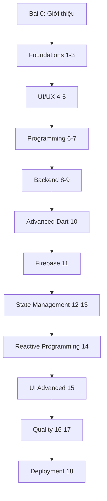
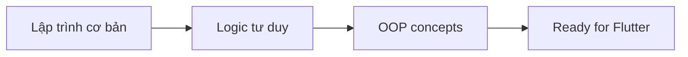
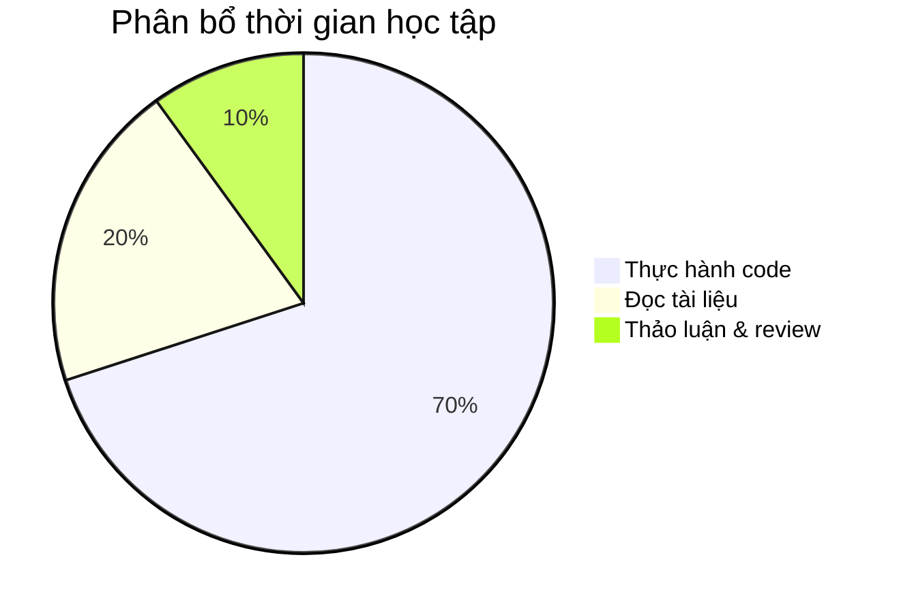
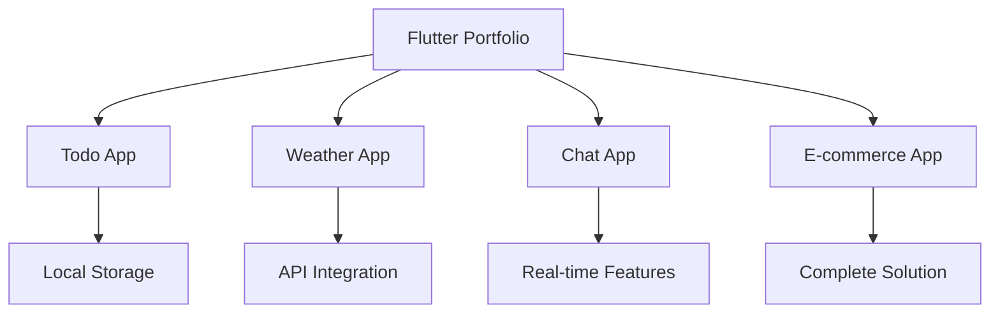

# Bài 0: Giới thiệu Khóa học Flutter

  <h2 className="text-3xl font-bold mb-2">🚀 Chào mừng đến với Khóa học Flutter hoàn chỉnh</h2>
  
Hành trình trở thành Flutter Developer chuyên nghiệp

## 📋 Tổng quan khóa học

**Khóa học Flutter hoàn chỉnh** được thiết kế dành cho người mới bắt đầu, giúp bạn nắm vững từ kiến thức cơ bản đến nâng cao trong việc phát triển ứng dụng đa nền tảng với Flutter.

### 🎯 Mục tiêu khóa học

| Mục tiêu | Mô tả |
|----------|--------|
| **Kiến thức nền tảng** | Nắm vững Dart programming và Flutter framework |
| **Kỹ năng thực hành** | Xây dựng ứng dụng thực tế từ đơn giản đến phức tạp |
| **Best Practices** | Áp dụng chuẩn code, kiến trúc và design patterns |
| **Triển khai sản phẩm** | CI/CD, testing và deployment lên stores |

## 📊 Cấu trúc khóa học

## 🎨 Lộ trình học tập

  

    <h3 className="font-bold text-blue-800 mb-2">Giai đoạn 1: Nền tảng (Bài 1-5)</h3>
    
Flutter basics, Dart, UI components, và asset management

  

  
  

    <h3 className="font-bold text-green-800 mb-2">Giai đoạn 2: Lập trình (Bài 6-10)</h3>
    
OOP, packages, networking, database, và advanced Dart

  

  
  

    <h3 className="font-bold text-purple-800 mb-2">Giai đoạn 3: Nâng cao (Bài 11-15)</h3>
    
Firebase, state management, reactive programming, animations

  

  
  

    <h3 className="font-bold text-orange-800 mb-2">Giai đoạn 4: Chuyên nghiệp (Bài 16-18)</h3>
    
Testing, performance optimization, và deployment

  

### 📈 Timeline học tập khuyến nghị

| Tuần | Bài học | Trọng tâm | Thời lượng |
|------|---------|-----------|------------|
| 1-2 | Bài 1-3 | Dart & Flutter basics | 20-25 giờ |
| 3 | Bài 4-5 | UI/UX foundations | 12-15 giờ |
| 4-5 | Bài 6-7 | Programming concepts | 18-20 giờ |
| 6-7 | Bài 8-9 | Backend integration | 20-25 giờ |
| 8 | Bài 10-11 | Advanced Dart & Firebase | 15-18 giờ |
| 9-10 | Bài 12-13 | State management | 20-25 giờ |
| 11 | Bài 14-15 | Reactive & Animations | 15-18 giờ |
| 12 | Bài 16-18 | Quality & Deployment | 18-22 giờ |

## 🛠 Yêu cầu và chuẩn bị

### Kiến thức tiền đề

| Yêu cầu | Mức độ | Mô tả |
|---------|--------|--------|
| **Lập trình cơ bản** | Cần thiết | Hiểu về variables, functions, loops |
| **Tư duy logic** | Quan trọng | Phân tích và giải quyết vấn đề |
| **Tiếng Anh cơ bản** | Hữu ích | Đọc documentation và tìm hiểu |
| **Mobile app usage** | Cơ bản | Hiểu cách hoạt động của mobile apps |

### Thiết bị và phần mềm

  <h4 className="font-semibold mb-3">💻 Cấu hình tối thiểu:</h4>
  <ul className="space-y-2 text-sm">
    <li>• <strong>OS:</strong> Windows 10+, macOS 10.14+, hoặc Ubuntu 18.04+</li>
    <li>• <strong>RAM:</strong> 8GB (khuyến nghị 16GB)</li>
    <li>• <strong>Storage:</strong> 15GB dung lượng trống</li>
    <li>• <strong>Internet:</strong> Kết nối ổn định cho download packages</li>
  </ul>

## 📚 Phương pháp học tập hiệu quả

### Nguyên tắc 70-20-10

| Hoạt động | Tỷ lệ | Cách thực hiện |
|-----------|--------|----------------|
| **Coding thực hành** | 70% | Làm theo hướng dẫn, tự xây dựng project |
| **Lý thuyết & tài liệu** | 20% | Đọc docs, xem video, ghi chú |
| **Chia sể & thảo luận** | 10% | Code review, community, mentoring |

### 🎯 Mẹo học tập

  

    <h4 className="font-bold text-yellow-800 mb-2">✅ Nên làm</h4>
    <ul className="text-sm text-yellow-700 space-y-1">
      <li>• Code mỗi ngày, dù chỉ 30 phút</li>
      <li>• Ghi chú những khái niệm quan trọng</li>
      <li>• Tự xây dựng project cá nhân</li>
      <li>• Tham gia Flutter community</li>
    </ul>
  

  
  

    <h4 className="font-bold text-red-800 mb-2">❌ Tránh làm</h4>
    <ul className="text-sm text-red-700 space-y-1">
      <li>• Copy-paste code mà không hiểu</li>
      <li>• Bỏ qua phần lý thuyết cơ bản</li>
      <li>• Học quá nhanh, không thực hành</li>
      <li>• Ngại hỏi khi gặp khó khăn</li>
    </ul>
  

## 🎖 Kết quả mong đợi

Sau khi hoàn thành khóa học, bạn sẽ có khả năng:

### Kỹ năng kỹ thuật

| Kỹ năng | Mức độ thành thạo |
|---------|-------------------|
| **Dart Programming** | ⭐⭐⭐⭐⭐ |
| **Flutter UI Development** | ⭐⭐⭐⭐⭐ |
| **State Management** | ⭐⭐⭐⭐ |
| **API Integration** | ⭐⭐⭐⭐ |
| **Database Management** | ⭐⭐⭐⭐ |
| **Testing & Debugging** | ⭐⭐⭐ |
| **Deployment** | ⭐⭐⭐ |

### Portfolio dự án

## 🚀 Bắt đầu hành trình

  <h3 className="text-2xl font-bold mb-2">Sẵn sàng bắt đầu?</h3>
  
Hãy chuyển sang <strong>Bài 1: Giới thiệu Flutter và Dart cơ bản</strong>

  
Remember: "The expert in anything was once a beginner" 💪

---

## 📞 Hỗ trợ học tập

| Kênh hỗ trợ | Mô tả | Thời gian |
|-------------|--------|-----------|
| **Q&A Forum** | Đặt câu hỏi và thảo luận | 24/7 |
| **Code Review** | Nhận feedback về code | Theo lịch |
| **Live Session** | Buổi học trực tuyến | Hàng tuần |
| **Mentoring** | Hướng dẫn 1-1 | Theo appointment |

  
<strong>💡 Lưu ý:</strong> Khóa học này được cập nhật liên tục theo phiên bản Flutter mới nhất. Hãy luôn check phiên bản và requirements trước khi bắt đầu mỗi bài học.

