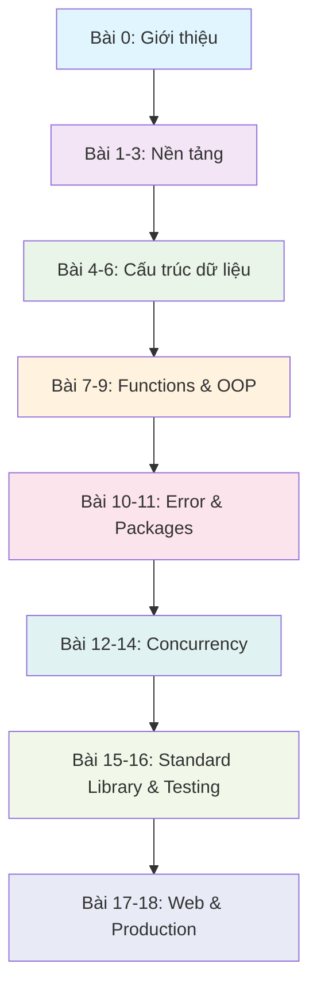
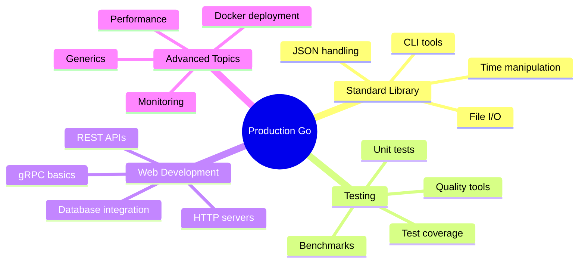
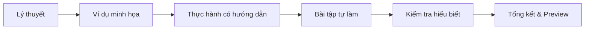

# Bài 0: Giới thiệu Khóa học Golang

  <h2 className="text-2xl font-bold text-blue-800 mb-2">🚀 Chào mừng bạn đến với khóa học Go từ cơ bản đến nâng cao</h2>
  
Một hành trình 18 bài học để trở thành Go Developer chuyên nghiệp

## 1. Tổng quan về khóa học

### 1.1 Mục tiêu học tập

| Cấp độ | Mục tiêu | Thời gian dự kiến |
|---------|-----------|-------------------|
| **Cơ bản** | Nắm vững cú pháp và concepts cơ bản | 6 bài đầu (3-4 tuần) |
| **Trung cấp** | Làm chủ concurrency và advanced features | 8 bài tiếp theo (4-5 tuần) |
| **Nâng cao** | Xây dựng ứng dụng production-ready | 4 bài cuối (2-3 tuần) |

  <h4 className="text-green-800 font-semibold mb-2">✅ Sau khóa học này, bạn sẽ có thể:</h4>
  

    
• Phát triển ứng dụng backend với Go

    
• Xây dựng REST API và microservices

    
• Làm việc hiệu quả với concurrent programming

    
• Deploy ứng dụng Go lên production

  

### 1.2 Lộ trình học tập

## 2. Cấu trúc khóa học chi tiết

### 2.1 Phase 1: Nền tảng Go (Bài 1-6)

| Bài | Chủ đề | Nội dung chính | Độ khó |
|-----|--------|----------------|---------|
| **1** | Giới thiệu & Cài đặt | Setup môi trường, Hello World, Go Modules | ⭐ |
| **2** | Cú pháp & Biến | Variables, Constants, Scope, Zero Values | ⭐ |
| **3** | Kiểu dữ liệu | Primitives, Strings, Type Conversion | ⭐⭐ |
| **4** | Điều khiển | if/else, switch, loops, break/continue | ⭐⭐ |
| **5** | Arrays & Slices | Static vs Dynamic arrays, Slice operations | ⭐⭐⭐ |
| **6** | Maps & Structs | Key-value pairs, Custom types, Embedding | ⭐⭐⭐ |

### 2.2 Phase 2: Lập trình nâng cao (Bài 7-14)

  <h4 className="text-blue-800 font-semibold mb-2">🎯 Focus chính: Functions, OOP và Concurrency</h4>

| Bài | Chủ đề | Highlights | Thực hành |
|-----|--------|-----------|-----------| 
| **7** | Functions | Multiple returns, Closures, Variadic | Calculator app |
| **8** | Pointers | Memory management, References | Performance optimization |
| **9** | Methods & Interfaces | OOP trong Go, Polymorphism | Shape management system |
| **10** | Error Handling | Error interface, Panic/Recover | File processing |
| **11** | Packages & Modules | Code organization, Publishing | Utility package |
| **12** | Goroutines | Concurrent programming basics | Multi-threaded tasks |
| **13** | Channels | Communication patterns | Producer-consumer |
| **14** | Advanced Concurrency | Sync package, Context | Web scraper |

### 2.3 Phase 3: Production & Deployment (Bài 15-18)

## 3. Yêu cầu và chuẩn bị

### 3.1 Kiến thức tiên quyết

  

    <h4 className="text-yellow-800 font-semibold mb-2">✅ Bắt buộc</h4>
    

      
• Kinh nghiệm lập trình cơ bản

      
• Hiểu biết về command line

      
• Khái niệm về git/version control

    

  

  

    <h4 className="text-blue-800 font-semibold mb-2">💡 Khuyến khích</h4>
    

      
• Một ngôn ngữ lập trình bất kỳ

      
• Hiểu biết về web development

      
• Kinh nghiệm với databases

    

  

### 3.2 Công cụ cần thiết

| Công cụ | Mục đích | Link tải |
|---------|----------|----------|
| **Go SDK** | Compiler và runtime | https://golang.org/dl/ |
| **VS Code** | IDE chính | https://code.visualstudio.com/ |
| **Go Extension** | Language support | VS Code Marketplace |
| **Git** | Version control | https://git-scm.com/ |
| **Docker** | Containerization (bài 18) | https://docker.com/ |

## 4. Phương pháp học tập

### 4.1 Cấu trúc mỗi bài học

### 4.2 Nguyên tắc học hiệu quả

  

    

      
📚

      <h4 className="font-semibold text-gray-800">Học từng bước</h4>
      
Không bỏ qua bài nào, xây dựng nền tảng vững chắc

    

    

      
💻

      <h4 className="font-semibold text-gray-800">Practice by coding</h4>
      
Code theo mọi ví dụ, không chỉ đọc

    

    

      
🔄

      <h4 className="font-semibold text-gray-800">Ôn tập thường xuyên</h4>
      
Review kiến thức cũ khi học bài mới

    

  

## 5. Đánh giá và chứng nhận

### 5.1 Hệ thống đánh giá

| Thành phần | Tỷ trọng | Mô tả |
|------------|----------|-------|
| **Bài tập thực hành** | 40% | Code exercises sau mỗi bài |
| **Mini Projects** | 35% | 3 projects nhỏ (bài 6, 11, 17) |
| **Final Project** | 25% | Ứng dụng web hoàn chỉnh |

### 5.2 Timeline dự kiến

```mermaid
gantt
    title Lộ trình 10 tuần học Go
    dateFormat X
    axisFormat %s
    
    section Phase 1 - Nền tảng
    Bài 1-3     :1, 3
    Bài 4-6     :4, 6
    Project 1   :7, 7
    
    section Phase 2 - Advanced  
    Bài 7-10    :8, 11
    Bài 11-14   :12, 15
    Project 2   :16, 16
    
    section Phase 3 - Production
    Bài 15-16   :17, 18
    Bài 17-18   :19, 20
    Final Project :21, 25
```

## 6. Tài nguyên hỗ trợ

### 6.1 Documentation chính thức

**Go Documentation**: https://golang.org/doc/

**Go by Example**: https://gobyexample.com/

**Effective Go**: https://golang.org/doc/effective_go.html

### 6.2 Community và Support

**Go Forum**: https://forum.golangbridge.org/

**Reddit r/golang**: https://reddit.com/r/golang

**Stack Overflow**: Tag `go` hoặc `golang`

  <h3 className="text-xl font-bold text-green-800 mb-3">🎉 Sẵn sàng bắt đầu?</h3>
  

    Hành trình học Go sẽ rất thú vị và bổ ích. Hãy chuẩn bị tinh thần học hỏi và sẵn sàng thực hành nhiều!
  

  

    ✨ Tư duy logic
    🚀 Thực hành nhiều
    🤝 Hỗ trợ cộng đồng
  

---

**Tiếp theo**: [Bài 1 - Giới thiệu và Cài đặt môi trường Go →](./bai-01-gioi-thieu-cai-dat.mdx)