# Bài 0: Giới thiệu Khóa học Tiếng Hàn Quốc - Trung cấp 1

<h2 className="text-2xl font-bold text-indigo-800 mb-4">🇰🇷 Chào mừng bạn đến với khóa học Tiếng Hàn Trung cấp 1!</h2>

Khóa học này được thiết kế đặc biệt cho những người đã có nền tảng cơ bản về tiếng Hàn và muốn nâng cao kỹ năng giao tiếp trong các tình huống thực tế của cuộc sống hàng ngày tại Hàn Quốc.

## 1. 🗺️ Sơ đồ tổng quan khóa học

```mermaid
flowchart TD
    Start([🇰🇷 Bắt đầu khóa học Korean]) --> Foundation{🏗️ Giai đoạn 1<br/>Nền tảng xã hội<br/>2-3 tuần}

    Foundation --> B1[Bài 1: 대인관계<br/>🤝 Quan hệ xã hội →]
    Foundation --> B2[Bài 2: 성격<br/>😊 Tính cách →]
    Foundation --> B3[Bài 3: 지역 복지 서비스<br/>🏢 Dịch vụ phúc lợi →]
    Foundation --> B4[Bài 4: 교환과 환불<br/>🔄 Đổi trả hàng →]

    B1 --> Daily{🏠 Giai đoạn 2<br/>Cuộc sống hàng ngày<br/>2-3 tuần}
    B2 --> Daily
    B3 --> Daily
    B4 --> Daily

    Daily --> B5[Bài 5: 소비와 절약<br/>💰 Tiêu dùng & tiết kiệm →]
    Daily --> B6[Bài 6: 주거 환경<br/>🏡 Môi trường sống →]
    Daily --> B7[Bài 7: 문화생활<br/>🎭 Đời sống văn hóa →]
    Daily --> B8[Bài 8: 음식과 요리<br/>🍲 Thực phẩm & nấu ăn →]

    B5 --> Practical{🔧 Giai đoạn 3<br/>Kỹ năng thực tiễn<br/>3-4 tuần}
    B6 --> Practical
    B7 --> Practical
    B8 --> Practical

    Practical --> B9[Bài 9: 고장과 수리<br/>🔨 Hỏng hóc & sửa chữa →]
    Practical --> B10[Bài 10: 취업<br/>💼 Xin việc làm →]
    Practical --> B11[Bài 11: 부동산<br/>🏠 Bất động sản →]

    B9 --> Culture{🇰🇷 Giai đoạn 4<br/>Văn hóa & xã hội<br/>2-3 tuần}
    B10 --> Culture
    B11 --> Culture

    Culture --> B12[Bài 12: 전통 명절<br/>🏮 Lễ hội truyền thống →]
    Culture --> B13[Bài 13: 직장 생활<br/>🏢 Cuộc sống công sở →]

    B12 --> Modern{📱 Giai đoạn 5<br/>Đời sống hiện đại<br/>2-3 tuần}
    B13 --> Modern

    Modern --> B14[Bài 14: 인터넷과 스마트폰<br/>📱 Internet & Smartphone →]
    Modern --> B15[Bài 15: 고민과 상담<br/>💭 Băn khoăn & tư vấn →]
    Modern --> B16[Bài 16: 기후와 날씨<br/>🌤️ Khí hậu & thời tiết →]

    B14 --> Complete([🎉 Hoàn thành khóa học])
    B15 --> Complete
    B16 --> Complete

    %% Click events for navigation
    click B1 "/desktop-docs/soft-skills/korean/bai-1" "Đi đến Bài 1"
    click B2 "/desktop-docs/soft-skills/korean/bai-2" "Đi đến Bài 2"
    click B3 "/desktop-docs/soft-skills/korean/bai-3" "Đi đến Bài 3"
    click B4 "/desktop-docs/soft-skills/korean/bai-4" "Đi đến Bài 4"
    click B5 "/desktop-docs/soft-skills/korean/bai-5" "Đi đến Bài 5"
    click B6 "/desktop-docs/soft-skills/korean/bai-6" "Đi đến Bài 6"
    click B7 "/desktop-docs/soft-skills/korean/bai-7" "Đi đến Bài 7"
    click B8 "/desktop-docs/soft-skills/korean/bai-8" "Đi đến Bài 8"
    click B9 "/desktop-docs/soft-skills/korean/bai-9" "Đi đến Bài 9"
    click B10 "/desktop-docs/soft-skills/korean/bai-10" "Đi đến Bài 10"
    click B11 "/desktop-docs/soft-skills/korean/bai-11" "Đi đến Bài 11"
    click B12 "/desktop-docs/soft-skills/korean/bai-12" "Đi đến Bài 12"
    click B13 "/desktop-docs/soft-skills/korean/bai-13" "Đi đến Bài 13"
    click B14 "/desktop-docs/soft-skills/korean/bai-14" "Đi đến Bài 14"
    click B15 "/desktop-docs/soft-skills/korean/bai-15" "Đi đến Bài 15"
    click B16 "/desktop-docs/soft-skills/korean/bai-16" "Đi đến Bài 16"

    %% Styling
    classDef phaseBox fill:#e3f2fd,stroke:#1565c0,stroke-width:3px,color:#000
    classDef lessonBox fill:#fff3e0,stroke:#ef6c00,stroke-width:2px,color:#000,cursor:pointer
    classDef startEnd fill:#e8f5e8,stroke:#2e7d32,stroke-width:3px,color:#000

    class Foundation,Daily,Practical,Culture,Modern phaseBox
    class B1,B2,B3,B4,B5,B6,B7,B8,B9,B10,B11,B12,B13,B14,B15,B16 lessonBox
    class Start,Complete startEnd
```

### 📚 Phân chia giai đoạn học tập

| Giai đoạn | Bài học | Trọng tâm | Thời gian ước tính |
|-----------|---------|-----------|-------------------|
| **Nền tảng xã hội** | 1-4 | Quan hệ cá nhân, dịch vụ cơ bản | 2-3 tuần |
| **Cuộc sống hàng ngày** | 5-8 | Tiêu dùng, môi trường sống, văn hóa | 2-3 tuần |
| **Kỹ năng thực tiễn** | 9-11 | Sửa chữa, việc làm, bất động sản | 3-4 tuần |
| **Văn hóa & xã hội** | 12-13 | Lễ hội, cuộc sống công sở | 2-3 tuần |
| **Đời sống hiện đại** | 14-16 | Công nghệ, tư vấn, thời tiết | 2-3 tuần |

---

## 📚 Tổng quan khóa học

### Thông tin cơ bản

| **Thông tin** | **Chi tiết** |
|---------------|--------------|
| **Tên khóa học** | Tiếng Hàn Quốc - Trung cấp 1 |
| **Số bài học** | 16 bài + 2 bài ôn tập |
| **Thời gian** | 18-24 tuần |
| **Trình độ đầu vào** | Đã hoàn thành cấp độ sơ cấp (TOPIK Level 1-2) |
| **Trình độ đầu ra** | Chuẩn bị cho TOPIK Level 3-4 |
| **Từ vựng mục tiêu** | 1,200-1,500 từ mới |
| **Ngữ pháp** | 30+ mẫu câu trung cấp |

## 🎯 Mục tiêu học tập

<h3 className="font-bold text-green-800 mb-2">🗣️ Kỹ năng Nói</h3>
<ul className="text-green-700 text-sm space-y-1">
<li>• Giao tiếp tự nhiên trong sinh hoạt hàng ngày</li>
<li>• Diễn đạt ý kiến và cảm xúc</li>
<li>• Tham gia thảo luận nhóm</li>
</ul>

<h3 className="font-bold text-blue-800 mb-2">👂 Kỹ năng Nghe</h3>
<ul className="text-blue-700 text-sm space-y-1">
<li>• Hiểu nội dung chương trình TV, radio</li>
<li>• Nắm bắt thông tin từ hội thoại</li>
<li>• Phân biệt các giọng địa phương</li>
</ul>

<h3 className="font-bold text-orange-800 mb-2">📖 Kỹ năng Đọc</h3>
<ul className="text-orange-700 text-sm space-y-1">
<li>• Đọc hiểu báo chí, tạp chí</li>
<li>• Xử lý văn bản hành chính</li>
<li>• Hiểu thông tin hướng dẫn</li>
</ul>

<h3 className="font-bold text-purple-800 mb-2">✏️ Kỹ năng Viết</h3>
<ul className="text-purple-700 text-sm space-y-1">
<li>• Viết email, thư từ trang trọng</li>
<li>• Soạn thảo báo cáo ngắn</li>
<li>• Diễn đạt quan điểm cá nhân</li>
</ul>

## 📋 Chi tiết nội dung từng phần

### Phần 1: Cuộc sống xã hội và cá nhân (Bài 1-8)

| **Bài** | **Chủ đề** | **Ngữ pháp chính** | **Kỹ năng trọng tâm** |
|----------|------------|-------------------|---------------------|
| 1 | 대인관계 (Quan hệ xã hội) | -는지 알다/모르다, -다가 | Tư vấn quan hệ xã hội |
| 2 | 성격 (Tính cách) | -을 만하다, -어 가지고 | Miêu tả tính cách |
| 3 | 지역 복지 서비스 | 이나/밖에, -는다고 하다 | Sử dụng dịch vụ công |
| 4 | 교환과 환불 (Đổi trả) | 피동, -자고 하다 | Giao tiếp mua sắm |
| 5 | 소비와 절약 | -으라고 하다, -냐고 하다 | Quản lý tài chính |
| 6 | 주거 환경 | 만큼, 사동① | So sánh môi trường |
| 7 | 문화 생활 | 사동②, -어서 그런지 | Hoạt động văn hóa |
| 8 | 음식과 요리 | -나요?/-은가요?, -기 위해서 | Nấu ăn và dinh dưỡng |

### Phần 2: Cuộc sống thực tiễn (Bài 9-16)

| **Bài** | **Chủ đề** | **Ngữ pháp chính** | **Kỹ năng trọng tâm** |
|----------|------------|-------------------|---------------------|
| 9 | 고장과 수리 | -어 놓다, -는 데다가 | Dịch vụ sửa chữa |
| 10 | 취업 (Xin việc) | -는다, -어도 | Tìm việc làm |
| 11 | 부동산 | -게 되다, -게 하다 | Thuê nhà, mua nhà |
| 12 | 전통 명절 | -어 가다, -잖아요 | Văn hóa truyền thống |
| 13 | 직장 생활 | -어야, -으려던 참이다 | Cuộc sống công sở |
| 14 | 인터넷과 스마트폰 | -자마자, -을 텐데 | Công nghệ số |
| 15 | 고민과 상담 | -어 있다 | Tư vấn tâm lý |
| 16 | 기후와 날씨 | Ôn tập tổng hợp | Thời tiết và kế hoạch |

## 🔊 Hệ thống phát âm

### Các hiện tượng phát âm chính

```mermaid
mindmap
  root((Phát âm))
    연음
      Liên âm
      한국어 → [한구거]
    비음화
      Mũi hóa
      막내 → [망내]
    경음화
      Cứng hóa
      학교 → [학꾜]
    격음화
      Khí hóa
      좋다 → [조타]
    유음화
      Lỏng hóa
      실례 → [실레]
```

### Bảng phát âm theo bài học

| **Bài** | **Hiện tượng** | **Ví dụ** | **Phiên âm** |
|---------|----------------|-----------|--------------|
| 1 | 유음의 비음화 | 실내 | [신내] |
| 2 | 격음화 | 좋다 | [조타] |
| 3 | 이중모음 | 과일 | [과일] |
| 4 | 연음 | 한국어 | [한구거] |
| 5 | 경음화 | 학교 | [학꾜] |
| 6 | 격음화 | 좋은 | [조은] |

## 🌍 Nội dung văn hóa

<h3 className="text-lg font-bold text-yellow-800 mb-4">🏛️ Khám phá văn hóa Hàn Quốc</h3>

| **Chủ đề văn hóa** | **Bài học** | **Nội dung chính** |
|-------------------|-------------|-------------------|
| 🤝 Giao lưu xã hội | Bài 1 | Hoạt động giao lưu của người Hàn |
| 💼 Văn hóa nghề nghiệp | Bài 2 | Mối quan hệ tính cách - nghề nghiệp |
| 🏢 Dịch vụ đa văn hóa | Bài 3 | Trung tâm hỗ trợ người nhập cư |
| 🛍️ Quyền tiêu dùng | Bài 4 | Trung tâm tư vấn người tiêu dùng |
| 💰 Tài chính cá nhân | Bài 5 | Mở tài khoản tiết kiệm |
| 🏠 Phong thủy | Bài 6 | Khái niệm 명당 xưa và nay |
| 🎭 Biểu diễn nghệ thuật | Bài 7 | Tìm thông tin chương trình biểu diễn |
| 🍲 Ẩm thực | Bài 8 | Hạn sử dụng thực phẩm |

## 📊 Phương pháp đánh giá

### Hệ thống đánh giá tổng hợp

```mermaid
pie title Tỷ trọng đánh giá
    "Kiểm tra thường xuyên" : 30
    "Kiểm tra giữa kỳ" : 25
    "Kiểm tra cuối kỳ" : 35
    "Tham gia lớp học" : 10
```

### Chi tiết tiêu chí

| **Loại đánh giá** | **Tần suất** | **Hình thức** | **Trọng số** |
|-------------------|--------------|---------------|-------------|
| Kiểm tra hàng tuần | Mỗi tuần | Trắc nghiệm + Tự luận | 30% |
| Kiểm tra giữa kỳ | 1 lần (sau bài 8) | 4 kỹ năng | 25% |
| Kiểm tra cuối kỳ | 1 lần (sau bài 16) | 4 kỹ năng | 35% |
| Tham gia lớp | Hàng ngày | Hoạt động nhóm | 10% |

## 🛠️ Tài liệu và công cụ học tập

<h4 className="font-bold text-gray-800 mb-2">📚 Sách giáo khoa</h4>
<ul className="text-sm text-gray-600 space-y-1">
<li>• Sách học sinh</li>
<li>• Sách bài tập</li>
<li>• Sách từ vựng</li>
</ul>

<h4 className="font-bold text-gray-800 mb-2">🎧 Tài liệu nghe</h4>
<ul className="text-sm text-gray-600 space-y-1">
<li>• Audio CD/MP3</li>
<li>• Video bài học</li>
<li>• Phần mềm phát âm</li>
</ul>

<h4 className="font-bold text-gray-800 mb-2">💻 Công cụ số</h4>
<ul className="text-sm text-gray-600 space-y-1">
<li>• App di động</li>
<li>• Flashcard online</li>
<li>• Từ điển điện tử</li>
</ul>

## 📅 Lộ trình học tập đề xuất

### Kế hoạch 18 tuần (Cơ bản)

| **Tuần** | **Nội dung** | **Hoạt động** | **Mục tiêu** |
|----------|-------------|---------------|-------------|
| 1-2 | Bài 1-2 | Học từ vựng, luyện ngữ pháp | Thành thạo quan hệ xã hội |
| 3-4 | Bài 3-4 | Thực hành giao tiếp | Sử dụng dịch vụ công |
| 5-6 | Bài 5-6 | Dự án nhóm | Quản lý cuộc sống |
| 7-8 | Bài 7-8 | Trải nghiệm văn hóa | Hiểu văn hóa Hàn |
| 9 | Ôn tập 1 | Kiểm tra giữa kỳ | Đánh giá tiến độ |
| 10-17 | Bài 9-16 | Học chuyên sâu | Ứng dụng thực tiễn |
| 18 | Ôn tập 2 | Kiểm tra cuối kỳ | Hoàn thành khóa học |

### Kế hoạch 24 tuần (Chuyên sâu)

| **Giai đoạn** | **Thời gian** | **Trọng tâm** | **Kết quả mong đợi** |
|---------------|---------------|---------------|---------------------|
| **Giai đoạn 1** | Tuần 1-6 | Nền tảng từ vựng - ngữ pháp | Vững vàng kiến thức cơ bản |
| **Giai đoạn 2** | Tuần 7-12 | Phát triển kỹ năng giao tiếp | Tự tin trong hội thoại |
| **Giai đoạn 3** | Tuần 13-18 | Ứng dụng thực tế | Xử lý tình huống phức tạp |
| **Giai đoạn 4** | Tuần 19-24 | Chuẩn bị thi TOPIK | Đạt mục tiêu Level 3-4 |

## 🎯 Lời khuyên cho người học

<h3 className="text-lg font-bold text-indigo-800 mb-4">💡 Bí quyết thành công</h3>

### ✅ Nên làm:
- **Luyện tập đều đặn**: Dành ít nhất 30 phút mỗi ngày
- **Thực hành với người Hàn**: Tham gia các câu lạc bộ ngôn ngữ
- **Xem phim, nghe nhạc Hàn**: Để quen với phát âm tự nhiên
- **Ghi chép có hệ thống**: Tạo notebook riêng cho từ vựng và ngữ pháp

### ❌ Tránh làm:
- **Học thuộc lòng máy móc**: Tập trung hiểu nghĩa và cách dùng
- **Bỏ qua phát âm**: Phát âm sai từ đầu khó sửa sau này
- **Ngại giao tiếp**: Đừng sợ mắc lỗi, hãy thực hành nhiều
- **Học không đều**: Học dồn ít hiệu quả hơn học đều đặn

---

<h2 className="text-2xl font-bold text-red-800 mb-2">🚀 Sẵn sàng bắt đầu hành trình?</h2>

Chúc bạn có một khóa học thú vị và đạt được mục tiêu đã đề ra!

화이팅! (Hwaiting - Cố lên!)

