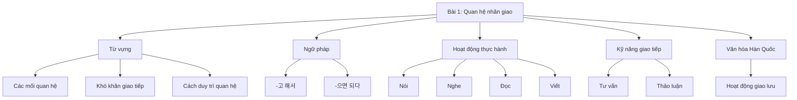
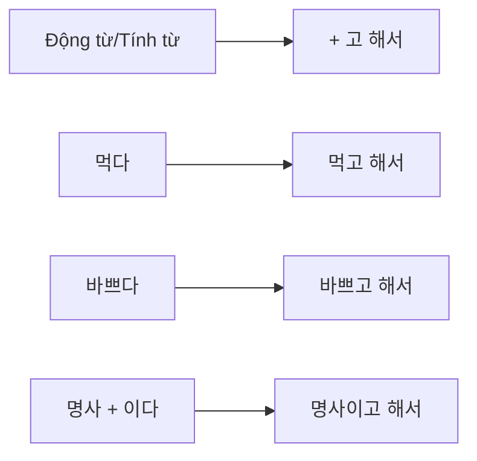
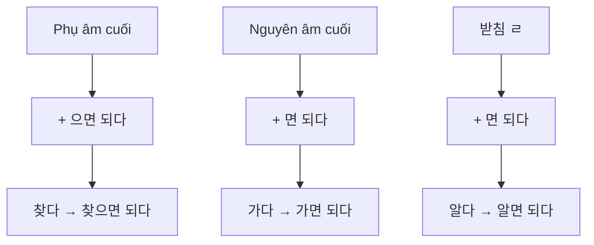
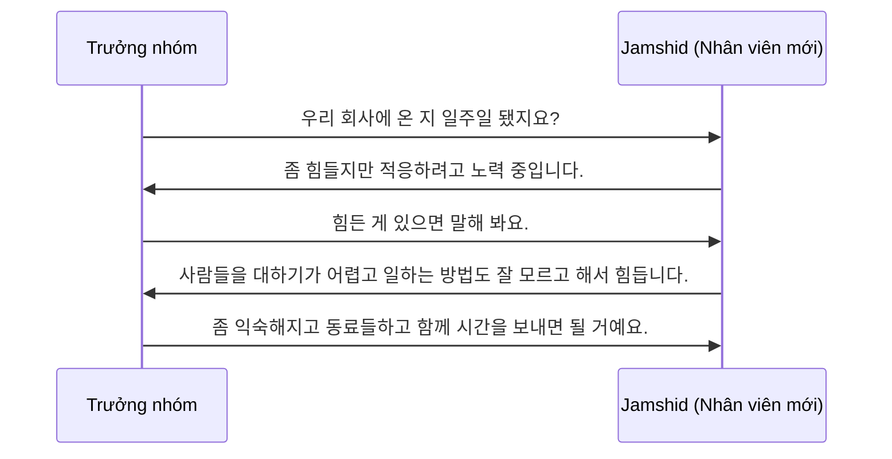
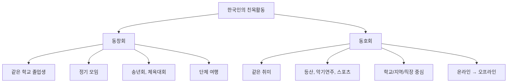

# Bài 1: 대인관계 (Quan hệ nhân giao)

---

### 🎯 Mục tiêu bài học

Sau khi hoàn thành bài học này, học viên sẽ có thể:

- Sử dụng từ vựng liên quan đến các mối quan hệ xã hội
- Vận dụng ngữ pháp **-고 해서** và **-으면 되다**
- Thảo luận về những khó khăn trong quan hệ nhân giao
- Đưa ra lời khuyên cho các vấn đề quan hệ xã hội
- Viết bài văn tư vấn về quan hệ nhân giao

---

### 📊 Cấu trúc bài học

---

## 📚 PHẦN 1: TỪ VỰNG

### 1.1 Các loại quan hệ xã hội

| Tiếng Hàn | Tiếng Việt                  | Ví dụ                                     |
| --------- | --------------------------- | ----------------------------------------- |
| 친구      | bạn bè                      | 오랜 친구 (bạn lâu năm)                   |
| 동창      | bạn cùng trường             | 고등학교 동창 (bạn cùng trường cấp 3)     |
| 선배      | tiền bối, anh/chị khóa trên | 회사 선배 (tiền bối trong công ty)        |
| 후배      | hậu bối, em khóa dưới       | 대학교 후배 (em khóa dưới đại học)        |
| 상사      | cấp trên                    | 직장 상사 (cấp trên tại công ty)          |
| 동료      | đồng nghiệp                 | 믿을 만한 동료 (đồng nghiệp đáng tin cậy) |
| 부하직원  | cấp dưới                    | 유능한 부하직원 (cấp dưới có năng lực)    |

### 1.2 Các vấn đề trong quan hệ nhân giao

| Vấn đề           | Tiếng Hàn       | Giải thích                            |
| ---------------- | --------------- | ------------------------------------- |
| Thiếu điểm chung | 공감대가 없다   | Không có sự đồng cảm, hiểu biết chung |
| Xa cách          | 사이가 멀어지다 | Mối quan hệ trở nên xa cách           |
| Mất liên lạc     | 연락이 끊기다   | Không còn liên lạc với nhau           |
| Khó tiếp xúc     | 대하기 어렵다   | Khó khăn trong việc giao tiếp         |
| Ngại ngùng       | 어려워하다      | Cảm thấy ngại ngùng, không tự nhiên   |
| Khó từ chối      | 거절하기 힘들다 | Khó khăn trong việc từ chối yêu cầu   |

### 1.3 Cách duy trì quan hệ tốt

| Tiếng Hàn              | Tiếng Việt              | Cách thực hiện                       |
| ---------------------- | ----------------------- | ------------------------------------ |
| 자주 연락을 주고받다   | Thường xuyên liên lạc   | Gọi điện, nhắn tin, gặp mặt          |
| 이야기를 잘 들어 주다  | Lắng nghe tốt           | Chú ý, thấu hiểu khi đối phương nói  |
| 의견을 솔직하게 말하다 | Nói thẳng thắn ý kiến   | Chia sẻ suy nghĩ một cách chân thành |
| 서로 예의를 지키다     | Giữ phép lịch sự        | Tôn trọng và lịch thiệp với nhau     |
| 공감을 잘해주다        | Thể hiện sự đồng cảm    | Hiểu và chia sẻ cảm xúc              |
| 함께 시간을 보내다     | Dành thời gian bên nhau | Tham gia hoạt động chung             |

---

## 📝 PHẦN 2: NGỮ PHÁP

### 2.1 Ngữ pháp: **-고 해서**

#### Định nghĩa

Cấu trúc **-고 해서** được sử dụng để chỉ ra rằng nội dung phía trước là một trong những lý do của tình huống phía sau.

#### Cách chia

| Loại từ | Công thức     | Ví dụ                          |
| ------- | ------------- | ------------------------------ |
| Động từ | V + 고 해서   | 먹고 해서, 가고 해서           |
| Tính từ | A + 고 해서   | 바쁘고 해서, 좋고 해서         |
| Danh từ | N + 이고 해서 | 학생이고 해서, 외국인이고 해서 |

#### Ví dụ minh họa

**Ví dụ 1:**

- **한국어:** 서로 공감대도 없고 바쁘고 해서 친해지기가 어려워요.
- **Tiếng Việt:** Vì không có điểm chung và lại bận rộn nên khó thân thiết được.

**Ví dụ 2:**

- **한국어:** 조금 전에 샌드위치도 먹고 해서 그냥 사무실에 있으려고요.
- **Tiếng Việt:** Vì vừa ăn sandwich rồi nên tôi định ở lại văn phòng thôi.

**Ví dụ 3:**

- **한국어:** 상사 지시를 거절하기도 힘들고 일하는 방법도 잘 모르고 해서 직장 생활이 힘들어요.
- **Tiếng Việt:** Vì khó từ chối chỉ thị của cấp trên và cũng không biết cách làm việc nên cuộc sống công sở thật khó khăn.

### 2.2 Ngữ pháp: **-으면 되다**

#### Định nghĩa

Cấu trúc **-으면 되다** được sử dụng để biểu thị điều kiện đủ để thực hiện một việc gì đó, tương đương với "chỉ cần... là được".

#### Cách chia

| Trường hợp              | Công thức     | Ví dụ                    |
| ----------------------- | ------------- | ------------------------ |
| Có phụ âm cuối (trừ ㄹ) | + 으면 되다   | 찾으면 되다, 읽으면 되다 |
| Có nguyên âm cuối       | + 면 되다     | 가면 되다, 크면 되다     |
| Có phụ âm ㄹ            | + 면 되다     | 알면 되다, 살면 되다     |
| Danh từ + 이다          | 명사이면 되다 | 학생이면 되다            |

#### Ví dụ minh họa

**Tình huống hỏi đáp:**

- **A:** 찾으시는 휴대전화 있으세요? (Có điện thoại di động mà anh/chị cần không?)
- **B:** 기능이 다양하고 속도가 빠르면 돼요. (Chỉ cần đa chức năng và tốc độ nhanh là được.)

**Lời khuyên:**

- **한국어:** 웃으면서 먼저 인사하고 서로 예의를 지키면 돼요.
- **Tiếng Việt:** Chỉ cần mỉm cười chào trước và giữ phép lịch sự với nhau là được.

---

## 🗣️ PHẦN 3: HOẠT ĐỘNG THỰC HÀNH

### 3.1 Luyện tập ngữ pháp **-고 해서**

#### Bài tập 1: Diễn tả khó khăn trong quan hệ

**Mô hình:** 대인 관계에서 어려운 점이 있어요?

**Ví dụ mẫu:**
고향 친구와 자주 못 만나고 연락도 자주 못하고 해서 사이가 멀어졌어요.
_(Vì không thể gặp bạn quê thường xuyên và cũng không liên lạc nhiều nên quan hệ xa cách.)_

**Thực hành:**

| Tình huống                                    | Câu trả lời mẫu                                                      |
| --------------------------------------------- | -------------------------------------------------------------------- |
| 새로 사귄 친구: 성격이 다르다 + 공감대가 없다 | 새로 사귄 친구와 성격도 다르고 공감대도 없고 해서 친해지기 어려워요. |
| 학교 선배: 대하기 어렵다 + 한국어가 부족하다  | 학교에서 선배를 대하기도 어렵고 한국어도 부족하고 해서 힘들어요.     |
| 외국 친구: 언어가 다르다 + 문화가 다르다      | 외국 친구와 언어도 다르고 문화도 다르고 해서 소통이 어려워요.        |

### 3.2 Luyện tập ngữ pháp **-으면 되다**

#### Bài tập 2: Đưa ra lời khuyên

**Mô델:** 어떻게 하면 좋을까요?

| Vấn đề                               | Lời khuyên                                            |
| ------------------------------------ | ----------------------------------------------------- |
| 부부가 사이좋게 지내려면?            | 서로 관심을 갖고 상대방의 이야기를 잘 들어 주면 돼요. |
| 친구를 위로하는 방법?                | 공감해 주고 같이 고민해 주면 돼요.                    |
| 선배와 친하게 지내는 방법?           | 인사를 잘하고 예의를 지키면서 말하면 돼요.            |
| 직장 동료와 의견 차이를 줄이는 방법? | 의견을 솔직하게 말하고 조금씩 양보하면 돼요.          |

---

## 👂 PHẦN 4: LUYỆN NGHE

### 4.1 Bài nghe 1: Đối화giữa bố và con trai

🔊 **[Audio 1-L.mp3]** _(File âm thanh sẽ được bổ sung)_

**Nội dung:** 고천 씨가 아들 성민과 이야기합니다.

#### Câu hỏi 1: Đúng (○) hay Sai (✗)?

1. 성민은 새 학교에서 친구들을 많이 사귀었다. ( )
2. 성민은 주변에 앉은 친구들과 내일 약속이 있다. ( )
3. 성민의 친구들은 중국에 관심이 많아서 질문이 많다. ( )

#### Câu hỏi 2: Lời khuyên nào KHÔNG được đề cập?

- ① "친구들 이야기를 잘 들어 주면 된다."
- ② "친구들하고 함께 시간을 보내면 된다."
- ③ "친구들하고 싸우지 말고 사이좋게 지내야 한다."
- ④ "중국에 대해서 친구들에게 많이 이야기해 주면 좋다."

#### Câu hỏi 3: Tại sao bạn bè của 성민 hay hỏi về Trung Quốc?

### 4.2 Luyện phát âm

🔊 **[Audio 1-P.mp3]** _(File âm thanh sẽ được bổ sung)_

**Quy tắc phát âm [ㅇ] + [ㄴ]:**

- 강릉 [강능]
- 대통령 [대통녕]

**Thực hành:**

1. 직장 동료와 사이가 멀어졌어요.
2. 동호회에서 강릉에 가기로 했어요.
3. 대통령의 말씀이 있겠습니다.

---

## 👥 PHẦN 5: HOẠT ĐỘNG GIAO TIẾP

### 5.1 Đối thoại mẫu: Tư vấn tại công ty

**Từ vựng hỗ trợ:**

- 적응하다: thích nghi
- 노력 중이다: đang cố gắng
- 익숙해지다: trở nên quen thuộc

### 5.2 Tình huống thực hành

**Tình huống 1:** 일하는 방법을 잘 모르다 + 동료들하고 함께 시간을 보내다

**Tình huống 2:** 공감대가 없다 + 서로에게 관심을 갖고 이야기를 잘 들어 주다

---

## 📖 PHẦN 6: LUYỆN ĐỌC

### 6.1 Khó khăn của người nước ngoài tại Hàn Quốc

**Checklist khó khăn:**

- □ 문화가 다르다 (Văn hóa khác nhau)
- □ 편견을 갖고 있다 (Có thành kiến)
- □ 생활방식이 다르다 (Lối sống khác nhau)
- □ 높임말 사용이 어렵다 (Khó sử dụng kính ngữ)
- □ 무슨 말을 어떻게 해야 하는지 잘 모르겠다 (Không biết nói gì, nói như thế nào)

### 6.2 Bài đọc: Tư vấn trên diễn đàn

**Đề bài:** 직장 선배들과 잘 지내고 싶어요.

**Nội dung chính:**

- Người viết: Người Việt Nam, đã ở Hàn 1 năm
- Vấn đề: Chuyển công ty mới, đồng nghiệp là người Hàn lớn tuổi
- Khó khăn: Sử dụng kính ngữ, thể hiện ý định chính xác

**Câu hỏi:**

1. **Người này khó khăn về điều gì?**

2. **Đúng (○) hay Sai (✗):**
   - ① 이 사람은 얼마 전에 회사를 옮겼다. ( )
   - ② 새 직장 선배들의 나이가 많아서 기분이 나쁘다. ( )
   - ③ 한국어를 배울 때 높임말을 배우지 못했다. ( )

3. **Nội dung nào KHÔNG đúng với bài văn:**
   - ① 이 사람은 1년 전에 한국에 왔다.
   - ② 새로 간 직장에는 한국 사람이 많다.
   - ③ 이 사람은 요즘 선배들과 대화를 많이 하려고 한다.
   - ④ 이 사람은 대화할 때 의도를 정확하게 표현하기 힘들어한다.

---

## ✍️ PHẦN 7: LUYỆN VIẾT

### 7.1 Bài viết 1: Chia sẻ kinh nghiệm

**Chủ đề:** 여러분은 한국인과의 관계에서 어려운 점이 있었습니까? 어려운 점을 어떻게 극복했는지 써 보세요.

**Bảng lập dàn ý:**

| 한국인과의 관계에서 어려운 점 | 극복방법          |
| ----------------------------- | ----------------- |
| (Khó khăn gặp phải)           | (Cách giải quyết) |
|                               |                   |

### 7.2 Bài viết 2: Tư vấn cho người mới

**Chủ đề:** 한국에 온 지 얼마 안 된 이민자 후배에게 한국인 친구를 잘 사귀는 방법에 대해서 조언하는 글을 써 보세요.

**Cấu trúc gợi ý:**

1. **들어가는 말:** Giới thiệu vấn đề
2. **본문:** Đưa ra 3-4 lời khuyên cụ thể
3. **맺는 말:** Động viên, khuyến khích

---

## 🏛️ PHẦN 8: VĂN HÓA VÀ THÔNG TIN

### 8.1 Hoạt động giao lưu của người Hàn

#### 동창회 (Hội đồng môn)

- **Định nghĩa:** Hội của những người cùng trường
- **Hoạt động:**
  - 송년회 (tiệc cuối năm)
  - 체육대회 (hội thao)
  - 단체 여행 (du lịch tập thể)

#### 동호회 (Câu lạc bộ sở thích)

- **Định nghĩa:** Nhóm người có cùng sở thích
- **Các loại:** 등산 (leo núi), 악기연주 (chơi nhạc cụ), 스포츠 (thể thao)
- **Lợi ích:**
  - 취미 활동 (hoạt động sở thích)
  - 정보 수집 (thu thập thông tin)
  - 새로운 사람들과 사귀기 (làm quen người mới)

### 8.2 Câu hỏi thảo luận

1. **동창회는 어떤 모임입니까?**
2. **동호회에 가입하면 어떤 점이 좋습니까?**
3. **여러분 고향에는 어떤 모임이 있습니까?**

---

## 🎯 Bài tập đa dạng - Quan hệ nhân giao

<MultiChoiceQuiz
title="Bài tập Quan hệ nhân giao - Đa dạng câu hỏi"
questions={[
{
id: 1,
type: "fill-in-blank",
question: "Điền từ thích hợp vào chỗ trống:\n새로 사귄 친구와 성격도 다르고 **\_\_\_**도 없고 해서 친해지기 어려워요.",
options: [
"공감대",
"관심사",
"취미",
"시간"
],
correctAnswer: 0,
explanation: "'공감대가 없다' (không có điểm chung) là từ vựng chính trong bài học về khó khăn trong quan hệ nhân giao."
},
{
id: 2,
type: "dialogue-completion",
question: "Hoàn thành hội thoại sau:\nA: 새 직장에서 어떻게 지내세요?\nB: 조금 힘들어요. 동료들을 **\_\_\_** 어렵고 일하는 방법도 잘 모르고 해서요.\nA: 그럼 동료들하고 **\_\_\_** 시간을 보내면 될 거예요.",
options: [
"대하기 / 함께",
"만나기 / 많은",
"보기 / 좋은",
"알기 / 적은"
],
correctAnswer: 0,
explanation: "'대하기 어렵다' (khó tiếp xúc) và '함께 시간을 보내다' (dành thời gian cùng nhau) là các cấu trúc quan trọng trong bài."
},
{
id: 3,
type: "reading-comprehension",
question: "Đọc đoạn văn sau và trả lời câu hỏi:\n\n민수는 한국에 온 지 6개월이 됐다. 처음에는 한국 친구들과 사이가 멀어서 힘들었다. 그런데 요즘은 웃으면서 먼저 인사하고 서로 예의를 지키면서 많이 친해졌다.\n\n민수가 한국 친구들과 친해진 방법은?",
options: [
"같은 취미를 찾아서",
"웃으면서 인사하고 예의를 지켜서",
"한국어를 열심히 공부해서",
"자주 선물을 줘서"
],
correctAnswer: 1,
explanation: "본문에서 민수는 '웃으면서 먼저 인사하고 서로 예의를 지키면서' 친해졌다고 명시되어 있습니다."
},
{
id: 4,
type: "sentence-ordering",
question: "다음 문장을 올바른 순서로 배열하세요:\n①함께 시간을 보내면 될 거예요\n②동료들하고\n③좀 익숙해지고\n④그럼",
options: [
"④-③-②-①",
"②-③-④-①",
"③-②-④-①",
"④-②-③-①"
],
correctAnswer: 0,
explanation: "올바른 순서: '그럼 좀 익숙해지고 동료들하고 함께 시간을 보내면 될 거예요.' - 조언을 주는 완전한 문장입니다."
},
{
id: 5,
question: "'서로 공감대도 없고 바쁘고 해서 친해지기가 어려워요.' 여기서 '-고 해서'의 기능은?",
options: [
"시간 순서 표현",
"여러 이유 제시",
"조건 표현",
"대조 표현"
],
correctAnswer: 1,
explanation: "'-고 해서'는 여러 개의 이유나 원인을 나열할 때 사용하는 문법입니다."
},
{
id: 6,
type: "fill-in-blank",
question: "다음 조언에서 빈칸을 채우세요:\n선배와 친하게 지내려면 인사를 잘하고 **\_\_**을 지키면서 말하면 돼요.",
options: [
"예의",
"시간",
"약속",
"거리"
],
correctAnswer: 0,
explanation: "'예의를 지키다' (giữ phép lịch sự) là cách quan trọng để duy trì mối quan hệ tốt với tiền bối."
},
{
id: 7,
type: "dialogue-completion",
question: "대화를 완성하세요:\nA: 직장 생활이 어떠세요?\nB: 상사 지시를 **\_\_**하기도 힘들고 일하는 방법도 잘 모르고 해서 힘들어요.\nA: 조금씩 **\_\_\_**하시면 괜찮아질 거예요.",
options: [
"거절 / 적응",
"이해 / 공부",
"받아들이기 / 노력",
"따르기 / 발전"
],
correctAnswer: 0,
explanation: "'거절하기 힘들다' (khó từ chối)와 '적응하다' (thích nghi) là từ vựng chính trong bài về khó khăn công sở."
},
{
id: 8,
type: "reading-comprehension",
question: "다음 글을 읽고 답하세요:\n\n동창회는 같은 학교를 졸업한 사람들의 모임이다. 송년회, 체육대회, 단체 여행 등의 활동을 한다. 동호회는 같은 취미를 가진 사람들의 모임으로 등산, 악기연주, 스포츠 등을 함께 한다.\n\n동창회와 동호회의 공통점은?",
options: [
"같은 학교 출신이어야 함",
"같은 취미가 있어야 함",
"사람들이 모여서 활동함",
"체육대회를 반드시 함"
],
correctAnswer: 2,
explanation: "동창회와 동호회 모두 사람들이 모여서 다양한 활동을 하는 '모임'이라는 공통점이 있습니다."
},
{
id: 9,
type: "sentence-ordering",
question: "문장 순서를 맞추세요:\n①이야기를 잘 들어 주고\n②친구들과 사이좋게 지내려면\n③서로 관심을 가져야 해요\n④먼저",
options: [
"②-④-①-③",
"④-②-①-③",
"②-①-④-③",
"④-①-②-③"
],
correctAnswer: 0,
explanation: "'친구들과 사이좋게 지내려면 먼저 이야기를 잘 들어 주고 서로 관심을 가져야 해요.' - 조건과 방법을 제시하는 완전한 문장입니다."
},
{
id: 10,
question: "'-으면 되다' 구조를 사용한 문장은?",
options: [
"친구가 되고 싶어요",
"웃으면서 인사하면 돼요",
"관계가 좋아졌어요",
"함께 시간을 보냈어요"
],
correctAnswer: 1,
explanation: "'웃으면서 인사하면 돼요'에서 '-으면 되다'는 '조건+되다'의 형태로 '~하면 충분하다'는 의미를 나타냅니다."
}
]}
/>

---

## 📋 PHẦN 9: KIỂM TRA TỪ VỰNG

### Bảng từ vựng tổng hợp

| STT | Tiếng Hàn       | Tiếng Việt            | Ghi chú |
| --- | --------------- | --------------------- | ------- |
| 1   | 공감대가 없다   | không có điểm chung   |         |
| 2   | 관심을 갖다     | quan tâm              |         |
| 3   | 사이가 멀어지다 | xa cách nhau          |         |
| 4   | 사이좋다        | thân thiết, hòa thuận |         |
| 5   | 연락이 끊기다   | mất liên lạc          |         |
| 6   | 위로            | an ủi                 |         |
| 7   | 선배            | tiền bối              |         |
| 8   | 대하다          | đối xử, tiếp xúc      |         |
| 9   | 후배            | hậu bối               |         |
| 10  | 상사            | cấp trên              |         |

**Cách sử dụng:**

- ☐ Đánh dấu những từ đã thuộc
- ☐ Luyện tập những từ chưa thuộc
- ☐ Tạo câu với từ vựng mới

---

## 📚 TÀI LIỆU THAM KHAO

### Các cấu trúc ngữ pháp trong bài

| Ngữ pháp   | Chức năng                     | Ví dụ                  |
| ---------- | ----------------------------- | ---------------------- |
| -고 해서   | Nêu lý do (nhiều nguyên nhân) | 바쁘고 해서 못 갔어요. |
| -으면 되다 | Điều kiện đủ                  | 열심히 하면 돼요.      |

### Chủ đề liên quan

- **다음 과:** 취미와 여가 (Sở thích và giải trí)
- **관련 주제:** 직장 생활 (Cuộc sống công sở), 한국 문화 (Văn hóa Hàn Quốc)

---

_Giáo trình được biên soạn dựa trên chương trình KIIP (Korea Immigration & Integration Program) dành cho người nước ngoài sinh sống tại Hàn Quốc, phù hợp với trình độ Trung cấp 1._
