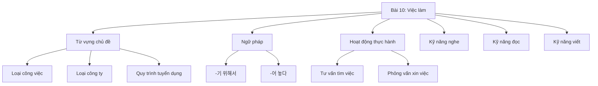
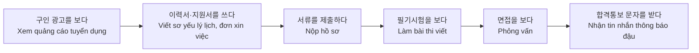
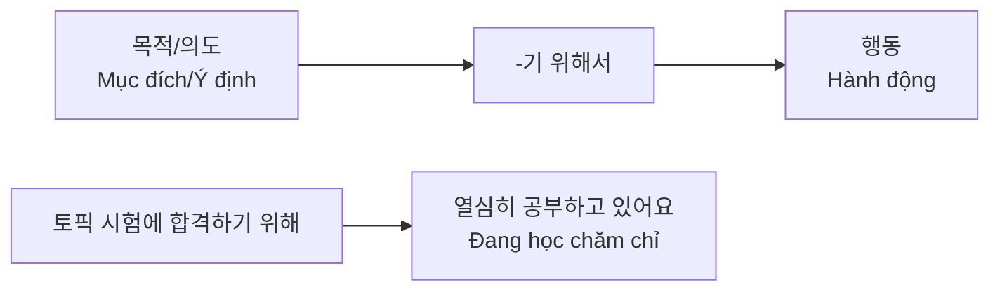
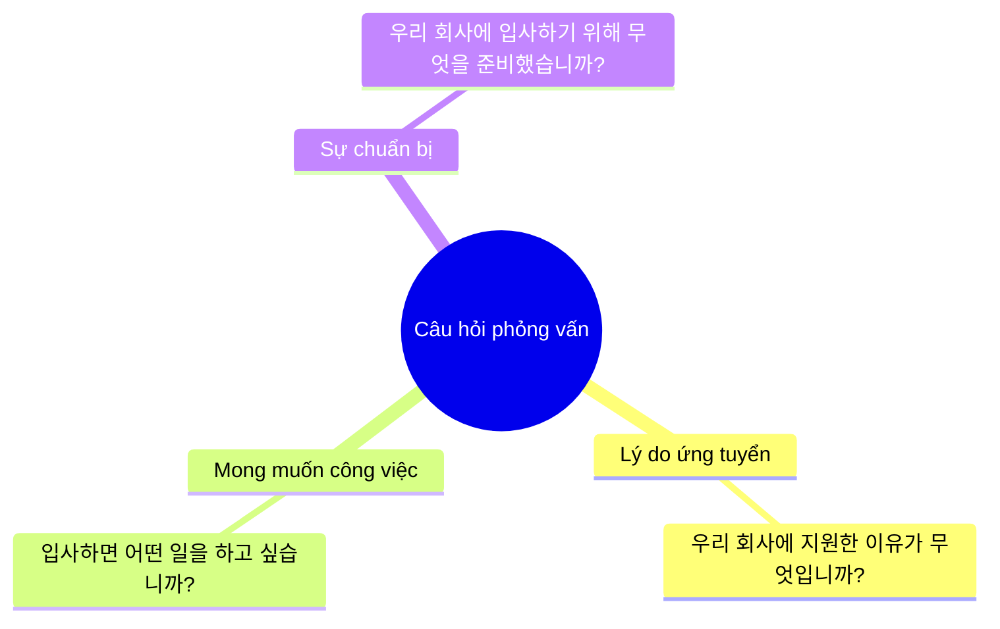
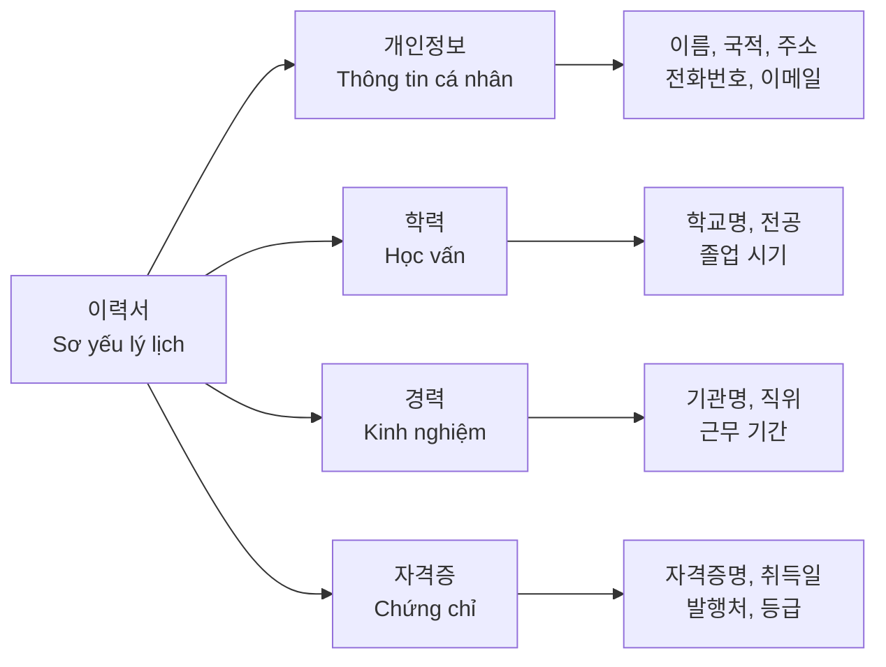
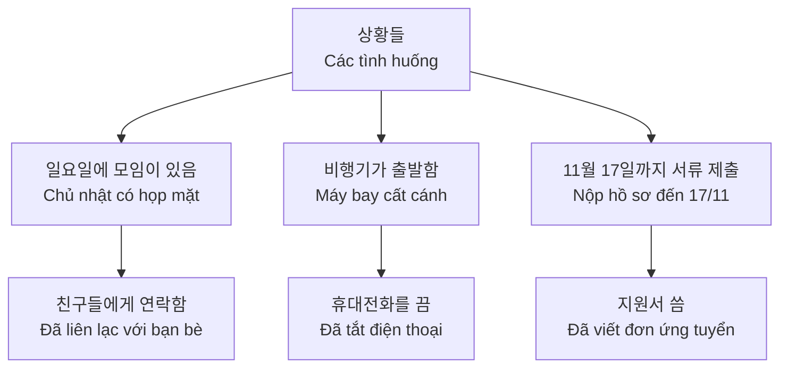

# Bài 10: Việc làm (취업)
*Giáo trình tiếng Hàn trung cấp 1 dành cho người Việt Nam*

---

## 📚 Mục tiêu bài học

<h3 className="text-lg font-semibold text-blue-700 mb-2">Sau khi hoàn thành bài học này, học viên sẽ có thể:</h3>
<ul className="list-disc list-inside space-y-1 text-gray-700">
<li>Sử dụng từ vựng liên quan đến việc làm và tuyển dụng</li>
<li>Áp dụng ngữ pháp -기 위해서 và -어 놓다 trong giao tiếp</li>
<li>Tư vấn về hoạt động tìm việc làm</li>
<li>Viết sơ yếu lý lịch bằng tiếng Hàn</li>
<li>Hiểu về lương và thuế tại Hàn Quốc</li>
</ul>

---

## 🎯 Cấu trúc bài học

---

## 📖 I. TỪ VỰNG (어휘)

### 1. Loại công việc mong muốn

<h4 className="font-semibold text-green-700 mb-3">💼 Các loại công việc phổ biến</h4>

| Tiếng Hàn | Tiếng Việt |
|------------|------------|
| 학원강사 | Giảng viên học viện |
| 다문화 언어강사 | Giảng viên ngôn ngữ đa văn hóa |
| 편의점 아르바이트 | Làm thêm tại cửa hàng tiện lợi |
| 시간제로 할 수 있는 일 | Công việc làm theo giờ |
| 사업하다 | Kinh doanh |
| 가게를 차리다 | Mở cửa hàng |
| 통역이나 번역 일을 하다 | Làm việc thông dịch hoặc phiên dịch |
| 전문성 있는 일을 하다 | Làm công việc chuyên môn |

<h4 className="font-semibold text-blue-700 mb-3">🏢 Loại công ty mong muốn</h4>

| Tiếng Hàn | Tiếng Việt |
|------------|------------|
| 안정적인 회사 | Công ty ổn định |
| 근무 환경이 좋은 회사 | Công ty có môi trường làm việc tốt |
| 월급을 많이 주는 회사 | Công ty trả lương cao |
| 출퇴근이 자유로운 회사 | Công ty linh hoạt về giờ giấc |
| 발전 가능성이 있는 회사 | Công ty có tiềm năng phát triển |
| 사회에 기여할 수 있는 회사 | Công ty có thể đóng góp cho xã hội |
| 자기 계발을 할 수 있는 회사 | Công ty có thể phát triển bản thân |
| 일에 대한 보람을 느낄 수 있는 회사 | Công ty có thể cảm thấy ý nghĩa trong công việc |

### 2. Quy trình tuyển dụng

---

## 📝 II. NGỮ PHÁP (문법)

### 1. Ngữ pháp: -기 위해서 (Để...)

<h4 className="font-semibold text-purple-700 mb-3">📋 Cấu trúc và cách dùng</h4>

**Ý nghĩa:** Diễn tả mục đích hoặc ý định của hành động phía sau

**Cấu trúc:** 
- Động từ + -기 위해서
- 배우다 → 배우기 위해서
- 읽다 → 읽기 위해서  
- 합격하다 → 합격하기 위해서
- 살다 → 살기 위해서

#### Ví dụ minh họa:

| Câu ví dụ | Dịch nghĩa |
|-----------|------------|
| 쓰레기를 줄이기 위해 어떤 노력을 해야 합니까? | Cần nỗ lực như thế nào để giảm rác thải? |
| 한국 국적을 취득하기 위해 1년 전부터 한국어 공부를 하고 있다 | Từ 1 năm trước đã học tiếng Hàn để lấy quốc tịch Hàn Quốc |
| 일하는 엄마들은 아이 맡길 곳을 찾기 위해 노력하고 있다 | Các bà mẹ đi làm đang nỗ lực tìm nơi gửi con |

### 2. Ngữ pháp: -어 놓다 (Làm xong và để đó)

<h4 className="font-semibold text-orange-700 mb-3">📋 Cấu trúc và cách dùng</h4>

**Ý nghĩa:** Diễn tả việc hoàn thành một hành động và duy trì kết quả đó

**Cách chia:**
- Thêm -아 놓다: 사다 → 사 놓다, 찾다 → 찾아 놓다
- Thêm -어 놓다: 쓰다 → 써 놓다, 만들다 → 만들어 놓다  
- Thêm -해 놓다: 준비하다 → 준비해 놓다, 연락하다 → 연락해 놓다

#### Ví dụ minh họa:

| Tình huống | Câu ví dụ | Dịch nghĩa |
|------------|-----------|------------|
| Chuẩn bị trước | 미리 이력서를 써 놓는 것이 좋을 거예요 | Tốt nhất là viết sơ yếu lý lịch trước |
| Hoàn thành và giữ kết quả | 오늘 친구들과 등산을 가기로 했다. 그래서 아침 일찍 샌드위치를 만들어 놓았다 | Hôm nay đã hẹn đi leo núi với bạn bè. Vì vậy sáng sớm đã làm bánh sandwich sẵn |
| Yên tâm sau khi hoàn thành | 숙제를 미리 해 놓아서 마음이 편하다 | Vì đã làm bài tập trước nên yên tâm |

---

## 🗣️ III. HOẠT ĐỘNG THỰC HÀNH (활동)

### 1. Tư vấn về việc tìm kiếm công việc

<h4 className="font-semibold mb-3">🎯 Mẫu hội thoại tư vấn tìm việc</h4>

**🔊 [Audio 3-10]** *Đường dẫn file nghe sẽ được bổ sung*

**라흐만:** 아나이스 씨는 무슨 일을 하고 싶어요?  
**아나이스:** 네, 저는 무역 회사에 취직하고 싶어요.  
**라흐만:** 아, 그러세요? 아나이스 씨는 한국말을 어느 정도 할 수 있으니까 문제없을 거예요.  
**아나이스:** 그런데 한국에서 일하기 위해서 무엇이 필요해요?  
**라흐만:** 무역 회사에 취직하려면 컴퓨터를 할 줄 알아야 해요. 그러니까 이력서를 정성껏 쓰고 컴퓨터 자격증도 미리 따 놓으세요.  
**아나이스:** 네, 그럴게요.

**Bản dịch:**  
**Rahmaan:** Chị Anaïs muốn làm công việc gì?  
**Anaïs:** Vâng, tôi muốn làm việc tại công ty thương mại.  
**Rahmaan:** À, thế à? Chị Anaïs có thể nói tiếng Hàn ở mức độ nào đó nên sẽ không có vấn đề gì.  
**Anaïs:** Nhưng để làm việc tại Hàn Quốc thì cần gì?  
**Rahmaan:** Để làm việc tại công ty thương mại thì phải biết sử dụng máy tính. Vì vậy hãy viết sơ yếu lý lịch một cách tỉ mỉ và lấy chứng chỉ máy tính trước.  
**Anaïs:** Vâng, tôi sẽ làm như vậy.

### 2. Bài tập thực hành tư vấn

| Tình huống | Người tìm việc | Người tư vấn |
|------------|----------------|--------------|
| **Trường tiểu học - Giảng viên ngôn ngữ đa văn hóa** | Muốn dạy tiếng mẹ đẻ | Phải tham gia khóa đào tạo giáo dục |
| **Học viện - Dạy tiếng Anh** | Muốn dạy tiếng Anh | Phải chuẩn bị tốt cho buổi phỏng vấn |

---

## 👂 IV. KỸ NĂNG NGHE (듣기)

### Bài nghe: Buổi phỏng vấn của Anna

<h4 className="font-semibold text-green-700 mb-3">🔊 Trước khi nghe</h4>

**[Audio 10-L.mp3]** *Đường dẫn file nghe sẽ được bổ sung*

**Câu hỏi thảo luận:**
- Bạn đã từng có kinh nghiệm phỏng vấn chưa?
- Thường thì người phỏng vấn sẽ hỏi những câu hỏi gì?

### Câu hỏi phỏng vấn thường gặp:

### Bài tập nghe hiểu:

**1) Anna đã ứng tuyển vì lý do gì?**

**2) Đánh dấu ○ nếu đúng, X nếu sai:**
- ① Anna chưa từng có kinh nghiệm dạy học sinh ( )
- ② Anna đang chuẩn bị để lấy chứng chỉ ( )  
- ③ Anna đã hẹn gặp người phỏng vấn sau một tuần ( )

---

## 📖 V. KỸ NĂNG ĐỌC (읽기)

### 1. Thông tin tuyển dụng

<h4 className="font-semibold text-blue-700 mb-3">📋 Mẫu thông báo tuyển dụng 1</h4>

**외국인 영어교사를 모십니다**

| Hạng mục | Nội dung |
|----------|-----------|
| **모집 분야** | 방과 후 영어 교사 |
| **모집 인원** | 2명 |
| **지원 자격** | 대졸(영어 전공) |
| **제출 서류** | 이력서, 여권 사본 |

※ 궁금한 점은 ○○중학교(032-289-1234)로 문의하세요.

<h4 className="font-semibold text-green-700 mb-3">📋 Mẫu thông báo tuyển dụng 2</h4>

**아르바이트직원구함**

| Hạng mục | Nội dung |
|----------|-----------|
| **업무** | 사무용품 배송 |
| **인원** | ○명 |
| **자격** | 고졸, 운전면허증 소지자 |
| **근무 시간** | 월~금 14:00~19:00 |
| **제출 서류** | 이력서 |
| **지원 방법** | 온라인 접수 |

- **Email:** stationeryshop@moj.co.kr
- **문의:** (주)사무나라(02-123-4567)

### 2. Phân tích hồ sơ ứng viên

#### Ứng viên cho vị trí giáo viên tiếng Anh:

| Ứng viên | Thông tin | Phù hợp? |
|----------|-----------|----------|
| **마이클 (25세)** | • 대졸(음악 전공) • 학원영어 강사 경력 3년 | ❌ (Không đúng chuyên ngành) |
| **마리 (23세)** | • 대졸(영어영문학 전공) • 경력 없음 | ✅ (Đúng chuyên ngành) |

#### Ứng viên cho vị trí giao hàng văn phòng phẩm:

| Ứng viên | Thông tin | Phù hợp? |
|----------|-----------|----------|
| **자말 (30세)** | • 고졸 • 택배 기사 경력 1년 • 운전면허증 있음 | ✅ (Đầy đủ điều kiện) |
| **소천 (28세)** | • 고졸 • 백화점판매사원으로 10년 근무 | ❌ (Không có bằng lái) |

---

## ✍️ VI. KỸ NĂNG VIẾT (쓰기)

### 1. Thành phần của sơ yếu lý lịch

<h4 className="font-semibold text-blue-800 mb-4">📄 Các thông tin cần có trong sơ yếu lý lịch</h4>

### 2. Mẫu sơ yếu lý lịch chuẩn

<h4 className="font-bold text-center text-lg">이력서 (SƠ YẾU LÝ LỊCH)</h4>

<table className="w-full">
<tbody>
<tr className="border-b">
<td className="bg-gray-100 px-3 py-2 font-semibold w-20">이름 (영문)</td>
<td className="px-3 py-2"></td>
<td className="bg-gray-100 px-3 py-2 font-semibold w-20">국적</td>
<td className="px-3 py-2"></td>
</tr>
<tr className="border-b">
<td className="bg-gray-100 px-3 py-2 font-semibold">전화번호</td>
<td className="px-3 py-2"></td>
<td className="bg-gray-100 px-3 py-2 font-semibold">휴대전화</td>
<td className="px-3 py-2"></td>
</tr>
<tr className="border-b">
<td className="bg-gray-100 px-3 py-2 font-semibold">여권번호</td>
<td className="px-3 py-2"></td>
<td className="bg-gray-100 px-3 py-2 font-semibold">E-mail</td>
<td className="px-3 py-2"></td>
</tr>
<tr className="border-b">
<td className="bg-gray-100 px-3 py-2 font-semibold">주소</td>
<td className="px-3 py-2" colSpan="3">예: 경기도 의정부시 동일로 150 102동 1205호</td>
</tr>
</tbody>
</table>

<h5 className="font-semibold mb-2">📚 학력 (Học vấn)</h5>
<table className="w-full border">
<thead>
<tr className="bg-gray-100">
<th className="border px-3 py-2">기간</th>
<th className="border px-3 py-2">학교명 및 전공</th>
<th className="border px-3 py-2">구분</th>
</tr>
</thead>
<tbody>
<tr>
<td className="border px-3 py-2">2011. 3.~2014. 2.</td>
<td className="border px-3 py-2">다카고등학교</td>
<td className="border px-3 py-2">졸업</td>
</tr>
</tbody>
</table>

<h5 className="font-semibold mb-2">💼 경력 (Kinh nghiệm làm việc)</h5>
<table className="w-full border">
<thead>
<tr className="bg-gray-100">
<th className="border px-3 py-2">기간</th>
<th className="border px-3 py-2">기관명</th>
<th className="border px-3 py-2">직위</th>
<th className="border px-3 py-2">비고</th>
</tr>
</thead>
<tbody>
<tr>
<td className="border px-3 py-2">2018.1.~현재</td>
<td className="border px-3 py-2">케이 코스메틱주식회사</td>
<td className="border px-3 py-2">사원</td>
<td className="border px-3 py-2"></td>
</tr>
</tbody>
</table>

<h5 className="font-semibold mb-2">🏆 자격증 (Chứng chỉ)</h5>
<table className="w-full border">
<thead>
<tr className="bg-gray-100">
<th className="border px-3 py-2">취득일</th>
<th className="border px-3 py-2">자격증/면허증</th>
<th className="border px-3 py-2">등급</th>
<th className="border px-3 py-2">발행처</th>
</tr>
</thead>
<tbody>
<tr>
<td className="border px-3 py-2"></td>
<td className="border px-3 py-2"></td>
<td className="border px-3 py-2"></td>
<td className="border px-3 py-2"></td>
</tr>
</tbody>
</table>

위에 기재한 사항은 사실과 틀림이 없습니다.

____년 ____월 ____일
성명: ______________ (인)

---

## 🎯 VII. PHÁT ÂM (발음)

### Quy tắc phát âm: Âm cuối + Âm đầu

<h4 className="font-semibold text-red-700 mb-3">🔊 Bài tập phát âm</h4>

**[Audio 10-P.mp3]** *Đường dẫn file nghe sẽ được bổ sung*

| Quy tắc | Từ gốc | Cách phát âm | Ví dụ câu |
|---------|---------|-------------|-----------|
| ㄱ,ㄷ,ㅂ,ㅅ,ㅈ → [ㄲ,ㄸ,ㅃ,ㅆ,ㅉ] | 자격증 | [자격쯩] | 교사 자격증을 땄습니다 |
| | 이력서 | [이력써] | 이력서를 어떻게 써야 돼요? |
| | 경력 증명서 | [경녁 쯩명서] | 경력 증명서를 제출해 주세요 |

---

## 🌟 VIII. VĂN HÓA VÀ THÔNG TIN (문화와 정보)

### Lương và thuế tại Hàn Quốc

<h4 className="font-semibold text-yellow-700 mb-2">💰 Thông tin về lương và thuế</h4>

Tại Hàn Quốc, người lao động phải đóng các loại thuế và bảo hiểm xã hội như thuế thu nhập cá nhân, bảo hiểm y tế quốc gia, bảo hiểm việc làm, v.v. Mức lương tối thiểu được điều chỉnh hàng năm theo quy định của chính phủ.

### Các loại hồ sơ cần thiết khi xin việc

<h5 className="font-semibold text-blue-700 mb-2">📄 서류 (Hồ sơ)</h5>
<ul className="text-sm space-y-1">
<li>• 지원서 (Đơn xin việc)</li>
<li>• 이력서 (Sơ yếu lý lịch)</li>
<li>• 자기소개서 (Thư giới thiệu bản thân)</li>
</ul>

<h5 className="font-semibold text-green-700 mb-2">📜 각종 증명서 (Các loại giấy tờ chứng minh)</h5>
<ul className="text-sm space-y-1">
<li>• 졸업증명서 (Bằng tốt nghiệp)</li>
<li>• 경력증명서 (Giấy chứng nhận kinh nghiệm)</li>
<li>• 가족관계증명서 (Giấy quan hệ gia đình)</li>
<li>• 성적증명서 (Bảng điểm)</li>
</ul>

<h5 className="font-semibold text-purple-700 mb-2">🆔 신분증 사본 & 자격증 (Bản sao giấy tờ tùy thân & Chứng chỉ)</h5>
<ul className="text-sm space-y-1">
<li>• 여권 사본 (Bản sao hộ chiếu)</li>
<li>• 외국인등록증 사본 (Bản sao thẻ đăng ký người nước ngoài)</li>
<li>• 컴퓨터 자격증 (Chứng chỉ máy tính)</li>
<li>• 운전면허증 (Bằng lái xe)</li>
</ul>

---

## 📝 IX. BÀI TẬP THỰC HÀNH

### Bài tập 1: Sử dụng ngữ pháp -기 위해서

<h4 className="font-semibold text-blue-700 mb-3">🎯 Hướng dẫn làm bài</h4>

Nhìn vào hình và nói chuyện với bạn như mẫu, sử dụng cấu trúc -기 위해서

**Mẫu:**
- **A:** 요즘 어떤 일을 준비하고 있어요?
- **B:** 토픽 시험에 합격하기 위해 열심히 공부하고 있어요.

#### Bài tập thực hành:

| Tình huống | Mục đích | Hành động chuẩn bị |
|------------|----------|--------------------|
| 1) | 통역사가 되다 | 한국어 공부하다 |
| 2) | 한국 국적을 취득하다 | 시험 준비하다 |
| 3) | 우리 아이에게 한글을 가르치다 | 교육 과정 수강하다 |

**Đáp án mẫu:**
1) 통역사가 되기 위해 한국어 공부하고 있어요.
2) 한국 국적을 취득하기 위해 시험 준비하고 있어요.  
3) 우리 아이에게 한글을 가르치기 위해 교육 과정을 수강하고 있어요.

### Bài tập 2: Sử dụng ngữ pháp -어 놓다

<h4 className="font-semibold text-orange-700 mb-3">🎯 Hướng dẫn làm bài</h4>

Nhìn vào hình và nói chuyện với bạn như mẫu, sử dụng cấu trúc -어 놓다

**Mẫu:**
- **A:** 토요일이 아나이스 씨 생일인데 선물은 준비했어요?  
- **B:** 네, 선물을 준비해 놓았어요.

#### Bài tập thực hành:

**Đáp án:**
1) **A:** 일요일에 모임 있는 거 알지?  
   **B:** 네, 친구들에게 연락해 놓았어요.

2) **A:** 비행기가 곧 출발하는데 괜찮아요?  
   **B:** 네, 휴대전화를 꺼 놓았어요.

3) **A:** 11월 17일까지 서류를 제출해야 되는데...  
   **B:** 걱정 마세요. 지원서를 써 놓았어요.

### Bài tập 3: Hoàn thành thông báo tuyển dụng

<h4 className="font-semibold mb-3">📋 Điền từ thích hợp vào chỗ trống</h4>

**신입/경력 사원 모집**  
**화장품 판매직**

**1. 모집 분야:** ____________  
**2. 모집 인원:** _____ 명  
**3. 지원 자격:** ____________  
**4. 제출 서류:** ____________  
**5. 문의:** 서울화장품(02-723-1111)  
**6. 지원 방법:** ____________

**Từ cho sẵn:**
판매직, 2, 고졸, 이력서, 온라인 접수

**Đáp án:**
1. 판매직  2. 2  3. 고졸  4. 이력서  5. (đã có)  6. 온라인 접수

### Bài tập 4: Đọc hiểu thông báo tuyển dụng

#### Phân tích 2 thông báo tuyển dụng và trả lời câu hỏi:

<h5 className="font-semibold text-blue-700 mb-2">Thông báo A: 외국인 영어교사</h5>
<ul className="text-sm space-y-1">
<li>• <strong>분야:</strong> 방과 후 영어 교사</li>
<li>• <strong>인원:</strong> 2명</li>
<li>• <strong>자격:</strong> 대졸(영어 전공)</li>
<li>• <strong>서류:</strong> 이력서, 여권 사본</li>
</ul>

<h5 className="font-semibold text-green-700 mb-2">Thông báo B: 아르바이트직원</h5>
<ul className="text-sm space-y-1">
<li>• <strong>업무:</strong> 사무용품 배송</li>
<li>• <strong>자격:</strong> 고졸, 운전면허증</li>
<li>• <strong>시간:</strong> 월~금 14:00~19:00</li>
<li>• <strong>방법:</strong> 온라인 접수</li>
</ul>

**Câu hỏi:**
1) 이 글들을 무엇을 하기 위해서 썼습니까?
2) 각 글의 내용이 맞으면 ○, 틀리면 X 하세요.

**Thông báo A:**
- ① 중학교에서 근무합니다. ( )
- ② 이력서와 여권 사본을 제출해야 합니다. ( )

**Thông báo B:**
- ① 사무용품을 배달하는 일을 합니다. ( )  
- ② 오후에 근무합니다. ( )

**Đáp án:**
1) 사람을 구하기 위해서 (직원을 모집하기 위해서)
2) A: ① X (방과 후 교사이므로)  ② ○
   B: ① ○  ② ○

### Bài tập 5: Viết sơ yếu lý lịch của bạn

<h4 className="font-semibold text-blue-800 mb-3">✍️ Thực hành viết sơ yếu lý lịch cá nhân</h4>

Sử dụng mẫu sơ yếu lý lịch ở trên, hãy điền thông tin của bạn vào các mục sau:

<h5 className="font-semibold mb-2">📝 Thông tin cá nhân</h5>
<ul className="space-y-1">
<li>• 이름 (한국어/영어)</li>
<li>• 국적</li>
<li>• 전화번호 / 휴대전화</li>
<li>• 여권번호</li>
<li>• E-mail</li>
<li>• 주소</li>
</ul>

<h5 className="font-semibold mb-2">🎓 Học vấn và kinh nghiệm</h5>
<ul className="space-y-1">
<li>• 학력 (학교명, 전공, 기간)</li>
<li>• 경력 (회사명, 직위, 기간)</li>
<li>• 자격증 (명칭, 취득일, 발행처)</li>
</ul>

---

## 🎯 X. KIỂM TRA ĐÁNH GIÁ

### Test 1: Chọn đáp án đúng

**1. 한국에서 일하기 _____ 무엇을 준비해야 해요?**
- ① 위해  ② 위해서  ③ 위한  ④ 위하여

**2. 면접을 잘 보기 _____ 미리 연습해 _____.** 
- ① 위해서 / 놨어요  ② 위해 / 놓았어요  ③ 위해서 / 놓았어요  ④ 위한 / 놨어요

**3. 다음 중 구직 순서가 맞는 것은?**
- ① 면접 → 이력서 작성 → 서류 제출 → 합격 통보
- ② 이력서 작성 → 서류 제출 → 면접 → 합격 통보  
- ③ 서류 제출 → 이력서 작성 → 면접 → 합격 통보
- ④ 합격 통보 → 면접 → 이력서 작성 → 서류 제출

### Test 2: 완성하기

**다음 대화를 완성하세요:**

**A:** 요즘 뭐 하세요?  
**B:** 가게를 _______ 준비하고 있어요.  
**A:** 벌써 준비를 다 했어요?  
**B:** 아직 다 못했어요. 하지만 자리는 알아_______ 마음이 좀 편해요.

### Test 3: 번역하기

**다음을 한국어로 번역하세요:**

1. Tôi đang học tiếng Hàn để lấy được việc làm tại Hàn Quốc.
2. Tôi đã chuẩn bị sẵn sơ yếu lý lịch rồi nên không lo lắng gì.
3. Để trở thành thông dịch viên, cần phải có trình độ tiếng Hàn tốt.

**Đáp án:**
**Test 1:** 1-②, 2-③, 3-②  
**Test 2:** 차리기 위해서 / 놓아서  
**Test 3:** 
1. 한국에서 취업하기 위해서 한국어를 배우고 있어요.
2. 이력서를 준비해 놓았으니까 걱정 안 해요.  
3. 통역사가 되기 위해서는 한국어 실력이 좋아야 해요.

---

## 📚 XI. TÓM TẮT BÀI HỌC

### Kiến thức trọng tâm đã học:

<h4 className="font-semibold text-blue-700 mb-2">📖 Từ vựng</h4>
<ul className="text-sm space-y-1">
<li>• Các loại công việc và công ty</li>
<li>• Quy trình tuyển dụng</li>
<li>• Thuật ngữ phỏng vấn</li>
<li>• Các loại hồ sơ cần thiết</li>
</ul>

<h4 className="font-semibold text-green-700 mb-2">📝 Ngữ pháp</h4>
<ul className="text-sm space-y-1">
<li>• <strong>-기 위해서:</strong> Diễn tả mục đích</li>
<li>• <strong>-어 놓다:</strong> Hoàn thành và duy trì kết quả</li>
<li>• Quy tắc phát âm âm cuối + âm đầu</li>
</ul>

<h4 className="font-semibold text-purple-700 mb-2">🗣️ Giao tiếp</h4>
<ul className="text-sm space-y-1">
<li>• Tư vấn về việc tìm kiếm công việc</li>
<li>• Trả lời câu hỏi phỏng vấn</li>
<li>• Thảo luận về ước mơ nghề nghiệp</li>
</ul>

<h4 className="font-semibold text-orange-700 mb-2">✍️ Kỹ năng</h4>
<ul className="text-sm space-y-1">
<li>• Đọc hiểu thông báo tuyển dụng</li>
<li>• Viết sơ yếu lý lịch hoàn chỉnh</li>
<li>• Nghe hiểu cuộc phỏng vấn</li>
</ul>

### Lưu ý quan trọng:

<h4 className="font-semibold text-yellow-800 mb-2">💡 Gợi ý học tập</h4>
<ul className="text-yellow-700 space-y-1 text-sm">
<li>• Thực hành viết sơ yếu lý lịch bằng tiếng Hàn thường xuyên</li>
<li>• Tìm hiểu thêm về văn hóa công sở Hàn Quốc</li>
<li>• Luyện tập các câu hỏi phỏng vấn phổ biến</li>
<li>• Cập nhật thông tin về thị trường lao động Hàn Quốc</li>
</ul>

---

🎓 Chúc các bạn học tập tốt và sớm tìm được công việc mong muốn tại Hàn Quốc!

Bài học tiếp theo: <strong>Bài 11 - Sức khỏe (건강)</strong>

