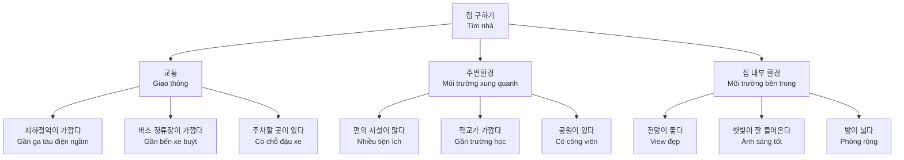
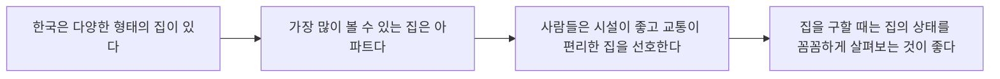
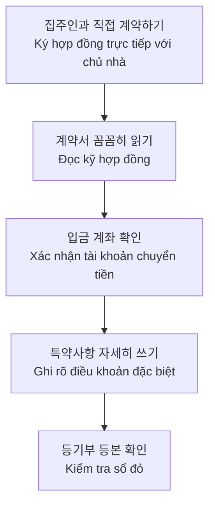

# Bài 11: 부동산 (Bất động sản) - Tìm kiếm nhà ở

<h2 className="text-xl font-bold text-blue-700 mb-2">🎯 Mục tiêu học tập</h2>
<ul className="list-disc ml-6 space-y-1">
<li>Học từ vựng về các loại nhà ở và tìm kiếm nhà</li>
<li>Nắm vững ngữ pháp: -는 데다가, -는다</li>
<li>Thực hành đàm thoại tại văn phòng môi giới bất động sản</li>
<li>Hiểu về văn hóa nhà ở tại Hàn Quốc (셰어 하우스)</li>
</ul>

## 📝 Từ vựng cơ bản

### 1. Các loại nhà ở

| Tiếng Hàn | Tiếng Việt | Ghi chú |
|------------|------------|---------|
| 아파트 | Chung cư | Phổ biến nhất ở Hàn Quốc |
| 빌라 | Villa (nhà thấp tầng) | 3-5 tầng |
| 원룸 | Phòng một | Studio apartment |
| 오피스텔 | Officetel | Kết hợp văn phòng và nhà ở |
| 주택 | Nhà riêng | Nhà độc lập |
| 기숙사 | Ký túc xá | Nhà ở sinh viên |

### 2. Hình thức thuê nhà

<h4 className="font-bold text-green-600 mb-2">💰 Hình thức thanh toán</h4>

| Tiếng Hàn | Tiếng Việt | Đặc điểm |
|------------|------------|----------|
| 매매 | Mua bán | Sở hữu vĩnh viễn |
| 전세 | Thuê trả trước | Đặt cọc lớn, không trả tiền hàng tháng |
| 월세 | Thuê hàng tháng | Đặt cọc + tiền thuê tháng |
| 임대 | Cho thuê | Thuật ngữ chung |

<h4 className="font-bold text-blue-600 mb-2">🔍 Tìm kiếm nhà</h4>

| Tiếng Hàn | Tiếng Việt |
|------------|------------|
| 집 구하기 | Tìm nhà |
| 부동산 중개소 | Văn phòng môi giới |
| 계약 | Hợp đồng |
| 보증금 | Tiền đặt cọc |

### 3. Điều kiện sống

## 📚 Ngữ pháp

### 1. Ngữ pháp: -는 데다가

<h4 className="font-bold text-orange-700 mb-2">✨ Ý nghĩa và cách dùng</h4>

<strong>Ý nghĩa:</strong> Diễn tả việc thêm vào một tình trạng hoặc hành động tương tự khác

<strong>Tương đương tiếng Việt:</strong> "mà còn", "lại còn", "hơn nữa"

#### Cách chia:

| Loại động từ/tính từ | Cách chia | Ví dụ |
|---------------------|-----------|-------|
| Động từ có cuối là phụ âm | -는 데다가 | 먹다 → 먹는 데다가 |
| Động từ có cuối là nguyên âm | -는 데다가 | 가다 → 가는 데다가 |
| Tính từ có cuối là phụ âm | -은 데다가 | 작다 → 작은 데다가 |
| Tính từ có cuối là nguyên âm | -ㄴ 데다가 | 크다 → 큰 데다가 |
| Danh từ | -인 데다가 | 학생 → 학생인 데다가 |

#### Ví dụ:

<h5 className="font-semibold mb-2">📖 Ví dụ mẫu:</h5>

**🏠 Về nhà ở:**
- 이 집은 교통도 편리한 데다가 주변에 편의 시설도 많아요.
  *(Nhà này giao thông thuận tiện mà còn xung quanh có nhiều tiện ích nữa.)*

**🍚 Về ăn uống:**
- 요즘 밥을 많이 먹는 데다가 운동을 안 하니까 자꾸 살이 쪄요.
  *(Dạo này ăn nhiều mà lại không tập thể dục nên cứ tăng cân hoài.)*

**🏢 Về chung cư:**
- 아파트는 사람이 많이 살 수 있는 데다가 편리하고 안전하다고 생각해요.
  *(Tôi nghĩ chung cư có thể ở được nhiều người mà còn tiện lợi và an toàn nữa.)*

### 2. Ngữ pháp: -는다

<h4 className="font-bold text-green-700 mb-2">📰 Ý nghĩa và cách dùng</h4>

<strong>Ý nghĩa:</strong> Chủ yếu được sử dụng trong báo chí, sách vở để mô tả sự thật khách quan ở thì hiện tại

<strong>Đặc điểm:</strong> Văn phong trang trọng, khách quan

#### Cách chia:

| Loại động từ/tính từ | Cách chia | Ví dụ |
|---------------------|-----------|-------|
| Động từ có cuối là phụ âm | -는다 | 읽다 → 읽는다, 듣다 → 듣는다 |
| Động từ có cuối là nguyên âm | -ㄴ다 | 보다 → 본다, 계약하다 → 계약한다 |
| Tính từ | -다 | 많다 → 많다, 예쁘다 → 예쁘다 |
| Danh từ | -이다/-다 | 학생이다, 인기다 |

#### Ví dụ trong văn bản:

## 🗣️ Đàm thoại thực hành

### Tình huống: Tại văn phòng môi giới bất động sản

<h4 className="font-bold text-blue-700 mb-2">🎭 Nhân vật:</h4>
<ul className="list-disc ml-6">
<li><strong>라민 (Ramin):</strong> Người đang tìm nhà</li>
<li><strong>부동산 중개인:</strong> Nhân viên môi giới bất động sản</li>
</ul>

**🏪 Mẫu đàm thoại:**

**라민:** 안녕하세요? 집 좀 보려고 하는데요.
*(Xin chào. Tôi muốn xem nhà ạ.)*

**부동산 중개인:** 어서 오세요. 어떤 집을 구하세요?
*(Mời bạn vào. Bạn đang tìm nhà như thế nào?)*

**라민:** 방 두 개인 월세 빌라를 찾고 있어요.
*(Tôi đang tìm villa cho thuê hàng tháng có hai phòng.)*

**부동산 중개인:** 잠깐만요. 마침 새로 나온 집이 있어요. 남향인 데다가 새로 수리해서 깨끗하고요.
*(Đợi một chút. Vừa có căn mới. Hướng nam mà còn mới sửa chữa nên rất sạch sẽ.)*

**라민:** 아, 그래요? 근처에 지하철역이 있으면 좋겠어요.
*(Ah, vậy à? Gần đó có ga tàu điện ngầm thì tốt quá.)*

**부동산 중개인:** 네, 있어요. 걸어서 5분 거리에 지하철이 있어요. 한번 보시겠어요?
*(Vâng, có ạ. Cách đây 5 phút đi bộ có tàu điện ngầm. Bạn có muốn xem không?)*

**라민:** 네, 지금 바로 보여 주세요.
*(Vâng, xin hãy cho tôi xem ngay bây giờ.)*

## 🏠 So sánh các lựa chọn nhà ở

<h4 className="font-bold text-pink-700 text-center mb-3">🌸 행복빌라</h4>
<ul className="space-y-2">
<li>✅ 전망이 좋다 (View đẹp)</li>
<li>✅ 교통이 편리하다 (Giao thông thuận tiện)</li>
<li>✅ 근처에 편의 시설이 많다 (Nhiều tiện ích gần)</li>
<li>✅ 테라스가 있다 (Có sân thượng)</li>
</ul>

<h4 className="font-bold text-purple-700 text-center mb-3">💜 사랑빌라</h4>
<ul className="space-y-2">
<li>✅ 학교, 학원 등 교육환경이 좋다 (Môi trường giáo dục tốt)</li>
<li>✅ 주차장이 있다 (Có bãi đậu xe)</li>
<li>✅ 주변 환경이 깨끗하고 안전하다 (Xung quanh sạch sẽ, an toàn)</li>
</ul>

## 🎧 Luyện nghe

<h4 className="font-bold text-yellow-700 mb-2">🎵 Phần nghe - Track 11-P.mp3</h4>

**Tình huống:** Hậu Ân đang nói chuyện với nhân viên môi giới bất động sản

*[Đường dẫn file nghe sẽ được bổ sung]*

### Câu hỏi luyện tập:

1. **후엔 씨는 어떤 집을 찾고 있습니까?**
   *(Anh Hậu Ân đang tìm nhà như thế nào?)*

2. **부동산 중개인은 어떤 집을 소개했습니까?**
   *(Nhân viên môi giới giới thiệu những căn nhà nào?)*

| Căn nhà | Loại | Hình thức |
|---------|------|-----------|
| 집 1 | ☐ 원룸 ☐ 빌라 ☐ 주택 ☐ 아파트 | ☐ 월세 ☐ 전세 ☐ 매매 |
| 집 2 | ☐ 원룸 ☐ 빌라 ☐ 주택 ☐ 아파트 | ☐ 월세 ☐ 전세 ☐ 매매 |

## 📖 Đọc hiểu: Những điều cần lưu ý khi tìm nhà

<h4 className="font-bold text-gray-700 mb-3">📋 집을 구할 때의 확인 사항</h4>

### **1. Khi xem nhà cần kiểm tra:**

**🏠 Bên trong nhà:**
- 햇빛이 잘 들어오는지 (Ánh sáng có vào tốt không)
- 소음이 없는지 (Có tiếng ồn không)  
- 물, 전기, 난방이 잘 나오는지 (Nước, điện, sưởi có hoạt động tốt không)
- 시설에 고장난 곳이 있는지 (Các thiết bị có hỏng hóc không)

**🌆 Xung quanh nhà:**
- 편의 시설이 있는지 (Có tiện ích không)
- 안전한지 (Có an toàn không)
- 교통이 편리한지 (Giao thông có thuận tiện không)

### **2. Khi ký hợp đồng:**

### **3. Khi chuyển nhà:**

**Thứ tự thực hiện:**
1. **(가) 잔금을 지불한다** - Thanh toán số tiền còn lại
2. **(나) 집 열쇠를 받는다** - Nhận chìa khóa nhà  
3. **(다) 새집에 이삿짐을 옮긴다** - Chuyển đồ đạc đến nhà mới
4. **(라) 주민센터에서 전입신고를 한다** - Làm thủ tục đăng ký cư trú tại trung tâm hành chính

## 🏡 Văn hóa Hàn Quốc: 셰어 하우스 (Share House)

<h4 className="font-bold text-indigo-700 mb-2">🤝 Khái niệm Share House</h4>

**셰어 하우스** (Share House) là hình thức ở chung trong cùng một ngôi nhà, mỗi người có phòng riêng nhưng chia sẻ các khu vực chung như bếp, phòng khách.

**Ưu điểm:**
- Chi phí sinh hoạt thấp hơn
- Có cơ hội giao lưu với nhiều người
- Phù hợp với sinh viên, người trẻ

**Lưu ý:**
- Cần tôn trọng quy tắc chung
- Giữ gìn vệ sinh khu vực chung

## 🔤 Luyện phát âm

<h4 className="font-bold text-red-700 mb-2">📢 Phát âm đặc biệt: ㄱ, ㄷ, ㅂ → ㅇ, ㄴ, ㅁ</h4>

| Từ gốc | Phát âm thực tế | Ví dụ câu |
|--------|----------------|-----------|
| 먹는 | [멍는] | 건강을 위해서 아침에는 밥을 꼭 먹는 편이다 |
| 듣는 | [든는] | 나는 비가 올 때 혼자 음악 듣는 것을 좋아한다 |
| 입는 | [임는] | 애나 씨는 옷을 잘 입는 데다가 성격도 좋아서 인기가 많다 |

## ✏️ Bài tập thực hành

### Bài 1: Sử dụng "-는 데다가"

**Mẫu:** 방이 어때요? → 방이 좁은 데다가 어두워서 별로 마음에 안 들어요.

1. 비가 오다 / 바람도 불다 → ______________________
2. 흐엉 씨는 활발하다 / 친절하다 → ______________________  
3. 이 집은 남향이다 / 전망도 좋다 → ______________________

### Bài 2: Chuyển đổi văn phong với "-는다"

**Chuyển các câu sau sang văn phong báo chí:**

- 저는 방이 너무 좁아서 이사하려고 합니다.
→ 나는 방이 너무 좁아서 이사하려고 한다.

*Học viên tự thực hành với các câu khác trong bài...*

---

<h3 className="font-bold text-lg text-gray-800 mb-2">🎊 Chúc mừng!</h3>

Bạn đã hoàn thành Bài 11: 부동산 (Bất động sản)

Hãy thực hành thêm với bạn bè và áp dụng vào tình huống thực tế!

