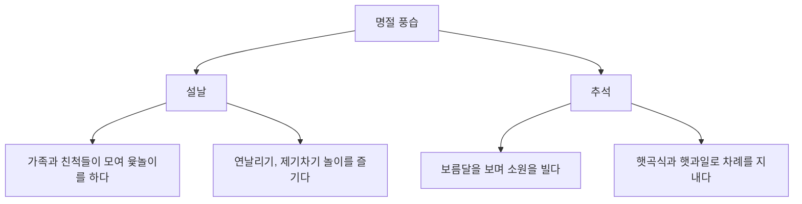
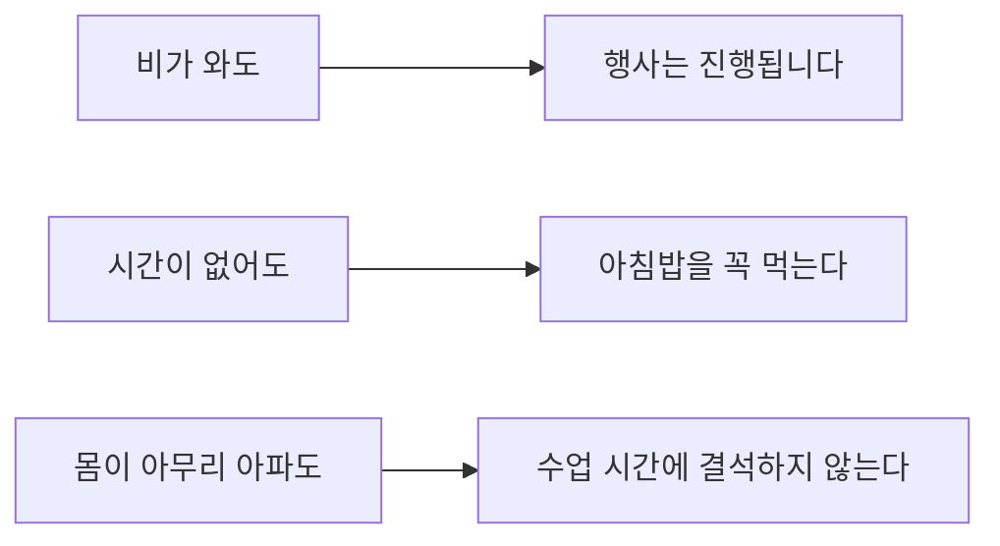
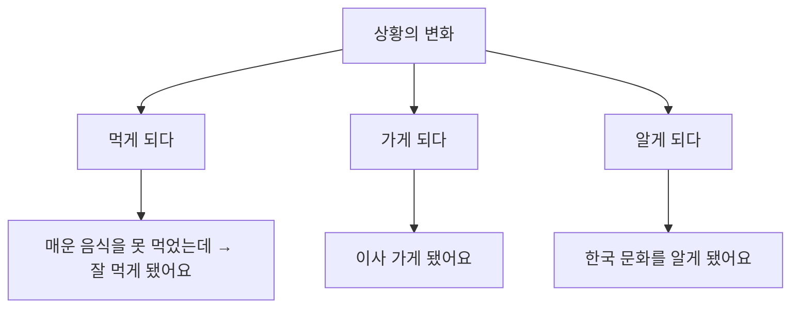
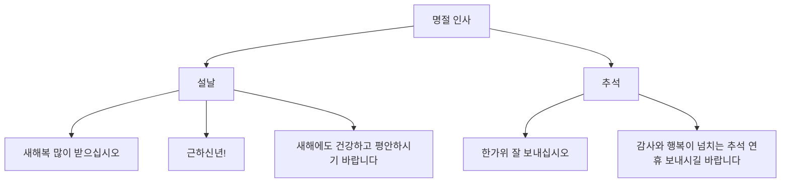
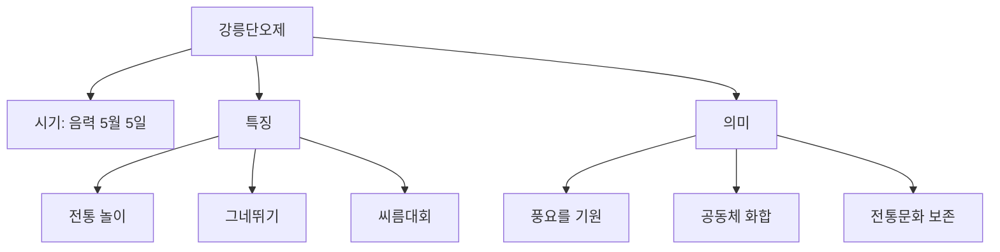

# Bài 12: 전통 명절 (Lễ hội truyền thống)

## 📚 Mục tiêu học tập

- Học từ vựng về các lễ hội truyền thống và phong tục Hàn Quốc
- Nắm vững cấu trúc ngữ pháp `-아도/어도`, `-게 되다`
- Thảo luận về phong tục lễ hội và so sánh với quê hương
- Tìm hiểu về lễ hội Gangneung Danoje

## 🎯 Hoạt động khởi động

  <h3 className="text-lg font-bold text-red-700 mb-3">💭 Quan sát và thảo luận</h3>
  
<strong>어떤 명절이에요? 이 사람들은 무엇을 하고 있어요?</strong>

  
<strong>여러분은 설날과 추석에 어떻게 지내요?</strong>

  
Hãy quan sát hình ảnh và thảo luận về các lễ hội mà bạn thấy. Bạn thường làm gì vào dịp Tết và Tết Thu?

## 📖 어휘 (Từ vựng)

### 1. 한국에는 어떤 명절이 있어요?

| 명절 (Lễ hội) | 날짜 | 음식 (Món ăn) | 의미 |
|---------------|------|---------------|------|
| 설날 | 음력 1월 1일 | 떡국 | 건강하게 오래 살기를 기원한다 |
| 정월 대보름 | 음력 1월 15일 | 부럼 | 일년 동안 피부병이 생기지 않는다 |
| 추석 | 음력 8월 15일 | 송편 | 일년 농사에 감사한다 |
| 동지 | 양력 12월 21일 | 팥죽 | 붉은색이 나쁜 것을 쫓는다 |

### 2. 설날과 추석에는 어떤 풍습과 놀이가 있어요?

## 📝 문법 1: -아도/어도

  <h3 className="text-lg font-semibold text-blue-800 mb-3">📋 Định nghĩa</h3>
  
앞의 행동이나 상태와 관계없이 뒤의 상황이 있음을 나타낸다.

  
Diễn tả việc tình huống phía sau xảy ra bất kể hành động hay trạng thái phía trước.

### 활용 규칙

| 동사/형용사 | 활용 | 예시 |
|------------|------|------|
| 작다 | 작아도 | 작아도 예뻐요 |
| 가다 | 가도 | 가도 괜찮아요 |
| 먹다 | 먹어도 | 먹어도 배고파요 |
| 가르치다 | 가르쳐도 | 가르쳐도 못해요 |
| 공부하다 | 공부해도 | 공부해도 어려워요 |
| 피곤하다 | 피곤해도 | 피곤해도 일해요 |

### 예문

**대화 예시:**
- 라민: 선배, 공부 때문에 바쁜데 이번 추석 때 고향에 가요?
- 정우: 그럼. 아무리 바빠도 명절에는 꼭 고향에 가야지. 부모님이 기다리시거든.

### 연습문제

**1. 그림을 보고 보기와 같이 친구와 이야기해 보세요.**

| 상황 | 질문 | 답변 |
|------|------|------|
| 피곤하다 / 매일 운동을 하다 | 매일 운동을 해요? | 네. 저는 아무리 피곤해도 매일 운동을 해요. |
| 날씨가 춥다 / 차가운 커피만 마시다 | | |
| 늦게 자다 / 6시에 꼭 일어나다 | | |
| 한국어로 말하는 것이 어렵다 / 평소에 한국어로만 말하다 | | |

## 📝 문법 2: -게 되다

  <h3 className="text-lg font-semibold text-green-800 mb-3">📋 Định nghĩa</h3>
  
외부의 영향으로 어떤 결과가 생기거나, 상황(상태)이 변하는 것을 나타낸다.

  
Diễn tả việc có kết quả hoặc thay đổi tình huống do ảnh hưởng bên ngoài.

### 활용 규칙

| 동사 | 활용 | 예시 |
|------|------|------|
| 먹다 | 먹게 되다 | 매운 음식을 먹게 됐어요 |
| 가다 | 가게 되다 | 한국에 가게 됐어요 |

### 예문

**대화 예시:**
- 마리셀: 두 분은 처음에 어떻게 만나셨어요?
- 김영욱: 친한 친구 소개로 만나게 됐어요.

### 연습문제

**1. 보기와 같이 친구와 이야기해 보세요.**

| 이름 | 한국에 오기 전 | 한국에 온 후 |
|------|---------------|-------------|
| 안젤라 | 매운 음식을 못 먹다 | 매운 음식을 잘 먹게 됐어요 |
|      | 밤에 일찍 자다 | 늦게 자다 |
| 잠시드 | 한국 문화를 잘 모르다 | 한국 문화를 이해하다 |
| 이링 | 한국의 명절 풍습을 모르다 | 설날과 추석에 대해 잘 알다 |
| 아나이스 | | |
| 제이슨 | 한국어를 한 마디도 못하다 | 한국어를 어느 정도 할 수 있다 |

## 🎪 말하기 (Nói)

### 활동 1: 명절 풍습 이야기하기

  <h4 className="font-semibold text-yellow-800 mb-2">🎭 역할 연기</h4>
  
안젤라 씨와 과장님이 명절 풍습에 대해 이야기합니다.

**대화 모델:**
- 과장님: 안젤라씨, 명절 잘 보냈어요?
- 안젤라: 네. 잘 보냈어요. 과장님도 연휴 동안 잘 지내셨어요?
- 과장님: 고향 부모님 댁에 다녀왔어요. 아무리 바빠도 명절에는 부모님을 뵈러 가니까요.

### 활동 2: 명절 음식과 의미

| 명절 | 음식 | 의미 |
|------|------|------|
| 동지 | 팥죽 | 팥죽의 붉은색이 나쁜 기운을 쫓는다 |
| 정월 대보름 | 부럼 | 부럼을 먹으면 일 년 동안 피부병에 걸리지 않는다 |

## 👂 듣기 (Nghe)

🎵 **Audio 12-P.mp3** - *[Đường dẫn file nghe sẽ được bổ sung]*

### 준비 활동

  <h4 className="font-semibold text-purple-800 mb-2">📰 신문 기사 제목</h4>
  <ul className="list-disc pl-5 text-gray-700">
    <li>더도 말고 덜도 말고 한가위만 같아라</li>
    <li>황금연휴 첫날 귀성 전쟁 시작돼</li>
    <li>귀성객들로 주차장이 된 고속도로</li>
    <li>기차역과 버스 터미널도 붐벼</li>
  </ul>

### 듣기 문제

1) 기자는 어떤 명절에 대해 말하고 있습니까?
2) 고향에서 서울로 올라오는 부모들이 많은 이유는 무엇입니까?
3) 들은 내용과 같으면 ○, 다르면 ✗ 하세요.
   - ① 기차표는 예매로만 살 수 있다. ( )
   - ② 이번 명절 연휴는 평소보다 짧다. ( )
   - ③ 내일부터는 기차역에 사람들이 적어질 것이다. ( )

## 🔤 발음 (Phát âm)

**연음 규칙:** 설날[설랄], 일년[일련], 연락[열락]

🎵 **발음 연습 오디오** - *[Đường dẫn file nghe sẽ được bổ sung]*

1) 설날에 뭐 해요?
2) 동지는 일 년 중 가장 밤이 길다.
3) 오랜만에 친척들과 연락을 했다.

## 📖 읽기 (Đọc)

### 1. 명절 인사말

### 2. 설날 풍경

  

    
설빔을 입다

    
한복을 입고 새해를 맞이하다

  

  

    
세배하다

    
어른께 새해 인사를 드리다

  

  

    
덕담을 하다

    
좋은 말씀을 해주시다

  

  

    
세뱃돈을 받다

    
아이들이 용돈을 받다

  

### 3. 한국의 명절 (읽기 지문)

한국의 대표적인 명절에는 설날과 추석이 있다. 설날은 음력 1월 1일이다. 설날에는 아무리 바빠도 가족들이 모두 모여서 새해 인사를 한다. 새해 인사를 할 때 아랫사람이 윗사람에게 세배를 한다. 세배를 받은 윗사람은 아랫사람에게 덕담을 해 주고, 아이들에게는 세뱃돈을 준다. 그리고 함께 떡국을 먹는다. 설날에 떡국을 먹으면 나이도 한 살 더 먹는다고 생각한다.

또한 전통적으로 가족과 친척들이 모여 윷놀이를 하거나 아이들은 연날리기, 제기차기 놀이를 즐기기도 했다.

한국의 또 다른 큰 명절인 추석은 음력 8월 15일로 한가위라고도 한다. 추석에는 조상에게 차례를 지낸다. 그 해에 처음으로 얻은 햇곡식과 햇과일을 준비해서 조상에게 감사하는 마음을 표현하는 것이다. 그리고 추석에는 송편을 빚어서 먹는데 송편을 예쁘게 빚으면 예쁜 아이를 낳는다는 말도 전해지고 있다. 또한 전통적으로 추석 밤에는 보름달을 바라보면서 소원을 빌었다.

그런데 시대가 바뀌면서 현대의 명절 모습은 예전과 많이 달라졌다. 친척이나 아는 사람들을 직접 찾아가는 대신에 명절 인사를 문자 메시지로 보낸다. 그리고 가족들이 함께 여행을 가기도 하고 개인적인 시간을 보내기도 한다. 요즘은 오랜만에 가족이 모인다는 의미와 일상에서 휴식한다는 의미가 더 커지게 되었다.

#### 독해 문제

1) 설날에 대한 설명으로 맞는 것은 무엇입니까?
   - ① 아이들은 세배하고 세뱃돈을 받는다.
   - ② 아이들은 어른들에게 덕담을 한다.
   - ③ 떡국은 새로 수확한 쌀로 만든다.
   - ④ 윷놀이는 아이들만 즐기는 놀이다.

2) 추석에 대한 설명으로 맞지 않는 것은 무엇입니까?
   - ① 한가위라고도 한다.
   - ② 송편을 빚어서 먹는다.
   - ③ 부모님께 세배를 한다.
   - ④ 달을 보면서 소원을 빈다.

3) 요즘 명절의 모습이 어떻게 바뀌었습니까?

## 📚 단어장 (Từ vựng tổng hợp)

| 한국어 | 뜻 | 예문 |
|--------|----|----|
| 풍습 | phong tục | 한국의 명절 풍습을 배워요 |
| 한가위 | tên gọi khác của Tết Thu | 한가위에 송편을 먹어요 |
| 황금연휴 | kỳ nghỉ vàng | 황금연휴에 고향에 가요 |
| 귀성전쟁 | cuộc chiến về quê | 명절마다 귀성전쟁이 벌어져요 |
| 귀성객 | người về quê | 귀성객들이 많아요 |
| 고속도로 | đường cao tốc | 고속도로가 막혀요 |
| 붐비다 | đông đúc, nhộn nhịp | 기차역이 붐벼요 |

## 🏛️ 문화와 정보: 강릉단오제

  <h3 className="text-lg font-bold text-indigo-700 mb-3">🎪 강릉단오제</h3>
  
강릉단오제는 강릉 지역의 전통 축제입니다.

  
매년 단오절(음력 5월 5일)에 열리는 이 축제는

  
한국의 무형문화유산으로 등재되어 있습니다.

---

*이 교재는 KIIP(사회통합프로그램) 한국어와 한국문화 중급 1 과정을 기반으로 제작되었습니다.*