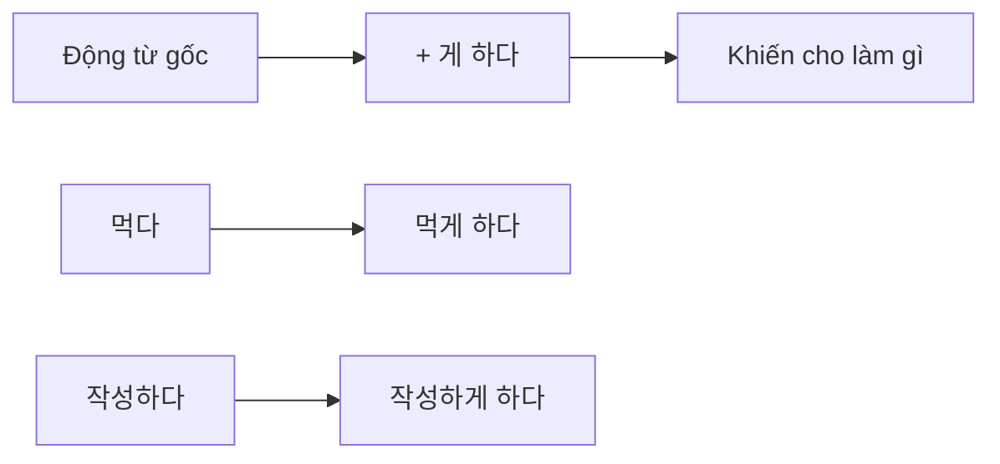
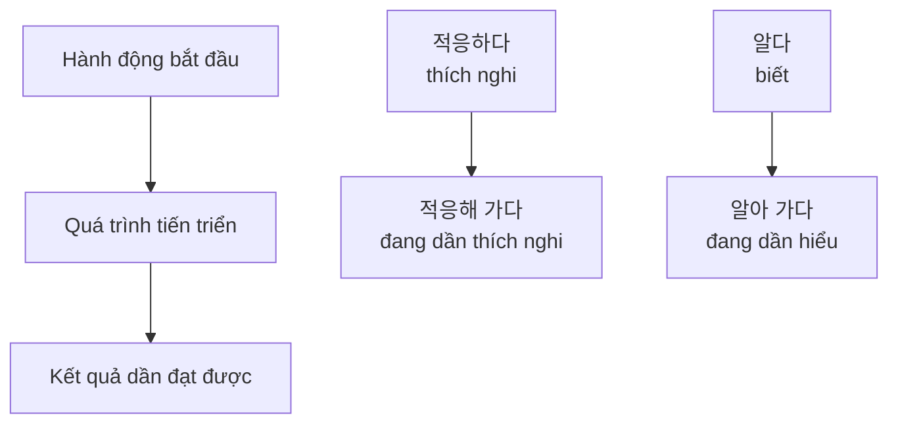
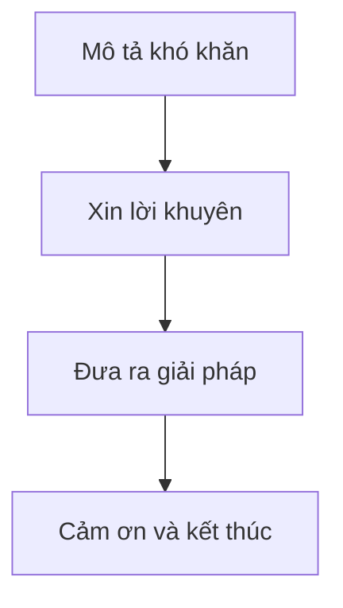
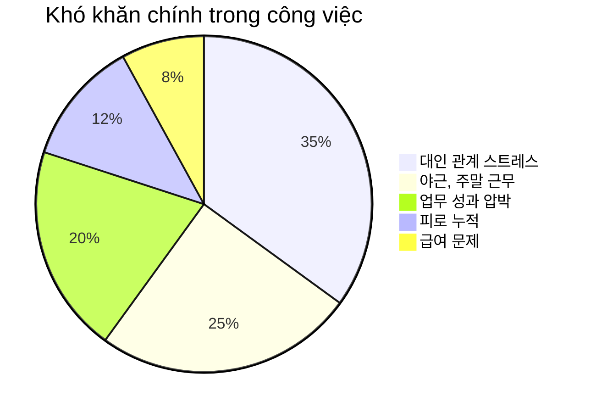

# Bài 13: 직장생활 (Cuộc sống công việc)

## 🎯 Mục tiêu bài học

  <h3 className="text-lg font-semibold text-blue-800 mb-2">Sau khi hoàn thành bài học này, học viên sẽ có thể:</h3>
  <ul className="list-disc list-inside text-blue-700 space-y-1">
    <li>Sử dụng từ vựng liên quan đến công việc văn phòng và công việc sản xuất</li>
    <li>Vận dụng ngữ pháp <strong>-게 하다</strong> và <strong>-어 가다</strong></li>
    <li>Trao đổi về khó khăn trong công việc và xin lời khuyên</li>
    <li>Hiểu về khái niệm Work-Life Balance trong văn hóa Hàn Quốc</li>
  </ul>

---

## 📚 Từ vựng (어휘)

### 1. Công việc văn phòng (사무실에서 하는 일)

| Từ vựng | Nghĩa tiếng Việt | Ví dụ |
|---------|------------------|-------|
| 회의를 하다 | họp, tham gia cuộc họp | 오늘 오후에 회의를 해요 |
| 업무 지시를 하다/받다 | chỉ đạo công việc/nhận chỉ đạo | 부장님이 업무 지시를 하셨어요 |
| 업무를 보고하다 | báo cáo công việc | 매주 업무를 보고해야 해요 |
| 서류를 작성하다 | lập tài liệu | 계약서를 작성하고 있어요 |
| 결재를 하다/받다 | phê duyệt/được phê duyệt | 부장님께 결재를 받아야 해요 |

### 2. Công việc sản xuất (작업장에서 하는 일)

| Từ vựng | Nghĩa tiếng Việt | Ví dụ |
|---------|------------------|-------|
| 기계를 정비하다 | bảo dưỡng máy móc | 매일 기계를 정비해요 |
| 작동을 확인하다 | kiểm tra hoạt động | 기계 작동을 확인했어요 |
| 공구를 준비하다 | chuẩn bị dụng cụ | 작업 전에 공구를 준비해요 |
| 재고를 정리하다 | sắp xếp hàng tồn kho | 창고에서 재고를 정리해요 |
| 자재를 주문하다 | đặt hàng vật liệu | 다음 주에 자재를 주문할 예정이에요 |
| 작업 일지를 작성하다/제출하다 | viết/nộp nhật ký công việc | 매일 작업 일지를 작성해요 |

### 3. Từ vựng bổ sung

| Từ vựng | Nghĩa tiếng Việt | Ví dụ |
|---------|------------------|-------|
| 마무리하다 | hoàn thành, kết thúc | 오늘 일을 다 마무리했어요 |
| 적응하다 | thích nghi | 새 직장에 적응하고 있어요 |
| 방식 | cách thức | 한국의 일하는 방식이 달라요 |
| 파악하다 | nắm bắt, hiểu rõ | 업무를 파악해야 해요 |
| 상사 | cấp trên | 상사와의 관계가 중요해요 |
| 상하관계 | mối quan hệ cấp trên - cấp dưới | 회사의 상하관계를 이해해야 해요 |

---

## 📖 Ngữ pháp (문법)

### 1. -게 하다 (Khiến cho ai đó làm gì)

  <h4 className="text-green-800 font-semibold mb-2">💡 Cách sử dụng:</h4>
  
Dùng để diễn tả việc khiến, bắt hoặc yêu cầu người khác làm một việc gì đó.

#### Cấu trúc:

#### Bảng chia động từ:

| Động từ gốc | Kết hợp với -게 하다 | Nghĩa |
|-------------|---------------------|--------|
| 먹다 | 먹게 하다 | khiến ăn |
| 작성하다 | 작성하게 하다 | khiến viết/lập |
| 준비하다 | 준비하게 하다 | khiến chuẩ bị |

#### Ví dụ:
- **이 약을 식후에 아이에게 먹게 하세요.** *(Hãy cho trẻ uống thuốc này sau bữa ăn.)*
- **팀원들에게도 작성하게 하세요.** *(Hãy bảo các thành viên trong team cũng viết nữa.)*
- **아이에게 자기 방을 스스로 정리하게 하세요.** *(Hãy để trẻ tự dọn dẹp phòng của mình.)*

  
<strong>💡 Mẹo:</strong> '하게 하다' có thể thay thế bằng '시키다' với ý nghĩa tương tự.

### 2. -어 가다 (Diễn tả quá trình tiến triển)

  <h4 className="text-purple-800 font-semibold mb-2">💡 Cách sử dụng:</h4>
  
Diễn tả một hành động hoặc trạng thái đang liên tục thay đổi hoặc phát triển theo thời gian.

#### Cách chia:

| Loại động từ | Cách chia | Ví dụ |
|--------------|-----------|-------|
| Tận cùng là 'ㅏ/ㅗ' | + 아 가다 | 오다 → 와 가다 |
| Tận cùng là 'ㅓ/ㅜ/ㅡ/ㅣ' | + 어 가다 | 먹다 → 먹어 가다 |
| Tận cùng là '하다' | + 해 가다 | 적응하다 → 적응해 가다 |

#### Ví dụ:
- **한국에 온 지 거의 3년이 되어 가요.** *(Sắp tròn 3 năm từ khi tôi đến Hàn Quốc.)*
- **지금은 한국 사람들의 일하는 방식을 알아 가는 중이에요.** *(Bây giờ tôi đang dần hiểu cách làm việc của người Hàn Quốc.)*
- **선배님들이 잘 가르쳐 주셔서 잘 적응해 가고 있어요.** *(Nhờ các anh chị dạy dỗ tận tình nên tôi đang thích nghi tốt.)*

---

## 🎧 Luyện nghe (듣기)

### Bài nghe 1: Xin nghỉ phép tại công ty
*🔊 File âm thanh: 13-L.mp3*

  <h4 className="font-semibold mb-2">Tình huống:</h4>
  
안젤라 씨와 선배가 휴가 신청에 대해 이야기합니다.

#### Câu hỏi:
1. 안젤라 씨는 부장님께 어떤 서류를 냈습니까?
2. 선배는 휴가를 신청하기 전에 어떻게 하면 좋다고 했습니까?
3. 맞으면 ○, 틀리면 ✗ 표시하세요:
   - 안젤라 씨는 선배에게 휴가 신청서를 냈다. ( )
   - 휴가를 가고 싶으면 동료와 먼저 상의해야 한다. ( )
   - 안젤라 씨는 직장 생활에 익숙해져서 실수를 하지 않는다. ( )

### Bài nghe 2: Phát âm
*🔊 File âm thanh: 13-P.mp3*

  <h4 className="font-semibold mb-2">Luyện phát âm - Quy tắc thêm âm:</h4>
  <ul className="list-disc list-inside space-y-1">
    <li>안 좋은 일 → [안조은 닐]</li>
    <li>급한 일 → [그판 닐]</li>
    <li>집안일 → [지반닐]</li>
  </ul>

---

## 💬 Luyện nói (말하기)

### Hoạt động 1: Xin lời khuyên về công việc

#### Mẫu hội thoại:
**드미트리:** 안젤라 씨 무슨 안 좋은 일 있었어요?

**안젤라:** 얼마 전에 부장님이 저한테 중요한 계약서를 번역하게 하셨거든요. 그런데 어려운 말이 많아서 제대로 하지 못했어요.

**드미트리:** 그럼 미리 선배나 동료들한테 물어보지 그랬어요?

**안젤라:** 사람들은 제가 잘 적응해 가는 줄 아는데 물어보기가 창피하더라고요. 이럴 때는 어떻게 하는 게 좋을까요?

**드미트리:** 그럴 때는 내가 한 게 맞는지 주변 사람들에게 계속 물어보는 게 제일 좋아요.

### Hoạt동 2: Các tình huống khó khăn khác

  

    <h4 className="font-semibold text-red-800 mb-2">😰 Người gặp khó khăn:</h4>
    <ul className="text-red-700 space-y-1 text-sm">
      <li>• 상사가 여러 명이라서 업무 보고를 누구에게 해야 하는지 모르겠다</li>
      <li>• 일을 끝내라는 날짜가 너무 빠르다</li>
      <li>• 일을 더 잘하는 게 좋은지 빨리 하는게 좋은지 모르겠다</li>
    </ul>
  

  

    <h4 className="font-semibold text-green-800 mb-2">💡 Người đưa lời khuyên:</h4>
    
Hãy đưa ra những lời khuyên thiết thực và hữu ích cho từng tình huống cụ thể.

  

---

## 📖 Luyện đọc (읽기)

### Bài đọc 1: Thông tin tuyển dụng

| Công ty | 분야 (Lĩnh vực) | 급여 (Lương) | 모집 인원 (Số lượng tuyển) |
|---------|-----------------|-------------|---------------------------|
| (주)○○전자 | 사무직, 관리직 | 연봉 | ○○명 |
| (주)○○자동차 | 생산직 | 월급, 주급, 일당 | ○○명 |
| (주)○○상사 | 영업직, 판매직 | 시급, 수당 | ○○명 |

#### Từ vựng liên quan:
- **사무직**: nhân viên văn phòng
- **생산직**: công nhân sản xuất  
- **영업직**: nhân viên kinh doanh
- **관리직**: nhân viên quản lý
- **연봉**: lương năm
- **월급**: lương tháng
- **수당**: phụ cấp

### Bài đọc 2: Khảo sát về khó khăn trong công việc

  <h4 className="font-semibold mb-2">📊 Kết quả khảo sát từ 잡코리아:</h4>
  
1,049 직장인을 대상으로 한 설문 조사

#### Top 5 khó khăn trong công việc:

#### Top 6 cách giải tỏa căng thẳng:

  

    

      1위: 집에서 휴식하기
      1위
    

    

      2위: 취미 생활하기
      2위
    

    

      3위: 쇼핑하면서 돈쓰기
      3위
    

  

  

    

      4위: 정확하게 퇴근하기
      4위
    

    

      5위: 혼밥, 혼술, 혼영
      5위
    

    

      6위: 동호회 활동
      6위
    

  

---

## 📝 Bài tập

### Bài tập 1: Sử dụng -게 하다

Hoàn thành các câu sau sử dụng cấu trúc -게 하다:

1. 과장님이 무슨 일을 시켰어요?
   → 이링씨에게 회의를 **___________**. (준비하다)

2. 안젤라씨, 13일까지 계약서/ 번역
   → 안젤라씨에게 계약서를 **___________**. (번역하다)

3. 잠시드씨, 창고의 재고 / 체크  
   → 잠시드씨에게 재고를 **___________**. (체크하다)

### Bài tập 2: Sử dụng -어 가다

Hoàn thành câu mô tả quá trình thích nghi của nhân viên mới:

1. 직원들의 이름과 얼굴을 외우다
   → 이제 조금씩 직원들의 이름과 얼굴을 **___________**.

2. 선배에게서 일을 배우다  
   → 선배님들께서 가르쳐 주셔서 **___________**.

3. 회사 규칙에 적응하다
   → 처음에는 어려웠는데 지금은 **___________**.

### Bài tập 3: Đọc hiểu

Đọc đoạn văn và trả lời câu hỏi:

1. 이 설문 조사의 질문으로 맞는 것은?
2. 직장인들이 직장 생활에서 가장 힘든 것은?
3. 내용 판단 (○/✗):
   - 직장인들은 대인 관계보다 업무 성과 때문에 더 힘들어한다. ( )
   - 돈을 받지 못하기 때문에 야근을 하는 것이 힘들다고 한다. ( )  
   - 취미 생활을 하면서 스트레스를 푸는 사람도 있다. ( )

---

## 🌍 Văn hóa và thông tin (문화와 정보)

### Work-Life Balance (워라밸) trong văn hóa Hàn Quốc

  <h4 className="text-lg font-semibold mb-3">🏢 Sự thay đổi trong văn hóa công việc</h4>
  
  

    

      <h5 className="font-semibold text-red-600 mb-2">⏰ Trước đây:</h5>
      <ul className="text-sm space-y-1">
        <li>• Làm việc nhiều giờ</li>
        <li>• Ưu tiên công việc hơn cuộc sống cá nhân</li>
        <li>• Văn hóa "회식" (tiệc tùng công ty) bắt buộc</li>
      </ul>
    

    

      <h5 className="font-semibold text-green-600 mb-2">✨ Hiện tại:</h5>
      <ul className="text-sm space-y-1">
        <li>• Chú trọng cân bằng cuộc sống</li>  
        <li>• Thời gian nghỉ ngơi được tôn trọng</li>
        <li>• Khuyến khích hoạt động cá nhân</li>
      </ul>
    

  

### Từ vựng mới thời đại:

| Từ | Nghĩa | Giải thích |
|-----|--------|------------|
| 워라밸 | Work-Life Balance | Cân bằng giữa công việc và cuộc sống |
| 혼밥 | Ăn một mình | Xu hướng ăn uống một mình |
| 혼술 | Uống một mình | Thưởng thức đồ uống một mình |
| 혼영 | Xem phim một mình | Giải trí cá nhân |

---

## ✅ Tóm tắt bài học

  <h3 className="text-xl font-bold mb-4">🎯 Những điều đã học:</h3>
  
  

    

      <h4 className="font-semibold mb-2 text-blue-300">📝 Từ vựng:</h4>
      <ul className="text-sm space-y-1">
        <li>• Công việc văn phòng và sản xuất</li>
        <li>• Thuật ngữ về lương bổng</li>
        <li>• Các loại hình công việc</li>
      </ul>
    

    
    

      <h4 className="font-semibold mb-2 text-green-300">🔤 Ngữ pháp:</h4>
      <ul className="text-sm space-y-1">
        <li>• <strong>-게 하다:</strong> Khiến ai làm gì</li>
        <li>• <strong>-어 가다:</strong> Quá trình tiến triển</li>
      </ul>
    

  

  
  

    <h4 className="font-semibold mb-2 text-yellow-300">💡 Kỹ năng giao tiếp:</h4>
    
Biết cách xin lời khuyên về công việc, mô tả khó khăn và đưa ra giải pháp trong môi trường làm việc.

  

---

  
🎉 Chúc mừng bạn đã hoàn thành Bài 13!

  
Tiếp tục luyện tập để thành thạo hơn trong giao tiếp công việc bằng tiếng Hàn!

