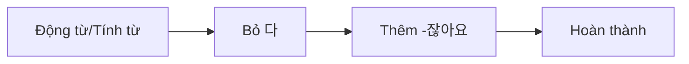
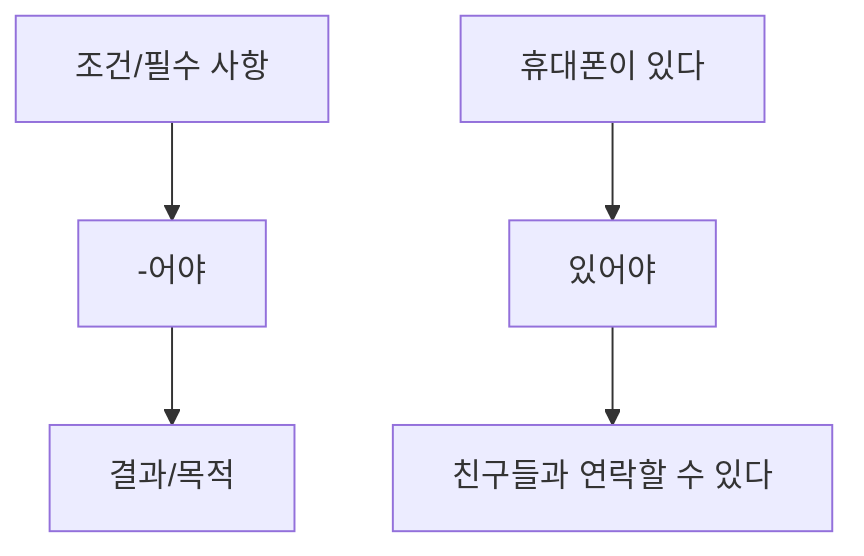
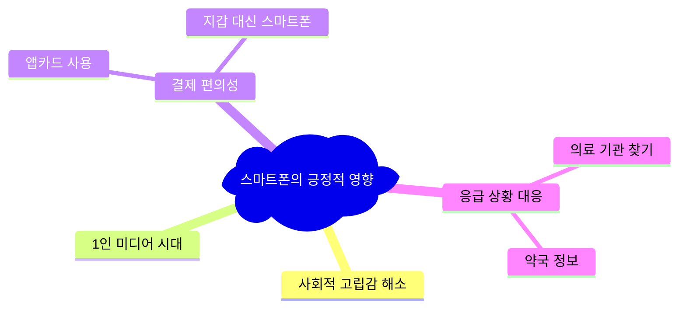
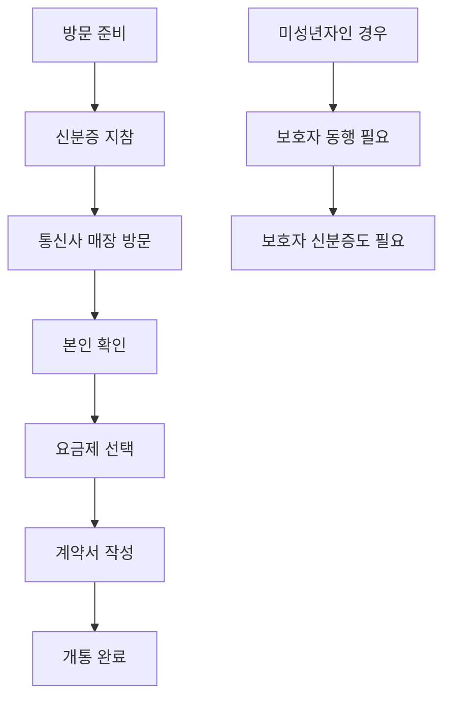

# Bài 14: Internet và Điện thoại thông minh
**인터넷과 스마트폰**

  <h2 className="text-xl font-bold text-blue-800 mb-2">🎯 Mục tiêu bài học</h2>
  <ul className="list-disc list-inside text-blue-700">
    <li>Học từ vựng về internet và điện thoại thông minh</li>
    <li>Nắm vững ngữ pháp: -잖아요, -어야</li>
    <li>Thực hành nói về cách sử dụng điện thoại thông minh</li>
    <li>Hiểu về văn hóa đăng ký điện thoại tại Hàn Quốc</li>
  </ul>

## 📱 I. TỪ VỰNG (어휘)

### Hoạt động với Internet và Điện thoại thông minh

| Tiếng Hàn | Tiếng Việt | Ví dụ |
|-----------|------------|--------|
| 정보를 검색하다 | Tìm kiếm thông tin | 인터넷으로 정보를 검색해요 |
| 인터넷 뱅킹을 하다 | Làm ngân hàng trực tuyến | 집에서 인터넷 뱅킹을 해요 |
| 인터넷 쇼핑을 하다 | Mua sắm trực tuyến | 인터넷 쇼핑을 자주 해요 |
| 이메일을 보내다 | Gửi email | 친구에게 이메일을 보내요 |
| 인터넷 강의를 듣다 | Nghe giảng trực tuyến | 한국어 인터넷 강의를 들어요 |
| 영화를 감상하다 | Xem phim | 집에서 영화를 감상해요 |
| 에스엔에스(SNS)를 하다 | Sử dụng mạng xã hội | 매일 SNS를 해요 |
| 댓글을 남기다 | Để lại bình luận | 영상에 댓글을 남겨요 |
| 유튜브를 보다 | Xem YouTube | 요리 유튜브를 봐요 |
| 사진/동영상을 촬영하다 | Chụp ảnh/Quay video | 스마트폰으로 사진을 촬영해요 |
| 영상 통화를 하다 | Gọi video | 가족과 영상 통화를 해요 |
| 문자를 보내다 | Gửi tin nhắn | 친구에게 문자를 보내요 |
| 뜻을 찾다 | Tra nghĩa | 사전에서 뜻을 찾아요 |
| 게임을 하다 | Chơi game | 스마트폰으로 게임을 해요 |
| 앱을 설치하다 | Cài đặt ứng dụng | 새로운 앱을 설치했어요 |

### Từ vựng bổ sung

| Tiếng Hàn | Tiếng Việt |
|-----------|------------|
| 최신 | Mới nhất |
| 간편하다 | Thuận tiện, đơn giản |
| 세계적 | Toàn cầu |
| 출장을 가다 | Đi công tác |
| 회원 가입을 하다 | Đăng ký thành viên |
| 본인 확인 | Xác thực bản thân |
| 개통하다 | Kích hoạt, mở |
| 접속하다 | Truy cập, kết nối |

## 📚 II. NGỮ PHÁP (문법)

### 1. Ngữ pháp: -잖아요

  <h4 className="font-bold text-green-800 mb-2">💡 Ý nghĩa và cách sử dụng</h4>
  
Sử dụng khi nói về việc mà người nghe cũng đã biết hoặc để xác nhận một sự thật nào đó.

#### Cấu trúc biến đổi:

| Dạng gốc | Dạng -잖아요 |
|----------|--------------|
| 보다 | 보잖아요 |
| 알다 | 알잖아요 |
| 비싸다 | 비싸잖아요 |
| 춥다 | 춥잖아요 |

#### Ví dụ:

  <strong>A:</strong> 와, 사진이 정말 잘 나왔네요. 
  <strong>B:</strong> 최신 스마트폰으로 찍었잖아요. 
  <em>(Wah, ảnh chụp đẹp thật! - Chụp bằng điện thoại thông minh mới nhất mà.)</em>

  <strong>A:</strong> 고향에 계신 부모님이 너무 보고 싶어요. 
  <strong>B:</strong> 영상 통화가 있잖아요. 영상 통화로 부모님께 자주 연락드리세요. 
  <em>(Tôi nhớ bố mẹ ở quê lắm. - Có video call mà. Hãy thường xuyên liên lạc với bố mẹ qua video call.)</em>

### 2. Ngữ pháp: -어야

  <h4 className="font-bold text-purple-800 mb-2">💡 Ý nghĩa và cách sử dụng</h4>
  
Diễn tả điều kiện cần thiết, bắt buộc phải có để thực hiện hành động phía sau.

#### Cấu trúc biến đổi:

| Dạng gốc | Dạng -어야 |
|----------|------------|
| 자다 | 자야 |
| 찾다 | 찾아야 |
| 먹다 | 먹어야 |
| 차갑다 | 차가워야 |
| 가입하다 | 가입해야 |
| 건강하다 | 건강해야 |

#### Ví dụ:

  <strong>A:</strong> 중학생은 혼자 스마트폰을 개통할 수 없어요? 
  <strong>B:</strong> 네, 보호자가 있어야 가능해요. 
  <em>(Học sinh cấp 2 không thể kích hoạt điện thoại thông minh một mình à? - Đúng vậy, phải có người giám hộ mới được.)</em>

  <strong>제이슨:</strong> 이 홈페이지에 회원 가입이 잘 안 되네요. 
  <strong>안젤라:</strong> 휴대 전화로 본인 확인을 해야 가입이 돼요. 
  <em>(Jason: Trang web này khó đăng ký thành viên quá. - Angela: Phải xác thực bản thân qua điện thoại di động mới đăng ký được.)</em>

## 🗣️ III. THỰC HÀNH NÓI (말하기)

### Bài tập 1: Thảo luận về cách sử dụng điện thoại thông minh

**🎧 [Audio File: 14-conversation.mp3]**

  <h4 className="font-bold mb-2">Mẫu hội thoại:</h4>
  
  
<strong>아나이스:</strong> 라민 씨, 한국어를 재미있게 공부하는 방법이 있어요?

  
<strong>라민:</strong> 요즘은 누구나 스마트폰을 가지고 있잖아요. 스마트폰으로 한번 공부해 보세요.

  
<strong>아나이스:</strong> 그래요? 어떻게요?

  
<strong>라민:</strong> 저는 한국어 어휘 앱을 설치해 놓고 심심할 때마다 공부해요. 그걸로 해 보니까 아주 재미있어요.

  
<strong>아나이스:</strong> 와! 좋은 방법이에요. 꼭 책을 봐야 공부할 수 있는 게 아니네요.

  
<strong>라민:</strong> 맞아요. 아나이스 씨도 필요하면 무슨 앱인지 알려 줄게요.

### Các phương pháp sử dụng điện thoại thông minh:

| Mục đích | Ứng dụng | Lợi ích |
|----------|----------|---------|
| 사진을 잘 찍는 방법 | 뷰티 앱 | 사진이 예쁘게 나온다 |
| 길을 잘 찾는 방법 | 길찾기 앱 | 처음 가는 곳도 쉽게 찾는다 |
| 건강 관리 하는 방법 | 만보기 앱 | 운동량을 확인할 수 있다 |

## 👂 IV. LUYỆN NGHE (듣기)

**🎧 [Audio File: 14-listening.mp3]**

### Bài nghe: Hội thoại về YouTube

  <h4 className="font-bold text-red-800 mb-2">🎯 Trước khi nghe</h4>
  <ul className="list-disc list-inside text-red-700">
    <li>여러분은 유튜브를 자주 봅니까?</li>
    <li>어떤 내용을 봅니까?</li>
  </ul>

#### Câu hỏi nghe hiểu:

1. **후엔과 라흐만은 무엇에 대한 이야기를 합니까?**
   - ① 인터넷 쇼핑 
   - ② 유튜브 영상 
   - ③ 스마트폰 게임

2. **들은 내용과 같으면 ○, 다르면 ✗ 하세요:**
   - 라흐만은 유튜브를 보면서 운동을 배운다. ( )
   - 후엔은 유튜브 개인 채널을 가지고 있다. ( )
   - 후엔은 한국 요리에 대한 영상을 자주 본다. ( )

### Luyện phát âm

**🎧 [Audio File: 14-pronunciation.mp3]**

| Từ gốc | Cách phát âm |
|--------|--------------|
| 어렵잖아요 | [어렵짜나요] |
| 괜찮아요 | [괜차나요] |
| 좋아하는 | [조아하는] |

## 📖 V. LUYỆN ĐỌC (읽기)

### Bài đọc 1: Tác động tích cực của Internet và Điện thoại thông minh

### Bài đọc 2: Tác động tiêu cực

| Vấn đề | Biểu hiện | Hậu quả |
|--------|-----------|---------|
| 인터넷과 스마트폰 중독 | 잠시라도 안 보면 불안하다 | 전문가의 진단이 필요 |
| 건강 문제 | 잠자리에서 스마트폰 사용 | 불면증과 시력 악화 |
| 교통사고와 안전 문제 | 운전 중 스마트폰 사용 증가 | 교통사고 위험 |
| 대인 관계 문제 | SNS로만 소통 | 만나면 어색함 |

### Bài đọc 3: Văn bản dài - Smartphone trong cuộc sống

  <h4 className="font-bold text-blue-800 mb-3">📱 스마트폰이 없는 일상을 상상하기 어려운 시대</h4>
  
  

    
과거와 달리 우리는 스마트폰 덕분에 많은 일을 쉽고 신속하게 해결할 수 있게 되었다. 반면, 스마트폰 의존도가 높아지면서 인간관계나 우리의 삶에도 많은 변화를 가져왔다.

    
    

      <h5 className="font-semibold text-green-800 mb-2">편리함 (Tiện lợi):</h5>
      <ul className="list-disc list-inside">
        <li>사진 촬영, 녹음, 동영상 촬영, 음악 감상</li>
        <li>전 세계 어디서나 이메일, 영상 통화</li>
        <li>정보와 데이터 검색 및 활용</li>
        <li>쇼핑, 게임, 인터넷 뱅킹</li>
      </ul>
    

    
    

      <h5 className="font-semibold text-red-800 mb-2">부정적 영향 (Tác động tiêu cực):</h5>
      <ul className="list-disc list-inside">
        <li>직접 만나기보다 SNS로 연락</li>
        <li>대화 감소, 소통 단절</li>
        <li>개인 정보 유출, 사생활 노출</li>
        <li>스마트폰 중독</li>
      </ul>
    

  

#### Từ vựng quan trọng:

| Tiếng Hàn | Tiếng Việt |
|-----------|------------|
| 신속하다 | Nhanh chóng |
| 해결하다 | Giải quyết |
| 의존도 | Mức độ phụ thuộc |
| 수시로 | Thường xuyên |
| 데이터 | Dữ liệu |
| 보편화 | Phổ biến hóa |
| 소통이 단절되다 | Giao tiếp bị cắt đứt |
| 개인정보 유출 | Rò rỉ thông tin cá nhân |
| 사생활 노출 | Lộ đời tư |
| 과유불급 | Quá đáng không tốt như thiếu |
| 지혜 | Trí tuệ |

  <h4 className="font-bold text-amber-800 mb-2">🌟 Bài học từ "과유불급"</h4>
  
Điện thoại thông minh rất hữu ích, nhưng cần sử dụng một cách khôn ngoan, không nên phụ thuộc quá mức. Như câu nói "과유불급" - việc gì quá đáng đều không tốt như thiếu.

## 🏛️ VI. VĂN HÓA VÀ THÔNG TIN

### Cách đăng ký điện thoại di động tại Hàn Quốc

  <h4 className="font-bold text-indigo-800 mb-2">📋 Thủ tục cần thiết:</h4>
  <ul className="list-disc list-inside text-indigo-700 space-y-1">
    <li><strong>성인:</strong> 신분증만 있으면 개통 가능</li>
    <li><strong>미성년자:</strong> 보호자 동행 + 보호자 신분증 필요</li>
    <li><strong>외국인:</strong> 외국인등록증 또는 여권 필요</li>
    <li><strong>본인 확인:</strong> 휴대폰 번호로 SMS 인증</li>
  </ul>

## ✍️ VII. BÀI TẬP TỔNG HỢP

### Bài tập 1: Điền ngữ pháp thích hợp (-잖아요 / -어야)

1. 김밥을 자주 먹네요.
   → 김밥은 바쁠 때 간편하게 먹을 수 있_____

2. 왜 버스를 안 타요?
   → 걸어서 가면 건강에 좋_____

3. 휴대폰이 없으면 불편해요.
   → 휴대폰이 _____ 친구들과 연락할 수 있어요.

### Bài tập 2: Hoàn thành hội thoại

**A:** 인터넷에 접속하고 싶은데 어떻게 해요?
**B:** 와이파이 비밀번호를 _____ 접속할 수 있어요.

### Bài tập 3: Đọc hiểu

Đọc đoạn văn về smartphone và trả lời câu hỏi:
- 이 글은 무엇에 대한 글입니까?
- 스마트폰의 장점과 단점을 각각 2개씩 쓰세요.

---

  <h3 className="text-xl font-bold mb-4">🎯 TÓM TẮT BÀI HỌC</h3>
  

    

      <h4 className="font-semibold mb-2">📖 Ngữ pháp đã học:</h4>
      <ul className="list-disc list-inside space-y-1 text-sm">
        <li><strong>-잖아요:</strong> Xác nhận điều người nghe đã biết</li>
        <li><strong>-어야:</strong> Điều kiện cần thiết</li>
      </ul>
    

    

      <h4 className="font-semibold mb-2">💬 Kỹ năng giao tiếp:</h4>
      <ul className="list-disc list-inside space-y-1 text-sm">
        <li>Nói về cách sử dụng smartphone</li>
        <li>Thảo luận về mạng internet</li>
        <li>Đăng ký dịch vụ điện thoại</li>
      </ul>
    

  

