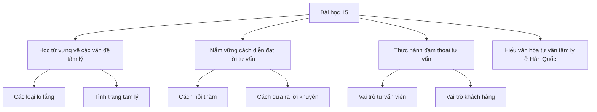
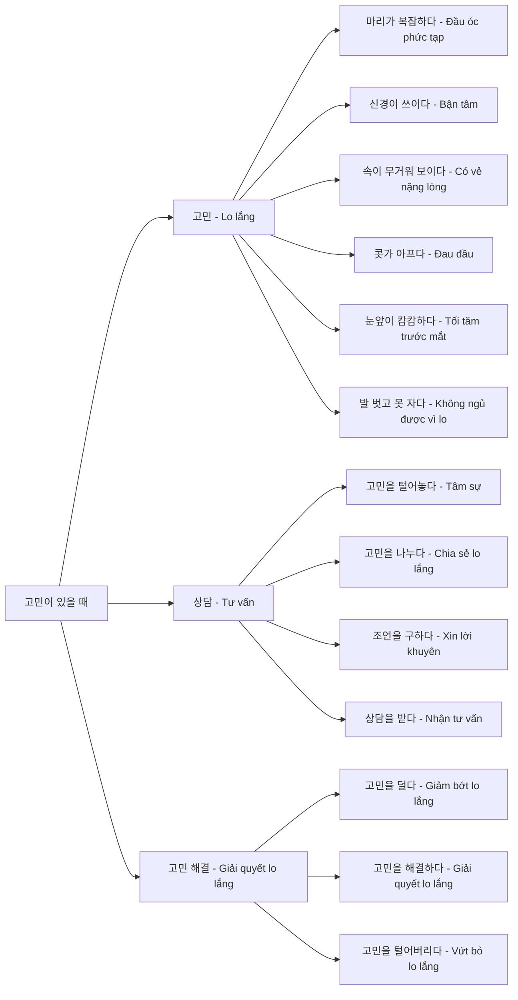
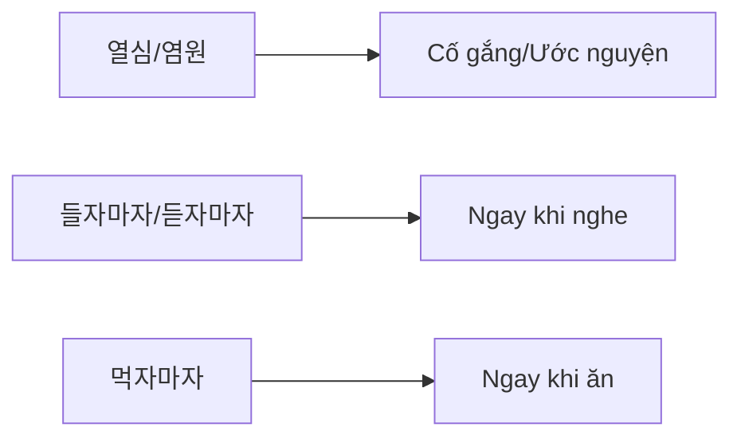
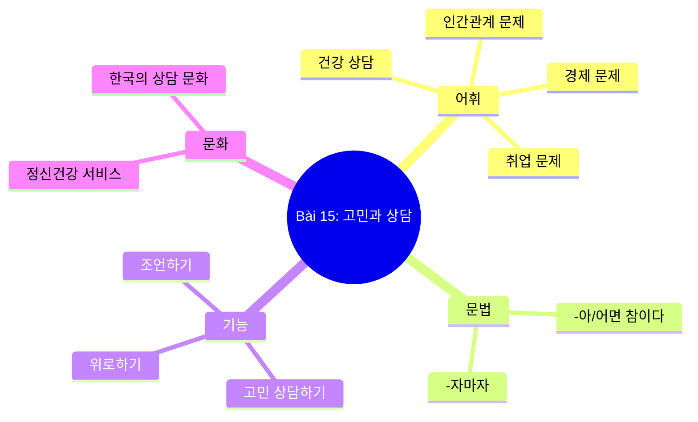

# Bài 15: Tâm sự với khách hàng - 고민과 상담 (Gomin-gwa Sangdam)

  <h2 className="text-xl font-bold text-green-800 mb-2">📚 Thông tin bài học</h2>
  <ul className="list-disc pl-6 text-green-700">
    <li><strong>Chủ đề:</strong> Nhân quản, tâm lý</li>
    <li><strong>Ngữ pháp:</strong> -아/어면 참이다 (nếu... thì tốt)</li>
    <li><strong>Cấu trúc:</strong> -자마자 (ngay khi...)</li>
    <li><strong>Hoạt động:</strong> Tư vấn tâm lý cho khách hàng và nhân viên</li>
    <li><strong>Văn hóa & Thông tin:</strong> Trung tâm tư vấn ở Hàn Quốc</li>
  </ul>

## 🎯 Mục tiêu học tập

## 📖 어휘 (Từ vựng)

  <h3 className="text-lg font-bold text-blue-800 mb-4">🔍 Các loại vấn đề tâm lý</h3>

### 1. 여러분은 요즘 고민이 있나요? (Gần đây bạn có lo lắng gì không?)

| **Loại vấn đề** | **Tiếng Hàn** | **Nghĩa tiếng Việt** |
|-----------------|---------------|---------------------|
| 인간관계 문제 | 인간관계 문제 | Vấn đề quan hệ con người |
| 건강 상담 문제 | 건강 상담 문제 | Vấn đề tư vấn sức khỏe |
| 육아 문제 | 육아 문제 | Vấn đề nuôi dạy con |
| 취업·직업 문제 | 취업·직업 문제 | Vấn đề việc làm, nghề nghiệp |
| 감정 문제 | 감정 문제 | Vấn đề cảm xúc |
| 경제 문제 | 경제 문제 | Vấn đề kinh tế |

### 2. 여러분은 고민이 있을 때 어떻게 해요? (Khi có lo lắng, bạn thường làm như thế nào?)

## 📝 문법 (Ngữ pháp)

### 1. -아/어면 참이다 (Nếu... thì tốt)

  <h4 className="font-bold text-yellow-800 mb-2">💡 Cấu trúc và cách dùng</h4>
  
Cấu trúc này dùng để diễn đạt ý kiến hoặc lời khuyên một cách lịch sự, thể hiện rằng nếu làm điều gì đó sẽ tốt.

#### Công thức:
- **Động từ/Tính từ + -으면/-면 + 참이다**

#### Ví dụ:

| **Câu gốc** | **Ý nghĩa** |
|-------------|-------------|
| 화해하고 싶으면 먼저 사과하세요. | Nếu muốn hòa giải thì hãy xin lỗi trước. |
| 네, 그럴지 않아도 사과하려던 참이었어요. | Vâng, tôi cũng đang định xin lỗi. |

#### 🎧 **[Audio 15-1]** Luyện tập các mẫu câu

### 2. -자마자 (Ngay khi...)

#### Công thức:
- **Động từ + -자마자**

#### Bảng chia động từ:

| **Từ gốc** | **Kết hợp -자마자** | **Nghĩa** |
|------------|-------------------|-----------|
| 듣다 | 들자마자 | ngay khi nghe |
| 와우다 | 와우자마자 | ngay khi đến |
| 먹다 | 먹자마자 | ngay khi ăn |
| 일어나다 | 일어나자마자 | ngay khi thức dậy |

#### Ví dụ:
- **지금을 사려던 참이었는데 친구가 먼저 미안하다고 했어요.**
  *(Tôi đang định mua ngay thì bạn đã xin lỗi trước.)*

## 💬 말하기 (Thực hành hội thoại)

### Tình huống 1: Tư vấn viên và khách hàng

  <h4 className="font-bold mb-2">🎭 Vai trò</h4>
  

    

      <strong>선생님 (Tư vấn viên):</strong> 어떤 일로 고민이세요? 저도 지금 먹으려던 참이었어요, 왜? 무슨 일 있어요?
    

    

      <strong>아나이스 (Khách hàng):</strong> 아니, 저 요즘 한국어 실력이 늘지 않는 것 같아서요. 단어장도 많은데 외우자마자 금방 잊어버려요, 어떻게 하죠?
    

  

#### 🎧 **[Audio 15-2]** Nghe và lặp lại cuộc đối thoại

### Mẫu câu thực hành:

1. **보기**와 같이 친구와 이야기해 보세요.

| **상황** | **응답** |
|----------|----------|
| 화해하고 싶으면 먼저 사과하세요. | 네, 그럴지 않아도 사과하려던 참이었어요. |

**Luyện tập:**

1) **나무 뭔들어 다른 사람에게 도움을 청해 보세요.** → **다른 사람에게 도움을 청하다**

2) **그런 문제는 상담을 한번 받아 보면 어때요?** → **상담을 받다**

3) **간장을 위해서는 운동을 꼭 해야 돼요.** → **간장을 위해서 운동하다**

4) **늦지 않으려면 지금 출발하는 게 좋을 거예요.** → **지금 출발하다**

### Tình huống 2: Chia sẻ với bạn bè

2. **친한 사람과 텔레파시가 통한 것이 있나요? '-으려던 참이다'를 이용해서 이야기해 보세요.**

  
"지금을 사려던 참이었는데 친구가 지금을 선물해 줬어요."

## 🎧 듣기 (Nghe hiểu)

### 1. 여러분은 취업 상담실에 가 본 적이 있습니까? 

**🎧 [Audio 15-3]** 

Hãy nghe và trả lời các câu hỏi:

1) **잡시드 씨는 지금 무슨 일을 합니까?**
   
   _________________________________

2) **잡시드 씨는 왜 이직을 하고 싶어 합니까?**
   
   _________________________________

3) **들은 내용과 같으면 ○, 다르면 × 하세요.**

| **Câu** | **○/×** |
|---------|---------|
| ① 잡시드 씨는 금여름 일당으로 받고 싶어 한다. | (　　) |
| ② 잡시드 씨는 고등학교 졸업 후에 바로 한국에 왔다. | (　　) |
| ③ 잡시드 씨는 운전면허증이 있다. | (　　) |

### Từ vựng hỗ trợ:

**🎧 [Audio 15-4]** Nghe lại để kiểm tra

## 📖 읽기 (Đọc hiểu)

### 1. 다음 건강 문제에 대해서 이야기해 보세요.

  

    
    
우울증

  

  

    
    
불면증

  

  

    
    
고혈압

  

  

    
    
당뇨

  

### 2. 다음의 우울증 체크 리스트를 보고 표시해 보세요.

| **지난 2주 동안에** | **전혀 없음** | **며칠 동안** | **1주일 이상** | **거의 매일** |
|-------------------|-------------|-------------|---------------|-------------|
| **1. 매사에 흥미나 즐거움이 거의 없다.** | | | | |
| **2. 기분이 가라앉거나 우울하거나 희망이 없다고 느낀다.** | | | | |
| **3. 잠들기 어렵거나 자주 깬다. 혹은 잠을 너무 많이 잔다.** | | | | |
| **4. 피곤하고 느리거나 기운이 거의 없다.** | | | | |
| **5. 식욕이 줄었다. 혹은 너무 많이 먹는다.** | | | | |
| **6. 내 자신이 실패자로 여겨지거나 자신과 가족을 실망시켰다고 느낀다.** | | | | |
| **7. 신문을 읽거나 TV를 보는 것과 같은 일상적인 일에 집중하기 어렵다.** | | | | |
| **8. 평소보다 말과 행동이 느리다. 혹은 너무 불안해서 가만히 없어 있을 수 없다.** | | | | |
| **9. 죽고 싶다는 생각을 한다.** | | | | |

### 3. 다음은 신문 기사입니다. 잘 읽고 질문에 답해 보세요.

  
○○신문 | 20XX년 4월 28일

  
  <h3 className="text-xl font-bold text-center mb-4">마음의 감기, 우울증 자가 진단과 극복 방법</h3>
  
  

    
우리는 삶면서 어떤 상황이나 사건으로 인해 일시적으로 기분이 우울해지는 것을 경험한다. 그러나 쉽게 회복하지 못하고 2주 이상 우울한 기분이 계속되면 우울증이 아닌지 의심해 볼 수 있다.

    
    
우울증은 마음의 감기라고도 하는데 실제로 현 명 중 한 명은 우울증에 걸린다고 보고된 정도로 흔한 병이다. 한국건강증진개발원은 우울증 자가 진단법을 소개하고 "우울증은 다른 몇몇 질병과 마찬가지로 빨리 발견하여 치료하는 것이 중요하다."고 덧붙였다.

    
    
우울증을 조기 진단과 치료하는 이점은 우울증에 대해 보고된 정보에 따르면 빨리 발견하여 치료한다면 빠르게 치료진과 치료과정을 상세기관에서 살펴볼 받을 수 있다. "정신건강위기상담전화(1577-0199)"를 통해 전화 상담을 받을 수 있다. 세계보건기구(WHO)는 우울하다고 느낄 때 ▲맺은 수 있는 사람과 자신의 감정을 이야기하기 ▲술·담배 피하기 ▲잠은 잘라리도 규칙적으로 운동하기 ▲가족·친구와 관계 및 연락 유지하기 등을 극복 방법으로 권하고 있다.

  

#### 질문:

1) **윗글의 중심 생각은 무엇입니까?**

   

     
단어

     
<strong>일시적</strong> 의심하다 보고되다

   

   ① 누구나 우울증에 걸릴 수 있다.
   
   ② 우울증은 노력하면 쉽게 극복할 수 있다.
   
   ③ 우울증은 빨리 발견하여 치료하는 것이 중요하다.
   
   ④ 자가 진단법을 통해 우울증을 정확하게 진단할 수 있다.

2) **윗글의 내용과 같으면 ○, 다르면 × 하세요.**

   ① 기분이 우울한 것을 모두 우울증이라고 한다. **( )**
   
   ② 살면서 90%의 사람이 우울증을 경험한다. **( )**
   
   ③ 우울할 때는 사람들과 자주 만나거나 연락하는 것이 좋다. **( )**

## ✍️ 쓰기 (Luyện tập viết)

### Bài tập tự luận

**아래 상황에 맞게 조언을 해 보세요.**

  

    <h4 className="font-bold text-blue-800 mb-3">고민 (Lo lắng)</h4>
    <ul className="space-y-2">
      <li>• 한국어 실력이 늘지 않는다.</li>
      <li>• 잠이 잘 안 온다.</li>
    </ul>
  

  
  

    <h4 className="font-bold text-green-800 mb-3">조언 (Lời khuyên)</h4>
    <ul className="space-y-2">
      <li>•</li>
      <li>•</li>
    </ul>
  

---

## 📚 문화와 정보 (Văn hóa và thông tin)

  <h3 className="text-lg font-bold text-indigo-800 mb-4">🇰🇷 Trung tâm tư vấn tâm lý ở Hàn Quốc</h3>
  
  

    
• <strong>정신건강위기상담전화 (1577-0199):</strong> Đường dây nóng tư vấn khủng hoảng tâm lý 24/7

    
• <strong>학생상담센터:</strong> Trung tâm tư vấn sinh viên tại các trường đại học

    
• <strong>직장인 EAP:</strong> Chương trình hỗ trợ nhân viên tại các công ty

    
• <strong>온라인 상담:</strong> Tư vấn trực tuyến qua các nền tảng digital

  

## 🎯 정리 (Tổng kết)

### 핵심 표현 정리:

| **상황** | **표현** | **사용 예** |
|----------|----------|-------------|
| **고민을 털어놓을 때** | -려던 참이다 | 지금 상담받으려던 참이에요 |
| **조언할 때** | -으면 참이다 | 운동하면 참 좋을 텐데요 |
| **즉시성 표현** | -자마자 | 들자마자 기분이 좋아졌어요 |

---

  <h4 className="font-bold text-green-800">🎓 과제 (Bài tập về nhà)</h4>
  <ol className="list-decimal list-inside text-green-700 mt-2">
    <li>완전한 우울증 자가 진단을 해보고 결과를 일기로 써보세요.</li>
    <li>가족이나 친구의 고민을 들어보고 '-으면 참이다'를 사용해서 조언해보세요.</li>
    <li>다음 시간까지 한국의 정신건강 관련 기사를 하나 찾아 읽어보세요.</li>
  </ol>

**🎧 [Audio 15-Full]** Nghe lại toàn bộ bài học