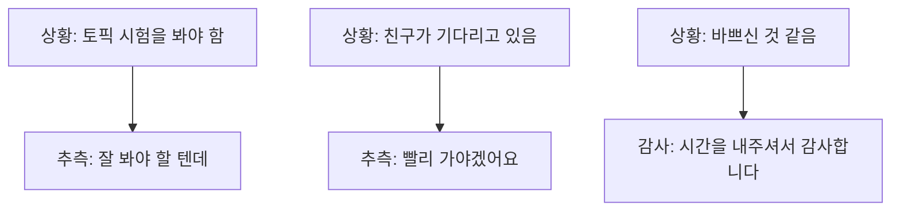
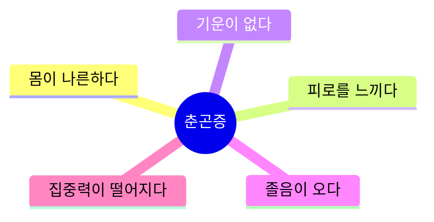
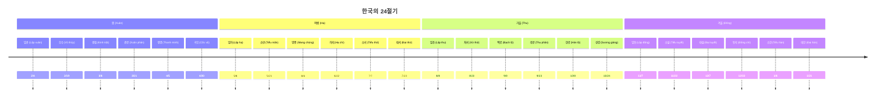

# Bài 16: 기후와 날씨 (Khí hậu và Thời tiết)

## 🎯 Mục tiêu học tập

<div className="bg-blue-50 border-l-4 border-blue-400 p-4 mb-6">
  <h3 className="text-lg font-semibold text-blue-800 mb-2">Sau khi hoàn thành bài học này, học viên sẽ có thể:</h3>
  <ul className="list-disc list-inside text-blue-700 space-y-1">
    <li>Mô tả thời tiết và sự thay đổi của cơ thể theo thời tiết</li>
    <li>Sử dụng thành thạo cấu trúc ngữ pháp -을 텐데 và -어 있다</li>
    <li>Thay đổi kế hoạch phù hợp với thời tiết</li>
    <li>Cung cấp thông tin liên quan đến thời tiết</li>
    <li>Hiểu về 24 tiết khí của Hàn Quốc</li>
  </ul>
</div>

---

## 📖 Phần 1: Từ vựng (어휘)

### 1.1 Thông tin thời tiết từ ứng dụng

| Tiếng Hàn | Tiếng Việt | Ví dụ |
|------------|------------|--------|
| 날씨 | thời tiết | 오늘 날씨가 어때요? |
| 체감 온도 | nhiệt độ cảm nhận | 체감 온도 5°C |
| 맑음 | quang đãng | 내일은 맑을 거예요 |
| 최저 기온 | nhiệt độ thấp nhất | 최저 기온 -2°C |
| 최고 기온 | nhiệt độ cao nhất | 최고 기온 15°C |
| 습도 | độ ẩm | 습도 60% |
| 비올 확률 | xác suất mưa | 비올 확률 30% |
| 미세먼지 | bụi mịn PM10 | 미세먼지 보통 |
| 일교차가 크다 | chênh lệch nhiệt độ trong ngày lớn | 오늘은 일교차가 커요 |
| 비가 그치다 | mưa tạnh | 오후부터 비가 그쳐요 |
| 날이 개다 | trời quang | 내일은 날이 개요 |
| 영하로 떨어지다 | xuống dưới 0 độ | 밤에 영하로 떨어져요 |

### 1.2 Cảnh báo thời tiết và biện pháp ứng phó

| Cảnh báo | Tiếng Việt | Biện pháp |
|----------|------------|-----------|
| 미세먼지 주의보 | cảnh báo bụi mịn | 외출 시 마스크를 쓰세요 |
| 폭염 주의보 | cảnh báo nắng nóng | 물을 많이 마셔야 해요 |
| 호우경보 | cảnh báo mưa lớn | 하천 주변 주민은 대피하세요 |
| 한파경보 | cảnh báo rét đậm | 가능하면 외출을 하지 마세요 |

---

## 📝 Phần 2: Ngữ pháp (문법)

### 2.1 문법 1: -을 텐데

<div className="bg-yellow-50 border border-yellow-200 rounded-lg p-4 mb-4">
  <h4 className="font-semibold text-yellow-800 mb-2">✨ Định nghĩa</h4>
  <p className="text-yellow-700">Biểu thị sự suy đoán của người nói về một nội dung nào đó.</p>
</div>

#### Cách chia:

| Dạng gốc | Cách chia | Ví dụ |
|----------|-----------|-------|
| Động từ tận cùng bằng phụ âm | -을 텐데 | 먹다 → 먹을 텐데 |
| Động từ tận cùng bằng nguyên âm | -ㄹ 텐데 | 오다 → 올 텐데 |
| Tính từ tận cùng bằng phụ âm | -을 텐데 | 많다 → 많을 텐데 |
| Tính từ tận cùng bằng nguyên âm | -ㄹ 텐데 | 비싸다 → 비쌀 텐데 |
| Động từ có ㄹ cuối | Bỏ ㄹ + -ㄹ 텐데 | 불다 → 불 텐데 |

#### Ví dụ minh họa:



**Ví dụ câu:**
- 가: 이번에 토픽 시험 보지요?
- 나: 네. 잘 봐야 할 텐데 걱정이에요.
- 바쁘실 텐데 시간을 내주셔서 감사합니다.

### 2.2 문법 2: -어 있다

<div className="bg-green-50 border border-green-200 rounded-lg p-4 mb-4">
  <h4 className="font-semibold text-green-800 mb-2">✨ Định nghĩa</h4>
  <p className="text-green-700">Biểu thị trạng thái tiếp tục sau khi một việc nào đó đã kết thúc.</p>
</div>

#### Cách chia:

| Dạng gốc | Cách chia | Ví dụ |
|----------|-----------|-------|
| Động từ có nguyên âm ㅏ, ㅗ | -아 있다 | 앉다 → 앉아 있다 |
| Động từ có nguyên âm khác | -어 있다 | 들다 → 들어 있다 |
| 하다 | -해 있다 | 정지하다 → 정지해 있다 |

**Ví dụ câu:**
- 가: 누가 안젤라 씨예요?
- 나: 저기 과장님 옆에 앉아 있는 사람이에요.
- 이 커피에는 설탕이 안 들어 있어요.

---

## 🗣️ Phần 3: Luyện tập nói (말하기)

### 3.1 Thay đổi kế hoạch theo thời tiết

**🎧 Đoạn hội thoại mẫu:** *[Audio: 16-S1.mp3]*

```
아나이스: 일기 예보 봤어요? 내일 미세먼지가 심하대요. 
         기온도 많이 떨어지고요.

라민:   아, 체육 대회 하기로 한 날에 날씨가 이래서 걱정이에요.

아나이스: 그러게요. 사람들이 날씨 때문에 힘들어할 텐데 괜찮을까요?

라민:   아니요. 내일 같은 날에 야외 행사는 무리예요. 
        체육 대회를 다른 날로 연기하는 게 어때요?

아나이스: 그게 낫겠죠? 제가 빨리 사람들에게 연락할게요.
```

### 3.2 Bảng tình huống luyện tập

| Tình huống thời tiết | Sự kiện | Giải pháp |
|----------------------|---------|-----------|
| 미세먼지가 심하다, 기온이 많이 떨어지다 | 체육대회 | 다른 날로 연기하다 |
| 최고 기온이 33도, 습도 80% | 야유회 | 식사만 하다 |
| 호우 경보 | 여행 | 연기하거나 취소 |
| 폭염 주의보 | 야외 근무 | 실내 활동으로 변경 |

---

## 👂 Phần 4: Luyện tập nghe (듣기)

### 4.1 Dự báo thời tiết trên TV

**🎧 File nghe:** *[Audio: 16-L.mp3]*

#### Bài tập 1: Dự báo thời tiết Daegu
Nghe và đánh dấu ○ (đúng) hoặc × (sai):

1. ① 오늘은 날이 맑지만 미세먼지가 심할 것이다. ( )
2. ② 일교차가 크기 때문에 옷차림을 조심해야 한다. ( )

#### Bài tập 2: Dự báo thời tiết Seoul - Gyeonggi
1. ① 주말에도 몹시 더울 것이다. ( )
2. ② 내일은 하루 종일 비가 올 것이다. ( )

### 4.2 Luyện phát âm

**🎧 File nghe:** *[Audio: 16-P.mp3]*

| Câu gốc | Phát âm | Ghi chú |
|---------|---------|---------|
| 날씨가 맑아 | [날씨가 말가] | ㅅ → ㄹ |
| 맑고 | [말꼬] | ㅅ → ㄹ, ㅗ → ㅗ |
| 맑지만 | [막찌만] | ㅅ → ㄱ |

---

## 📚 Phần 5: Đọc hiểu (읽기)

### 5.1 Triệu chứng mùa xuân (춘곤증)

<div className="bg-purple-50 border border-purple-200 rounded-lg p-4">
  <h4 className="font-semibold text-purple-800 mb-3">🌸 Tìm hiểu về Chungonjung (춘곤증)</h4>
</div>

#### Các triệu chứng thường gặp:



#### Bài đọc: "봄에 온몸이 나른하면?"

**Định nghĩa:** 춘곤증은 봄철에 몸에 특별한 병이 없는데도 온몸이 나른하고 졸음이 오거나 쉽게 피로를 느끼는 상태를 말한다.

**Nguyên nhân:** 겨울에서 봄으로 바뀌는 계절 변화에 몸이 적응하지 못했기 때문이다.

#### Phương pháp phòng ngừa:

| Biện pháp | Chi tiết |
|-----------|----------|
| **운동** | 조금씩 자주 하기, 2-3시간마다 스트레칭 |
| **영양** | 비타민 B, C가 많은 채소와 과일 (평소보다 3-5배 더 필요) |
| **수면** | 하루 7-8시간 푹 자기 |

#### Câu hỏi kiểm tra:

1. 춘곤증의 증상에는 무엇이 있습니까?
2. 춘곤증은 왜 생깁니까?
3. 예방 방법으로 맞으면 ○, 틀리면 × 하세요:
   - ① 운동은 한 번에 오랫동안 하는 것이 좋다. ( )
   - ② 평소보다 채소와 과일을 더 먹어야 한다. ( )
   - ③ 하루에 7-8시간 정도 푹 자야 한다. ( )

---

## ✍️ Phần 6: Luyện viết (쓰기)

### 6.1 Thông tin thời tiết quê hương

#### Bảng so sánh thời tiết các nước:

| 나라 | 날씨 특징 | 주의할 점 |
|------|-----------|-----------|
| 한국 | 겨울에 춥고 건조하다 | 독감 유행 - 손 잘 씻기, 미세먼지 - 마스크 착용 |
| 베트남 | 여름에 덥고 습하다 | 태풍 조심, 모기 주의 |

### 6.2 Bài tập viết email

**Đề bài:** 여러분의 고향으로 여행을 가려는 친구에게 현지 날씨와 주의할 점을 알리는 이메일을 써 보세요.

<div className="bg-gray-50 border border-gray-300 rounded-lg p-4">
  <div className="border-b pb-2 mb-3">
    <strong>받는 사람:</strong> friend@email.com<br />
    <strong>제목:</strong> 베트남 여행 날씨 정보
  </div>
  
  <div className="space-y-3">
    <p><strong>인사:</strong></p>
    <p>안녕하세요! 베트남 여행 계획 어떻게 되어 가요?</p>
    
    <p><strong>날씨 정보:</strong></p>
    <p>이번 달 베트남은...</p>
    
    <p><strong>주의사항:</strong></p>
    <p>여행할 때 주의할 점은...</p>
    
    <p><strong>마무리:</strong></p>
    <p>좋은 여행 되시길 바라요!</p>
  </div>
</div>

---

## 🏛️ Phần 7: Văn hóa và Thông tin (문화와 정보)

### 7.1 24 tiết khí của Hàn Quốc (한국의 절기)



---

## 📋 Phần 8: Tổng kết và Bài tập

### 8.1 Bảng tổng hợp từ vựng quan trọng

| Chủ đề | Từ vựng chính |
|--------|---------------|
| **날씨** | 날씨, 맑음, 흐림, 비, 눈, 바람 |
| **온도** | 기온, 체감온도, 최고기온, 최저기온, 영하 |
| **경보** | 주의보, 경보, 미세먼지, 폭염, 호우, 한파 |
| **몸의 변화** | 춘곤증, 나른하다, 피로하다, 졸리다 |

### 8.2 Cấu trúc ngữ pháp quan trọng

1. **-을 텐데**: Suy đoán + Ngữ cảnh
   - 비가 올 텐데 우산을 가져가세요.

2. **-어 있다**: Trạng thái tiếp tục
   - 창문이 열려 있어요.

### 8.3 Checklist tự kiểm tra

<div className="bg-blue-50 border border-blue-200 rounded-lg p-4">
  <h4 className="font-semibold text-blue-800 mb-3">✅ Tôi đã có thể:</h4>
  <div className="space-y-2 text-blue-700">
    <div><input type="checkbox" /> Mô tả thời tiết bằng tiếng Hàn</div>
    <div><input type="checkbox"/> Sử dụng -을 텐데 để suy đoán</div>
    <div><input type="checkbox"/> Sử dụng -어 있다 để mô tả trạng thái</div>
    <div><input type="checkbox" /> Thay đổi kế hoạch theo thời tiết</div>
    <div><input type="checkbox" /> Hiểu thông tin dự báo thời tiết</div>
    <div><input type="checkbox" /> Viết email về thời tiết quê hương</div>
  </div>
</div>

---

## 🎯 Bài tập mở rộng

1. **Thực hành hàng ngày**: Xem dự báo thời tiết bằng tiếng Hàn và mô tả bằng lời
2. **Ghi chú thời tiết**: Viết nhật ký thời tiết hàng ngày bằng tiếng Hàn
3. **Thảo luận nhóm**: Thảo luận về khí hậu quê hương với bạn bè người Hàn

---

*Chúc các bạn học tốt! 화이팅! 💪*