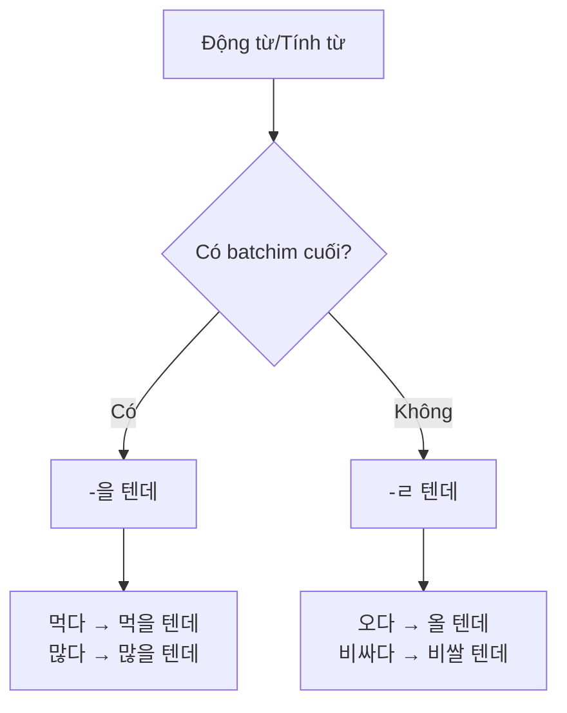
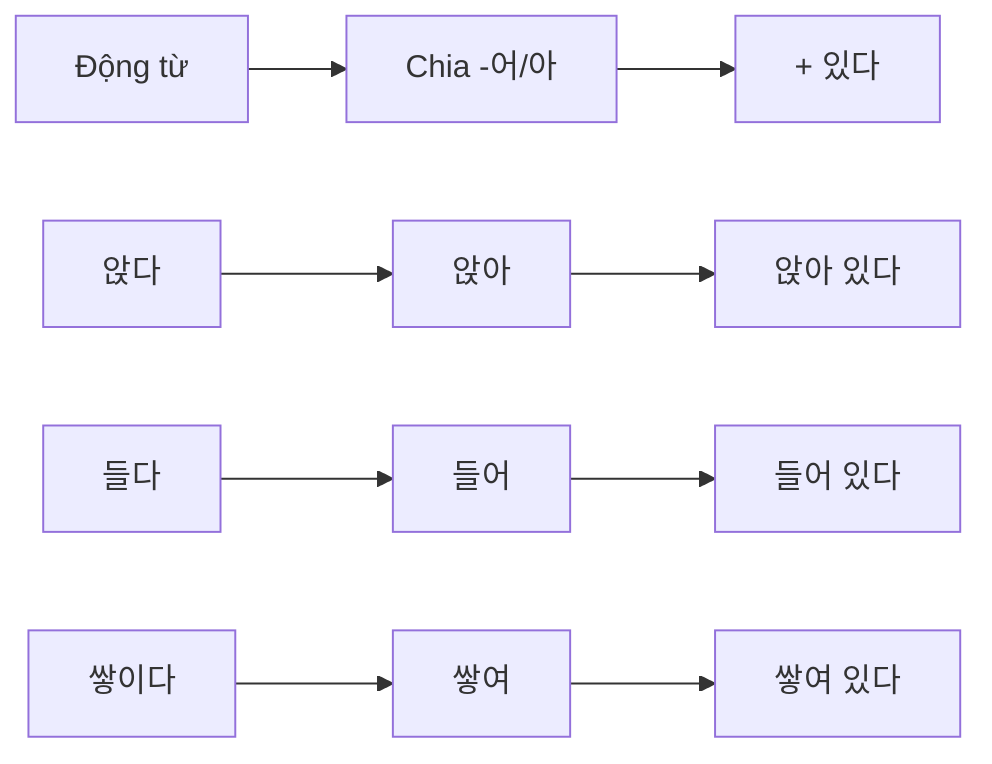
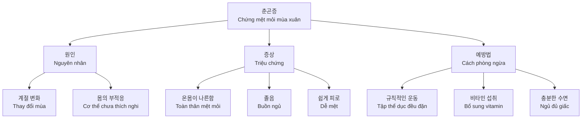

# Bài 16: 기후와 날씨 (Khí hậu và Thời tiết)

## 🎯 Mục tiêu bài học

- **Từ vựng**: Học các từ vựng về thời tiết và những thay đổi của cơ thể theo thời tiết
- **Ngữ pháp**: Nắm vững cách sử dụng `-을/ㄹ 텐데` và `-어/아 있다`
- **Kỹ năng**: Biết cách thay đổi kế hoạch phù hợp với thời tiết và cung cấp thông tin về thời tiết
- **Văn hóa**: Hiểu về các tiết khí của Hàn Quốc

---

## 📱 Tình huống mở đầu

📱

<strong>Tình huống:</strong> Bạn đang xem ứng dụng thời tiết trên điện thoại và thảo luận với bạn về kế hoạch hoạt động ngoài trời.

**Câu hỏi thảo luận:**
- 지금 날씨가 어때요? (Bây giờ thời tiết như thế nào?)
- 이런 날씨에 사람들은 어떻게 행동해요? (Trong thời tiết như này, mọi người hành động như thế nào?)
- 여러분의 고향에도 이런 날씨가 있어요? (Quê hương của bạn cũng có thời tiết như này không?)

---

## 📚 Từ vựng cơ bản

### 1. Thời tiết và ứng dụng dự báo

| Tiếng Hàn | Tiếng Việt | Ví dụ |
|-----------|------------|-------|
| 날씨 | thời tiết | 오늘 날씨가 어때요? |
| 체감 온도 | nhiệt độ cảm nhận | 체감 온도 5℃ |
| 맑음 | quang đãng | 내일은 맑아요 |
| 최저 기온 | nhiệt độ thấp nhất | 최저 기온 -2℃ |
| 최고 기온 | nhiệt độ cao nhất | 최고 기온 15℃ |
| 습도 | độ ẩm | 습도 60% |
| 비올 확률 | xác suất có mưa | 비올 확률 30% |
| 미세먼지 | bụi mịn | 미세먼지 보통 |

### 2. Hiện tượng thời tiết đặc biệt

| Tiếng Hàn | Tiếng Việt | Mô tả |
|-----------|------------|-------|
| 일교차가 크다 | chênh lệch nhiệt độ lớn | sự khác biệt nhiệt độ ngày và đêm |
| 비가 그치다 | mưa tạnh | mưa ngừng |
| 날이 개다 | trời quang | trời tạnh mưa |
| 영하로 떨어지다 | xuống dưới 0 độ | nhiệt độ âm |

### 3. Cảnh báo thời tiết

| Cảnh báo | Tiếng Hàn | Hành động cần thiết |
|----------|-----------|-------------------|
| **미세먼지 주의보** | Cảnh báo bụi mịn | 외출 시 마스크를 쓰세요 |
| **폭염 주의보** | Cảnh báo nắng nóng | 물을 많이 마셔야 해요 |
| **호우 경보** | Cảnh báo mưa lớn | 하천 주변 주민은 대피하세요 |
| **한파 경보** | Cảnh báo rét đậm | 가능하면 외출을 하지 마세요 |

---

## 📖 Ngữ pháp chính

### 1. `-을/ㄹ 텐데` (Diễn tả phỏng đoán, dự đoán)

<h4 className="text-green-800 font-semibold mb-2">💡 Ý nghĩa</h4>

Diễn tả sự phỏng đoán, dự đoán của người nói về một tình huống nào đó.

#### Cách chia:

#### Bảng chia động từ:

| Dạng gốc | Có batchim | Không có batchim |
|----------|------------|------------------|
| 먹다 (ăn) | 먹을 텐데 | - |
| 오다 (đến) | - | 올 텐데 |
| 많다 (nhiều) | 많을 텐데 | - |
| 비싸다 (đắt) | - | 비쌀 텐데 |

#### Ví dụ:

| Câu mẫu | Nghĩa |
|---------|-------|
| 바쁘실 텐데 시간을 내 주셔서 감사합니다 | Anh/chị chắc bận lắm nhưng cảm ơn anh/chị đã dành thời gian |
| 친구가 기다리고 있을 텐데 빨리 가야겠어요 | Bạn đang đợi rồi nên tôi phải đi nhanh thôi |
| 오후에 비가 올 텐데 우산을 가지고 가세요 | Chiều sẽ mưa nên hãy mang theo ô |

### 2. `-어/아 있다` (Diễn tả trạng thái duy trì)

<h4 className="text-blue-800 font-semibold mb-2">💡 Ý nghĩa</h4>

Diễn tả trạng thái được duy trì sau khi một hành động đã kết thúc.

#### Cách chia:

#### Bảng chia động từ:

| Động từ gốc | Chia -어/아 | + 있다 |
|-------------|-------------|---------|
| 앉다 (ngồi) | 앉아 | 앉아 있다 |
| 오다 (đến) | 와 | 와 있다 |
| 들다 (vào) | 들어 | 들어 있다 |
| 쌓이다 (chồng) | 쌓여 | 쌓여 있다 |

#### Ví dụ:

| Câu mẫu | Nghĩa |
|---------|-------|
| 저기 과장님 옆에 앉아 있는 사람이에요 | Đó là người đang ngồi bên cạnh trưởng phòng |
| 이 커피에는 설탕이 안 들어 있어요 | Cà phê này không có đường |
| 친구에게 전화했는데 전원이 꺼져 있어요 | Gọi cho bạn nhưng máy đang tắt |

---

## 🗣️ Hội thoại mẫu

### [🔊 Audio 16-S.mp3](audio-placeholder)

**상황**: Thay đổi kế hoạch theo thời tiết

<strong>아나이스:</strong> 일기 예보 봤어요? 내일 미세먼지가 심하대요. 기온도 많이 떨어지고요.

<strong>라민:</strong> 아, 체육대회 하기로 한 날에 날씨가 이래서 걱정이에요.

<strong>아나이스:</strong> 그러게요. 사람들이 날씨 때문에 힘들어할 텐데 괜찮을까요?

<strong>라민:</strong> 아니요. 내일 같은 날에 야외 행사는 무리예요. 체육대회를 다른 날로 연기하는 게 어때요?

<strong>아나이스:</strong> 그게 낫겠죠? 제가 빨리 사람들에게 연락할게요.

**Phân tích hội thoại:**
- **일기예보**: dự báo thời tiết
- **미세먼지가 심하다**: bụi mịn nặng
- **무리예요**: quá sức, khó khăn
- **연기하다**: hoãn lại

---

## 🎧 Luyện nghe

### [🔊 Audio 16-L.mp3](audio-placeholder)

**듣기 1**: 뉴스의 일기 예보입니다. 잘 듣고 질문에 답해 보세요.

#### 대구 날씨에 대해 들은 내용과 같으면 ○, 다르면 ✗ 하세요.

1) ○ 오늘은 날이 맑지만 미세먼지가 심할 것이다.
2) ○ 일교차가 크기 때문에 옷차림을 조심해야 한다.

#### 서울 경기 날씨에 대해 들은 내용과 같으면 ○, 다르면 ✗ 하세요.

1) ✗ 주말에도 몹시 더울 것이다.
2) ✗ 내일은 하루 종일 비가 올 것이다.

### 발음 연습

### [🔊 Audio 16-P.mp3](audio-placeholder)

**다음을 듣고 따라 읽으세요:**

1) 날씨가 맑아 나들이하기 좋겠습니다.
2) 오늘은 맑고 미세먼지 농도가 낮겠습니다.  
3) 오전에는 날씨가 맑지만 오후에는 점차 흐려지겠습니다.

#### 발음 규칙

| 표기 | 발음 | 규칙 설명 |
|-----|------|----------|
| 맑아 | [말가] | ㄱ + ㅏ → [가] |
| 맑고 | [말꼬] | ㄱ + ㄱ → [꼬] |
| 맑지만 | [막찌만] | ㄱ + ㅈ → [찌] |

---

## 📖 Đọc hiểu: Chứng mệt mỏi mùa xuân

### Từ vựng chuyên đề sức khỏe

| Tiếng Hàn | Tiếng Việt | Ví dụ |
|-----------|------------|-------|
| 춘곤증 | chứng mệt mỏi mùa xuân | 봄에 춘곤증이 생겨요 |
| 몸이 나른하다 | người mệt mỏi | 온몸이 나른해요 |
| 피로를 느끼다 | cảm thấy mệt | 쉽게 피로를 느껴요 |
| 기운이 없다 | không có sức lực | 오늘 기운이 없어요 |
| 졸음이 오다 | buồn ngủ | 자꾸 졸음이 와요 |
| 집중력이 떨어지다 | giảm khả năng tập trung | 집중력이 떨어져서 일이 안 돼요 |

### Nguyên nhân và cách phòng ngừa

---

## ✍️ Bài tập thực hành

### Bài tập 1: `-을/ㄹ 텐데`로 문장을 완성하세요.

1. 날씨가 춥**을 텐데** 두꺼운 옷을 입는 게 어때요?
2. 미세먼지가 심**할 텐데** 마스크를 쓰는 게 좋겠어요.
3. 길이 막힐**텐데** 지하철을 타는 게 어때요?

### Bài tập 2: `-어/아 있다`로 상태를 설명하세요.

**그림을 보고 문장을 만드세요:**

<strong>보기:</strong> 
고천 씨가 소파에 <u>앉아 있어요</u>

<strong>연습:</strong> 
1. 볼펜이 바닥에 <u>떨어져 있어요</u> 
2. 창문이 <u>닫혀 있어요</u> 
3. 시계가 벽에 <u>걸려 있어요</u> 
4. 컵이 탁자 위에 <u>놓여 있어요</u>

### Bài tập 3: 이메일 쓰기

**상황**: 고향으로 여행을 가려는 친구에게 현지 날씨와 주의할 점을 알리는 이메일을 써 보세요.

<strong>받는 사람:</strong> _____________

<strong>제목:</strong> _____________

<strong>내용:</strong>

{/* 이메일 작성 공간 */}
안녕하세요! 
 
요즘 우리나라 날씨는... 
 
주의할 점은... 
 
즐거운 여행 되세요!

---

## 🏛️ Văn hóa Hàn Quốc: Các tiết khí (절기)

<h3 className="text-green-800 font-semibold mb-3">🌸 24 tiết khí của Hàn Quốc</h3>

Người Hàn chia năm thành 24 tiết khí để mô tả sự thay đổi của thời tiết và thiên nhiên:

<strong>봄 (Xuân)</strong> 
입춘, 우수, 경칩 
춘분, 청명, 곡우

<strong>여름 (Hạ)</strong> 
입하, 소만, 망종 
하지, 소서, 대서

<strong>가을 (Thu)</strong> 
입추, 처서, 백로 
추분, 한로, 상강

<strong>겨울 (Đông)</strong> 
입동, 소설, 대설 
동지, 소한, 대한

---

## 📝 Tổng kết bài học

### Điểm quan trọng cần nhớ:

1. **Ngữ pháp `-을/ㄹ 텐데`**: Dùng để phỏng đoán, dự đoán
2. **Ngữ pháp `-어/아 있다`**: Diễn tả trạng thái được duy trì
3. **Từ vựng thời tiết**: Quan trọng trong giao tiếp hàng ngày
4. **Cách thay đổi kế hoạch**: Linh hoạt theo điều kiện thời tiết

### Cấu trúc câu hữu ích:
- **날씨가 어때요?** - Thời tiết như thế nào?
- **~할 텐데 조심하세요** - Có lẽ sẽ ~ nên hãy cẩn thận
- **날씨 때문에 ~** - Vì thời tiết nên ~

---

## 🔍 자기 평가 (Tự kiểm tra)

<h4 className="font-semibold mb-3">💯 다음 과제를 해 보세요</h4>
<ol className="list-decimal list-inside space-y-2">
<li><code>-을/ㄹ 텐데</code>를 사용해서 날씨 예측 문장 5개를 만드세요</li>
<li><code>-어/아 있다</code>를 사용해서 교실을 설명하세요</li>
<li>춘곤증을 예방하는 방법 3가지를 한국어로 쓰세요</li>
<li>날씨 때문에 계획을 바꾸는 이유를 설명하세요</li>
</ol>

---

**🎯 Bài tiếp theo**: Bài 17 - 교통 (Giao thông)