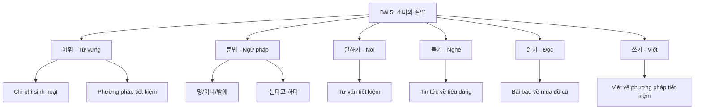
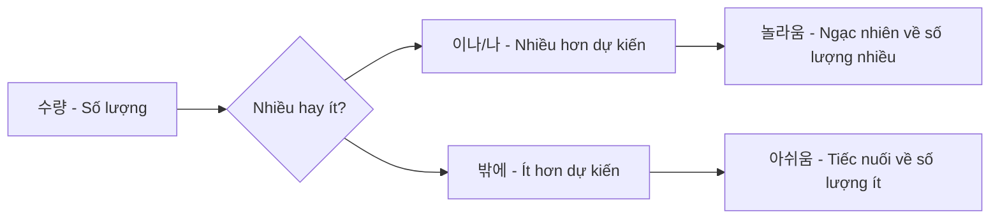
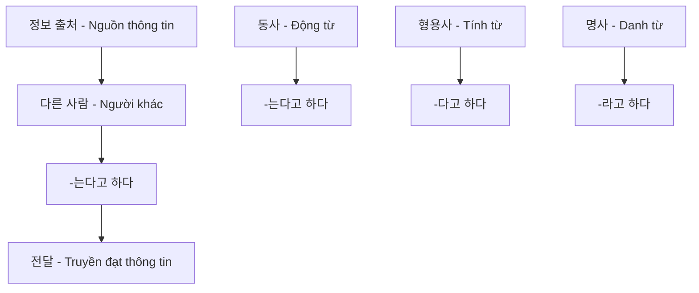
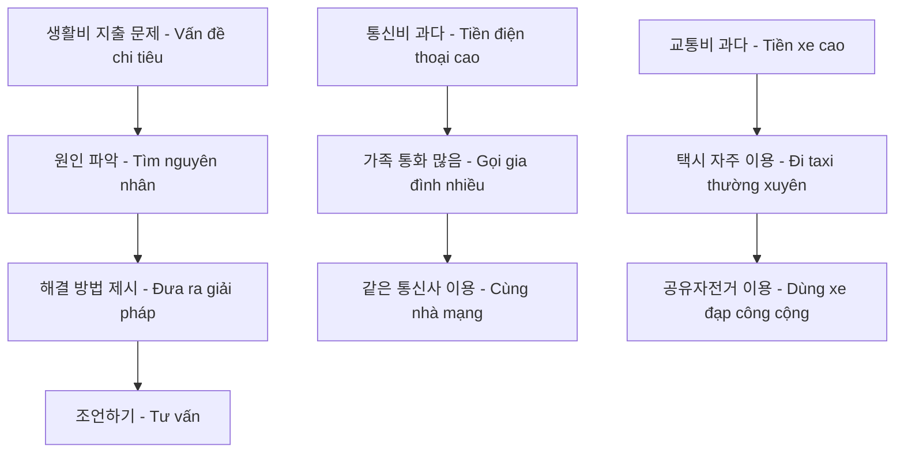
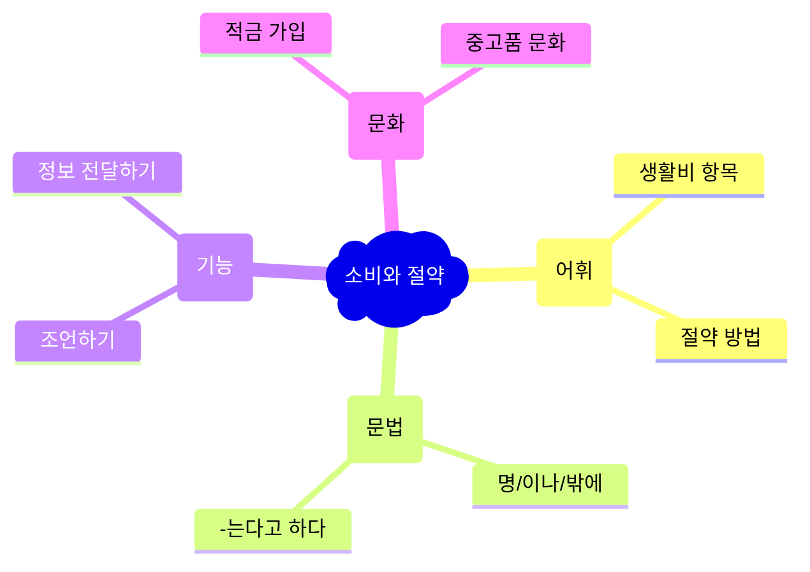

# Bài 5: 소비와 절약 (Tiêu dùng và tiết kiệm)

<h2 className="text-xl font-bold text-blue-800 mb-2">📋 Mục tiêu bài học</h2>
<ul className="list-disc list-inside text-blue-700 space-y-1">
<li><strong>Từ vựng:</strong> Học các từ về tiêu dùng, phương pháp tiết kiệm</li>
<li><strong>Ngữ pháp:</strong> 명/이나/밖에, -는다고 하다</li>
<li><strong>Hoạt động:</strong> Tư vấn về tiết kiệm, viết bài giới thiệu phương pháp tiết kiệm chi phí sinh hoạt</li>
<li><strong>Văn hóa:</strong> Tìm hiểu về việc gửi tiền tiết kiệm tại Hàn Quốc</li>
</ul>

## 📊 Biểu đồ cấu trúc bài học

## 💰 PHẦN I: TỪ VỰNG (어휘)

### 1. Các loại chi phí sinh hoạt có gì? Hãy thảo luận.

| **지출항목** (Khoản chi tiêu) | **예시** (Ví dụ)      | **설명** (Giải thích) |
| ----------------------------- | --------------------- | --------------------- |
| 식비                          | 점심값, 커피          | Chi phí ăn uống       |
| 교통비                        | 택시비, 교통카드 충전 | Chi phí đi lại        |
| 통신비                        | 휴대전화요금          | Chi phí viễn thông    |
| 교육비                        | 영어학원              | Chi phí giáo dục      |
| 의료비                        | 두통약                | Chi phí y tế          |
| 공과금                        | 전기요금              | Tiền điện, nước, gas  |
| 경조사비                      | 축의금                | Chi phí lễ nghi       |
| 문화생활비                    | 영화관람              | Chi phí giải trí      |

### 2. Để tiết kiệm chi phí sinh hoạt thì phải làm thế nào?

<h4 className="font-bold text-green-600 mb-2">🛒 Mua sắm thông minh</h4>
<ul className="space-y-2 text-sm">
<li>• 살 것을 미리 메모하다 - Ghi chép trước những gì cần mua</li>
<li>• 할인카드로 결제하다 - Thanh toán bằng thẻ giảm giá</li>
<li>• 포인트를/쿠폰을 적립하다 - Tích lũy điểm/coupon</li>
</ul>

<h4 className="font-bold text-red-600 mb-2">⚠️ Tránh tiêu dùng bừa bãi</h4>
<ul className="space-y-2 text-sm">
<li>• 충동구매를 하지 않다 - Không mua hàng bốc đồng</li>
<li>• 가계부를 쓰다 - Ghi sổ thu chi</li>
</ul>

### Từ vựng bổ sung

| **한국어** | **Tiếng Việt**          | **한국어** | **Tiếng Việt** |
| ---------- | ----------------------- | ---------- | -------------- |
| 생활비     | Chi phí sinh hoạt       | 절약       | Tiết kiệm      |
| 지출       | Chi tiêu                | 할인       | Giảm giá       |
| 난방비     | Tiền sưởi ấm            | 보일러     | Lò sưởi        |
| 수리하다   | Sửa chữa                | 중고차     | Xe cũ          |
| 물려받다   | Được thừa hưởng         | 온도       | Nhiệt độ       |
| 통신사     | Nhà cung cấp viễn thông | 장을 보다  | Đi chợ         |
| 공유       | Chia sẻ                 | 틀다       | Bật (máy)      |

## 📚 PHẦN II: NGỮ PHÁP (문법)

### 1. 명/이나/밖에

<h4 className="font-bold mb-2">📌 Ý nghĩa và cách dùng</h4>

Biểu hiện số lượng <strong>lớn hơn dự kiến</strong> hoặc <strong>nhỏ hơn dự kiến</strong>

#### Quy tắc sử dụng:

| **Cách dùng**          | **Ví dụ**                | **Ý nghĩa**                |
| ---------------------- | ------------------------ | -------------------------- |
| **이나** (sau phụ âm)  | 16만원이나, 다섯 명이나  | Số lượng nhiều hơn dự kiến |
| **나** (sau nguyên âm) | 10개나, 두 대나          | Số lượng nhiều hơn dự kiến |
| **밖에** + phủ định    | 27,000원밖에 안 나왔어요 | Số lượng ít hơn dự kiến    |

#### Ví dụ minh họa:

<h5 className="font-bold text-green-700">✅ Ví dụ với 이나/나</h5>
<ul className="space-y-2 text-green-800">
<li>• 저는 하루에 커피를 <strong>다섯 잔이나</strong> 마셔요. (Tôi uống tới 5 cốc cà phê một ngày.)</li>
<li>• 12만 원<strong>이나</strong> 썼어요? 왜 그렇게 많이 썼어요? (Bạn đã tiêu tới 120,000 won? Sao lại tiêu nhiều thế?)</li>
</ul>

<h5 className="font-bold text-blue-700">✅ Ví dụ với 밖에</h5>
<ul className="space-y-2 text-blue-800">
<li>• 산지 1년<strong>밖에</strong> 안 됐는데 벌써 고장 난 거예요? (Mới mua có 1 năm thôi mà đã hỏng rồi sao?)</li>
<li>• 이번 달에는 통신비가 27,000원<strong>밖에</strong> 안 나왔어요. (Tháng này tiền điện thoại chỉ có 27,000 won thôi.)</li>
</ul>

### 2. -는다고 하다

<h4 className="font-bold mb-2">📌 Ý nghĩa và cách dùng</h4>

Chủ yếu dùng để <strong>truyền đạt nội dung nghe được từ người khác</strong>

#### Quy tắc chia:

| **Loại từ**        | **Cách chia** | **Ví dụ**                    |
| ------------------ | ------------- | ---------------------------- |
| **Động từ**        | -는다고 하다  | 물려받다 → 물려받는다고 하다 |
| **Tính từ**        | -다고 하다    | 싸다 → 싸다고 하다           |
| **Danh từ + 이다** | -라고 하다    | 가계부 → 가계부라고 하다     |

#### Ví dụ minh họa:

<strong>라민:</strong> 오늘부터 항공권 할인 행사가 <strong>시작된다고 해요</strong>.

<strong>친구:</strong> 그래요? 빨리 예약해야겠네요.

<em>Ramin: Nghe nói từ hôm nay bắt đầu có chương trình giảm giá vé máy bay.</em>

• 중고 매장에 가면 필요한 물건을 <strong>싸게 살 수 있다고 해요</strong>.

<em>Nghe nói đến cửa hàng đồ cũ thì có thể mua được những thứ cần thiết với giá rẻ.</em>

## 🗣️ PHẦN III: THỰC HÀNH NÓI (말하기)

### Bài tập 1: Thảo luận về chi tiêu

**Tình huống:** Hậu Ân đang nói chuyện với hàng xóm về chi phí sinh hoạt.

<h5 className="font-bold mb-2">🎭 Mẫu hội thoại</h5>

<strong>아주머니:</strong> 후엔 씨 뭘 그렇게 보고 있어요?

<strong>후엔:</strong> 이번 달 난방비가 29만 원이나 나왔어요. 생각보다 너무 많이 나와서 어떻게 해야 할지 모르겠어요.

<strong>아주머니:</strong> 어떻게 그렇게 많이 나왔어요?

<strong>후엔:</strong> 한국 겨울 날씨가 너무 추워서 계속 보일러를 틀었거든요.

<strong>아주머니:</strong> 그렇게 하면 안 돼요. 그럴 때는 온도를 조금 내리고 옷을 따뜻하게 입는 게 난방비를 절약할 수 있는 방법이라고 해요.

### Bài tập 2: Tình huống tư vấn tiết kiệm

## 👂 PHẦN IV: LUYỆN NGHE (듣기)

### 🎵 **[Audio 5-P.mp3]** - File nghe bài tập

### Bài tập nghe: Tin tức về đời sống tiêu dùng

**Hướng dẫn:** Nghe tin tức và trả lời các câu hỏi

#### Câu hỏi:

1. **주부 김미진 씨는 어떻게 가구를 저렴하게 샀다고 합니까?**
   (Bà nội trợ Kim Mi Jin đã mua đồ nội thất giá rẻ bằng cách nào?)

2. **20대 남자는 왜 인터넷에서 가격을 비교해 봅니까?**
   (Tại sao nam thanh niên 20 tuổi lại so sánh giá trên internet?)

3. **들은 내용과 같으면 ○, 다르면 × 하세요:**
   - ① 전시 상품은 새 상품보다 가격이 싸다. ( )
   - ② 계절과 반대되는 이월 상품은 저렴하게 살 수 있다. ( )
   - ③ 많은 사람들이 물건을 살 때 실제 매장에 가서 산다. ( )

### 🔊 Luyện phát âm

**Quy tắc phát âm khi gặp ㄱ,ㄷ,ㅂ,ㅅ,ㅈ + ㄱ,ㄷ,ㅂ:**

| **Từ gốc** | **Phát âm**  | **Ví dụ trong câu**                  |
| ---------- | ------------ | ------------------------------------ |
| 있었다고   | [이썸따고]   | 저렴하게 살 수 있었다고 합니다       |
| 있습니다   | [임씀니다]   | 할인된 가격에 구입할 수 있습니다     |
| 틀었거든요 | [트럴꺼든요] | 너무 추워서 계속 보일러를 틀었거든요 |

## 📖 PHẦN V: LUYỆN ĐỌC (읽기)

### Bài đọc: "좋은 물건 싸게 사는 법" (Cách mua đồ tốt giá rẻ)

<h4 className="font-bold text-green-700 mb-2">✅ CHECK LIST - Danh sách kiểm tra</h4>
<ul className="space-y-2 text-green-800">
<li>☐ 인터넷에서 가격 비교를 한다 - So sánh giá trên internet</li>
<li>☐ 공동 구매를 이용한다 - Sử dụng mua chung</li>
<li>☐ 새 상품이 아닌 중고 용품을 이용한다 - Sử dụng đồ cũ thay vì đồ mới</li>
<li>☐ 집 주변의 벼룩시장에서 자신에게 필요한 물건을 고른다 - Chọn đồ cần thiết tại chợ trời gần nhà</li>
<li>☐ 주변 사람에게 필요한 물건을 물려받는다 - Nhận đồ từ người xung quanh</li>
<li>☐ 정반대 계절의 이월 상품을 이용한다 - Mua hàng tồn kho mùa ngược lại</li>
<li>☐ 가구나 가전제품은 전시 상품이나 흠집이 난 상품을 구입한다 - Mua đồ nội thất, gia dụng trưng bày hoặc có trầy xước</li>
<li>☐ 마트나 편의점에서 2+1 행사 상품을 산다 - Mua hàng khuyến mãi 2+1 tại siêu thị</li>
</ul>

### Bài báo: "육아용품, 중고도 괜찮아"

**📰 ○○신문 | 20XX년 10월 20일**

<h5 className="font-bold text-blue-700">📊 Kết quả khảo sát về đồ dùng trẻ em cũ</h5>

**Đối tượng khảo sát:** 1,000 phụ huynh có con dưới 9 tuổi

**Kết quả chính:**

- **80%** đã từng mua đồ dùng trẻ em cũ
- **64.2%** hài lòng với sản phẩm đã mua
- **23.8%** cảm thấy bình thường
- **12%** không hài lòng

**Lý do mua đồ cũ:**

- Tiết kiệm chi phí: **52.1%**
- Đồ mới quá đắt: **33.4%**
- Thời gian sử dụng ngắn: **14.5%**

#### Câu hỏi đọc hiểu:

1. **이 글은 무엇에 대해 설문 조사한 내용입니까?**

2. **설문 조사에서 한 질문으로 맞지 않은 것을 고르세요:**
   - ① "중고 육아용품을 왜 구입했습니까?"
   - ② "중고 육아용품을 구입한 적이 있습니까?"
   - ③ "중고 육아용품을 구입해 보니까 어땠습니까?"
   - ④ "중고 육아용품을 다른 사람에게 준 적이 있습니까?"

## ✍️ PHẦN VI: LUYỆN VIẾT (쓰기)

### Bài tập 1: Phân tích chi tiêu cá nhân

| **순위** (Thứ hạng) | **지출항목** (Khoản chi) | **금액** (Số tiền) | **절약방법** (Cách tiết kiệm) |
| :-----------------: | ------------------------ | ------------------ | ----------------------------- |
|          1          | 식비                     |                    |                               |
|          2          | 교통비                   |                    |                               |
|          3          | 통신비                   |                    |                               |
|          4          | 교육비                   |                    |                               |
|          5          | 의료비                   |                    |                               |
|          6          | 공과금                   |                    |                               |
|          7          | 문화생활비               |                    |                               |

### Bài tập 2: Viết bài giới thiệu phương pháp tiết kiệm

<h5 className="font-bold text-yellow-700 mb-2">📝 Hướng dẫn viết</h5>

Chọn 1-2 khoản chi phí từ bảng trên và viết một bài văn giới thiệu phương pháp tiết kiệm riêng của bạn.

**Cấu trúc gợi ý:**

1. **Mở bài:** Giới thiệu vấn đề chi tiêu
2. **Thân bài:** Nêu các phương pháp cụ thể
3. **Kết bài:** Khuyên khích áp dụng

## 🏦 PHẦN VII: VĂN HÓA VÀ THÔNG TIN

### Tìm hiểu về việc gửi tiền tiết kiệm tại Hàn Quốc

<h4 className="font-bold text-indigo-700 mb-3">🏪 적금 가입하기 (Tham gia gửi tiết kiệm)</h4>

**Các loại hình tiết kiệm phổ biến:**

- **정기적금** - Tiết kiệm định kỳ
- **자유적금** - Tiết kiệm tự do
- **청약적금** - Tiết kiệm mua nhà

**Lợi ích:**

- Lãi suất ổn định
- Hình thành thói quen tiết kiệm
- Hỗ trợ mua nhà, ô tô

**Thủ tục cần thiết:**

- Thẻ căn cước/hộ chiếu
- Thẻ cư trú (외국인등록증)
- Số tiền gửi tối thiểu

## 📋 TÓM TẮT BÀI HỌC

### Điểm quan trọng cần nhớ:

<h5 className="font-bold text-green-700">✅ Ngữ pháp</h5>
<ul className="text-green-800 space-y-1">
<li>• 이나/나: Số lượng nhiều hơn dự kiến</li>
<li>• 밖에: Số lượng ít hơn dự kiến (+ phủ định)</li>
<li>• -는다고 하다: Truyền đạt thông tin nghe được</li>
</ul>

<h5 className="font-bold text-blue-700">💡 Kỹ năng sống</h5>
<ul className="text-blue-800 space-y-1">
<li>• Lập kế hoạch chi tiêu hợp lý</li>
<li>• Tư vấn phương pháp tiết kiệm</li>
<li>• Sử dụng các dịch vụ tài chính</li>
</ul>

---

🎯 Chúc các bạn học tập hiệu quả và áp dụng tốt các kiến thức về tiết kiệm trong cuộc sống!

