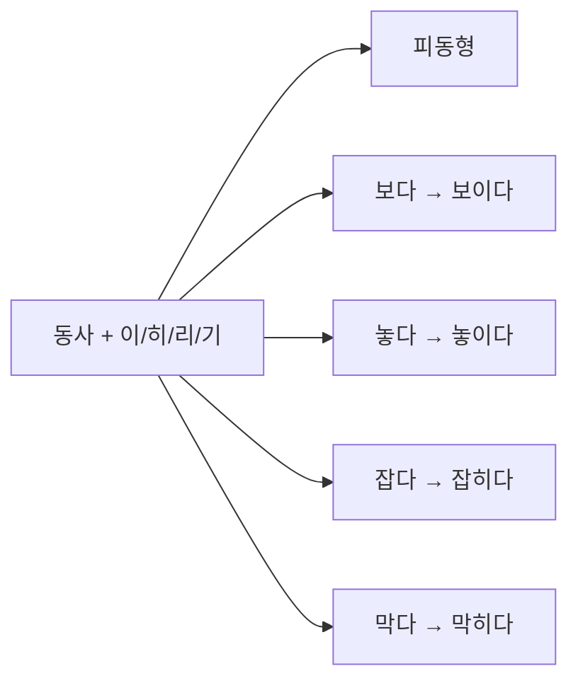
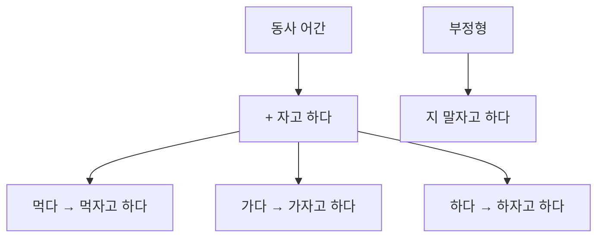
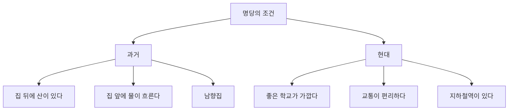

# Bài 6: 주거 환경 (Môi trường sống)

## Mục tiêu học tập

  <h3 className="text-lg font-semibold text-blue-800 mb-2">📚 Mục tiêu bài học</h3>
  <ul className="space-y-2 text-blue-700">
    <li><strong>Từ vựng:</strong> Môi trường địa lý của khu dân cư</li>
    <li><strong>Ngữ pháp:</strong> Thể bị động, 동-자고 하다</li>
    <li><strong>Hoạt động:</strong> Giới thiệu cơ sở vật chất xung quanh khu phố, so sánh khu phố hiện tại và quê hương</li>
    <li><strong>Văn hóa:</strong> Địa thế tốt trong quá khứ và hiện đại</li>
  </ul>

## I. Từ vựng (어휘)

### 1. Đặc điểm của thành phố

  

    <h4 className="font-semibold text-gray-800 mb-3">🏙️ Thành phố (도시)</h4>
    <ul className="space-y-2 text-sm">
      <li>• 거리가 깨끗하다 - đường phố sạch sẽ</li>
      <li>• 공기가 탁하다 - không khí ô nhiễm</li>
      <li>• 문화 시설이 많다 - nhiều cơ sở văn hóa</li>
      <li>• 소음이 심하다 - tiếng ồn lớn</li>
      <li>• 빌딩숲 - rừng tòa nhà</li>
      <li>• 산업 단지 - khu công nghiệp</li>
      <li>• 안전하다 - an toàn</li>
    </ul>
  

  
  

    <h4 className="font-semibold text-green-800 mb-3">🌾 Nông thôn (농촌)</h4>
    <ul className="space-y-2 text-sm">
      <li>• 자연환경이 좋다 - môi trường tự nhiên tốt</li>
      <li>• 한적하다 - yên tĩnh</li>
      <li>• 공기가 맑다 - không khí trong lành</li>
      <li>• 직접 농사를 짓다 - trồng trọt trực tiếp</li>
      <li>• 경치가 좋다 - phong cảnh đẹp</li>
      <li>• 하천이 흐르다 - có sông suối chảy</li>
    </ul>
  

### 2. Bảng từ vựng theo chủ đề

| Từ vựng    | Nghĩa           | Ví dụ                          |
| ---------- | --------------- | ------------------------------ |
| 논         | ruộng lúa       | 논에서 벼를 기른다             |
| 밭         | ruộng khô       | 밭에서 채소를 키운다           |
| 과수원     | vườn cây ăn quả | 사과 과수원이 있다             |
| 비닐하우스 | nhà kính        | 비닐하우스에서 토마토를 기른다 |
| 산책로     | đường dạo bộ    | 산책로에서 운동한다            |
| 놀이터     | sân chơi        | 아이들이 놀이터에서 논다       |

## II. Ngữ pháp (문법)

### 1. Thể bị động (피동)

  <h4 className="font-semibold text-yellow-800 mb-2">📝 Công thức</h4>
  
Diễn tả việc được thực hiện bởi tác động từ bên ngoài

#### Quy tắc chuyển đổi:

| Nguyên tắc | Ví dụ         | Nghĩa     |
| ---------- | ------------- | --------- |
| -이-       | 보다 → 보이다 | được thấy |
| -히-       | 잡다 → 잡히다 | bị bắt    |
| -리-       | 열다 → 열리다 | được mở   |
| -기-       | 끊다 → 끊기다 | bị đứt    |

#### Ví dụ:

- **가:** 왜 이렇게 늦었어요? 무슨 일이 있었어요?
- **나:** 퇴근 시간이라서 길이 많이 **막혔어요**.

- 자는 동안 모기한테 팔을 **물려서** 너무 가렵다.
- 친구와 전화를 하는 중에 갑자기 전화가 **끊겼다**.

### 2. 동-자고 하다

  <h4 className="font-semibold text-blue-800 mb-2">📝 Công thức</h4>
  
Truyền đạt lời đề nghị hoặc gợi ý từ người khác

#### Ví dụ:

- **가:** 아까 과장님이 뭐라고 하셨어요?
- **나:** 내일 다시 **회의하자고 하셨어요**.

- 친구가 **만나자고 해서** 약속 장소에 나갔다.
- 아내가 같이 저녁을 **먹자고 해서** 기다리는 중이다.

  
<strong>💡 Lưu ý:</strong> Thể phủ định sử dụng '-지 말자고 하다'

## III. Hoạt động thực hành

### 1. 🎯 [Tệp âm thanh 6-1] Luyện tập thể bị động

  <h4 className="font-semibold mb-2">Tình huống 1:</h4>
  
<strong>왜 그래요? 무슨 일이에요?</strong>

  
→ 갑자기 엘리베이터가 흔들렸어요.

#### Bài tập:

1. 기숙사 문이 잠기다 → 기숙사 문이 **잠겼어요**.
2. 저쪽에서 비명 소리가 들리다 → 저쪽에서 비명 소리가 **들렸어요**.
3. 아무도 없는데 문이 닫히다 → 아무도 없는데 문이 **닫혔어요**.

### 2. 말하기 - Giới thiệu cơ sở vật chất xung quanh

  <h4 className="font-semibold text-green-800 mb-2">🗣️ Mẫu đối thoại</h4>
  

    
<strong>이웃:</strong> 안녕하세요? 저, 어제 이 동네로 이사 왔는데요.

    
<strong>후엔:</strong> 아, 그러세요? 반가워요.

    
<strong>이웃:</strong> 아이가 놀러 가자고 해서 그러는데 혹시 동네에 아이가 놀 만한 곳이 있나요?

    
<strong>후엔:</strong> 105동 앞에 놀이터가 있어요. 그리고 아이가 자전거 타는 것을 좋아하면 산책로에 가는 것도 좋아요.

  

## IV. 듣기 (청취)

### 🎧 [Tệp âm thanh 6-2] Đối thoại giữa Angela và trưởng phòng

#### Câu hỏi:

1. 과장님은 주말에 무엇을 할 겁니까?
2. 과장님의 부모님은 어떤 일을 하십니까?
   - ① 농사를 지으신다
   - ② 공장에서 일하신다
   - ③ 회사에 다니신다
   - ④ 비닐하우스를 만드신다

### 발음 연습

  <h4 className="font-semibold text-purple-800 mb-2">🔊 [Tệp âm thanh 6-3] Phát âm</h4>
  <ul className="space-y-1 text-sm">
    <li>막히네요 [마키네요]</li>
    <li>잡혔어요 [자펴써요]</li>
    <li>좋다고 하세요 [조타고 하세요]</li>
  </ul>

## V. 읽기 (đọc hiểu)

### Bài đọc: 역사를 간직한 곳 사마르칸트

저는 재작년에 우즈베키스탄에서 한국에 왔고 한 이삿짐센터에서 일하고 있습니다. 제 친한 친구가 한국에서 같이 일하자고 해서 한국에 왔습니다.

제 고향은 사마르칸트입니다. 실크 로드의 역사를 간직하고 있어서 유명합니다. 사마르칸트는 넓은 평지 위에 펼쳐진 도시입니다. 도시 곳곳에는 옛날 건축물이 많습니다. 그리고 주변에 낮은 언덕이 있습니다. 건조한 날씨 때문에 언덕에 나무는 많지 않습니다.

#### Câu hỏi hiểu bài:

1. 이 사람의 고향에는 왜 나무가 많지 않습니까?
2. 이 사람의 고향에 대한 설명으로 맞는 것은?
   - ① 옛날 건축물이 많다
   - ② 주변에 높은 산이 있다
   - ③ 바다를 볼 수 있다
   - ④ 계절마다 산의 경관이 바뀐다

## VI. 쓰기 (viết)

### Bảng so sánh môi trường sống

<table className="min-w-full border border-gray-300">
<thead className="bg-gray-50">
<tr>
<th className="border border-gray-300 px-4 py-2"></th>
<th className="border border-gray-300 px-4 py-2 text-blue-600">한국에서 사는 동네</th>
<th className="border border-gray-300 px-4 py-2 text-red-600">고향의 동네</th>
</tr>
</thead>
<tbody>
<tr>
<td className="border border-gray-300 px-4 py-2 font-semibold">지역 이름</td>
<td className="border border-gray-300 px-4 py-2"></td>
<td className="border border-gray-300 px-4 py-2"></td>
</tr>
<tr>
<td className="border border-gray-300 px-4 py-2 font-semibold">날씨나 계절</td>
<td className="border border-gray-300 px-4 py-2"></td>
<td className="border border-gray-300 px-4 py-2"></td>
</tr>
<tr>
<td className="border border-gray-300 px-4 py-2 font-semibold">주변 환경</td>
<td className="border border-gray-300 px-4 py-2"></td>
<td className="border border-gray-300 px-4 py-2"></td>
</tr>
</tbody>
</table>

## VII. 문화와 정보: 과거와 현대의 명당

### Quan niệm về địa thế tốt của người Hàn

  <h4 className="font-semibold text-indigo-800 mb-2">🏠 Quan niệm truyền thống</h4>
  
Người Hàn xưa tin rằng vị trí và hướng nhà quyết định hạnh phúc của gia đình. Nhà tốt phải có núi ở phía sau, nước chảy ở phía trước, và hướng nam.

  <h4 className="font-semibold text-green-800 mb-2">🚇 Tiêu chí hiện đại</h4>
  
Ngày nay, ngoài các yếu tố truyền thống, người ta còn chú trọng đến chất lượng trường học gần nhà và giao thông thuận tiện.

## VIII. Tổng kết từ vựng

### Danh sách từ vựng quan trọng

  

    <h5 className="font-semibold mb-2">Thành phố</h5>
    <ul className="space-y-1">
      <li>빌딩숲</li>
      <li>산업단지</li>
      <li>안전하다</li>
      <li>소음이 심하다</li>
      <li>공기가 탁하다</li>
    </ul>
  

  
  

    <h5 className="font-semibold mb-2">Nông thôn</h5>
    <ul className="space-y-1">
      <li>논, 밭</li>
      <li>과수원</li>
      <li>비닐하우스</li>
      <li>한적하다</li>
      <li>공기가 맑다</li>
    </ul>
  

  
  

    <h5 className="font-semibold mb-2">Cơ sở vật chất</h5>
    <ul className="space-y-1">
      <li>놀이터</li>
      <li>체육센터</li>
      <li>산책로</li>
      <li>문화시설</li>
      <li>교통</li>
    </ul>
  

---

## 🎯 Bài tập trắc nghiệm tương tác

<MultiChoiceQuiz
title="Bài tập Môi trường sống - Bài 6"
questions={[
{
id: 1,
question: "'길이 많이 막혔어요.' 여기서 '막히다'는 어떤 형태입니까?",
options: [
"능동형 (chủ động)",
"피동형 (bị động)",
"사동형 (sai khiến)",
"존경형 (tôn kính)"
],
correctAnswer: 1,
explanation: "'막히다' là dạng bị động của '막다' (chặn). Đường bị tắc nghẽn do tác động từ bên ngoài."
},
{
id: 2,
question: "'친구가 만나자고 해서 약속 장소에 나갔다.' 구조 '-자고 하다'의 의미는?",
options: [
"Truyền đạt mệnh lệnh",
"Truyền đạt câu hỏi",
"Truyền đạt lời đề nghị",
"Truyền đạt ý kiến"
],
correctAnswer: 2,
explanation: "'-자고 하다' được dùng để truyền đạt lời đề nghị hoặc gợi ý từ người khác."
},
{
id: 3,
question: "'공기가 탁하다'는 주로 어디를 설명합니까?",
options: [
"농촌 (nông thôn)",
"도시 (thành phố)",
"산 (núi)",
"바다 (biển)"
],
correctAnswer: 1,
explanation: "'공기가 탁하다' (không khí ô nhiễm) là đặc điểm thường gặp ở thành phố do khói bụi, xe cộ."
},
{
id: 4,
question: "'한적하다'의 의미는?",
options: [
"Ồn ào, náo nhiệt",
"Yên tĩnh, vắng người",
"Bẩn thỉu",
"Nguy hiểm"
],
correctAnswer: 1,
explanation: "'한적하다' có nghĩa là yên tĩnh, vắng người, thường dùng để miêu tả nông thôn."
},
{
id: 5,
question: "'비닐하우스'는 무엇을 위해 사용합니까?",
options: [
"사람이 거주하기 위해",
"물건을 보관하기 위해",
"식물을 기르기 위해",
"동물을 기르기 위해"
],
correctAnswer: 2,
explanation: "'비닐하우스' (nhà kính) được sử dụng để trồng trọt, nuôi cấy thực vật trong môi trường được kiểm soát."
},
{
id: 6,
question: "'모기한테 팔을 물렸어요.' 동사 '물리다'의 능동형은?",
options: [
"물다",
"물어보다",
"물러가다",
"물어뜯다"
],
correctAnswer: 0,
explanation: "'물리다' (bị cắn) là dạng bị động của '물다' (cắn)."
},
{
id: 7,
question: "과거 한국인이 생각하는 명당의 조건이 아닌 것은?",
options: [
"집 뒤에 산이 있다",
"집 앞에 물이 흐른다",
"남향집이다",
"지하철역이 가깝다"
],
correctAnswer: 3,
explanation: "지하철역이 가깝다 (gần ga tàu điện ngầm) là tiêu chí hiện đại, không phải của quá khứ."
},
{
id: 8,
question: "'직접 농사를 짓다'의 의미는?",
options: [
"Mua nông sản",
"Trồng trọt trực tiếp",
"Bán nông sản",
"Thuê người trồng trọt"
],
correctAnswer: 1,
explanation: "'농사를 짓다' có nghĩa là trồng trọt, '직접' có nghĩa là trực tiếp, tự mình làm."
},
{
id: 9,
question: "'전화가 끊겼다'에서 '끊기다'는 어떤 상황을 나타냅니까?",
options: [
"전화를 고의로 끊었다",
"전화가 저절로 끊어졌다",
"전화를 받지 않았다",
"전화기가 고장났다"
],
correctAnswer: 1,
explanation: "'끊기다' là dạng bị động, nghĩa là điện thoại tự nhiên bị ngắt, không phải do ý muốn."
},
{
id: 10,
question: "'빌딩숲'은 무엇을 비유적으로 표현한 말입니까?",
options: [
"공원이 많은 도시",
"나무가 많은 도시",
"높은 건물이 많은 도시",
"공장이 많은 도시"
],
correctAnswer: 2,
explanation: "'빌딩숲' (rừng tòa nhà) là cách nói ẩn유 để chỉ khu vực có nhiều tòa nhà cao tầng."
},
{
id: 11,
question: "'아이가 놀러 가자고 해서'에서 부정형은?",
options: [
"놀러 가지 않자고 해서",
"놀러 가지 말자고 해서",
"안 놀러 가자고 해서",
"놀러 못 가자고 해서"
],
correctAnswer: 1,
explanation: "'-자고 하다'의 부정형은 '-지 말자고 하다'입니다."
},
{
id: 12,
question: "'건조한 날씨 때문에 나무가 많지 않다'에서 '건조한'의 의미는?",
options: [
"춥다 (lạnh)",
"덥다 (nóng)",
"습하다 (ẩm ướt)",
"메마르다 (khô hanh)"
],
correctAnswer: 3,
explanation: "'건조하다' có nghĩa là khô hanh, thiếu độ ẩm, trái nghĩa với '습하다' (ẩm ướt)."
}
]}
/>

---

  <h3 className="font-semibold text-blue-800 mb-2">🎯 Mục tiêu đạt được sau bài học</h3>
  <ul className="text-blue-700 space-y-1">
    <li>✅ Mô tả được đặc điểm môi trường sống ở thành phố và nông thôn</li>
    <li>✅ Sử dụng thành thạo thể bị động trong giao tiếp</li>
    <li>✅ Truyền đạt lời đề nghị của người khác bằng 동-자고 하다</li>
    <li>✅ Giới thiệu được cơ sở vật chất xung quanh khu phố</li>
    <li>✅ Hiểu được quan niệm về địa thế tốt của người Hàn</li>
  </ul>

