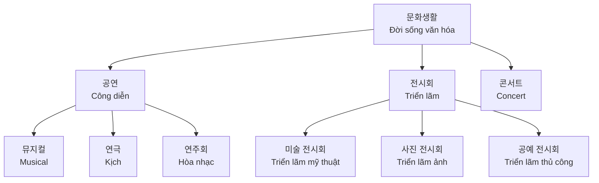
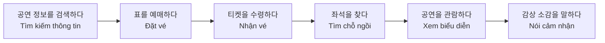
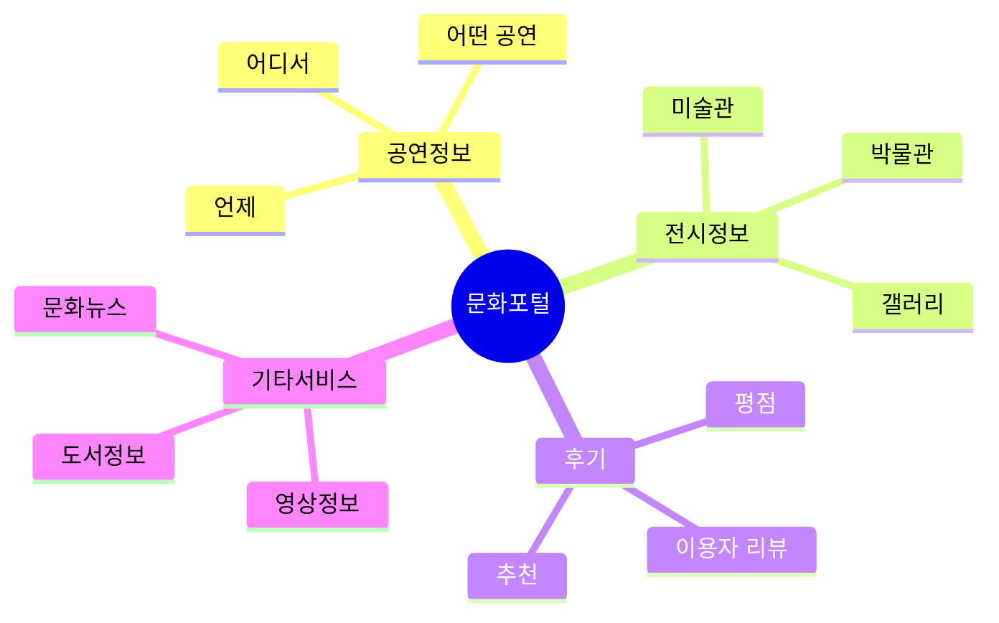

# Bài 7: Đời sống văn hóa (문화생활)

## 🎭 Korean Language & Culture - Intermediate Level 1

---

## 📚 Mục tiêu học tập

<h3 className="text-lg font-semibold text-blue-700">Sau khi hoàn thành bài học này, học viên sẽ có thể:</h3>
<ul className="list-disc list-inside space-y-1 mt-2">
<li><strong>Từ vựng:</strong> Sử dụng thành thạo các từ vựng về công diễn và triển lãm</li>
<li><strong>Ngữ pháp:</strong> Sử dụng chính xác -으라고 하다, -냐고 하다, -만큼</li>
<li><strong>Hoạt động:</strong> Nói về cảm nhận sau khi xem công diễn và viết bài đánh giá</li>
<li><strong>Văn hóa:</strong> Hiểu cách tìm thông tin về các buổi biểu diễn</li>
</ul>

---

## 🎨 Mở đầu: Khám phá thế giới giải trí

### 💭 Câu hỏi khởi động

- **이 사람은 어디에서 무엇을 보고 있어요?** _(Người này đang xem gì ở đâu?)_
- **여러분은 시간이 있을 때 무엇을 보러 가고 싶어요?** _(Các bạn muốn đi xem gì khi có thời gian?)_

---

## 📖 Từ vựng chủ đề

### 1. Các loại công diễn (공연 종류)

<table className="min-w-full border-collapse border border-gray-300">
<thead>
<tr className="bg-gray-100">
<th className="border border-gray-300 px-4 py-2">한국어</th>
<th className="border border-gray-300 px-4 py-2">Tiếng Việt</th>
<th className="border border-gray-300 px-4 py-2">Ví dụ</th>
</tr>
</thead>
<tbody>
<tr>
<td className="border border-gray-300 px-4 py-2">뮤지컬</td>
<td className="border border-gray-300 px-4 py-2">Nhạc kịch</td>
<td className="border border-gray-300 px-4 py-2">뮤지컬을 보러 가요</td>
</tr>
<tr>
<td className="border border-gray-300 px-4 py-2">연극</td>
<td className="border border-gray-300 px-4 py-2">Kịch</td>
<td className="border border-gray-300 px-4 py-2">연극 공연이 재미있어요</td>
</tr>
<tr>
<td className="border border-gray-300 px-4 py-2">연주회</td>
<td className="border border-gray-300 px-4 py-2">Hòa nhạc</td>
<td className="border border-gray-300 px-4 py-2">클래식 연주회를 들어요</td>
</tr>
<tr>
<td className="border border-gray-300 px-4 py-2">난타</td>
<td className="border border-gray-300 px-4 py-2">Nanta (loại hình biểu diễn truyền thống)</td>
<td className="border border-gray-300 px-4 py-2">난타 공연이 신나요</td>
</tr>
<tr>
<td className="border border-gray-300 px-4 py-2">사물놀이</td>
<td className="border border-gray-300 px-4 py-2">Samulnori (nhạc cụ truyền thống)</td>
<td className="border border-gray-300 px-4 py-2">사물놀이를 배워요</td>
</tr>
<tr>
<td className="border border-gray-300 px-4 py-2">길거리 공연(버스킹)</td>
<td className="border border-gray-300 px-4 py-2">Biểu diễn đường phố</td>
<td className="border border-gray-300 px-4 py-2">길거리에서 버스킹을 봐요</td>
</tr>
</tbody>
</table>

### 2. Các loại triển lãm (전시회 종류)

<table className="min-w-full border-collapse border border-gray-300">
<thead>
<tr className="bg-gray-100">
<th className="border border-gray-300 px-4 py-2">한국어</th>
<th className="border border-gray-300 px-4 py-2">Tiếng Việt</th>
<th className="border border-gray-300 px-4 py-2">Ví dụ</th>
</tr>
</thead>
<tbody>
<tr>
<td className="border border-gray-300 px-4 py-2">미술 전시회</td>
<td className="border border-gray-300 px-4 py-2">Triển lãm mỹ thuật</td>
<td className="border border-gray-300 px-4 py-2">미술 전시회에 가요</td>
</tr>
<tr>
<td className="border border-gray-300 px-4 py-2">사진 전시회</td>
<td className="border border-gray-300 px-4 py-2">Triển lãm ảnh</td>
<td className="border border-gray-300 px-4 py-2">사진 작품이 아름다워요</td>
</tr>
<tr>
<td className="border border-gray-300 px-4 py-2">공예 전시회</td>
<td className="border border-gray-300 px-4 py-2">Triển lãm thủ công nghệ</td>
<td className="border border-gray-300 px-4 py-2">전통 공예품을 봐요</td>
</tr>
</tbody>
</table>

### 3. Các loại concert (콘서트 종류)

<table className="min-w-full border-collapse border border-gray-300">
<thead>
<tr className="bg-gray-100">
<th className="border border-gray-300 px-4 py-2">한국어</th>
<th className="border border-gray-300 px-4 py-2">Tiếng Việt</th>
<th className="border border-gray-300 px-4 py-2">Ví dụ</th>
</tr>
</thead>
<tbody>
<tr>
<td className="border border-gray-300 px-4 py-2">케이팝(K-pop) 콘서트</td>
<td className="border border-gray-300 px-4 py-2">Concert K-pop</td>
<td className="border border-gray-300 px-4 py-2">BTS 콘서트를 봐요</td>
</tr>
<tr>
<td className="border border-gray-300 px-4 py-2">재즈(Jazz) 콘서트</td>
<td className="border border-gray-300 px-4 py-2">Concert Jazz</td>
<td className="border border-gray-300 px-4 py-2">재즈 음악을 들어요</td>
</tr>
<tr>
<td className="border border-gray-300 px-4 py-2">토크 콘서트(강연)</td>
<td className="border border-gray-300 px-4 py-2">Talk concert (diễn thuyết)</td>
<td className="border border-gray-300 px-4 py-2">유명한 사람의 강연을 들어요</td>
</tr>
</tbody>
</table>

### 4. Quy trình xem công diễn và cảm nhận

### 5. Từ vựng về cảm xúc

<h4 className="font-semibold text-green-600">긍정적 감정</h4>
<ul className="list-disc list-inside">
<li>기대하다/기대되다 - Mong đợi</li>
<li>감동적이다 - Cảm động</li>
<li>인상적이다 - Ấn tượng</li>
</ul>

---

## 📝 Ngữ pháp

### 1. -으라고 하다, -냐고 하다 (Truyền đạt lệnh và câu hỏi)

<h4 className="font-semibold text-green-700">Chức năng:</h4>

Dùng để truyền đạt nội dung mệnh lệnh/câu hỏi mà người khác đã nói.

#### Cấu trúc:

<table className="min-w-full border-collapse border border-gray-300">
<thead>
<tr className="bg-blue-100">
<th className="border border-gray-300 px-4 py-2">Loại động từ</th>
<th className="border border-gray-300 px-4 py-2">Mệnh lệnh</th>
<th className="border border-gray-300 px-4 py-2">Câu hỏi</th>
<th className="border border-gray-300 px-4 py-2">Ví dụ</th>
</tr>
</thead>
<tbody>
<tr>
<td className="border border-gray-300 px-4 py-2">Có phụ âm cuối</td>
<td className="border border-gray-300 px-4 py-2">-으라고 하다</td>
<td className="border border-gray-300 px-4 py-2">-냐고 하다</td>
<td className="border border-gray-300 px-4 py-2">먹다 → 먹으라고 하다 읽다 → 읽냐고 하다</td>
</tr>
<tr>
<td className="border border-gray-300 px-4 py-2">Không có phụ âm cuối</td>
<td className="border border-gray-300 px-4 py-2">-라고 하다</td>
<td className="border border-gray-300 px-4 py-2">-냐고 하다</td>
<td className="border border-gray-300 px-4 py-2">쓰다 → 쓰라고 하다 가다 → 가냐고 하다</td>
</tr>
<tr>
<td className="border border-gray-300 px-4 py-2">Đặc biệt</td>
<td className="border border-gray-300 px-4 py-2">-라고 하다</td>
<td className="border border-gray-300 px-4 py-2">-냐고 하다</td>
<td className="border border-gray-300 px-4 py-2">살다 → 사냐고 하다</td>
</tr>
</tbody>
</table>

#### 💡 Lưu ý:

- **Phủ định:** 동사지 말라고 하다 (안 V-으라고 하다 ❌)
- **Ví dụ:** 담배를 피우지 말라고 했어요. _(Nói là đừng hút thuốc.)_

#### Ví dụ thực tế:

<h5 className="font-semibold text-blue-600">Tình huống 1:</h5>

<strong>A:</strong> 라민 씨가 뭐라고 했어요?

<strong>B:</strong> 공연이 몇 시에 시작하냐고 했어요.

<em>A: Ramin nói gì? / B: Anh ấy hỏi buổi biểu diễn bắt đầu lúc mấy giờ.</em>

<h5 className="font-semibold text-blue-600">Tình huống 2:</h5>

<strong>과장님:</strong> 내일 회의가 있으니까 모두 참석하세요.

<strong>직원:</strong> 과장님이 내일 회의에 참석하라고 했어요.

<em>Trưởng phòng nói là mai có họp nên tất cả hãy tham dự.</em>

### 2. -만큼 (Mức độ tương đương)

<h4 className="font-semibold text-orange-700">Chức năng:</h4>

Biểu thị mức độ tương đương với danh từ ở phía trước.

#### Cấu trúc:

**명사 + 만큼**

#### Ví dụ minh họa:

<h5 className="font-semibold text-purple-600">So sánh tích cực:</h5>

🎵 안젤라 씨가 <strong>가수만큼</strong> 노래를 잘해요.

<em>Angela hát hay như ca sĩ.</em>

<h5 className="font-semibold text-purple-600">So sánh phủ định:</h5>

🚗 평일은 <strong>주말만큼</strong> 시내에 사람이 많지 않다.

<em>Ngày thường không đông người ở trung tâm như cuối tuần.</em>

---

## 🎤 Luyện tập Nghe (듣기)

<h3 className="text-lg font-semibold">🔊 Audio File: 7-P.mp3</h3>

Tệp âm thanh sẽ được bổ sung sau

### Bài tập nghe 1:

**Tình huống:** 고천 씨와 후엔 씨가 공연에 대해 이야기합니다.

**Câu hỏi:**

1. 두 사람은 무슨 공연을 보려고 합니까?
2. 들은 내용과 같으면 ○, 다르면 X 하세요:
   - ① 후엔 씨가 고천 씨를 공연에 초대했다. ( )
   - ② 고천 씨는 친구에게 공연에 올 수 있냐고 물어볼 것이다. ( )
   - ③ 고천 씨는 이 공연을 본 적이 있다. ( )

### 📣 Luyện phát âm (발음):

**Quy tắc đồng hóa âm:** ㄱ, ㄷ, ㅂ, ㅅ, ㅈ + ㄱ, ㄷ, ㅂ → [ㄲ, ㄸ, ㅃ, ㅆ, ㅉ]

<h5 className="font-semibold">입장권</h5>

[입짱꿴]

<h5 className="font-semibold">앞좌석</h5>

[압쫘석]

<h5 className="font-semibold">택배</h5>

[택빼]

---

## 🗣️ Luyện tập Nói (말하기)

### Hoạt động 1: Thảo luận về buổi biểu diễn

<h4 className="font-semibold">Mẫu hội thoại:</h4>

<strong>라민:</strong> 오늘 본 연극 어땠어요?

<strong>아나이스:</strong> 저는 계속 웃다가 울다가 했어요.

<strong>라민:</strong> 어떤 장면이 가장 인상적이었어요?

<strong>아나이스:</strong> 제일 마지막에 배우들이 모두 같이 춤추는 장면이 기억에 남아요.

### Từ vựng hữu ích cho hoạt động nói:

<h5 className="font-semibold text-green-600">Về công diễn:</h5>
<ul className="list-disc list-inside text-sm">
<li>연극, 뮤지컬, 콘서트</li>
<li>무대, 배우, 가수, 주인공</li>
<li>입장권, 좌석</li>
</ul>

<h5 className="font-semibold text-blue-600">Cảm nhận:</h5>
<ul className="list-disc list-inside text-sm">
<li>인상적인 장면</li>
<li>감동적인 장면</li>
<li>기억에 남다</li>
</ul>

---

## 📖 Luyện tập Đọc (읽기)

### Bài đọc 1: Vé xem công diễn

<h4 className="text-center font-bold text-lg">뮤지컬 '꽃을 그대에게' 초대권</h4>

<strong>공연시간:</strong> 20**년 10월 31일 오후 3시 00분

<strong>공연장소:</strong> 한강스퀘어 뮤지컬홀

<strong>좌석:</strong> VIP석 1층 3열 12

<strong>예약번호:</strong> T15320505

<strong>관람연령:</strong> 12세 이상 관람가

<h5 className="font-semibold">※ 안내 및 유의 사항</h5>

티켓의 환불은 하루 전까지 인터넷으로 가능하며 당일에는 변경이나 취소가 되지 않습니다. 또한 무료 및 할인 티켓의 환불은 불가능합니다.

### Bài đọc 2: 문화가 있는 날

'문화가 있는 날'은 매월 마지막 주 수요일이다. 이날은 보통 때보다 싼 가격이나 무료로 문화생활을 할 수 있다. 그래서 부담 없이 문화생활을 즐길 수 있다.

지난달에 나는 그림 전시회를 보고 왔다. 나는 그림을 잘 그리지는 못하지만 보는 것을 좋아한다. 그림을 보고 있으면 기분이 좋아진다. 이번 달 '문화가 있는 날'에는 재즈(Jazz) 콘서트 티켓을 예매했다. 50% 할인을 받았다.

이렇게 새로운 문화생활을 하면 좋은 경험이 된다. 그리고 내 경험이 쌓이는 것만큼 한국 생활에도 점점 익숙해지고 있는 것 같다.

**Câu hỏi hiểu bài:**

1. '문화가 있는 날'에 전시회나 공연을 보면 좋은 점이 무엇입니까?
2. 윗글의 내용과 같으면 ○, 다르면 X 하세요.

---

## ✍️ Luyện tập Viết (쓰기)

### Hoạt động viết: Bài đánh giá buổi biểu diễn

<h4 className="font-semibold text-blue-600">Viết về trải nghiệm xem công diễn của bạn</h4>

**Các bước chuẩn bị:**

1. **공연 이름:** **\*\*\*\***\_\_\_\_**\*\*\*\***
2. **공연 장소:** **\*\*\*\***\_\_\_\_**\*\*\*\***
3. **공연 내용:** **\*\*\*\***\_\_\_\_**\*\*\*\***
4. **느낀 점:** **\*\*\*\***\_\_\_\_**\*\*\*\***

**Mẫu viết:**

저는 지난주에 [공연 이름]을/를 봤습니다. [공연 장소]에서 열린 이 공연은 정말 [감상]했습니다.

특히 [인상적인 장면]이/가 가장 기억에 남습니다. 배우들의 [특징]도 [평가]했습니다.

이번 공연을 보면서 [느낀 점]을/를 느꼈습니다. 다음에도 이런 좋은 공연을 보고 싶습니다.

---

## 🌏 Văn hóa và Thông tin: Cách tìm thông tin về công diễn

### 문화포털 (Culture Portal) - www.culture.go.kr

<h4 className="font-semibold text-purple-600">Tính năng chính của Cổng thông tin văn hóa:</h4>

<h5 className="font-semibold">주요 기능:</h5>
<ul className="list-disc list-inside space-y-1">
<li>📅 **일정 검색:** 언제, 어디서, 어떤 공연이나 전시가 있는지 쉽게 검색</li>
<li>⭐ **이용자 후기:** 다른 사람들의 공연 후기를 통해 선택에 도움</li>
<li>🎬 **멀티미디어:** 국내외 문화 관련 영상, 도서 정보 제공</li>
<li>🔔 **맞춤 정보:** 회원 가입 시 새로운 문화 정보를 편리하게 이용</li>
</ul>

---

## 📚 Tổng kết và Ôn tập

### 1. Bảng từ vựng cần nhớ

<h5 className="font-semibold text-red-600 mb-3">공연 관련 (Công diễn)</h5>

□ 뮤지컬 (Musical)

□ 연극 (Kịch)

□ 연주회 (Hòa nhạc)

□ 난타 (Nanta)

□ 사물놀이 (Samulnori)

□ 길거리 공연 (Biểu diễn đường phố)

□ 관람하다 (Xem)

□ 기대하다 (Mong đợi)

<h5 className="font-semibold text-blue-600 mb-3">전시회 관련 (Triển lãm)</h5>

□ 미술 전시회 (Triển lãm mỹ thuật)

□ 사진 전시회 (Triển lãm ảnh)

□ 공예 전시회 (Triển lãm thủ công)

□ 작가 (Tác giả)

□ 갤러리 (Gallery)

□ 박물관 (Bảo tàng)

□ 예매하다 (Đặt vé)

□ 할인 (Giảm giá)

<h5 className="font-semibold text-green-600 mb-3">감정 표현 (Cảm xúc)</h5>

□ 인상적이다 (Ấn tượng)

□ 감동적이다 (Cảm động)

□ 유창하다 (Lưu loát)

□ 부담이 없다 (Không gánh nặng)

□ 할인을 받다 (Được giảm giá)

□ 경험이 쌓이다 (Tích lũy kinh nghiệm)

### 2. Ngữ pháp cần nhớ

<h4 className="font-semibold text-yellow-700 mb-3">핵심 문법 정리</h4>

<h5 className="font-semibold text-blue-600">-으라고 하다 / -냐고 하다</h5>

• 먹다 → 먹으라고 하다 / 먹냐고 하다

• 가다 → 가라고 하다 / 가냐고 하다

• 부정: -지 말라고 하다

→ Truyền đạt mệnh lệnh/câu hỏi

<h5 className="font-semibold text-purple-600">-만큼</h5>

• 명사 + 만큼

• 가수만큼 노래를 잘해요

• 주말만큼 바쁘지 않아요

→ So sánh mức độ tương đương

### 3. Cấu trúc câu quan trọng

<h5 className="font-semibold text-green-600 mb-3">Mẫu câu thường dùng</h5>

Hỏi về công diễn:

• 어떤 공연을 보고 싶어요? (Muốn xem công diễn nào?)

• 몇 시에 시작해요? (Bắt đầu lúc mấy giờ?)

Diễn tả cảm nhận:

• 정말 감동적이었어요 (Thật sự cảm động)

• 인상적인 장면이었어요 (Là cảnh ấn tượng)

So sánh:

• 영화만큼 재미있어요 (Thú vị như phim)

• 기대했던 만큼 좋았어요 (Tốt như mong đợi)

---

## 🎯 자가 평가 (Self-Assessment)

### 학습 목표 달성도 체크

<h5 className="font-semibold text-green-600">어휘 (Vocabulary)</h5>

□ 공연 종류를 구분할 수 있다

□ 전시회 유형을 알고 있다

□ 콘서트 관련 표현을 안다

□ 감정 표현을 사용할 수 있다

<h5 className="font-semibold text-blue-600">문법 (Grammar)</h5>

□ -으라고 하다를 정확히 사용한다

□ -냐고 하다로 질문을 전달한다

□ -만큼으로 비교를 표현한다

□ 문법을 자연스럽게 활용한다

<h5 className="font-semibold text-purple-600">말하기 (Speaking)</h5>

□ 공연 감상 소감을 말할 수 있다

□ 친구와 문화생활에 대해 대화한다

□ 추천과 의견을 표현한다

□ 자연스럽게 대화를 이어간다

<h5 className="font-semibold text-red-600">쓰기 (Writing)</h5>

□ 공연 감상평을 쓸 수 있다

□ 문화생활 경험을 서술한다

□ 논리적으로 글을 구성한다

□ 적절한 어휘와 문법을 사용한다

---

## 🎯 Bài tập trắc nghiệm tương tác

<MultiChoiceQuiz
title="Bài tập về văn hóa Hàn Quốc - Bài 7"
questions={[
{
id: 1,
question: "뮤지컬을 보러 가요. 이 문장에서 '뮤지컬'의 뜻은 무엇입니까?",
options: [
"Phim ảnh",
"Nhạc kịch",
"Triển lãm ảnh",
"Concert nhạc pop"
],
correctAnswer: 1,
explanation: "뮤지컬 nghĩa là 'nhạc kịch' - một loại hình biểu diễn kết hợp giữa ca hát, khiêu vũ và diễn xuất."
},
{
id: 2,
question: "'친구가 공연이 몇 시에 시작하냐고 했어요.' 문법 '-냐고 하다'의 용법은?",
options: [
"Biểu hiện sự giả định",
"Truyền đạt câu hỏi của người khác",
"Diễn tả mong muốn",
"So sánh hai sự việc"
],
correctAnswer: 1,
explanation: "'-냐고 하다' được sử dụng để truyền đạt lại câu hỏi mà người khác đã hỏi trước đó."
},
{
id: 3,
question: "'안젤라 씨가 가수만큼 노래를 잘해요.' 여기서 '-만큼'의 의미는?",
options: [
"Thời gian",
"Mức độ tương đương",
"Nguyên nhân",
"Điều kiện"
],
correctAnswer: 1,
explanation: "'-만큼'은 앞의 명사와 같은 정도나 수준임을 나타냅니다. 여기서는 Angela hát hay như ca sĩ (mức độ tương đương)."
},
{
id: 4,
question: "'문화가 있는 날'은 언제입니까?",
options: [
"매주 금요일",
"매월 첫 번째 수요일",
"매월 마지막 주 수요일",
"매월 15일"
],
correctAnswer: 2,
explanation: "'문화가 있는 날'은 매월 마지막 주 수요일로, 이날에는 문화생활을 더 저렴하게 즐길 수 있습니다."
},
{
id: 5,
question: "다음 중 전시회 종류가 아닌 것은?",
options: [
"미술 전시회",
"사진 전시회",
"공예 전시회",
"사물놀이"
],
correctAnswer: 3,
explanation: "사물놀이는 한국 전통 음악 공연이지 전시회가 아닙니다. 미술, 사진, 공예 전시회는 모두 전시회의 종류입니다."
},
{
id: 6,
question: "'과장님이 내일 회의에 참석하라고 했어요.' 이 문장을 직접 인용으로 바꾸면?",
options: [
"과장님: '내일 회의가 있어요.'",
"과장님: '내일 회의에 참석하세요.'",
"과장님: '내일 회의에 참석해요.'",
"과장님: '내일 회의에 참석할까요?'"
],
correctAnswer: 1,
explanation: "'-으라고 하다'는 명령문을 간접 인용할 때 사용됩니다. 직접 인용에서는 '참석하세요'(명령형)가 됩니다."
},
{
id: 7,
question: "'기대했던 만큼 좋았어요.'에서 화자의 느낌은?",
options: [
"실망했다",
"만족했다",
"보통이었다",
"예상보다 나빴다"
],
correctAnswer: 1,
explanation: "'기대했던 만큼 좋았어요'는 기대했던 수준과 실제가 같다는 의미로, 화자가 만족했음을 나타냅니다."
},
{
id: 8,
question: "한국의 전통 공연 중 타악기를 주로 사용하는 것은?",
options: [
"뮤지컬",
"연극",
"사물놀이",
"재즈 콘서트"
],
correctAnswer: 2,
explanation: "사물놀이는 꽹과리, 징, 장구, 북 등 한국 전통 타악기를 사용하는 전통 공연입니다."
}
]}
/>

---

## 📋 추가 연습 문제

### 1. 문법 변환 연습

<h5 className="font-semibold">다음 문장을 -으라고 하다/-냐고 하다로 바꾸세요:</h5>

<strong>예시:</strong> "휴대전화를 꺼 주세요." → 휴대전화를 끄라고 했어요.

1. "내일 회의에 참석하세요." → ________________________

2. "주말에 무엇을 해요?" → ________________________

3. "표를 미리 예매하세요." → ________________________

4. "어느 좌석을 원해요?" → ________________________

### 2. -만큼 활용 연습

<h5 className="font-semibold">-만큼을 사용하여 문장을 완성하세요:</h5>

1. 이 뮤지컬은 영화_______ 재미있어요.

2. 학생 공연도 프로_______ 훌륭했어요.

3. 오늘은 어제_______ 춥지 않아요.

4. 한국 음식을 한국사람_______ 잘 만들어요.

---

## 🎭 실제 상황 적용 (Real-life Application)

### 상황 1: 친구와 공연 계획하기

<strong>상황:</strong> 친구와 함께 이번 주말에 볼 공연을 정하는 대화를 나누어 보세요.

<h6 className="font-semibold">사용할 표현들:</h6>
<ul className="list-disc list-inside text-sm space-y-1">
<li>뭘 보고 싶어요?</li>
<li>...만큼 재미있을 것 같아요</li>
<li>표를 예매하라고 할게요</li>
<li>몇 시에 시작하냐고 물어봐 주세요</li>
</ul>

### 상황 2: 공연 후기 나누기

<strong>상황:</strong> 어제 본 공연에 대해 동료들과 이야기해 보세요.

<h6 className="font-semibold">사용할 표현들:</h6>
<ul className="list-disc list-inside text-sm space-y-1">
<li>어떤 장면이 인상적이었어요?</li>
<li>배우들의 연기가 감동적이었어요</li>
<li>기대했던 만큼 좋았어요</li>
<li>다른 사람들에게도 추천하고 싶어요</li>
</ul>

---

## 🔗 다음 학습 연결고리

<h4 className="font-semibold text-purple-600">8과 예고: 다음에 배울 내용</h4>

7과에서 배운 문화생활 표현들을 바탕으로, 8과에서는 더 다양한 여가 활동과 취미에 대해 학습하게 됩니다. 또한 계획과 약속을 표현하는 새로운 문법들을 익히게 될 것입니다.

연결되는 주제

여가 활동, 취미생활

연결되는 문법

계획 표현, 약속 표현

---

## 📚 참고 자료 및 추천 학습

### 온라인 자료

- **문화포털** (www.culture.go.kr): 실제 공연 정보 검색 연습
- **한국관광공사**: 문화 행사 정보
- **지역 문화재단**: 지역별 공연 정보

### 학습 팁

1. **실제 공연 관람**: 학습한 표현들을 실제 상황에서 사용해보기
2. **한국어 후기 읽기**: 다른 사람들의 공연 후기를 읽고 표현 익히기
3. **친구와 대화**: 배운 문법을 사용하여 실제 대화 연습하기
4. **일기 쓰기**: 문화생활 경험을 한국어로 기록하기

---

<h3 className="text-xl font-bold text-gray-700">수고하셨습니다! 🎉</h3>

이제 한국의 문화생활에 대해 자신있게 이야기할 수 있을 것입니다.

