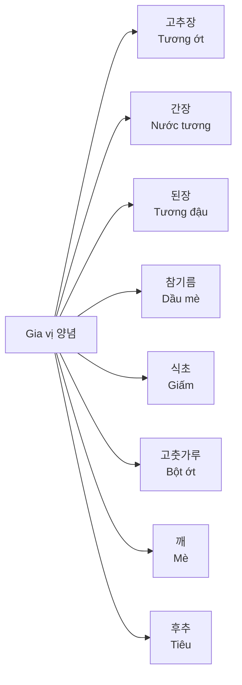
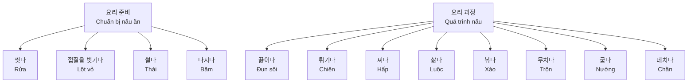
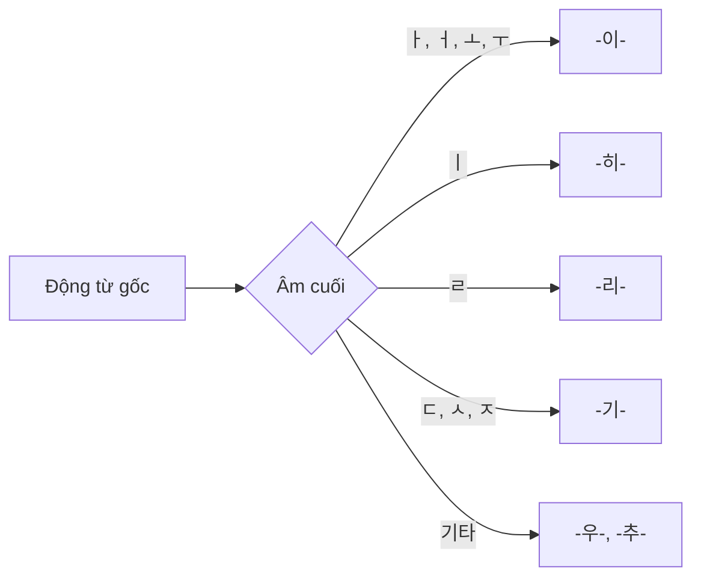
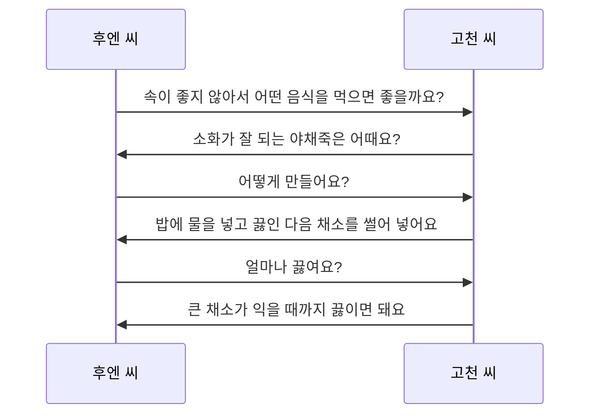
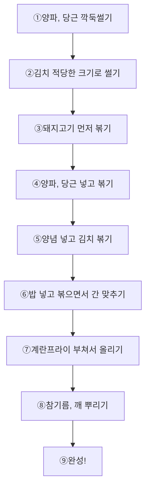

# Bài 8: 음식과 요리 (Thực phẩm và Nấu ăn)

## Tiếng Hàn Trung cấp 1

---

  <h3 className="text-lg font-semibold text-blue-700 mb-2">Mục tiêu bài học</h3>
  <ul className="text-sm space-y-1">
    <li>• Học từ vựng về gia vị, vị và phương pháp nấu ăn</li>
    <li>• Nắm vững ngữ pháp sai khiến (사동①, 사동②)</li>
    <li>• Có thể kể về phương pháp nấu ăn</li>
    <li>• Giới thiệu cách làm món ăn quê hương</li>
    <li>• Tìm hiểu về hạn sử dụng thực phẩm</li>
  </ul>

---

## I. TỪ VỰNG (어휘)

### 1. Gia vị và vị (양념과 맛)

  <table className="min-w-full border-collapse border border-gray-300 mt-4">
    <thead>
      <tr className="bg-gray-100">
        <th className="border border-gray-300 px-4 py-2 text-left">Tiếng Hàn</th>
        <th className="border border-gray-300 px-4 py-2 text-left">Tiếng Việt</th>
        <th className="border border-gray-300 px-4 py-2 text-left">Ví dụ</th>
      </tr>
    </thead>
    <tbody>
      <tr>
        <td className="border border-gray-300 px-4 py-2">고추장</td>
        <td className="border border-gray-300 px-4 py-2">Tương ớt</td>
        <td className="border border-gray-300 px-4 py-2">고추장을 넣어서 비빔밥을 만들어요.</td>
      </tr>
      <tr>
        <td className="border border-gray-300 px-4 py-2">간장</td>
        <td className="border border-gray-300 px-4 py-2">Nước tương</td>
        <td className="border border-gray-300 px-4 py-2">간장으로 간을 맞춰요.</td>
      </tr>
      <tr>
        <td className="border border-gray-300 px-4 py-2">된장</td>
        <td className="border border-gray-300 px-4 py-2">Tương đậu</td>
        <td className="border border-gray-300 px-4 py-2">된장찌개를 끓여요.</td>
      </tr>
      <tr>
        <td className="border border-gray-300 px-4 py-2">참기름</td>
        <td className="border border-gray-300 px-4 py-2">Dầu mè</td>
        <td className="border border-gray-300 px-4 py-2">나물에 참기름을 뿌려요.</td>
      </tr>
      <tr>
        <td className="border border-gray-300 px-4 py-2">식초</td>
        <td className="border border-gray-300 px-4 py-2">Giấm</td>
        <td className="border border-gray-300 px-4 py-2">식초에 양파를 절여요.</td>
      </tr>
    </tbody>
  </table>

### 2. Phương pháp nấu ăn (요리 방법)

  

    <h4 className="font-semibold mb-3 text-blue-600">Chuẩn bị nguyên liệu</h4>
    <ul className="space-y-2 text-sm">
      <li>• 당근을 씻다 - rửa cà rốt</li>
      <li>• 양파 껍질을 벗기다 - lột vỏ hành tây</li>
      <li>• 감자를 칼로 썰다 - thái khoai tây bằng dao</li>
      <li>• 마늘을 다지다 - băm tỏi</li>
    </ul>
  

  

    <h4 className="font-semibold mb-3 text-green-600">Phương pháp chế biến</h4>
    <ul className="space-y-2 text-sm">
      <li>• 물을 끓이다 - đun sôi nước</li>
      <li>• 기름에 튀기다 - chiên trong dầu</li>
      <li>• 만두를 찌다 - hấp bánh bao</li>
      <li>• 밥을 볶다 - xào cơm</li>
    </ul>
  

---

## II. NGỮ PHÁP (문법)

### 1. 사동① - Thể sai khiến (làm cho ai/cái gì thực hiện hành động)

  
Ý nghĩa:

  
Biểu hiện việc làm cho người khác hoặc động vật thực hiện một hành động nào đó.

#### Cách tạo thành:

  <table className="min-w-full border-collapse border border-gray-300">
    <thead>
      <tr className="bg-gray-100">
        <th className="border border-gray-300 px-4 py-2">Loại</th>
        <th className="border border-gray-300 px-4 py-2">Động từ gốc</th>
        <th className="border border-gray-300 px-4 py-2">Thể sai khiến</th>
        <th className="border border-gray-300 px-4 py-2">Ví dụ</th>
      </tr>
    </thead>
    <tbody>
      <tr>
        <td className="border border-gray-300 px-4 py-2">-이-</td>
        <td className="border border-gray-300 px-4 py-2">먹다</td>
        <td className="border border-gray-300 px-4 py-2">먹이다</td>
        <td className="border border-gray-300 px-4 py-2">아기한테 우유를 먹여요.</td>
      </tr>
      <tr>
        <td className="border border-gray-300 px-4 py-2">-히-</td>
        <td className="border border-gray-300 px-4 py-2">입다</td>
        <td className="border border-gray-300 px-4 py-2">입히다</td>
        <td className="border border-gray-300 px-4 py-2">아이에게 옷을 입혀요.</td>
      </tr>
      <tr>
        <td className="border border-gray-300 px-4 py-2">-리-</td>
        <td className="border border-gray-300 px-4 py-2">살다</td>
        <td className="border border-gray-300 px-4 py-2">살리다</td>
        <td className="border border-gray-300 px-4 py-2">생명을 살려요.</td>
      </tr>
      <tr>
        <td className="border border-gray-300 px-4 py-2">-기-</td>
        <td className="border border-gray-300 px-4 py-2">신다</td>
        <td className="border border-gray-300 px-4 py-2">신기다</td>
        <td className="border border-gray-300 px-4 py-2">아이에게 신발을 신겨요.</td>
      </tr>
      <tr>
        <td className="border border-gray-300 px-4 py-2">-우-</td>
        <td className="border border-gray-300 px-4 py-2">타다</td>
        <td className="border border-gray-300 px-4 py-2">태우다</td>
        <td className="border border-gray-300 px-4 py-2">아이를 자동차에 태워요.</td>
      </tr>
    </tbody>
  </table>

#### Ví dụ:

- 가: 아기랑 같이 산책하러 갈까요?
- 나: 네. 날씨가 좀 추우니까 옷을 따뜻하게 입히세요.

### 2. 사동② - Thể sai khiến (làm cho sự vật có tác động)

  
Ý nghĩa:

  
Biểu hiện việc làm cho người hoặc sự vật có tác động hoặc hành động nào đó.

#### Ví dụ điển hình:

  

    
끓다 → 끓이다

    
물을 끓여요. (Đun sôi nước)

  

  

    
넓다 → 넓히다

    
길을 넓혀요. (Mở rộng đường)

  

  

    
남다 → 남기다

    
음식을 남겨요. (Để dư thức ăn)

  

  

    
깨다 → 깨우다

    
아이를 깨워요. (Đánh thức em bé)

  

---

## III. HOẠT ĐỘNG THỰC HÀNH

### 🎧 Nghe và lặp lại (발음)

_[Audio: 8-P.mp3]_

  <h4 className="font-semibold text-yellow-800 mb-2">Luyện phát âm</h4>
  
Chú ý cách phát âm các từ sau:

  <ul className="mt-2 space-y-1">
    <li>• 볶아요 → 보까요</li>
    <li>• 볶음밥을 → 보끔바블</li>
    <li>• 껍질은 → 껍찌른</li>
  </ul>

#### Câu luyện tập:

1. 감자하고 당근을 볶아요.
2. 가: 오늘 저녁에는 뭐 먹어요?  
   나: 쇠고기 볶음밥을 만들어 볼게요.
3. 가: 양파 껍질은 한 개만 벗기면 될까요?  
   나: 네, 한 개만 벗기면 돼요.

### 💬 Hội thoại mẫu (말하기)

_[Audio: 8-L.mp3]_

**Chủ đề: Dạy cách nấu cháo rau**

후엔: 제가 요즘 속이 좋지 않아 밥을 못 먹는데 어떤 음식을 만들어 먹으면 좋을까요?

고천: 소화가 잘 되는 야채죽은 어때요? 요리하기도 아주 쉬워요.

후엔: 어떻게 만들어요? 좀 가르쳐 주세요.

고천: 먼저 밥에 물을 넣고 끓인 다음 채소를 썰어 넣고 끓여요.

후엔: 얼마나요?

고천: 큰 채소가 익을 때까지 끓이면 돼요. 오래 걸리지 않아요. 간단해요.

---

## IV. ĐỌC HIỂU (읽기)

### Công thức nấu ăn cơ bản

  

    <h4 className="font-semibold text-red-600 mb-3">🥘 Các động từ nấu ăn</h4>
    <ul className="space-y-1 text-sm">
      <li>• 뿌리다 - rắc (소스를 뿌리다)</li>
      <li>• 썰다 - thái (채를 썰다)</li>
      <li>• 절이다 - ướp (양념에 절이다)</li>
      <li>• 담다 - đựng (그릇에 담다)</li>
      <li>• 맞추다 - điều chỉnh (간을 맞추다)</li>
    </ul>
  

  

    <h4 className="font-semibold text-purple-600 mb-3">🔪 Cách thái</h4>
    <ul className="space-y-1 text-sm">
      <li>• 채를 썰다 - thái sợi</li>
      <li>• 얇게 썰다 - thái mỏng</li>
      <li>• 깍둑썰다 - thái hạt lựu</li>
    </ul>
  

### 🍳 Công thức Kim chi볶음밥 (Cơm chiên kim chi)

  <h3 className="text-xl font-bold text-red-700 mb-4">맛있는 김치볶음밥 만들기</h3>
  
  

    <h4 className="font-semibold text-blue-700 mb-2">📝 재료 (Nguyên liệu):</h4>
    
김치, 밥, 계란, 양파, 당근, 돼지고기, 식용유, 고춧가루, 설탕, 간장, 참기름, 깨

    
※ 집에 있는 재료만 넣어도 됩니다.

  

  

    <h4 className="font-semibold text-green-700 mb-2">👨‍🍳 만드는 법:</h4>
    <ol className="text-sm space-y-1 list-decimal list-inside">
      <li>양파, 당근은 작게 깍둑썰기를 한다.</li>
      <li>채소의 양에 맞춘 김치는 먹기 좋은 크기로 썬다.</li>
      <li>프라이팬에 식용유를 두르고 돼지고기를 먼저 볶는다.</li>
      <li>돼지고기를 볶은 후 양파, 당근을 넣고 볶는다.</li>
      <li>양념(설탕, 간장, 고춧가루)을 넣고 볶다가 김치를 볶는다.</li>
      <li>2~3분 뒤 밥을 넣고 볶으면서 간을 맞춘다.</li>
      <li>완성된 볶음밥을 접시에 담고 계란프라이를 부쳐서 밥 위에 올린다.</li>
      <li>참기름, 깨를 뿌린다.</li>
      <li>맛있는 볶음밥 완성!</li>
    </ol>
  

---

## V. BÀI TẬP THỰC HÀNH

### Bài tập 1: Điền thể sai khiến thích hợp

  
Hoàn thành câu với thể sai khiến của động từ trong ngoặc:

  <ol className="mt-2 space-y-2 list-decimal list-inside">
    <li>아기한테 우유를 ____어요. (먹다)</li>
    <li>추우니까 아이에게 따뜻한 옷을 ____어요. (입다)</li>
    <li>물을 ____어서 라면을 끓여요. (끓다)</li>
    <li>강아지를 깨끗하게 ____어요. (씻다)</li>
  </ol>

### Bài tập 2: Sắp xếp công thức nấu ăn

  
Sắp xếp các bước làm 야채죽 (cháo rau) theo đúng thứ tự:

  <ul className="mt-2 space-y-1 list-none">
    <li>□ 채소가 익을 때까지 끓인다</li>
    <li>□ 밥에 물을 넣는다</li>
    <li>□ 채소를 썰어 넣는다</li>
    <li>□ 물과 밥을 끓인다</li>
  </ul>

### Bài tập 3: Hoàn thành hội thoại

  
A: 오늘 뭘 만들어 먹을까요?

  
B: 김치볶음밥은 어때요? ______ 쉬워요.

  
A: 좋아요. 어떻게 ______?

  
B: 먼저 김치와 야채를 ______ 다음에 고기를 볶아요.

---

## VI. THÔNG TIN VĂN HÓA

### 🛒 식품의 유통 기한 (Hạn sử dụng thực phẩm)

  <h4 className="font-semibold text-orange-700">Quan trọng khi mua sắm:</h4>
  <ul className="mt-2 space-y-1 text-sm">
    <li>• 유통기한 - hạn sử dụng</li>
    <li>• 제조일자 - ngày sản xuất</li>
    <li>• 보관방법 - cách bảo quản</li>
    <li>• 냉장보관 - bảo quản lạnh</li>
    <li>• 냉동보관 - bảo quản đông lạnh</li>
  </ul>

---

## VII. TỪ VỰNG TỔNG HỢP

  

    <h4 className="font-semibold text-blue-600 mb-2">Gia vị</h4>
    <ul className="text-sm space-y-1">
      <li>고추장 - tương ớt</li>
      <li>간장 - nước tương</li>
      <li>된장 - tương đậu</li>
      <li>참기름 - dầu mè</li>
      <li>식초 - giấm</li>
    </ul>
  

  

    <h4 className="font-semibold text-green-600 mb-2">Động từ nấu ăn</h4>
    <ul className="text-sm space-y-1">
      <li>끓이다 - đun sôi</li>
      <li>볶다 - xào</li>
      <li>굽다 - nướng</li>
      <li>튀기다 - chiên</li>
      <li>찌다 - hấp</li>
    </ul>
  

  

    <h4 className="font-semibold text-red-600 mb-2">Chuẩn bị</h4>
    <ul className="text-sm space-y-1">
      <li>씻다 - rửa</li>
      <li>썰다 - thái</li>
      <li>다지다 - băm</li>
      <li>껍질을 벗기다 - lột vỏ</li>
      <li>간을 맞추다 - nêm nếm</li>
    </ul>
  

---

  
🍳 요리를 즐겁게 하세요! 🍳

  
Hãy thưởng thức việc nấu ăn!

