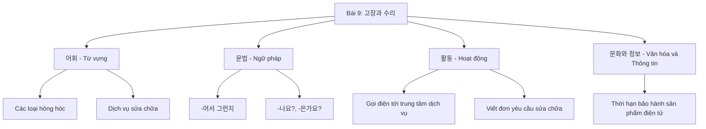
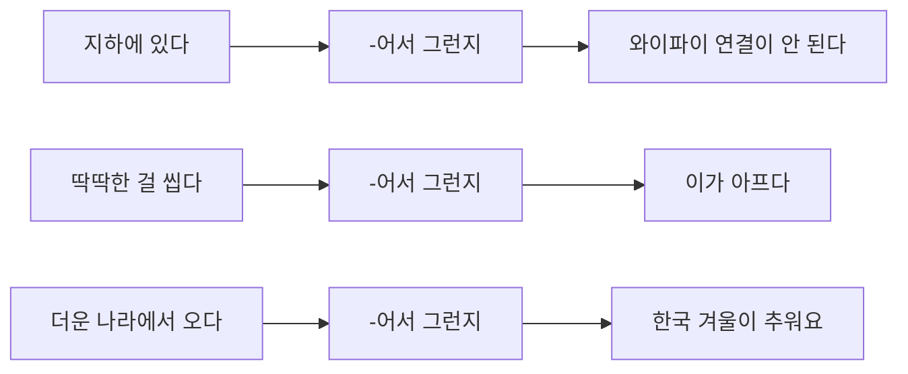
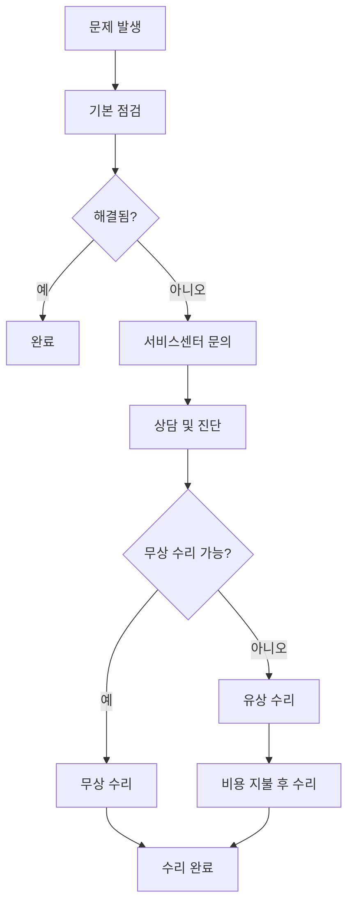
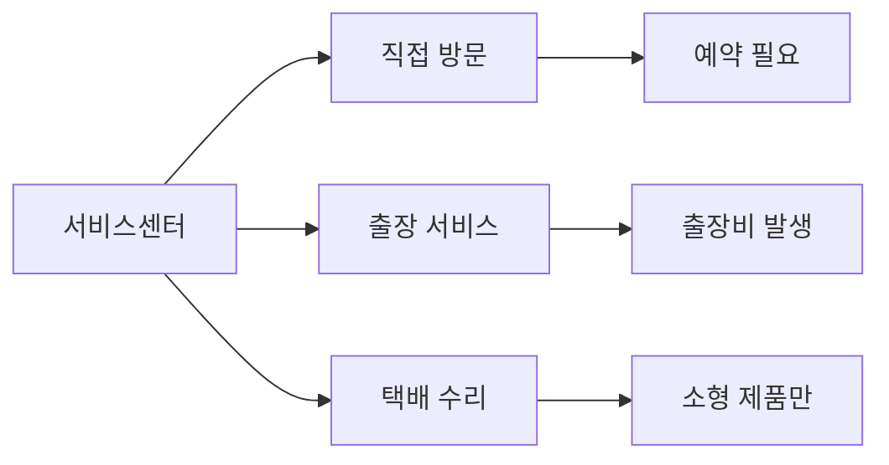
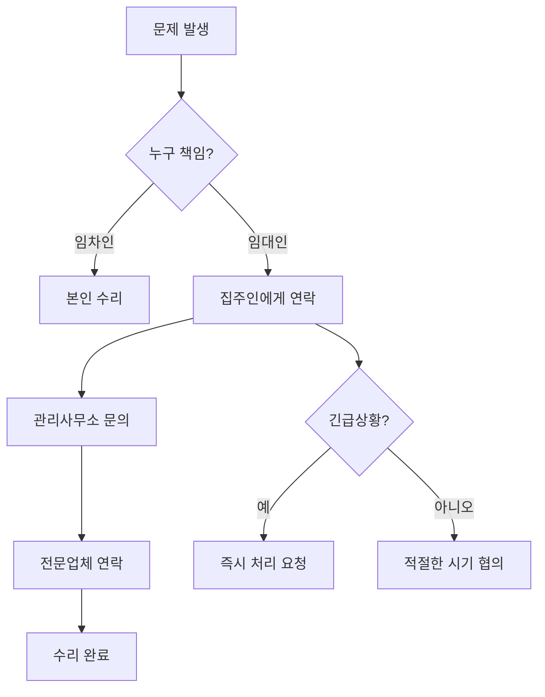

# Bài 9: Hỏng hóc và Sửa chữa

## 고장과 수리

---

## 🎯 Mục tiêu bài học

<div className="border border-blue-200 rounded-lg p-4 mb-6">
<h3 className="text-lg font-semibold text-blue-800 mb-3">Sau khi hoàn thành bài học này, bạn sẽ có thể:</h3>
<ul className="list-disc list-inside space-y-2 text-gray-700">
<li>Mô tả các tình huống hỏng hóc thường gặp</li>
<li>Sử dụng cấu trúc ngữ pháp để suy đoán nguyên nhân</li>
<li>Đặt câu hỏi một cách lịch sự khi cần hỗ trợ</li>
<li>Gọi điện tới trung tâm dịch vụ để được hỗ trợ</li>
<li>Viết đơn yêu cầu sửa chữa</li>
</ul>
</div>

---

## 📚 Cấu trúc bài học



---

## 📖 I. TỪ VỰNG (어휘)

### 1. Các loại hỏng hóc thường gặp

| Tiếng Hàn               | Tiếng Việt              | Ví dụ                                       |
| ----------------------- | ----------------------- | ------------------------------------------- |
| 하수구가 막혔어요       | Cống thoát nước bị tắc  | 머리카락 때문에 하수구가 막혔어요           |
| 변기가 막혔어요         | Bồn cầu bị tắc          | 휴지를 너무 많이 써서 변기가 막혔어요       |
| 물이 안 나와요          | Không có nước           | 수도꼭지를 틀어도 물이 안 나와요            |
| 물이 새요               | Nước bị rò rỉ           | 파이프에서 물이 새고 있어요                 |
| 전등이 나갔어요         | Đèn bị tắt/hỏng         | 전구가 끊어져서 전등이 나갔어요             |
| 문이 잠겼어요           | Cửa bị khóa             | 열쇠를 안에 두고 문이 잠겼어요              |
| 가스불이 안 들어와요    | Bếp gas không bật được  | 가스 밸브를 확인해도 불이 안 들어와요       |
| 냉동이 안 돼요          | Không đông lạnh được    | 냉장고에 문제가 있어서 냉동이 안 돼요       |
| 와이파이 연결이 안 돼요 | Không kết nối được wifi | 비밀번호를 맞게 입력해도 와이파이가 안 돼요 |
| 액정이 깨졌어요         | Màn hình bị vỡ          | 휴대폰을 떨어뜨려서 액정이 깨졌어요         |
| 부팅이 안 돼요          | Không khởi động được    | 컴퓨터를 켜도 부팅이 안 돼요                |
| 전원이 안 켜져요        | Không bật nguồn được    | 노트북 전원이 갑자기 안 켜져요              |

### 2. Dịch vụ sửa chữa

| Tiếng Hàn              | Tiếng Việt                | Cách sử dụng                                   |
| ---------------------- | ------------------------- | ---------------------------------------------- |
| 서비스센터에 문의하다  | Liên hệ trung tâm dịch vụ | 고장이 나면 서비스센터에 문의하세요            |
| 출장 서비스를 신청하다 | Đăng ký dịch vụ tận nhà   | 무거운 제품은 출장 서비스를 신청하는 게 좋아요 |
| 고장이 나다            | Bị hỏng                   | 세탁기가 갑자기 고장이 났어요                  |
| 고치다 / 수리하다      | Sửa chữa                  | 전문가가 와서 고쳐 줬어요                      |
| 서비스센터에 방문하다  | Đến trung tâm dịch vụ     | 직접 서비스센터에 방문해서 수리를 맡겼어요     |
| 수리 비용을 내다       | Trả chi phí sửa chữa      | 보증 기간이 지나서 수리 비용을 내야 해요       |
| 무상 수리를 받다       | Được sửa chữa miễn phí    | 보증 기간 내라서 무상 수리를 받을 수 있어요    |

<div className="bg-yellow-50 border-l-4 border-yellow-400 p-4 my-4">
<h4 className="font-semibold text-yellow-800">💡 Lưu ý quan trọng:</h4>
<p className="text-yellow-700">Khi gọi điện tới trung tâm dịch vụ, hãy chuẩn bị sẵn thông tin về sản phẩm (tên, model, ngày mua) và mô tả rõ ràng tình trạng hỏng hóc.</p>
</div>

---

## 🔤 II. NGỮ PHÁP (문법)

### 1. -어서 그런지 (Có lẽ vì... nên...)

<div className="border border-gray-200 rounded-lg p-4 mb-4">
<h4 className="font-semibold text-gray-800 mb-2">📋 Định nghĩa và Cách dùng</h4>
<p className="text-gray-700">Được sử dụng khi muốn suy đoán nguyên nhân của một tình huống mà không thể khẳng định chắc chắn.</p>
</div>

#### Cách chia động từ/tính từ:

| Loại từ                          | Cách chia           | Ví dụ                        |
| -------------------------------- | ------------------- | ---------------------------- |
| Động từ kết thúc bằng ㅏ, ㅗ     | -아서 그런지        | 가다 → 가서 그런지           |
| Động từ kết thúc bằng ㅓ, ㅜ, ㅣ | -어서 그런지        | 되다 → 되어서 그런지         |
| Động từ kết thúc bằng 하         | -해서 그런지        | 사용하다 → 사용해서 그런지   |
| Tính từ                          | -해서/어서 그런지   | 피곤하다 → 피곤해서 그런지   |
| Danh từ + 이다                   | -이어서/여서 그런지 | 학생이다 → 학생이어서 그런지 |

#### Ví dụ minh họa:



<div className="bg-blue-50 border border-blue-200 rounded-lg p-4 my-4">
<h4 className="font-semibold text-blue-800 mb-2">💬 Ví dụ hội thoại:</h4>
<div className="space-y-2">
<p><span className="font-semibold">후엔:</span> 휴대 전화에 무슨 문제 있어요?</p>
<p><span className="font-semibold">라민:</span> 네, 지하에 있어서 그런지 와이파이 연결이 잘 안 돼요.</p>
</div>
</div>

#### Bài tập áp dụng:

| Tình huống                 | Nguyên nhân suy đoán        | Câu hoàn chỉnh                                                   |
| -------------------------- | --------------------------- | ---------------------------------------------------------------- |
| 냉동이 잘 안 되다          | 냉동실에 음식물을 많이 넣다 | 냉동실에 음식물을 많이 넣어서 그런지 냉동이 잘 안 되는 것 같아요 |
| 휴대 전화 전원이 안 켜지다 | 바닥에 떨어뜨리다           | 바닥에 떨어뜨려서 그런지 전원이 안 켜지는 것 같아요              |
| 벽에서 물이 새다           | 집이 오래되다               | 집이 오래되어서 그런지 벽에서 물이 새는 것 같아요                |
| 인터넷이 느리다            | 다운로드 받은 앱이 많다     | 앱을 많이 다운로드받아서 그런지 인터넷이 느린 것 같아요          |

### 2. -나요? / -은가요? (Câu hỏi lịch sự)

<div className="border border-gray-200 rounded-lg p-4 mb-4">
<h4 className="font-semibold text-gray-800 mb-2">📋 Định nghĩa và Cách dùng</h4>
<p className="text-gray-700">Dùng khi muốn hỏi một cách lịch sự, tạo cảm giác thân thiện và nhẹ nhàng với người nghe.</p>
</div>

#### Cách chia:

| Loại từ               | Cách chia | Ví dụ                  |
| --------------------- | --------- | ---------------------- |
| Động từ               | -나요?    | 걸리다 → 걸리나요?     |
|                       |           | 켜지다 → 켜지나요?     |
| Tính từ có 받침       | -은가요?  | 많다 → 많은가요?       |
| Tính từ không có 받침 | -ㄴ가요?  | 크다 → 큰가요?         |
|                       |           | 싸다 → 싼가요?         |
| Danh từ + 이다        | -인가요?  | 학생이다 → 학생인가요? |

#### So sánh với cách hỏi thông thường:

| Cách hỏi thông thường | Cách hỏi lịch sự | Ngữ cảnh sử dụng                    |
| --------------------- | ---------------- | ----------------------------------- |
| 언제 와요?            | 언제 오나요?     | Khi muốn tỏ ra thân thiện hơn       |
| 얼마예요?             | 얼마인가요?      | Khi hỏi người lạ hoặc trong dịch vụ |
| 어려워요?             | 어려운가요?      | Khi quan tâm, thể hiện sự chia sẻ   |

<div className="bg-green-50 border border-green-200 rounded-lg p-4 my-4">
<h4 className="font-semibold text-green-800 mb-2">💬 Ví dụ thực tế:</h4>
<div className="space-y-2">
<p><span className="font-semibold">이링:</span> 노트북이 고장 나서 서비스 센터에 방문하려고 하는데 예약을 해야 되나요?</p>
<p><span className="font-semibold">동료:</span> 네, 예약하고 가는 게 좋아요.</p>
</div>
</div>

---

## 🗣️ III. HOẠT ĐỘNG GIAO TIẾP (활동)

### 1. Gọi điện tới trung tâm dịch vụ

<div className="border border-purple-200 rounded-lg p-4 mb-4">
<h4 className="font-semibold text-purple-800 mb-2">📞 Mẫu hội thoại cơ bản</h4>

**Khách hàng:** 노트북에 문제가 있어서 서비스 문의 좀 드리려고 하는데요.

**Nhân viên:** 네, 고객님. 어떤 문제가 있는지 말씀해 주시겠어요?

**Khách hàng:** 어제부터 전원이 안 켜지는데 어떻게 해야 되나요?

**Nhân viên:** 갑자기 문제가 생긴 건가요? 혹시 다른 문제는 없으셨어요?

**Khách hàng:** 며칠 전부터 속도가 좀 느려졌어요.

**Nhân viên:** 고객님, 가까운 서비스 센터에 방문하셔서 점검을 받아 보셔야 할 것 같습니다.

**Khách hàng:** 아, 그래요? 그럼 예약 좀 부탁드려요.

</div>

#### Các tình huống thường gặp:

| Vấn đề            | Giải pháp đề xuất | Câu trả lời mẫu                                |
| ----------------- | ----------------- | ---------------------------------------------- |
| 전원이 안 켜지다  | 서비스센터 방문   | 가까운 서비스 센터에 방문하셔서 점검받으세요   |
| 부팅이 안 되다    | 출장 서비스 신청  | 출장 서비스를 신청해서 전문가에게 확인받으세요 |
| 냉동이 잘 안 되다 | 온도 확인 먼저    | 냉동실 온도를 먼저 확인해 보세요               |

### 2. 문제 해결 단계별 접근법



---

## 👂 IV. LUYỆN NGHE (듣기)

### 🎵 File nghe 9-1: Khi nào đến trung tâm dịch vụ?

_[🔊 Audio: 9-1.mp3 - Thời lượng: 1 phút 30 giây]_

**Câu hỏi:** 휴대 전화에 어떤 문제가 생겼을 때 서비스 센터에 갑니까?

**Lựa chọn:**

- 휴대 전화 액정이 깨졌을 때 가요
- 휴대 전화에 물이 들어갔을 때 가요

### 🎵 File nghe 9-2: Hội thoại tại trung tâm dịch vụ

_[🔊 Audio: 9-2.mp3 - Thời lượng: 2 phút]_

**Câu hỏi:**

1. 라흐만 씨의 휴대 전화 액정은 왜 깨졌습니까?
2. 들은 내용과 같으면 ○, 다르면 × 하세요:
   - 일주일 전에 액정이 깨졌다. ( )
   - 액정이 많이 깨져서 비용이 많이 든다. ( )
   - 수리 후에 영수증을 보험사로 보내야 한다. ( )

### Từ vựng trong bài nghe:

| Tiếng Hàn       | Tiếng Việt                  | Ghi chú |
| --------------- | --------------------------- | ------- |
| 보험에 가입하다 | Tham gia bảo hiểm           |         |
| 고객 부담금     | Số tiền khách hàng phải trả |         |
| 제외하다        | Loại trừ                    |         |
| 환급받다        | Được hoàn tiền              |         |

---

## 📖 V. LUYỆN ĐỌC (읽기)

### 1. Cách xử lý sự cố ban đầu

<div className="bg-gray-50 border border-gray-200 rounded-lg p-4 mb-4">
<h4 className="font-semibold text-gray-800 mb-2">🔧 Các thao tác cơ bản trước khi gọi dịch vụ</h4>

| Thao tác           | Tiếng Hàn            | Khi nào sử dụng                 |
| ------------------ | -------------------- | ------------------------------- |
| Cắm phích cắm      | 플러그를 꽂다        | Khi thiết bị không hoạt động    |
| Rút phích cắm      | 플러그를 뽑다        | Khi cần khởi động lại           |
| Mở van             | 밸브를 열다          | Khi không có gas                |
| Đóng van           | 밸브를 잠그다        | Khi có rò rỉ gas                |
| Tăng/giảm nhiệt độ | 온도를 높이다/낮추다 | Khi tủ lạnh không hoạt động tốt |
| Bơm                | 펌프질을 하다        | Khi bồn cầu bị tắc              |

</div>

### 2. Câu hỏi thường gặp (FAQ)

| Vấn đề                      | Cách khắc phục ban đầu                                               |
| --------------------------- | -------------------------------------------------------------------- |
| 텔레비전 전원이 안 켜져요   | 플러그를 잘 꽂았는지 확인해 보세요. 플러그를 뽑았다 다시 꽂아 보세요 |
| 변기가 막혔어요             | 펌프질을 하거나 변기 뚫는 세제를 사용해서 뚫어 보세요                |
| 가스불이 안 들어와요        | 밸브를 열었는지 확인해 보세요                                        |
| 냉동이 잘 안 돼요           | 온도가 높지 않은가요? 온도를 낮춰 보세요                             |
| 노트북 화면이 안 나와요     | 전원을 껐다가 켜 보세요                                              |
| 휴대 전화 속도가 느려졌어요 | 앱을 종료하거나 불필요한 데이터를 삭제해 보세요                      |

### 3. Đọc hiểu: Bài viết trên diễn đàn

<div className="bg-blue-50 border-l-4 border-blue-400 p-4 my-4">
<h4 className="font-semibold text-blue-800">📝 Bài viết mẫu trên diễn đàn Q&A</h4>

**Câu hỏi (Q):** 저희 집 변기가 자주 막혀요. 저희 집은 변기를 많이 사용하지도 않는데 너무 자주 막힙니다. 사용할 때마다 조심하는데 물이 잘 내려가지 않습니다. 일주일에 서너 번 이상 막히는 것 같습니다. 막힐 때마다 펌프질을 하고 변기 뚫는 세제를 사용해서 뚫는데 그때뿐이고 며칠 지나면 다시 막힙니다. 어떻게 하면 좋을까요?

**Trả lời (A):** 그 정도면 전문가 도움을 받으셔야 합니다. 일주일에 서너 번 이상 막히면 사용하실 때마다 스트레스가 심하셨겠어요. 변기가 막히는 이유는 여러 가지가 있습니다. 오래 사용하셨거나 물의 양이 부족해서 생기는 문제일 수도 있고, 변기 안에 이물질이 들어간 경우도 생각해 볼 수 있습니다. 이물질이 들어간 경우에는 펌프질이나 세제를 사용하는 것만으로는 해결이 안 됩니다. 전문가에게 연락하셔서 점검과 도움을 받으시기 바랍니다.

</div>

#### Câu hỏi đọc hiểu:

1. **어떤 문제가 있어서 인터넷 게시판에 질문을 했습니까?**
   - 변기가 자주 막히는 문제

2. **내용과 같으면 ○, 다르면 × 하세요:**
   - 이런 문제가 처음 생겼다. (×)
   - 변기에 이물질이 들어갔을 때는 세제를 사용하면 된다. (×)
   - 변기에 이물질이 들어갔을 때는 전문가의 도움이 필요하다. (○)

3. **변기가 막히는 이유가 아닌 것을 고르세요:**
   - ④ 펌프질을 자주 해서

---

## ✍️ VI. LUYỆN VIẾT (쓰기)

### Viết đơn yêu cầu sửa chữa

<div className="bg-yellow-50 border border-yellow-200 rounded-lg p-4 mb-4">
<h4 className="font-semibold text-yellow-800 mb-2">📋 Cấu trúc email yêu cầu sửa chữa</h4>

**Thông tin cần chuẩn bị:**

- 어떤 문제가 있어요? (Vấn đề gì?)
- 언제부터 그런 문제가 생겼어요? (Từ khi nào?)
- 무엇을 요청할 거예요? (Yêu cầu gì?)
</div>

#### Mẫu email:

```
받는 사람: 디오빌 관리 사무실 (manager@dovill.com)
제목: 아파트 수리 요청

안녕하세요. 디오빌 아파트 205동 1503호에 거주하는 [이름]입니다.

며칠 전부터 아파트에 문제가 생겨서 수리를 요청드리려고 연락드립니다.

[문제 상황 설명]
- 변기가 계속 막혀서 물이 잘 내려가지 않습니다
- 펌프질을 해도 며칠 지나면 다시 막힙니다
- 일주일에 서너 번씩 같은 문제가 반복됩니다

[요청 사항]
전문가께서 방문하셔서 정확한 원인을 확인하고 수리해 주시기 바랍니다.

빠른 시일 내에 처리해 주시면 감사하겠습니다.

[날짜]
[이름]
[연락처]
```

---

## 🌏 VII. VĂN HÓA VÀ THÔNG TIN (문화와 정보)

### Thời hạn bảo hành sản phẩm điện tử ở Hàn Quốc

<div className="border border-indigo-200 rounded-lg p-4 mb-4">
<h4 className="font-semibold text-indigo-800 mb-2">📱 Thông tin bảo hành</h4>

| Sản phẩm            | Thời hạn bảo hành | Lưu ý                        |
| ------------------- | ----------------- | ---------------------------- |
| 휴대폰 (Điện thoại) | 1년               | Không bao gồm hỏng do va đập |
| 노트북 (Laptop)     | 1-2년             | Tùy theo hãng                |
| 냉장고 (Tủ lạnh)    | 3년               | 압축기: 10년                 |
| 세탁기 (Máy giặt)   | 3년               | Động cơ: 10년                |
| 텔레비전 (TV)       | 1년               | Màn hình: 3년                |

**Điều kiện bảo hành:**

- 보증서 và 영수증 (Giấy bảo hành và hóa đơn)
- 정상적인 사용 (Sử dụng bình thường)
- 무상 수리 조건 (Điều kiện sửa chữa miễn phí)
</div>

### Dịch vụ sửa chữa ở Hàn Quốc



<div className="bg-red-50 border border-red-200 rounded-lg p-4 my-4">
<h4 className="font-semibold text-red-800 mb-2">⚠️ Lưu ý quan trọng</h4>
<ul className="list-disc list-inside space-y-1 text-red-700">
<li>보증 기간이 지나면 수리 비용이 발생합니다</li>
<li>출장 서비스는 별도의 출장비가 있습니다</li>
<li>수리 전에 반드시 견적을 받으세요</li>
<li>수리 후 영수증을 잘 보관하세요</li>
</ul>
</div>

---

## 🎯 VIII. TỔNG KẾT VÀ BÀI TẬP TỔNG HỢP

### Kiểm tra kiến thức

<div className="border border-green-200 rounded-lg p-4 mb-4">
<h4 className="font-semibold text-green-800 mb-2">✅ Checklist tự kiểm tra</h4>

**Từ vựng:**

- ☐ Tôi có thể mô tả các loại hỏng hóc thường gặp
- ☐ Tôi hiểu các thuật ngữ liên quan đến dịch vụ sửa chữa

**Ngữ pháp:**

- ☐ Tôi có thể sử dụng "-어서 그런지" để suy đoán nguyên nhân
- ☐ Tôi có thể dùng "-나요?/-은가요?" để hỏi một cách lịch sự

**Giao tiếp:**

- ☐ Tôi có thể gọi điện tới trung tâm dịch vụ
- ☐ Tôi có thể viết email yêu cầu sửa chữa
- ☐ Tôi có thể mô tả vấn đề và yêu cầu hỗ trợ

**Văn hóa:**

- ☐ Tôi hiểu về hệ thống bảo hành ở Hàn Quốc
</div>

### Bài tập tổng hợp

#### 1. Bài tập ngữ pháp

**A. Hoàn thành câu với "-어서 그런지"**

| Tình huống                            | Câu trả lời                                     |
| ------------------------------------- | ----------------------------------------------- |
| 휴대폰이 느려요. (게임을 많이 하다)   | 게임을 많이 해서 그런지 휴대폰이 느린 것 같아요 |
| 변기가 막혔어요. (휴지를 많이 쓰다)   | **\*\***\_\_\_**\*\***                          |
| 컴퓨터가 안 켜져요. (어제 넘어뜨리다) | **\*\***\_\_\_**\*\***                          |
| 인터넷이 안 돼요. (비가 많이 오다)    | **\*\***\_\_\_**\*\***                          |

**B. 바꿔 쓰기: 정중한 질문으로**

| 일반적인 질문  | 정중한 질문        |
| -------------- | ------------------ |
| 얼마예요?      | 얼마인가요?        |
| 언제 와요?     | \***\*\_\_\_\*\*** |
| 어려워요?      | \***\*\_\_\_\*\*** |
| 시간이 걸려요? | \***\*\_\_\_\*\*** |

#### 2. 상황별 대화 완성

<div className="bg-purple-50 border border-purple-200 rounded-lg p-4 mb-4">
<h4 className="font-semibold text-purple-800 mb-2">💬 상황 1: 서비스센터 전화</h4>

**직원:** 안녕하세요. 삼성 서비스센터입니다.

**고객:** ****\*\*****\_****\*\***** (노트북 문의)

**직원:** 어떤 문제가 있으시나요?

**고객:** ****\*\*****\_****\*\***** (화면이 안 나와요)

**직원:** 언제부터 그런 문제가 있으셨나요?

**고객:** ****\*\*****\_****\*\***** (어제부터)

**직원:** 다른 문제는 없으셨나요?

**고객:** ****\*\*****\_****\*\***** (소리도 안 나와요)

**직원:** 그럼 직접 방문하셔서 점검받으시는 게 좋겠네요.

**고객:** ****\*\*****\_****\*\***** (예약하고 싶어요)

</div>

<div className="bg-orange-50 border border-orange-200 rounded-lg p-4 mb-4">
<h4 className="font-semibold text-orange-800 mb-2">💬 상황 2: 집 수리 요청</h4>

**관리사무소:** 네, 관리사무소입니다.

**주민:** ****\*\*****\_****\*\***** (화장실 문제)

**관리사무소:** 어떤 문제인지 자세히 말씀해 주세요.

**주민:** ****\*\*****\_****\*\***** (변기가 자주 막혀요)

**관리사무소:** 언제부터 그런 문제가 있으셨나요?

**주민:** ****\*\*****\_****\*\***** (일주일 전부터)

**관리사무소:** 펌프질은 해보셨나요?

**주민:** ****\*\*****\_****\*\***** (해봤지만 또 막혀요)

**관리사무소:** 그럼 전문가를 보내드릴게요.

**주민:** ****\*\*****\_****\*\***** (감사합니다)

</div>

#### 3. 읽기 이해도 테스트

다음 글을 읽고 질문에 답하세요:

---

**A/S 서비스 안내**

저희 브랜드 제품을 구매해 주셔서 감사합니다. 제품에 문제가 생기면 다음과 같이 이용하세요.

**무상 A/S 기간:** 구매일로부터 1년
**무상 A/S 조건:**

- 정상적인 사용 중 고장 발생
- 보증서와 영수증 지참
- 사용자 과실로 인한 고장 제외

**서비스 방법:**

1. **방문 서비스:** 가까운 서비스센터 방문 (예약 필요)
2. **출장 서비스:** 기사님이 직접 방문 (출장비 별도)
3. **택배 서비스:** 소형 제품만 가능

**문의:** 1588-0000 (24시간 상담 가능)

---

**질문:**

1. 무상 A/S를 받으려면 무엇이 필요합니까?
2. 출장 서비스의 단점은 무엇입니까?
3. 언제든지 상담받을 수 있습니까?

### 4. 실전 응용 - 이메일 작성

다음 상황에 맞는 이메일을 작성해보세요:

<div className="bg-gray-50 border border-gray-200 rounded-lg p-4 mb-4">
<h4 className="font-semibold text-gray-800 mb-2">📧 상황:</h4>
<p>당신은 원룸에 살고 있습니다. 어제부터 온수가 나오지 않고 있습니다. 샤워를 할 수 없어서 매우 불편합니다. 집주인에게 빨리 고쳐달라고 이메일을 보내려고 합니다.</p>
</div>

**이메일 템플릿:**

```
받는 사람: ________________
제목: ________________

________________,

저는 ________________에 거주하는 ________________입니다.

[문제 설명]
________________

[요청사항]
________________

빠른 처리 부탁드립니다.

감사합니다.

[날짜] ________________
[이름] ________________
[연락처] ________________
```

---

## 📚 IX. 부록 (PHẦN PHỤ LỤC)

### A. 발음 연습 (Luyện phát âm)

#### 한자어 발음 변화

| 기본 발음 | 실제 발음 | 예시              |
| --------- | --------- | ----------------- |
| ㄷ + ㄷ   | [ㄸ]      | 갈등 → [갈똥]     |
| ㅅ + ㅅ   | [ㅆ]      | 일시적 → [일씨적] |
| ㅈ + ㅈ   | [ㅉ]      | 출장 → [출짱]     |

#### 연습 문장:

<div className="bg-blue-50 border-l-4 border-blue-400 p-4 my-4">
<h4 className="font-semibold text-blue-800">🗣️ 발음 연습</h4>
<ul className="space-y-2 text-blue-700">
<li>1) 고객의 무리한 요구 때문에 갈등이 자주 생겨요. [갈똥]</li>
<li>2) 와이파이가 안 되는 것은 일시적인 문제예요. [일씨적]</li>
<li>3) 냉장고가 고장 나면 출장 서비스를 신청하세요. [출짱]</li>
</ul>
</div>

### B. 유용한 표현 모음

#### 전화 상담 시:

| 상황      | 표현                                    |
| --------- | --------------------------------------- |
| 상담 시작 | ~에 문제가 있어서 문의드리려고 하는데요 |
| 문제 설명 | 어제부터 ~이/가 안 돼요                 |
| 추가 정보 | 며칠 전부터 ~도 이상해요                |
| 요청      | ~해 주시면 감사하겠습니다               |
| 예약      | 예약 좀 부탁드려요                      |

#### 이메일 작성 시:

| 부분      | 표현                             |
| --------- | -------------------------------- |
| 인사      | 안녕하세요. ~에 거주하는 ~입니다 |
| 목적      | ~때문에 연락드립니다             |
| 문제 설명 | ~부터 ~한 문제가 있습니다        |
| 요청      | ~해 주시기 바랍니다              |
| 마무리    | 빠른 처리 부탁드립니다           |

### C. 관련 어휘 확장

#### 전자제품 관련:

| 부품/기능 | 한국어 | 문제 상황            |
| --------- | ------ | -------------------- |
| 배터리    | 배터리 | 배터리가 빨리 닳아요 |
| 충전기    | 충전기 | 충전이 안 돼요       |
| 케이블    | 케이블 | 케이블이 끊어졌어요  |
| 스피커    | 스피커 | 소리가 안 나와요     |
| 마이크    | 마이크 | 목소리가 안 들려요   |
| 카메라    | 카메라 | 사진이 흐려요        |

#### 집 수리 관련:

| 시설     | 한국어   | 일반적인 문제      |
| -------- | -------- | ------------------ |
| 보일러   | 보일러   | 온수가 안 나와요   |
| 에어컨   | 에어컨   | 냉방이 안 돼요     |
| 수도꼭지 | 수도꼭지 | 물이 똑똑 떨어져요 |
| 문손잡이 | 문손잡이 | 문이 잘 안 열려요  |
| 형광등   | 형광등   | 불빛이 깜빡거려요  |

### D. 문화 정보 심화

#### 한국의 A/S 문화

<div className="border border-indigo-200 rounded-lg p-4 mb-4">
<h4 className="font-semibold text-indigo-800 mb-2">🏢 서비스 센터 이용 팁</h4>

**예약 시스템:**

- 대부분의 서비스센터는 예약제 운영
- 온라인 또는 전화로 예약 가능
- 예약 없이 방문하면 대기시간이 길 수 있음

**준비물:**

- 보증서 (구매 시 제공되는 서비스 카드)
- 구매 영수증 또는 카드 결제 내역
- 신분증

**서비스 종류:**

- 점검 서비스 (진단만)
- 수리 서비스 (부품 교체 포함)
- 출장 서비스 (대형 제품)
- 택배 A/S (소형 제품)
</div>

#### 임대주택에서의 수리 요청



**임차인 vs 임대인 책임:**

- **임차인 책임:** 일상적인 사용으로 인한 소모품 교체 (전구, 필터 등)
- **임대인 책임:** 시설 노화, 구조적 문제, 설비 고장

---

## 🎊 X. 마무리

### 학습 성취도 확인

<div className="bg-green-50 border border-green-200 rounded-lg p-4 mb-4">
<h4 className="font-semibold text-green-800 mb-2">🏆 이 단원을 완료한 후 당신은:</h4>

**할 수 있게 된 것들:**

- ✅ 다양한 고장 상황을 한국어로 설명할 수 있습니다
- ✅ 원인을 추측하여 자연스럽게 표현할 수 있습니다
- ✅ 서비스 센터에 정중하게 문의할 수 있습니다
- ✅ 수리 요청 이메일을 작성할 수 있습니다
- ✅ 한국의 A/S 시스템을 이해하고 활용할 수 있습니다

**실생활 적용:**

- 🏠 집에서 문제가 생겼을 때 당황하지 않고 대처
- 📱 전자제품 고장 시 적절한 서비스 요청
- 💬 한국인과 자연스럽게 문제 상황 공유
- 📧 공식적인 요청 이메일 작성 능력
</div>

### 다음 단원 미리보기

다음 단원에서는 **"건강과 병원"** 주제를 다룰 예정입니다. 건강 문제 표현, 병원 예약, 의료진과의 대화 등을 학습하게 됩니다.

<div className="border-l-4 border-yellow-400 p-4 my-4">
<h4 className="font-semibold text-yellow-800 mb-2">💡 학습 조언</h4>
<p className="text-yellow-700">이 단원에서 배운 "-어서 그런지"와 "-나요?/-은가요?" 표현은 일상대화에서 매우 유용합니다. 다양한 상황에서 자주 연습해보세요. 특히 문제 해결이 필요한 상황에서는 정중하고 명확한 의사소통이 중요합니다.</p>
</div>

---

**📞 추가 학습 자료:**

- 🎵 Audio files: 9-1.mp3, 9-2.mp3
- 📱 온라인 연습: [학습 사이트 링크]
- 📋 추가 연습지: [다운로드 링크]

<div className="text-center p-4 border-t border-gray-200 mt-8">
<p className="text-gray-600">수고하셨습니다! 다음 단원에서 만나요! 🌟</p>
</div>
