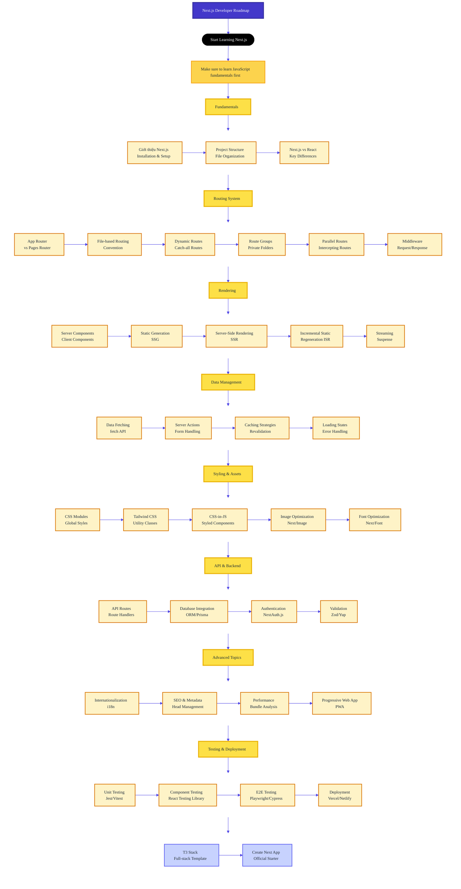

# Next.js Learning Path

```mermaid
%%{init: {
  'theme': 'base',
  'themeVariables': {
    'background': '#ffffff',
    'primaryColor': '#000000',
    'primaryTextColor': '#ffffff',
    'primaryBorderColor': '#000000',
    'lineColor': '#4F46E5',
    'secondaryColor': '#f8fafc',
    'tertiaryColor': '#e2e8f0',
    'quaternaryColor': '#cbd5e1',
    'fontFamily': 'Inter, -apple-system, BlinkMacSystemFont, Segoe UI, sans-serif',
    'fontSize': '13px'
  }
}}%%
flowchart TD
    %% Header
    HEADER[Next.js Developer Roadmap]
    START([🎯 Start Learning Next.js])
    
    %% JavaScript Foundation
    JS_FOUNDATION[Make sure to learn JavaScript<br/>fundamentals first]
    
    %% Main Categories
    FUNDAMENTALS[Fundamentals]
    ROUTING[Routing System]  
    RENDERING[Rendering]
    DATA[Data Management]
    STYLING[Styling & Assets]
    API[API & Backend]
    ADVANCED[Advanced Topics]
    TESTING[Testing & Deployment]
    
    %% Fundamentals Group
    subgraph fund [" "]
        F1[Giới thiệu Next.js<br/>Installation & Setup]
        F2[Project Structure<br/>File Organization]
        F3[Next.js vs React<br/>Key Differences]
    end
    
    %% Routing Group
    subgraph rout [" "]
        R1[App Router<br/>vs Pages Router]
        R2[File-based Routing<br/>Convention]
        R3[Dynamic Routes<br/>Catch-all Routes]
        R4[Route Groups<br/>Private Folders]
        R5[Parallel Routes<br/>Intercepting Routes]
        R6[Middleware<br/>Request/Response]
    end
    
    %% Rendering Group  
    subgraph rend [" "]
        RE1[Server Components<br/>Client Components]
        RE2[Static Generation<br/>SSG]
        RE3[Server-Side Rendering<br/>SSR]
        RE4[Incremental Static<br/>Regeneration ISR]
        RE5[Streaming<br/>Suspense]
    end
    
    %% Data Management Group
    subgraph data [" "]
        D1[Data Fetching<br/>fetch API]
        D2[Server Actions<br/>Form Handling]
        D3[Caching Strategies<br/>Revalidation]
        D4[Loading States<br/>Error Handling]
    end
    
    %% Styling Group
    subgraph styl [" "]
        S1[CSS Modules<br/>Global Styles]
        S2[Tailwind CSS<br/>Utility Classes]
        S3[CSS-in-JS<br/>Styled Components]
        S4[Image Optimization<br/>Next/Image]
        S5[Font Optimization<br/>Next/Font]
    end
    
    %% API Group
    subgraph apis [" "]
        A1[API Routes<br/>Route Handlers]
        A2[Database Integration<br/>ORM/Prisma]
        A3[Authentication<br/>NextAuth.js]
        A4[Validation<br/>Zod/Yup]
    end
    
    %% Advanced Group
    subgraph adv [" "]
        ADV1[Internationalization<br/>i18n]
        ADV2[SEO & Metadata<br/>Head Management]
        ADV3[Performance<br/>Bundle Analysis]
        ADV4[Progressive Web App<br/>PWA]
    end
    
    %% Testing Group
    subgraph test [" "]
        T1[Unit Testing<br/>Jest/Vitest]
        T2[Component Testing<br/>React Testing Library]
        T3[E2E Testing<br/>Playwright/Cypress]
        T4[Deployment<br/>Vercel/Netlify]
    end
    
    %% Frameworks
    subgraph frame [" "]
        FR1[T3 Stack<br/>Full-stack Template]
        FR2[Create Next App<br/>Official Starter]
    end
    
    %% Flow connections
    HEADER --> START
    START --> JS_FOUNDATION
    JS_FOUNDATION --> FUNDAMENTALS
    FUNDAMENTALS --> fund
    fund --> ROUTING
    ROUTING --> rout
    rout --> RENDERING
    RENDERING --> rend
    rend --> DATA
    DATA --> data
    data --> STYLING
    STYLING --> styl
    styl --> API
    API --> apis
    apis --> ADVANCED
    ADVANCED --> adv
    adv --> TESTING
    TESTING --> test
    test --> frame
    
    %% Internal connections
    F1 --> F2 --> F3
    R1 --> R2 --> R3 --> R4 --> R5 --> R6
    RE1 --> RE2 --> RE3 --> RE4 --> RE5
    D1 --> D2 --> D3 --> D4
    S1 --> S2 --> S3 --> S4 --> S5
    A1 --> A2 --> A3 --> A4
    ADV1 --> ADV2 --> ADV3 --> ADV4
    T1 --> T2 --> T3 --> T4
    FR1 --> FR2
    
    %% Styling
    style HEADER fill:#4338CA,stroke:#3730A3,color:#ffffff,stroke-width:3px
    style START fill:#000000,stroke:#000000,color:#ffffff,stroke-width:3px
    style JS_FOUNDATION fill:#FCD34D,stroke:#F59E0B,color:#1F2937,stroke-width:2px
    
    %% Category headers - Yellow theme like roadmap.sh
    style FUNDAMENTALS fill:#FDE047,stroke:#EAB308,color:#1F2937,stroke-width:3px
    style ROUTING fill:#FDE047,stroke:#EAB308,color:#1F2937,stroke-width:3px
    style RENDERING fill:#FDE047,stroke:#EAB308,color:#1F2937,stroke-width:3px
    style DATA fill:#FDE047,stroke:#EAB308,color:#1F2937,stroke-width:3px
    style STYLING fill:#FDE047,stroke:#EAB308,color:#1F2937,stroke-width:3px
    style API fill:#FDE047,stroke:#EAB308,color:#1F2937,stroke-width:3px
    style ADVANCED fill:#FDE047,stroke:#EAB308,color:#1F2937,stroke-width:3px
    style TESTING fill:#FDE047,stroke:#EAB308,color:#1F2937,stroke-width:3px
    
    %% Content nodes - Cream/beige theme like roadmap.sh
    style F1 fill:#FEF3C7,stroke:#D97706,color:#1F2937,stroke-width:2px
    style F2 fill:#FEF3C7,stroke:#D97706,color:#1F2937,stroke-width:2px
    style F3 fill:#FEF3C7,stroke:#D97706,color:#1F2937,stroke-width:2px
    
    style R1 fill:#FEF3C7,stroke:#D97706,color:#1F2937,stroke-width:2px
    style R2 fill:#FEF3C7,stroke:#D97706,color:#1F2937,stroke-width:2px
    style R3 fill:#FEF3C7,stroke:#D97706,color:#1F2937,stroke-width:2px
    style R4 fill:#FEF3C7,stroke:#D97706,color:#1F2937,stroke-width:2px
    style R5 fill:#FEF3C7,stroke:#D97706,color:#1F2937,stroke-width:2px
    style R6 fill:#FEF3C7,stroke:#D97706,color:#1F2937,stroke-width:2px
    
    style RE1 fill:#FEF3C7,stroke:#D97706,color:#1F2937,stroke-width:2px
    style RE2 fill:#FEF3C7,stroke:#D97706,color:#1F2937,stroke-width:2px
    style RE3 fill:#FEF3C7,stroke:#D97706,color:#1F2937,stroke-width:2px
    style RE4 fill:#FEF3C7,stroke:#D97706,color:#1F2937,stroke-width:2px
    style RE5 fill:#FEF3C7,stroke:#D97706,color:#1F2937,stroke-width:2px
    
    style D1 fill:#FEF3C7,stroke:#D97706,color:#1F2937,stroke-width:2px
    style D2 fill:#FEF3C7,stroke:#D97706,color:#1F2937,stroke-width:2px
    style D3 fill:#FEF3C7,stroke:#D97706,color:#1F2937,stroke-width:2px
    style D4 fill:#FEF3C7,stroke:#D97706,color:#1F2937,stroke-width:2px
    
    style S1 fill:#FEF3C7,stroke:#D97706,color:#1F2937,stroke-width:2px
    style S2 fill:#FEF3C7,stroke:#D97706,color:#1F2937,stroke-width:2px
    style S3 fill:#FEF3C7,stroke:#D97706,color:#1F2937,stroke-width:2px
    style S4 fill:#FEF3C7,stroke:#D97706,color:#1F2937,stroke-width:2px
    style S5 fill:#FEF3C7,stroke:#D97706,color:#1F2937,stroke-width:2px
    
    style A1 fill:#FEF3C7,stroke:#D97706,color:#1F2937,stroke-width:2px
    style A2 fill:#FEF3C7,stroke:#D97706,color:#1F2937,stroke-width:2px
    style A3 fill:#FEF3C7,stroke:#D97706,color:#1F2937,stroke-width:2px
    style A4 fill:#FEF3C7,stroke:#D97706,color:#1F2937,stroke-width:2px
    
    style ADV1 fill:#FEF3C7,stroke:#D97706,color:#1F2937,stroke-width:2px
    style ADV2 fill:#FEF3C7,stroke:#D97706,color:#1F2937,stroke-width:2px
    style ADV3 fill:#FEF3C7,stroke:#D97706,color:#1F2937,stroke-width:2px
    style ADV4 fill:#FEF3C7,stroke:#D97706,color:#1F2937,stroke-width:2px
    
    style T1 fill:#FEF3C7,stroke:#D97706,color:#1F2937,stroke-width:2px
    style T2 fill:#FEF3C7,stroke:#D97706,color:#1F2937,stroke-width:2px
    style T3 fill:#FEF3C7,stroke:#D97706,color:#1F2937,stroke-width:2px
    style T4 fill:#FEF3C7,stroke:#D97706,color:#1F2937,stroke-width:2px
    
    style FR1 fill:#C7D2FE,stroke:#6366F1,color:#1F2937,stroke-width:2px
    style FR2 fill:#C7D2FE,stroke:#6366F1,color:#1F2937,stroke-width:2px
    
    %% Hide subgraph borders
    style fund fill:transparent,stroke:transparent
    style rout fill:transparent,stroke:transparent
    style rend fill:transparent,stroke:transparent
    style data fill:transparent,stroke:transparent
    style styl fill:transparent,stroke:transparent
    style apis fill:transparent,stroke:transparent
    style adv fill:transparent,stroke:transparent
    style test fill:transparent,stroke:transparent
    style frame fill:transparent,stroke:transparent
    
    %% Click events with detailed tooltips
    click F1 "266es0wtr8e7ii9/c4vuslx0gx1laci" "Tìm hiểu các khái niệm cốt lõi của Next.js, cách cài đặt và thiết lập dự án đầu tiên. Khám phá sự khác biệt với React thông thường."
    click F2 "266es0wtr8e7ii9/c4vuslx0gx1laci" "Hiểu cấu trúc thư mục của Next.js, các file config quan trọng và cách tổ chức code hiệu quả."
    click F3 "266es0wtr8e7ii9/c4vuslx0gx1laci" "So sánh Next.js với React thuần, tìm hiểu những ưu điểm và tính năng mới mà Next.js mang lại."
    
    click R1 "266es0wtr8e7ii9/voyz4ia27wdsy0x" "So sánh App Router (mới) và Pages Router (cũ), hiểu khi nào nên sử dụng từng loại."
    click R2 "266es0wtr8e7ii9/tmt9cyigdzd5cxd" "Tìm hiểu cách Next.js sử dụng file system để tạo routes tự động, các quy tắc đặt tên file."
    click R3 "266es0wtr8e7ii9/tjfo83j0py9u6od" "Học cách tạo dynamic routes với [id], [...slug] và [[...params]] cho URLs linh hoạt."
    click R4 "266es0wtr8e7ii9/y460tzc6ylyb3rv" "Route Groups để tổ chức routes, Private Folders và cách sử dụng (folder) syntax."
    click R5 "266es0wtr8e7ii9/y460tzc6ylyb3rv" "Parallel Routes để render nhiều pages cùng lúc, Intercepting Routes để override navigation."
    click R6 "266es0wtr8e7ii9/i3t8314i95db2ve" "Middleware để xử lý requests trước khi đến page, authentication, redirects và header modifications."
    
    click RE1 "266es0wtr8e7ii9/ilwkfxrbdal5qa3" "Hiểu sự khác biệt giữa Server Components (chạy trên server) và Client Components (chạy trên browser)."
    click RE2 "266es0wtr8e7ii9/ilwkfxrbdal5qa3" "Static Site Generation - tạo HTML tại build time để có performance tối ưu và SEO tốt."
    click RE3 "266es0wtr8e7ii9/ilwkfxrbdal5qa3" "Server-Side Rendering - render HTML trên server cho mỗi request, phù hợp với dữ liệu động."
    click RE4 "266es0wtr8e7ii9/762fkll9k53pn2y" "ISR cho phép cập nhật static pages mà không cần rebuild toàn bộ site."
    click RE5 "266es0wtr8e7ii9/ilwkfxrbdal5qa3" "Streaming và Suspense để cải thiện loading experience bằng cách hiển thị content từng phần."
    
    click D1 "266es0wtr8e7ii9/z891nn4ba8q1qdn" "Các phương pháp fetch dữ liệu: fetch API, axios, SWR và cách sử dụng trong Server/Client Components."
    click D2 "266es0wtr8e7ii9/ew6isk5rlqvfcyu" "Server Actions để xử lý form submissions và mutations một cách an toàn từ client."
    click D3 "266es0wtr8e7ii9/762fkll9k53pn2y" "Caching strategies: Request Memoization, Data Cache, Full Route Cache và Router Cache."
    click D4 "266es0wtr8e7ii9/kz8pii4zs4z5307" "Revalidation để cập nhật cache, xử lý loading states và error boundaries."
    
    click S1 "266es0wtr8e7ii9/x6fbc1env3k3r5o" "CSS Modules để scope CSS locally, Global Styles và cách import CSS files."
    click S2 "266es0wtr8e7ii9/x6fbc1env3k3r5o" "Tailwind CSS integration, utility-first approach và customization trong Next.js."
    click S3 "266es0wtr8e7ii9/x6fbc1env3k3r5o" "CSS-in-JS solutions như Styled Components, Emotion và cách setup trong Next.js."
    click S4 "266es0wtr8e7ii9/9d2afssukszim97" "Next/Image component để tối ưu hóa hình ảnh: lazy loading, responsive, format optimization."
    click S5 "266es0wtr8e7ii9/9d2afssukszim97" "Next/Font để tối ưu hóa fonts: Google Fonts integration và local font optimization."
    
    click A1 "266es0wtr8e7ii9/8ju3tgjnlh2cz9u" "API Routes trong Pages Router và Route Handlers trong App Router để tạo backend endpoints."
    click A2 "266es0wtr8e7ii9/8ju3tgjnlh2cz9u" "Tích hợp database với Prisma, Drizzle ORM hoặc direct database connections."
    click A3 "266es0wtr8e7ii9/nfx3bmfc6g76d1z" "Authentication với NextAuth.js, session management và protecting routes."
    click A4 "266es0wtr8e7ii9/8ju3tgjnlh2cz9u" "Validation với Zod, Yup để validate form data và API inputs một cách an toàn."
    
    click ADV1 "266es0wtr8e7ii9/vw1smcwh2ar6yyv" "Internationalization (i18n) để hỗ trợ multiple languages và localization."
    click ADV2 "266es0wtr8e7ii9/rzz0mxrox6vu71v" "SEO optimization với Metadata API, OpenGraph, Twitter Cards và structured data."
    click ADV3 "266es0wtr8e7ii9/vw1smcwh2ar6yyv" "Performance monitoring, bundle analysis với @next/bundle-analyzer và optimization techniques."
    click ADV4 "266es0wtr8e7ii9/vw1smcwh2ar6yyv" "Progressive Web App features: service workers, manifest, offline support."
    
    click T1 "266es0wtr8e7ii9/xv3b20s7qujy3we" "Unit testing với Jest, Vitest để test individual functions và components."
    click T2 "266es0wtr8e7ii9/xv3b20s7qujy3we" "Component testing với React Testing Library để test user interactions."
    click T3 "266es0wtr8e7ii9/xv3b20s7qujy3we" "End-to-end testing với Playwright, Cypress để test complete user workflows."
    click T4 "266es0wtr8e7ii9/fft8st2ly9sw1fo" "Deployment trên Vercel, Netlify, hoặc custom servers. CI/CD setup và monitoring."
    
    click FR1 "#" "T3 Stack: TypeScript + Next.js + tRPC + Prisma + NextAuth.js - full-stack template được recommend."
    click FR2 "#" "Create Next App - official starter template với các options: TypeScript, Tailwind, App Router."
```