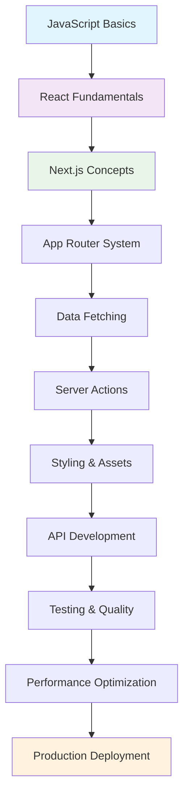
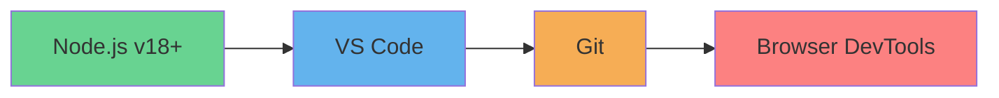
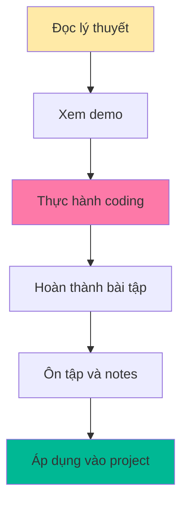
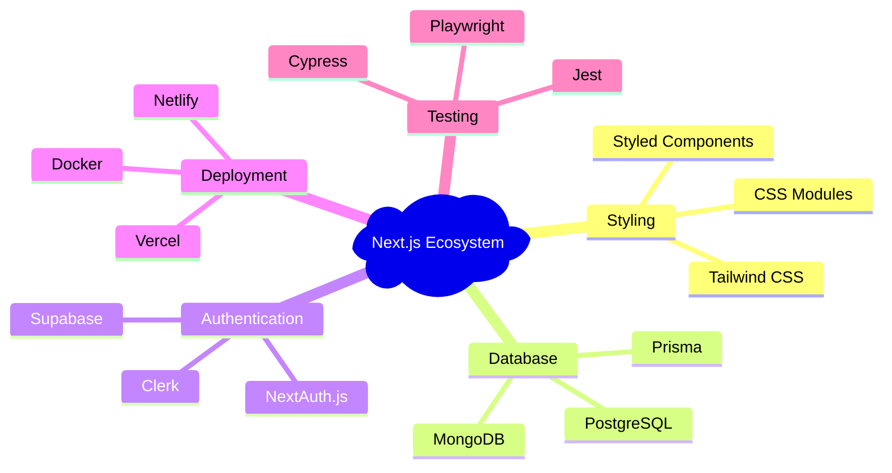

# Bài 0: Giới thiệu khóa học Next.js cho người mới bắt đầu

  <h2 className="text-3xl font-bold mb-2">🚀 Chào mừng bạn đến với khóa học Next.js!</h2>
  
Từ zero đến hero trong 18 bài học thực tế

## 📚 Tổng quan khóa học

Khóa học Next.js này được thiết kế dành riêng cho **người mới bắt đầu**, giúp bạn nắm vững từ những kiến thức cơ bản nhất đến các kỹ thuật nâng cao. Chúng ta sẽ cùng nhau xây dựng những ứng dụng web hiện đại và tối ưu hóa.

### 🎯 Mục tiêu khóa học

| Mục tiêu | Mô tả chi tiết |
|----------|---------------|
| **Nền tảng vững chắc** | Hiểu rõ JavaScript ES6+, React cơ bản và các khái niệm web development |
| **Thành thạo Next.js** | Làm chủ App Router, Server Components, và các tính năng mới nhất |
| **Kỹ năng thực tế** | Xây dựng ứng dụng hoàn chỉnh từ development đến production |
| **Best practices** | Áp dụng các tiêu chuẩn công nghiệp về performance, SEO và testing |

## 🗺️ Lộ trình học tập

### 📊 Phân bố nội dung khóa học

| Giai đoạn | Bài học | Trọng tâm | Thời gian ước tính |
|-----------|---------|-----------|-------------------|
| **Foundation** | 1-3 | JavaScript, React, Concepts | 3 tuần |
| **Core Skills** | 4-8 | Setup, Routing, Rendering | 5 tuần |
| **Advanced Features** | 9-14 | Data, Forms, Styling, SEO | 6 tuần |
| **Production Ready** | 15-18 | API, Testing, Performance, Deploy | 4 tuần |

  

    

      

        <strong>💡 Lưu ý:</strong> Mỗi bài học đều có phần thực hành để bạn áp dụng ngay kiến thức đã học.
      

    

  

## 🛠️ Yêu cầu trước khóa học

### Kiến thức cần có

| Mức độ | Kiến thức | Mô tả |
|--------|-----------|-------|
| **Bắt buộc** | HTML/CSS cơ bản | Hiểu cấu trúc web, styling cơ bản |
| **Khuyến nghị** | JavaScript cơ bản | Variables, functions, DOM manipulation |
| **Tùy chọn** | Git/GitHub | Version control (sẽ hướng dẫn trong khóa) |

### Công cụ cần cài đặt

  

    <h4 className="font-bold text-green-800">✅ Bắt buộc</h4>
    <ul className="text-green-700 mt-2">
      <li>• Node.js (phiên bản 18 trở lên)</li>
      <li>• VS Code hoặc editor tương tự</li>
      <li>• Web browser hiện đại</li>
    </ul>
  

  

    <h4 className="font-bold text-blue-800">💡 Khuyến nghị</h4>
    <ul className="text-blue-700 mt-2">
      <li>• Git cho version control</li>
      <li>• Chrome DevTools</li>
      <li>• Postman/Thunder Client</li>
    </ul>
  

## 🎓 Phương pháp học tập

### Cấu trúc mỗi bài học

| Phần | Thời gian | Nội dung |
|------|-----------|----------|
| **Lý thuyết** | 30-40% | Giải thích khái niệm, nguyên lý |
| **Demo** | 20-30% | Minh họa qua ví dụ thực tế |
| **Thực hành** | 40-50% | Coding exercises, mini projects |

### Nguyên tắc học tập hiệu quả

  <h3 className="text-purple-800 font-bold mb-3">🎯 Tips học tập hiệu quả</h3>
  

    

      <h4 className="font-semibold text-purple-700">Trong bài học:</h4>
      <ul className="text-purple-600 mt-1 space-y-1">
        <li>• Code theo từng bước</li>
        <li>• Ghi chú những điểm quan trọng</li>
        <li>• Thắc mắc gì hãy tìm hiểu ngay</li>
      </ul>
    

    

      <h4 className="font-semibold text-purple-700">Sau bài học:</h4>
      <ul className="text-purple-600 mt-1 space-y-1">
        <li>• Thực hành lại không xem tài liệu</li>
        <li>• Mở rộng bài tập với ý tưởng riêng</li>
        <li>• Tìm hiểu thêm từ tài liệu chính thức</li>
      </ul>
    

  

## 🚀 Tính năng nổi bật sẽ học

### Next.js 14+ Features

| Tính năng | Lợi ích | Bài học |
|-----------|---------|---------|
| **App Router** | Routing hiện đại, nested layouts | 5-7 |
| **Server Components** | Performance tối ưu, SEO friendly | 8-9 |
| **Server Actions** | Full-stack development đơn giản | 11 |
| **Turbopack** | Build tool siêu nhanh | 4, 17 |
| **Image Optimization** | Tối ưu hình ảnh tự động | 13 |

### Ecosystem Tools

## 📈 Kết quả sau khóa học

  <h3 className="text-2xl font-bold mb-4">🎖️ Bạn sẽ có thể:</h3>
  

    

      <h4 className="font-bold mb-2">Technical Skills:</h4>
      <ul className="space-y-1">
        <li>✨ Xây dựng ứng dụng Next.js từ A-Z</li>
        <li>🔧 Implement Server & Client Components</li>
        <li>🗄️ Tích hợp database và API</li>
        <li>🎨 Styling với Tailwind CSS</li>
      </ul>
    

    

      <h4 className="font-bold mb-2">Professional Skills:</h4>
      <ul className="space-y-1">
        <li>📊 Performance optimization</li>
        <li>🧪 Testing strategies</li>
        <li>🚀 Production deployment</li>
        <li>🔍 SEO và accessibility</li>
      </ul>
    

  

### Dự án cuối khóa

| Dự án | Mô tả | Công nghệ sử dụng |
|-------|-------|------------------|
| **E-commerce Platform** | Website bán hàng hoàn chỉnh | Next.js 14, Prisma, Stripe, Tailwind |
| **Blog CMS** | Hệ thống quản lý nội dung | Server Actions, MDX, Authentication |
| **Portfolio Website** | Trang cá nhân chuyên nghiệp | SSG, Image Optimization, SEO |

## 🎯 Bước tiếp theo

  <h3 className="text-orange-800 font-bold mb-2">Chuẩn bị cho bài học đầu tiên:</h3>
  <ol className="text-orange-700 space-y-2">
    <li><strong>1.</strong> Cài đặt Node.js từ <code className="bg-orange-100 px-2 py-1 rounded">nodejs.org</code></li>
    <li><strong>2.</strong> Setup VS Code với các extensions cần thiết</li>
    <li><strong>3.</strong> Tạo tài khoản GitHub (nếu chưa có)</li>
    <li><strong>4.</strong> Ôn tập lại JavaScript ES6+ basics</li>
  </ol>

### Lịch học khuyến nghị

```mermaid
gantt
    title Lịch trình học Next.js (18 tuần)
    dateFormat X
    axisFormat %s
    
    section Foundation
    JavaScript Basics    :0, 7
    React Fundamentals   :7, 14
    Next.js Concepts     :14, 21
    
    section Core Skills  
    Project Setup        :21, 28
    App Router           :28, 35
    Layouts & Navigation :35, 42
    Advanced Routing     :42, 49
    Rendering Strategies :49, 56
    
    section Advanced
    Data Fetching        :56, 63
    Server Actions       :63, 70
    Styling & Assets     :70, 84
    API Development      :84, 91
    
    section Production
    Testing              :91, 98
    Performance          :98, 105
    Deployment           :105, 112
    Final Project        :112, 126
```

---

  <h2 className="text-2xl font-bold text-gray-800 mb-4">🎉 Sẵn sàng bắt đầu hành trình?</h2>
  
Hãy chuẩn bị tinh thần và công cụ cần thiết.

  
Bài học tiếp theo: JavaScript Basics & ES6+ Features

> **💬 Lời khuyên:** Hãy kiên nhẫn và thực hành thường xuyên. Mỗi dòng code bạn viết đều là một bước tiến gần hơn đến mục tiêu trở thành Next.js developer!