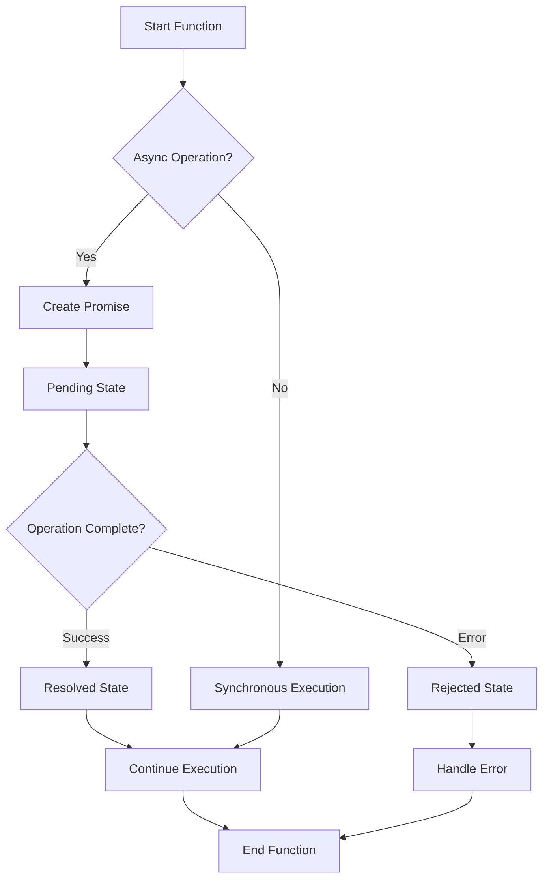
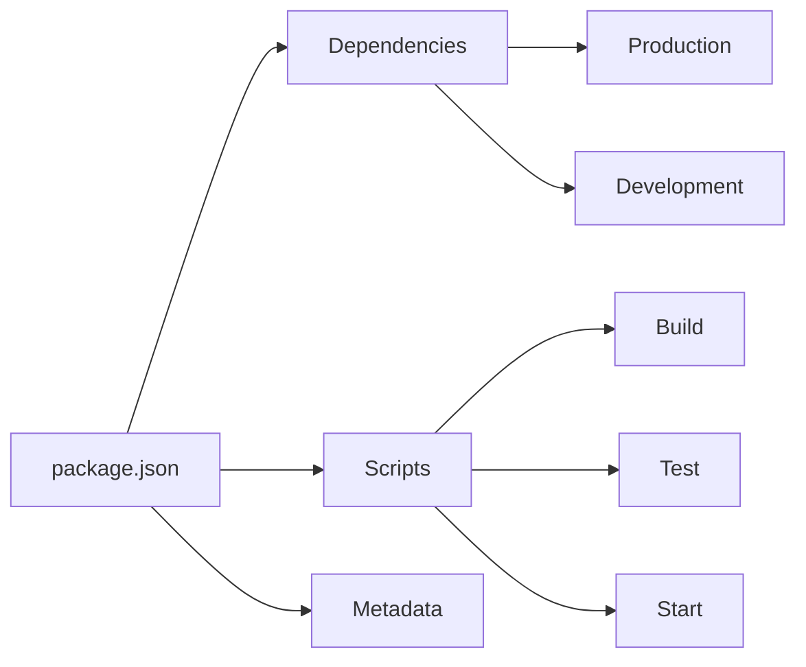
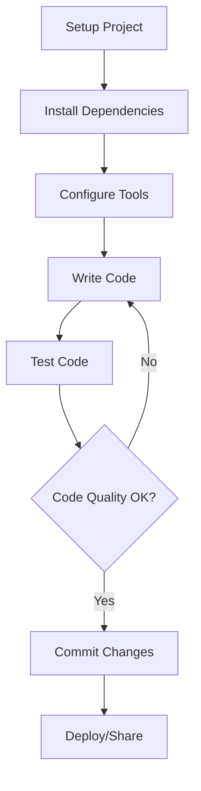

# Bài 1: Giới thiệu và JavaScript Basics

<div className="bg-gradient-to-r from-blue-50 to-indigo-50 p-6 rounded-lg border-l-4 border-blue-500 mb-8">
  <h2 className="text-2xl font-bold text-blue-800 mb-3">🎯 Mục tiêu bài học</h2>
  <ul className="text-blue-700 space-y-2">
    <li>✅ Nắm vững các tính năng JavaScript ES6+ cần thiết</li>
    <li>✅ Hiểu về DOM manipulation và event handling</li>
    <li>✅ Làm quen với NPM và package management</li>
    <li>✅ Thiết lập môi trường development hoàn chỉnh</li>
  </ul>
</div>

## 📚 1. Tổng quan về JavaScript ES6+

JavaScript ES6+ (ECMAScript 2015 trở lên) đã mang đến nhiều tính năng mới giúp code trở nên ngắn gọn và dễ đọc hơn. Đây là nền tảng quan trọng để học Next.js hiệu quả.

### 📊 Bảng so sánh JavaScript ES5 vs ES6+

| Tính năng | ES5 | ES6+ | Lợi ích |
|-----------|-----|------|---------|
| Khai báo biến | `var` | `let`, `const` | Block scope, immutability |
| Functions | `function()` | `() => {}` | Shorter syntax, lexical this |
| Strings | Concatenation | Template literals | Easier interpolation |
| Objects | Manual copying | Destructuring | Cleaner code |
| Modules | CommonJS | ES Modules | Standard module system |

### 🎯 Arrow Functions

<div className="bg-gray-50 p-4 rounded-lg border mb-4">
  <h4 className="font-semibold text-gray-800 mb-2">💡 Ví dụ thực tế</h4>
</div>

```javascript
// ES5 - Traditional function
function calculateArea(width, height) {
  return width * height;
}

// ES6+ - Arrow function
const calculateArea = (width, height) => width * height;

// Arrow function với multiple statements
const processUserData = (user) => {
  const formattedName = user.name.toUpperCase();
  const age = new Date().getFullYear() - user.birthYear;
  return { name: formattedName, age };
};
```

### 🔧 Destructuring Assignment

```javascript
// Object destructuring
const user = {
  name: 'Nguyen Van A',
  email: 'nguyenvana@email.com',
  address: {
    city: 'Ho Chi Minh',
    district: 'District 1'
  }
};

// Extract properties
const { name, email } = user;
const { city } = user.address;

// Array destructuring
const colors = ['red', 'green', 'blue'];
const [primary, secondary, tertiary] = colors;

// Rest operator
const { name: userName, ...otherInfo } = user;
```

### 📦 ES Modules

```javascript
// math.js - Export functions
export const add = (a, b) => a + b;
export const subtract = (a, b) => a - b;
export default function multiply(a, b) {
  return a * b;
}

// main.js - Import functions
import multiply, { add, subtract } from './math.js';
import * as mathUtils from './math.js';

console.log(add(5, 3)); // 8
console.log(multiply(4, 2)); // 8
```

## 🌐 2. DOM Manipulation và Event Handling

### DOM Query Methods

| Method | Description | Use Case |
|--------|-------------|----------|
| `getElementById()` | Select by ID | Single unique element |
| `querySelector()` | Select by CSS selector | First matching element |
| `querySelectorAll()` | Select all matching | Multiple elements |
| `getElementsByClassName()` | Select by class | Multiple elements |

```javascript
// Modern DOM selection
const button = document.querySelector('#submit-btn');
const inputs = document.querySelectorAll('.form-input');

// Event handling với arrow functions
button.addEventListener('click', (event) => {
  event.preventDefault();
  console.log('Button clicked!');
});

// Async event handling
const handleFormSubmit = async (event) => {
  event.preventDefault();
  const formData = new FormData(event.target);
  
  try {
    const response = await fetch('/api/submit', {
      method: 'POST',
      body: formData
    });
    const result = await response.json();
    console.log('Success:', result);
  } catch (error) {
    console.error('Error:', error);
  }
};
```

## ⚡ 3. Promises và Async/Await

### 📈 Flow diagram cho Asynchronous Operations



### 💻 Async/Await Examples

```javascript
// Promise-based API call
const fetchUserData = (userId) => {
  return fetch(`/api/users/${userId}`)
    .then(response => response.json())
    .then(data => data)
    .catch(error => console.error('Error:', error));
};

// Async/await version
const fetchUserDataAsync = async (userId) => {
  try {
    const response = await fetch(`/api/users/${userId}`);
    const userData = await response.json();
    return userData;
  } catch (error) {
    console.error('Error fetching user:', error);
    throw error;
  }
};

// Multiple async operations
const loadDashboardData = async () => {
  try {
    const [users, posts, comments] = await Promise.all([
      fetch('/api/users').then(res => res.json()),
      fetch('/api/posts').then(res => res.json()),
      fetch('/api/comments').then(res => res.json())
    ]);
    
    return { users, posts, comments };
  } catch (error) {
    console.error('Dashboard loading failed:', error);
  }
};
```

## 📦 4. NPM và Package Management

### 🏗️ Cấu trúc NPM Project



### 📋 NPM Commands Reference

| Command | Description | Example |
|---------|-------------|---------|
| `npm init` | Initialize new project | `npm init -y` |
| `npm install` | Install dependencies | `npm install react` |
| `npm install --save-dev` | Install dev dependencies | `npm i -D typescript` |
| `npm run` | Run script | `npm run build` |
| `npm update` | Update packages | `npm update` |
| `npm audit` | Security audit | `npm audit fix` |

### 📄 Package.json Structure

<div className="bg-yellow-50 p-4 rounded-lg border-l-4 border-yellow-500 mb-4">
  <h4 className="font-semibold text-yellow-800 mb-2">⚠️ Lưu ý quan trọng</h4>
  <div className="text-yellow-700">Luôn sử dụng package-lock.json để đảm bảo version consistency across environments</div>
</div>

```json
{
  "name": "my-nextjs-project",
  "version": "1.0.0",
  "description": "NextJS learning project",
  "main": "index.js",
  "scripts": {
    "dev": "next dev",
    "build": "next build",
    "start": "next start",
    "lint": "next lint",
    "test": "jest"
  },
  "dependencies": {
    "next": "^14.0.0",
    "react": "^18.0.0",
    "react-dom": "^18.0.0"
  },
  "devDependencies": {
    "@types/node": "^20.0.0",
    "@types/react": "^18.0.0",
    "typescript": "^5.0.0",
    "eslint": "^8.0.0"
  }
}
```

## ⚙️ 5. Thiết lập Môi trường Development

### 🛠️ Essential Tools Checklist

<div className="bg-green-50 p-4 rounded-lg mb-4">
  <h4 className="font-semibold text-green-800 mb-3">✅ Development Environment Setup</h4>
  <div className="grid grid-cols-2 gap-4 text-green-700">
    <div>
      <h5 className="font-semibold">Required Tools:</h5>
      <ul className="list-disc list-inside space-y-1 text-sm">
        <li>Node.js (LTS version)</li>
        <li>Visual Studio Code</li>
        <li>Git</li>
        <li>Web Browser (Chrome/Firefox)</li>
      </ul>
    </div>
    <div>
      <h5 className="font-semibold">Recommended Extensions:</h5>
      <ul className="list-disc list-inside space-y-1 text-sm">
        <li>ES7+ React/Redux/React-Native</li>
        <li>Auto Rename Tag</li>
        <li>Bracket Pair Colorizer</li>
        <li>GitLens</li>
      </ul>
    </div>
  </div>
</div>

### 🔧 VS Code Configuration

```json
// .vscode/settings.json
{
  "editor.formatOnSave": true,
  "editor.defaultFormatter": "esbenp.prettier-vscode",
  "emmet.includeLanguages": {
    "javascript": "javascriptreact",
    "typescript": "typescriptreact"
  },
  "files.associations": {
    "*.tsx": "typescriptreact"
  }
}
```

### 📊 Development Workflow



## 🚀 6. Thực hành: Xây dựng ứng dụng JavaScript ES6+

### 📝 Project: Task Manager Application

<div className="bg-blue-50 p-4 rounded-lg border mb-4">
  <h4 className="font-semibold text-blue-800 mb-2">🎯 Mục tiêu thực hành</h4>
  <div className="text-blue-700">Xây dựng ứng dụng quản lý công việc sử dụng các tính năng JavaScript ES6+ đã học</div>
</div>

#### HTML Structure

```html
<!DOCTYPE html>
<html lang="vi">
<head>
    <meta charset="UTF-8">
    <meta name="viewport" content="width=device-width, initial-scale=1.0">
    <title>Task Manager</title>
    <script src="https://cdn.tailwindcss.com"></script>
</head>
<body className="bg-gray-100 min-h-screen">
    <div className="container mx-auto px-4 py-8">
        <div className="max-w-2xl mx-auto">
            <h1 className="text-3xl font-bold text-gray-800 mb-8 text-center">
                📋 Task Manager
            </h1>
            
            <form id="task-form" className="bg-white p-6 rounded-lg shadow-md mb-6">
                <div className="flex gap-4 mb-4">
                    <input 
                        type="text" 
                        id="task-input" 
                        placeholder="Nhập công việc mới..."
                        className="flex-1 px-4 py-2 border border-gray-300 rounded-lg focus:ring-2 focus:ring-blue-500 focus:border-transparent"
                        required
                    >
                    <button 
                        type="submit"
                        className="px-6 py-2 bg-blue-500 text-white rounded-lg hover:bg-blue-600 transition-colors"
                    >
                        Thêm
                    </button>
                </div>
            </form>
            
            <div id="task-list" className="space-y-3"></div>
            
            <div id="task-stats" className="mt-6 p-4 bg-white rounded-lg shadow-md">
                <h3 className="font-semibold text-gray-700 mb-2">📊 Thống kê</h3>
                <div className="grid grid-cols-3 gap-4 text-center">
                    <div>
                        <div id="total-tasks" className="text-2xl font-bold text-blue-500">0</div>
                        <div className="text-sm text-gray-600">Tổng số</div>
                    </div>
                    <div>
                        <div id="completed-tasks" className="text-2xl font-bold text-green-500">0</div>
                        <div className="text-sm text-gray-600">Hoàn thành</div>
                    </div>
                    <div>
                        <div id="pending-tasks" className="text-2xl font-bold text-orange-500">0</div>
                        <div className="text-sm text-gray-600">Chưa xong</div>
                    </div>
                </div>
            </div>
        </div>
    </div>
    
    <script src="script.js"></script>
</body>
</html>
```

#### JavaScript Application Code

```javascript
// script.js
class TaskManager {
  constructor() {
    this.tasks = this.loadTasks();
    this.nextId = this.getNextId();
    this.init();
  }

  // Initialize event listeners
  init() {
    const form = document.querySelector('#task-form');
    form.addEventListener('submit', (e) => this.handleAddTask(e));
    this.renderTasks();
    this.updateStats();
  }

  // Handle form submission
  handleAddTask = (event) => {
    event.preventDefault();
    const input = document.querySelector('#task-input');
    const taskText = input.value.trim();
    
    if (taskText) {
      this.addTask(taskText);
      input.value = '';
    }
  }

  // Add new task
  addTask(text) {
    const newTask = {
      id: this.nextId++,
      text,
      completed: false,
      createdAt: new Date().toISOString()
    };
    
    this.tasks.push(newTask);
    this.saveTasks();
    this.renderTasks();
    this.updateStats();
  }

  // Toggle task completion
  toggleTask = (id) => {
    const task = this.tasks.find(task => task.id === id);
    if (task) {
      task.completed = !task.completed;
      this.saveTasks();
      this.renderTasks();
      this.updateStats();
    }
  }

  // Delete task
  deleteTask = (id) => {
    this.tasks = this.tasks.filter(task => task.id !== id);
    this.saveTasks();
    this.renderTasks();
    this.updateStats();
  }

  // Render tasks to DOM
  renderTasks() {
    const taskList = document.querySelector('#task-list');
    
    if (this.tasks.length === 0) {
      taskList.innerHTML = `
        <div className="text-center py-8 text-gray-500">
          <div>Chưa có công việc nào. Hãy thêm công việc đầu tiên!</div>
        </div>
      `;
      return;
    }

    const tasksHTML = this.tasks
      .sort((a, b) => a.completed - b.completed)
      .map(task => this.createTaskHTML(task))
      .join('');
    
    taskList.innerHTML = tasksHTML;
  }

  // Create HTML for single task
  createTaskHTML(task) {
    const { id, text, completed } = task;
    const completedClass = completed ? 'line-through text-gray-500' : '';
    const buttonText = completed ? '↩️ Hoàn tác' : '✅ Hoàn thành';
    const buttonClass = completed 
      ? 'bg-yellow-500 hover:bg-yellow-600' 
      : 'bg-green-500 hover:bg-green-600';

    return `
      <div className="bg-white p-4 rounded-lg shadow-sm border-l-4 ${completed ? 'border-green-500' : 'border-gray-300'}">
        <div className="flex items-center justify-between">
          <span className="flex-1 ${completedClass}">${text}</span>
          <div className="flex gap-2 ml-4">
            <button 
              onclick="taskManager.toggleTask(${id})"
              className="px-3 py-1 text-sm text-white rounded ${buttonClass} transition-colors"
            >
              ${buttonText}
            </button>
            <button 
              onclick="taskManager.deleteTask(${id})"
              className="px-3 py-1 text-sm text-white rounded bg-red-500 hover:bg-red-600 transition-colors"
            >
              🗑️ Xóa
            </button>
          </div>
        </div>
      </div>
    `;
  }

  // Update statistics
  updateStats() {
    const total = this.tasks.length;
    const completed = this.tasks.filter(task => task.completed).length;
    const pending = total - completed;

    document.querySelector('#total-tasks').textContent = total;
    document.querySelector('#completed-tasks').textContent = completed;
    document.querySelector('#pending-tasks').textContent = pending;
  }

  // Local storage methods
  saveTasks() {
    try {
      localStorage.setItem('tasks', JSON.stringify(this.tasks));
    } catch (error) {
      console.error('Error saving tasks:', error);
    }
  }

  loadTasks() {
    try {
      const saved = localStorage.getItem('tasks');
      return saved ? JSON.parse(saved) : [];
    } catch (error) {
      console.error('Error loading tasks:', error);
      return [];
    }
  }

  getNextId() {
    return this.tasks.length > 0 
      ? Math.max(...this.tasks.map(task => task.id)) + 1 
      : 1;
  }
}

// Initialize application
const taskManager = new TaskManager();

// Export for potential module use
if (typeof module !== 'undefined' && module.exports) {
  module.exports = TaskManager;
}
```

## 📝 Tóm tắt bài học

<div className="bg-indigo-50 p-6 rounded-lg border-l-4 border-indigo-500">
  <h3 className="text-xl font-bold text-indigo-800 mb-4">🎯 Kiến thức đã học</h3>
  <div className="grid md:grid-cols-2 gap-4 text-indigo-700">
    <div>
      <h4 className="font-semibold mb-2">JavaScript ES6+ Features:</h4>
      <ul className="list-disc list-inside space-y-1 text-sm">
        <li>Arrow functions và lexical this</li>
        <li>Destructuring assignment</li>
        <li>Template literals</li>
        <li>ES Modules import/export</li>
        <li>Promises và async/await</li>
      </ul>
    </div>
    <div>
      <h4 className="font-semibold mb-2">Development Tools:</h4>
      <ul className="list-disc list-inside space-y-1 text-sm">
        <li>NPM package management</li>
        <li>VS Code configuration</li>
        <li>DOM manipulation</li>
        <li>Event handling patterns</li>
        <li>Local storage usage</li>
      </ul>
    </div>
  </div>
</div>

### 🎯 Chuẩn bị cho bài tiếp theo

Bài học tiếp theo sẽ tìm hiểu về **React Fundamentals và Frontend Frameworks**. Hãy đảm bảo bạn đã:

- ✅ Nắm vững các tính năng JavaScript ES6+ đã học
- ✅ Thực hành xong bài tập Task Manager
- ✅ Thiết lập xong môi trường development
- ✅ Hiểu được workflow cơ bản của web development

---

<div className="text-center p-4 bg-gray-50 rounded-lg mt-8">
  <div className="text-gray-600 italic">
    💡 "Nền tảng JavaScript vững chắc là chìa khóa để thành công với Next.js và React"
  </div>
</div>