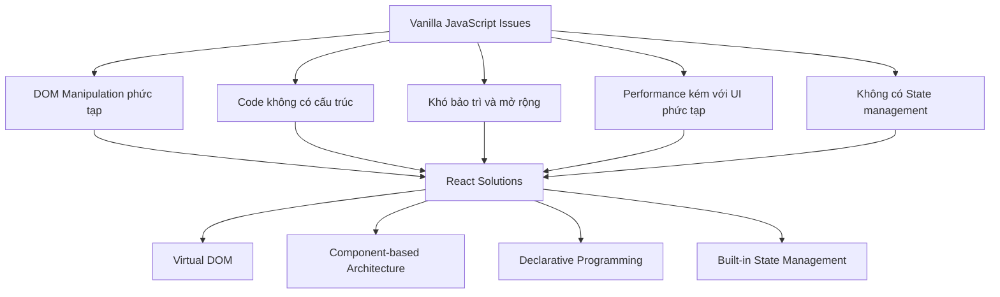
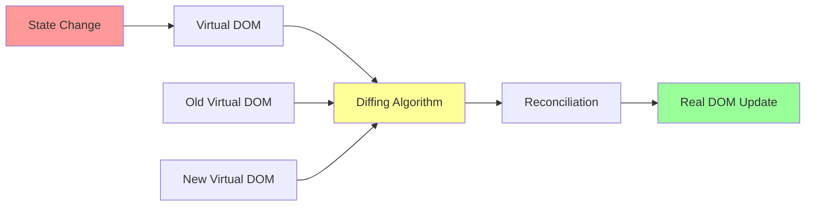
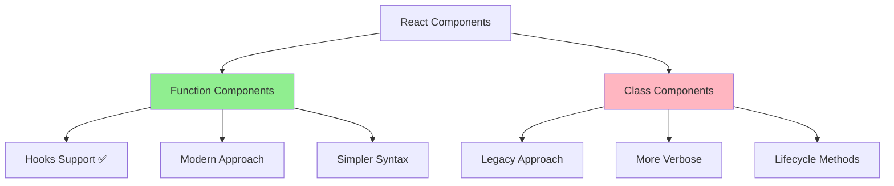
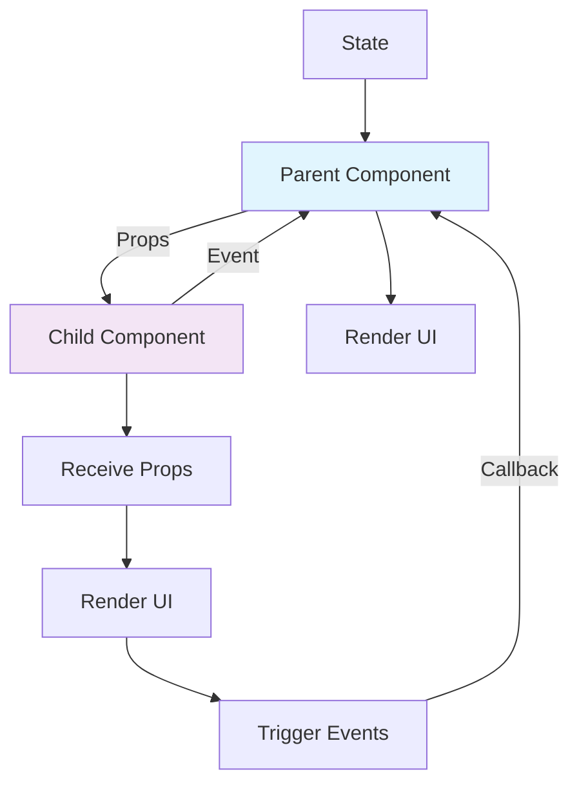
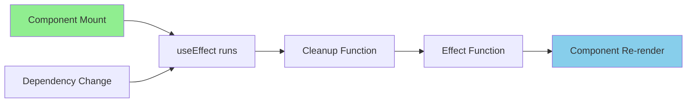
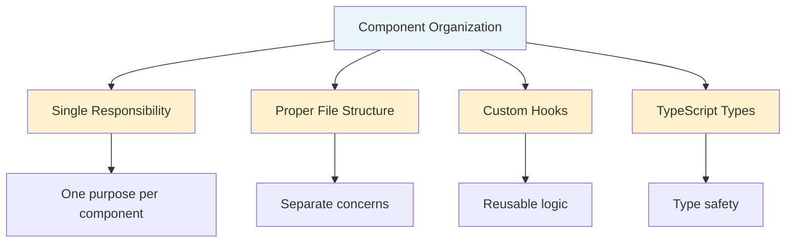

# Bài 2: React Fundamentals và Frontend Frameworks

<div className="bg-gradient-to-r from-blue-50 to-indigo-50 p-6 rounded-lg border-l-4 border-blue-500 mb-8">
  <h2 className="text-2xl font-bold text-blue-800 mb-2">🎯 Mục tiêu bài học</h2>
  <p className="text-gray-700">Hiểu được vai trò của Frontend Frameworks, nắm vững các khái niệm cốt lõi của React và có thể xây dựng component đầu tiên.</p>
</div>

## 1. Tại sao cần Frontend Frameworks?

### 1.1. Vấn đề của Vanilla JavaScript



### 1.2. So sánh Imperative vs Declarative

| **Đặc điểm** | **Imperative (Vanilla JS)** | **Declarative (React)** |
|--------------|----------------------------|--------------------------|
| **Cách tiếp cận** | Mô tả "làm thế nào" | Mô tả "cái gì" |
| **DOM Manipulation** | Thủ công, từng bước | Tự động qua Virtual DOM |
| **Code** | Dài, phức tạp | Ngắn gọn, dễ hiểu |
| **Bảo trì** | Khó | Dễ dàng |
| **Performance** | Phụ thuộc dev | Tối ưu tự động |

<div className="bg-yellow-50 p-4 rounded-lg border-l-4 border-yellow-400 my-6">
  <h3 className="text-lg font-semibold text-yellow-800 mb-2">💡 Ví dụ minh họa</h3>
  <p className="text-gray-700"><strong>Imperative:</strong> "Đi thẳng 100m, rẽ phải, đi tiếp 50m"</p>
  <p className="text-gray-700"><strong>Declarative:</strong> "Tôi muốn đến siêu thị ABC"</p>
</div>

## 2. Virtual DOM và Component Architecture

### 2.1. Virtual DOM Concept



### 2.2. Component-based Architecture

| **Lợi ích** | **Mô tả** | **Ví dụ** |
|-------------|-----------|-----------|
| **Reusability** | Tái sử dụng component | Button, Input, Card |
| **Maintainability** | Dễ bảo trì, update | Chỉ sửa 1 file, effect toàn bộ |
| **Modularity** | Chia nhỏ ứng dụng | Header, Sidebar, Content |
| **Testing** | Test từng component riêng | Unit test cho từng component |

## 3. JSX Syntax và React Components

### 3.1. JSX Fundamentals

<div className="bg-gray-50 p-4 rounded-lg border my-4">
  <h4 className="font-semibold text-gray-800 mb-2">JSX vs HTML Differences</h4>
</div>

| **HTML** | **JSX** | **Lý do** |
|----------|---------|-----------|
| `class` | `className` | `class` là reserved keyword trong JS |
| `for` | `htmlFor` | `for` là reserved keyword trong JS |
| `onclick` | `onClick` | camelCase convention |
| `style="color: red"` | `style={{color: 'red'}}` | Object syntax |

### 3.2. Component Types



### 3.3. Function Component Example

```tsx
// TodoItem.tsx
interface TodoItemProps {
  id: number;
  title: string;
  completed: boolean;
  onToggle: (id: number) => void;
  onDelete: (id: number) => void;
}

const TodoItem: React.FC<TodoItemProps> = ({ 
  id, title, completed, onToggle, onDelete 
}) => {
  return (
    <div className="flex items-center p-4 border rounded-lg mb-2">
      <input
        type="checkbox"
        checked={completed}
        onChange={() => onToggle(id)}
        className="mr-3 h-4 w-4"
      />
      <span className={`flex-1 ${completed ? 'line-through text-gray-500' : ''}`}>
        {title}
      </span>
      <button
        onClick={() => onDelete(id)}
        className="ml-3 px-3 py-1 bg-red-500 text-white rounded hover:bg-red-600"
      >
        Delete
      </button>
    </div>
  );
};

export default TodoItem;
```

## 4. Props, State và Event Handling

### 4.1. Props Flow



### 4.2. State Management Flow

| **Bước** | **Mô tả** | **Code Example** |
|----------|-----------|------------------|
| **1. Initialize** | Khởi tạo state | `const [count, setCount] = useState(0)` |
| **2. Display** | Hiển thị state | `<p>Count: {count}</p>` |
| **3. Update** | Cập nhật state | `setCount(count + 1)` |
| **4. Re-render** | Component tự động render lại | React tự động thực hiện |

## 5. React Hooks Cơ Bản

### 5.1. useState Hook

<div className="bg-blue-50 p-4 rounded-lg border-l-4 border-blue-500 my-4">
  <h4 className="font-semibold text-blue-800">useState Pattern</h4>
</div>

```tsx
const [state, setState] = useState(initialValue);

// Các cách update state
setState(newValue);           // Direct value
setState(prev => prev + 1);   // Function update
setState(prev => ({...prev, name: 'John'})); // Object spread
```

### 5.2. useEffect Hook



### 5.3. useEffect Patterns

| **Pattern** | **Dependencies** | **When it runs** |
|-------------|------------------|------------------|
| `useEffect(() => {})` | None | Every render |
| `useEffect(() => {}, [])` | Empty array | Once on mount |
| `useEffect(() => {}, [dep])` | With dependencies | When dep changes |
| `useEffect(() => { return cleanup }, [])` | With cleanup | Mount + cleanup on unmount |

## 6. Thực hành: Todo App với TypeScript

### 6.1. Project Structure

```
src/
├── components/
│   ├── TodoItem.tsx
│   ├── TodoList.tsx
│   └── AddTodo.tsx
├── types/
│   └── Todo.ts
├── hooks/
│   └── useTodos.ts
└── App.tsx
```

### 6.2. Todo Type Definition

```tsx
// types/Todo.ts
export interface Todo {
  id: number;
  title: string;
  completed: boolean;
  createdAt: Date;
}

export type TodoAction = 
  | { type: 'ADD'; payload: Omit<Todo, 'id'> }
  | { type: 'TOGGLE'; payload: number }
  | { type: 'DELETE'; payload: number }
  | { type: 'UPDATE'; payload: { id: number; title: string } };
```

### 6.3. Custom Hook for Todo Logic

```tsx
// hooks/useTodos.ts
import { useState, useCallback } from 'react';
import { Todo } from '../types/Todo';

export const useTodos = () => {
  const [todos, setTodos] = useState<Todo[]>([]);

  const addTodo = useCallback((title: string) => {
    const newTodo: Todo = {
      id: Date.now(),
      title,
      completed: false,
      createdAt: new Date()
    };
    setTodos(prev => [...prev, newTodo]);
  }, []);

  const toggleTodo = useCallback((id: number) => {
    setTodos(prev => 
      prev.map(todo => 
        todo.id === id ? { ...todo, completed: !todo.completed } : todo
      )
    );
  }, []);

  const deleteTodo = useCallback((id: number) => {
    setTodos(prev => prev.filter(todo => todo.id !== id));
  }, []);

  return {
    todos,
    addTodo,
    toggleTodo,
    deleteTodo,
    completedCount: todos.filter(todo => todo.completed).length,
    totalCount: todos.length
  };
};
```

### 6.4. Main App Component

```tsx
// App.tsx
import React from 'react';
import { useTodos } from './hooks/useTodos';
import TodoList from './components/TodoList';
import AddTodo from './components/AddTodo';

const App: React.FC = () => {
  const { todos, addTodo, toggleTodo, deleteTodo, completedCount, totalCount } = useTodos();

  return (
    <div className="max-w-2xl mx-auto p-6 bg-white min-h-screen">
      <header className="mb-8">
        <h1 className="text-3xl font-bold text-gray-800 mb-2">
          My Todo App
        </h1>
        <div className="flex space-x-4 text-sm text-gray-600">
          <span>Total: {totalCount}</span>
          <span>Completed: {completedCount}</span>
          <span>Remaining: {totalCount - completedCount}</span>
        </div>
      </header>

      <AddTodo onAdd={addTodo} />
      
      <TodoList 
        todos={todos}
        onToggle={toggleTodo}
        onDelete={deleteTodo}
      />
      
      {todos.length === 0 && (
        <div className="text-center py-12 text-gray-500">
          <p className="text-lg">No todos yet!</p>
          <p>Add your first task above.</p>
        </div>
      )}
    </div>
  );
};

export default App;
```

## 7. Best Practices và Performance Tips

### 7.1. Performance Optimization

| **Technique** | **When to use** | **Example** |
|---------------|-----------------|-------------|
| **React.memo** | Component re-renders unnecessarily | `export default React.memo(TodoItem)` |
| **useCallback** | Function props to child components | `const handleClick = useCallback(() => {}, [])` |
| **useMemo** | Expensive calculations | `const expensiveValue = useMemo(() => calculate(), [deps])` |
| **Key prop** | Rendering lists | `{items.map(item => <Item key={item.id} />)}` |

### 7.2. Code Organization Tips



<div className="bg-green-50 p-6 rounded-lg border-l-4 border-green-500 mt-8">
  <h3 className="text-lg font-semibold text-green-800 mb-3">✅ Tóm tắt bài học</h3>
  <ul className="space-y-2 text-green-700">
    <li><strong>Frontend Frameworks:</strong> Giải quyết vấn đề phức tạp của vanilla JS</li>
    <li><strong>React Philosophy:</strong> Declarative, component-based, Virtual DOM</li>
    <li><strong>Core Concepts:</strong> JSX, Props, State, Events, Hooks</li>
    <li><strong>Best Practices:</strong> TypeScript, custom hooks, performance optimization</li>
  </ul>
</div>

<div className="bg-orange-50 p-6 rounded-lg border-l-4 border-orange-500 mt-6">
  <h3 className="text-lg font-semibold text-orange-800 mb-3">🚀 Chuẩn bị cho bài tiếp theo</h3>
  <p className="text-orange-700">Bài 3 sẽ tìm hiểu về SPA vs SSR và giới thiệu Next.js - framework mở rộng khả năng của React với server-side rendering và nhiều tính năng mạnh mẽ khác.</p>
</div>