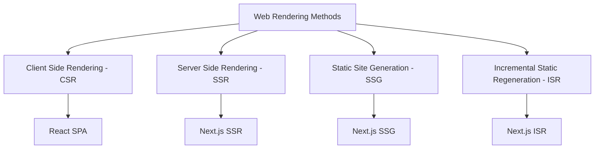
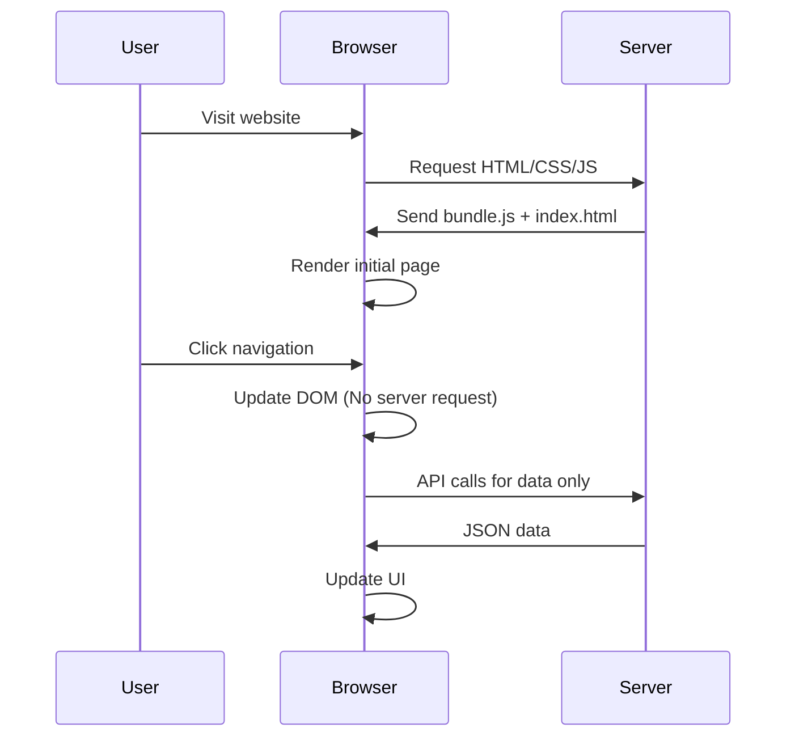
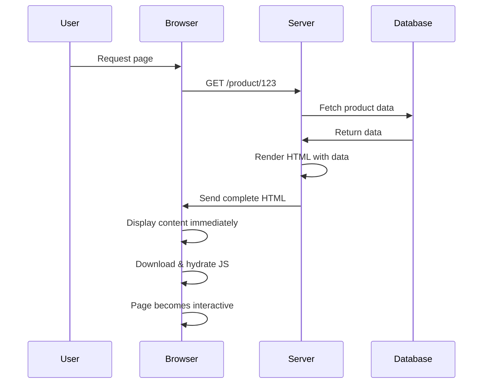
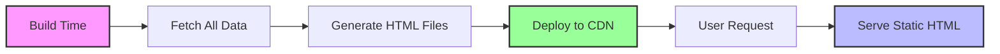
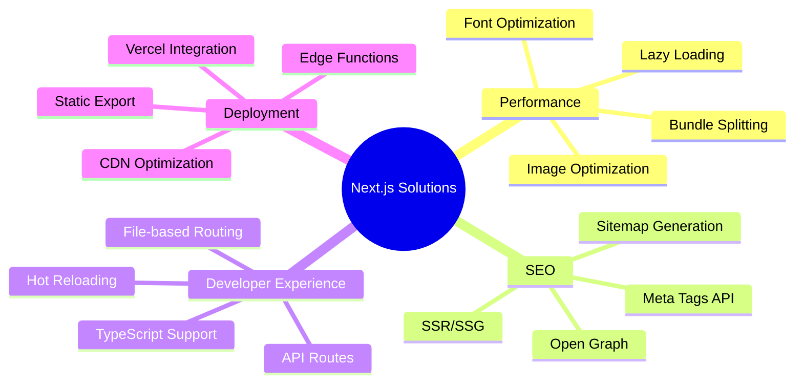
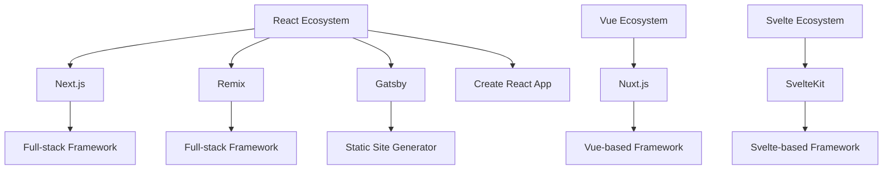
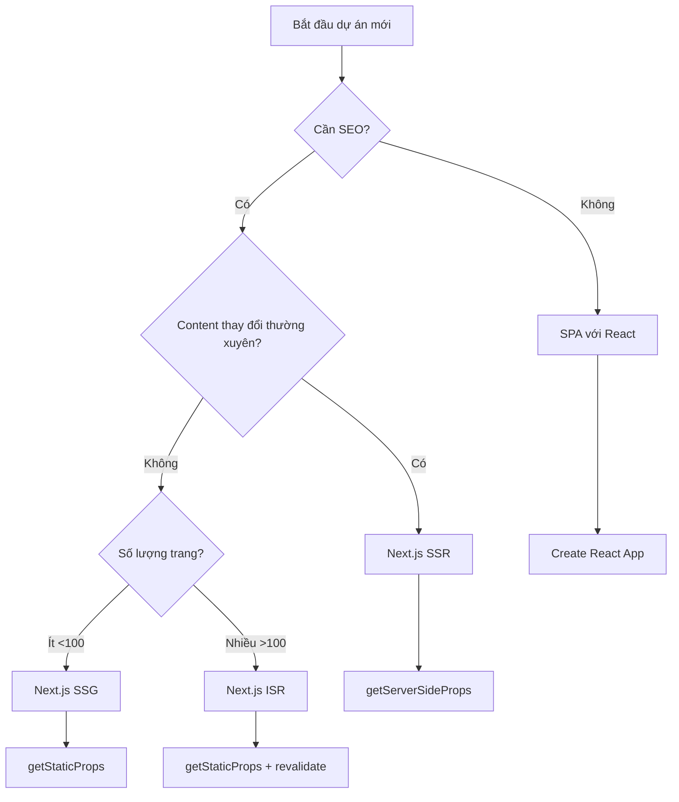

# Bài 3: SPA vs SSR và giới thiệu Next.js

<div className="bg-gradient-to-r from-blue-50 to-indigo-50 p-6 rounded-lg border-l-4 border-blue-500 mb-8">
  <h2 className="text-2xl font-bold text-gray-800 mb-2">🎯 Mục tiêu học tập</h2>
  <ul className="text-gray-700 space-y-1">
    <li>✅ Hiểu rõ sự khác biệt giữa SPA, SSR, CSR và SSG</li>
    <li>✅ Nắm được ưu nhược điểm của từng phương pháp rendering</li>
    <li>✅ Tìm hiểu lý do cần Next.js và lợi ích so với React thuần</li>
    <li>✅ So sánh Next.js với các framework khác</li>
  </ul>
</div>

## I. GIỚI THIỆU CÁC PHƯƠNG PHÁP RENDERING

### 1.1 Tổng quan về Web Rendering

<div className="border border-gray-200 rounded-lg p-4 mb-6">
  <h3 className="text-lg font-semibold text-gray-800 mb-3">🔄 Quá trình Rendering Web</h3>
  <div className="text-gray-600">
    Rendering là quá trình chuyển đổi code thành giao diện người dùng có thể tương tác. 
    Có 4 phương pháp chính trong React/Next.js ecosystem.
  </div>
</div>



### 1.2 So sánh các phương pháp Rendering

| Phương pháp | Thời gian build | First Paint | SEO | Interactivity | Use Case |
|-------------|-----------------|-------------|-----|---------------|----------|
| **CSR (SPA)** | Nhanh | Chậm | ❌ Kém | ⚡ Tức thì | Dashboard, Admin Panel |
| **SSR** | Trung bình | ⚡ Nhanh | ✅ Tốt | Chậm | E-commerce, News |
| **SSG** | Chậm | ⚡ Rất nhanh | ✅ Xuất sắc | Trung bình | Blog, Documentation |
| **ISR** | Nhanh | ⚡ Nhanh | ✅ Tốt | Trung bình | Hybrid Apps |

## II. SINGLE PAGE APPLICATION (SPA)

### 2.1 Khái niệm SPA

<div className="bg-yellow-50 border border-yellow-200 rounded-lg p-4 mb-4">
  <h4 className="font-semibold text-yellow-800">📱 Single Page Application</h4>
  <div className="text-yellow-700 mt-2">
    SPA là ứng dụng web chỉ có một trang HTML duy nhất, nội dung được thay đổi động thông qua JavaScript.
  </div>
</div>



### 2.2 Ưu và nhược điểm của SPA

<div className="grid grid-cols-1 md:grid-cols-2 gap-4 mb-6">
  <div className="bg-green-50 border border-green-200 rounded-lg p-4">
    <h4 className="font-semibold text-green-800 mb-2">✅ Ưu điểm</h4>
    <ul className="text-green-700 text-sm space-y-1">
      <li>• Navigation nhanh sau lần load đầu</li>
      <li>• Trải nghiệm người dùng mượt mà</li>
      <li>• Giảm tải cho server</li>
      <li>• Dễ deploy và cache</li>
    </ul>
  </div>
  
  <div className="bg-red-50 border border-red-200 rounded-lg p-4">
    <h4 className="font-semibold text-red-800 mb-2">❌ Nhược điểm</h4>
    <ul className="text-red-700 text-sm space-y-1">
      <li>• SEO kém do nội dung load bằng JS</li>
      <li>• First Load chậm (bundle lớn)</li>
      <li>• Không hoạt động khi JS bị tắt</li>
      <li>• Khó debug và maintain</li>
    </ul>
  </div>
</div>

## III. SERVER SIDE RENDERING (SSR)

### 3.1 Khái niệm SSR

<div className="bg-blue-50 border border-blue-200 rounded-lg p-4 mb-4">
  <h4 className="font-semibold text-blue-800">🖥️ Server Side Rendering</h4>
  <div className="text-blue-700 mt-2">
    SSR render HTML hoàn chỉnh ở phía server trước khi gửi về browser, sau đó "hydrate" để thêm interactivity.
  </div>
</div>



### 3.2 SSR Performance Metrics

| Metric | SPA | SSR | Cải thiện |
|--------|-----|-----|-----------|
| **First Contentful Paint** | 3.2s | 1.1s | 🔥 65% faster |
| **Largest Contentful Paint** | 4.1s | 1.8s | 🔥 56% faster |
| **Time to Interactive** | 3.8s | 2.9s | ✅ 24% faster |
| **SEO Score** | 65/100 | 95/100 | ✅ 46% better |

## IV. STATIC SITE GENERATION (SSG)

### 4.1 Khái niệm SSG

<div className="bg-purple-50 border border-purple-200 rounded-lg p-4 mb-4">
  <h4 className="font-semibold text-purple-800">⚡ Static Site Generation</h4>
  <p className="text-purple-700 mt-2">
    SSG tạo ra các file HTML tĩnh tại build time, phục vụ trực tiếp từ CDN mà không cần server processing.
  </p>
</div>



### 4.2 SSG vs SSR Comparison

<div className="overflow-x-auto mb-6">
  <table className="min-w-full border border-gray-200">
    <thead className="bg-gray-50">
      <tr>
        <th className="px-4 py-2 text-left font-semibold">Tiêu chí</th>
        <th className="px-4 py-2 text-left font-semibold">SSG</th>
        <th className="px-4 py-2 text-left font-semibold">SSR</th>
      </tr>
    </thead>
    <tbody>
      <tr className="border-t">
        <td className="px-4 py-2 font-medium">Build Time</td>
        <td className="px-4 py-2 text-red-600">Chậm (pre-build all pages)</td>
        <td className="px-4 py-2 text-green-600">Nhanh</td>
      </tr>
      <tr className="border-t">
        <td className="px-4 py-2 font-medium">Response Time</td>
        <td className="px-4 py-2 text-green-600">⚡ Cực nhanh (CDN)</td>
        <td className="px-4 py-2 text-yellow-600">Trung bình</td>
      </tr>
      <tr className="border-t">
        <td className="px-4 py-2 font-medium">Dynamic Content</td>
        <td className="px-4 py-2 text-red-600">❌ Khó khăn</td>
        <td className="px-4 py-2 text-green-600">✅ Dễ dàng</td>
      </tr>
      <tr className="border-t">
        <td className="px-4 py-2 font-medium">Scaling</td>
        <td className="px-4 py-2 text-green-600">✅ Tuyệt vời</td>
        <td className="px-4 py-2 text-yellow-600">Cần tối ưu server</td>
      </tr>
    </tbody>
  </table>
</div>

## V. TẠI SAO CẦN NEXT.JS?

### 5.1 Vấn đề của React thuần

<div className="bg-orange-50 border border-orange-200 rounded-lg p-4 mb-4">
  <h4 className="font-semibold text-orange-800">⚠️ Thách thức với React thuần</h4>
  <ul className="text-orange-700 mt-2 space-y-1">
    <li>• Cần setup phức tạp cho routing, SSR, bundling</li>
    <li>• Không có built-in optimization</li>
    <li>• SEO yếu với CSR</li>
    <li>• Performance không tối ưu</li>
  </ul>
</div>

### 5.2 Next.js Solutions Map



### 5.3 Next.js Core Benefits

| Tính năng | React thuần | Next.js | Lợi ích |
|-----------|-------------|---------|---------|
| **Routing** | React Router (thủ công) | File-based | 🚀 Zero config |
| **SEO** | Client-side only | SSR/SSG | 📈 95+ Lighthouse score |
| **Performance** | Manual optimization | Built-in | ⚡ Tự động tối ưu |
| **Bundle Size** | Toàn bộ app | Code splitting | 📦 Giảm 60% initial load |
| **Image Optimization** | Manual | next/image | 🖼️ Tự động resize/optimize |

## VI. SO SÁNH NEXT.JS VỚI CÁC FRAMEWORK KHÁC

### 6.1 Landscape Overview



### 6.2 Detailed Comparison

<div className="overflow-x-auto mb-6">
  <table className="min-w-full border border-gray-200">
    <thead className="bg-gray-50">
      <tr>
        <th className="px-3 py-2 text-left font-semibold">Framework</th>
        <th className="px-3 py-2 text-left font-semibold">Strengths</th>
        <th className="px-3 py-2 text-left font-semibold">Use Cases</th>
        <th className="px-3 py-2 text-left font-semibold">Learning Curve</th>
      </tr>
    </thead>
    <tbody>
      <tr className="border-t">
        <td className="px-3 py-2 font-medium text-blue-600">Next.js</td>
        <td className="px-3 py-2 text-sm">SSR/SSG, Image optimization, API routes</td>
        <td className="px-3 py-2 text-sm">E-commerce, Corporate sites</td>
        <td className="px-3 py-2 text-green-600">Dễ</td>
      </tr>
      <tr className="border-t">
        <td className="px-3 py-2 font-medium text-purple-600">Remix</td>
        <td className="px-3 py-2 text-sm">Nested routing, Web standards</td>
        <td className="px-3 py-2 text-sm">Web apps, Forms-heavy</td>
        <td className="px-3 py-2 text-yellow-600">Trung bình</td>
      </tr>
      <tr className="border-t">
        <td className="px-3 py-2 font-medium text-indigo-600">Gatsby</td>
        <td className="px-3 py-2 text-sm">GraphQL, Plugin ecosystem</td>
        <td className="px-3 py-2 text-sm">Blogs, Marketing sites</td>
        <td className="px-3 py-2 text-red-600">Khó</td>
      </tr>
      <tr className="border-t">
        <td className="px-3 py-2 font-medium text-green-600">Nuxt.js</td>
        <td className="px-3 py-2 text-sm">Vue-based, Auto-imports</td>
        <td className="px-3 py-2 text-sm">Vue developers</td>
        <td className="px-3 py-2 text-green-600">Dễ (nếu biết Vue)</td>
      </tr>
    </tbody>
  </table>
</div>

### 6.3 Market Share & Trend

| Framework | GitHub Stars | NPM Downloads/week | Job Market | Trend |
|-----------|-------------|-------------------|------------|--------|
| **Next.js** | 120k+ ⭐ | 5.2M | 🔥 Rất cao | 📈 Tăng mạnh |
| **Remix** | 28k+ ⭐ | 180k | 📊 Tăng trưởng | 📈 Tăng |
| **Gatsby** | 55k+ ⭐ | 380k | 📊 Ổn định | 📉 Giảm nhẹ |
| **Nuxt.js** | 52k+ ⭐ | 450k | 📊 Ổn định | 📊 Stable |

## VII. THỰC HÀNH: PHÂN TÍCH HIỆU NĂNG

### 7.1 Setup Môi trường test

<div className="bg-gray-50 border border-gray-200 rounded-lg p-4 mb-4">
  <h4 className="font-semibold text-gray-800">🔧 Tools cần thiết</h4>
  <ul className="text-gray-700 mt-2 space-y-1">
    <li>• Chrome DevTools (Lighthouse)</li>
    <li>• WebPageTest.org</li>
    <li>• React DevTools Profiler</li>
    <li>• Next.js Bundle Analyzer</li>
  </ul>
</div>

### 7.2 Test Scenarios

```typescript
// Scenario 1: Simple Blog Site
const testCases = {
  spa: {
    url: 'https://react-blog-spa.vercel.app',
    metrics: ['FCP', 'LCP', 'TTI', 'SEO']
  },
  ssr: {
    url: 'https://nextjs-blog-ssr.vercel.app',
    metrics: ['FCP', 'LCP', 'TTI', 'SEO']
  },
  ssg: {
    url: 'https://nextjs-blog-ssg.vercel.app', 
    metrics: ['FCP', 'LCP', 'TTI', 'SEO']
  }
}

// Scenario 2: E-commerce Product Page
const ecommerceTest = {
  dynamicContent: true,
  userInteraction: 'high',
  seoRequirement: 'critical'
}
```

### 7.3 Performance Results

<div className="grid grid-cols-1 md:grid-cols-3 gap-4 mb-6">
  <div className="border border-gray-200 rounded-lg p-4">
    <h4 className="font-semibold text-center mb-3">SPA Results</h4>
    <div className="space-y-2 text-sm">
      <div className="flex justify-between">
        <span>FCP:</span>
        <span className="text-red-600">3.2s</span>
      </div>
      <div className="flex justify-between">
        <span>LCP:</span>
        <span className="text-red-600">4.1s</span>
      </div>
      <div className="flex justify-between">
        <span>SEO:</span>
        <span className="text-red-600">65/100</span>
      </div>
    </div>
  </div>
  
  <div className="border border-gray-200 rounded-lg p-4">
    <h4 className="font-semibold text-center mb-3">SSR Results</h4>
    <div className="space-y-2 text-sm">
      <div className="flex justify-between">
        <span>FCP:</span>
        <span className="text-green-600">1.1s</span>
      </div>
      <div className="flex justify-between">
        <span>LCP:</span>
        <span className="text-green-600">1.8s</span>
      </div>
      <div className="flex justify-between">
        <span>SEO:</span>
        <span className="text-green-600">95/100</span>
      </div>
    </div>
  </div>
  
  <div className="border border-gray-200 rounded-lg p-4">
    <h4 className="font-semibold text-center mb-3">SSG Results</h4>
    <div className="space-y-2 text-sm">
      <div className="flex justify-between">
        <span>FCP:</span>
        <span className="text-green-600">0.8s</span>
      </div>
      <div className="flex justify-between">
        <span>LCP:</span>
        <span className="text-green-600">1.2s</span>
      </div>
      <div className="flex justify-between">
        <span>SEO:</span>
        <span className="text-green-600">98/100</span>
      </div>
    </div>
  </div>
</div>

## VIII. KẾT LUẬN VÀ HƯỚNG DẪN CHỌN LỰA

### 8.1 Decision Tree



### 8.2 Recommendation Matrix

| Dự án | SPA | SSR | SSG | Framework |
|-------|-----|-----|-----|-----------|
| **Admin Dashboard** | ✅ Perfect | ❌ Overkill | ❌ No | React + Router |
| **E-commerce** | ❌ Poor SEO | ✅ Perfect | 🤔 Hybrid | **Next.js** |
| **Blog/News** | ❌ Poor SEO | 🤔 OK | ✅ Perfect | **Next.js** |
| **Corporate Site** | ❌ Poor SEO | 🤔 OK | ✅ Perfect | **Next.js** |
| **Real-time App** | ✅ Good | 🤔 Partial | ❌ No | React + Socket.io |

<div className="bg-blue-50 border-l-4 border-blue-500 p-4 mt-6">
  <h3 className="text-lg font-semibold text-blue-800 mb-2">🎯 Takeaways chính</h3>
  <ul className="text-blue-700 space-y-1">
    <li>• <strong>SPA</strong>: Tốt cho internal tools, dashboards</li>
    <li>• <strong>SSR</strong>: Tốt cho dynamic content + SEO</li>
    <li>• <strong>SSG</strong>: Tốt nhất cho static content + SEO</li>
    <li>• <strong>Next.js</strong>: Best choice cho majority của web projects</li>
  </ul>
</div>

<div className="bg-green-50 border border-green-200 rounded-lg p-4 mt-4">
  <h3 className="text-lg font-semibold text-green-800 mb-2">📚 Chuẩn bị cho bài tiếp theo</h3>
  <div className="text-green-700">
    Bài 4 sẽ hướng dẫn khởi tạo dự án Next.js đầu tiên với create-next-app, 
    setup TypeScript và khám phá cấu trúc thư mục.
  </div>
</div>