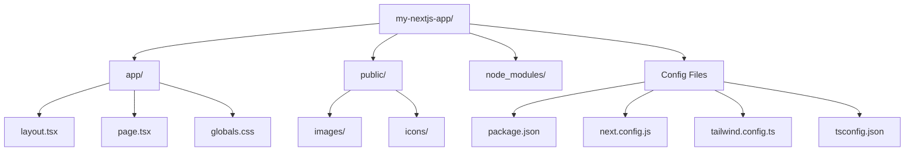
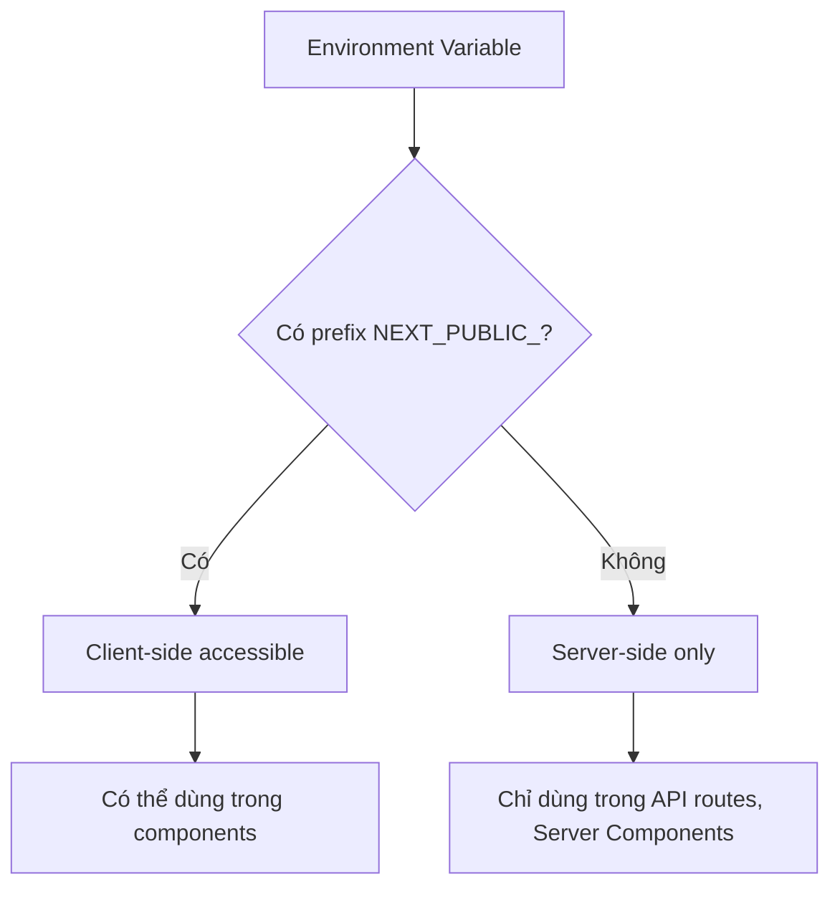

# Bài 4: Khởi tạo dự án với create-next-app

<div className="bg-blue-50 border-l-4 border-blue-500 p-4 mb-6">
  <h2 className="text-xl font-bold text-blue-800 mb-2">🎯 Mục tiêu bài học</h2>
  <p className="text-blue-700">Sau bài học này, bạn sẽ thành thạo việc khởi tạo và cấu hình dự án Next.js với TypeScript và các công cụ hỗ trợ.</p>
</div>

## 1. Cài đặt create-next-app

### 1.1 Yêu cầu hệ thống

| Công cụ | Phiên bản tối thiểu | Ghi chú |
|---------|-------------------|---------|
| Node.js | 18.17+ | Khuyến nghị 20+ |
| npm | 9+ | Hoặc yarn, pnpm |
| Git | 2.0+ | Cho version control |

### 1.2 Lệnh cài đặt cơ bản

```bash
# Cài đặt dự án mới
npx create-next-app@latest my-nextjs-app

# Với TypeScript (khuyến nghị)
npx create-next-app@latest my-nextjs-app --typescript

# Với đầy đủ options
npx create-next-app@latest my-nextjs-app \
  --typescript \
  --tailwind \
  --eslint \
  --app \
  --src-dir \
  --import-alias "@/*"
```

### 1.3 Options chi tiết

| Option | Mô tả | Khuyến nghị |
|--------|-------|-------------|
| `--typescript` | Sử dụng TypeScript | ✅ |
| `--tailwind` | Cài đặt Tailwind CSS | ✅ |
| `--eslint` | Cấu hình ESLint | ✅ |
| `--app` | Sử dụng App Router | ✅ |
| `--src-dir` | Tạo thư mục src/ | ⚠️ |
| `--import-alias` | Cấu hình path alias | ✅ |

<div className="bg-amber-50 border-l-4 border-amber-500 p-4 my-4">
  <p className="text-amber-800"><strong>💡 Lưu ý:</strong> App Router là default từ Next.js 13.4+, thay thế Pages Router.</p>
</div>

## 2. Cấu trúc thư mục dự án



### 2.1 Thư mục và file quan trọng

<div className="overflow-x-auto">

| Thư mục/File | Chức năng | Quan trọng |
|--------------|-----------|------------|
| `app/` | App Router - chứa routes, layouts, pages | 🔴 Cao |
| `app/layout.tsx` | Root layout cho toàn ứng dụng | 🔴 Cao |
| `app/page.tsx` | Homepage của ứng dụng | 🔴 Cao |
| `app/globals.css` | CSS toàn cục | 🟡 Trung bình |
| `public/` | Static assets (images, icons) | 🟡 Trung bình |
| `next.config.js` | Cấu hình Next.js | 🟠 Thấp |
| `package.json` | Dependencies và scripts | 🔴 Cao |
| `tsconfig.json` | Cấu hình TypeScript | 🟡 Trung bình |

</div>

### 2.2 Cấu trúc chi tiết app/

```
app/
├── layout.tsx          # Root layout
├── page.tsx           # Homepage (/)
├── globals.css        # Global styles
├── loading.tsx        # Global loading UI
├── error.tsx          # Global error UI
├── not-found.tsx      # 404 page
└── favicon.ico        # Site favicon
```

## 3. Cấu hình TypeScript

### 3.1 File tsconfig.json mặc định

```json
{
  "compilerOptions": {
    "lib": ["dom", "dom.iterable", "es6"],
    "allowJs": true,
    "skipLibCheck": true,
    "strict": true,
    "noEmit": true,
    "esModuleInterop": true,
    "module": "esnext",
    "moduleResolution": "bundler",
    "resolveJsonModule": true,
    "isolatedModules": true,
    "jsx": "preserve",
    "incremental": true,
    "plugins": [
      {
        "name": "next"
      }
    ],
    "baseUrl": ".",
    "paths": {
      "@/*": ["./src/*"]
    }
  },
  "include": ["next-env.d.ts", "**/*.ts", "**/*.tsx", ".next/types/**/*.ts"],
  "exclude": ["node_modules"]
}
```

### 3.2 Tùy chỉnh TypeScript config

| Option | Mô tả | Khuyến nghị |
|--------|-------|-------------|
| `strict: true` | Bật chế độ strict | ✅ |
| `noUnusedLocals` | Cảnh báo biến không dùng | ✅ |
| `noUnusedParameters` | Cảnh báo tham số không dùng | ✅ |
| `exactOptionalPropertyTypes` | Kiểm tra optional properties chính xác | ⚠️ |

## 4. Cấu hình ESLint và Prettier

### 4.1 ESLint Configuration

```json
// .eslintrc.json
{
  "extends": [
    "next/core-web-vitals",
    "@typescript-eslint/recommended"
  ],
  "rules": {
    "@typescript-eslint/no-unused-vars": "error",
    "@typescript-eslint/no-explicit-any": "warn",
    "prefer-const": "error"
  }
}
```

### 4.2 Prettier Setup

```json
// .prettierrc
{
  "semi": false,
  "trailingComma": "es5",
  "singleQuote": true,
  "tabWidth": 2,
  "useTabs": false
}
```

<div className="bg-green-50 border-l-4 border-green-500 p-4 my-4">
  <h3 className="text-green-800 font-bold">✨ VS Code Extensions khuyến nghị</h3>
  <ul className="text-green-700 mt-2">
    <li>• ES7+ React/Redux/React-Native snippets</li>
    <li>• Prettier - Code formatter</li>
    <li>• ESLint</li>
    <li>• TypeScript Importer</li>
    <li>• Tailwind CSS IntelliSense</li>
  </ul>
</div>

## 5. Package.json và Scripts

### 5.1 Scripts cơ bản

| Script | Lệnh | Mô tả |
|--------|------|-------|
| `dev` | `next dev` | Chạy development server |
| `build` | `next build` | Build production |
| `start` | `next start` | Chạy production server |
| `lint` | `next lint` | Kiểm tra code với ESLint |

### 5.2 Scripts nâng cao

```json
{
  "scripts": {
    "dev": "next dev",
    "build": "next build",
    "start": "next start",
    "lint": "next lint",
    "lint:fix": "next lint --fix",
    "type-check": "tsc --noEmit",
    "format": "prettier --write .",
    "clean": "rm -rf .next out"
  }
}
```

## 6. Cấu hình Tailwind CSS

### 6.1 File tailwind.config.ts

```typescript
import type { Config } from 'tailwindcss'

const config: Config = {
  content: [
    './pages/**/*.{js,ts,jsx,tsx,mdx}',
    './components/**/*.{js,ts,jsx,tsx,mdx}',
    './app/**/*.{js,ts,jsx,tsx,mdx}',
  ],
  theme: {
    extend: {
      colors: {
        background: 'var(--background)',
        foreground: 'var(--foreground)',
      },
    },
  },
  plugins: [],
}
export default config
```

### 6.2 Tùy chỉnh Tailwind

| Phần | Mô tả | Ví dụ |
|------|-------|--------|
| `colors` | Màu sắc tùy chỉnh | `primary: '#1234ff'` |
| `spacing` | Khoảng cách | `'72': '18rem'` |
| `fontFamily` | Font chữ | `sans: ['Inter', 'sans-serif']` |
| `screens` | Responsive breakpoints | `'2xl': '1536px'` |

## 7. Environment Variables

### 7.1 File .env.local

```env
# Database
DATABASE_URL="postgresql://..."

# Authentication
NEXTAUTH_SECRET="your-secret-key"
NEXTAUTH_URL="http://localhost:3000"

# API Keys (public - có prefix NEXT_PUBLIC_)
NEXT_PUBLIC_API_URL="https://api.example.com"
```

### 7.2 Quy tắc Environment Variables



<div className="bg-red-50 border-l-4 border-red-500 p-4 my-4">
  <p className="text-red-800"><strong>⚠️ Bảo mật:</strong> Không bao giờ đặt sensitive data (API keys, passwords) với prefix NEXT_PUBLIC_</p>
</div>

## 8. Thực hành: Tạo dự án đầu tiên

### Bước 1: Khởi tạo dự án

```bash
npx create-next-app@latest my-blog-app \
  --typescript \
  --tailwind \
  --eslint \
  --app \
  --import-alias "@/*"
```

### Bước 2: Khám phá cấu trúc

1. Mở thư mục dự án trong VS Code
2. Chạy `npm run dev` để start development server
3. Mở http://localhost:3000 trong browser
4. Khám phá file `app/page.tsx` và `app/layout.tsx`

### Bước 3: Tùy chỉnh cơ bản

```typescript
// app/page.tsx
export default function Home() {
  return (
    <main className="container mx-auto px-4 py-8">
      <h1 className="text-4xl font-bold text-center mb-8">
        My Blog App
      </h1>
      <p className="text-lg text-gray-600 text-center">
        Chào mừng đến với blog của tôi!
      </p>
    </main>
  )
}
```

## 9. Troubleshooting thường gặp

| Lỗi | Nguyên nhân | Giải pháp |
|-----|-------------|-----------|
| `ENOENT: no such file` | Thiếu dependency | Chạy `npm install` |
| Port 3000 already in use | Port đang được sử dụng | Dùng `npm run dev -- -p 3001` |
| TypeScript errors | Cấu hình sai | Kiểm tra `tsconfig.json` |
| Tailwind không hoạt động | Cấu hình content path sai | Kiểm tra `tailwind.config.ts` |

<div className="bg-blue-50 border-l-4 border-blue-500 p-4 my-6">
  <h2 className="text-xl font-bold text-blue-800 mb-2">📝 Tóm tắt bài học</h2>
  <ul className="text-blue-700 space-y-1">
    <li>• Thành thạo sử dụng create-next-app với các options</li>
    <li>• Hiểu rõ cấu trúc thư mục Next.js App Router</li>
    <li>• Cấu hình TypeScript, ESLint và Prettier</li>
    <li>• Thiết lập Tailwind CSS và environment variables</li>
    <li>• Khắc phục các lỗi thường gặp</li>
  </ul>
</div>

---

<div className="text-center py-4">
  <p className="text-gray-500">Bài tiếp theo: <strong>Bài 5 - Next.js App Router: Routing Basics</strong></p>
</div>