# Bài 5: Next.js App Router - Routing Basics

<div className="bg-gradient-to-r from-blue-50 to-indigo-50 border-l-4 border-blue-500 p-6 mb-8 rounded-r-lg">
  <h2 className="text-2xl font-bold text-blue-800 mb-2">🎯 Mục tiêu học tập</h2>
  <p className="text-gray-700">Nắm vững cơ chế định tuyến (routing) trong Next.js App Router, hiểu được sự khác biệt với Pages Router và thực hành xây dựng cấu trúc routing cho một ứng dụng thực tế.</p>
</div>

## 📚 Tổng quan về App Router

### So sánh Pages Router vs App Router

```mermaid
graph TB
    A[Next.js Routing Systems] --> B[Pages Router]
    A --> C[App Router]
    
    B --> D[📁 pages/]
    B --> E[🔧 Next.js 12 và trước]
    B --> F[📄 File = Route]
    
    C --> G[📁 app/]
    C --> H[🔧 Next.js 13+]
    C --> I[📂 Folder = Route]
```



<div className="grid grid-cols-1 md:grid-cols-2 gap-6 my-8">
  <div className="border rounded-lg p-4 hover:shadow-md transition-shadow">
    <h3 className="font-semibold text-red-600 mb-2">Pages Router (Legacy)</h3>
    <ul className="text-sm space-y-1">
      <li>• File-based routing trong thư mục pages/</li>
      <li>• Mỗi file .js/.ts = một route</li>
      <li>• Sử dụng _app.js và _document.js</li>
      <li>• API routes trong pages/api/</li>
    </ul>
  </div>
  <div className="border rounded-lg p-4 hover:shadow-md transition-shadow border-green-300">
    <h3 className="font-semibold text-green-600 mb-2">App Router (Khuyến khích)</h3>
    <ul className="text-sm space-y-1">
      <li>• Folder-based routing trong thư mục app/</li>
      <li>• Mỗi thư mục = một route segment</li>
      <li>• Sử dụng layout.js và page.js</li>
      <li>• Server Components mặc định</li>
    </ul>
  </div>
</div>

## 🗺️ Routing Terminology

| Thuật ngữ | Định nghĩa | Ví dụ |
|-----------|------------|-------|
| **Route** | Một đường dẫn URL hoàn chỉnh | `/products/shoes` |
| **Segment** | Một phần của route được phân tách bởi `/` | `products`, `shoes` |
| **Nested Routes** | Routes lồng nhau theo cấu trúc thư mục | `/blog/category/post` |
| **Dynamic Routes** | Routes với tham số động | `/products/[id]` |
| **Route Groups** | Nhóm routes không ảnh hưởng đến URL | `(marketing)/about` |

## 📁 Cấu trúc File-based Routing

<div className="bg-blue-50 p-4 rounded-lg border-l-4 border-blue-400 mb-4">
  <p className="text-sm text-blue-700"><strong>💡 File-based Routing là gì?</strong></p>
  <p className="text-sm text-blue-700 mt-2">Là hệ thống định tuyến dựa trên cấu trúc thư mục và file. Trong App Router, mỗi thư mục tương ứng với một route segment, và file <code>page.tsx</code> định nghĩa UI cho route đó.</p>
</div>

### Cấu trúc cơ bản

```typescript
app/
├── layout.tsx          // Root layout
├── page.tsx           // Home page (/)
├── loading.tsx        // Loading UI
├── error.tsx          // Error UI
├── not-found.tsx      // 404 page
├── about/
│   └── page.tsx       // /about
├── products/
│   ├── layout.tsx     // Products layout
│   ├── page.tsx       // /products
│   └── [id]/
│       └── page.tsx   // /products/[id]
└── blog/
    ├── page.tsx       // /blog
    └── [...slug]/
        └── page.tsx   // /blog/[...slug]
```

### Mapping thư mục sang Routes


## 🏗️ Tạo Routes cơ bản

### 1. Static Routes

<div className="bg-green-50 p-4 rounded-lg border-l-4 border-green-400 mb-4">
  <p className="text-sm text-green-700"><strong>💡 Static Routes là gì?</strong></p>
  <p className="text-sm text-green-700 mt-2">Routes có đường dẫn cố định, không thay đổi. Ví dụ <code>/about</code>, <code>/contact</code>. Chúng được tạo bằng cách tạo thư mục với tên cố định và file <code>page.tsx</code> bên trong.</p>
</div>

<div className="bg-gray-50 p-4 rounded-lg border-l-4 border-gray-400 mb-4">
  <h4 className="font-medium mb-2">📝 Ví dụ: Tạo trang About</h4>
</div>

```typescript
// app/about/page.tsx
export default function AboutPage() {
  return (
    <div className="max-w-4xl mx-auto py-8 px-4">
      <h1 className="text-3xl font-bold mb-4">Về chúng tôi</h1>
      <p className="text-gray-600">
        Đây là trang giới thiệu về công ty chúng tôi.
      </p>
    </div>
  )
}
```

### 2. Nested Routes

<div className="bg-purple-50 p-4 rounded-lg border-l-4 border-purple-400 mb-4">
  <p className="text-sm text-purple-700"><strong>💡 Nested Routes là gì?</strong></p>
  <p className="text-sm text-purple-700 mt-2">Routes lồng nhau theo cấu trúc thư mục. Ví dụ <code>/products/shoes</code> có nghĩa là thư mục <code>shoes</code> nằm bên trong thư mục <code>products</code>. Nested routes cho phép tạo layout hierarchy và shared components.</p>
</div>

```typescript
// app/products/shoes/page.tsx
export default function ShoesPage() {
  return (
    <div>
      <h1>Danh sách giày</h1>
      <p>Các sản phẩm giày dép</p>
    </div>
  )
}

// app/products/clothes/page.tsx
export default function ClothesPage() {
  return (
    <div>
      <h1>Danh sách quần áo</h1>
      <p>Các sản phẩm thời trang</p>
    </div>
  )
}
```

## 🔄 Dynamic Routing

<div className="bg-orange-50 p-4 rounded-lg border-l-4 border-orange-400 mb-4">
  <p className="text-sm text-orange-700"><strong>💡 Dynamic Routing là gì?</strong></p>
  <p className="text-sm text-orange-700 mt-2">Cho phép tạo routes với tham số động thay vì đường dẫn cố định. Sử dụng dấu ngoặc vuông <code>[param]</code> để tạo dynamic segments. Ví dụ <code>[id]</code> có thể match <code>/products/1</code>, <code>/products/abc</code>, etc.</p>
</div>

### Single Dynamic Segment `[id]`

<div className="bg-yellow-50 p-4 rounded-lg border-l-4 border-yellow-400 mb-4">
  <p className="text-sm text-yellow-700"><strong>💡 Single Dynamic Segment:</strong> Một tham số động duy nhất trong route. File/thư mục được đặt tên trong dấu <code>[]</code>. Giá trị này sẽ được truyền vào component qua <code>params</code> prop.</p>
</div>

```typescript
// app/products/[id]/page.tsx
interface ProductPageProps {
  params: {
    id: string
  }
}

export default function ProductPage({ params }: ProductPageProps) {
  const { id } = params
  
  return (
    <div className="container mx-auto p-4">
      <h1 className="text-2xl font-bold">Sản phẩm #{id}</h1>
      <p>Chi tiết sản phẩm có ID: {id}</p>
    </div>
  )
}
```

### Catch-all Segments `[...slug]`

<div className="bg-indigo-50 p-4 rounded-lg border-l-4 border-indigo-400 mb-4">
  <p className="text-sm text-indigo-700"><strong>💡 Catch-all Segments:</strong> Bắt tất cả các segments sau vị trí này. Sử dụng <code>[...param]</code> để match nhiều segments. Ví dụ <code>[...slug]</code> có thể match <code>/blog/2023</code>, <code>/blog/2023/post-1</code>, etc.</p>
</div>

```typescript
// app/blog/[...slug]/page.tsx
interface BlogPostProps {
  params: {
    slug: string[]
  }
}

export default function BlogPost({ params }: BlogPostProps) {
  const { slug } = params
  
  return (
    <div>
      <h1>Blog Post</h1>
      <p>Slug segments: {slug.join(' → ')}</p>
    </div>
  )
}
```

### Optional Catch-all `[[...slug]]`

<div className="bg-teal-50 p-4 rounded-lg border-l-4 border-teal-400 mb-4">
  <p className="text-sm text-teal-700"><strong>💡 Optional Catch-all:</strong> Giống Catch-all nhưng cũng match route gốc. Sử dụng <code>[[...param]]</code> với double brackets. Ví dụ <code>[[...slug]]</code> match cả <code>/blog</code> và <code>/blog/category/post</code>.</p>
</div>

| URL | params.slug |
|-----|-------------|
| `/blog` | `undefined` |
| `/blog/post-1` | `['post-1']` |
| `/blog/2023/post-1` | `['2023', 'post-1']` |

## 📂 Route Groups và Private Folders

### Route Groups `(folder)`

<div className="bg-blue-50 p-4 rounded-lg mb-4">
  <p className="text-sm text-blue-700"><strong>💡 Mục đích:</strong> Tổ chức code mà không ảnh hưởng đến URL structure</p>
</div>

```typescript
app/
├── (marketing)/
│   ├── about/page.tsx      // → /about
│   └── contact/page.tsx    // → /contact
├── (shop)/
│   ├── products/page.tsx   // → /products
│   └── cart/page.tsx       // → /cart
└── page.tsx                // → /
```

### Private Folders `_folder`

```typescript
app/
├── _components/          // Không accessible qua URL
│   ├── Header.tsx
│   └── Footer.tsx
├── _lib/                // Utilities, không accessible
│   └── utils.ts
└── products/
    └── page.tsx         // → /products
```

## 🧭 Thực hành: Xây dựng Blog Structure


### 1. Root Layout

```typescript
// app/layout.tsx
import './globals.css'

export const metadata = {
  title: 'My Blog',
  description: 'A Next.js blog with App Router',
}

export default function RootLayout({
  children,
}: {
  children: React.ReactNode
}) {
  return (
    <html lang="vi">
      <body className="min-h-screen bg-white">
        <nav className="bg-blue-600 text-white p-4">
          <div className="container mx-auto flex justify-between">
            <h1 className="text-xl font-bold">My Blog</h1>
            <div className="space-x-4">
              <a href="/" className="hover:underline">Home</a>
              <a href="/blog" className="hover:underline">Blog</a>
              <a href="/about" className="hover:underline">About</a>
            </div>
          </div>
        </nav>
        <main>{children}</main>
        <footer className="bg-gray-800 text-white p-8 mt-16">
          <div className="container mx-auto text-center">
            <p>&copy; 2024 My Blog. All rights reserved.</p>
          </div>
        </footer>
      </body>
    </html>
  )
}
```

### 2. Blog Layout

```typescript
// app/blog/layout.tsx
export default function BlogLayout({
  children,
}: {
  children: React.ReactNode
}) {
  return (
    <div className="container mx-auto px-4 py-8">
      <div className="grid grid-cols-1 lg:grid-cols-4 gap-8">
        <aside className="lg:col-span-1">
          <div className="bg-gray-100 p-4 rounded-lg">
            <h3 className="font-bold mb-4">Danh mục</h3>
            <ul className="space-y-2">
              <li><a href="/blog/category/technology" className="text-blue-600 hover:underline">Công nghệ</a></li>
              <li><a href="/blog/category/lifestyle" className="text-blue-600 hover:underline">Lối sống</a></li>
              <li><a href="/blog/category/travel" className="text-blue-600 hover:underline">Du lịch</a></li>
            </ul>
          </div>
        </aside>
        <div className="lg:col-span-3">
          {children}
        </div>
      </div>
    </div>
  )
}
```

### 3. Dynamic Category Page

```typescript
// app/blog/category/[category]/page.tsx
interface CategoryPageProps {
  params: {
    category: string
  }
}

export default function CategoryPage({ params }: CategoryPageProps) {
  const { category } = params
  
  // Mock data - trong thực tế sẽ fetch từ API
  const posts = [
    { id: 1, title: `Bài viết ${category} #1`, excerpt: 'Mô tả ngắn...' },
    { id: 2, title: `Bài viết ${category} #2`, excerpt: 'Mô tả ngắn...' },
  ]
  
  return (
    <div>
      <h1 className="text-3xl font-bold mb-8 capitalize">
        Danh mục: {category.replace('-', ' ')}
      </h1>
      
      <div className="grid gap-6">
        {posts.map(post => (
          <article key={post.id} className="border rounded-lg p-6 hover:shadow-md transition-shadow">
            <h2 className="text-xl font-semibold mb-2">
              <a href={`/blog/${post.id}`} className="text-blue-600 hover:underline">
                {post.title}
              </a>
            </h2>
            <p className="text-gray-600">{post.excerpt}</p>
          </article>
        ))}
      </div>
    </div>
  )
}
```

## 📊 Route Mapping Summary

### Static vs Dynamic Routes

| Route Type | Cú pháp | Ví dụ URL | File path |
|------------|---------|-----------|-----------|
| **Static** | `folder/page.tsx` | `/about` | `app/about/page.tsx` |
| **Dynamic** | `[param]/page.tsx` | `/products/123` | `app/products/[id]/page.tsx` |
| **Catch-all** | `[...params]/page.tsx` | `/blog/2023/post-1` | `app/blog/[...slug]/page.tsx` |
| **Optional** | `[[...params]]/page.tsx` | `/shop` hoặc `/shop/category` | `app/shop/[[...slug]]/page.tsx` |

### Special Files trong App Router

| File | Mục đích | Bắt buộc |
|------|---------|----------|
| `layout.tsx` | Shared UI cho route và children | ✅ (Root layout) |
| `page.tsx` | UI duy nhất cho route | ✅ |
| `loading.tsx` | Loading UI | ❌ |
| `error.tsx` | Error UI | ❌ |
| `not-found.tsx` | Not found UI | ❌ |

## 🎯 Bài tập thực hành

<div className="bg-yellow-50 border-l-4 border-yellow-400 p-4 my-6">
  <h3 className="font-semibold text-yellow-800 mb-2">📝 Thực hành</h3>
  <p className="text-sm text-yellow-700">Xây dựng cấu trúc routing cho một website e-commerce với:</p>
  <ul className="list-disc list-inside text-sm text-yellow-700 mt-2 space-y-1">
    <li>Trang chủ (<code>/</code>)</li>
    <li>Danh sách sản phẩm (<code>/products</code>)</li>
    <li>Chi tiết sản phẩm (<code>/products/[id]</code>)</li>
    <li>Danh mục sản phẩm (<code>/category/[category]</code>)</li>
    <li>Trang giỏ hàng (<code>/cart</code>)</li>
    <li>Trang về chúng tôi (<code>/about</code>)</li>
  </ul>
</div>

## ✨ Tổng kết

- **App Router** sử dụng folder-based routing thay vì file-based
- **Dynamic routing** cho phép tạo routes linh hoạt với `[param]` và `[...param]`
- **Route Groups** `(folder)` giúp tổ chức code mà không ảnh hưởng URL
- **Private folders** `_folder` chứa code không accessible qua URL
- **Special files** như `layout.tsx`, `page.tsx`, `loading.tsx` có vai trò riêng biệt

<div className="mt-8 p-6 border-2 border-green-200 rounded-lg bg-green-50">
  <h3 className="text-lg font-semibold text-green-800 mb-2">🎉 Bài học tiếp theo</h3>
  <p className="text-green-700">Bài 6: Layouts, Templates và Navigation - Học cách tạo layout và điều hướng trong App Router</p>
</div>