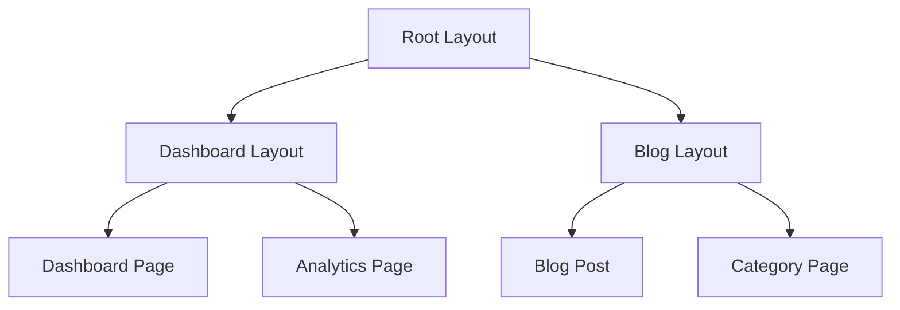
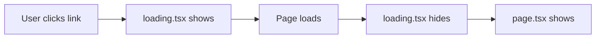

# Bài 6: Layouts, Templates và Navigation trong Next.js App Router

<div className="bg-gradient-to-r from-blue-50 to-indigo-50 p-6 rounded-lg border-l-4 border-blue-500 mb-8">
  <h2 className="text-2xl font-bold text-blue-800 mb-3">🎯 Mục tiêu bài học</h2>
  <p className="text-blue-700">Hiểu và thành thạo việc sử dụng Layout, Template và Navigation trong Next.js App Router để xây dựng cấu trúc ứng dụng chuyên nghiệp.</p>
</div>

## 📚 Nội dung chính

### 1. Layout trong Next.js App Router

<div className="bg-indigo-50 p-5 rounded-lg border border-indigo-200 mb-6">
  <h4 className="font-bold text-indigo-800 mb-3">🔍 Layout là gì?</h4>
  <p className="text-indigo-700 mb-3">Layout là một <strong>wrapper component</strong> bao bọc nội dung của nhiều trang, giúp:</p>
  <ul className="text-indigo-600 space-y-1 ml-4">
    <li>• <strong>Tái sử dụng UI:</strong> Header, footer, sidebar chung</li>
    <li>• <strong>Duy trì state:</strong> Không mất dữ liệu khi chuyển trang</li>
    <li>• <strong>Không re-render:</strong> Chỉ phần content thay đổi</li>
    <li>• <strong>Nested structure:</strong> Layout trong layout</li>
  </ul>
</div>

**Ví dụ thực tế:** Khi bạn browse Facebook, header (logo, menu) luôn ở đó, chỉ phần newsfeed thay đổi - đó chính là Layout!



#### 1.1 Root Layout (Bắt buộc)

<div className="bg-red-50 p-4 rounded-lg border border-red-200 mb-4">
  <h5 className="font-semibold text-red-800 mb-2">⚠️ Root Layout - Khái niệm quan trọng</h5>
  <p className="text-red-700"><strong>Root Layout</strong> là layout gốc, bắt buộc phải có trong mọi ứng dụng Next.js App Router. Nó thay thế <code>_app.js</code> và <code>_document.js</code> của Pages Router.</p>
</div>

| Đặc điểm | Mô tả | So sánh với Pages Router |
|----------|--------|-----------------------|
| **Vị trí** | `app/layout.tsx` | Thay `pages/_app.js` + `pages/_document.js` |
| **Bắt buộc** | Có, bắt buộc phải có | `_app.js` bắt buộc, `_document.js` tùy chọn |
| **Phạm vi** | Toàn bộ ứng dụng | Toàn bộ ứng dụng |
| **HTML tags** | Phải chứa `<html>` và `<body>` | Chỉ `_document.js` có HTML tags |

```typescript
// app/layout.tsx
import type { Metadata } from 'next'
import { Inter } from 'next/font/google'
import './globals.css'

const inter = Inter({ subsets: ['latin'] })

export const metadata: Metadata = {
  title: 'My Next.js App',
  description: 'Generated by create next app',
}

export default function RootLayout({
  children,
}: {
  children: React.ReactNode
}) {
  return (
    <html lang="en">
      <body className={inter.className}>
        <header className="bg-blue-600 text-white p-4">
          <h1 className="text-xl font-bold">My Website</h1>
        </header>
        <main className="min-h-screen">
          {children}
        </main>
        <footer className="bg-gray-800 text-white p-4 text-center">
          © 2024 My Website
        </footer>
      </body>
    </html>
  )
}
```

#### 1.2 Nested Layouts

#### 1.2 Nested Layouts

<div className="bg-yellow-50 p-4 rounded-lg border border-yellow-200 mb-4">
  <h5 className="font-semibold text-yellow-800 mb-2">💡 Nested Layout - Cấu trúc lồng nhau</h5>
  <p className="text-yellow-700 mb-3"><strong>Nested Layout</strong> cho phép bạn tạo layout con bên trong layout cha, tạo thành cấu trúc phân cấp.</p>
  <div className="bg-white p-3 rounded border">
    <strong>Ví dụ:</strong> Trang web e-commerce có:
    <ul className="mt-2 ml-4 text-yellow-600">
      <li>• <strong>Root Layout:</strong> Header chung, Footer chung</li>
      <li>• <strong>Shop Layout:</strong> Sidebar filter sản phẩm</li>
      <li>• <strong>Product Layout:</strong> Breadcrumb, product navigation</li>
    </ul>
  </div>
</div>

<div className="bg-gray-100 p-4 rounded-lg mb-4">
  <h6 className="font-semibold text-gray-800 mb-2">🔄 Cơ chế hoạt động:</h6>
  <code className="text-sm text-gray-600">
    Root Layout → Dashboard Layout → Page Content
  </code>
  <p className="text-gray-600 mt-2 text-sm">Mỗi layout wrap layout con, giống như Russian nesting dolls!</p>
</div>

```typescript
// app/dashboard/layout.tsx
import { SideNav } from '@/components/SideNav'

export default function DashboardLayout({
  children,
}: {
  children: React.ReactNode
}) {
  return (
    <div className="flex h-screen bg-gray-100">
      <SideNav />
      <div className="flex-1 flex flex-col overflow-hidden">
        <main className="flex-1 overflow-x-hidden overflow-y-auto bg-gray-200 p-6">
          {children}
        </main>
      </div>
    </div>
  )
}
```

### 2. Templates vs Layouts - Sự khác biệt quan trọng

<div className="bg-purple-50 p-5 rounded-lg border border-purple-200 mb-6">
  <h4 className="font-bold text-purple-800 mb-3">🤔 Template vs Layout - Khi nào dùng cái gì?</h4>
  
  <div className="grid md:grid-cols-2 gap-4">
    <div className="bg-white p-4 rounded border">
      <h5 className="font-semibold text-purple-700 mb-2">📄 Layout</h5>
      <p className="text-purple-600 text-sm mb-2">Giống như "khung cố định" của ngôi nhà</p>
      <ul className="text-purple-600 text-sm space-y-1">
        <li>• Không đổi khi chuyển trang</li>
        <li>• State được giữ nguyên</li>
        <li>• Dùng cho: Header, Sidebar, Footer</li>
      </ul>
    </div>
    
    <div className="bg-white p-4 rounded border">
      <h5 className="font-semibold text-purple-700 mb-2">🔄 Template</h5>
      <p className="text-purple-600 text-sm mb-2">Giống như "wallpaper" thay đổi mỗi phòng</p>
      <ul className="text-purple-600 text-sm space-y-1">
        <li>• Re-render mỗi lần chuyển trang</li>
        <li>• State bị reset</li>
        <li>• Dùng cho: Animation, Analytics tracking</li>
      </ul>
    </div>
  </div>
</div>

| Khía cạnh | Layout | Template | Ví dụ thực tế |
|-----------|---------|----------|---------------|
| **Re-render** | ❌ Không re-render | ✅ Re-render mỗi lần | Layout: Menu luôn hiện / Template: Fade in mỗi trang |
| **State** | 🔒 Giữ nguyên state | 🔄 Reset state | Layout: Search box giữ text / Template: Animation reset |
| **Performance** | ⚡ Nhanh hơn | 🐌 Chậm hơn | Layout: Không tính toán lại / Template: Tính toán mỗi lần |
| **Use cases** | Navigation, UI cố định | Tracking, Animation | Layout: Header/Footer / Template: Page transitions |

#### 2.1 Khi nào sử dụng Template - Trường hợp cụ thể

<div className="bg-orange-50 p-4 rounded-lg border border-orange-200 mb-4">
  <h5 className="font-semibold text-orange-800 mb-2">🎯 Use cases cho Template:</h5>
  <ul className="text-orange-700 space-y-2">
    <li><strong>📊 Analytics tracking:</strong> Đếm page view mỗi lần user vào trang</li>
    <li><strong>🎨 Animation:</strong> Fade in/out effect mỗi khi chuyển trang</li>
    <li><strong>🔄 Reset form:</strong> Clear form data khi chuyển sang trang khác</li>
    <li><strong>⏱️ Timer reset:</strong> Đồng hồ đếm ngược reset về 0</li>
  </ul>
</div>

```typescript
// app/template.tsx
'use client'
 
import { useEffect } from 'react'
import { usePathname } from 'next/navigation'

export default function Template({ children }: { children: React.ReactNode }) {
  const pathname = usePathname()
  
  useEffect(() => {
    // Analytics tracking cho mỗi page view
    console.log(`Page viewed: ${pathname}`)
  }, [pathname])

  return (
    <div className="animate-fadeIn">
      {children}
    </div>
  )
}
```

### 3. Navigation trong Next.js - Client-side routing

<div className="bg-green-50 p-5 rounded-lg border border-green-200 mb-6">
  <h4 className="font-bold text-green-800 mb-3">🧭 Navigation là gì và tại sao quan trọng?</h4>
  
  <div className="bg-white p-4 rounded border mb-4">
    <h5 className="font-semibold text-green-700 mb-2">🌐 Traditional Navigation (Server-side)</h5>
    <p className="text-green-600 text-sm mb-2">Mỗi lần click link → Server request → Full page reload → Chậm ⏳</p>
    <code className="text-xs text-gray-600">Click → Server → HTML mới → Render lại toàn bộ</code>
  </div>
  
  <div className="bg-white p-4 rounded border">
    <h5 className="font-semibold text-green-700 mb-2">⚡ Next.js Navigation (Client-side)</h5>
    <p className="text-green-600 text-sm mb-2">Click link → JavaScript xử lý → Chỉ thay đổi nội dung → Nhanh 🚀</p>
    <code className="text-xs text-gray-600">Click → JavaScript → Content mới → Chỉ render phần thay đổi</code>
  </div>
</div>

#### 3.1 Link Component - Trái tim của Navigation

<div className="bg-blue-50 p-4 rounded-lg border border-blue-200 mb-4">
  <h5 className="font-semibold text-blue-800 mb-2">🔗 Link Component vs thẻ HTML `<a>`</h5>
  <div className="grid md:grid-cols-2 gap-4 text-sm">
    <div className="bg-white p-3 rounded">
      <strong className="text-red-600">❌ Thẻ `<a>` thông thường:</strong>
      <ul className="text-red-500 mt-2 space-y-1">
        <li>• Full page refresh</li>
        <li>• Mất state của app</li>
        <li>• Chậm, không smooth</li>
        <li>• Không prefetch</li>
      </ul>
    </div>
    <div className="bg-white p-3 rounded">
      <strong className="text-green-600">✅ Next.js Link:</strong>
      <ul className="text-green-500 mt-2 space-y-1">
        <li>• Client-side navigation</li>
        <li>• Giữ nguyên state</li>
        <li>• Nhanh, mượt mà</li>
        <li>• Auto prefetch</li>
      </ul>
    </div>
  </div>
</div>

<div className="overflow-x-auto">

| Props | Kiểu dữ liệu | Mô tả chi tiết | Ví dụ thực tế |
|-------|-------------|----------------|---------------|
| **href** | string \| object | Đường dẫn đích (bắt buộc) | `/about`, `/products/123` |
| **replace** | boolean | Thay thế history thay vì thêm mới | `true` - Không thể back button |
| **scroll** | boolean | Có scroll lên đầu trang không | `false` - Giữ vị trí cuộn |
| **prefetch** | boolean | Tải trước trang ở background | `true` - Nhanh hơn khi click |

</div>

<div className="bg-gray-100 p-4 rounded-lg mt-4">
  <h6 className="font-semibold text-gray-800 mb-2">🚀 Prefetch là gì?</h6>
  <p className="text-gray-600 text-sm">Khi Link component xuất hiện trong viewport, Next.js tự động tải code của trang đích ở background. Khi user click → trang hiển thị ngay lập tức!</p>
</div>

```typescript
// components/Navigation.tsx
import Link from 'next/link'
import { usePathname } from 'next/navigation'

const navItems = [
  { href: '/', label: 'Trang chủ' },
  { href: '/about', label: 'Giới thiệu' },
  { href: '/products', label: 'Sản phẩm' },
  { href: '/contact', label: 'Liên hệ' }
]

export function Navigation() {
  const pathname = usePathname()

  return (
    <nav className="flex space-x-6">
      {navItems.map((item) => (
        <Link
          key={item.href}
          href={item.href}
          className={`px-3 py-2 rounded-md text-sm font-medium transition-colors ${
            pathname === item.href
              ? 'text-blue-600 bg-blue-100'
              : 'text-gray-600 hover:text-blue-600 hover:bg-gray-100'
          }`}
        >
          {item.label}
        </Link>
      ))}
    </nav>
  )
}
```

#### 3.2 Programmatic Navigation - Điều hướng bằng code

<div className="bg-indigo-50 p-4 rounded-lg border border-indigo-200 mb-4">
  <h5 className="font-semibold text-indigo-800 mb-2">🔧 Programmatic Navigation là gì?</h5>
  <p className="text-indigo-700 mb-3">Là cách điều hướng trang bằng JavaScript code thay vì user click link. Thường dùng sau khi:</p>
  <ul className="text-indigo-600 space-y-1 ml-4 text-sm">
    <li>• <strong>Submit form:</strong> Đăng nhập thành công → chuyển trang dashboard</li>
    <li>• <strong>Conditional logic:</strong> User không có quyền → chuyển trang login</li>
    <li>• <strong>Timer:</strong> Sau 5 giây → chuyển trang tự động</li>
    <li>• <strong>API call:</strong> Tạo product thành công → chuyển trang chi tiết</li>
  </ul>
</div>

<div className="bg-white border-l-4 border-blue-500 p-4 mb-4">
  <h6 className="font-semibold text-gray-800 mb-2">🔄 router.push() vs router.replace()</h6>
  <div className="grid md:grid-cols-2 gap-4 text-sm">
    <div>
      <strong>router.push():</strong>
      <p className="text-gray-600">Thêm trang mới vào history → User có thể back button</p>
    </div>
    <div>
      <strong>router.replace():</strong>
      <p className="text-gray-600">Thay thế trang hiện tại → User không thể back button</p>
    </div>
  </div>
</div>

```typescript
'use client'
import { useRouter } from 'next/navigation'

export function LoginForm() {
  const router = useRouter()

  const handleSubmit = async (e: React.FormEvent) => {
    e.preventDefault()
    // Logic đăng nhập
    const success = await login()
    
    if (success) {
      router.push('/dashboard')
      // hoặc router.replace('/dashboard') để thay thế history
    }
  }

  return (
    <form onSubmit={handleSubmit} className="space-y-4">
      {/* Form fields */}
    </form>
  )
}
```

### 4. Loading States và Error Boundaries - UX mượt mà

<div className="bg-cyan-50 p-5 rounded-lg border border-cyan-200 mb-6">
  <h4 className="font-bold text-cyan-800 mb-3">⏳ Tại sao cần Loading States?</h4>
  <p className="text-cyan-700 mb-4">Khi user chuyển trang hoặc load data, có thể mất vài giây. Thay vì để màn hình trắng → hiển thị loading để user biết app đang hoạt động!</p>
  
  <div className="bg-white p-4 rounded border">
    <strong className="text-cyan-800">Trải nghiệm user:</strong>
    <div className="mt-2 text-sm text-cyan-600">
      <span className="inline-block w-3 h-3 bg-red-400 rounded-full mr-2"></span>Không có loading: "App bị lỗi rồi?" 😰<br/>
      <span className="inline-block w-3 h-3 bg-green-400 rounded-full mr-2"></span>Có loading: "Okay, đang load..." 😊
    </div>
  </div>
</div>

#### 4.1 Loading UI - Automatic Loading States

<div className="bg-yellow-50 p-4 rounded-lg border border-yellow-200 mb-4">
  <h5 className="font-semibold text-yellow-800 mb-2">🎯 Cách hoạt động của loading.tsx:</h5>
  <ol className="text-yellow-700 space-y-2 ml-4">
    <li><strong>1.</strong> User click vào link hoặc button</li>
    <li><strong>2.</strong> Next.js hiển thị `loading.tsx` ngay lập tức</li>
    <li><strong>3.</strong> Background: Fetch data cho page đích</li>
    <li><strong>4.</strong> Data về xong → Ẩn loading → Hiển thị `page.tsx`</li>
  </ol>
</div>



```typescript
// app/dashboard/loading.tsx
export default function Loading() {
  return (
    <div className="flex items-center justify-center min-h-screen">
      <div className="animate-spin rounded-full h-32 w-32 border-b-2 border-blue-600"></div>
    </div>
  )
}
```

#### 4.2 Error Boundary - Xử lý lỗi graceful

<div className="bg-red-50 p-4 rounded-lg border border-red-200 mb-4">
  <h5 className="font-semibold text-red-800 mb-2">🚨 Error Boundary là gì?</h5>
  <p className="text-red-700 mb-3">Khi có lỗi xảy ra (API fail, network error, code bug), thay vì app crash hoàn toàn → hiển thị error page thân thiện với user.</p>
  
  <div className="bg-white p-3 rounded border">
    <strong className="text-gray-800">Ví dụ thực tế:</strong>
    <ul className="text-gray-600 text-sm mt-2 space-y-1">
      <li>• API server down → "Lỗi kết nối, vui lòng thử lại"</li>
      <li>• Database error → "Có lỗi xảy ra, chúng tôi đang khắc phục"</li>
      <li>• Permission denied → "Bạn không có quyền truy cập trang này"</li>
    </ul>
  </div>
</div>

<div className="bg-gray-100 p-4 rounded-lg">
  <h6 className="font-semibold text-gray-800 mb-2">🔧 Props của Error Component:</h6>
  <ul className="text-gray-600 text-sm space-y-1">
    <li><strong>error:</strong> Object chứa thông tin lỗi (message, stack trace)</li>
    <li><strong>reset:</strong> Function để thử lại (re-render component bị lỗi)</li>
    <li><strong>digest:</strong> ID duy nhất của lỗi (để track và debug)</li>
  </ul>
</div>

```typescript
// app/dashboard/error.tsx
'use client'

export default function Error({
  error,
  reset,
}: {
  error: Error & { digest?: string }
  reset: () => void
}) {
  return (
    <div className="flex flex-col items-center justify-center min-h-screen">
      <h2 className="text-2xl font-bold text-red-600 mb-4">
        Oops! Có lỗi xảy ra
      </h2>
      <p className="text-gray-600 mb-4">{error.message}</p>
      <button
        onClick={reset}
        className="bg-blue-600 text-white px-4 py-2 rounded hover:bg-blue-700"
      >
        Thử lại
      </button>
    </div>
  )
}
```

### 5. Thực hành: Xây dựng Layout hoàn ch整

#### 5.1 Cấu trúc thư mục

```
app/
├── layout.tsx          # Root layout
├── page.tsx           # Home page
├── globals.css
├── (dashboard)/       # Route group
│   ├── layout.tsx     # Dashboard layout
│   ├── dashboard/
│   │   └── page.tsx
│   └── analytics/
│       └── page.tsx
└── blog/
    ├── layout.tsx     # Blog layout
    ├── page.tsx
    └── [slug]/
        └── page.tsx
```

#### 5.2 Components cần thiết

<div className="bg-green-50 p-4 rounded-lg border border-green-200">
  <h4 className="font-semibold text-green-800 mb-2">📝 Danh sách components</h4>
  <ul className="text-green-700 space-y-1">
    <li>• Header với navigation</li>
    <li>• Sidebar cho dashboard</li>
    <li>• Footer</li>
    <li>• Loading spinner</li>
    <li>• Error boundary</li>
  </ul>
</div>

```typescript
// components/Header.tsx
import Link from 'next/link'
import { Navigation } from './Navigation'

export function Header() {
  return (
    <header className="bg-white shadow-sm border-b">
      <div className="max-w-7xl mx-auto px-4 sm:px-6 lg:px-8">
        <div className="flex justify-between items-center h-16">
          <Link href="/" className="flex items-center">
            <h1 className="text-xl font-bold text-gray-900">
              MyApp
            </h1>
          </Link>
          <Navigation />
        </div>
      </div>
    </header>
  )
}
```

### 6. Best Practices

#### 6.1 Performance Tips - Tối ưu hóa hiệu suất

<div className="bg-emerald-50 p-4 rounded-lg border border-emerald-200 mb-4">
  <h5 className="font-semibold text-emerald-800 mb-2">🚀 Tại sao cần optimize performance?</h5>
  <p className="text-emerald-700 text-sm mb-3">App chậm = User bỏ đi. Google nghiên cứu: <strong>53% user rời khỏi website nếu load > 3 giây!</strong></p>
</div>

| Kỹ thuật | Mô tả chi tiết | Cách áp dụng | Hiệu quả |
|----------|----------------|--------------|----------|
| **Lazy Loading** | Load component khi user cần | `React.lazy()` + `Suspense` | ⬇️ Bundle size ban đầu |
| **Code Splitting** | Tách code theo route/component | Automatic trong Next.js | ⚡ Load nhanh hơn |
| **Prefetching** | Tải trước trang user có thể vào | `<Link prefetch={true}>` | 🏃‍♂️ Navigation tức thì |
| **Memoization** | Cache component đã render | `React.memo()`, `useMemo()` | 🔄 Giảm re-render |

<div className="bg-white border-l-4 border-green-500 p-4 mt-4">
  <h6 className="font-semibold text-gray-800 mb-2">💡 Pro tip:</h6>
  <p className="text-gray-600 text-sm">Sử dụng Next.js DevTools để measure performance và identify bottlenecks!</p>
</div>

#### 6.2 SEO và Accessibility - Quan trọng không thể bỏ qua

<div className="bg-violet-50 p-4 rounded-lg border border-violet-200 mb-4">
  <h5 className="font-semibold text-violet-800 mb-2">🔍 SEO (Search Engine Optimization) là gì?</h5>
  <p className="text-violet-700 mb-3">Là cách làm cho website dễ tìm thấy trên Google, Bing. Metadata giúp search engine hiểu nội dung trang web của bạn.</p>
  
  <div className="grid md:grid-cols-2 gap-4 text-sm">
    <div className="bg-white p-3 rounded border">
      <strong className="text-violet-700">📊 SEO Benefits:</strong>
      <ul className="text-violet-600 mt-2 space-y-1">
        <li>• Xuất hiện trên Google search</li>
        <li>• Social media preview đẹp</li>
        <li>• Tăng traffic website</li>
      </ul>
    </div>
    <div className="bg-white p-3 rounded border">
      <strong className="text-violet-700">♿ Accessibility:</strong>
      <ul className="text-violet-600 mt-2 space-y-1">
        <li>• Người khuyết tật sử dụng được</li>
        <li>• Screen reader support</li>
        <li>• Keyboard navigation</li>
      </ul>
    </div>
  </div>
</div>

<div className="bg-gray-100 p-4 rounded-lg">
  <h6 className="font-semibold text-gray-800 mb-2">🏷️ Metadata quan trọng:</h6>
  <ul className="text-gray-600 text-sm space-y-1">
    <li><strong>title:</strong> Tiêu đề hiển thị trên tab browser và Google search</li>
    <li><strong>description:</strong> Mô tả ngắn hiển thị dưới title trên Google</li>
    <li><strong>keywords:</strong> Từ khóa giúp Google hiểu nội dung trang</li>
    <li><strong>viewport:</strong> Responsive trên mobile device</li>
  </ul>
</div>

```typescript
// app/layout.tsx - SEO optimized
export const metadata: Metadata = {
  title: {
    template: '%s | MyApp',
    default: 'MyApp - Welcome'
  },
  description: 'My awesome Next.js application',
  keywords: ['nextjs', 'react', 'typescript'],
  authors: [{ name: 'Your Name' }],
  viewport: 'width=device-width, initial-scale=1',
}
```

### 7. Tổng kết

<div className="bg-blue-50 p-6 rounded-lg border-l-4 border-blue-500">
  <h3 className="text-lg font-semibold text-blue-800 mb-3">🎯 Điểm quan trọng</h3>
  <ul className="text-blue-700 space-y-2">
    <li><strong>Layout:</strong> Shared UI, không re-render, giữ state</li>
    <li><strong>Template:</strong> Re-render mỗi lần, reset state</li>
    <li><strong>Navigation:</strong> Sử dụng Link component và useRouter</li>
    <li><strong>Loading/Error:</strong> Tạo UX mượt mà với loading.tsx và error.tsx</li>
  </ul>
</div>

### 8. Bài tập thực hành

1. **Cơ bản**: Tạo layout với header, sidebar và footer
2. **Nâng cao**: Implement breadcrumb navigation
3. **Chuyên sâu**: Xây dựng layout responsive với mobile menu

<div className="bg-gray-50 p-4 rounded-lg mt-6">
  <h4 className="font-semibold text-gray-800 mb-2">📚 Bài tiếp theo</h4>
  <p className="text-gray-600">Bài 7: Advanced Routing Patterns - Parallel Routes và Intercepting Routes</p>
</div>