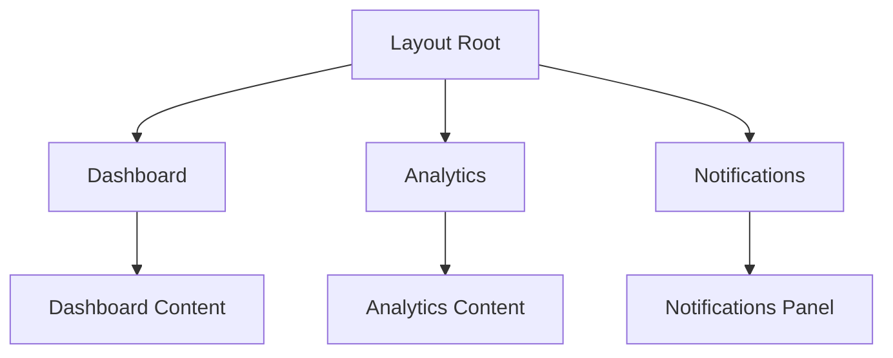
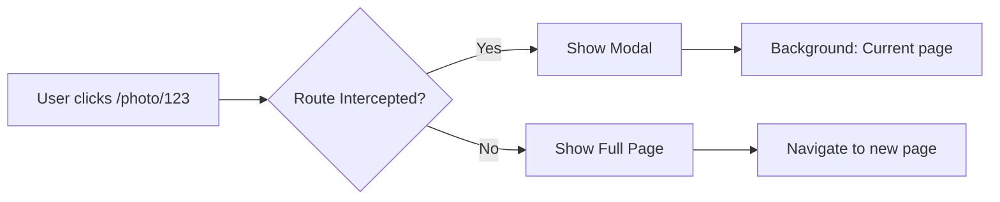
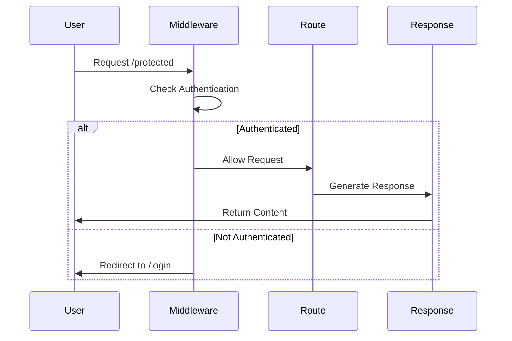

# Bài 7: Advanced Routing Patterns trong Next.js App Router

<div className="bg-gradient-to-r from-blue-50 to-indigo-50 p-6 rounded-lg border-l-4 border-blue-500 mb-8">
  <h2 className="text-2xl font-bold text-blue-800 mb-2">🎯 Mục tiêu bài học</h2>
  <p className="text-gray-700">Trong bài học này, chúng ta sẽ tìm hiểu về các mẫu routing nâng cao trong Next.js App Router, bao gồm Parallel Routes, Intercepting Routes, Route Groups và các kỹ thuật bảo mật routes.</p>
</div>

## 📋 Nội dung chính

| Chủ đề | Thời gian | Độ khó |
|--------|-----------|---------|
| Parallel Routes | 45 phút | ⭐⭐⭐ |
| Intercepting Routes | 40 phút | ⭐⭐⭐⭐ |
| Route Groups | 30 phút | ⭐⭐ |
| Middleware & Route Protection | 50 phút | ⭐⭐⭐⭐ |
| Redirects & Rewrites | 35 phút | ⭐⭐⭐ |

---

## 1. Parallel Routes - Định tuyến song song

### 🔍 Khái niệm cốt lõi

**Parallel Routes** cho phép bạn hiển thị nhiều trang đồng thời trong cùng một layout. Điều này đặc biệt hữu ích khi xây dựng dashboard, modal hoặc các giao diện phức tạp.



### 📁 Cấu trúc thư mục cho Parallel Routes

```
app/
├── layout.tsx
├── page.tsx
├── @dashboard/
│   ├── page.tsx
│   └── loading.tsx
├── @analytics/
│   ├── page.tsx
│   └── error.tsx
└── @notifications/
    ├── page.tsx
    └── default.tsx
```

<div className="bg-yellow-50 border border-yellow-200 rounded-lg p-4 mb-6">
  <h4 className="text-yellow-800 font-semibold mb-2">⚠️ Lưu ý quan trọng</h4>
  <p className="text-yellow-700">Tên thư mục bắt đầu với <code>@</code> được gọi là <strong>slot</strong>. Chúng không ảnh hưởng đến URL routing.</p>
</div>

### 💻 Triển khai Parallel Routes

#### Layout chính (app/layout.tsx)
```tsx
export default function RootLayout({
  children,
  dashboard,
  analytics,
  notifications,
}: {
  children: React.ReactNode
  dashboard: React.ReactNode
  analytics: React.ReactNode
  notifications: React.ReactNode
}) {
  return (
    <html lang="en">
      <body className="min-h-screen bg-gray-50">
        <nav className="bg-white shadow-sm border-b px-6 py-4">
          <h1 className="text-xl font-semibold">Admin Dashboard</h1>
        </nav>
        
        <div className="container mx-auto p-6">
          <div className="grid grid-cols-12 gap-6">
            {/* Main content */}
            <div className="col-span-8">
              {children}
            </div>
            
            {/* Sidebar with parallel routes */}
            <div className="col-span-4 space-y-6">
              <div className="bg-white rounded-lg shadow p-4">
                {dashboard}
              </div>
              
              <div className="bg-white rounded-lg shadow p-4">
                {analytics}
              </div>
              
              <div className="bg-white rounded-lg shadow p-4">
                {notifications}
              </div>
            </div>
          </div>
        </div>
      </body>
    </html>
  )
}
```

#### Dashboard slot (@dashboard/page.tsx)
```tsx
export default function DashboardSlot() {
  return (
    <div className="space-y-4">
      <h2 className="text-lg font-semibold text-gray-800">
        Quick Stats
      </h2>
      <div className="grid grid-cols-2 gap-3">
        <div className="bg-blue-50 p-3 rounded">
          <div className="text-2xl font-bold text-blue-600">1,234</div>
          <div className="text-sm text-gray-600">Total Users</div>
        </div>
        <div className="bg-green-50 p-3 rounded">
          <div className="text-2xl font-bold text-green-600">$45,678</div>
          <div className="text-sm text-gray-600">Revenue</div>
        </div>
      </div>
    </div>
  )
}
```

### 📊 Bảng so sánh Parallel Routes vs Traditional Routing

| Tiêu chí | Parallel Routes | Traditional Routing |
|----------|-----------------|-------------------|
| **Hiển thị đồng thời** | ✅ Nhiều component cùng lúc | ❌ Chỉ một route tại một thời điểm |
| **Performance** | ⚡ Tải song song, tốc độ cao | 🐌 Tải tuần tự |
| **Code Organization** | 📁 Tách biệt theo chức năng | 📄 Tập trung vào một file |
| **Complexity** | 🔥 Phức tạp hơn | ⭐ Đơn giản |
| **Use Cases** | Dashboard, Modal, Layout phức tạp | Trang đơn giản |

---

## 2. Intercepting Routes - Chặn định tuyến

### 🎯 Khái niệm và ứng dụng

**Intercepting Routes** cho phép bạn "chặn" một route và hiển thị nội dung khác, thường được sử dụng để tạo modal, overlay hoặc preview.



### 📂 Cú pháp Intercepting Routes

| Cú pháp | Mô tả | Ví dụ |
|---------|-------|-------|
| `(.)` | Cùng cấp | `(.)/photo/[id]` |
| `(..)` | Cấp cha | `(..)/photo/[id]` |
| `(...)` | Từ root | `(...)/photo/[id]` |
| `(..)(..)` | Hai cấp trên | `(..)(..))/photo/[id]` |

### 🏗️ Xây dựng Modal với Intercepting Routes

#### Cấu trúc thư mục
```
app/
├── layout.tsx
├── page.tsx
├── @modal/
│   ├── (.)photo/
│   │   └── [id]/
│   │       └── page.tsx
│   └── default.tsx
├── photo/
│   └── [id]/
│       └── page.tsx
└── components/
    └── modal.tsx
```

#### Modal Component (components/modal.tsx)
```tsx
'use client'

import { useRouter } from 'next/navigation'
import { useEffect, useRef } from 'react'

interface ModalProps {
  children: React.ReactNode
}

export default function Modal({ children }: ModalProps) {
  const router = useRouter()
  const dialogRef = useRef<HTMLDialogElement>(null)

  useEffect(() => {
    dialogRef.current?.showModal()
  }, [])

  const handleClose = () => {
    router.back()
  }

  return (
    <dialog
      ref={dialogRef}
      className="fixed inset-0 z-50 bg-black bg-opacity-50 backdrop-blur-sm"
      onClose={handleClose}
    >
      <div className="flex items-center justify-center min-h-screen p-4">
        <div className="bg-white rounded-lg shadow-xl max-w-lg w-full">
          <div className="flex justify-end p-2">
            <button
              onClick={handleClose}
              className="text-gray-500 hover:text-gray-700 text-2xl"
            >
              ×
            </button>
          </div>
          <div className="px-6 pb-6">
            {children}
          </div>
        </div>
      </div>
    </dialog>
  )
}
```

#### Intercepted Route (@modal/(.)photo/[id]/page.tsx)
```tsx
import Modal from '@/components/modal'
import { getPhotoById } from '@/lib/api'

interface Props {
  params: { id: string }
}

export default async function PhotoModal({ params }: Props) {
  const photo = await getPhotoById(params.id)

  return (
    <Modal>
      <div className="space-y-4">
        <h2 className="text-xl font-semibold">{photo.title}</h2>
        
        <p className="text-gray-600">{photo.description}</p>
        
        <div className="flex space-x-2">
          <span className="px-2 py-1 bg-blue-100 text-blue-800 text-sm rounded">
            {photo.category}
          </span>
          <span className="px-2 py-1 bg-gray-100 text-gray-800 text-sm rounded">
            {photo.author}
          </span>
        </div>
      </div>
    </Modal>
  )
}
```

---

## 3. Route Groups - Nhóm định tuyến

### 📁 Khái niệm Route Groups

**Route Groups** cho phép tổ chức routes mà không ảnh hưởng đến URL path. Sử dụng cú pháp `(groupName)`.

<div className="bg-green-50 border border-green-200 rounded-lg p-4 mb-6">
  <h4 className="text-green-800 font-semibold mb-2">💡 Lợi ích của Route Groups</h4>
  <ul className="text-green-700 space-y-1">
    <li>• Tổ chức code theo chức năng</li>
    <li>• Tạo multiple root layouts</li>
    <li>• Không ảnh hưởng đến URL routing</li>
    <li>• Dễ dàng quản lý large applications</li>
  </ul>
</div>

### 🏢 Ví dụ thực tế: E-commerce Site

```
app/
├── (shop)/
│   ├── layout.tsx          # Shop layout
│   ├── page.tsx            # Homepage (/)
│   ├── products/
│   │   └── [id]/
│   │       └── page.tsx    # /products/123
│   └── cart/
│       └── page.tsx        # /cart
├── (admin)/
│   ├── layout.tsx          # Admin layout  
│   ├── dashboard/
│   │   └── page.tsx        # /dashboard
│   └── users/
│       └── page.tsx        # /users
└── (auth)/
    ├── login/
    │   └── page.tsx        # /login
    └── register/
        └── page.tsx        # /register
```

#### Shop Layout ((shop)/layout.tsx)
```tsx
import Header from '@/components/shop/header'
import Footer from '@/components/shop/footer'

export default function ShopLayout({
  children,
}: {
  children: React.ReactNode
}) {
  return (
    <div className="min-h-screen flex flex-col">
      <Header />
      <main className="flex-1 container mx-auto px-4 py-8">
        {children}
      </main>
      <Footer />
    </div>
  )
}
```

#### Admin Layout ((admin)/layout.tsx)
```tsx
import AdminSidebar from '@/components/admin/sidebar'
import AdminHeader from '@/components/admin/header'

export default function AdminLayout({
  children,
}: {
  children: React.ReactNode
}) {
  return (
    <div className="flex h-screen bg-gray-100">
      <AdminSidebar />
      <div className="flex-1 flex flex-col overflow-hidden">
        <AdminHeader />
        <main className="flex-1 overflow-auto p-6">
          {children}
        </main>
      </div>
    </div>
  )
}
```

### 📊 Mapping Route Groups Usage

| Use Case | Structure | Benefit |
|----------|-----------|---------|
| **Multi-tenant App** | `(tenant1)`, `(tenant2)` | Separate layouts per tenant |
| **User Roles** | `(admin)`, `(user)`, `(guest)` | Role-based layouts |
| **Features** | `(blog)`, `(shop)`, `(docs)` | Feature-based organization |
| **Localization** | `(en)`, `(vi)`, `(fr)` | Language-specific layouts |

---

## 4. Middleware và Route Protection

### 🛡️ Giới thiệu Middleware

**Middleware** trong Next.js chạy trước khi request được hoàn tất, cho phép bạn modify response, redirect, rewrite hoặc set headers.



### ⚙️ Thiết lập Middleware

#### middleware.ts (root level)
```tsx
import { NextResponse } from 'next/server'
import type { NextRequest } from 'next/server'

export function middleware(request: NextRequest) {
  // Get token from cookies
  const token = request.cookies.get('auth-token')
  const isLoginPage = request.nextUrl.pathname.startsWith('/login')
  const isAdminPage = request.nextUrl.pathname.startsWith('/admin')
  const isApiRoute = request.nextUrl.pathname.startsWith('/api')

  // Redirect logic
  if (isAdminPage && !token) {
    return NextResponse.redirect(new URL('/login', request.url))
  }

  if (isLoginPage && token) {
    return NextResponse.redirect(new URL('/dashboard', request.url))
  }

  // API Route protection
  if (isApiRoute && !token) {
    return NextResponse.json(
      { error: 'Authentication required' },
      { status: 401 }
    )
  }

  return NextResponse.next()
}

export const config = {
  matcher: [
    // Match all paths except static files and api
    '/((?!_next/static|_next/image|favicon.ico).*)',
  ],
}
```

### 🔐 Advanced Authentication Patterns

#### JWT Token Validation
```tsx
import { NextResponse } from 'next/server'
import type { NextRequest } from 'next/server'
import { jwtVerify } from 'jose'

const secret = new TextEncoder().encode(process.env.JWT_SECRET)

async function verifyToken(token: string) {
  try {
    const { payload } = await jwtVerify(token, secret)
    return payload
  } catch (error) {
    return null
  }
}

export async function middleware(request: NextRequest) {
  const token = request.cookies.get('auth-token')?.value
  const pathname = request.nextUrl.pathname

  // Public paths that don't require authentication
  const publicPaths = ['/login', '/register', '/api/auth/login']
  if (publicPaths.includes(pathname)) {
    return NextResponse.next()
  }

  if (!token) {
    return NextResponse.redirect(new URL('/login', request.url))
  }

  // Verify token
  const user = await verifyToken(token)
  if (!user) {
    return NextResponse.redirect(new URL('/login', request.url))
  }

  // Role-based access control
  if (pathname.startsWith('/admin') && user.role !== 'admin') {
    return NextResponse.redirect(new URL('/unauthorized', request.url))
  }

  // Add user info to headers for use in components
  const response = NextResponse.next()
  response.headers.set('x-user-id', user.sub as string)
  response.headers.set('x-user-role', user.role as string)

  return response
}
```

### 📋 Bảng so sánh Middleware Patterns

| Pattern | Use Case | Pros | Cons |
|---------|----------|------|------|
| **Cookie-based** | Traditional web apps | Simple, secure | CSRF risk |
| **JWT Headers** | API-first apps | Stateless, scalable | Token size |
| **Session-based** | Server-side apps | Secure, revocable | Server memory |
| **OAuth/OIDC** | Third-party auth | Standard, feature-rich | Complex setup |

---

## 5. Redirects và Rewrites

### 🔄 Permanent vs Temporary Redirects

#### next.config.js Configuration
```javascript
/** @type {import('next').NextConfig} */
const nextConfig = {
  async redirects() {
    return [
      // Permanent redirect (301)
      {
        source: '/old-blog/:path*',
        destination: '/blog/:path*',
        permanent: true,
      },
      // Temporary redirect (307)
      {
        source: '/maintenance',
        destination: '/coming-soon',
        permanent: false,
      },
      // Conditional redirect
      {
        source: '/admin/:path*',
        has: [
          {
            type: 'cookie',
            key: 'role',
            value: 'admin',
          },
        ],
        destination: '/admin/:path*',
        permanent: false,
      },
    ]
  },

  async rewrites() {
    return [
      // Simple rewrite
      {
        source: '/api/v1/:path*',
        destination: '/api/:path*',
      },
      // External API proxy
      {
        source: '/external-api/:path*',
        destination: 'https://api.external.com/:path*',
      },
    ]
  },
}

module.exports = nextConfig
```

### 🎯 Dynamic Redirects trong Middleware

```tsx
import { NextResponse } from 'next/server'
import type { NextRequest } from 'next/server'

export function middleware(request: NextRequest) {
  const { pathname } = request.nextUrl
  
  // A/B testing redirect
  if (pathname === '/pricing') {
    const variant = Math.random() > 0.5 ? 'a' : 'b'
    return NextResponse.rewrite(
      new URL(`/pricing-${variant}`, request.url)
    )
  }

  // Geo-based redirect
  const country = request.geo?.country
  if (pathname === '/' && country === 'VN') {
    return NextResponse.redirect(new URL('/vi', request.url))
  }

  // Feature flag redirect
  const hasFeatureFlag = request.cookies.get('beta-features')
  if (pathname.startsWith('/beta') && !hasFeatureFlag) {
    return NextResponse.redirect(new URL('/coming-soon', request.url))
  }

  return NextResponse.next()
}
```

---

## 🛠️ Thực hành: Xây dựng Dashboard với Advanced Routing

### 📋 Yêu cầu dự án

<div className="bg-blue-50 border border-blue-200 rounded-lg p-4 mb-6">
  <h4 className="text-blue-800 font-semibold mb-3">🎯 Mục tiêu thực hành</h4>
  <p className="text-blue-700 mb-3">Xây dựng một dashboard admin với các tính năng:</p>
  <ul className="text-blue-700 space-y-1">
    <li>✅ Parallel routes cho sidebar và main content</li>
    <li>✅ Modal cho user details (intercepting routes)</li>
    <li>✅ Route groups cho admin và user areas</li>
    <li>✅ Middleware protection cho admin routes</li>
    <li>✅ Dynamic redirects based on user roles</li>
  </ul>
</div>

### 🏗️ Implementation Steps

#### Step 1: Project Structure
```
app/
├── middleware.ts
├── layout.tsx
├── (admin)/
│   ├── layout.tsx
│   ├── dashboard/
│   │   ├── @sidebar/
│   │   │   └── page.tsx
│   │   ├── @content/
│   │   │   └── page.tsx
│   │   └── page.tsx
│   └── users/
│       ├── @modal/
│       │   └── (.)user/
│       │       └── [id]/
│       │           └── page.tsx
│       ├── page.tsx
│       └── user/
│           └── [id]/
│               └── page.tsx
├── (auth)/
│   ├── login/
│   │   └── page.tsx
│   └── register/
│       └── page.tsx
└── components/
    ├── auth/
    ├── admin/
    └── ui/
```

#### Step 2: Complete Implementation

Xem file hoàn chỉnh trong artifacts để có code implementation đầy đủ.

---

## 📚 Tóm tắt và Checklist

### ✅ Kiến thức đã học

| Concept | Status | Notes |
|---------|--------|-------|
| Parallel Routes (`@folder`) | ✅ | Hiển thị multiple components |
| Intercepting Routes (`(.)`) | ✅ | Modal và overlay patterns |
| Route Groups (`(folder)`) | ✅ | Tổ chức code không ảnh hưởng URL |
| Middleware | ✅ | Authentication và protection |
| Redirects & Rewrites | ✅ | URL manipulation |

### 🎯 Bài tập về nhà

1. **Mở rộng Dashboard**: Thêm thêm parallel routes cho notifications và statistics
2. **Modal Gallery**: Tạo photo gallery với intercepting routes
3. **Multi-tenant**: Implement route groups cho multiple tenants
4. **Advanced Middleware**: Thêm rate limiting và logging
5. **SEO Redirects**: Setup redirects cho old URLs

### 📖 Tài liệu tham khảo

- [Next.js Routing Documentation](https://nextjs.org/docs/app/building-your-application/routing)
- [Middleware Documentation](https://nextjs.org/docs/app/building-your-application/routing/middleware)
- [Parallel Routes Guide](https://nextjs.org/docs/app/building-your-application/routing/parallel-routes)

---

<div className="bg-gradient-to-r from-green-50 to-emerald-50 p-6 rounded-lg border-l-4 border-green-500">
  <h3 className="text-xl font-bold text-green-800 mb-2">🎉 Chúc mừng!</h3>
  <p className="text-green-700">Bạn đã hoàn thành Bài 7 và nắm vững các advanced routing patterns trong Next.js. Những kiến thức này sẽ giúp bạn xây dựng những ứng dụng web phức tạp và chuyên nghiệp.</p>
</div>