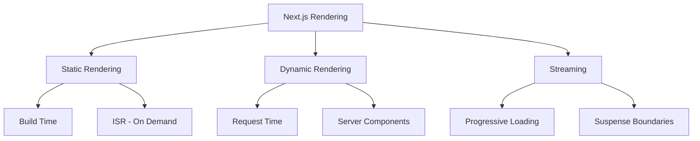
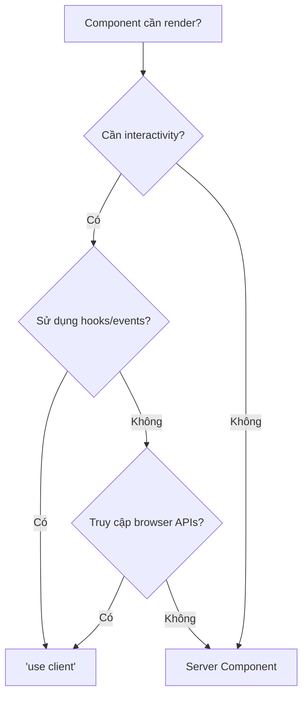
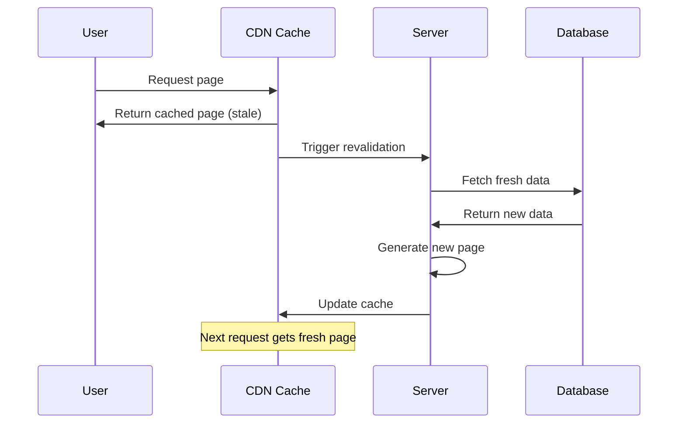
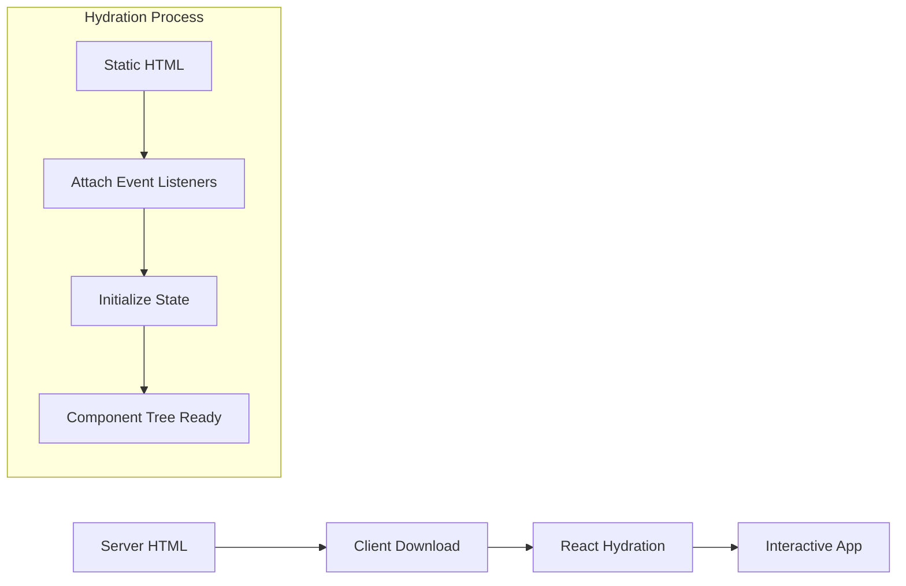

# Bài 8: Rendering Strategies trong Next.js

<div className="bg-blue-50 border-l-4 border-blue-500 p-4 mb-6">
  <h2 className="text-xl font-semibold text-blue-800 mb-2">🎯 Mục tiêu bài học</h2>
  <p className="text-blue-700">Sau khi hoàn thành bài học này, bạn sẽ:</p>
  <ul className="mt-2 text-blue-700">
    <li>• Hiểu sự khác biệt giữa Static và Dynamic Rendering</li>
    <li>• Phân biệt được Server Components và Client Components</li>
    <li>• Sử dụng "use client" directive một cách hiệu quả</li>
    <li>• Áp dụng Incremental Static Regeneration (ISR)</li>
    <li>• Triển khai Streaming và Suspense boundaries</li>
  </ul>
</div>

## 1. Tổng quan về Rendering Strategies

Next.js cung cấp nhiều chiến lược rendering khác nhau để tối ưu hóa hiệu năng và trải nghiệm người dùng. Việc hiểu rõ các chiến lược này là chìa khóa để xây dựng ứng dụng web hiệu quả.



## 2. Static Rendering vs Dynamic Rendering

### Static Rendering (Tĩnh)

Static Rendering xảy ra tại **build time** hoặc trong quá trình **revalidation**. Nó tạo ra HTML tĩnh có thể được cache và phục vụ từ CDN.

| Đặc điểm | Static Rendering | Dynamic Rendering |
|----------|------------------|-------------------|
| **Thời điểm render** | Build time / Revalidation | Request time |
| **Hiệu năng** | Rất cao (CDN cache) | Phụ thuộc server |
| **Tính real-time** | Không | Có |
| **SEO** | Xuất sắc | Tốt |
| **Phù hợp cho** | Blog, Landing Page | Dashboard, User Profile |

```typescript
// app/blog/page.tsx - Static Rendering
export default function BlogPage() {
  return (
    <div className="max-w-4xl mx-auto p-6">
      <h1 className="text-3xl font-bold mb-6">Blog Posts</h1>
      <p>Trang này được render tại build time</p>
    </div>
  );
}
```

### Dynamic Rendering (Động)

Dynamic Rendering xảy ra tại **request time** cho mỗi user request. Nó phù hợp cho content cá nhân hóa hoặc dữ liệu thay đổi thường xuyên.

```typescript
// app/dashboard/page.tsx - Dynamic Rendering
import { headers } from 'next/headers';

export default async function Dashboard() {
  const headersList = headers();
  const userAgent = headersList.get('user-agent');
  
  return (
    <div className="max-w-4xl mx-auto p-6">
      <h1 className="text-3xl font-bold mb-6">Dashboard</h1>
      <p className="text-gray-600">User Agent: {userAgent}</p>
    </div>
  );
}
```

<div className="bg-yellow-50 border-l-4 border-yellow-500 p-4 my-6">
  <h3 className="font-semibold text-yellow-800">⚡ Lưu ý quan trọng</h3>
  <p className="text-yellow-700 mt-2">
    Next.js tự động chuyển từ Static sang Dynamic rendering khi phát hiện:
  </p>
  <ul className="mt-2 text-yellow-700">
    <li>• Dynamic functions (headers(), cookies(), searchParams)</li>
    <li>• Uncached data requests</li>
    <li>• Dynamic segments trong URL</li>
  </ul>
</div>

## 3. Server Components vs Client Components

### Server Components (Mặc định)

Server Components chạy trên server và render thành HTML trước khi gửi đến client.

**Ưu điểm:**
- Bundle size nhỏ hơn
- Truy cập trực tiếp database
- Bảo mật cao hơn (API keys, tokens)
- SEO tốt

```typescript
// app/products/page.tsx - Server Component
async function getProducts() {
  const res = await fetch('https://api.example.com/products', {
    cache: 'force-cache' // Static
  });
  return res.json();
}

export default async function ProductsPage() {
  const products = await getProducts();
  
  return (
    <div className="grid grid-cols-1 md:grid-cols-3 gap-6 p-6">
      {products.map((product: any) => (
        <div key={product.id} className="border rounded-lg p-4">
          <h3 className="font-semibold">{product.name}</h3>
          <p className="text-gray-600">${product.price}</p>
        </div>
      ))}
    </div>
  );
}
```

### Client Components

Client Components chạy trên browser và cho phép interactivity.

```typescript
// app/components/Counter.tsx - Client Component
'use client';

import { useState } from 'react';

export default function Counter() {
  const [count, setCount] = useState(0);
  
  return (
    <div className="p-4 border rounded-lg">
      <p className="text-lg mb-4">Count: {count}</p>
      <div className="space-x-2">
        <button 
          onClick={() => setCount(count + 1)}
          className="px-4 py-2 bg-blue-500 text-white rounded hover:bg-blue-600"
        >
          Increment
        </button>
        <button 
          onClick={() => setCount(count - 1)}
          className="px-4 py-2 bg-red-500 text-white rounded hover:bg-red-600"
        >
          Decrement
        </button>
      </div>
    </div>
  );
}
```

### Khi nào sử dụng "use client"?

| Tình huống | Server Component | Client Component |
|------------|------------------|------------------|
| Fetch data từ API | ✅ | ❌ |
| Event handlers (onClick, onChange) | ❌ | ✅ |
| React Hooks (useState, useEffect) | ❌ | ✅ |
| Browser APIs (localStorage, window) | ❌ | ✅ |
| Database queries trực tiếp | ✅ | ❌ |



## 4. Incremental Static Regeneration (ISR)

ISR cho phép bạn cập nhật static content sau khi đã build mà không cần rebuild toàn bộ site.

### Cách hoạt động của ISR



### Time-based Revalidation

```typescript
// app/posts/page.tsx - ISR với time-based revalidation
async function getPosts() {
  const res = await fetch('https://api.example.com/posts', {
    next: { 
      revalidate: 3600 // Revalidate mỗi 1 giờ
    }
  });
  
  if (!res.ok) {
    throw new Error('Failed to fetch posts');
  }
  
  return res.json();
}

export default async function PostsPage() {
  const posts = await getPosts();
  
  return (
    <div className="max-w-4xl mx-auto p-6">
      <h1 className="text-3xl font-bold mb-6">Latest Posts</h1>
      <div className="space-y-4">
        {posts.map((post: any) => (
          <article key={post.id} className="border-b pb-4">
            <h2 className="text-xl font-semibold mb-2">{post.title}</h2>
            <p className="text-gray-600">{post.excerpt}</p>
            <time className="text-sm text-gray-500">
              {new Date(post.createdAt).toLocaleDateString()}
            </time>
          </article>
        ))}
      </div>
    </div>
  );
}
```

### On-demand Revalidation

```typescript
// app/api/revalidate/route.ts - API route để trigger revalidation
import { revalidatePath } from 'next/cache';
import { NextRequest } from 'next/server';

export async function POST(request: NextRequest) {
  const secret = request.nextUrl.searchParams.get('secret');
  
  if (secret !== process.env.REVALIDATE_SECRET) {
    return Response.json({ message: 'Invalid secret' }, { status: 401 });
  }
  
  try {
    // Revalidate specific path
    revalidatePath('/posts');
    
    return Response.json({ 
      message: 'Revalidation successful',
      now: Date.now()
    });
  } catch (error) {
    return Response.json({ 
      message: 'Error revalidating',
      error: error instanceof Error ? error.message : 'Unknown error'
    }, { status: 500 });
  }
}
```

## 5. Streaming và Suspense

Streaming cho phép gửi HTML theo từng phần, cải thiện perceived performance và Time to First Byte (TTFB).

### Loading.tsx - Route-level Suspense

```typescript
// app/dashboard/loading.tsx
export default function DashboardLoading() {
  return (
    <div className="max-w-4xl mx-auto p-6">
      <div className="animate-pulse">
        <div className="h-8 bg-gray-300 rounded w-1/4 mb-6"></div>
        <div className="grid grid-cols-1 md:grid-cols-3 gap-6">
          {[1, 2, 3].map((i) => (
            <div key={i} className="h-32 bg-gray-300 rounded"></div>
          ))}
        </div>
      </div>
    </div>
  );
}
```

### Component-level Suspense

```typescript
// app/dashboard/page.tsx - Sử dụng Suspense boundaries
import { Suspense } from 'react';

async function UserStats() {
  await new Promise(resolve => setTimeout(resolve, 2000)); // Simulate slow API
  return (
    <div className="bg-blue-100 p-4 rounded-lg">
      <h3 className="font-semibold">User Statistics</h3>
      <p>1,234 total visits</p>
    </div>
  );
}

async function RecentActivity() {
  await new Promise(resolve => setTimeout(resolve, 1000)); // Faster API
  return (
    <div className="bg-green-100 p-4 rounded-lg">
      <h3 className="font-semibold">Recent Activity</h3>
      <p>Last login: 2 hours ago</p>
    </div>
  );
}

function StatsSkeleton() {
  return (
    <div className="bg-gray-100 p-4 rounded-lg animate-pulse">
      <div className="h-4 bg-gray-300 rounded w-3/4 mb-2"></div>
      <div className="h-4 bg-gray-300 rounded w-1/2"></div>
    </div>
  );
}

function ActivitySkeleton() {
  return (
    <div className="bg-gray-100 p-4 rounded-lg animate-pulse">
      <div className="h-4 bg-gray-300 rounded w-3/4 mb-2"></div>
      <div className="h-4 bg-gray-300 rounded w-2/3"></div>
    </div>
  );
}

export default function Dashboard() {
  return (
    <div className="max-w-4xl mx-auto p-6">
      <h1 className="text-3xl font-bold mb-6">Dashboard</h1>
      
      <div className="grid grid-cols-1 md:grid-cols-2 gap-6">
        <Suspense fallback={<StatsSkeleton />}>
          <UserStats />
        </Suspense>
        
        <Suspense fallback={<ActivitySkeleton />}>
          <RecentActivity />
        </Suspense>
      </div>
    </div>
  );
}
```

## 6. Hydration và Partial Hydration

### Hiểu về Hydration Process



### Tối ưu hóa Hydration

```typescript
// app/components/OptimizedComponent.tsx
'use client';

import { useState, useEffect } from 'react';

export default function OptimizedComponent() {
  const [mounted, setMounted] = useState(false);
  const [data, setData] = useState(null);
  
  useEffect(() => {
    setMounted(true);
    // Chỉ chạy client-side logic sau khi mounted
    if (typeof window !== 'undefined') {
      // Browser-specific code
    }
  }, []);
  
  if (!mounted) {
    // Return server-side compatible JSX
    return <div className="p-4 border rounded">Loading...</div>;
  }
  
  return (
    <div className="p-4 border rounded">
      <h3 className="font-semibold mb-2">Client-side Component</h3>
      <p>This component is fully hydrated!</p>
    </div>
  );
}
```

## 7. Best Practices và Performance Tips

### Bảng so sánh Rendering Strategies

| Use Case | Recommended Strategy | Lý do |
|----------|---------------------|-------|
| **Landing Page** | Static Rendering | SEO tối ưu, tốc độ cao |
| **Blog Posts** | ISR | Content ít thay đổi, SEO tốt |
| **User Dashboard** | Dynamic Rendering | Dữ liệu cá nhân hóa |
| **E-commerce Product** | ISR + Client hydration | Cân bằng SEO và UX |
| **Real-time Chat** | Client Components | Cần interactivity cao |

### Performance Optimization Checklist

<div className="bg-green-50 border-l-4 border-green-500 p-4 my-6">
  <h3 className="font-semibold text-green-800 mb-2">✅ Optimization Checklist</h3>
  <div className="text-green-700">
    <p><strong>Static Content:</strong></p>
    <ul className="ml-4 mb-3">
      <li>• Sử dụng Static Rendering cho pages không thay đổi</li>
      <li>• Implement ISR cho content cập nhật định kỳ</li>
    </ul>
    
    <p><strong>Dynamic Content:</strong></p>
    <ul className="ml-4 mb-3">
      <li>• Minimize Client Components</li>
      <li>• Use Suspense cho data fetching</li>
    </ul>
    
    <p><strong>User Experience:</strong></p>
    <ul className="ml-4">
      <li>• Implement loading states</li>
      <li>• Progressive enhancement</li>
    </ul>
  </div>
</div>

## 8. Thực hành: Tối ưu hóa Rendering

### Bài tập 1: Blog với ISR

Tạo một blog application sử dụng ISR:

```typescript
// app/blog/[slug]/page.tsx
interface Post {
  id: string;
  title: string;
  content: string;
  createdAt: string;
}

async function getPost(slug: string): Promise<Post> {
  const res = await fetch(`https://api.example.com/posts/${slug}`, {
    next: { 
      revalidate: 3600, // 1 hour
      tags: ['posts', `post-${slug}`]
    }
  });
  
  if (!res.ok) {
    throw new Error('Post not found');
  }
  
  return res.json();
}

export async function generateStaticParams() {
  const posts = await fetch('https://api.example.com/posts').then(res => res.json());
  
  return posts.map((post: Post) => ({
    slug: post.id,
  }));
}

export default async function BlogPost({ 
  params 
}: { 
  params: { slug: string } 
}) {
  const post = await getPost(params.slug);
  
  return (
    <article className="max-w-3xl mx-auto p-6">
      <h1 className="text-4xl font-bold mb-4">{post.title}</h1>
      <time className="text-gray-500 block mb-6">
        {new Date(post.createdAt).toLocaleDateString()}
      </time>
      <div 
        className="prose prose-lg max-w-none"
        dangerouslySetInnerHTML={{ __html: post.content }}
      />
    </article>
  );
}
```

### Bài tập 2: Dashboard với Mixed Rendering

Kết hợp Server và Client Components:

```typescript
// app/dashboard/page.tsx
import { Suspense } from 'react';
import ServerStats from './components/ServerStats';
import ClientChart from './components/ClientChart';

export default function Dashboard() {
  return (
    <div className="max-w-6xl mx-auto p-6">
      <h1 className="text-3xl font-bold mb-8">Analytics Dashboard</h1>
      
      <div className="grid grid-cols-1 lg:grid-cols-2 gap-8">
        {/* Server-side rendered stats */}
        <Suspense fallback={<div className="h-64 bg-gray-100 animate-pulse rounded-lg" />}>
          <ServerStats />
        </Suspense>
        
        {/* Client-side interactive chart */}
        <ClientChart />
      </div>
    </div>
  );
}
```

## Tổng kết

Trong bài học này, chúng ta đã tìm hiểu về các chiến lược rendering trong Next.js:

- **Static vs Dynamic Rendering**: Hiểu khi nào nên sử dụng từng loại
- **Server vs Client Components**: Phân biệt rõ ràng và sử dụng hợp lý
- **ISR**: Cập nhật content tĩnh mà không cần rebuild
- **Streaming**: Cải thiện perceived performance với Suspense
- **Hydration**: Tối ưu hóa quá trình chuyển đổi từ static sang interactive

Việc lựa chọn đúng rendering strategy sẽ giúp ứng dụng của bạn có hiệu năng tối ưu và trải nghiệm người dùng tốt nhất.

---

<div className="bg-blue-50 border border-blue-200 rounded-lg p-4 mt-8">
  <h3 className="font-semibold text-blue-800 mb-2">🎯 Bài tập về nhà</h3>
  <p className="text-blue-700">
    Xây dựng một ứng dụng news aggregator sử dụng:
  </p>
  <ul className="mt-2 text-blue-700 ml-4">
    <li>• Static rendering cho trang chủ</li>
    <li>• ISR cho từng bài báo</li>
    <li>• Client components cho tính năng search và filter</li>
    <li>• Streaming cho comments section</li>
  </ul>
</div>