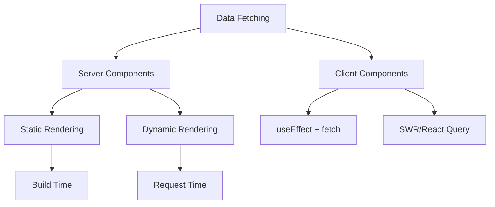
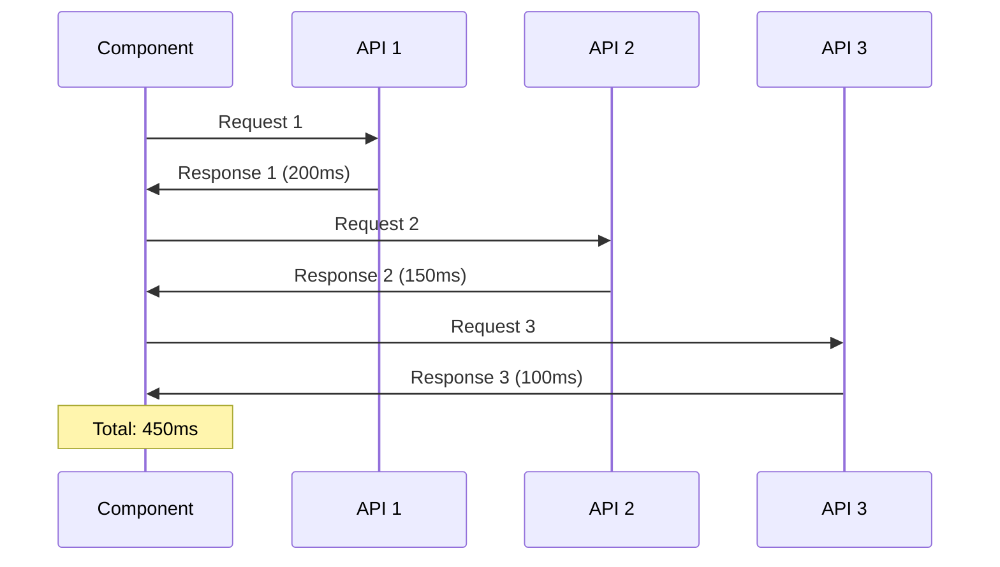
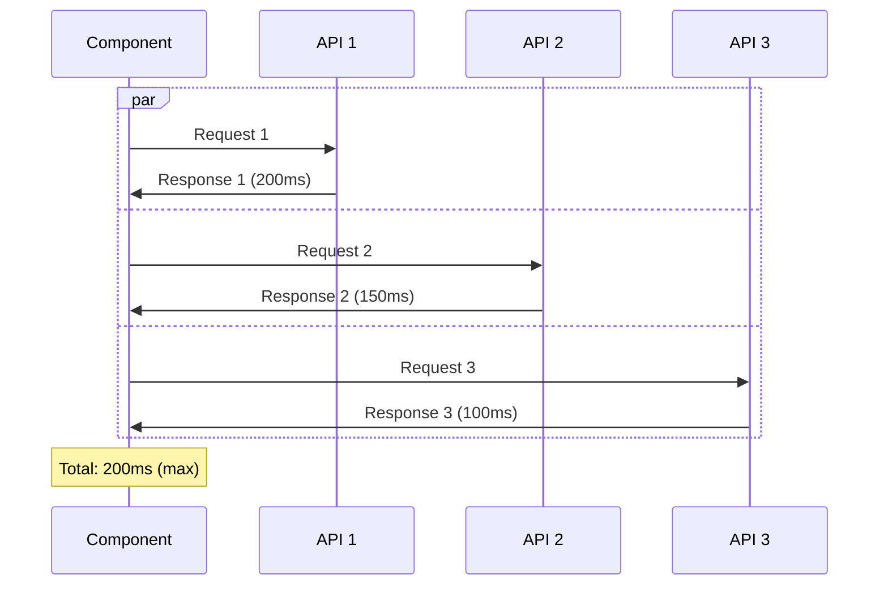

# Bài 9: Data Fetching Fundamentals
## Giới thiệu về Data Fetching trong Next.js

<div className="bg-gradient-to-r from-blue-50 to-indigo-50 p-6 rounded-lg border-l-4 border-blue-500 my-6">
  <h3 className="text-xl font-semibold text-blue-800 mb-3">🎯 Mục tiêu học tập</h3>
  <ul className="text-blue-700 space-y-2">
    <li>• Hiểu cách fetch data trong Server Components</li>
    <li>• Nắm vững fetch() API và cơ chế caching</li>
    <li>• Phân biệt Sequential vs Parallel data fetching</li>
    <li>• Xử lý errors và loading states</li>
    <li>• Implement preloading data patterns</li>
  </ul>
</div>

Data fetching là một trong những khái niệm quan trọng nhất trong Next.js App Router. Khác với React truyền thống, Next.js cho phép chúng ta fetch data ngay trong Server Components, giúp tối ưu hóa hiệu năng và SEO.

## Tổng quan về Data Fetching Strategies



### So sánh các phương pháp Data Fetching

| Phương pháp | Khi nào sử dụng | Ưu điểm | Nhược điểm |
|-------------|-----------------|---------|------------|
| **Server Components** | Data không thay đổi thường xuyên | SEO tốt, hiệu năng cao, bảo mật | Không tương tác được |
| **Client Components** | Data cần cập nhật realtime | Tương tác tốt, UX mượt mà | SEO kém, tải chậm hơn |
| **Static Generation** | Content ít thay đổi | Tốc độ nhanh nhất | Không phù hợp data động |
| **Server Side Rendering** | Data thay đổi theo request | Fresh data, SEO tốt | Chậm hơn static |

## 1. Data Fetching trong Server Components

### 1.1. Cơ bản về Server Components Data Fetching

Server Components cho phép chúng ta fetch data ngay trong component mà không cần `useEffect` hay các hooks khác:

```tsx
// app/posts/page.tsx
interface Post {
  id: number;
  title: string;
  body: string;
  userId: number;
}

async function PostsPage() {
  // Fetch data trực tiếp trong Server Component
  const posts: Post[] = await fetch('https://jsonplaceholder.typicode.com/posts')
    .then(res => res.json());

  return (
    <div className="container mx-auto px-4 py-8">
      <h1 className="text-3xl font-bold mb-6">Blog Posts</h1>
      <div className="grid gap-6 md:grid-cols-2 lg:grid-cols-3">
        {posts.map(post => (
          <article 
            key={post.id}
            className="bg-white rounded-lg shadow-md p-6 hover:shadow-lg transition-shadow"
          >
            <h2 className="text-xl font-semibold mb-3 text-gray-800">
              {post.title}
            </h2>
            <div className="text-gray-600 line-clamp-3">
              {post.body}
            </div>
          </article>
        ))}
      </div>
    </div>
  );
}

export default PostsPage;
```

### 1.2. Fetch API với TypeScript

<div className="bg-amber-50 border-l-4 border-amber-400 p-4 my-4">
  <h4 className="text-amber-800 font-semibold">💡 Best Practice</h4>
  <p className="text-amber-700 mt-2">Luôn định nghĩa types cho data và xử lý errors một cách rõ ràng.</p>
</div>

```tsx
// types/api.ts
export interface User {
  id: number;
  name: string;
  email: string;
  website: string;
}

export interface ApiResponse<T> {
  data?: T;
  error?: string;
}

// utils/api.ts
export async function fetchUsers(): Promise<ApiResponse<User[]>> {
  try {
    const response = await fetch('https://jsonplaceholder.typicode.com/users');
    
    if (!response.ok) {
      throw new Error(`HTTP error! status: ${response.status}`);
    }
    
    const users = await response.json();
    return { data: users };
  } catch (error) {
    console.error('Fetch users error:', error);
    return { error: 'Failed to fetch users' };
  }
}

// app/users/page.tsx
import { fetchUsers } from '@/utils/api';

async function UsersPage() {
  const { data: users, error } = await fetchUsers();

  if (error) {
    return (
      <div className="flex items-center justify-center min-h-screen">
        <div className="text-center text-red-600">
          <h2 className="text-2xl font-bold mb-2">Oops! Something went wrong</h2>
          <p>{error}</p>
        </div>
      </div>
    );
  }

  return (
    <div className="container mx-auto px-4 py-8">
      <h1 className="text-3xl font-bold mb-6">Users Directory</h1>
      <div className="grid gap-4 md:grid-cols-2 lg:grid-cols-3">
        {users?.map(user => (
          <div 
            key={user.id}
            className="bg-white border border-gray-200 rounded-lg p-6"
          >
            <h3 className="font-semibold text-lg">{user.name}</h3>
            <p className="text-gray-600">{user.email}</p>
            <a 
              href={`https://${user.website}`}
              className="text-blue-500 hover:underline"
              target="_blank"
              rel="noopener noreferrer"
            >
              {user.website}
            </a>
          </div>
        ))}
      </div>
    </div>
  );
}
```

## 2. Caching Mechanisms trong Next.js

### 2.1. Request Memoization

Next.js tự động cache các request giống nhau trong cùng một render tree:

```tsx
// utils/data.ts
export async function getProduct(id: string) {
  const res = await fetch(`https://api.example.com/products/${id}`);
  return res.json();
}

// components/ProductInfo.tsx
async function ProductInfo({ id }: { id: string }) {
  const product = await getProduct(id); // Request 1
  return <div>{product.name}</div>;
}

// components/ProductPrice.tsx  
async function ProductPrice({ id }: { id: string }) {
  const product = await getProduct(id); // Sẽ sử dụng cache, không gọi API lần 2
  return <div>${product.price}</div>;
}
```

### 2.2. Data Cache

```tsx
// Caching với thời gian
async function fetchPostsWithCache() {
  const res = await fetch('https://api.example.com/posts', {
    next: { revalidate: 60 } // Cache trong 60 giây
  });
  return res.json();
}

// Không cache (luôn fresh)
async function fetchRealTimeData() {
  const res = await fetch('https://api.example.com/live-data', {
    cache: 'no-store'
  });
  return res.json();
}

// Force cache
async function fetchStaticData() {
  const res = await fetch('https://api.example.com/static-data', {
    cache: 'force-cache'
  });
  return res.json();
}
```

### Bảng tóm tắt Cache Options

| Option | Mô tả | Khi nào sử dụng |
|--------|-------|-----------------|
| `force-cache` | Cache vĩnh viễn | Data không bao giờ thay đổi |
| `no-store` | Không cache, luôn fetch mới | Data thay đổi liên tục |
| `revalidate: seconds` | Cache với thời gian sống | Data thay đổi định kỳ |
| Default behavior | Cache cho đến khi revalidate | Hầu hết các trường hợp |

## 3. Sequential vs Parallel Data Fetching

### 3.1. Sequential Data Fetching (Tuần tự)



```tsx
// ❌ Sequential - Chậm
async function SequentialPage() {
  const posts = await fetch('https://api.example.com/posts').then(r => r.json());
  const users = await fetch('https://api.example.com/users').then(r => r.json());
  const comments = await fetch('https://api.example.com/comments').then(r => r.json());

  return (
    <div>
      <PostsList posts={posts} />
      <UsersList users={users} />
      <CommentsList comments={comments} />
    </div>
  );
}
```

### 3.2. Parallel Data Fetching (Song song)



```tsx
// ✅ Parallel - Nhanh hơn
async function ParallelPage() {
  // Khởi tạo tất cả promises cùng lúc
  const postsPromise = fetch('https://api.example.com/posts').then(r => r.json());
  const usersPromise = fetch('https://api.example.com/users').then(r => r.json());
  const commentsPromise = fetch('https://api.example.com/comments').then(r => r.json());

  // Chờ tất cả promises hoàn thành
  const [posts, users, comments] = await Promise.all([
    postsPromise,
    usersPromise,
    commentsPromise
  ]);

  return (
    <div>
      <PostsList posts={posts} />
      <UsersList users={users} />
      <CommentsList comments={comments} />
    </div>
  );
}
```

### 3.3. Mixed Approach (Kết hợp)

```tsx
async function MixedPage() {
  // Fetch user data trước (cần cho authorization)
  const user = await fetch('https://api.example.com/user/me').then(r => r.json());
  
  // Sau đó fetch data song song dựa trên user info
  const [posts, notifications] = await Promise.all([
    fetch(`https://api.example.com/posts?userId=${user.id}`).then(r => r.json()),
    fetch(`https://api.example.com/notifications?userId=${user.id}`).then(r => r.json())
  ]);

  return (
    <div>
      <UserProfile user={user} />
      <UserPosts posts={posts} />
      <Notifications notifications={notifications} />
    </div>
  );
}
```

## 4. Error Handling và Loading States

### 4.1. Error Boundaries

```tsx
// app/error.tsx
'use client';

interface ErrorProps {
  error: Error & { digest?: string };
  reset: () => void;
}

export default function Error({ error, reset }: ErrorProps) {
  return (
    <div className="flex flex-col items-center justify-center min-h-screen p-4">
      <div className="text-center max-w-md">
        <div className="text-6xl mb-4">😵</div>
        <h2 className="text-2xl font-bold text-gray-800 mb-2">
          Something went wrong!
        </h2>
        <div className="text-gray-600 mb-6">
          {error.message || 'An unexpected error occurred'}
        </div>
        <button
          onClick={reset}
          className="bg-blue-500 text-white px-6 py-3 rounded-lg hover:bg-blue-600 transition-colors"
        >
          Try again
        </button>
      </div>
    </div>
  );
}
```

### 4.2. Loading States

```tsx
// app/posts/loading.tsx
export default function Loading() {
  return (
    <div className="container mx-auto px-4 py-8">
      <div className="animate-pulse">
        <div className="h-8 bg-gray-300 rounded w-1/3 mb-6"></div>
        <div className="grid gap-6 md:grid-cols-2 lg:grid-cols-3">
          {[...Array(6)].map((_, i) => (
            <div key={i} className="bg-gray-300 rounded-lg h-48"></div>
          ))}
        </div>
      </div>
    </div>
  );
}
```

### 4.3. Custom Loading Component

```tsx
// components/SkeletonCard.tsx
export function SkeletonCard() {
  return (
    <div className="bg-white rounded-lg shadow-md p-6 animate-pulse">
      <div className="h-4 bg-gray-300 rounded w-3/4 mb-3"></div>
      <div className="space-y-2">
        <div className="h-3 bg-gray-300 rounded"></div>
        <div className="h-3 bg-gray-300 rounded w-2/3"></div>
      </div>
    </div>
  );
}

// app/products/page.tsx
import { Suspense } from 'react';
import { SkeletonCard } from '@/components/SkeletonCard';

async function ProductList() {
  const products = await fetch('https://api.example.com/products')
    .then(r => r.json());
    
  return (
    <div className="grid gap-6 md:grid-cols-2 lg:grid-cols-3">
      {products.map(product => (
        <ProductCard key={product.id} product={product} />
      ))}
    </div>
  );
}

export default function ProductsPage() {
  return (
    <div className="container mx-auto px-4 py-8">
      <h1 className="text-3xl font-bold mb-6">Products</h1>
      <Suspense 
        fallback={
          <div className="grid gap-6 md:grid-cols-2 lg:grid-cols-3">
            {[...Array(6)].map((_, i) => <SkeletonCard key={i} />)}
          </div>
        }
      >
        <ProductList />
      </Suspense>
    </div>
  );
}
```

## 5. Preloading Data

### 5.1. Preload Functions

```tsx
// utils/preload.ts
export function preloadPosts() {
  void fetch('https://api.example.com/posts');
}

export function preloadUser(id: string) {
  void fetch(`https://api.example.com/users/${id}`);
}

// components/PostLink.tsx
import Link from 'next/link';
import { preloadPosts } from '@/utils/preload';

export function PostLink() {
  return (
    <Link 
      href="/posts"
      onMouseEnter={preloadPosts} // Preload khi hover
      className="text-blue-500 hover:underline"
    >
      View Posts
    </Link>
  );
}
```

### 5.2. Streaming với Suspense

```tsx
// app/dashboard/page.tsx
import { Suspense } from 'react';

async function Analytics() {
  const data = await fetch('https://api.example.com/analytics').then(r => r.json());
  return <div>Analytics: {data.views}</div>;
}

async function Revenue() {
  const data = await fetch('https://api.example.com/revenue').then(r => r.json());
  return <div>Revenue: ${data.total}</div>;
}

export default function Dashboard() {
  return (
    <div className="space-y-6">
      <h1 className="text-3xl font-bold">Dashboard</h1>
      
      <div className="grid md:grid-cols-2 gap-6">
        <Suspense fallback={<div>Loading analytics...</div>}>
          <Analytics />
        </Suspense>
        
        <Suspense fallback={<div>Loading revenue...</div>}>
          <Revenue />
        </Suspense>
      </div>
    </div>
  );
}
```

## 6. Thực hành: Xây dựng Blog với Multiple APIs

### 6.1. Cấu trúc dự án

```
app/
├── blog/
│   ├── page.tsx          # Danh sách bài viết
│   ├── [slug]/
│   │   └── page.tsx      # Chi tiết bài viết
│   ├── loading.tsx       # Loading state
│   └── error.tsx         # Error boundary
├── components/
│   ├── BlogCard.tsx      # Card hiển thị bài viết
│   └── CommentList.tsx   # Danh sách comments
└── utils/
    └── blog-api.ts       # API functions
```

### 6.2. API Utilities

```tsx
// utils/blog-api.ts
export interface BlogPost {
  id: number;
  title: string;
  body: string;
  userId: number;
  author?: User;
}

export interface User {
  id: number;
  name: string;
  email: string;
  website: string;
}

export interface Comment {
  id: number;
  postId: number;
  name: string;
  email: string;
  body: string;
}

export async function getBlogPosts(): Promise<BlogPost[]> {
  const [posts, users] = await Promise.all([
    fetch('https://jsonplaceholder.typicode.com/posts').then(r => r.json()),
    fetch('https://jsonplaceholder.typicode.com/users').then(r => r.json())
  ]);

  return posts.map((post: BlogPost) => ({
    ...post,
    author: users.find((user: User) => user.id === post.userId)
  }));
}

export async function getBlogPost(id: string): Promise<{
  post: BlogPost;
  comments: Comment[];
}> {
  const [post, user, comments] = await Promise.all([
    fetch(`https://jsonplaceholder.typicode.com/posts/${id}`).then(r => r.json()),
    fetch(`https://jsonplaceholder.typicode.com/users/1`).then(r => r.json()),
    fetch(`https://jsonplaceholder.typicode.com/posts/${id}/comments`).then(r => r.json())
  ]);

  return {
    post: { ...post, author: user },
    comments
  };
}
```

### 6.3. Blog Listing Page

```tsx
// app/blog/page.tsx
import { getBlogPosts } from '@/utils/blog-api';
import { BlogCard } from '@/components/BlogCard';

export default async function BlogPage() {
  const posts = await getBlogPosts();

  return (
    <div className="container mx-auto px-4 py-8">
      <header className="text-center mb-12">
        <h1 className="text-4xl font-bold text-gray-900 mb-4">
          Our Blog
        </h1>
        <div className="text-xl text-gray-600">
          Discover amazing stories and insights
        </div>
      </header>

      <div className="grid gap-8 md:grid-cols-2 lg:grid-cols-3">
        {posts.map(post => (
          <BlogCard key={post.id} post={post} />
        ))}
      </div>
    </div>
  );
}
```

### 6.4. Blog Card Component

```tsx
// components/BlogCard.tsx
import Link from 'next/link';
import { BlogPost } from '@/utils/blog-api';

interface BlogCardProps {
  post: BlogPost;
}

export function BlogCard({ post }: BlogCardProps) {
  return (
    <article className="bg-white rounded-xl shadow-md overflow-hidden hover:shadow-xl transition-shadow duration-300">
      <div className="p-6">
        <div className="flex items-center mb-4">
          <div className="w-10 h-10 bg-gradient-to-r from-blue-500 to-purple-500 rounded-full flex items-center justify-center text-white font-semibold">
            {post.author?.name.charAt(0)}
          </div>
          <div className="ml-3">
            <div className="text-sm font-medium text-gray-900">
              {post.author?.name}
            </div>
            <div className="text-sm text-gray-500">
              {post.author?.website}
            </div>
          </div>
        </div>
        
        <h2 className="text-xl font-semibold text-gray-900 mb-3 line-clamp-2">
          {post.title}
        </h2>
        
        <div className="text-gray-600 mb-4 line-clamp-3">
          {post.body}
        </div>
        
        <Link
          href={`/blog/${post.id}`}
          className="inline-flex items-center text-blue-600 hover:text-blue-800 font-medium"
        >
          Read more
          <svg className="w-4 h-4 ml-1" fill="currentColor" viewBox="0 0 20 20">
            <path fillRule="evenodd" d="M10.293 5.293a1 1 0 011.414 0l4 4a1 1 0 010 1.414l-4 4a1 1 0 01-1.414-1.414L12.586 11H5a1 1 0 110-2h7.586l-2.293-2.293a1 1 0 010-1.414z" clipRule="evenodd" />
          </svg>
        </Link>
      </div>
    </article>
  );
}
```

## So sánh Data Fetching Patterns

<div className="overflow-x-auto my-8">
  <table className="min-w-full border border-gray-300">
    <thead className="bg-gray-50">
      <tr>
        <th className="border border-gray-300 px-4 py-3 text-left font-semibold">Pattern</th>
        <th className="border border-gray-300 px-4 py-3 text-left font-semibold">Performance</th>
        <th className="border border-gray-300 px-4 py-3 text-left font-semibold">SEO</th>
        <th className="border border-gray-300 px-4 py-3 text-left font-semibold">User Experience</th>
        <th className="border border-gray-300 px-4 py-3 text-left font-semibold">Use Cases</th>
      </tr>
    </thead>
    <tbody>
      <tr>
        <td className="border border-gray-300 px-4 py-3 font-medium">Server Components</td>
        <td className="border border-gray-300 px-4 py-3 text-green-600">Excellent</td>
        <td className="border border-gray-300 px-4 py-3 text-green-600">Perfect</td>
        <td className="border border-gray-300 px-4 py-3 text-yellow-600">Good</td>
        <td className="border border-gray-300 px-4 py-3">Blogs, documentation</td>
      </tr>
      <tr className="bg-gray-50">
        <td className="border border-gray-300 px-4 py-3 font-medium">Client Components</td>
        <td className="border border-gray-300 px-4 py-3 text-yellow-600">Good</td>
        <td className="border border-gray-300 px-4 py-3 text-red-600">Poor</td>
        <td className="border border-gray-300 px-4 py-3 text-green-600">Excellent</td>
        <td className="border border-gray-300 px-4 py-3">Dashboards, interactive apps</td>
      </tr>
      <tr>
        <td className="border border-gray-300 px-4 py-3 font-medium">Parallel Fetching</td>
        <td className="border border-gray-300 px-4 py-3 text-green-600">Excellent</td>
        <td className="border border-gray-300 px-4 py-3 text-green-600">Perfect</td>
        <td className="border border-gray-300 px-4 py-3 text-green-600">Excellent</td>
        <td className="border border-gray-300 px-4 py-3">Multiple API endpoints</td>
      </tr>
      <tr className="bg-gray-50">
        <td className="border border-gray-300 px-4 py-3 font-medium">Streaming</td>
        <td className="border border-gray-300 px-4 py-3 text-green-600">Excellent</td>
        <td className="border border-gray-300 px-4 py-3 text-green-600">Perfect</td>
        <td className="border border-gray-300 px-4 py-3 text-green-600">Excellent</td>
        <td className="border border-gray-300 px-4 py-3">Progressive loading</td>
      </tr>
    </tbody>
  </table>
</div>

## Tổng kết

<div className="bg-green-50 border-l-4 border-green-400 p-6 my-6">
  <h3 className="text-green-800 font-semibold text-lg mb-3">🎉 Những điều đã học được</h3>
  <ul className="text-green-700 space-y-2">
    <li>✅ Cách fetch data trong Server Components</li>
    <li>✅ Hiểu về caching mechanisms và revalidation</li>
    <li>✅ Phân biệt sequential vs parallel data fetching</li>
    <li>✅ Xử lý errors và loading states hiệu quả</li>
    <li>✅ Implement preloading và streaming patterns</li>
    <li>✅ Xây dựng ứng dụng blog với multiple APIs</li>
  </ul>
</div>

### Best Practices Checklist

- [ ] **Sử dụng TypeScript** cho tất cả API responses
- [ ] **Xử lý errors** ở mỗi cấp độ (component, page, global)
- [ ] **Implement loading states** cho UX tốt hơn
- [ ] **Cache data** phù hợp với use case
- [ ] **Fetch parallel** khi có thể để tối ưu performance
- [ ] **Preload data** cho navigation nhanh hơn
- [ ] **Use Suspense** cho progressive loading

### Chuẩn bị cho bài tiếp theo

Bài 10 sẽ đi sâu vào **Advanced Data Fetching và Caching**, nơi chúng ta sẽ học:
- React Cache và data deduplication
- Revalidation strategies nâng cao
- Database integration patterns
- Optimistic updates

---

<div className="text-center py-8 border-t border-gray-200 mt-12">
  <div className="text-gray-600">
    📚 <strong>Next.js Data Fetching Fundamentals</strong> - Bài 9/18
  </div>
  <div className="text-sm text-gray-500 mt-2">
    Tài liệu được biên soạn với ❤️ cho cộng đồng developers Việt Nam
  </div>
</div>